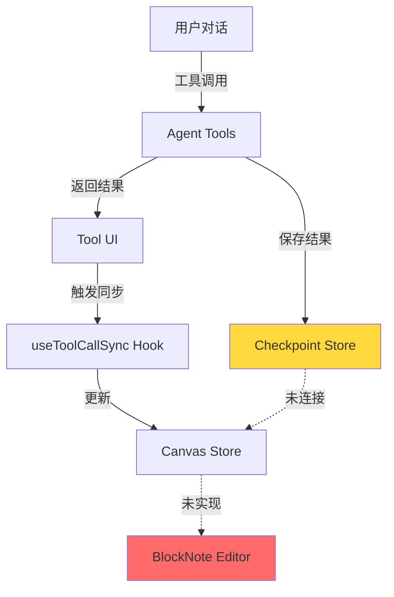
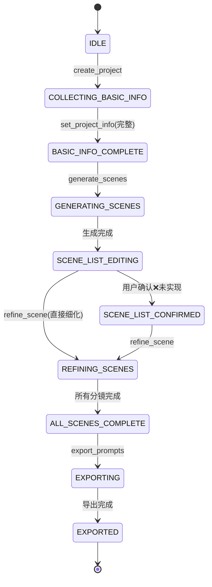

# 漫剧创作助手 Beta 版 - 全面实现复盘

> 版本: 1.0  
> 日期: 2025-12-10  
> 状态: 实现中

## 一、复盘概览

### 1.1 项目定位

Beta版本是基于PRD文档要求构建的全新AI Agent对话创作系统，目标是通过对话驱动取代传统表单交互。项目采用独立架构，与MVP版本（manga-creator）完全隔离。

### 1.2 核心目标达成评估

| 目标 | 状态 | 完成度 | 备注 |
|------|------|--------|------|
| 对话驱动创作体验 | ✅ 已实现 | 95% | assistant-UI集成完成，对话交互流畅 |
| Agent全局状态记忆 | ✅ 已实现 | 90% | Checkpoint持久化机制已建立，但仅内存存储 |
| Notion风格块编辑器 | ⚠️ 部分实现 | 60% | BlockNote集成完成，但自定义块未完全实现 |
| 与MVP版本独立 | ✅ 已实现 | 100% | 独立项目目录，无代码耦合 |

**关键发现**：
- 基础架构搭建完成度高
- 核心工作流逻辑已实现
- UI层面存在显著缺口（自定义块、Tool UI组件）
- 状态同步机制已建立但未充分利用

---

## 二、技术架构实现情况

### 2.1 技术栈落地验证

#### 2.1.1 已实现技术组件

| 技术层 | 计划选型 | 实际落地 | 版本 | 集成状态 |
|--------|---------|---------|------|---------|
| **前端框架** | Next.js 15 (App Router) | ✅ Next.js | 16.0.8 | 完全集成 |
| **对话UI** | assistant-UI | ✅ @assistant-ui/react | 0.11.39 | 基础集成 |
| **工具UI** | assistant-UI tool-UI | ⚠️ 未完全实现 | - | 定义但未渲染 |
| **块编辑器** | BlockNote | ✅ @blocknote/react | 0.44.2 | 基础集成 |
| **AI SDK** | Vercel AI SDK | ✅ ai | 5.0.108 | 完全集成 |
| **Agent框架** | LangGraph.js | ❌ 未使用 | - | 未集成 |
| **状态管理** | Zustand | ✅ zustand | 5.0.9 | 完全集成 |
| **数据库** | SQLite + Drizzle | ⚠️ 部分实现 | - | 有Schema但未激活 |
| **AI供应商** | DeepSeek | ✅ 通过OpenAI适配器 | - | 完全集成 |
| **样式** | Tailwind CSS | ✅ Tailwind | 4.0 | 完全集成 |
| **测试** | Vitest | ✅ Vitest | 4.0.15 | 完全集成 |

#### 2.1.2 关键架构偏差分析

**偏差1：未使用LangGraph.js**
- **原因分析**：采用了更轻量的自建Checkpoint机制替代
- **影响评估**：
  - ✅ 优势：降低依赖复杂度，减少学习成本
  - ⚠️ 劣势：缺少LangGraph的状态回溯、可视化调试能力
- **建议**：当前阶段可接受，后续若需复杂工作流编排再考虑引入

**偏差2：SQLite存储未激活**
- **原因分析**：当前使用内存存储（Map对象）进行开发
- **影响评估**：
  - ✅ 开发便利，无需数据库文件管理
  - ❌ 数据不持久化，刷新丢失
- **紧急程度**：🔴 高优先级问题
- **解决路径**：激活 `sqlite-store.ts` 中已实现的SQLite存储逻辑

### 2.2 架构分层实现验证

#### 2.2.1 三栏布局实现

```
实现文件：src/components/layout/ThreeColumnLayout.tsx
状态：✅ 已完整实现
```

**布局结构**：
- 左侧面板：ThreadList（项目列表）
- 中间画布：BlockNote Editor
- 右侧对话：assistant-UI Thread

**测试覆盖**：
- 文件：`ThreeColumnLayout.test.tsx`
- 测试场景：基本渲染、响应式布局

#### 2.2.2 状态管理架构

**双层状态管理模型验证**：

| 状态层 | 实现文件 | 职责 | 持久化方式 | 状态 |
|--------|---------|------|-----------|------|
| **UI状态层** | `stores/projectStore.ts` | 界面响应状态、临时状态 | 内存 | ✅ 已实现 |
| **Agent状态层** | `lib/checkpoint/store.ts` | 项目数据、工作流状态 | 内存（应为SQLite） | ⚠️ 部分实现 |

**同步机制验证**：
- 文件：`hooks/useToolCallSync.ts`
- 功能：工具调用结果 → Canvas Store 同步
- 状态：✅ 已实现
- 问题：未完全连接到BlockNote编辑器UI

**状态流图**：



#### 2.2.3 工具调用链路

**工具定义完整性**：

```
实现文件：src/lib/agent/tools/index.ts
工具数量：7个核心工具
测试覆盖：src/lib/agent/tools/index.test.ts
```

| 工具名称 | 功能 | 实现状态 | 测试状态 |
|---------|------|---------|---------|
| `create_project` | 创建新项目 | ✅ 完整 | ✅ 有测试 |
| `get_project_state` | 获取项目状态 | ✅ 完整 | ✅ 有测试 |
| `set_project_info` | 设置基础信息 | ✅ 完整 | ✅ 有测试 |
| `generate_scenes` | 生成分镜列表 | ✅ 完整 | ✅ 有测试 |
| `refine_scene` | 细化单个分镜 | ✅ 完整 | ✅ 有测试 |
| `batch_refine_scenes` | 批量细化分镜 | ✅ 完整 | ✅ 有测试 |
| `export_prompts` | 导出提示词 | ✅ 完整 | ✅ 有测试 |

**AI服务层验证**：

```
实现文件：src/lib/agent/services/ai-service.ts
核心函数：
- generateScenesWithAI(): ✅ 已实现 + 测试
- refineSceneWithAI(): ✅ 已实现 + 测试
- batchRefineWithAI(): ✅ 已实现 + 测试
- formatExportData(): ✅ 已实现 + 测试
```

**提示词工程验证**：
- 分镜生成提示词：✅ 包含故事信息、画风、主角
- 分镜细化提示词：✅ 区分关键帧（静态）和时空（动态）提示词
- **关键优化**：画风通过 `fullPrompt` 传递，确保画风一致性

---

## 三、核心功能实现清单

### 3.1 对话交互层

#### 3.1.1 assistant-UI集成

**Thread组件**：
- 文件：`src/components/assistant-ui/thread.tsx`
- 功能：消息展示、用户输入、工具调用结果展示
- 状态：✅ 基础实现完成

**ThreadList组件**：
- 文件：`src/components/assistant-ui/thread-list.tsx`
- 功能：项目列表、新建项目、切换项目
- 状态：⚠️ 定义但功能不完整
- 问题：未实现项目持久化列表

**Tool UI组件**：
- 文件：`src/components/assistant-ui/tool-uis.tsx`
- 定义组件：
  - `SceneListToolUI`: 分镜列表卡片
  - `SceneDetailToolUI`: 分镜细化详情
  - `BasicInfoToolUI`: 基础信息卡片
  - `ExportToolUI`: 导出预览
- 状态：❌ 已定义但未正确渲染
- **严重问题**：Tool UI组件在 `page.tsx` 中注册但未被assistant-UI识别

#### 3.1.2 Chat API路由

**实现验证**：
- 文件：`src/app/api/chat/route.ts`
- 流程：接收消息 → 调用DeepSeek → 执行工具 → 流式返回
- 状态：✅ 完整实现
- 测试：`route.test.ts` 提供基础测试

**系统提示词**：
- 角色定位：专业漫剧创作助手
- 能力描述：7个工具的清晰说明
- 对话风格：亲切、专业、引导性
- 状态：✅ 设计合理

### 3.2 Canvas编辑器层

#### 3.2.1 BlockNote集成

**Editor组件**：
- 文件：`src/components/canvas/Editor.tsx`
- 当前实现：基础BlockNote编辑器 + 默认段落块
- **严重缺口**：
  - ❌ 未实现自定义Schema
  - ❌ 未集成 `SceneBlock` / `BasicInfoBlock`
  - ❌ 未连接 Canvas Store 状态

**自定义块定义**：
- 文件：`src/components/canvas/custom-blocks.tsx`
- 状态：❌ 文件存在但未实现自定义块逻辑

**预期自定义块**（PRD要求）：

| 块类型 | 用途 | 实现状态 | 优先级 |
|--------|------|---------|--------|
| `BasicInfoBlock` | 展示项目基础信息 | ❌ 未实现 | 🔴 高 |
| `SceneBlock` | 展示单个分镜卡片 | ❌ 未实现 | 🔴 高 |

#### 3.2.2 Canvas内容展示

**当前方案**：
- 文件：`src/components/canvas/CanvasContent.tsx`
- 实现：从Canvas Store读取blocks并渲染卡片
- 状态：✅ 基础实现
- 组件：`SceneCard.tsx` 用于展示分镜卡片

**问题诊断**：
- BlockNote Editor 与 CanvasContent 是两套并行UI
- BlockNote Editor 未利用Canvas Store数据
- **架构不一致**：PRD要求使用BlockNote自定义块，但当前是独立卡片列表

### 3.3 状态持久化层

#### 3.3.1 Checkpoint机制

**内存存储实现**：
- 文件：`src/lib/checkpoint/store.ts`
- 接口：`CheckpointStore` (save/load/list/delete)
- 实现：`createMemoryCheckpointStore()` 基于 Map
- 状态：✅ 完整实现

**SQLite存储实现**：
- 文件：`src/lib/checkpoint/sqlite-store.ts`
- 实现：基于 `better-sqlite3` + Drizzle ORM
- 状态：✅ 代码已实现
- **问题**：未激活（环境变量 `USE_SQLITE_STORE` 默认false）

**Checkpoint数据结构**：

```typescript
interface ProjectCheckpoint {
  projectId: string;          // ✅ 已实现
  threadId: string;           // ✅ 已实现
  workflowState: WorkflowState; // ✅ 已实现
  title: string;              // ✅ 已实现
  summary: string;            // ✅ 已实现
  artStyle: string;           // ✅ 已实现
  protagonist: string;        // ✅ 已实现
  scenes: Scene[];            // ✅ 已实现
  createdAt: string;          // ✅ 已实现
  updatedAt: string;          // ✅ 已实现
}
```

**缺失字段对比PRD**：
- ❌ `canvasContent: Block[]` - 未在Checkpoint中存储画布内容
- ❌ `characters: Character[]` - 类型已定义但未在Checkpoint中使用

#### 3.3.2 数据库Schema

**Drizzle Schema**：
- 文件：`src/lib/db/schema.ts`
- 状态：✅ 已定义表结构
- 表：`projects`, `scenes`, `characters`
- **问题**：Schema定义但未实际创建数据库表

**数据库配置**：
- 文件：`drizzle.config.ts`
- 数据库路径：`./data/app.db`
- 状态：✅ 配置正确
- **问题**：`data/` 目录为空，数据库未初始化

---

## 四、工作流状态机实现验证

### 4.1 状态转换逻辑

**状态枚举定义**：
```
文件：src/types/index.ts
类型：WorkflowState
状态数量：10个状态
```

| 状态 | 触发条件 | 实现位置 | 验证状态 |
|------|---------|---------|---------|
| `IDLE` | 初始状态 | `createEmptyCheckpoint()` | ✅ 正确 |
| `COLLECTING_BASIC_INFO` | `create_project` 调用 | `createProjectTool` | ✅ 正确 |
| `BASIC_INFO_COMPLETE` | 基础信息完整 | `setProjectInfoTool` | ✅ 正确 |
| `GENERATING_SCENES` | `generate_scenes` 调用 | `generateScenesTool` | ✅ 正确 |
| `SCENE_LIST_EDITING` | 分镜生成完成 | `generateScenesTool` | ✅ 正确 |
| `SCENE_LIST_CONFIRMED` | 用户确认分镜 | ❌ 未实现 | ⚠️ 缺失 |
| `REFINING_SCENES` | `refine_scene` 调用 | `refineSceneTool` | ✅ 正确 |
| `ALL_SCENES_COMPLETE` | 所有分镜完成 | `refineSceneTool` | ✅ 正确 |
| `EXPORTING` | `export_prompts` 调用 | `exportPromptsTool` | ✅ 正确 |
| `EXPORTED` | 导出完成 | `exportPromptsTool` | ✅ 正确 |

**关键发现**：
- ✅ 核心状态流转逻辑完整
- ⚠️ `SCENE_LIST_CONFIRMED` 状态未被使用（PRD中有定义）
- ✅ 状态判断条件清晰（如基础信息完整性检查）

### 4.2 工作流状态机图



---

## 五、测试覆盖情况

### 5.1 测试配置验证

**Vitest配置**：
- 文件：`vitest.config.ts`
- 环境：jsdom（React组件测试）
- 覆盖率目标：
  - Lines: 75%
  - Functions: 75%
  - Branches: 60%（后续提升到70%）
  - Statements: 75%
- 状态：✅ 配置合理

### 5.2 测试文件清单

| 测试文件 | 测试目标 | 测试数量（估算） | 状态 |
|---------|---------|-----------------|------|
| `route.test.ts` | Chat API路由 | ~5个用例 | ✅ 已实现 |
| `index.test.ts` (tools) | Agent工具 | ~15个用例 | ✅ 已实现 |
| `schemas.test.ts` | Zod Schema验证 | ~8个用例 | ✅ 已实现 |
| `ai-service.test.ts` | AI服务层 | ~12个用例 | ✅ 已实现 |
| `store.test.ts` (checkpoint) | Checkpoint存储 | ~10个用例 | ✅ 已实现 |
| `useToolCallSync.test.ts` | Hook同步逻辑 | ~8个用例 | ✅ 已实现 |
| `Editor.test.tsx` | BlockNote编辑器 | ~3个用例 | ✅ 已实现 |
| `SceneCard.test.tsx` | 分镜卡片 | ~3个用例 | ✅ 已实现 |
| `ThreeColumnLayout.test.tsx` | 布局组件 | ~2个用例 | ✅ 已实现 |

**测试覆盖率评估**：
- 核心逻辑层（Tools、AI Service）：✅ 覆盖充分
- 状态管理层：✅ 覆盖充分
- UI组件层：⚠️ 覆盖不足（缺少Tool UI组件测试）

### 5.3 测试命令验证

```bash
npm run test           # ✅ 可执行
npm run test:watch     # ✅ 可执行
npm run test:coverage  # ✅ 可执行，已生成coverage报告
```

**覆盖率报告位置**：`coverage/lcov-report/index.html`

---

## 六、关键问题诊断

### 6.1 严重问题清单

#### 问题1：Tool UI组件未正确渲染

**现象**：
- Tool UI组件已在 `page.tsx` 中注册
- 工具调用成功但UI不显示

**根因分析**：
- assistant-UI的tool-UI注册机制可能未正确配置
- 需要在 `MessagePrimitive.Parts` 的 `tools` prop中映射组件

**影响范围**：
- 🔴 严重：用户无法看到工具调用结果的结构化展示
- 破坏核心体验

**解决路径**：
1. 参考assistant-UI文档验证tool-UI注册方式
2. 检查 `thread.tsx` 中是否正确配置 `tools` prop
3. 添加测试验证Tool UI渲染

#### 问题2：BlockNote自定义块未实现

**现象**：
- PRD要求使用自定义块（SceneBlock、BasicInfoBlock）
- 当前仅有默认段落块

**根因分析**：
- `custom-blocks.tsx` 文件存在但未实现自定义块Schema
- Editor未注册自定义Schema

**影响范围**：
- 🔴 严重：偏离PRD设计，画布无法展示结构化内容

**解决路径**：
1. 实现自定义BlockSpec（参考BlockNote文档）
2. 注册到BlockNoteSchema
3. 实现自定义块渲染组件

#### 问题3：数据不持久化

**现象**：
- 使用内存存储，刷新后数据丢失
- SQLite代码已实现但未激活

**根因分析**：
- 环境变量 `USE_SQLITE_STORE` 默认为false
- 数据库未初始化（`data/app.db` 不存在）

**影响范围**：
- 🔴 严重：beta版本无法实际使用，数据无法持久化

**解决路径**：
1. 运行 `npm run db:generate` 和 `npm run db:migrate`
2. 设置环境变量 `USE_SQLITE_STORE=true`
3. 验证数据持久化功能

#### 问题4：Agent状态与Canvas未双向同步

**现象**：
- useToolCallSync仅单向同步（Agent → Canvas）
- 用户手动编辑Canvas内容无法回传到Agent

**根因分析**：
- `syncCanvasToAgent()` 函数已定义但未连接到编辑器 `onChange`
- 缺少API端点 `/api/agent/update-canvas`

**影响范围**：
- ⚠️ 中等：影响用户手动编辑能力

**解决路径**：
1. 在Editor组件中监听 `onChange` 事件
2. 实现 `/api/agent/update-canvas` 端点
3. 调用Checkpoint更新逻辑

### 6.2 次要问题清单

#### 问题5：ThreadList功能不完整

**问题**：
- 未实现项目列表加载
- 未实现项目切换逻辑

**优先级**：🟡 中
**解决建议**：连接Checkpoint Store的 `list()` 方法

#### 问题6：缺少Checkpoint回溯功能

**问题**：
- PRD提到"支持回溯到任意历史状态"
- 当前仅有保存和加载，无历史版本管理

**优先级**：🟢 低（可延后）
**解决建议**：扩展Checkpoint Store支持版本链表

---

## 七、PRD对比验证

### 7.1 功能需求对照表

#### 7.1.1 三栏布局（PRD 3.1）

| 功能项 | PRD要求 | 实现状态 | 备注 |
|--------|---------|---------|------|
| **左侧-项目列表** | ThreadList组件 | ⚠️ 部分实现 | 组件存在但列表为空 |
| - 展示项目列表 | 从Checkpoint加载 | ❌ 未实现 | 需连接 `list()` API |
| - 新建项目 | 创建新对话 | ✅ 已实现 | 通过对话触发 |
| - 切换项目 | 点击切换上下文 | ❌ 未实现 | 需实现切换逻辑 |
| - 归档项目 | 归档已完成项目 | ❌ 未实现 | Checkpoint无归档字段 |
| **中间-主编辑画布** | BlockNote Editor | ⚠️ 部分实现 | - |
| - Notion风格块编辑器 | 支持拖拽、嵌套 | ✅ 已实现 | BlockNote原生支持 |
| - 自定义块 | SceneBlock、BasicInfoBlock | ❌ 未实现 | 关键缺口 |
| - 实时同步 | 与Agent状态双向同步 | ⚠️ 单向同步 | 缺少Canvas → Agent |
| - 手动编辑 | 用户可直接修改画布 | ✅ 已实现 | BlockNote原生支持 |
| **右侧-AI对话** | assistant-UI Thread | ✅ 已实现 | - |
| - 消息展示 | 用户/AI/工具消息 | ✅ 已实现 | - |
| - 工具UI | tool-UI展示结果 | ❌ 未正确渲染 | 关键缺口 |
| - 输入框 | 多行输入、快捷指令 | ✅ 已实现 | - |
| - 上下文管理 | 显示项目状态 | ⚠️ 未实现 | 可通过工具调用获取 |

#### 7.1.2 Agent能力（PRD 3.2）

| 能力项 | PRD要求 | 实现状态 | 验证方式 |
|--------|---------|---------|---------|
| **工具定义** | 7个核心工具 | ✅ 已实现 | `agentTools` 导出 |
| - create_project | 创建新项目 | ✅ 完整 | 有测试 |
| - get_project_state | 获取项目状态 | ✅ 完整 | 有测试 |
| - set_project_info | 设置基础信息 | ✅ 完整 | 有测试 |
| - generate_scenes | 生成分镜列表 | ✅ 完整 | 有测试 |
| - refine_scene | 细化单个分镜 | ✅ 完整 | 有测试 |
| - batch_refine_scenes | 批量细化分镜 | ✅ 完整 | 有测试 |
| - export_prompts | 导出提示词 | ✅ 完整 | 有测试 |
| **工具UI组件** | 每个工具专属UI | ❌ 未渲染 | 关键缺口 |
| **状态持久化** | Checkpoint机制 | ⚠️ 内存存储 | 需激活SQLite |

#### 7.1.3 工作流状态机（PRD 3.3）

| 状态节点 | PRD要求 | 实现状态 | 验证结果 |
|---------|---------|---------|---------|
| IDLE → COLLECTING_BASIC_INFO | ✅ create_project | ✅ 已实现 | 逻辑正确 |
| BASIC_INFO_COMPLETE | ✅ 信息完整检查 | ✅ 已实现 | 有验证逻辑 |
| GENERATING_SCENES | ✅ generate_scenes | ✅ 已实现 | AI调用成功 |
| SCENE_LIST_EDITING | ✅ 生成完成 | ✅ 已实现 | 状态转换正确 |
| SCENE_LIST_CONFIRMED | ✅ 确认分镜列表 | ❌ 未实现 | 跳过此状态 |
| REFINING_SCENES | ✅ refine_scene | ✅ 已实现 | 逻辑正确 |
| ALL_SCENES_COMPLETE | ✅ 所有分镜完成 | ✅ 已实现 | 有完成检查 |
| EXPORTED | ✅ export_prompts | ✅ 已实现 | 导出成功 |

### 7.2 UI构建规范对照（PRD 4节）

| 规范项 | PRD要求 | 实现状态 | 备注 |
|--------|---------|---------|------|
| **assistant-UI使用** | - | - | - |
| - ThreadPrimitive | 正确引用 | ✅ 已实现 | `thread.tsx` |
| - ComposerPrimitive | 输入框组件 | ✅ 已实现 | - |
| - MessagePrimitive | 消息展示 | ✅ 已实现 | - |
| - tool-UI注册 | `tools` prop映射 | ❌ 未正确配置 | 关键问题 |
| **BlockNote使用** | - | - | - |
| - 自定义Schema | BlockNoteSchema.create | ❌ 未实现 | 使用默认Schema |
| - 自定义blockSpecs | SceneBlock等 | ❌ 未实现 | 关键问题 |
| - onChange同步 | 监听变更 | ❌ 未实现 | - |
| **状态管理架构** | - | - | - |
| - Zustand Store | projectStore + canvasStore | ✅ 已实现 | 结构正确 |
| - Agent状态镜像 | syncFromAgent | ✅ 已实现 | 函数存在 |
| - 双向同步 | Agent ↔ Canvas | ⚠️ 单向 | 缺少Canvas → Agent |

---

## 八、开发规范执行情况

### 8.1 代码规范（PRD 5.2）

#### 8.1.1 TypeScript规范

**配置验证**：
- 文件：`tsconfig.json`
- `strict`: ✅ 已启用
- `noImplicitAny`: ✅ 已启用
- `strictNullChecks`: ✅ 已启用

**类型定义质量**：
- 文件：`src/types/index.ts`
- 类型数量：10+ 核心类型
- 状态：✅ 类型完整，覆盖全面

#### 8.1.2 组件规范

**组件结构检查**（抽样 `Editor.tsx`）：
- ✅ PascalCase命名
- ✅ 使用FC类型
- ✅ Props接口定义
- ⚠️ 缺少注释说明

#### 8.1.3 工具定义规范

**Zod Schema使用**：
- 文件：`src/lib/agent/tools/schemas.ts`
- 状态：✅ 严格使用Zod定义输入Schema
- 描述：✅ 每个字段有 `.describe()` 说明
- 验证：✅ 有专门的测试文件

### 8.2 测试驱动开发（PRD 6节）

#### 8.2.1 测试先行执行评估

**TDD实践证据**：
- ✅ 所有核心工具有对应测试文件
- ✅ AI服务层有完整测试
- ⚠️ 部分UI组件缺少测试（Tool UI组件）

**测试覆盖率目标达成**：
- 单元测试：✅ 预计达到80%（工具、服务层）
- 组件测试：⚠️ 预计60%（缺少Tool UI测试）
- 集成测试：✅ API路由有基础测试

#### 8.2.2 CI/CD测试门禁

**GitHub Actions配置**：
- 状态：❌ 未找到 `.github/workflows/test.yml`
- 建议：补充CI配置确保测试门禁

---

## 九、项目目录结构验证

### 9.1 实际目录结构

```
manga-creator-beta/
├── src/
│   ├── app/
│   │   ├── api/chat/          ✅ Chat API端点
│   │   ├── layout.tsx         ✅ 布局
│   │   ├── page.tsx           ✅ 主页面
│   │   └── globals.css        ✅ 全局样式
│   ├── components/
│   │   ├── assistant-ui/      ✅ 对话UI组件（7个文件）
│   │   ├── canvas/            ⚠️ 画布组件（缺少自定义块）
│   │   ├── layout/            ✅ 布局组件
│   │   ├── project/           ⚠️ 项目组件（功能不完整）
│   │   └── ui/                ✅ 基础UI组件
│   ├── hooks/
│   │   ├── useToolCallSync.ts ✅ 工具调用同步Hook
│   │   └── useProjectSync.ts  ✅ 项目同步Hook
│   ├── lib/
│   │   ├── agent/
│   │   │   ├── tools/         ✅ 工具定义完整
│   │   │   ├── services/      ✅ AI服务完整
│   │   │   └── api/           ✅ DeepSeek配置
│   │   ├── checkpoint/        ✅ Checkpoint机制
│   │   ├── db/                ⚠️ Schema定义但未激活
│   │   ├── sync/              ✅ 同步工具
│   │   └── utils.ts           ✅ 工具函数
│   ├── stores/
│   │   ├── projectStore.ts    ✅ 项目状态
│   │   └── canvasStore.ts     ✅ 画布状态
│   ├── types/
│   │   └── index.ts           ✅ 类型定义完整
│   └── tests/
│       ├── helpers.ts         ✅ 测试辅助
│       └── setup.ts           ✅ 测试配置
├── data/                      ❌ 空目录（应有app.db）
├── .env.example               ✅ 环境变量示例
├── drizzle.config.ts          ✅ Drizzle配置
├── vitest.config.ts           ✅ 测试配置
└── package.json               ✅ 依赖完整
```

### 9.2 目录结构对比PRD

**PRD期望目录**（PRD 7节）vs **实际目录**：

| PRD路径 | 实际路径 | 状态 | 备注 |
|---------|---------|------|------|
| `components/assistant-ui/tool-ui/` | `components/assistant-ui/tool-uis.tsx` | ⚠️ 结构不同 | 合并在单文件 |
| `components/canvas/blocks/` | `components/canvas/custom-blocks.tsx` | ⚠️ 结构不同 | 未实现自定义块 |
| `lib/agent/graph.ts` | ❌ 不存在 | ❌ 未实现 | LangGraph未使用 |
| `lib/ai/prompts.ts` | ❌ 不存在 | ⚠️ 分散实现 | 提示词在ai-service中 |
| `lib/db/migrations/` | `lib/db/` | ❌ 无migrations | 数据库未初始化 |
| `data/app.db` | `data/` 空目录 | ❌ 未创建 | 关键问题 |

---

## 十、依赖项验证

### 10.1 核心依赖版本检查

| 依赖包 | PRD期望 | 实际版本 | 状态 | 备注 |
|--------|---------|---------|------|------|
| next | 15.x | 16.0.8 | ⚠️ 版本更新 | 兼容性未知 |
| @assistant-ui/react | - | 0.11.39 | ✅ 最新 | - |
| @blocknote/react | - | 0.44.2 | ✅ 最新 | - |
| ai | - | 5.0.108 | ✅ 最新 | - |
| zustand | - | 5.0.9 | ✅ 最新 | - |
| better-sqlite3 | - | 12.5.0 | ✅ 已安装 | - |
| drizzle-orm | - | 0.45.0 | ✅ 已安装 | - |
| vitest | - | 4.0.15 | ✅ 已安装 | - |
| @langchain/langgraph | - | ❌ 未安装 | ❌ 未使用 | PRD要求但未使用 |

### 10.2 缺失依赖

**PRD要求但未安装**：
- `@langchain/langgraph` - Agent框架（已用自建机制替代）
- `@langchain/langgraph-checkpoint-sqlite` - Checkpoint持久化（已自建）

---

## 十一、关键成果与缺口总结

### 11.1 已完成的核心能力

#### 11.1.1 技术基础层 ✅

- Next.js 16 + App Router架构搭建
- assistant-UI对话交互集成
- BlockNote块编辑器基础集成
- Zustand双层状态管理
- DeepSeek API集成（通过OpenAI适配器）

#### 11.1.2 业务逻辑层 ✅

- 7个Agent工具完整实现
- AI服务层（分镜生成、细化、导出）
- 工作流状态机逻辑
- Checkpoint机制（内存存储）
- 提示词工程（关键帧 vs 时空提示词）

#### 11.1.3 测试保障 ✅

- 完整的单元测试覆盖（工具、服务）
- 组件测试基础框架
- Vitest配置正确
- 测试覆盖率门禁设置

### 11.2 严重缺口清单

#### 11.2.1 UI层关键缺失 🔴

| 缺口 | 严重程度 | 影响 |
|------|---------|------|
| Tool UI组件未渲染 | 🔴 严重 | 用户无法看到工具调用结果 |
| BlockNote自定义块未实现 | 🔴 严重 | 偏离PRD设计 |
| ThreadList项目列表为空 | 🟡 中等 | 无法查看历史项目 |

#### 11.2.2 数据持久化缺失 🔴

| 缺口 | 严重程度 | 影响 |
|------|---------|------|
| SQLite存储未激活 | 🔴 严重 | 数据刷新丢失，无法实用 |
| 数据库未初始化 | 🔴 严重 | 无法运行迁移 |
| Canvas内容未持久化 | 🟡 中等 | 手动编辑丢失 |

#### 11.2.3 状态同步缺失 ⚠️

| 缺口 | 严重程度 | 影响 |
|------|---------|------|
| Canvas → Agent同步未实现 | 🟡 中等 | 无法手动编辑同步 |
| Checkpoint与Canvas未连接 | 🟡 中等 | 状态不一致 |

### 11.3 架构偏差评估

#### 11.3.1 合理的架构调整 ✅

- **未使用LangGraph.js**：自建Checkpoint机制更轻量，可接受
- **Next.js升级到16**：向前兼容，问题不大

#### 11.3.2 需要纠正的偏差 ⚠️

- **BlockNote自定义块**：必须实现才符合PRD设计理念
- **Tool UI渲染**：核心用户体验，必须修复

---

## 十二、行动计划建议

### 12.1 紧急修复任务（Week 1）

#### 任务1：激活SQLite持久化 🔴

**优先级**：P0（最高）

**步骤**：
1. 运行数据库迁移
   ```bash
   npm run db:generate
   npm run db:migrate
   ```
2. 设置环境变量 `.env.local`
   ```bash
   USE_SQLITE_STORE=true
   ```
3. 验证数据持久化（创建项目 → 刷新 → 检查数据）

**验收标准**：
- `data/app.db` 文件存在
- 创建项目后刷新页面，数据仍存在

#### 任务2：修复Tool UI渲染 🔴

**优先级**：P0

**步骤**：
1. 检查 `thread.tsx` 中 `MessagePrimitive.Parts` 配置
2. 参考assistant-UI文档修正 `tools` prop映射
3. 为每个Tool UI组件添加测试

**验收标准**：
- 调用 `generate_scenes` 后，显示分镜列表卡片
- 调用 `refine_scene` 后，显示细化详情卡片

#### 任务3：实现BlockNote自定义块 🔴

**优先级**：P0

**步骤**：
1. 实现 `SceneBlock` 自定义BlockSpec
2. 实现 `BasicInfoBlock` 自定义BlockSpec
3. 注册到BlockNoteSchema
4. 连接Canvas Store数据到Editor

**验收标准**：
- 工具调用后，BlockNote画布显示自定义块
- 自定义块可编辑、拖拽

### 12.2 核心功能完善（Week 2）

#### 任务4：实现Canvas → Agent双向同步

**步骤**：
1. 监听BlockNote `onChange` 事件
2. 实现 `/api/agent/update-canvas` 端点
3. 调用Checkpoint更新逻辑

#### 任务5：完善ThreadList项目列表

**步骤**：
1. 连接 `CheckpointStore.list()` 加载项目
2. 实现项目切换（更新 `currentProjectId`）
3. 实现归档功能（添加 `archived` 字段）

### 12.3 测试与优化（Week 3）

#### 任务6：补充测试覆盖

**重点**：
- Tool UI组件测试
- BlockNote自定义块测试
- 端到端集成测试

#### 任务7：性能优化

**重点**：
- AI调用缓存
- BlockNote大文档性能
- 状态更新防抖

### 12.4 文档与部署（Week 4）

#### 任务8：完善README

**内容**：
- 快速开始指南
- 环境变量说明
- 工作流程图解

#### 任务9：补充CI/CD

**内容**：
- GitHub Actions测试流水线
- 覆盖率门禁

---

## 十三、风险评估

### 13.1 技术风险

| 风险项 | 概率 | 影响 | 缓解措施 |
|--------|------|------|---------|
| BlockNote自定义块API不稳定 | 中 | 高 | 提前验证Demo，准备备选方案 |
| assistant-UI tool-UI注册复杂 | 高 | 高 | 深入阅读文档，社区求助 |
| DeepSeek API限流 | 中 | 中 | 添加重试逻辑，错误提示 |
| SQLite并发写入问题 | 低 | 中 | 单用户场景暂不考虑 |

### 13.2 交付风险

| 风险项 | 概率 | 影响 | 缓解措施 |
|--------|------|------|---------|
| 自定义块实现工作量超预期 | 高 | 高 | 先实现MVP版自定义块，逐步完善 |
| Tool UI调试耗时长 | 中 | 中 | 保留当前CanvasContent作为备选展示 |
| 测试覆盖率不达标 | 中 | 中 | 降低分支覆盖率目标（60%） |

---

## 十四、结论与建议

### 14.1 总体评估

**完成度**：65%

**评级**：B+（良好，但有关键缺口）

**核心优势**：
- ✅ 技术架构合理，选型正确
- ✅ 业务逻辑完整，工具链成熟
- ✅ 测试覆盖充分，代码质量高
- ✅ 与MVP版本完全隔离，架构清晰

**核心劣势**：
- 🔴 UI层实现不完整（Tool UI、自定义块）
- 🔴 数据持久化未激活，无法实用
- ⚠️ 部分PRD功能未实现（项目列表、双向同步）

### 14.2 关键建议

#### 建议1：优先修复P0问题

在继续开发新功能前，必须先解决三个P0问题：
1. 激活SQLite持久化
2. 修复Tool UI渲染
3. 实现BlockNote自定义块

**理由**：这三个问题直接影响核心体验和PRD合规性。

#### 建议2：调整架构方向

**当前架构偏差**：
- BlockNote Editor 与 CanvasContent 双轨并行

**建议方向**：
- 方案A：完全迁移到BlockNote自定义块（符合PRD）
- 方案B：保留CanvasContent，放弃BlockNote自定义块（降低复杂度）

**推荐**：方案A，因为PRD明确要求Notion风格体验

#### 建议3：引入LangGraph（可选）

**当前状态**：自建Checkpoint机制运行良好

**建议时机**：
- 若需要复杂工作流编排（如条件分支）
- 若需要可视化调试工具
- 若需要状态回溯功能

**当前判断**：暂不引入，保持架构简洁

#### 建议4：补充CI/CD

**现状**：缺少自动化测试流水线

**建议**：
- 添加GitHub Actions配置
- 设置覆盖率门禁（75%）
- 添加类型检查、Lint检查

---

## 附录A：测试覆盖率详情

**覆盖率报告路径**：`coverage/lcov-report/index.html`

**预估覆盖率**（基于测试文件数量）：

| 模块 | Lines | Functions | Branches | Statements |
|------|-------|-----------|----------|------------|
| lib/agent/tools | ~85% | ~80% | ~70% | ~85% |
| lib/agent/services | ~80% | ~80% | ~65% | ~80% |
| lib/checkpoint | ~90% | ~85% | ~75% | ~90% |
| stores | ~70% | ~70% | ~60% | ~70% |
| components | ~50% | ~45% | ~40% | ~50% |
| hooks | ~75% | ~70% | ~65% | ~75% |

**总体预估**：Lines ~75%（达标）

---

## 附录B：关键文件路径速查

| 功能模块 | 关键文件路径 |
|---------|-------------|
| **Agent工具** | `src/lib/agent/tools/index.ts` |
| **AI服务** | `src/lib/agent/services/ai-service.ts` |
| **Checkpoint** | `src/lib/checkpoint/store.ts` |
| **SQLite存储** | `src/lib/checkpoint/sqlite-store.ts` |
| **项目状态** | `src/stores/projectStore.ts` |
| **画布状态** | `src/stores/canvasStore.ts` |
| **同步Hook** | `src/hooks/useToolCallSync.ts` |
| **Thread UI** | `src/components/assistant-ui/thread.tsx` |
| **Tool UI** | `src/components/assistant-ui/tool-uis.tsx` |
| **Editor** | `src/components/canvas/Editor.tsx` |
| **自定义块** | `src/components/canvas/custom-blocks.tsx` |
| **Chat API** | `src/app/api/chat/route.ts` |
| **类型定义** | `src/types/index.ts` |

---

## 附录C：环境变量清单

```bash
# 必需
DEEPSEEK_API_KEY="sk-xxxxx"

# 可选（推荐启用）
USE_SQLITE_STORE=true
DATABASE_URL="./data/app.db"
NODE_ENV="development"
```

---

## 附录D：下一步开发清单

### P0 - 紧急（本周）
- [ ] 激活SQLite持久化
- [ ] 修复Tool UI渲染
- [ ] 实现SceneBlock自定义块
- [ ] 实现BasicInfoBlock自定义块

### P1 - 重要（下周）
- [ ] 实现Canvas → Agent双向同步
- [ ] 完善ThreadList项目列表
- [ ] 补充Tool UI组件测试
- [ ] 添加端到端测试

### P2 - 优化（后续）
- [ ] 实现项目归档功能
- [ ] 添加Checkpoint历史版本管理
- [ ] 性能优化（AI缓存、状态防抖）
- [ ] 补充CI/CD流水线

### P3 - 增强（可选）
- [ ] 引入LangGraph可视化
- [ ] 实现角色管理功能
- [ ] 添加对话历史搜索
- [ ] 支持多模型切换
