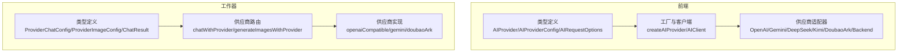
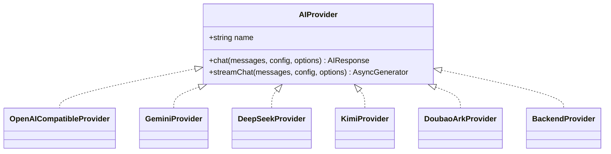
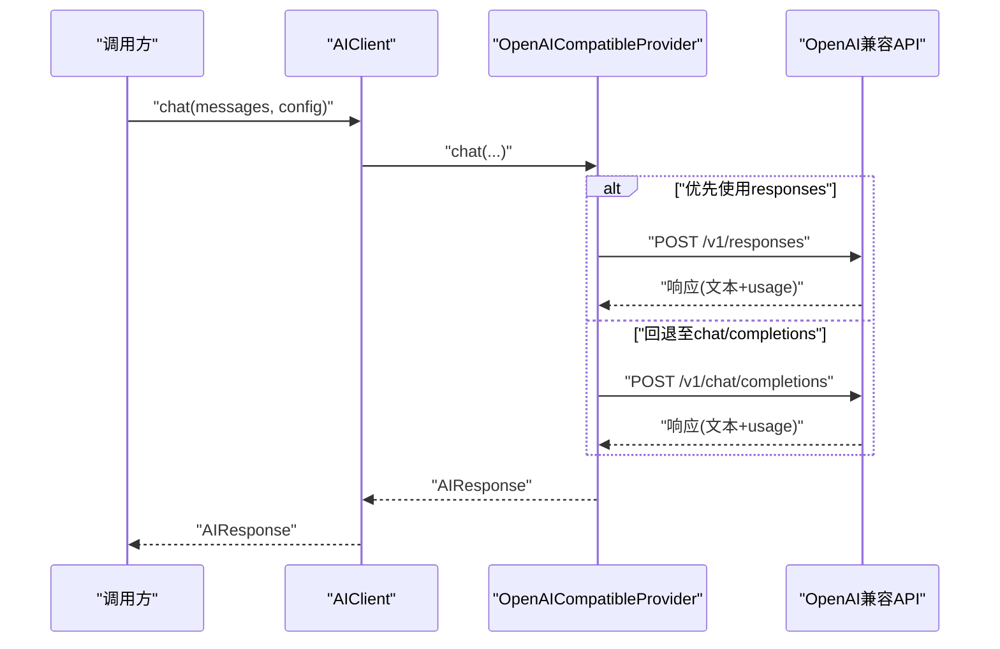
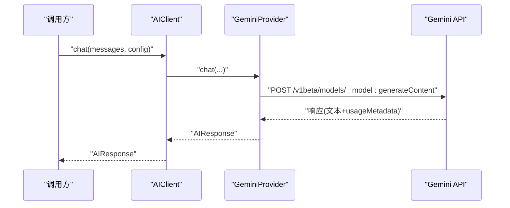
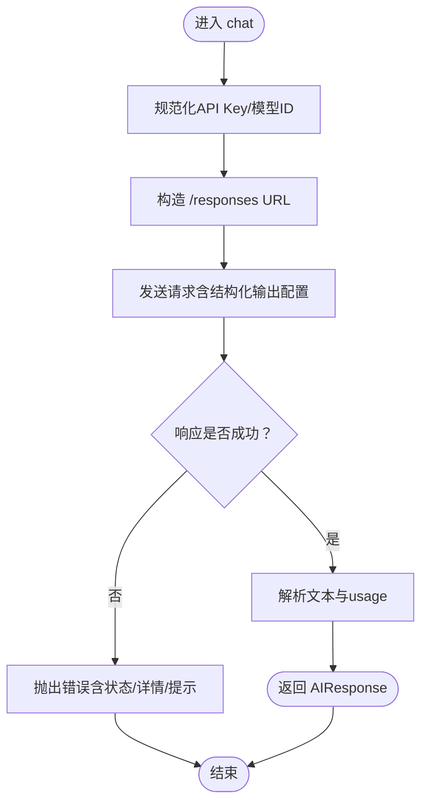
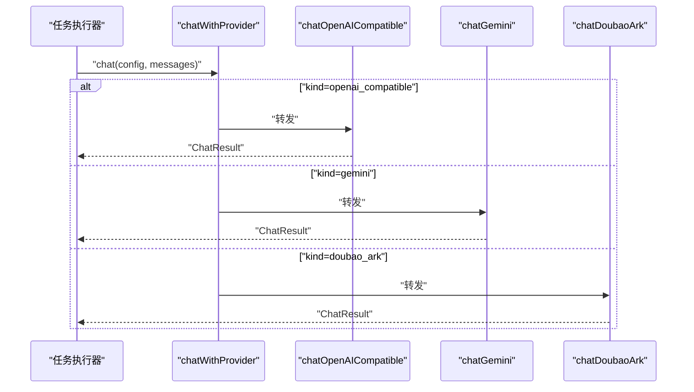
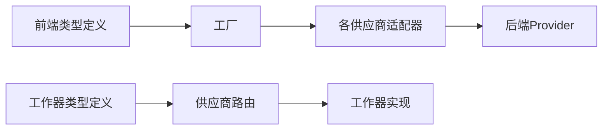

# AI供应商支持

<cite>
**本文引用的文件**
- [apps/web/src/lib/ai/types.ts](file://apps/web/src/lib/ai/types.ts)
- [apps/web/src/lib/ai/factory.ts](file://apps/web/src/lib/ai/factory.ts)
- [apps/web/src/lib/ai/providers/backend.ts](file://apps/web/src/lib/ai/providers/backend.ts)
- [apps/web/src/lib/ai/providers/openai.ts](file://apps/web/src/lib/ai/providers/openai.ts)
- [apps/web/src/lib/ai/providers/gemini.ts](file://apps/web/src/lib/ai/providers/gemini.ts)
- [apps/web/src/lib/ai/providers/deepseek.ts](file://apps/web/src/lib/ai/providers/deepseek.ts)
- [apps/web/src/lib/ai/providers/kimi.ts](file://apps/web/src/lib/ai/providers/kimi.ts)
- [apps/web/src/lib/ai/providers/doubaoArk.ts](file://apps/web/src/lib/ai/providers/doubaoArk.ts)
- [apps/worker/src/providers/index.ts](file://apps/worker/src/providers/index.ts)
- [apps/worker/src/providers/openaiCompatible.ts](file://apps/worker/src/providers/openaiCompatible.ts)
- [apps/worker/src/providers/gemini.ts](file://apps/worker/src/providers/gemini.ts)
- [apps/worker/src/providers/doubaoArk.ts](file://apps/worker/src/providers/doubaoArk.ts)
- [apps/worker/src/providers/types.ts](file://apps/worker/src/providers/types.ts)
- [apps/web/src/types/index.ts](file://apps/web/src/types/index.ts)
- [packages/shared/src/schemas/aiProfile.ts](file://packages/shared/src/schemas/aiProfile.ts)
</cite>

## 目录

1. [简介](#简介)
2. [项目结构](#项目结构)
3. [核心组件](#核心组件)
4. [架构总览](#架构总览)
5. [详细组件分析](#详细组件分析)
6. [依赖关系分析](#依赖关系分析)
7. [性能考虑](#性能考虑)
8. [故障排查指南](#故障排查指南)
9. [结论](#结论)
10. [附录](#附录)

## 简介

本技术文档面向AIXSSS的AI供应商支持模块，系统性阐述多供应商统一抽象与适配实现，覆盖OpenAI、Gemini、DeepSeek、Kimi、Doubao Ark等供应商的API适配器设计、参数映射与响应处理机制。文档同时解释统一的AI服务抽象接口、请求构建、响应解析与错误处理的标准化流程，并给出供应商选择策略、兼容性与限制说明、最佳实践与性能成本考量。

## 项目结构

前端与工作器两端分别实现了统一的AI抽象与供应商适配层：

- 前端（apps/web）：定义统一接口与工厂，封装各供应商适配器，支持后端模式（通过服务端档案调用）与本地模式（直连供应商）。
- 工作器（apps/worker）：提供与前端一致的供应商路由与实现，负责任务执行与图片生成功能。

图表来源

- [apps/web/src/lib/ai/types.ts](file://apps/web/src/lib/ai/types.ts#L1-L30)
- [apps/web/src/lib/ai/factory.ts](file://apps/web/src/lib/ai/factory.ts#L1-L98)
- [apps/worker/src/providers/types.ts](file://apps/worker/src/providers/types.ts#L1-L84)
- [apps/worker/src/providers/index.ts](file://apps/worker/src/providers/index.ts#L1-L44)

章节来源

- [apps/web/src/lib/ai/types.ts](file://apps/web/src/lib/ai/types.ts#L1-L30)
- [apps/web/src/lib/ai/factory.ts](file://apps/web/src/lib/ai/factory.ts#L1-L98)
- [apps/worker/src/providers/types.ts](file://apps/worker/src/providers/types.ts#L1-L84)
- [apps/worker/src/providers/index.ts](file://apps/worker/src/providers/index.ts#L1-L44)

## 核心组件

- 统一接口与配置
  - AIProvider：定义标准能力（同步对话与流式对话）、名称标识。
  - AIProviderConfig：包含供应商类型、API Key、基础URL、模型、生成参数。
  - AIRequestOptions：可选信号量与任务ID（用于流式输出进度桥接）。
- 工厂与客户端
  - createAIProvider：根据供应商类型实例化对应适配器。
  - AIClient：封装具体适配器，提供统一的chat/streamChat入口，并在流式场景下桥接进度存储。
- 后端模式
  - BackendProvider：在浏览器侧不持有API Key，通过aiProfileId走服务端调用，简化密钥管理与安全。

章节来源

- [apps/web/src/lib/ai/types.ts](file://apps/web/src/lib/ai/types.ts#L1-L30)
- [apps/web/src/lib/ai/factory.ts](file://apps/web/src/lib/ai/factory.ts#L12-L98)
- [apps/web/src/lib/ai/providers/backend.ts](file://apps/web/src/lib/ai/providers/backend.ts#L1-L25)

## 架构总览

统一抽象与适配器的交互关系如下：

图表来源

- [apps/web/src/lib/ai/types.ts](file://apps/web/src/lib/ai/types.ts#L17-L29)
- [apps/web/src/lib/ai/providers/openai.ts](file://apps/web/src/lib/ai/providers/openai.ts#L171-L384)
- [apps/web/src/lib/ai/providers/gemini.ts](file://apps/web/src/lib/ai/providers/gemini.ts#L4-L172)
- [apps/web/src/lib/ai/providers/deepseek.ts](file://apps/web/src/lib/ai/providers/deepseek.ts#L4-L140)
- [apps/web/src/lib/ai/providers/kimi.ts](file://apps/web/src/lib/ai/providers/kimi.ts#L6-L164)
- [apps/web/src/lib/ai/providers/doubaoArk.ts](file://apps/web/src/lib/ai/providers/doubaoArk.ts#L103-L186)
- [apps/web/src/lib/ai/providers/backend.ts](file://apps/web/src/lib/ai/providers/backend.ts#L5-L24)

章节来源

- [apps/web/src/lib/ai/types.ts](file://apps/web/src/lib/ai/types.ts#L17-L29)
- [apps/web/src/lib/ai/providers/openai.ts](file://apps/web/src/lib/ai/providers/openai.ts#L171-L384)
- [apps/web/src/lib/ai/providers/gemini.ts](file://apps/web/src/lib/ai/providers/gemini.ts#L4-L172)
- [apps/web/src/lib/ai/providers/deepseek.ts](file://apps/web/src/lib/ai/providers/deepseek.ts#L4-L140)
- [apps/web/src/lib/ai/providers/kimi.ts](file://apps/web/src/lib/ai/providers/kimi.ts#L6-L164)
- [apps/web/src/lib/ai/providers/doubaoArk.ts](file://apps/web/src/lib/ai/providers/doubaoArk.ts#L103-L186)
- [apps/web/src/lib/ai/providers/backend.ts](file://apps/web/src/lib/ai/providers/backend.ts#L5-L24)

## 详细组件分析

### OpenAI兼容适配器（Web端）

- 设计要点
  - 支持两种端点：chat/completions与responses。针对特定模型（如GPT-5、o系列）优先使用responses以获得更好的结构化输出与推理能力。
  - 参数映射：温度、采样、惩罚项、最大令牌数等；对不同端点进行参数安全映射（如responses偏好max_completion_tokens）。
  - 错误处理：统一抛出包含状态码与详情的错误对象，便于上层捕获与展示。
  - 流式输出：当模型不支持流式或端点不支持时，回退为非流式一次性返回。
- 特殊逻辑
  - 推理强度归一化：针对不同模型族（GPT-5、o系列）对reasoningEffort进行兼容映射。
  - 端点/模型不支持检测：当返回404/400且命中特定关键词时，自动在chat与responses之间回退。
- 数据结构
  - 请求体：messages或input；generation参数按端点要求映射。
  - 响应体：content与usage（prompt/completion/total）。

图表来源

- [apps/web/src/lib/ai/providers/openai.ts](file://apps/web/src/lib/ai/providers/openai.ts#L197-L308)
- [apps/web/src/lib/ai/factory.ts](file://apps/web/src/lib/ai/factory.ts#L43-L45)

章节来源

- [apps/web/src/lib/ai/providers/openai.ts](file://apps/web/src/lib/ai/providers/openai.ts#L1-L384)

### Gemini适配器（Web端）

- 设计要点
  - 使用generateContent与streamGenerateContent端点；消息格式转换为contents/parts结构；系统消息作为第一条user消息注入。
  - 参数映射：generationConfig.temperature/topP/maxOutputTokens。
  - 错误处理：统一抛出包含状态与详情的错误。
  - 流式输出：解析SSE数据帧，逐段产出文本。
- 数据结构
  - 请求体：contents数组与generationConfig。
  - 响应体：candidates[0].content.parts[0].text；usageMetadata包含token统计。

图表来源

- [apps/web/src/lib/ai/providers/gemini.ts](file://apps/web/src/lib/ai/providers/gemini.ts#L58-L106)
- [apps/web/src/lib/ai/factory.ts](file://apps/web/src/lib/ai/factory.ts#L43-L45)

章节来源

- [apps/web/src/lib/ai/providers/gemini.ts](file://apps/web/src/lib/ai/providers/gemini.ts#L1-L172)

### DeepSeek适配器（Web端）

- 设计要点
  - 使用/chat/completions端点；参数映射：temperature/top_p/max_tokens、惩罚项。
  - 错误处理：统一抛出包含状态与详情的错误。
  - 流式输出：解析SSE数据帧，逐段产出文本。
- 数据结构
  - 请求体：messages与generation参数。
  - 响应体：choices[0].message.content与usage。

章节来源

- [apps/web/src/lib/ai/providers/deepseek.ts](file://apps/web/src/lib/ai/providers/deepseek.ts#L1-L140)

### Kimi适配器（Web端）

- 设计要点
  - 使用/moonshot.cn域的/chat/completions端点；对“thinking”模型进行特殊参数处理（温度与最大tokens）。
  - 错误处理：记录状态与响应体并抛出错误。
  - 流式输出：解析SSE数据帧，逐段产出文本。
- 数据结构
  - 请求体：model、messages与generation参数。
  - 响应体：choices[0].message.content与usage。

章节来源

- [apps/web/src/lib/ai/providers/kimi.ts](file://apps/web/src/lib/ai/providers/kimi.ts#L1-L164)

### Doubao/ARK适配器（Web端）

- 设计要点
  - 使用/responses端点；对API Key与模型ID进行规范化处理（去除Bearer前缀、提取接入点ID等）。
  - 参数映射：temperature/top_p/max_output_tokens；支持结构化输出（JSON Object/JSON Schema）。
  - 错误处理：针对401/403提供明确提示（需使用“方舟控制台”生成的API Key）。
  - 流式输出：当前实现为非流式兜底。
- 数据结构
  - 请求体：input/messages、generation参数与text.format（结构化输出）。
  - 响应体：output_text或output[].content[]的拼接文本；usage包含prompt/total等。

图表来源

- [apps/web/src/lib/ai/providers/doubaoArk.ts](file://apps/web/src/lib/ai/providers/doubaoArk.ts#L132-L174)

章节来源

- [apps/web/src/lib/ai/providers/doubaoArk.ts](file://apps/web/src/lib/ai/providers/doubaoArk.ts#L1-L186)

### 工作器端适配器

- 供应商路由
  - chatWithProvider：根据kind分发到openaiCompatible/gemini/doubaoArk。
  - generateImagesWithProvider：根据kind分发到对应图片生成实现。
- 类型与参数
  - ProviderChatConfig/ProviderImageConfig：统一的供应商配置与生成参数类型。
  - GenerationParams：包含reasoningEffort（仅推理类模型在Responses API有效）。
- 实现差异
  - openaiCompatible：与前端类似，优先responses，支持结构化输出回退。
  - gemini：使用generateContent端点，支持generationConfig。
  - doubaoArk：使用/responses与/images/generations端点，支持结构化输出与图片生成。

图表来源

- [apps/worker/src/providers/index.ts](file://apps/worker/src/providers/index.ts#L12-L25)
- [apps/worker/src/providers/openaiCompatible.ts](file://apps/worker/src/providers/openaiCompatible.ts#L275-L389)
- [apps/worker/src/providers/gemini.ts](file://apps/worker/src/providers/gemini.ts#L81-L122)
- [apps/worker/src/providers/doubaoArk.ts](file://apps/worker/src/providers/doubaoArk.ts#L210-L251)

章节来源

- [apps/worker/src/providers/index.ts](file://apps/worker/src/providers/index.ts#L1-L44)
- [apps/worker/src/providers/openaiCompatible.ts](file://apps/worker/src/providers/openaiCompatible.ts#L1-L438)
- [apps/worker/src/providers/gemini.ts](file://apps/worker/src/providers/gemini.ts#L1-L125)
- [apps/worker/src/providers/doubaoArk.ts](file://apps/worker/src/providers/doubaoArk.ts#L1-L301)
- [apps/worker/src/providers/types.ts](file://apps/worker/src/providers/types.ts#L1-L84)

## 依赖关系分析

- 前端依赖
  - 类型定义与工厂依赖于各供应商适配器。
  - BackendProvider依赖后端API（通过LLM聊天接口）。
- 工作器依赖
  - 供应商路由依赖具体实现模块。
  - 统一的类型定义确保前后端参数契约一致。
- 外部依赖
  - 各供应商HTTP API端点与认证方式（Bearer Key、API Key Header等）。

图表来源

- [apps/web/src/lib/ai/types.ts](file://apps/web/src/lib/ai/types.ts#L1-L30)
- [apps/web/src/lib/ai/factory.ts](file://apps/web/src/lib/ai/factory.ts#L1-L98)
- [apps/worker/src/providers/types.ts](file://apps/worker/src/providers/types.ts#L1-L84)
- [apps/worker/src/providers/index.ts](file://apps/worker/src/providers/index.ts#L1-L44)

章节来源

- [apps/web/src/lib/ai/types.ts](file://apps/web/src/lib/ai/types.ts#L1-L30)
- [apps/web/src/lib/ai/factory.ts](file://apps/web/src/lib/ai/factory.ts#L1-L98)
- [apps/worker/src/providers/types.ts](file://apps/worker/src/providers/types.ts#L1-L84)
- [apps/worker/src/providers/index.ts](file://apps/worker/src/providers/index.ts#L1-L44)

## 性能考虑

- 超时与中断
  - 工作器端统一通过AbortController设置请求超时（默认120秒，可通过环境变量调整），避免长时间阻塞。
- 端点选择与回退
  - 优先使用responses端点（适用于GPT-5、o系列等）以提升结构化输出质量与推理能力；当端点或模型不支持时自动回退至chat/completions。
- 流式输出
  - 在供应商不支持流式或端点不支持时，采用非流式兜底，保证可用性；前端AIClient在流式场景下会桥接进度存储。
- Token统计
  - 统一映射usage字段，兼容不同供应商的命名差异（prompt_tokens/input_tokens等），便于成本与性能分析。

章节来源

- [apps/worker/src/providers/openaiCompatible.ts](file://apps/worker/src/providers/openaiCompatible.ts#L52-L76)
- [apps/web/src/lib/ai/providers/openai.ts](file://apps/web/src/lib/ai/providers/openai.ts#L289-L308)
- [apps/web/src/lib/ai/factory.ts](file://apps/web/src/lib/ai/factory.ts#L47-L74)

## 故障排查指南

- 常见错误与定位
  - 401/403：Doubao/ARK需使用“方舟控制台”生成的API Key，且不要包含Bearer前缀或多余空白字符。
  - 400/404：当提示必须使用responses或chat不支持时，系统会自动回退；若仍失败，请检查模型与端点支持情况。
  - 超时：检查网络/VPN/供应商可用性，必要时提高AI_REQUEST_TIMEOUT_MS。
- 建议排查步骤
  - 确认API Key与模型ID规范化（Doubao/ARK）。
  - 检查供应商端点支持与参数兼容性（reasoningEffort、max_tokens映射）。
  - 观察错误对象中的状态码与详情，结合日志定位问题。
- 前端模式与后端模式
  - 前端模式需完整配置provider、apiKey、model；后端模式需绑定aiProfileId并通过服务端调用。

章节来源

- [apps/web/src/lib/ai/providers/doubaoArk.ts](file://apps/web/src/lib/ai/providers/doubaoArk.ts#L106-L130)
- [apps/web/src/lib/ai/providers/openai.ts](file://apps/web/src/lib/ai/providers/openai.ts#L139-L169)
- [apps/worker/src/providers/openaiCompatible.ts](file://apps/worker/src/providers/openaiCompatible.ts#L209-L243)
- [apps/web/src/lib/ai/factory.ts](file://apps/web/src/lib/ai/factory.ts#L77-L96)

## 结论

该模块通过统一的AIProvider接口与工厂模式，将多家供应商的差异封装在适配器内部，实现了跨供应商的一致调用体验。前端与工作器两端保持参数与行为一致，既满足本地直连的灵活性，又支持后端模式的安全与集中管理。通过端点优选与自动回退、流式兜底与统一错误处理，系统在兼容性与可用性方面表现稳健。

## 附录

### 供应商特性与限制速览

- OpenAI兼容
  - 优势：端点丰富，结构化输出支持好；对GPT-5/o系列优先使用responses。
  - 限制：部分兼容服务对response_format不支持，需回退处理。
- Gemini
  - 优势：生成配置完善，usageMetadata直观。
  - 限制：需使用API Key Header，消息格式需转换。
- DeepSeek
  - 优势：参数与OpenAI兼容度高。
  - 限制：需关注端点与参数映射。
- Kimi
  - 优势：对“thinking”模型有特殊参数优化。
  - 限制：需遵循其温度与最大tokens策略。
- Doubao/ARK
  - 优势：支持responses与图片生成；结构化输出能力较强。
  - 限制：API Key与模型ID需规范化；对401/403有明确提示。

章节来源

- [apps/web/src/lib/ai/providers/openai.ts](file://apps/web/src/lib/ai/providers/openai.ts#L51-L85)
- [apps/web/src/lib/ai/providers/gemini.ts](file://apps/web/src/lib/ai/providers/gemini.ts#L19-L39)
- [apps/web/src/lib/ai/providers/kimi.ts](file://apps/web/src/lib/ai/providers/kimi.ts#L16-L29)
- [apps/web/src/lib/ai/providers/doubaoArk.ts](file://apps/web/src/lib/ai/providers/doubaoArk.ts#L29-L45)

### 供应商切换与配置最佳实践

- 选择策略
  - 优先考虑结构化输出需求与推理能力：GPT-5/o系列优先responses；Doubao/ARK对结构化输出友好。
  - 成本与性能：参考定价schema（按千token计价），结合token统计进行成本评估。
- 配置建议
  - 前端模式：确保provider、apiKey、model完整；必要时设置baseURL。
  - 后端模式：绑定aiProfileId，避免在前端暴露密钥。
- 兼容性与稳定性
  - 开启自动回退（chat/responses）以增强兼容性。
  - 为长耗时任务设置合理超时与重试策略。

章节来源

- [packages/shared/src/schemas/aiProfile.ts](file://packages/shared/src/schemas/aiProfile.ts#L1-L11)
- [apps/web/src/lib/ai/factory.ts](file://apps/web/src/lib/ai/factory.ts#L77-L96)
- [apps/worker/src/providers/openaiCompatible.ts](file://apps/worker/src/providers/openaiCompatible.ts#L361-L388)
