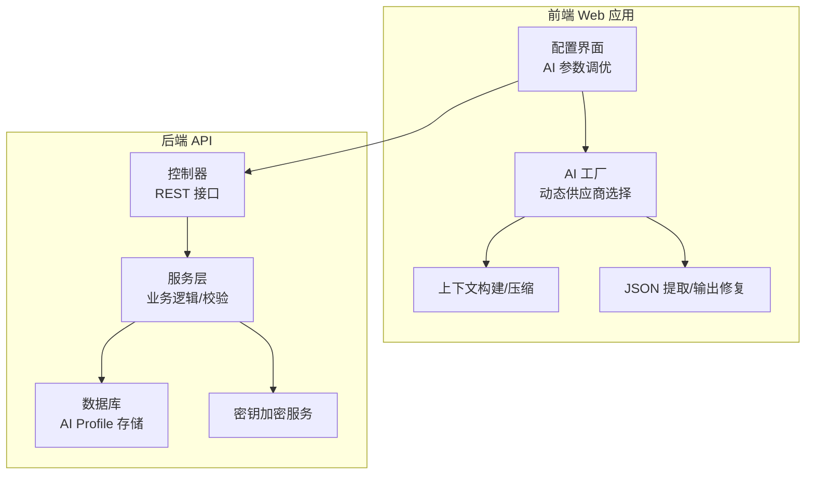
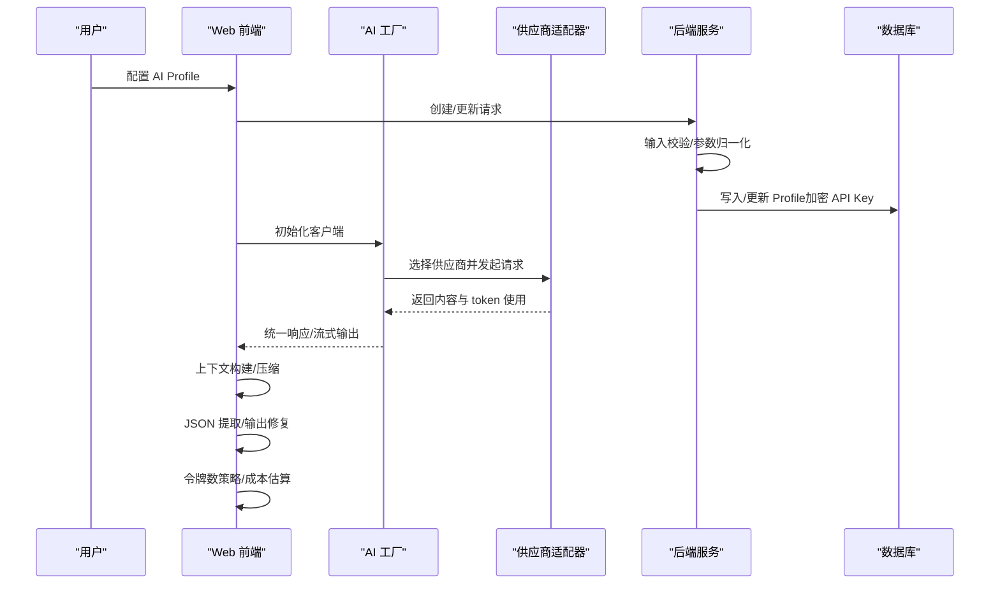
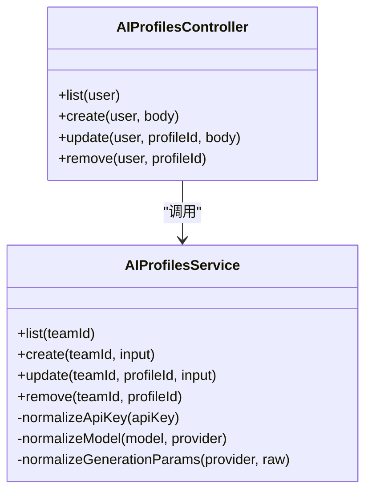
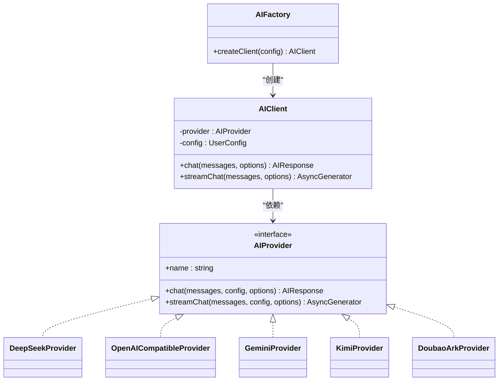
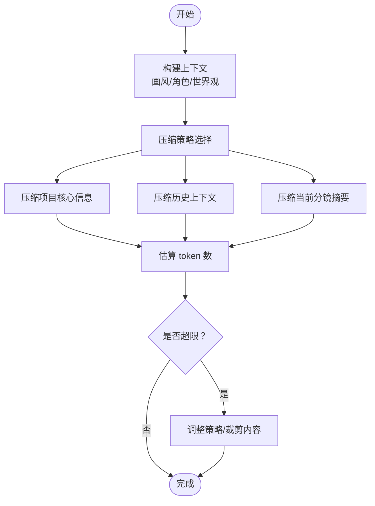
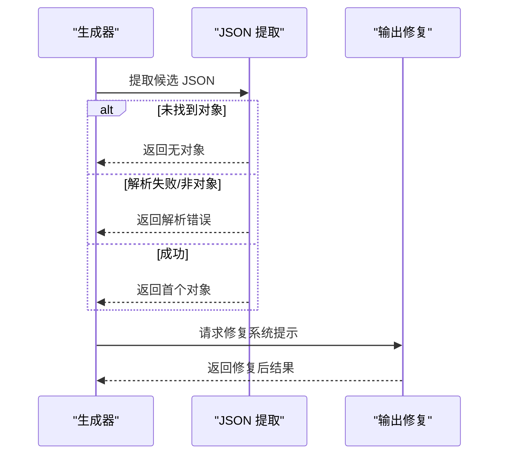
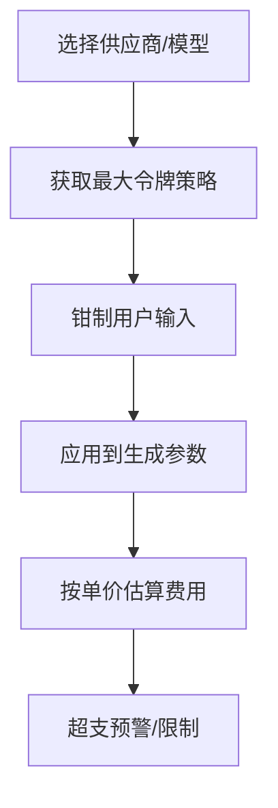
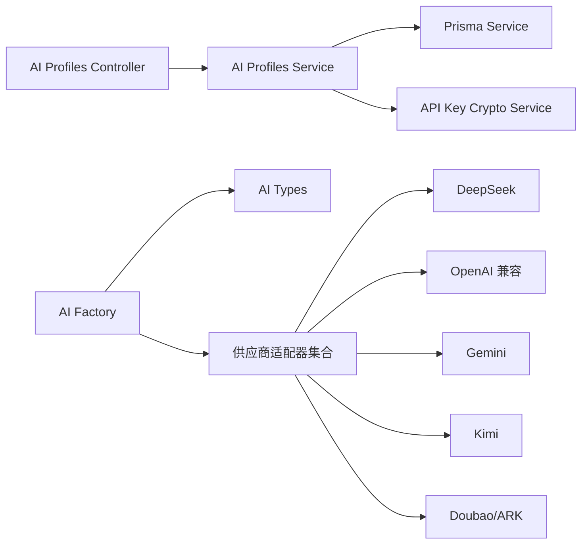

# AI配置管理

<cite>
**本文引用的文件**
- [apps/api/src/ai-profiles/ai-profiles.controller.ts](file://apps/api/src/ai-profiles/ai-profiles.controller.ts)
- [apps/api/src/ai-profiles/ai-profiles.service.ts](file://apps/api/src/ai-profiles/ai-profiles.service.ts)
- [apps/api/src/ai-profiles/ai-profiles.module.ts](file://apps/api/src/ai-profiles/ai-profiles.module.ts)
- [packages/shared/src/schemas/aiProfile.ts](file://packages/shared/src/schemas/aiProfile.ts)
- [apps/web/src/lib/ai/factory.ts](file://apps/web/src/lib/ai/factory.ts)
- [apps/web/src/lib/ai/contextBuilder.ts](file://apps/web/src/lib/ai/contextBuilder.ts)
- [apps/web/src/lib/ai/contextCompressor.ts](file://apps/web/src/lib/ai/contextCompressor.ts)
- [apps/web/src/lib/ai/jsonExtractor.ts](file://apps/web/src/lib/ai/jsonExtractor.ts)
- [apps/web/src/lib/ai/outputFixer.ts](file://apps/web/src/lib/ai/outputFixer.ts)
- [apps/web/src/lib/ai/maxTokensPolicy.ts](file://apps/web/src/lib/ai/maxTokensPolicy.ts)
- [apps/web/src/lib/ai/providers/deepseek.ts](file://apps/web/src/lib/ai/providers/deepseek.ts)
- [apps/web/src/lib/ai/providers/openai.ts](file://apps/web/src/lib/ai/providers/openai.ts)
- [apps/web/src/lib/ai/providers/gemini.ts](file://apps/web/src/lib/ai/providers/gemini.ts)
- [apps/web/src/lib/ai/providers/kimi.ts](file://apps/web/src/lib/ai/providers/kimi.ts)
- [apps/web/src/lib/ai/providers/doubaoArk.ts](file://apps/web/src/lib/ai/providers/doubaoArk.ts)
- [apps/web/src/lib/ai/types.ts](file://apps/web/src/lib/ai/types.ts)
</cite>

## 目录

1. [简介](#简介)
2. [项目结构](#项目结构)
3. [核心组件](#核心组件)
4. [架构总览](#架构总览)
5. [详细组件分析](#详细组件分析)
6. [依赖分析](#依赖分析)
7. [性能考虑](#性能考虑)
8. [故障排查指南](#故障排查指南)
9. [结论](#结论)
10. [附录](#附录)

## 简介

本技术文档围绕 AIXSSS 的 AI 配置管理功能展开，系统性阐述以下方面：

- AI Profile 的创建、编辑与删除流程，包括参数定义、输入校验与存储策略
- AI 服务工厂的设计模式与动态供应商适配机制
- 上下文构建与压缩算法，优化提示词长度与提升生成效率
- 结构化输出的 JSON 提取与修复机制
- 令牌数策略与成本控制（最大令牌数限制与费用估算）
- 最佳实践：性能优化、错误处理与监控告警

## 项目结构

本项目采用前后端分离架构，AI 配置管理涉及前端 Web 应用与后端 API 两部分：

- 前端 Web 应用负责用户界面、AI 工厂与上下文处理
- 后端 API 负责 AI Profile 的持久化与安全存储

**图表来源**

- [apps/web/src/lib/ai/factory.ts](file://apps/web/src/lib/ai/factory.ts#L1-L98)
- [apps/web/src/lib/ai/contextBuilder.ts](file://apps/web/src/lib/ai/contextBuilder.ts#L1-L435)
- [apps/web/src/lib/ai/contextCompressor.ts](file://apps/web/src/lib/ai/contextCompressor.ts#L1-L519)
- [apps/web/src/lib/ai/jsonExtractor.ts](file://apps/web/src/lib/ai/jsonExtractor.ts#L1-L129)
- [apps/web/src/lib/ai/outputFixer.ts](file://apps/web/src/lib/ai/outputFixer.ts#L1-L75)
- [apps/api/src/ai-profiles/ai-profiles.controller.ts](file://apps/api/src/ai-profiles/ai-profiles.controller.ts#L1-L38)
- [apps/api/src/ai-profiles/ai-profiles.service.ts](file://apps/api/src/ai-profiles/ai-profiles.service.ts#L1-L202)

**章节来源**

- [apps/api/src/ai-profiles/ai-profiles.controller.ts](file://apps/api/src/ai-profiles/ai-profiles.controller.ts#L1-L38)
- [apps/api/src/ai-profiles/ai-profiles.service.ts](file://apps/api/src/ai-profiles/ai-profiles.service.ts#L1-L202)
- [apps/api/src/ai-profiles/ai-profiles.module.ts](file://apps/api/src/ai-profiles/ai-profiles.module.ts#L1-L13)
- [packages/shared/src/schemas/aiProfile.ts](file://packages/shared/src/schemas/aiProfile.ts#L1-L51)
- [apps/web/src/lib/ai/factory.ts](file://apps/web/src/lib/ai/factory.ts#L1-L98)
- [apps/web/src/lib/ai/contextBuilder.ts](file://apps/web/src/lib/ai/contextBuilder.ts#L1-L435)
- [apps/web/src/lib/ai/contextCompressor.ts](file://apps/web/src/lib/ai/contextCompressor.ts#L1-L519)
- [apps/web/src/lib/ai/jsonExtractor.ts](file://apps/web/src/lib/ai/jsonExtractor.ts#L1-L129)
- [apps/web/src/lib/ai/outputFixer.ts](file://apps/web/src/lib/ai/outputFixer.ts#L1-L75)

## 核心组件

- AI Profile 控制器与服务：提供列表、创建、更新、删除接口，执行输入校验与敏感信息加密
- AI 工厂与供应商适配器：根据配置动态选择具体供应商实现，统一流式与非流式调用
- 上下文构建与压缩：整合角色、画风、世界观等信息，按策略压缩历史与摘要
- JSON 提取与输出修复：从非结构化输出中提取首个 JSON 对象，并在格式不合规时请求修复
- 令牌数策略与成本控制：基于供应商/模型给出最大令牌数策略，估算费用

**章节来源**

- [apps/api/src/ai-profiles/ai-profiles.controller.ts](file://apps/api/src/ai-profiles/ai-profiles.controller.ts#L1-L38)
- [apps/api/src/ai-profiles/ai-profiles.service.ts](file://apps/api/src/ai-profiles/ai-profiles.service.ts#L1-L202)
- [apps/web/src/lib/ai/factory.ts](file://apps/web/src/lib/ai/factory.ts#L1-L98)
- [apps/web/src/lib/ai/contextBuilder.ts](file://apps/web/src/lib/ai/contextBuilder.ts#L1-L435)
- [apps/web/src/lib/ai/contextCompressor.ts](file://apps/web/src/lib/ai/contextCompressor.ts#L1-L519)
- [apps/web/src/lib/ai/jsonExtractor.ts](file://apps/web/src/lib/ai/jsonExtractor.ts#L1-L129)
- [apps/web/src/lib/ai/outputFixer.ts](file://apps/web/src/lib/ai/outputFixer.ts#L1-L75)
- [apps/web/src/lib/ai/maxTokensPolicy.ts](file://apps/web/src/lib/ai/maxTokensPolicy.ts#L1-L63)

## 架构总览

AI 配置管理贯穿“前端配置 → 后端持久化/加密 → 供应商适配 → 上下文优化 → 输出修复 → 成本控制”的闭环。

**图表来源**

- [apps/api/src/ai-profiles/ai-profiles.controller.ts](file://apps/api/src/ai-profiles/ai-profiles.controller.ts#L1-L38)
- [apps/api/src/ai-profiles/ai-profiles.service.ts](file://apps/api/src/ai-profiles/ai-profiles.service.ts#L1-L202)
- [apps/web/src/lib/ai/factory.ts](file://apps/web/src/lib/ai/factory.ts#L1-L98)
- [apps/web/src/lib/ai/providers/deepseek.ts](file://apps/web/src/lib/ai/providers/deepseek.ts#L1-L140)
- [apps/web/src/lib/ai/providers/openai.ts](file://apps/web/src/lib/ai/providers/openai.ts#L1-L384)
- [apps/web/src/lib/ai/providers/gemini.ts](file://apps/web/src/lib/ai/providers/gemini.ts#L1-L172)
- [apps/web/src/lib/ai/providers/kimi.ts](file://apps/web/src/lib/ai/providers/kimi.ts#L1-L164)
- [apps/web/src/lib/ai/providers/doubaoArk.ts](file://apps/web/src/lib/ai/providers/doubaoArk.ts#L1-L186)

## 详细组件分析

### AI Profile 管理（后端）

- 控制器负责鉴权、参数解析与路由转发
- 服务层执行输入校验、敏感信息加密、参数归一化（如 Doubao/ARK 模型/接入点、generationParams 过滤）
- 数据库层存储团队维度的 Profile，包含 provider、model、baseURL、generationParams、pricing 等

**图表来源**

- [apps/api/src/ai-profiles/ai-profiles.controller.ts](file://apps/api/src/ai-profiles/ai-profiles.controller.ts#L1-L38)
- [apps/api/src/ai-profiles/ai-profiles.service.ts](file://apps/api/src/ai-profiles/ai-profiles.service.ts#L1-L202)

**章节来源**

- [apps/api/src/ai-profiles/ai-profiles.controller.ts](file://apps/api/src/ai-profiles/ai-profiles.controller.ts#L1-L38)
- [apps/api/src/ai-profiles/ai-profiles.service.ts](file://apps/api/src/ai-profiles/ai-profiles.service.ts#L1-L202)
- [apps/api/src/ai-profiles/ai-profiles.module.ts](file://apps/api/src/ai-profiles/ai-profiles.module.ts#L1-L13)
- [packages/shared/src/schemas/aiProfile.ts](file://packages/shared/src/schemas/aiProfile.ts#L1-L51)

### AI 服务工厂与供应商适配器

- 工厂根据配置选择具体供应商（DeepSeek、Kimi、Gemini、OpenAI 兼容、Doubao/ARK、后端模式）
- AIClient 封装统一的 chat/streamChat 接口，并在流式输出时更新进度状态
- 各供应商适配器实现统一的 AIProvider 接口，屏蔽不同平台的差异

**图表来源**

- [apps/web/src/lib/ai/factory.ts](file://apps/web/src/lib/ai/factory.ts#L1-L98)
- [apps/web/src/lib/ai/types.ts](file://apps/web/src/lib/ai/types.ts#L1-L30)
- [apps/web/src/lib/ai/providers/deepseek.ts](file://apps/web/src/lib/ai/providers/deepseek.ts#L1-L140)
- [apps/web/src/lib/ai/providers/openai.ts](file://apps/web/src/lib/ai/providers/openai.ts#L1-L384)
- [apps/web/src/lib/ai/providers/gemini.ts](file://apps/web/src/lib/ai/providers/gemini.ts#L1-L172)
- [apps/web/src/lib/ai/providers/kimi.ts](file://apps/web/src/lib/ai/providers/kimi.ts#L1-L164)
- [apps/web/src/lib/ai/providers/doubaoArk.ts](file://apps/web/src/lib/ai/providers/doubaoArk.ts#L1-L186)

**章节来源**

- [apps/web/src/lib/ai/factory.ts](file://apps/web/src/lib/ai/factory.ts#L1-L98)
- [apps/web/src/lib/ai/types.ts](file://apps/web/src/lib/ai/types.ts#L1-L30)
- [apps/web/src/lib/ai/providers/deepseek.ts](file://apps/web/src/lib/ai/providers/deepseek.ts#L1-L140)
- [apps/web/src/lib/ai/providers/openai.ts](file://apps/web/src/lib/ai/providers/openai.ts#L1-L384)
- [apps/web/src/lib/ai/providers/gemini.ts](file://apps/web/src/lib/ai/providers/gemini.ts#L1-L172)
- [apps/web/src/lib/ai/providers/kimi.ts](file://apps/web/src/lib/ai/providers/kimi.ts#L1-L164)
- [apps/web/src/lib/ai/providers/doubaoArk.ts](file://apps/web/src/lib/ai/providers/doubaoArk.ts#L1-L186)

### 上下文构建与压缩算法

- 上下文构建：整合画风、角色、世界观信息，支持按模式（视觉/故事/全量）与长度限制
- 上下文压缩：按策略（激进/平衡/保守）压缩项目核心信息、分镜摘要与历史上下文，估算 token 数并检查上限
- 智能压缩回退：当 AI 智能压缩失败时，回退到规则引擎（关键词匹配、截断）

**图表来源**

- [apps/web/src/lib/ai/contextBuilder.ts](file://apps/web/src/lib/ai/contextBuilder.ts#L1-L435)
- [apps/web/src/lib/ai/contextCompressor.ts](file://apps/web/src/lib/ai/contextCompressor.ts#L1-L519)

**章节来源**

- [apps/web/src/lib/ai/contextBuilder.ts](file://apps/web/src/lib/ai/contextBuilder.ts#L1-L435)
- [apps/web/src/lib/ai/contextCompressor.ts](file://apps/web/src/lib/ai/contextCompressor.ts#L1-L519)

### JSON 提取与输出修复机制

- JSON 提取：从非结构化文本中提取首个 JSON 对象，支持代码块与顶层对象
- 输出修复：若检测到输出非结构化或不完整，请求系统提示修复

**图表来源**

- [apps/web/src/lib/ai/jsonExtractor.ts](file://apps/web/src/lib/ai/jsonExtractor.ts#L1-L129)
- [apps/web/src/lib/ai/outputFixer.ts](file://apps/web/src/lib/ai/outputFixer.ts#L1-L75)

**章节来源**

- [apps/web/src/lib/ai/jsonExtractor.ts](file://apps/web/src/lib/ai/jsonExtractor.ts#L1-L129)
- [apps/web/src/lib/ai/outputFixer.ts](file://apps/web/src/lib/ai/outputFixer.ts#L1-L75)

### 令牌数策略与成本控制

- 最大令牌数策略：根据供应商/模型给出 UI 上下限、步进、推荐默认值与提示
- 成本估算：结合 PricingSchema 中的单价（每千令牌）进行费用预估

**图表来源**

- [apps/web/src/lib/ai/maxTokensPolicy.ts](file://apps/web/src/lib/ai/maxTokensPolicy.ts#L1-L63)
- [packages/shared/src/schemas/aiProfile.ts](file://packages/shared/src/schemas/aiProfile.ts#L6-L11)

**章节来源**

- [apps/web/src/lib/ai/maxTokensPolicy.ts](file://apps/web/src/lib/ai/maxTokensPolicy.ts#L1-L63)
- [packages/shared/src/schemas/aiProfile.ts](file://packages/shared/src/schemas/aiProfile.ts#L6-L11)

## 依赖分析

- 前端依赖关系：Web 层依赖工厂与供应商适配器；工厂依赖运行时模式判断；上下文模块相互独立但共同服务于提示词优化
- 后端依赖关系：控制器依赖服务；服务依赖数据库与加密服务；共享 Schema 保障前后端一致

**图表来源**

- [apps/api/src/ai-profiles/ai-profiles.controller.ts](file://apps/api/src/ai-profiles/ai-profiles.controller.ts#L1-L38)
- [apps/api/src/ai-profiles/ai-profiles.service.ts](file://apps/api/src/ai-profiles/ai-profiles.service.ts#L1-L202)
- [apps/web/src/lib/ai/factory.ts](file://apps/web/src/lib/ai/factory.ts#L1-L98)
- [apps/web/src/lib/ai/types.ts](file://apps/web/src/lib/ai/types.ts#L1-L30)
- [apps/web/src/lib/ai/providers/deepseek.ts](file://apps/web/src/lib/ai/providers/deepseek.ts#L1-L140)
- [apps/web/src/lib/ai/providers/openai.ts](file://apps/web/src/lib/ai/providers/openai.ts#L1-L384)
- [apps/web/src/lib/ai/providers/gemini.ts](file://apps/web/src/lib/ai/providers/gemini.ts#L1-L172)
- [apps/web/src/lib/ai/providers/kimi.ts](file://apps/web/src/lib/ai/providers/kimi.ts#L1-L164)
- [apps/web/src/lib/ai/providers/doubaoArk.ts](file://apps/web/src/lib/ai/providers/doubaoArk.ts#L1-L186)

**章节来源**

- [apps/api/src/ai-profiles/ai-profiles.controller.ts](file://apps/api/src/ai-profiles/ai-profiles.controller.ts#L1-L38)
- [apps/api/src/ai-profiles/ai-profiles.service.ts](file://apps/api/src/ai-profiles/ai-profiles.service.ts#L1-L202)
- [apps/web/src/lib/ai/factory.ts](file://apps/web/src/lib/ai/factory.ts#L1-L98)
- [apps/web/src/lib/ai/types.ts](file://apps/web/src/lib/ai/types.ts#L1-L30)

## 性能考虑

- 上下文压缩策略：通过“激进/平衡/保守”三档策略动态控制 token 预算，避免超限导致的失败与重试
- 令牌数钳制：根据供应商/模型能力限制用户输入，减少无效调用
- 流式输出：前端统一包装流式生成器，边生成边更新 UI，降低感知延迟
- 失败回退：智能压缩失败时回退到规则引擎，确保稳定性

[本节为通用指导，不直接分析具体文件]

## 故障排查指南

- API Key 异常：Doubao/ARK 需去除 Bearer 前缀与多余空白；Kimi/OpenAI 兼容需注意 baseURL 归一化
- 参数不兼容：某些供应商不支持 presence/frequency penalty；工厂会针对 Doubao/ARK 进行过滤
- 令牌超限：使用压缩策略与 token 估算，必要时降低 maxTokens
- 输出非结构化：启用 JSON 提取与输出修复流程

**章节来源**

- [apps/api/src/ai-profiles/ai-profiles.service.ts](file://apps/api/src/ai-profiles/ai-profiles.service.ts#L31-L54)
- [apps/web/src/lib/ai/providers/doubaoArk.ts](file://apps/web/src/lib/ai/providers/doubaoArk.ts#L29-L45)
- [apps/web/src/lib/ai/contextCompressor.ts](file://apps/web/src/lib/ai/contextCompressor.ts#L187-L200)
- [apps/web/src/lib/ai/jsonExtractor.ts](file://apps/web/src/lib/ai/jsonExtractor.ts#L98-L129)
- [apps/web/src/lib/ai/outputFixer.ts](file://apps/web/src/lib/ai/outputFixer.ts#L59-L75)

## 结论

本方案通过“配置即服务”的后端存储与“工厂+适配器”的前端扩展，实现了跨供应商的统一调用；配合上下文构建与压缩、JSON 提取与修复、令牌数策略与成本控制，形成从配置到生成再到优化的完整闭环。建议在生产环境中结合监控告警与日志审计，持续优化策略参数与成本表现。

[本节为总结性内容，不直接分析具体文件]

## 附录

- 最佳实践清单
  - 配置阶段：使用共享 Schema 校验输入，避免非法参数进入下游
  - 生成阶段：启用上下文压缩与流式输出，提升交互体验
  - 输出阶段：开启 JSON 提取与修复，保证结构化产物质量
  - 成本阶段：基于策略限制最大令牌数，结合单价进行费用估算与预警

[本节为通用指导，不直接分析具体文件]
