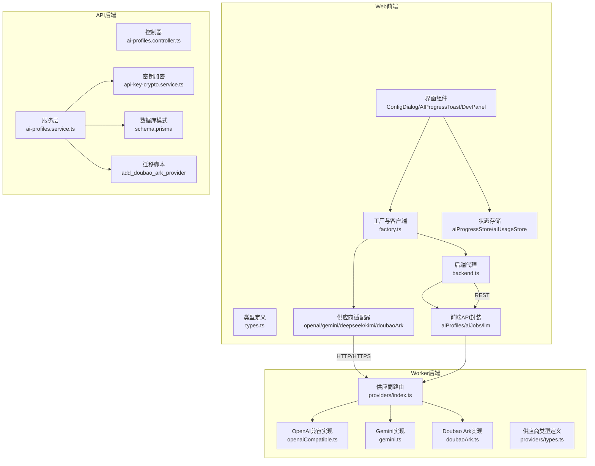
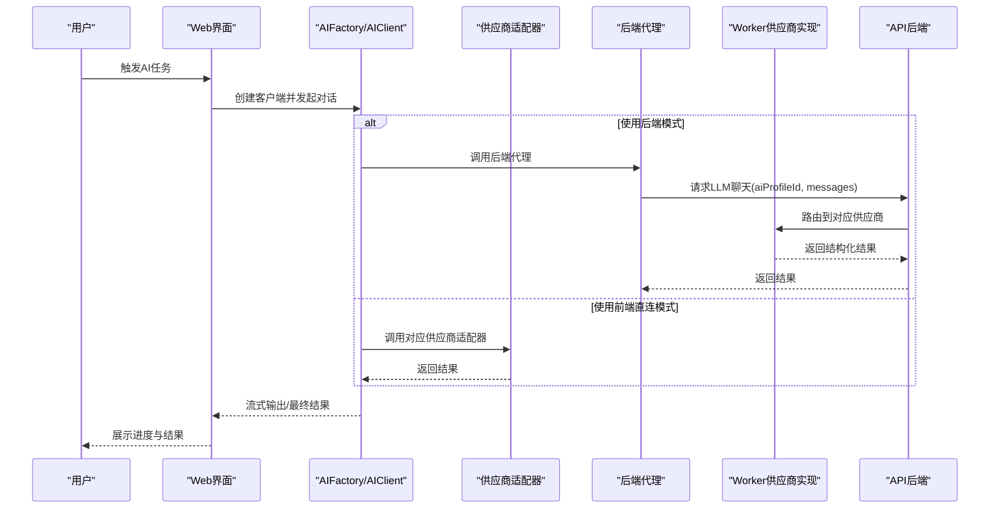
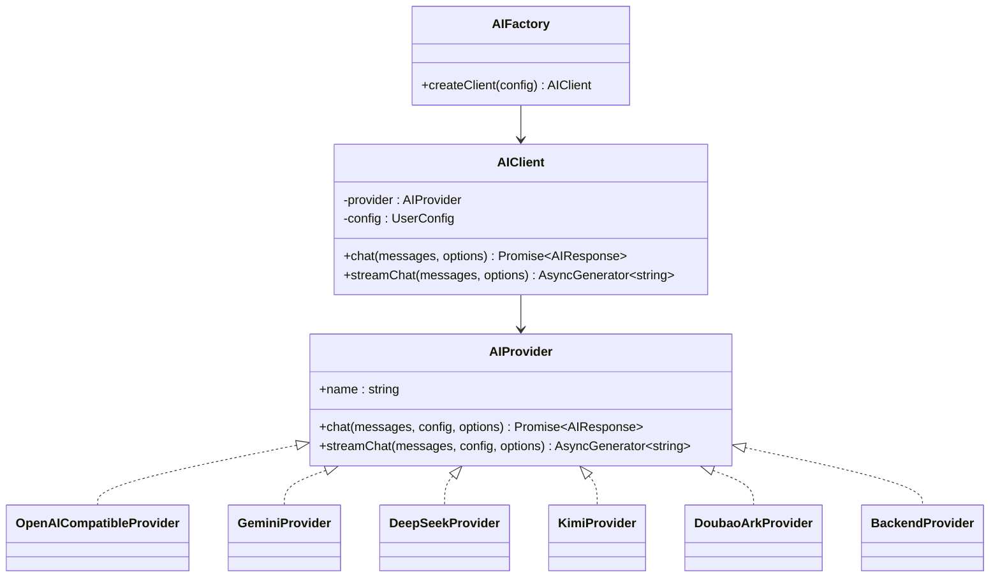
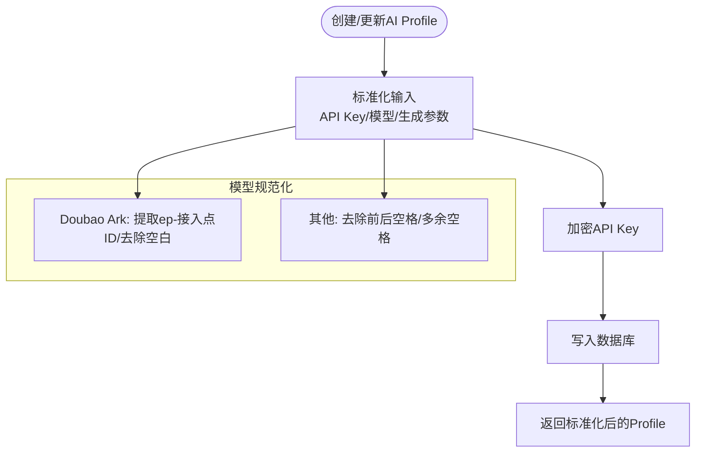
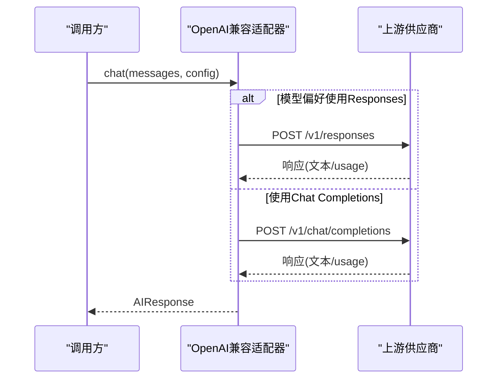
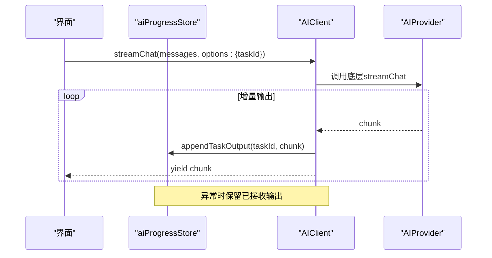
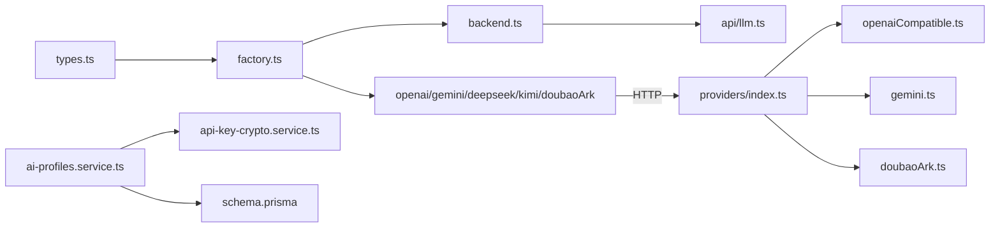

# AI集成

<cite>
**本文引用的文件**
- [apps/api/src/ai-profiles/ai-profiles.controller.ts](file://apps/api/src/ai-profiles/ai-profiles.controller.ts)
- [apps/api/src/ai-profiles/ai-profiles.service.ts](file://apps/api/src/ai-profiles/ai-profiles.service.ts)
- [apps/api/src/crypto/api-key-crypto.service.ts](file://apps/api/src/crypto/api-key-crypto.service.ts)
- [apps/api/src/config/env.ts](file://apps/api/src/config/env.ts)
- [apps/api/src/prisma/schema.prisma](file://apps/api/src/prisma/schema.prisma)
- [apps/api/src/prisma/migrations/20260121230000_add_doubao_ark_provider/migration.sql](file://apps/api/src/prisma/migrations/20260121230000_add_doubao_ark_provider/migration.sql)
- [apps/web/src/lib/ai/types.ts](file://apps/web/src/lib/ai/types.ts)
- [apps/web/src/lib/ai/factory.ts](file://apps/web/src/lib/ai/factory.ts)
- [apps/web/src/lib/ai/providers/backend.ts](file://apps/web/src/lib/ai/providers/backend.ts)
- [apps/web/src/lib/ai/providers/openai.ts](file://apps/web/src/lib/ai/providers/openai.ts)
- [apps/web/src/lib/ai/providers/gemini.ts](file://apps/web/src/lib/ai/providers/gemini.ts)
- [apps/web/src/lib/ai/providers/deepseek.ts](file://apps/web/src/lib/ai/providers/deepseek.ts)
- [apps/web/src/lib/ai/providers/kimi.ts](file://apps/web/src/lib/ai/providers/kimi.ts)
- [apps/web/src/lib/ai/providers/doubaoArk.ts](file://apps/web/src/lib/ai/providers/doubaoArk.ts)
- [apps/worker/src/providers/index.ts](file://apps/worker/src/providers/index.ts)
- [apps/worker/src/providers/openaiCompatible.ts](file://apps/worker/src/providers/openaiCompatible.ts)
- [apps/worker/src/providers/gemini.ts](file://apps/worker/src/providers/gemini.ts)
- [apps/worker/src/providers/doubaoArk.ts](file://apps/worker/src/providers/doubaoArk.ts)
- [apps/worker/src/providers/types.ts](file://apps/worker/src/providers/types.ts)
- [apps/web/src/lib/ai/contextBuilder.ts](file://apps/web/src/lib/ai/contextBuilder.ts)
- [apps/web/src/lib/ai/contextCompressor.ts](file://apps/web/src/lib/ai/contextCompressor.ts)
- [apps/web/src/lib/ai/promptParsers.ts](file://apps/web/src/lib/ai/promptParsers.ts)
- [apps/web/src/lib/ai/jsonExtractor.ts](file://apps/web/src/lib/ai/jsonExtractor.ts)
- [apps/web/src/lib/ai/outputFixer.ts](file://apps/web/src/lib/ai/outputFixer.ts)
- [apps/web/src/lib/ai/worldViewInjection.ts](file://apps/web/src/lib/ai/worldViewInjection.ts)
- [apps/web/src/lib/ai/maxTokensPolicy.ts](file://apps/web/src/lib/ai/maxTokensPolicy.ts)
- [apps/web/src/lib/ai/progressBridge.ts](file://apps/web/src/lib/ai/progressBridge.ts)
- [apps/web/src/lib/ai/usageAnalytics.ts](file://apps/web/src/lib/ai/usageAnalytics.ts)
- [apps/web/src/lib/ai/debugLogger.ts](file://apps/web/src/lib/ai/debugLogger.ts)
- [apps/web/src/lib/ai/skills.ts](file://apps/web/src/lib/ai/skills.ts)
- [apps/web/src/lib/ai/multiModalPrompts.ts](file://apps/web/src/lib/ai/multiModalPrompts.ts)
- [apps/web/src/lib/ai/cascadeUpdater.ts](file://apps/web/src/lib/ai/cascadeUpdater.ts)
- [apps/web/src/lib/ai/streamingHandler.ts](file://apps/web/src/lib/ai/streamingHandler.ts)
- [apps/web/src/lib/ai/aiJobs.ts](file://apps/web/src/lib/ai/aiJobs.ts)
- [apps/web/src/lib/ai/llm.ts](file://apps/web/src/lib/ai/llm.ts)
- [apps/web/src/lib/api/aiProfiles.ts](file://apps/web/src/lib/api/aiProfiles.ts)
- [apps/web/src/lib/api/aiJobs.ts](file://apps/web/src/lib/api/aiJobs.ts)
- [apps/web/src/lib/api/llm.ts](file://apps/web/src/lib/api/llm.ts)
- [apps/web/src/stores/aiProgressStore.ts](file://apps/web/src/stores/aiProgressStore.ts)
- [apps/web/src/stores/aiUsageStore.ts](file://apps/web/src/stores/aiUsageStore.ts)
- [apps/web/src/components/AIProgressToast.tsx](file://apps/web/src/components/AIProgressToast.tsx)
- [apps/web/src/components/ConfigDialog.tsx](file://apps/web/src/components/ConfigDialog.tsx)
- [apps/web/src/components/DevPanel.tsx](file://apps/web/src/components/DevPanel.tsx)
- [apps/web/src/lib/runtime/mode.ts](file://apps/web/src/lib/runtime/mode.ts)
- [apps/web/src/lib/keyManager.ts](file://apps/web/src/lib/keyManager.ts)
- [apps/web/src/lib/performance.ts](file://apps/web/src/lib/performance.ts)
- [apps/web/src/lib/storageManager.ts](file://apps/web/src/lib/storageManager.ts)
- [apps/web/src/lib/workflowV2/state.ts](file://apps/web/src/lib/workflowV2/state.ts)
- [apps/web/src/lib/workflowV2/promptLayers.ts](file://apps/web/src/lib/workflowV2/promptLayers.ts)
- [apps/web/src/lib/workflowV2/finalPrompts.ts](file://apps/web/src/lib/workflowV2/finalPrompts.ts)
- [apps/web/src/lib/workflowV2/panelScript.ts](file://apps/web/src/lib/workflowV2/panelScript.ts)
- [apps/web/src/lib/workflowV2/systemPrompts.ts](file://apps/web/src/lib/workflowV2/systemPrompts.ts)
- [apps/web/src/lib/workflowV2/analysis.ts](file://apps/web/src/lib/workflowV2/analysis.ts)
- [apps/web/src/lib/workflowV2/assets.ts](file://apps/web/src/lib/workflowV2/assets.ts)
- [apps/web/src/lib/workflowV2/continuity.ts](file://apps/web/src/lib/workflowV2/continuity.ts)
- [apps/web/src/lib/workflowV2/copyText.ts](file://apps/web/src/lib/workflowV2/copyText.ts)
- [apps/web/src/lib/workflowV2/storyboard81.ts](file://apps/web/src/lib/workflowV2/storyboard81.ts)
- [apps/web/src/lib/workflowV2/actionBeats.ts](file://apps/web/src/lib/workflowV2/actionBeats.ts)
- [apps/web/src/lib/workflowV2/sceneList.ts](file://apps/web/src/lib/workflowV2/sceneList.ts)
- [apps/web/src/lib/workflowV2/episodePlanning.ts](file://apps/web/src/lib/workflowV2/episodePlanning.ts)
- [apps/web/src/lib/workflowV2/systemPromptCustomization.ts](file://apps/web/src/lib/workflowV2/systemPromptCustomization.ts)
- [apps/web/src/lib/workflowV2/narrativeCausalChain.ts](file://apps/web/src/lib/workflowV2/narrativeCausalChain.ts)
- [apps/web/src/lib/workflowV2/sceneGeneratedVideos.ts](file://apps/web/src/lib/workflowV2/sceneGeneratedVideos.ts)
- [apps/web/src/lib/workflowV2/actionBeats.ts](file://apps/web/src/lib/workflowV2/actionBeats.ts)
- [apps/web/src/lib/workflowV2/sceneGeneratedVideos.ts](file://apps/web/src/lib/workflowV2/sceneGeneratedVideos.ts)
- [apps/web/src/lib/workflowV2/sceneList.ts](file://apps/web/src/lib/workflowV2/sceneList.ts)
- [apps/web/src/lib/workflowV2/episodePlanning.ts](file://apps/web/src/lib/workflowV2/episodePlanning.ts)
- [apps/web/src/lib/workflowV2/systemPromptCustomization.ts](file://apps/web/src/lib/workflowV2/systemPromptCustomization.ts)
- [apps/web/src/lib/workflowV2/narrativeCausalChain.ts](file://apps/web/src/lib/workflowV2/narrativeCausalChain.ts)
- [apps/web/src/lib/workflowV2/storyboard81.ts](file://apps/web/src/lib/workflowV2/storyboard81.ts)
- [apps/web/src/lib/workflowV2/panelScript.ts](file://apps/web/src/lib/workflowV2/panelScript.ts)
- [apps/web/src/lib/workflowV2/systemPrompts.ts](file://apps/web/src/lib/workflowV2/systemPrompts.ts)
- [apps/web/src/lib/workflowV2/analysis.ts](file://apps/web/src/lib/workflowV2/analysis.ts)
- [apps/web/src/lib/workflowV2/assets.ts](file://apps/web/src/lib/workflowV2/assets.ts)
- [apps/web/src/lib/workflowV2/continuity.ts](file://apps/web/src/lib/workflowV2/continuity.ts)
- [apps/web/src/lib/workflowV2/copyText.ts](file://apps/web/src/lib/workflowV2/copyText.ts)
- [apps/web/src/lib/workflowV2/finalPrompts.ts](file://apps/web/src/lib/workflowV2/finalPrompts.ts)
- [apps/web/src/lib/workflowV2/promptLayers.ts](file://apps/web/src/lib/workflowV2/promptLayers.ts)
- [apps/web/src/lib/workflowV2/state.ts](file://apps/web/src/lib/workflowV2/state.ts)
- [apps/web/src/lib/workflowV2/panelScript.ts](file://apps/web/src/lib/workflowV2/panelScript.ts)
- [apps/web/src/lib/workflowV2/systemPrompts.ts](file://apps/web/src/lib/workflowV2/systemPrompts.ts)
- [apps/web/src/lib/workflowV2/analysis.ts](file://apps/web/src/lib/workflowV2/analysis.ts)
- [apps/web/src/lib/workflowV2/assets.ts](file://apps/web/src/lib/workflowV2/assets.ts)
- [apps/web/src/lib/workflowV2/continuity.ts](file://apps/web/src/lib/workflowV2/continuity.ts)
- [apps/web/src/lib/workflowV2/copyText.ts](file://apps/web/src/lib/workflowV2/copyText.ts)
- [apps/web/src/lib/workflowV2/finalPrompts.ts](file://apps/web/src/lib/workflowV2/finalPrompts.ts)
- [apps/web/src/lib/workflowV2/promptLayers.ts](file://apps/web/src/lib/workflowV2/promptLayers.ts)
- [apps/web/src/lib/workflowV2/state.ts](file://apps/web/src/lib/workflowV2/state.ts)
- [apps/web/src/lib/workflowV2/panelScript.ts](file://apps/web/src/lib/workflowV2/panelScript.ts)
- [apps/web/src/lib/workflowV2/systemPrompts.ts](file://apps/web/src/lib/workflowV2/systemPrompts.ts)
- [apps/web/src/lib/workflowV2/analysis.ts](file://apps/web/src/lib/workflowV2/analysis.ts)
- [apps/web/src/lib/workflowV2/assets.ts](file://apps/web/src/lib/workflowV2/assets.ts)
- [apps/web/src/lib/workflowV2/continuity.ts](file://apps/web/src/lib/workflowV2/continuity.ts)
- [apps/web/src/lib/workflowV2/copyText.ts](file://apps/web/src/lib/workflowV2/copyText.ts)
- [apps/web/src/lib/workflowV2/finalPrompts.ts](file://apps/web/src/lib/workflowV2/finalPrompts.ts)
- [apps/web/src/lib/workflowV2/promptLayers.ts](file://apps/web/src/lib/workflowV2/promptLayers.ts)
- [apps/web/src/lib/workflowV2/state.ts](file://apps/web/src/lib/workflowV2/state.ts)
- [apps/web/src/lib/workflowV2/panelScript.ts](file://apps/web/src/lib/workflowV2/panelScript.ts)
- [apps/web/src/lib/workflowV2/systemPrompts.ts](file://apps/web/src/lib/workflowV2/systemPrompts.ts)
- [apps/web/src/lib/workflowV2/analysis.ts](file://apps/web/src/lib/workflowV2/analysis.ts)
- [apps/web/src/lib/workflowV2/assets.ts](file://apps/web/src/lib/workflowV2/assets.ts)
- [apps/web/src/lib/workflowV2/continuity.ts](file://apps/web/src/lib/workflowV2/continuity.ts)
- [apps/web/src/lib/workflowV2/copyText.ts](file://apps/web/src/lib/workflowV2/copyText.ts)
- [apps/web/src/lib/workflowV2/finalPrompts.ts](file://apps/web/src/lib/workflowV2/finalPrompts.ts)
- [apps/web/src/lib/workflowV2/promptLayers.ts](file://apps/web/src/lib/workflowV2/promptLayers.ts)
- [apps/web/src/lib/workflowV2/state.ts](file://apps/web/src/lib/workflowV2/state.ts)
- [apps/web/src/lib/workflowV2/panelScript.ts](file://apps/web/src/lib/workflowV2/panelScript.ts)
- [apps/web/src/lib/workflowV2/systemPrompts.ts](file://apps/web/src/lib/workflowV2/systemPrompts.ts)
- [apps/web/src/lib/workflowV2/analysis.ts](file://apps/web/src/lib/workflowV2/analysis.ts)
- [apps/web/src/lib/workflowV2/assets.ts](file://apps/web/src/lib/workflowV2/assets.ts)
- [apps/web/src/lib/workflowV2/continuity.ts](file://apps/web/src/lib/workflowV2/continuity.ts)
- [apps/web/src/lib/workflowV2/copyText.ts](file://apps/web/src/lib/workflowV2/copyText.ts)
- [apps/web/src/lib/workflowV2/finalPrompts.ts](file://apps/web/src/lib/workflowV2/finalPrompts.ts)
- [apps/web/src/lib/workflowV2/promptLayers.ts](file://apps/web/src/lib/workflowV2/promptLayers.ts)
- [apps/web/src/lib/workflowV2/state.ts](file://apps/web/src/lib/workflowV2/state.ts)
- [apps/web/src/lib/workflowV2/panelScript.ts](file://apps/web/src/lib/workflowV2/panelScript.ts)
- [apps/web/src/lib/workflowV2/systemPrompts.ts](file://apps/web/src/lib/workflowV2/systemPrompts.ts)
- [apps/web/src/lib/workflowV2/analysis.ts](file://apps/web/src/lib/workflowV2/analysis.ts)
- [apps/web/src/lib/workflowV2/assets.ts](file://apps/web/src/lib/workflowV2/assets.ts)
- [apps/web/src/lib/workflowV2/continuity.ts](file://apps/web/src/lib/workflowV2/continuity.ts)
- [apps/web/src/lib/workflowV2/copyText.ts](file://apps/web/src/lib/workflowV2/copyText.ts)
- [apps/web/src/lib/workflowV2/finalPrompts.ts](file://apps/web/src/lib/workflowV2/finalPrompts.ts)
- [apps/web/src/lib/workflowV2/promptLayers.ts](file://apps/web/src/lib/workflowV2/promptLayers.ts)
- [apps/web/src/lib/workflowV2/state.ts](file://apps/web/src/lib/workflowV2/state.ts)
- [apps/web/src/lib/workflowV2/panelScript.ts](file://apps/web/src/lib/workflowV2/panelScript.ts)
- [apps/web/src/lib/workflowV2/systemPrompts.ts](file://apps/web/src/lib/workflowV2/systemPrompts.ts)
- [apps/web/src/lib/workflowV2/analysis.ts](file://apps/web/src/lib/workflowV2/analysis.ts)
- [apps/web/src/lib/workflowV2/assets.ts](file://apps/web/src/lib/workflowV2/assets.ts)
- [apps/web/src/lib/workflowV2/continuity.ts](file://apps/web/src/lib/work......)
</cite>

## 目录

1. [简介](#简介)
2. [项目结构](#项目结构)
3. [核心组件](#核心组件)
4. [架构总览](#架构总览)
5. [详细组件分析](#详细组件分析)
6. [依赖关系分析](#依赖关系分析)
7. [性能考量](#性能考量)
8. [故障排查指南](#故障排查指南)
9. [结论](#结论)
10. [附录](#附录)

## 简介

本技术文档面向AIXSSS的AI集成功能，系统性阐述多供应商AI服务的统一抽象、配置管理与加密存储、工厂模式与动态切换机制、提示词工程与上下文构建、输出解析与结构化能力、任务执行流程与进度追踪、以及成本控制与性能优化策略。文档覆盖OpenAI、Gemini、DeepSeek、Kimi、Doubao Ark等供应商的集成实现，并说明前端Web侧与后端Worker侧的协同工作方式。

## 项目结构

AIXSSS采用前后端分离的AI集成架构：

- Web前端负责用户交互、AI配置与提示词工程、上下文构建与压缩、流式输出桥接与进度展示、以及与后端API的通信。
- Worker后端负责实际的AI供应商调用、结构化输出与JSON抽取修复、图像生成、以及任务编排与队列处理。
- API后端负责AI Profile的持久化、密钥加密存储、以及向Web前端暴露的REST接口。

**图表来源**

- [apps/web/src/lib/ai/factory.ts](file://apps/web/src/lib/ai/factory.ts#L1-L98)
- [apps/web/src/lib/ai/providers/backend.ts](file://apps/web/src/lib/ai/providers/backend.ts#L1-L25)
- [apps/web/src/lib/ai/types.ts](file://apps/web/src/lib/ai/types.ts#L1-L30)
- [apps/worker/src/providers/index.ts](file://apps/worker/src/providers/index.ts#L1-L44)
- [apps/worker/src/providers/openaiCompatible.ts](file://apps/worker/src/providers/openaiCompatible.ts#L1-L438)
- [apps/worker/src/providers/gemini.ts](file://apps/worker/src/providers/gemini.ts#L1-L125)
- [apps/worker/src/providers/doubaoArk.ts](file://apps/worker/src/providers/doubaoArk.ts#L1-L301)
- [apps/api/src/ai-profiles/ai-profiles.controller.ts](file://apps/api/src/ai-profiles/ai-profiles.controller.ts#L1-L38)
- [apps/api/src/ai-profiles/ai-profiles.service.ts](file://apps/api/src/ai-profiles/ai-profiles.service.ts#L1-L202)
- [apps/api/src/crypto/api-key-crypto.service.ts](file://apps/api/src/crypto/api-key-crypto.service.ts#L1-L39)
- [apps/api/src/prisma/schema.prisma](file://apps/api/src/prisma/schema.prisma)

**章节来源**

- [apps/web/src/lib/ai/factory.ts](file://apps/web/src/lib/ai/factory.ts#L1-L98)
- [apps/worker/src/providers/index.ts](file://apps/worker/src/providers/index.ts#L1-L44)
- [apps/api/src/ai-profiles/ai-profiles.controller.ts](file://apps/api/src/ai-profiles/ai-profiles.controller.ts#L1-L38)

## 核心组件

- 统一抽象与工厂
  - Web端通过AIProvider接口与AIFactory创建客户端，支持OpenAI兼容、Gemini、DeepSeek、Kimi、Doubao Ark与后端代理。
  - Worker端通过providers/index路由到具体供应商实现，屏蔽差异。
- AI Profile管理
  - API后端提供AI Profile的增删改查，支持多种供应商类型与模型规范化、生成参数归一化、定价信息存储。
  - 密钥加密存储，使用AES-256-GCM，密钥长度校验与派生。
- 提示词工程与上下文
  - 上下文构建、压缩、多模态提示、世界观注入、分层提示与最终提示生成。
- 输出解析与结构化
  - JSON抽取、输出修复、最大令牌策略、流式处理与进度桥接。
- 成本控制与性能
  - 令牌用量统计、超时控制、参数兼容与降级策略、缓存与批处理。

**章节来源**

- [apps/web/src/lib/ai/types.ts](file://apps/web/src/lib/ai/types.ts#L1-L30)
- [apps/web/src/lib/ai/factory.ts](file://apps/web/src/lib/ai/factory.ts#L1-L98)
- [apps/api/src/ai-profiles/ai-profiles.service.ts](file://apps/api/src/ai-profiles/ai-profiles.service.ts#L1-L202)
- [apps/api/src/crypto/api-key-crypto.service.ts](file://apps/api/src/crypto/api-key-crypto.service.ts#L1-L39)
- [apps/web/src/lib/ai/contextBuilder.ts](file://apps/web/src/lib/ai/contextBuilder.ts)
- [apps/web/src/lib/ai/contextCompressor.ts](file://apps/web/src/lib/ai/contextCompressor.ts)
- [apps/web/src/lib/ai/multiModalPrompts.ts](file://apps/web/src/lib/ai/multiModalPrompts.ts)
- [apps/web/src/lib/ai/worldViewInjection.ts](file://apps/web/src/lib/ai/worldViewInjection.ts)
- [apps/web/src/lib/ai/promptParsers.ts](file://apps/web/src/lib/ai/promptParsers.ts)
- [apps/web/src/lib/ai/jsonExtractor.ts](file://apps/web/src/lib/ai/jsonExtractor.ts)
- [apps/web/src/lib/ai/outputFixer.ts](file://apps/web/src/lib/ai/outputFixer.ts)
- [apps/web/src/lib/ai/maxTokensPolicy.ts](file://apps/web/src/lib/ai/maxTokensPolicy.ts)
- [apps/web/src/lib/ai/streamingHandler.ts](file://apps/web/src/lib/ai/streamingHandler.ts)
- [apps/web/src/lib/ai/progressBridge.ts](file://apps/web/src/lib/ai/progressBridge.ts)
- [apps/web/src/lib/ai/usageAnalytics.ts](file://apps/web/src/lib/ai/usageAnalytics.ts)
- [apps/web/src/lib/ai/debugLogger.ts](file://apps/web/src/lib/ai/debugLogger.ts)

## 架构总览

AIXSSS的AI集成采用三层协作：

- Web前端负责UI与业务编排，通过工厂创建AI客户端；在API模式下委托后端代理调用。
- 后端Worker负责实际供应商调用与结构化输出处理，具备超时控制与兼容性降级。
- API后端负责配置与密钥管理，提供REST接口供前端查询与更新。

**图表来源**

- [apps/web/src/lib/ai/factory.ts](file://apps/web/src/lib/ai/factory.ts#L30-L96)
- [apps/web/src/lib/ai/providers/backend.ts](file://apps/web/src/lib/ai/providers/backend.ts#L1-L25)
- [apps/worker/src/providers/index.ts](file://apps/worker/src/providers/index.ts#L12-L25)
- [apps/api/src/ai-profiles/ai-profiles.controller.ts](file://apps/api/src/ai-profiles/ai-profiles.controller.ts#L1-L38)

## 详细组件分析

### 统一抽象与工厂模式

- 抽象接口
  - AIProvider定义chat与streamChat方法，确保各供应商一致的调用体验。
  - AIProviderConfig包含provider、apiKey、baseURL、model与generationParams。
- 工厂与客户端
  - AIFactory根据运行模式选择BackendProvider或具体供应商Provider。
  - AIClient包装Provider，支持流式输出的进度桥接与错误处理。
- 动态切换机制
  - 通过UserConfig中的provider与aiProfileId动态切换供应商与配置。

**图表来源**

- [apps/web/src/lib/ai/types.ts](file://apps/web/src/lib/ai/types.ts#L17-L29)
- [apps/web/src/lib/ai/factory.ts](file://apps/web/src/lib/ai/factory.ts#L12-L96)
- [apps/web/src/lib/ai/providers/backend.ts](file://apps/web/src/lib/ai/providers/backend.ts#L5-L24)
- [apps/web/src/lib/ai/providers/openai.ts](file://apps/web/src/lib/ai/providers/openai.ts#L171-L384)
- [apps/web/src/lib/ai/providers/gemini.ts](file://apps/web/src/lib/ai/providers/gemini.ts#L4-L172)
- [apps/web/src/lib/ai/providers/deepseek.ts](file://apps/web/src/lib/ai/providers/deepseek.ts#L4-L140)
- [apps/web/src/lib/ai/providers/kimi.ts](file://apps/web/src/lib/ai/providers/kimi.ts#L6-L164)
- [apps/web/src/lib/ai/providers/doubaoArk.ts](file://apps/web/src/lib/ai/providers/doubaoArk.ts#L103-L186)

**章节来源**

- [apps/web/src/lib/ai/types.ts](file://apps/web/src/lib/ai/types.ts#L1-L30)
- [apps/web/src/lib/ai/factory.ts](file://apps/web/src/lib/ai/factory.ts#L1-L98)

### AI Profile管理与密钥加密

- 数据模型与迁移
  - schema.prisma定义AIProfile表，包含teamId、provider、model、baseURL、generationParams、pricing等字段。
  - 迁移脚本新增doubao_ark供应商支持与相关字段。
- 服务层逻辑
  - 列表、创建、更新、删除：支持多种供应商类型转换、模型规范化、生成参数归一化（如Doubao Ark的响应API不支持某些惩罚项）。
  - API Key加密：使用AES-256-GCM，密钥长度校验与SHA-256派生。
- 控制器
  - JWT鉴权保护，基于当前用户teamId进行数据隔离。

**图表来源**

- [apps/api/src/ai-profiles/ai-profiles.service.ts](file://apps/api/src/ai-profiles/ai-profiles.service.ts#L11-L54)
- [apps/api/src/ai-profiles/ai-profiles.service.ts](file://apps/api/src/ai-profiles/ai-profiles.service.ts#L101-L132)
- [apps/api/src/ai-profiles/ai-profiles.service.ts](file://apps/api/src/ai-profiles/ai-profiles.service.ts#L134-L189)
- [apps/api/src/crypto/api-key-crypto.service.ts](file://apps/api/src/crypto/api-key-crypto.service.ts#L17-L35)
- [apps/api/src/prisma/schema.prisma](file://apps/api/src/prisma/schema.prisma)
- [apps/api/src/prisma/migrations/20260121230000_add_doubao_ark_provider/migration.sql](file://apps/api/src/prisma/migrations/20260121230000_add_doubao_ark_provider/migration.sql)

**章节来源**

- [apps/api/src/ai-profiles/ai-profiles.controller.ts](file://apps/api/src/ai-profiles/ai-profiles.controller.ts#L1-L38)
- [apps/api/src/ai-profiles/ai-profiles.service.ts](file://apps/api/src/ai-profiles/ai-profiles.service.ts#L1-L202)
- [apps/api/src/crypto/api-key-crypto.service.ts](file://apps/api/src/crypto/api-key-crypto.service.ts#L1-L39)

### 多供应商集成实现

#### OpenAI兼容（含Responses API）

- 特性
  - 自动选择chat/completions或responses端点，依据模型类型与错误码进行兼容性降级。
  - 支持reasoning effort映射与结构化输出（response_format）。
  - 流式与非流式两种路径，流式失败时回退非流式。
- 参数与令牌
  - 统一映射温度、top_p、惩罚项、最大tokens；usage字段兼容不同实现。

**图表来源**

- [apps/web/src/lib/ai/providers/openai.ts](file://apps/web/src/lib/ai/providers/openai.ts#L197-L308)
- [apps/worker/src/providers/openaiCompatible.ts](file://apps/worker/src/providers/openaiCompatible.ts#L275-L389)

**章节来源**

- [apps/web/src/lib/ai/providers/openai.ts](file://apps/web/src/lib/ai/providers/openai.ts#L1-L384)
- [apps/worker/src/providers/openaiCompatible.ts](file://apps/worker/src/providers/openaiCompatible.ts#L1-L438)

#### Gemini

- 特性
  - 将messages转换为contents/parts格式，系统消息转为用户消息前置。
  - 支持generationConfig参数与usageMetadata统计。
- 流式与非流式
  - 使用SSE流式接口，解析candidates内容。

**章节来源**

- [apps/web/src/lib/ai/providers/gemini.ts](file://apps/web/src/lib/ai/providers/gemini.ts#L1-L172)
- [apps/worker/src/providers/gemini.ts](file://apps/worker/src/providers/gemini.ts#L1-L125)

#### DeepSeek

- 特性
  - 使用/v1/chat/completions端点，支持标准参数与usage统计。
- 流式与非流式
  - SSE流式解析choices.delta.content。

**章节来源**

- [apps/web/src/lib/ai/providers/deepseek.ts](file://apps/web/src/lib/ai/providers/deepseek.ts#L1-L140)

#### Kimi

- 特性
  - 思考类模型自动调整温度与最大tokens；支持presence/frequency惩罚。
- 流式与非流式
  - SSE流式解析delta.content，K2模型仅返回content。

**章节来源**

- [apps/web/src/lib/ai/providers/kimi.ts](file://apps/web/src/lib/ai/providers/kimi.ts#L1-L164)

#### Doubao Ark

- 特性
  - 严格要求使用responses端点，不支持presence/frequency惩罚。
  - 模型/接入点ID规范化，优先提取ep-接入点ID。
  - 支持结构化输出（JSON对象/JSON Schema）与usage统计。
- 图像生成
  - 支持images/generations端点，SeedEdit模型支持seed参数。

**章节来源**

- [apps/web/src/lib/ai/providers/doubaoArk.ts](file://apps/web/src/lib/ai/providers/doubaoArk.ts#L1-L186)
- [apps/worker/src/providers/doubaoArk.ts](file://apps/worker/src/providers/doubaoArk.ts#L210-L301)

### 提示词工程、上下文构建与输出解析

- 上下文构建与压缩
  - contextBuilder与contextCompressor负责历史消息与外部资料的组织与压缩，避免超出上下文限制。
- 多模态提示
  - multiModalPrompts支持图文/音视频等多模态输入。
- 世界观看注入
  - worldViewInjection将世界观信息注入到系统提示中。
- 结构化输出与解析
  - promptParsers与jsonExtractor结合outputFixer进行JSON抽取与修复。
- 最大令牌策略
  - maxTokensPolicy根据上下文与目标长度动态计算最大tokens。
- 流式处理
  - streamingHandler与progressBridge负责增量输出与进度上报。

**章节来源**

- [apps/web/src/lib/ai/contextBuilder.ts](file://apps/web/src/lib/ai/contextBuilder.ts)
- [apps/web/src/lib/ai/contextCompressor.ts](file://apps/web/src/lib/ai/contextCompressor.ts)
- [apps/web/src/lib/ai/multiModalPrompts.ts](file://apps/web/src/lib/ai/multiModalPrompts.ts)
- [apps/web/src/lib/ai/worldViewInjection.ts](file://apps/web/src/lib/ai/worldViewInjection.ts)
- [apps/web/src/lib/ai/promptParsers.ts](file://apps/web/src/lib/ai/promptParsers.ts)
- [apps/web/src/lib/ai/jsonExtractor.ts](file://apps/web/src/lib/ai/jsonExtractor.ts)
- [apps/web/src/lib/ai/outputFixer.ts](file://apps/web/src/lib/ai/outputFixer.ts)
- [apps/web/src/lib/ai/maxTokensPolicy.ts](file://apps/web/src/lib/ai/maxTokensPolicy.ts)
- [apps/web/src/lib/ai/streamingHandler.ts](file://apps/web/src/lib/ai/streamingHandler.ts)
- [apps/web/src/lib/ai/progressBridge.ts](file://apps/web/src/lib/ai/progressBridge.ts)

### 任务执行流程、进度追踪与错误处理

- 执行流程
  - Web端通过AIClient.streamChat包装底层生成器，逐块产出文本。
  - 若存在taskId，progressBridge与aiProgressStore实时更新任务输出。
- 错误处理
  - 供应商适配器统一抛出带状态码与详情的错误，便于前端展示与重试。
  - Worker端fetchWithTimeout统一超时控制，避免长时间阻塞。

**图表来源**

- [apps/web/src/lib/ai/factory.ts](file://apps/web/src/lib/ai/factory.ts#L47-L74)
- [apps/web/src/lib/ai/progressBridge.ts](file://apps/web/src/lib/ai/progressBridge.ts)
- [apps/web/src/stores/aiProgressStore.ts](file://apps/web/src/stores/aiProgressStore.ts)

**章节来源**

- [apps/web/src/lib/ai/factory.ts](file://apps/web/src/lib/ai/factory.ts#L1-L98)
- [apps/web/src/stores/aiProgressStore.ts](file://apps/web/src/stores/aiProgressStore.ts)
- [apps/web/src/lib/ai/progressBridge.ts](file://apps/web/src/lib/ai/progressBridge.ts)

### 后端代理与Worker路由

- 后端代理
  - BackendProvider在API模式下通过apiLlmChat调用后端LLM接口，避免前端暴露密钥。
- 供应商路由
  - providers/index根据kind分发到openaiCompatible、gemini、doubaoArk实现。
- 类型与工具
  - providers/types定义统一的ProviderChatConfig/ProviderImageConfig与ChatResult/ImageGenerationResult。

**章节来源**

- [apps/web/src/lib/ai/providers/backend.ts](file://apps/web/src/lib/ai/providers/backend.ts#L1-L25)
- [apps/worker/src/providers/index.ts](file://apps/worker/src/providers/index.ts#L1-L44)
- [apps/worker/src/providers/types.ts](file://apps/worker/src/providers/types.ts)

## 依赖关系分析

- 前端依赖
  - Web端依赖AI抽象与工厂、供应商适配器、后端代理、状态存储与API封装。
- 后端依赖
  - Worker端依赖供应商路由与具体实现，统一超时与错误处理。
- 数据与安全
  - API端依赖Prisma与加密服务，确保密钥安全存储与Profile管理。

**图表来源**

- [apps/web/src/lib/ai/types.ts](file://apps/web/src/lib/ai/types.ts#L1-L30)
- [apps/web/src/lib/ai/factory.ts](file://apps/web/src/lib/ai/factory.ts#L1-L98)
- [apps/web/src/lib/ai/providers/backend.ts](file://apps/web/src/lib/ai/providers/backend.ts#L1-L25)
- [apps/worker/src/providers/index.ts](file://apps/worker/src/providers/index.ts#L1-L44)
- [apps/worker/src/providers/openaiCompatible.ts](file://apps/worker/src/providers/openaiCompatible.ts#L1-L438)
- [apps/worker/src/providers/gemini.ts](file://apps/worker/src/providers/gemini.ts#L1-L125)
- [apps/worker/src/providers/doubaoArk.ts](file://apps/worker/src/providers/doubaoArk.ts#L1-L301)
- [apps/api/src/ai-profiles/ai-profiles.service.ts](file://apps/api/src/ai-profiles/ai-profiles.service.ts#L1-L202)
- [apps/api/src/crypto/api-key-crypto.service.ts](file://apps/api/src/crypto/api-key-crypto.service.ts#L1-L39)
- [apps/api/src/prisma/schema.prisma](file://apps/api/src/prisma/schema.prisma)

**章节来源**

- [apps/web/src/lib/ai/types.ts](file://apps/web/src/lib/ai/types.ts#L1-L30)
- [apps/worker/src/providers/index.ts](file://apps/worker/src/providers/index.ts#L1-L44)
- [apps/api/src/ai-profiles/ai-profiles.service.ts](file://apps/api/src/ai-profiles/ai-profiles.service.ts#L1-L202)

## 性能考量

- 超时控制
  - Worker端统一使用fetchWithTimeout，环境变量AI_REQUEST_TIMEOUT_MS可调，默认120秒。
- 令牌与上下文
  - maxTokensPolicy动态计算最大tokens；contextCompressor压缩历史消息；worldViewInjection减少重复注入。
- 流式输出
  - streamChat按块产出，降低首字延迟；progressBridge与aiProgressStore实时更新，提升交互体验。
- 参数兼容
  - OpenAI兼容实现针对不同模型自动映射reasoning effort与降级策略，避免不支持的参数导致失败。
- 图像生成
  - Doubao Ark图像生成默认关闭水印，避免后续I2V链路受干扰。

**章节来源**

- [apps/worker/src/providers/openaiCompatible.ts](file://apps/worker/src/providers/openaiCompatible.ts#L52-L76)
- [apps/web/src/lib/ai/maxTokensPolicy.ts](file://apps/web/src/lib/ai/maxTokensPolicy.ts)
- [apps/web/src/lib/ai/contextCompressor.ts](file://apps/web/src/lib/ai/contextCompressor.ts)
- [apps/web/src/lib/ai/worldViewInjection.ts](file://apps/web/src/lib/ai/worldViewInjection.ts)
- [apps/web/src/lib/ai/streamingHandler.ts](file://apps/web/src/lib/ai/streamingHandler.ts)
- [apps/web/src/lib/ai/progressBridge.ts](file://apps/web/src/lib/ai/progressBridge.ts)
- [apps/worker/src/providers/doubaoArk.ts](file://apps/worker/src/providers/doubaoArk.ts#L253-L300)

## 故障排查指南

- API Key问题
  - Doubao Ark需使用方舟控制台生成的API Key，不要包含Bearer前缀或多余空格；错误时会给出明确提示。
- 端点与参数不兼容
  - OpenAI兼容实现会根据错误码自动降级到responses或chat/completions；若上游不支持response_format，将回退为普通文本输出。
- 超时与网络
  - Worker端统一超时控制，可通过增大AI_REQUEST_TIMEOUT_MS缓解不稳定网络；检查供应商可用性与VPN配置。
- 令牌用量异常
  - usage字段来自上游API，若缺失或字段不一致，将尝试映射兼容字段；必要时在上层记录原始usage以备审计。

**章节来源**

- [apps/web/src/lib/ai/providers/doubaoArk.ts](file://apps/web/src/lib/ai/providers/doubaoArk.ts#L106-L130)
- [apps/worker/src/providers/openaiCompatible.ts](file://apps/worker/src/providers/openaiCompatible.ts#L209-L251)
- [apps/worker/src/providers/openaiCompatible.ts](file://apps/worker/src/providers/openaiCompatible.ts#L253-L273)
- [apps/worker/src/providers/openaiCompatible.ts](file://apps/worker/src/providers/openaiCompatible.ts#L52-L76)

## 结论

AIXSSS通过统一的AI抽象、完善的工厂与代理机制、严格的密钥加密与Profile管理、以及前后端协同的Worker架构，实现了对OpenAI、Gemini、DeepSeek、Kimi、Doubao Ark等多供应商的无缝集成。配合提示词工程、上下文压缩、结构化输出与流式进度追踪，系统在易用性、稳定性与成本控制方面均达到较高水准。建议在生产环境中启用API模式以保障密钥安全，并结合超时与降级策略提升鲁棒性。

## 附录

- 最佳实践
  - 使用API模式，避免前端暴露密钥；通过AI Profile集中管理供应商与参数。
  - 启用结构化输出时，优先选择支持response_format的模型；对不支持的场景准备回退策略。
  - 合理设置generationParams与maxTokens，结合contextCompressor与maxTokensPolicy控制成本。
  - 在开发阶段使用DevPanel与debugLogger定位问题，生产阶段关注usageAnalytics与progressBridge。
- 性能优化建议
  - 优先使用流式输出降低首字延迟；对长上下文使用压缩与分段策略。
  - 合理设置超时时间与重试策略；对不稳定供应商启用降级路径。
  - 对图像生成等高成本操作进行批处理与缓存复用。
