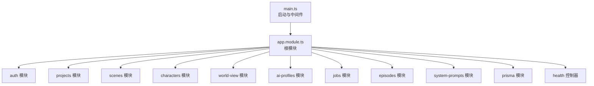
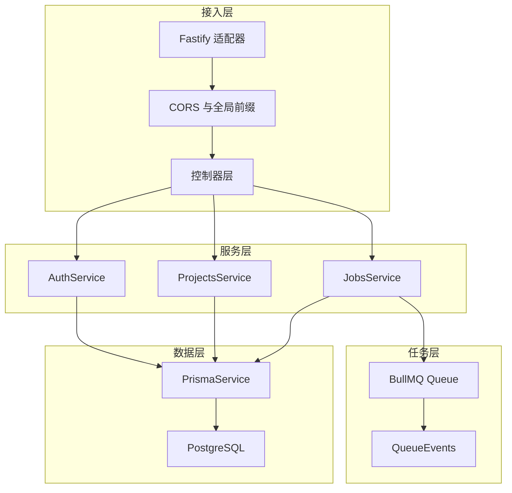
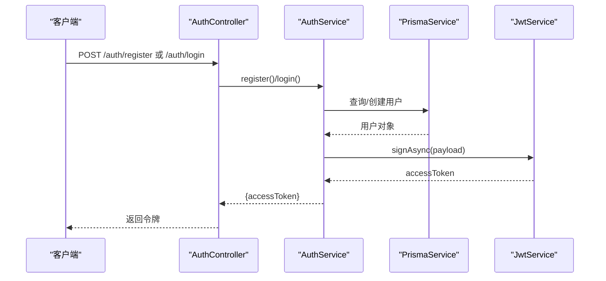
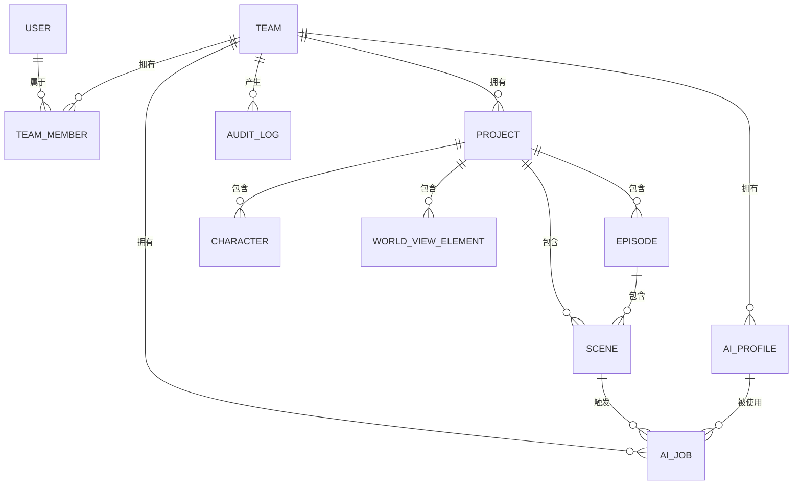
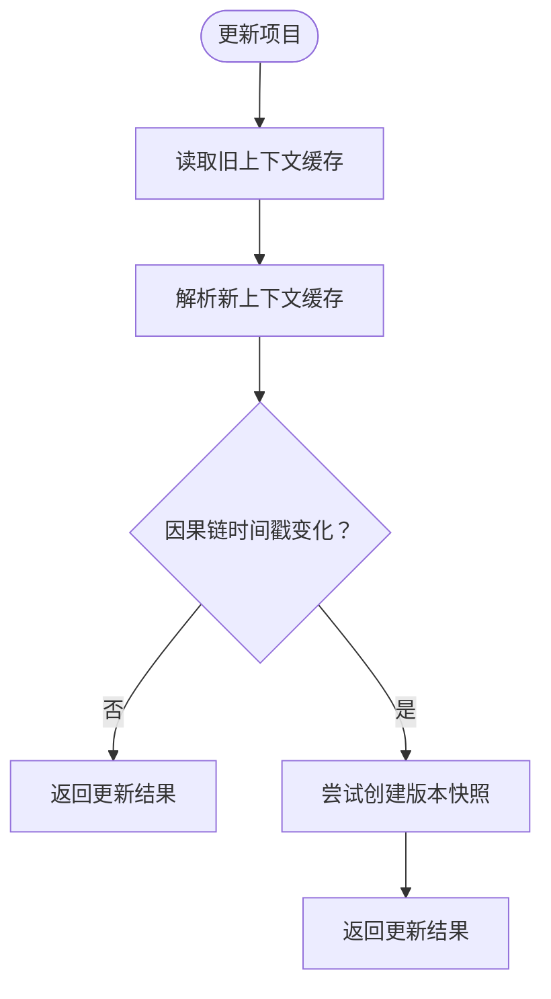
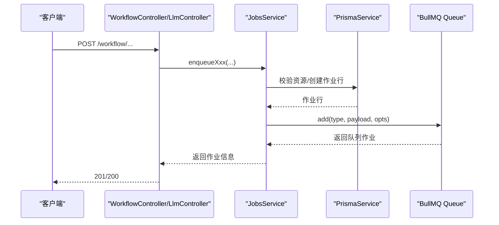
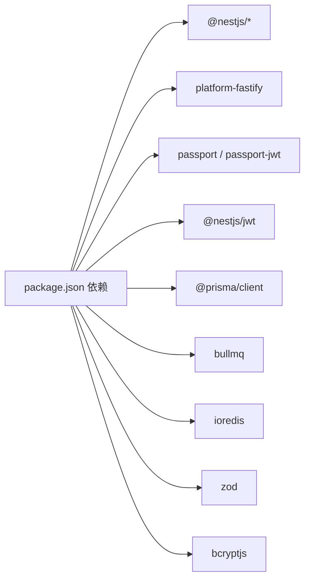

# API服务 (apps/api)

<cite>
**本文引用的文件**
- [apps/api/src/main.ts](file://apps/api/src/main.ts)
- [apps/api/src/app.module.ts](file://apps/api/src/app.module.ts)
- [apps/api/src/config/env.ts](file://apps/api/src/config/env.ts)
- [apps/api/package.json](file://apps/api/package.json)
- [apps/api/src/auth/auth.module.ts](file://apps/api/src/auth/auth.module.ts)
- [apps/api/src/auth/auth.service.ts](file://apps/api/src/auth/auth.service.ts)
- [apps/api/src/auth/jwt-auth.guard.ts](file://apps/api/src/auth/jwt-auth.guard.ts)
- [apps/api/src/auth/jwt.strategy.ts](file://apps/api/src/auth/jwt.strategy.ts)
- [apps/api/src/common/all-exceptions.filter.ts](file://apps/api/src/common/all-exceptions.filter.ts)
- [apps/api/src/prisma/prisma.module.ts](file://apps/api/src/prisma/prisma.module.ts)
- [apps/api/src/prisma/prisma.service.ts](file://apps/api/src/prisma/prisma.service.ts)
- [apps/api/prisma/schema.prisma](file://apps/api/prisma/schema.prisma)
- [apps/api/src/projects/projects.module.ts](file://apps/api/src/projects/projects.module.ts)
- [apps/api/src/projects/projects.service.ts](file://apps/api/src/projects/projects.service.ts)
- [apps/api/src/jobs/jobs.module.ts](file://apps/api/src/jobs/jobs.module.ts)
- [apps/api/src/jobs/jobs.service.ts](file://apps/api/src/jobs/jobs.service.ts)
- [apps/api/src/jobs/queue.providers.ts](file://apps/api/src/jobs/queue.providers.ts)
- [apps/api/src/jobs/workflow.controller.ts](file://apps/api/src/jobs/workflow.controller.ts)
- [apps/api/src/jobs/llm.controller.ts](file://apps/api/src/jobs/llm.controller.ts)
</cite>

## 目录

1. [简介](#简介)
2. [项目结构](#项目结构)
3. [核心组件](#核心组件)
4. [架构总览](#架构总览)
5. [详细组件分析](#详细组件分析)
6. [依赖分析](#依赖分析)
7. [性能考虑](#性能考虑)
8. [故障排查指南](#故障排查指南)
9. [结论](#结论)
10. [附录](#附录)

## 简介

本文件为 AIXSSS API 服务（apps/api）的全面技术文档，基于 NestJS + Fastify 构建，采用模块化控制器与服务层分离的设计，结合 BullMQ 实现异步任务队列与进度追踪，并通过 Prisma ORM 管理 PostgreSQL 数据库。文档涵盖认证授权（JWT）、权限控制策略、数据模型与关系、各业务模块（项目管理、角色与团队、场景管理、AI配置与作业管理等）实现细节、错误处理与异常过滤、日志记录以及 API 接口说明与使用示例。

## 项目结构

应用入口在 main.ts 中初始化 Fastify 适配器，启用 CORS、全局前缀、全局异常过滤器；根模块 app.module.ts 组织所有子模块，包括认证、项目、场景、角色、世界观、AI配置、健康检查、作业与工作流、剧集与系统提示等。

图表来源

- [apps/api/src/main.ts](file://apps/api/src/main.ts#L9-L26)
- [apps/api/src/app.module.ts](file://apps/api/src/app.module.ts#L16-L35)

章节来源

- [apps/api/src/main.ts](file://apps/api/src/main.ts#L1-L34)
- [apps/api/src/app.module.ts](file://apps/api/src/app.module.ts#L1-L37)

## 核心组件

- 启动与运行时
  - Fastify 适配器、CORS 配置、全局前缀、全局异常过滤器注册。
- 配置与环境
  - Zod 校验的环境变量，包含端口、数据库连接、JWT 密钥、Redis 连接、队列名称、跨域来源等。
- 认证与授权
  - 基于 Passport + JWT 的策略与守卫，登录/注册流程与访问令牌签发。
- 数据持久化
  - Prisma 全局单例服务，连接 PostgreSQL，提供事务与查询能力。
- 任务队列与工作流
  - BullMQ 队列与事件监听，统一作业服务封装，支持多阶段工作流与进度追踪。
- 错误处理
  - 全局异常过滤器，统一响应体与日志输出，生产环境隐藏内部错误细节。

章节来源

- [apps/api/src/main.ts](file://apps/api/src/main.ts#L9-L26)
- [apps/api/src/config/env.ts](file://apps/api/src/config/env.ts#L3-L12)
- [apps/api/src/auth/auth.module.ts](file://apps/api/src/auth/auth.module.ts#L10-L27)
- [apps/api/src/auth/auth.service.ts](file://apps/api/src/auth/auth.service.ts#L14-L72)
- [apps/api/src/auth/jwt-auth.guard.ts](file://apps/api/src/auth/jwt-auth.guard.ts#L1-L8)
- [apps/api/src/auth/jwt.strategy.ts](file://apps/api/src/auth/jwt.strategy.ts#L14-L31)
- [apps/api/src/prisma/prisma.module.ts](file://apps/api/src/prisma/prisma.module.ts#L4-L9)
- [apps/api/src/prisma/prisma.service.ts](file://apps/api/src/prisma/prisma.service.ts#L4-L13)
- [apps/api/src/jobs/jobs.module.ts](file://apps/api/src/jobs/jobs.module.ts#L8-L13)
- [apps/api/src/jobs/queue.providers.ts](file://apps/api/src/jobs/queue.providers.ts#L17-L36)
- [apps/api/src/common/all-exceptions.filter.ts](file://apps/api/src/common/all-exceptions.filter.ts#L34-L84)

## 架构总览

整体采用分层架构：控制器负责请求路由与参数校验，服务层执行业务逻辑并调用 Prisma 与队列，Prisma 负责数据持久化，BullMQ 负责异步任务编排与进度追踪。认证模块贯穿所有受保护接口。

图表来源

- [apps/api/src/main.ts](file://apps/api/src/main.ts#L9-L26)
- [apps/api/src/auth/auth.service.ts](file://apps/api/src/auth/auth.service.ts#L8-L12)
- [apps/api/src/projects/projects.service.ts](file://apps/api/src/projects/projects.service.ts#L34-L40)
- [apps/api/src/jobs/jobs.service.ts](file://apps/api/src/jobs/jobs.service.ts#L37-L43)
- [apps/api/src/prisma/prisma.service.ts](file://apps/api/src/prisma/prisma.service.ts#L4-L13)
- [apps/api/src/jobs/queue.providers.ts](file://apps/api/src/jobs/queue.providers.ts#L17-L36)

## 详细组件分析

### 认证与授权（JWT）

- 模块装配
  - 注册 JwtModule，异步注入 ConfigService 获取 JWT_SECRET 与过期时间。
  - 提供 JwtStrategy 与 AuthGuard，从请求头提取 Bearer Token 并验证签名。
- 登录/注册
  - 注册：邮箱唯一性检查、密码哈希、创建用户与团队成员关系，签发访问令牌。
  - 登录：邮箱查找、密码比对、团队绑定、签发访问令牌。
- 权限控制
  - 使用 JwtAuthGuard 保护受控路由，当前用户通过装饰器注入，用于资源级权限判断（例如团队隔离）。

图表来源

- [apps/api/src/auth/auth.module.ts](file://apps/api/src/auth/auth.module.ts#L14-L21)
- [apps/api/src/auth/auth.service.ts](file://apps/api/src/auth/auth.service.ts#L22-L72)
- [apps/api/src/auth/jwt.strategy.ts](file://apps/api/src/auth/jwt.strategy.ts#L14-L31)

章节来源

- [apps/api/src/auth/auth.module.ts](file://apps/api/src/auth/auth.module.ts#L10-L27)
- [apps/api/src/auth/auth.service.ts](file://apps/api/src/auth/auth.service.ts#L1-L77)
- [apps/api/src/auth/jwt-auth.guard.ts](file://apps/api/src/auth/jwt-auth.guard.ts#L1-L8)
- [apps/api/src/auth/jwt.strategy.ts](file://apps/api/src/auth/jwt.strategy.ts#L1-L34)

### 数据模型与 Prisma ORM

- 数据库与枚举
  - 支持团队角色、项目工作流状态、剧集工作流状态、场景状态、AI 供应商类型、AI 作业状态、叙事因果链版本来源等枚举。
- 核心实体
  - 用户、团队、团队成员、项目、剧集、场景、角色、世界观元素、AI 配置、审计日志、AI 作业、系统提示等。
- 关系与索引
  - 多对一/一对多关系明确，大量索引优化查询；项目与场景/剧集/角色/世界观元素强关联；作业与项目/剧集/场景/配置关联。
- 服务与生命周期
  - PrismaService 继承 PrismaClient，在模块初始化与销毁时自动连接/断开数据库。

图表来源

- [apps/api/prisma/schema.prisma](file://apps/api/prisma/schema.prisma#L75-L350)

章节来源

- [apps/api/prisma/schema.prisma](file://apps/api/prisma/schema.prisma#L1-L351)
- [apps/api/src/prisma/prisma.module.ts](file://apps/api/src/prisma/prisma.module.ts#L4-L9)
- [apps/api/src/prisma/prisma.service.ts](file://apps/api/src/prisma/prisma.service.ts#L4-L13)

### 项目管理模块

- 职责
  - 列表、详情、创建、更新、软删除；自动统计剧集与场景进度；在叙事因果链变更时自动写入版本快照。
- 关键点
  - 创建时自动初始化第一条剧集；更新时对上下文缓存中的因果链进行比对，必要时写入版本。
  - 统计信息批量计算，避免 N+1 查询。

图表来源

- [apps/api/src/projects/projects.service.ts](file://apps/api/src/projects/projects.service.ts#L141-L198)

章节来源

- [apps/api/src/projects/projects.module.ts](file://apps/api/src/projects/projects.module.ts#L7-L11)
- [apps/api/src/projects/projects.service.ts](file://apps/api/src/projects/projects.service.ts#L1-L215)

### 作业与工作流（BullMQ 集成）

- 模块与提供者
  - 通过 queue.providers.ts 注入队列与事件实例，使用 Redis 连接字符串解析为主机/端口/密码。
- 作业服务
  - 封装所有工作流 enqueue 方法，统一参数校验、资源存在性检查、项目可规划性校验、队列投递与 Prisma 作业行创建。
  - 支持多阶段工作流：规划剧集、构建因果链、生成剧集核心表达、生成场景清单、生成场景锚点、关键帧提示、故事板、对话、动作提示、视频生成、批量精炼等。
  - 对 UI 提示的状态更新采取“尽力而为”，不影响主流程。
- 控制器
  - workflow.controller.ts 提供 REST 接口，统一鉴权与参数校验。
  - llm.controller.ts 提供结构化聊天与结构化测试作业。

图表来源

- [apps/api/src/jobs/workflow.controller.ts](file://apps/api/src/jobs/workflow.controller.ts#L49-L264)
- [apps/api/src/jobs/llm.controller.ts](file://apps/api/src/jobs/llm.controller.ts#L55-L71)
- [apps/api/src/jobs/jobs.service.ts](file://apps/api/src/jobs/jobs.service.ts#L101-L149)
- [apps/api/src/jobs/queue.providers.ts](file://apps/api/src/jobs/queue.providers.ts#L17-L36)

章节来源

- [apps/api/src/jobs/jobs.module.ts](file://apps/api/src/jobs/jobs.module.ts#L8-L13)
- [apps/api/src/jobs/jobs.service.ts](file://apps/api/src/jobs/jobs.service.ts#L1-L800)
- [apps/api/src/jobs/queue.providers.ts](file://apps/api/src/jobs/queue.providers.ts#L1-L39)
- [apps/api/src/jobs/workflow.controller.ts](file://apps/api/src/jobs/workflow.controller.ts#L1-L266)
- [apps/api/src/jobs/llm.controller.ts](file://apps/api/src/jobs/llm.controller.ts#L1-L75)

### 场景管理与系统提示

- 场景管理
  - 提供场景的增删改查、状态流转与进度追踪；与项目/剧集/作业形成闭环。
- 系统提示
  - 提供系统提示的增删改查与自定义标记，支持团队维度隔离。

章节来源

- [apps/api/src/scenes/scenes.controller.ts](file://apps/api/src/scenes/scenes.controller.ts)
- [apps/api/src/scenes/scenes.service.ts](file://apps/api/src/scenes/scenes.service.ts)
- [apps/api/src/system-prompts/system-prompts.controller.ts](file://apps/api/src/system-prompts/system-prompts.controller.ts)
- [apps/api/src/system-prompts/system-prompts.service.ts](file://apps/api/src/system-prompts/system-prompts.service.ts)

### 角色与团队、世界观

- 角色与团队
  - 团队成员角色（OWNER/ADMIN/MEMBER），用于资源访问控制与操作审计。
- 世界观
  - 项目维度的世界观元素管理，支持排序与内容维护。

章节来源

- [apps/api/src/characters/characters.controller.ts](file://apps/api/src/characters/characters.controller.ts)
- [apps/api/src/characters/characters.service.ts](file://apps/api/src/characters/characters.service.ts)
- [apps/api/src/world-view/world-view.controller.ts](file://apps/api/src/world-view/world-view.controller.ts)
- [apps/api/src/world-view/world-view.service.ts](file://apps/api/src/world-view/world-view.service.ts)

### 健康检查与通用工具

- 健康检查
  - 提供 /api/health 接口，便于容器编排与运维监控。
- 通用工具
  - 全局异常过滤器统一错误响应与日志输出，Zod 参数校验工具。

章节来源

- [apps/api/src/health/health.controller.ts](file://apps/api/src/health/health.controller.ts)
- [apps/api/src/common/all-exceptions.filter.ts](file://apps/api/src/common/all-exceptions.filter.ts#L34-L84)

## 依赖分析

- 运行时依赖
  - NestJS 核心、Fastify 适配器、Passport/JWT、Prisma 客户端、BullMQ、ioredis、bcryptjs、zod。
- 构建与开发
  - TypeScript、ESLint、Vitest、Prisma CLI。
- 环境变量
  - NODE_ENV、PORT、DATABASE_URL、JWT_SECRET、API_KEY_ENCRYPTION_KEY、REDIS_URL、AI_QUEUE_NAME、CORS_ORIGIN。

图表来源

- [apps/api/package.json](file://apps/api/package.json#L18-L36)

章节来源

- [apps/api/package.json](file://apps/api/package.json#L1-L52)
- [apps/api/src/config/env.ts](file://apps/api/src/config/env.ts#L3-L12)

## 性能考虑

- 数据访问
  - 使用 Prisma 事务保证一致性；批量统计采用并发 Promise 计算，减少往返次数。
- 队列与重试
  - 为不同作业设置合理的重试次数与指数退避；完成/失败作业清理策略限制存储占用。
- 缓存与上下文
  - 项目上下文缓存中携带因果链时间戳，仅在变更时写入版本，降低冗余写入。
- 日志与可观测性
  - 全局异常过滤器输出请求 ID、方法、URL、状态码与消息，便于定位问题。

## 故障排查指南

- 认证失败
  - 检查 JWT_SECRET 是否正确配置；确认请求头 Authorization: Bearer 令牌有效且未过期。
- 资源不存在或无权限
  - 确认 teamId 与资源归属一致；确保用户在团队中有对应角色。
- 作业未执行
  - 检查 Redis 连接是否可达；确认队列名称与配置一致；查看队列事件与作业状态。
- 数据库连接失败
  - 检查 DATABASE_URL；确认 PostgreSQL 可达且凭据正确。
- 参数校验失败
  - 使用 Zod 校验的请求体不符合规范，检查字段类型与范围。

章节来源

- [apps/api/src/common/all-exceptions.filter.ts](file://apps/api/src/common/all-exceptions.filter.ts#L34-L84)
- [apps/api/src/auth/jwt.strategy.ts](file://apps/api/src/auth/jwt.strategy.ts#L14-L31)
- [apps/api/src/jobs/queue.providers.ts](file://apps/api/src/jobs/queue.providers.ts#L7-L15)

## 结论

本 API 服务以 NestJS + Fastify 为基础，结合 Prisma 与 BullMQ，实现了高内聚、低耦合的模块化架构。认证授权、数据模型、工作流与进度追踪均具备清晰的边界与扩展点，适合在复杂创作工作流场景下持续演进。

## 附录

### API 接口概览（按模块）

- 认证
  - POST /api/auth/register
  - POST /api/auth/login
- 项目
  - GET /api/projects
  - GET /api/projects/:id
  - POST /api/projects
  - PUT /api/projects/:id
  - DELETE /api/projects/:id
- 工作流（受保护）
  - POST /api/workflow/projects/:projectId/episode-plan
  - POST /api/workflow/projects/:projectId/narrative-causal-chain
  - POST /api/workflow/projects/:projectId/episodes/:episodeId/core-expression
  - POST /api/workflow/projects/:projectId/episodes/core-expression/batch
  - POST /api/workflow/projects/:projectId/episodes/:episodeId/scene-list
  - POST /api/workflow/projects/:projectId/scene-list
  - POST /api/workflow/projects/:projectId/scenes/:sceneId/scene-anchor
  - POST /api/workflow/projects/:projectId/scenes/:sceneId/keyframe-prompt
  - POST /api/workflow/projects/:projectId/scenes/:sceneId/storyboard/scene-bible
  - POST /api/workflow/projects/:projectId/scenes/:sceneId/storyboard/plan
  - POST /api/workflow/projects/:projectId/scenes/:sceneId/storyboard/groups/:groupId
  - POST /api/workflow/projects/:projectId/scenes/:sceneId/storyboard/translate
  - POST /api/workflow/projects/:projectId/scenes/:sceneId/storyboard/back-translate
  - POST /api/workflow/projects/:projectId/scenes/:sceneId/generate-images
  - POST /api/workflow/projects/:projectId/scenes/:sceneId/generate-video
  - POST /api/workflow/projects/:projectId/scenes/:sceneId/motion-prompt
  - POST /api/workflow/projects/:projectId/scenes/:sceneId/dialogue
  - POST /api/workflow/projects/:projectId/scenes/:sceneId/refine-all
  - POST /api/workflow/projects/:projectId/scenes/refine-all
- LLM（受保护）
  - POST /api/llm/chat
  - POST /api/llm/structured-test
- 健康检查
  - GET /api/health

章节来源

- [apps/api/src/auth/auth.controller.ts](file://apps/api/src/auth/auth.controller.ts)
- [apps/api/src/projects/projects.controller.ts](file://apps/api/src/projects/projects.controller.ts)
- [apps/api/src/jobs/workflow.controller.ts](file://apps/api/src/jobs/workflow.controller.ts#L49-L264)
- [apps/api/src/jobs/llm.controller.ts](file://apps/api/src/jobs/llm.controller.ts#L55-L71)
- [apps/api/src/health/health.controller.ts](file://apps/api/src/health/health.controller.ts)
