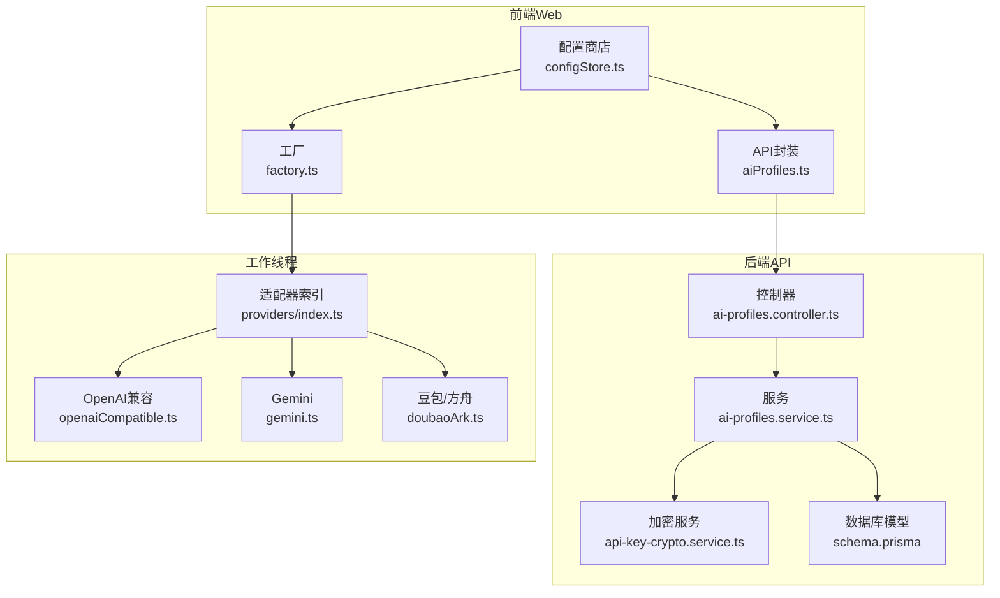
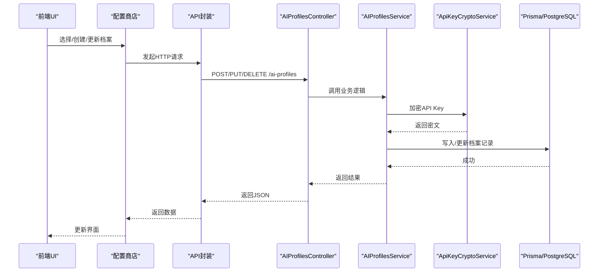
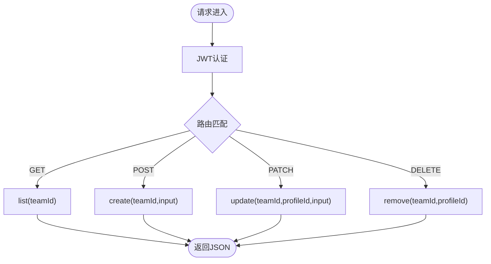
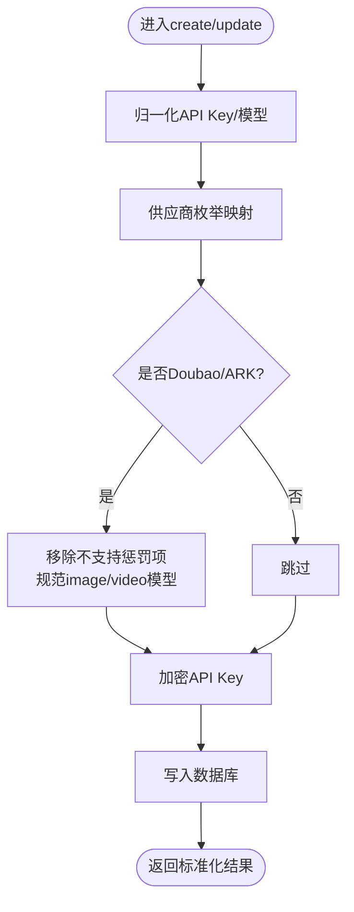
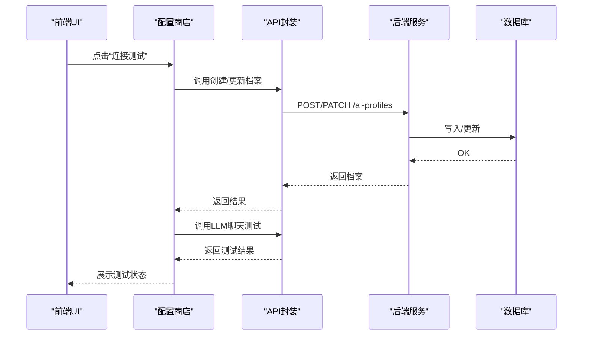
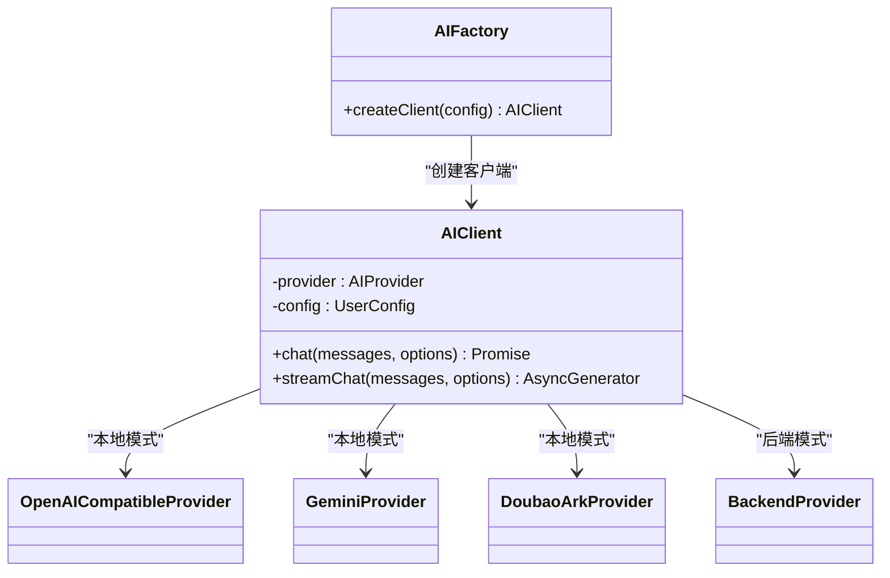
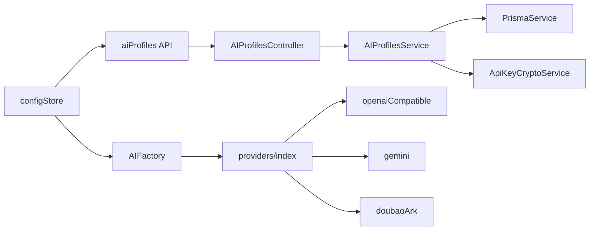
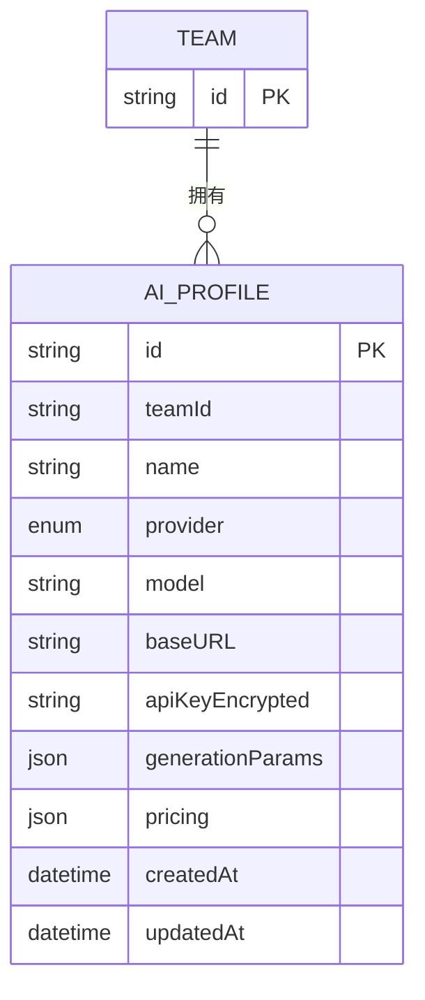

# AI配置管理模块

<cite>
**本文档引用的文件**
- [apps/api/src/ai-profiles/ai-profiles.module.ts](file://apps/api/src/ai-profiles/ai-profiles.module.ts)
- [apps/api/src/ai-profiles/ai-profiles.controller.ts](file://apps/api/src/ai-profiles/ai-profiles.controller.ts)
- [apps/api/src/ai-profiles/ai-profiles.service.ts](file://apps/api/src/ai-profiles/ai-profiles.service.ts)
- [apps/api/src/crypto/api-key-crypto.service.ts](file://apps/api/src/crypto/api-key-crypto.service.ts)
- [apps/api/src/config/env.ts](file://apps/api/src/config/env.ts)
- [apps/api/prisma/schema.prisma](file://apps/api/prisma/schema.prisma)
- [packages/shared/src/schemas/aiProfile.ts](file://packages/shared/src/schemas/aiProfile.ts)
- [apps/web/src/lib/api/aiProfiles.ts](file://apps/web/src/lib/api/aiProfiles.ts)
- [apps/web/src/stores/configStore.ts](file://apps/web/src/stores/configStore.ts)
- [apps/web/src/lib/ai/factory.ts](file://apps/web/src/lib/ai/factory.ts)
- [apps/web/src/lib/ai/types.ts](file://apps/web/src/lib/ai/types.ts)
- [apps/worker/src/providers/index.ts](file://apps/worker/src/providers/index.ts)
- [apps/worker/src/providers/openaiCompatible.ts](file://apps/worker/src/providers/openaiCompatible.ts)
- [apps/worker/src/providers/gemini.ts](file://apps/worker/src/providers/gemini.ts)
- [apps/worker/src/providers/doubaoArk.ts](file://apps/worker/src/providers/doubaoArk.ts)
- [apps/worker/src/providers/types.ts](file://apps/worker/src/providers/types.ts)
</cite>

## 目录

1. [简介](#简介)
2. [项目结构](#项目结构)
3. [核心组件](#核心组件)
4. [架构总览](#架构总览)
5. [详细组件分析](#详细组件分析)
6. [依赖关系分析](#依赖关系分析)
7. [性能考虑](#性能考虑)
8. [故障排除指南](#故障排除指南)
9. [结论](#结论)
10. [附录](#附录)

## 简介

本模块提供统一的AI配置档案管理能力，支持多供应商（DeepSeek、Kimi、Gemini、OpenAI兼容、豆包/方舟）的配置创建、编辑、删除与切换，并在后端模式下通过服务端档案实现密钥加密存储与运行时动态选择。前端通过配置商店与API交互，实现档案的增删改查、连接测试与活动档案切换；后端通过服务端档案与加密服务保障密钥安全；工作线程侧提供各供应商适配器，实现统一的聊天与生图调用。

## 项目结构

AI配置管理模块横跨后端API、共享Schema、前端Web应用与工作线程四个层面：

- 后端API：控制器负责REST接口，服务负责业务逻辑与数据持久化，加密服务负责密钥加解密。
- 共享Schema：定义配置档案的输入输出校验规则与定价结构。
- 前端Web：配置商店负责本地/服务端模式下的档案生命周期管理与连接测试。
- 工作线程：提供各供应商的适配器，统一聊天与生图调用入口。

**图表来源**

- [apps/web/src/stores/configStore.ts](file://apps/web/src/stores/configStore.ts#L183-L800)
- [apps/web/src/lib/api/aiProfiles.ts](file://apps/web/src/lib/api/aiProfiles.ts#L1-L63)
- [apps/web/src/lib/ai/factory.ts](file://apps/web/src/lib/ai/factory.ts#L77-L98)
- [apps/api/src/ai-profiles/ai-profiles.controller.ts](file://apps/api/src/ai-profiles/ai-profiles.controller.ts#L1-L38)
- [apps/api/src/ai-profiles/ai-profiles.service.ts](file://apps/api/src/ai-profiles/ai-profiles.service.ts#L74-L202)
- [apps/api/src/crypto/api-key-crypto.service.ts](file://apps/api/src/crypto/api-key-crypto.service.ts#L1-L39)
- [apps/api/prisma/schema.prisma](file://apps/api/prisma/schema.prisma#L275-L292)
- [apps/worker/src/providers/index.ts](file://apps/worker/src/providers/index.ts#L1-L44)
- [apps/worker/src/providers/openaiCompatible.ts](file://apps/worker/src/providers/openaiCompatible.ts#L1-L438)
- [apps/worker/src/providers/gemini.ts](file://apps/worker/src/providers/gemini.ts#L1-L125)
- [apps/worker/src/providers/doubaoArk.ts](file://apps/worker/src/providers/doubaoArk.ts#L1-L301)

**章节来源**

- [apps/api/src/ai-profiles/ai-profiles.module.ts](file://apps/api/src/ai-profiles/ai-profiles.module.ts#L1-L13)
- [apps/api/src/ai-profiles/ai-profiles.controller.ts](file://apps/api/src/ai-profiles/ai-profiles.controller.ts#L1-L38)
- [apps/api/src/ai-profiles/ai-profiles.service.ts](file://apps/api/src/ai-profiles/ai-profiles.service.ts#L74-L202)
- [apps/api/src/crypto/api-key-crypto.service.ts](file://apps/api/src/crypto/api-key-crypto.service.ts#L1-L39)
- [apps/api/prisma/schema.prisma](file://apps/api/prisma/schema.prisma#L275-L292)
- [packages/shared/src/schemas/aiProfile.ts](file://packages/shared/src/schemas/aiProfile.ts#L1-L51)
- [apps/web/src/lib/api/aiProfiles.ts](file://apps/web/src/lib/api/aiProfiles.ts#L1-L63)
- [apps/web/src/stores/configStore.ts](file://apps/web/src/stores/configStore.ts#L183-L800)
- [apps/web/src/lib/ai/factory.ts](file://apps/web/src/lib/ai/factory.ts#L77-L98)
- [apps/worker/src/providers/index.ts](file://apps/worker/src/providers/index.ts#L1-L44)

## 核心组件

- AIProfilesModule：后端模块装配，注入控制器与服务。
- AIProfilesController：REST API入口，提供列表、创建、更新、删除。
- AIProfilesService：核心业务逻辑，负责输入校验、密钥加密、模型与参数归一化、数据库持久化。
- ApiKeyCryptoService：基于AES-256-GCM的密钥加密/解密服务，密钥来自环境变量。
- 配置商店（configStore）：前端档案生命周期管理、连接测试、活动档案切换。
- 适配器索引（providers/index）：根据供应商类型路由到具体实现。
- 供应商适配器：OpenAI兼容、Gemini、豆包/方舟的聊天与生图实现。

**章节来源**

- [apps/api/src/ai-profiles/ai-profiles.module.ts](file://apps/api/src/ai-profiles/ai-profiles.module.ts#L6-L10)
- [apps/api/src/ai-profiles/ai-profiles.controller.ts](file://apps/api/src/ai-profiles/ai-profiles.controller.ts#L11-L35)
- [apps/api/src/ai-profiles/ai-profiles.service.ts](file://apps/api/src/ai-profiles/ai-profiles.service.ts#L74-L202)
- [apps/api/src/crypto/api-key-crypto.service.ts](file://apps/api/src/crypto/api-key-crypto.service.ts#L7-L36)
- [apps/web/src/stores/configStore.ts](file://apps/web/src/stores/configStore.ts#L183-L800)
- [apps/worker/src/providers/index.ts](file://apps/worker/src/providers/index.ts#L12-L43)

## 架构总览

AI配置管理采用分层架构：

- 表现层：前端配置商店与API封装。
- 控制层：后端控制器接收请求并委派给服务。
- 业务层：服务进行输入校验、参数归一化、密钥加密与数据库操作。
- 数据层：Prisma模型持久化到PostgreSQL。
- 适配层：工作线程适配器统一调用各供应商API。

**图表来源**

- [apps/web/src/stores/configStore.ts](file://apps/web/src/stores/configStore.ts#L585-L721)
- [apps/web/src/lib/api/aiProfiles.ts](file://apps/web/src/lib/api/aiProfiles.ts#L27-L62)
- [apps/api/src/ai-profiles/ai-profiles.controller.ts](file://apps/api/src/ai-profiles/ai-profiles.controller.ts#L19-L34)
- [apps/api/src/ai-profiles/ai-profiles.service.ts](file://apps/api/src/ai-profiles/ai-profiles.service.ts#L101-L132)
- [apps/api/src/crypto/api-key-crypto.service.ts](file://apps/api/src/crypto/api-key-crypto.service.ts#L17-L35)
- [apps/api/prisma/schema.prisma](file://apps/api/prisma/schema.prisma#L275-L292)

## 详细组件分析

### AIProfilesModule

- 职责：装配控制器与服务，注入加密服务。
- 依赖：AIProfilesController、AIProfilesService、ApiKeyCryptoService。

**章节来源**

- [apps/api/src/ai-profiles/ai-profiles.module.ts](file://apps/api/src/ai-profiles/ai-profiles.module.ts#L6-L10)

### AIProfilesController

- 认证：使用JWT守卫保护所有路由。
- 接口：
  - GET /ai-profiles：列出团队内所有档案。
  - POST /ai-profiles：创建新档案。
  - PATCH /ai-profiles/:profileId：更新指定档案。
  - DELETE /ai-profiles/:profileId：删除指定档案。
- 输入校验：使用共享Schema进行Zod校验，错误时抛出400。

**图表来源**

- [apps/api/src/ai-profiles/ai-profiles.controller.ts](file://apps/api/src/ai-profiles/ai-profiles.controller.ts#L14-L35)

**章节来源**

- [apps/api/src/ai-profiles/ai-profiles.controller.ts](file://apps/api/src/ai-profiles/ai-profiles.controller.ts#L1-L38)

### AIProfilesService

- 列表：按团队ID查询并转换返回字段。
- 创建：
  - 归一化API Key与模型（去除Bearer前缀、空白字符、特殊格式）。
  - 供应商到数据库枚举映射。
  - Doubao/ARK参数兼容处理（移除不支持的惩罚项，规范image/video模型）。
  - 使用加密服务加密后存入数据库。
- 更新：
  - 支持部分字段更新，动态决定供应商与模型归一化策略。
  - 特殊处理：Kimi不允许baseURL，Doubao/ARK参数兼容。
  - API Key更新时重新加密。
- 删除：按团队与ID查找存在性后删除。
- 时间戳：统一转为ISO字符串。

**图表来源**

- [apps/api/src/ai-profiles/ai-profiles.service.ts](file://apps/api/src/ai-profiles/ai-profiles.service.ts#L101-L132)
- [apps/api/src/ai-profiles/ai-profiles.service.ts](file://apps/api/src/ai-profiles/ai-profiles.service.ts#L134-L189)
- [apps/api/src/ai-profiles/ai-profiles.service.ts](file://apps/api/src/ai-profiles/ai-profiles.service.ts#L56-L72)
- [apps/api/src/ai-profiles/ai-profiles.service.ts](file://apps/api/src/ai-profiles/ai-profiles.service.ts#L31-L54)

**章节来源**

- [apps/api/src/ai-profiles/ai-profiles.service.ts](file://apps/api/src/ai-profiles/ai-profiles.service.ts#L81-L199)

### ApiKeyCryptoService

- 密钥来源：从环境变量读取，支持32字节Base64或回退哈希。
- 加密：AES-256-GCM，返回IV.Tag.Ciphertext。
- 解密：校验Tag，还原明文。

**章节来源**

- [apps/api/src/crypto/api-key-crypto.service.ts](file://apps/api/src/crypto/api-key-crypto.service.ts#L7-L36)
- [apps/api/src/config/env.ts](file://apps/api/src/config/env.ts#L8-L8)

### 数据模型与Schema

- 数据库模型：AIProfile包含团队ID、供应商、模型、baseURL、加密API Key、生成参数、定价、时间戳。
- 共享Schema：定义创建/更新输入的字段与范围，定价Schema限定货币与数值范围。

**章节来源**

- [apps/api/prisma/schema.prisma](file://apps/api/prisma/schema.prisma#L275-L292)
- [packages/shared/src/schemas/aiProfile.ts](file://packages/shared/src/schemas/aiProfile.ts#L6-L48)

### 前端配置商店与API

- 配置商店：
  - 后端模式：从服务端拉取档案，不保存明文API Key，仅保存aiProfileId。
  - 连接测试：若无服务端档案则创建临时档案，测试成功后更新或创建正式档案。
  - 活动档案切换：更新本地状态并持久化（localStorage或服务端）。
- API封装：提供列表、创建、更新、删除的HTTP请求方法。

**图表来源**

- [apps/web/src/stores/configStore.ts](file://apps/web/src/stores/configStore.ts#L343-L488)
- [apps/web/src/lib/api/aiProfiles.ts](file://apps/web/src/lib/api/aiProfiles.ts#L23-L62)

**章节来源**

- [apps/web/src/stores/configStore.ts](file://apps/web/src/stores/configStore.ts#L183-L800)
- [apps/web/src/lib/api/aiProfiles.ts](file://apps/web/src/lib/api/aiProfiles.ts#L1-L63)

### 供应商适配器与工厂

- 适配器索引：根据kind路由到具体实现（openai_compatible、doubao_ark、gemini）。
- OpenAI兼容：自动选择chat/completions或/v1/responses，处理响应格式与推理强度映射。
- Gemini：构建contents，支持generationConfig，解析usageMetadata。
- 豆包/方舟：统一使用/responses，提取最终assistant输出，映射token usage，支持JSON结构化输出。

**图表来源**

- [apps/web/src/lib/ai/factory.ts](file://apps/web/src/lib/ai/factory.ts#L77-L98)
- [apps/web/src/lib/ai/types.ts](file://apps/web/src/lib/ai/types.ts#L17-L29)

**章节来源**

- [apps/worker/src/providers/index.ts](file://apps/worker/src/providers/index.ts#L12-L43)
- [apps/worker/src/providers/openaiCompatible.ts](file://apps/worker/src/providers/openaiCompatible.ts#L275-L389)
- [apps/worker/src/providers/gemini.ts](file://apps/worker/src/providers/gemini.ts#L81-L122)
- [apps/worker/src/providers/doubaoArk.ts](file://apps/worker/src/providers/doubaoArk.ts#L210-L251)
- [apps/web/src/lib/ai/factory.ts](file://apps/web/src/lib/ai/factory.ts#L12-L28)

## 依赖关系分析

- 模块耦合：
  - AIProfilesModule装配控制器与服务，服务依赖Prisma与加密服务。
  - 前端配置商店依赖API封装与工厂；工厂根据运行模式选择适配器。
- 外部依赖：
  - PostgreSQL（Prisma）、Redis（队列配置）、供应商API（OpenAI/Gemini/豆包）。
- 循环依赖：未发现循环导入。

**图表来源**

- [apps/api/src/ai-profiles/ai-profiles.controller.ts](file://apps/api/src/ai-profiles/ai-profiles.controller.ts#L1-L38)
- [apps/api/src/ai-profiles/ai-profiles.service.ts](file://apps/api/src/ai-profiles/ai-profiles.service.ts#L74-L80)
- [apps/web/src/stores/configStore.ts](file://apps/web/src/stores/configStore.ts#L183-L800)
- [apps/web/src/lib/ai/factory.ts](file://apps/web/src/lib/ai/factory.ts#L77-L98)
- [apps/worker/src/providers/index.ts](file://apps/worker/src/providers/index.ts#L1-L44)

**章节来源**

- [apps/api/src/ai-profiles/ai-profiles.controller.ts](file://apps/api/src/ai-profiles/ai-profiles.controller.ts#L1-L38)
- [apps/api/src/ai-profiles/ai-profiles.service.ts](file://apps/api/src/ai-profiles/ai-profiles.service.ts#L74-L80)
- [apps/web/src/stores/configStore.ts](file://apps/web/src/stores/configStore.ts#L183-L800)
- [apps/web/src/lib/ai/factory.ts](file://apps/web/src/lib/ai/factory.ts#L77-L98)
- [apps/worker/src/providers/index.ts](file://apps/worker/src/providers/index.ts#L1-L44)

## 性能考虑

- 请求超时：各适配器内置超时控制，默认120秒，可通过环境变量调整。
- 参数归一化：减少无效字段与不兼容参数，降低供应商端错误重试。
- 令牌统计：统一映射prompt/completion/total，便于成本与用量追踪。
- 流式输出：前端包装适配器生成器，增量更新进度面板，改善用户体验。

**章节来源**

- [apps/worker/src/providers/openaiCompatible.ts](file://apps/worker/src/providers/openaiCompatible.ts#L52-L76)
- [apps/worker/src/providers/gemini.ts](file://apps/worker/src/providers/gemini.ts#L15-L20)
- [apps/worker/src/providers/doubaoArk.ts](file://apps/worker/src/providers/doubaoArk.ts#L73-L78)
- [apps/web/src/lib/ai/factory.ts](file://apps/web/src/lib/ai/factory.ts#L47-L75)

## 故障排除指南

- 认证失败（401/403）：检查API Key格式与有效期，确保使用供应商正确的密钥类型（如豆包使用方舟控制台生成的Key）。
- 资源不存在（404）：检查Base URL与模型名称是否正确。
- 限流/配额（429）：稍后重试或更换模型/提升配额。
- 服务端异常（5xx）：稍后重试或切换节点/Base URL。
- 网络/CORS问题：检查网络、代理/VPN及浏览器控制台CORS错误。
- 连接测试失败：前端配置商店会汇总错误信息与建议，按提示修正。

**章节来源**

- [apps/web/src/stores/configStore.ts](file://apps/web/src/stores/configStore.ts#L72-L181)

## 结论

AI配置管理模块通过前后端协作实现了多供应商配置档案的全生命周期管理。后端以服务为核心，结合加密服务与数据库模型，确保密钥安全与数据一致；前端通过配置商店与工厂抽象，提供灵活的档案管理与连接测试能力；工作线程适配器统一了不同供应商的调用差异，为上层业务提供了稳定的AI能力接入。

## 附录

### API定义概览

- GET /ai-profiles：返回团队内所有档案列表。
- POST /ai-profiles：创建新档案，必填字段包含名称、供应商、API Key、模型等。
- PATCH /ai-profiles/:profileId：更新指定档案，支持部分字段更新。
- DELETE /ai-profiles/:profileId：删除指定档案。

**章节来源**

- [apps/api/src/ai-profiles/ai-profiles.controller.ts](file://apps/api/src/ai-profiles/ai-profiles.controller.ts#L14-L35)
- [packages/shared/src/schemas/aiProfile.ts](file://packages/shared/src/schemas/aiProfile.ts#L13-L48)
- [apps/web/src/lib/api/aiProfiles.ts](file://apps/web/src/lib/api/aiProfiles.ts#L23-L62)

### 数据模型概览

**图表来源**

- [apps/api/prisma/schema.prisma](file://apps/api/prisma/schema.prisma#L275-L292)
