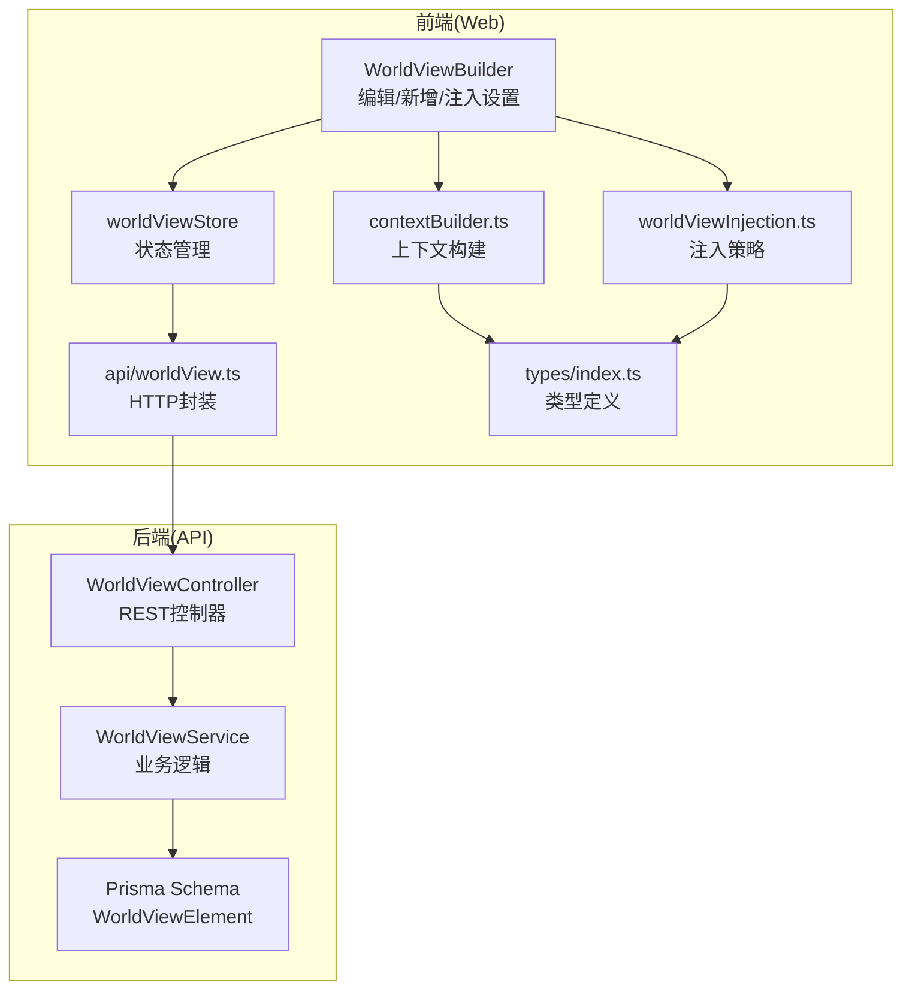
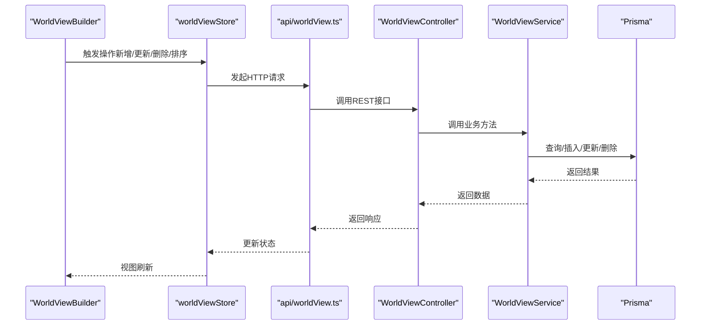
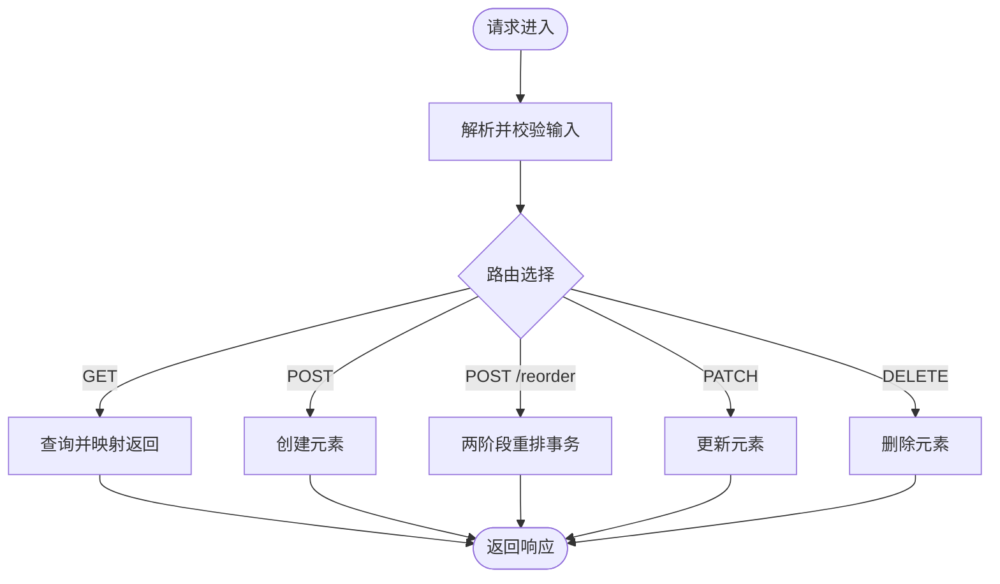
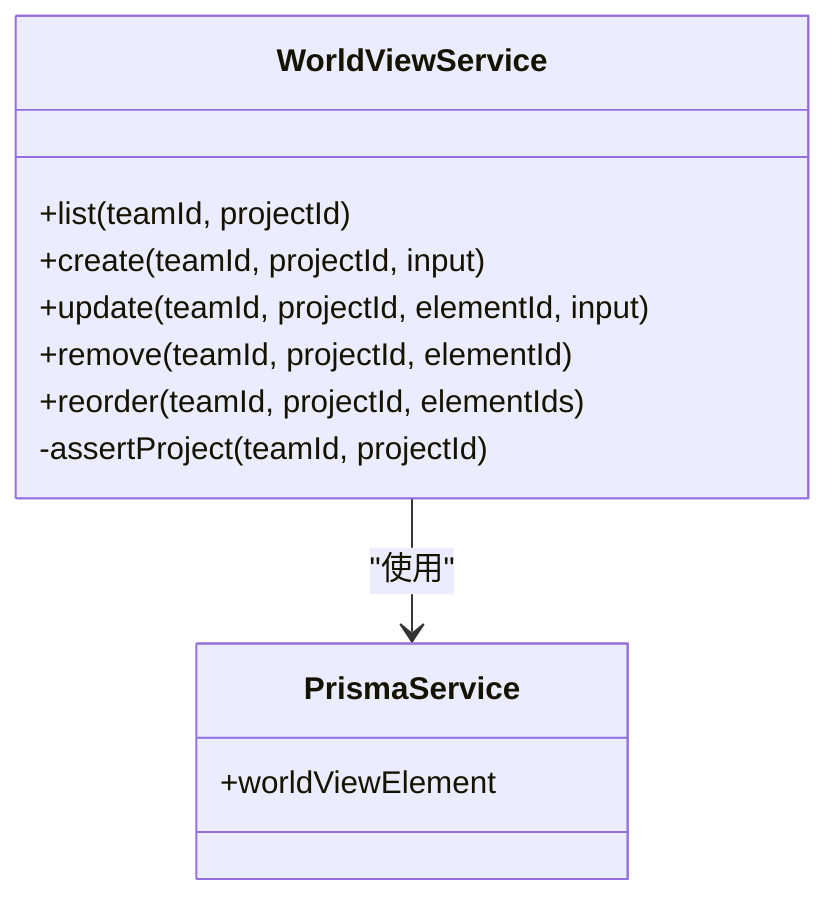
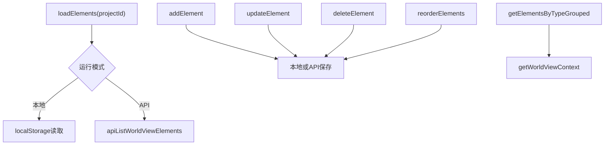
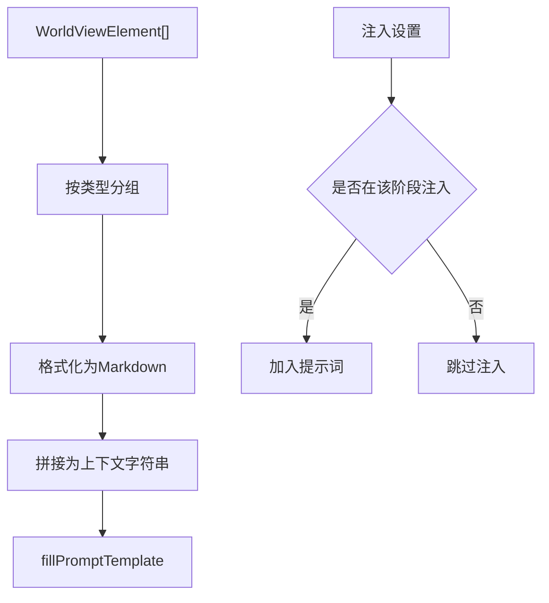
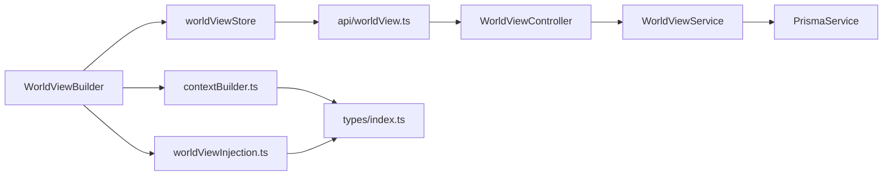

# 世界观管理模块

<cite>
**本文档引用的文件**
- [apps/api/src/world-view/world-view.module.ts](file://apps/api/src/world-view/world-view.module.ts)
- [apps/api/src/world-view/world-view.controller.ts](file://apps/api/src/world-view/world-view.controller.ts)
- [apps/api/src/world-view/world-view.service.ts](file://apps/api/src/world-view/world-view.service.ts)
- [apps/api/prisma/schema.prisma](file://apps/api/prisma/schema.prisma)
- [packages/shared/src/schemas/worldView.ts](file://packages/shared/src/schemas/worldView.ts)
- [apps/web/src/lib/api/worldView.ts](file://apps/web/src/lib/api/worldView.ts)
- [apps/web/src/stores/worldViewStore.ts](file://apps/web/src/stores/worldViewStore.ts)
- [apps/web/src/components/editor/WorldViewBuilder.tsx](file://apps/web/src/components/editor/WorldViewBuilder.tsx)
- [apps/web/src/lib/ai/worldViewInjection.ts](file://apps/web/src/lib/ai/worldViewInjection.ts)
- [apps/web/src/lib/ai/contextBuilder.ts](file://apps/web/src/lib/ai/contextBuilder.ts)
- [apps/web/src/lib/templates.ts](file://apps/web/src/lib/templates.ts)
- [apps/web/src/types/index.ts](file://apps/web/src/types/index.ts)
</cite>

## 目录

1. [简介](#简介)
2. [项目结构](#项目结构)
3. [核心组件](#核心组件)
4. [架构总览](#架构总览)
5. [详细组件分析](#详细组件分析)
6. [依赖关系分析](#依赖关系分析)
7. [性能考量](#性能考量)
8. [故障排查指南](#故障排查指南)
9. [结论](#结论)
10. [附录](#附录)

## 简介

本模块围绕“世界观管理”展开，提供世界观元素的创建、编辑、删除、排序与上下文注入能力。后端采用 NestJS + Prisma 实现 REST 接口，前端使用 React + Zustand 管理本地/云端状态，并通过上下文构建器与注入策略将世界观要素融入 AI 提示词与生成流程。模块还支持模板化提示词与可视化展示，帮助创作者在分镜、场景与角色生成过程中保持设定一致性。

## 项目结构

- 后端模块：world-view 模块包含控制器与服务，负责 CRUD、排序与权限校验。
- 数据模型：Prisma 定义 WorldViewElement 表，包含类型、标题、内容、排序与项目关联。
- 前端存储：zustand 管理元素列表、当前选中项、分组与上下文拼装。
- 上下文与注入：提供注入时机控制与上下文构建器，将世界观要素整合进提示词模板。
- 模板系统：内置多种提示词模板，支持快速应用与变量替换。

图表来源

- [apps/web/src/components/editor/WorldViewBuilder.tsx](file://apps/web/src/components/editor/WorldViewBuilder.tsx#L40-L584)
- [apps/web/src/stores/worldViewStore.ts](file://apps/web/src/stores/worldViewStore.ts#L1-L211)
- [apps/web/src/lib/api/worldView.ts](file://apps/web/src/lib/api/worldView.ts#L1-L60)
- [apps/web/src/lib/ai/contextBuilder.ts](file://apps/web/src/lib/ai/contextBuilder.ts#L227-L270)
- [apps/web/src/lib/ai/worldViewInjection.ts](file://apps/web/src/lib/ai/worldViewInjection.ts#L1-L192)
- [apps/api/src/world-view/world-view.controller.ts](file://apps/api/src/world-view/world-view.controller.ts#L1-L58)
- [apps/api/src/world-view/world-view.service.ts](file://apps/api/src/world-view/world-view.service.ts#L1-L129)
- [apps/api/prisma/schema.prisma](file://apps/api/prisma/schema.prisma#L259-L273)

章节来源

- [apps/api/src/world-view/world-view.module.ts](file://apps/api/src/world-view/world-view.module.ts#L1-L12)
- [apps/api/prisma/schema.prisma](file://apps/api/prisma/schema.prisma#L259-L273)
- [apps/web/src/stores/worldViewStore.ts](file://apps/web/src/stores/worldViewStore.ts#L1-L211)

## 核心组件

- WorldViewModule：后端模块装配，注册控制器与服务。
- WorldViewController：REST 控制器，提供列表、创建、排序、更新、删除接口。
- WorldViewService：业务服务，执行权限校验、数据访问与事务处理。
- Prisma Model：WorldViewElement，承载世界观元素的持久化结构。
- 前端 Store：worldViewStore，管理元素列表、分组与上下文拼装。
- 上下文构建器：buildWorldViewContext，将元素按类型分组并格式化。
- 注入策略：控制在分镜列表、场景锚点、角色生成等阶段注入世界观。

章节来源

- [apps/api/src/world-view/world-view.module.ts](file://apps/api/src/world-view/world-view.module.ts#L1-L12)
- [apps/api/src/world-view/world-view.controller.ts](file://apps/api/src/world-view/world-view.controller.ts#L1-L58)
- [apps/api/src/world-view/world-view.service.ts](file://apps/api/src/world-view/world-view.service.ts#L1-L129)
- [apps/api/prisma/schema.prisma](file://apps/api/prisma/schema.prisma#L259-L273)
- [apps/web/src/stores/worldViewStore.ts](file://apps/web/src/stores/worldViewStore.ts#L1-L211)
- [apps/web/src/lib/ai/contextBuilder.ts](file://apps/web/src/lib/ai/contextBuilder.ts#L227-L270)
- [apps/web/src/lib/ai/worldViewInjection.ts](file://apps/web/src/lib/ai/worldViewInjection.ts#L1-L192)

## 架构总览

后端采用控制器-服务分层，服务层通过 Prisma 访问数据库，保证数据一致性与事务安全。前端通过 HTTP 封装与控制器交互，同时在本地/云端两种模式下运行，支持离线编辑与在线同步。上下文构建器与注入策略贯穿生成流程，确保世界观设定在不同阶段被正确引用。

图表来源

- [apps/web/src/components/editor/WorldViewBuilder.tsx](file://apps/web/src/components/editor/WorldViewBuilder.tsx#L127-L232)
- [apps/web/src/lib/api/worldView.ts](file://apps/web/src/lib/api/worldView.ts#L6-L59)
- [apps/api/src/world-view/world-view.controller.ts](file://apps/api/src/world-view/world-view.controller.ts#L19-L54)
- [apps/api/src/world-view/world-view.service.ts](file://apps/api/src/world-view/world-view.service.ts#L35-L126)

## 详细组件分析

### WorldViewModule 设计

- 职责：装配控制器与服务，形成独立模块边界。
- 依赖：控制器依赖服务，服务依赖 PrismaService。
- 扩展：可在此模块内扩展鉴权、中间件与拦截器。

章节来源

- [apps/api/src/world-view/world-view.module.ts](file://apps/api/src/world-view/world-view.module.ts#L1-L12)

### WorldViewController API 设计

- 路由前缀：/projects/:projectId/world-view
- 鉴权：JWT 守卫保护
- 接口：
  - GET /：列出指定项目的世界观元素（按排序与更新时间排序）
  - POST /：创建元素（校验输入模式）
  - POST /reorder：批量重排（保证唯一性约束下的两阶段更新）
  - PATCH /:elementId：更新元素
  - DELETE /:elementId：删除元素
- 输入校验：使用 Zod 模式解析与错误处理

图表来源

- [apps/api/src/world-view/world-view.controller.ts](file://apps/api/src/world-view/world-view.controller.ts#L19-L54)
- [apps/api/src/world-view/world-view.service.ts](file://apps/api/src/world-view/world-view.service.ts#L35-L126)
- [packages/shared/src/schemas/worldView.ts](file://packages/shared/src/schemas/worldView.ts#L6-L23)

章节来源

- [apps/api/src/world-view/world-view.controller.ts](file://apps/api/src/world-view/world-view.controller.ts#L1-L58)
- [packages/shared/src/schemas/worldView.ts](file://packages/shared/src/schemas/worldView.ts#L1-L26)

### WorldViewService 核心逻辑

- 权限校验：assertProject 校验项目归属与有效性
- 列表：按排序与更新时间排序返回
- 创建：支持自定义 ID（若提供），默认生成新 ID
- 更新：按条件选择性更新字段
- 删除：先校验存在性再删除
- 重排：两阶段更新避免唯一索引冲突，保证顺序一致性
- 数据映射：将日期转换为 ISO 字符串返回

图表来源

- [apps/api/src/world-view/world-view.service.ts](file://apps/api/src/world-view/world-view.service.ts#L24-L127)

章节来源

- [apps/api/src/world-view/world-view.service.ts](file://apps/api/src/world-view/world-view.service.ts#L1-L129)

### 前端 Store 与 UI 组件

- Store 能力：
  - 加载、新增、更新、删除、重排元素
  - 按类型分组与上下文拼装
  - 支持本地存储与 API 模式切换
- UI 组件 WorldViewBuilder：
  - 提供要素类型、标题、内容编辑
  - 支持 AI 生成内容
  - 注入设置面板（分镜列表/场景锚点/角色生成）
  - 修改后对已有分镜进行“需更新”标记提醒

图表来源

- [apps/web/src/stores/worldViewStore.ts](file://apps/web/src/stores/worldViewStore.ts#L55-L201)
- [apps/web/src/components/editor/WorldViewBuilder.tsx](file://apps/web/src/components/editor/WorldViewBuilder.tsx#L127-L232)

章节来源

- [apps/web/src/stores/worldViewStore.ts](file://apps/web/src/stores/worldViewStore.ts#L1-L211)
- [apps/web/src/components/editor/WorldViewBuilder.tsx](file://apps/web/src/components/editor/WorldViewBuilder.tsx#L1-L584)

### 上下文构建与注入策略

- 上下文构建：
  - buildWorldViewContext：按类型分组并格式化为 Markdown 片段
  - buildFullContext：整合画风、角色、世界观等上下文
  - fillPromptTemplate：将模板变量替换为上下文片段
- 注入策略：
  - DEFAULT_INJECTION_SETTINGS：默认启用并在三个阶段注入
  - shouldInjectAtSceneList / shouldInjectAtSceneDescription / shouldInjectAtCharacter：按设置判断
  - createSettingsFromTiming / getTimingFromSettings：从注入时机推导设置

图表来源

- [apps/web/src/lib/ai/contextBuilder.ts](file://apps/web/src/lib/ai/contextBuilder.ts#L227-L387)
- [apps/web/src/lib/ai/worldViewInjection.ts](file://apps/web/src/lib/ai/worldViewInjection.ts#L44-L191)

章节来源

- [apps/web/src/lib/ai/contextBuilder.ts](file://apps/web/src/lib/ai/contextBuilder.ts#L1-L435)
- [apps/web/src/lib/ai/worldViewInjection.ts](file://apps/web/src/lib/ai/worldViewInjection.ts#L1-L192)

### 数据模型与类型定义

- 数据模型：WorldViewElement（id、projectId、type、title、content、order、时间戳）
- 类型定义：WorldViewTypeSchema、Create/Update 输入模式
- 项目关联：每个元素属于一个项目，排序在项目内唯一

章节来源

- [apps/api/prisma/schema.prisma](file://apps/api/prisma/schema.prisma#L259-L273)
- [packages/shared/src/schemas/worldView.ts](file://packages/shared/src/schemas/worldView.ts#L1-L26)
- [apps/web/src/types/index.ts](file://apps/web/src/types/index.ts#L520-L562)

## 依赖关系分析

- 后端依赖：
  - NestJS 控制器/服务
  - Prisma 数据访问
  - Zod 输入校验
- 前端依赖：
  - React 组件与 Hooks
  - Zustand 状态管理
  - HTTP 请求封装
  - 上下文构建与注入模块
- 外部集成：
  - AI 提供商客户端（通过配置注入）
  - 模板系统（内置与自定义）

图表来源

- [apps/api/src/world-view/world-view.controller.ts](file://apps/api/src/world-view/world-view.controller.ts#L1-L58)
- [apps/api/src/world-view/world-view.service.ts](file://apps/api/src/world-view/world-view.service.ts#L1-L129)
- [apps/web/src/components/editor/WorldViewBuilder.tsx](file://apps/web/src/components/editor/WorldViewBuilder.tsx#L1-L584)
- [apps/web/src/stores/worldViewStore.ts](file://apps/web/src/stores/worldViewStore.ts#L1-L211)
- [apps/web/src/lib/ai/contextBuilder.ts](file://apps/web/src/lib/ai/contextBuilder.ts#L1-L435)
- [apps/web/src/lib/ai/worldViewInjection.ts](file://apps/web/src/lib/ai/worldViewInjection.ts#L1-L192)

章节来源

- [apps/api/src/world-view/world-view.controller.ts](file://apps/api/src/world-view/world-view.controller.ts#L1-L58)
- [apps/api/src/world-view/world-view.service.ts](file://apps/api/src/world-view/world-view.service.ts#L1-L129)
- [apps/web/src/stores/worldViewStore.ts](file://apps/web/src/stores/worldViewStore.ts#L1-L211)

## 性能考量

- 排序性能：重排采用两阶段更新，避免唯一索引冲突，事务并发安全。
- 查询性能：按项目与排序建立索引，列表查询与排序在数据库侧完成。
- 前端性能：本地存储与 API 双模式，减少网络往返；分组与上下文拼装在内存中完成，复杂度与元素数量线性相关。
- 上下文构建：分组与拼接为 O(n)，模板替换为 O(n\*m)，其中 n 为元素数，m 为模板变量数。

## 故障排查指南

- 404 项目不存在：assertProject 校验失败，检查项目 ID 与团队归属。
- 404 元素不存在：更新/删除前先查询存在性。
- 400 排序参数非法：elementIds 必须全部属于该项目。
- 注入无效：检查注入设置开关与阶段选择。
- 上下文为空：确认元素列表非空，或模板变量是否正确填充。

章节来源

- [apps/api/src/world-view/world-view.service.ts](file://apps/api/src/world-view/world-view.service.ts#L27-L102)
- [apps/web/src/lib/ai/worldViewInjection.ts](file://apps/web/src/lib/ai/worldViewInjection.ts#L66-L97)

## 结论

该模块以清晰的前后端分层与强类型约束实现了世界观要素的全生命周期管理。通过上下文构建与注入策略，确保设定在创作流程中的一致性与可追溯性。模板系统进一步提升了提示词的复用效率。建议在后续迭代中增加搜索/过滤能力与可视化看板，以提升大规模设定的可管理性。

## 附录

- 世界设定类型：时代背景、地理设定、社会制度、科技水平、魔法体系、自定义
- 注入时机：分镜列表生成、场景锚点生成、角色设定生成
- 模板类别：场景锚点、动作描述、镜头提示词、风格化

章节来源

- [packages/shared/src/schemas/worldView.ts](file://packages/shared/src/schemas/worldView.ts#L3-L4)
- [apps/web/src/lib/ai/worldViewInjection.ts](file://apps/web/src/lib/ai/worldViewInjection.ts#L26-L38)
- [apps/web/src/lib/templates.ts](file://apps/web/src/lib/templates.ts#L7-L281)
