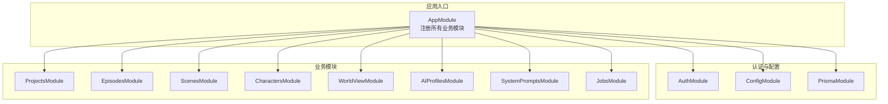
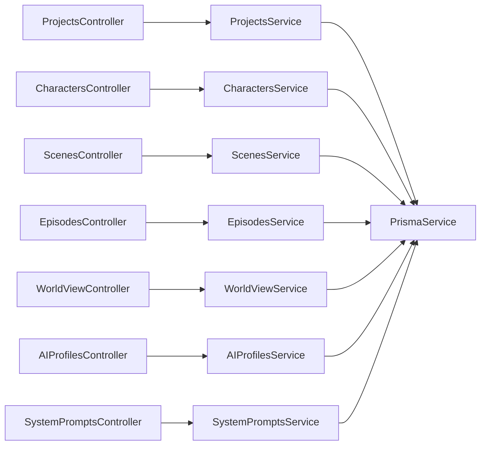
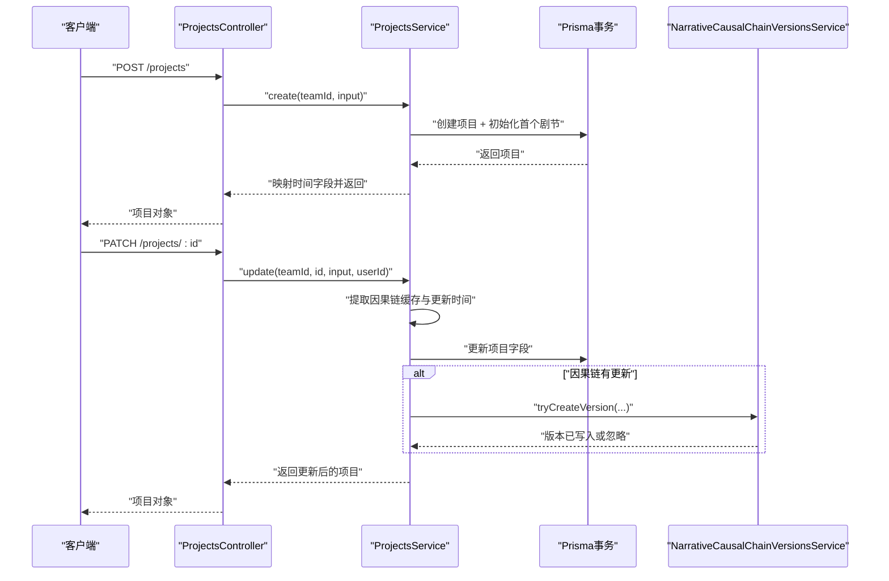
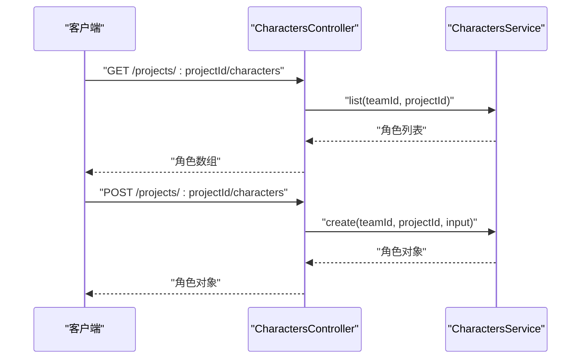
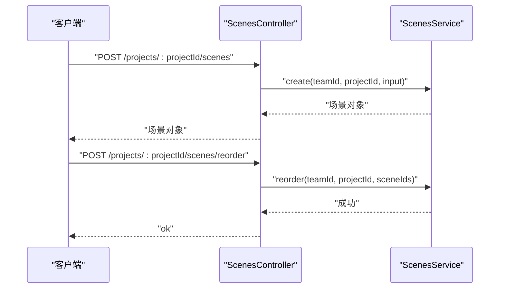
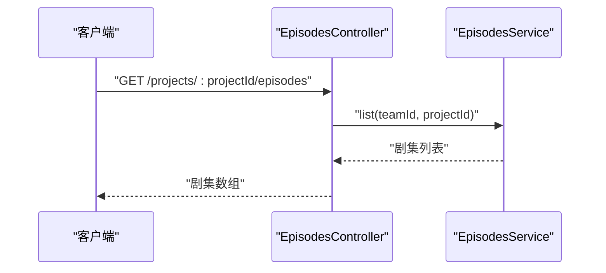
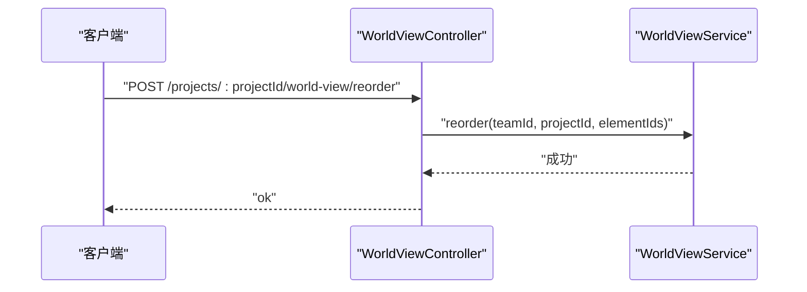
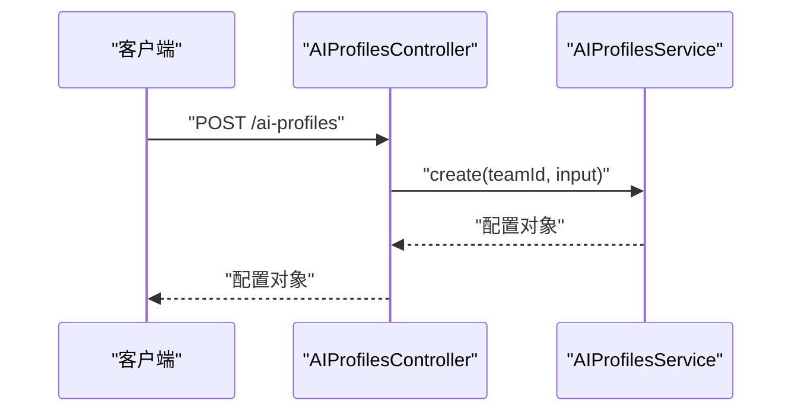
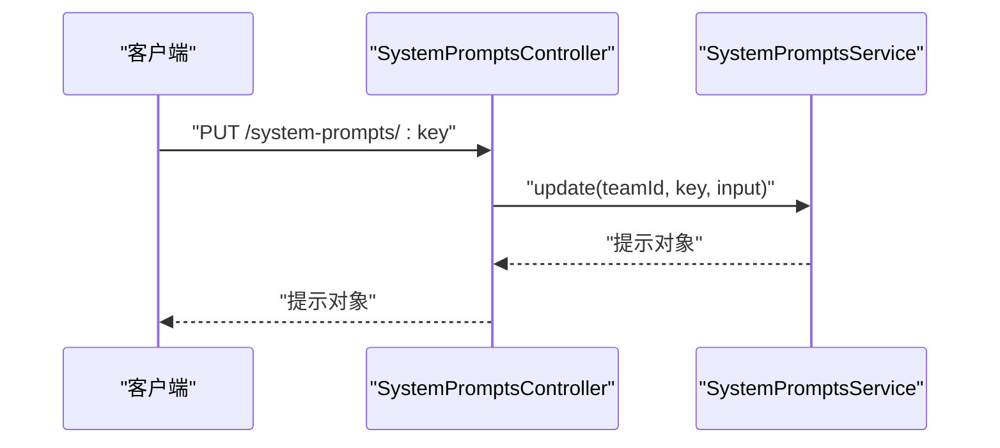
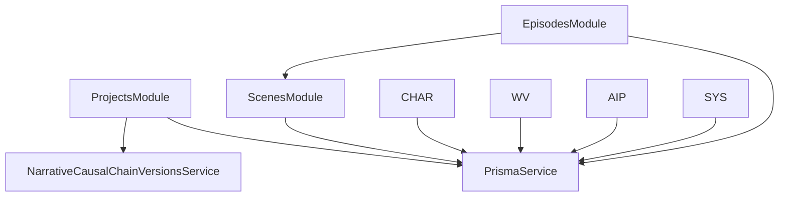

# 业务模块

<cite>
**本文引用的文件**
- [apps/api/src/app.module.ts](file://apps/api/src/app.module.ts)
- [apps/api/src/main.ts](file://apps/api/src/main.ts)
- [apps/api/src/projects/projects.module.ts](file://apps/api/src/projects/projects.module.ts)
- [apps/api/src/projects/projects.controller.ts](file://apps/api/src/projects/projects.controller.ts)
- [apps/api/src/projects/projects.service.ts](file://apps/api/src/projects/projects.service.ts)
- [apps/api/src/characters/characters.module.ts](file://apps/api/src/characters/characters.module.ts)
- [apps/api/src/characters/characters.controller.ts](file://apps/api/src/characters/characters.controller.ts)
- [apps/api/src/scenes/scenes.module.ts](file://apps/api/src/scenes/scenes.module.ts)
- [apps/api/src/scenes/scenes.controller.ts](file://apps/api/src/scenes/scenes.controller.ts)
- [apps/api/src/episodes/episodes.module.ts](file://apps/api/src/episodes/episodes.module.ts)
- [apps/api/src/episodes/episodes.controller.ts](file://apps/api/src/episodes/episodes.controller.ts)
- [apps/api/src/world-view/world-view.module.ts](file://apps/api/src/world-view/world-view.module.ts)
- [apps/api/src/world-view/world-view.controller.ts](file://apps/api/src/world-view/world-view.controller.ts)
- [apps/api/src/ai-profiles/ai-profiles.module.ts](file://apps/api/src/ai-profiles/ai-profiles.module.ts)
- [apps/api/src/ai-profiles/ai-profiles.controller.ts](file://apps/api/src/ai-profiles/ai-profiles.controller.ts)
- [apps/api/src/system-prompts/system-prompts.module.ts](file://apps/api/src/system-prompts/system-prompts.module.ts)
- [apps/api/src/system-prompts/system-prompts.controller.ts](file://apps/api/src/system-prompts/system-prompts.controller.ts)
</cite>

## 目录

1. [简介](#简介)
2. [项目结构](#项目结构)
3. [核心组件](#核心组件)
4. [架构总览](#架构总览)
5. [详细组件分析](#详细组件分析)
6. [依赖分析](#依赖分析)
7. [性能考虑](#性能考虑)
8. [故障排查指南](#故障排查指南)
9. [结论](#结论)
10. [附录](#附录)

## 简介

本文件面向AIXSSS业务模块，系统性梳理后端API层的业务模块设计与实现，重点覆盖以下主题：

- ProjectsModule：项目管理（创建、编辑、删除、状态与进度统计）
- CharactersModule：角色系统（角色创建、关系管理、出场记录）
- ScenesModule：场景管理（场景生成、细化、排序与版本化）
- EpisodesModule：剧集规划与场景组织
- WorldViewModule：世界观构建与上下文注入
- AIProfilesModule：AI配置管理
- SystemPromptsModule：系统提示管理

同时，文档给出模块间交互关系、数据流、错误处理策略、性能优化建议以及扩展与定制开发指南。

## 项目结构

后端采用NestJS框架，按领域模块划分，入口在应用模块中统一注册。主要模块如下：

- 认证与授权：AuthModule（鉴权守卫、用户装饰器等）
- 数据访问：PrismaModule（数据库服务）
- 业务模块：ProjectsModule、EpisodesModule、ScenesModule、CharactersModule、WorldViewModule、AIProfilesModule、SystemPromptsModule
- 作业与队列：JobsModule（工作流、任务队列）
- 健康检查：HealthController

图表来源

- [apps/api/src/app.module.ts](file://apps/api/src/app.module.ts#L16-L35)

章节来源

- [apps/api/src/app.module.ts](file://apps/api/src/app.module.ts#L1-L37)
- [apps/api/src/main.ts](file://apps/api/src/main.ts#L1-L34)

## 核心组件

- 项目管理（ProjectsModule）：提供项目生命周期管理、统计聚合、工作流状态与叙事因果链版本化能力。
- 角色系统（CharactersModule）：围绕项目维度的角色增删改查，支持角色与场景/剧集的关系与出场记录。
- 场景管理（ScenesModule）：场景的增删改查、排序、细化与版本控制。
- 剧集规划（EpisodesModule）：剧集的增删改查与场景集合管理。
- 世界观（WorldViewModule）：世界元素的增删改查与重排。
- AI配置（AIProfilesModule）：AI模型与参数配置的集中管理。
- 系统提示（SystemPromptsModule）：系统提示的键值式管理与更新。

章节来源

- [apps/api/src/projects/projects.module.ts](file://apps/api/src/projects/projects.module.ts#L1-L15)
- [apps/api/src/characters/characters.module.ts](file://apps/api/src/characters/characters.module.ts#L1-L12)
- [apps/api/src/scenes/scenes.module.ts](file://apps/api/src/scenes/scenes.module.ts#L1-L12)
- [apps/api/src/episodes/episodes.module.ts](file://apps/api/src/episodes/episodes.module.ts#L1-L13)
- [apps/api/src/world-view/world-view.module.ts](file://apps/api/src/world-view/world-view.module.ts#L1-L12)
- [apps/api/src/ai-profiles/ai-profiles.module.ts](file://apps/api/src/ai-profiles/ai-profiles.module.ts#L1-L13)
- [apps/api/src/system-prompts/system-prompts.module.ts](file://apps/api/src/system-prompts/system-prompts.module.ts#L1-L13)

## 架构总览

后端通过NestJS模块化组织，控制器负责HTTP路由与输入校验，服务层封装业务逻辑与数据持久化。模块间通过共享服务与Prisma进行协作；部分模块导出服务以供其他模块复用。

图表来源

- [apps/api/src/projects/projects.controller.ts](file://apps/api/src/projects/projects.controller.ts#L10-L40)
- [apps/api/src/characters/characters.controller.ts](file://apps/api/src/characters/characters.controller.ts#L10-L44)
- [apps/api/src/scenes/scenes.controller.ts](file://apps/api/src/scenes/scenes.controller.ts#L15-L64)
- [apps/api/src/episodes/episodes.controller.ts](file://apps/api/src/episodes/episodes.controller.ts#L10-L53)
- [apps/api/src/world-view/world-view.controller.ts](file://apps/api/src/world-view/world-view.controller.ts#L15-L55)
- [apps/api/src/ai-profiles/ai-profiles.controller.ts](file://apps/api/src/ai-profiles/ai-profiles.controller.ts#L10-L35)
- [apps/api/src/system-prompts/system-prompts.controller.ts](file://apps/api/src/system-prompts/system-prompts.controller.ts#L10-L24)

## 详细组件分析

### ProjectsModule：项目管理

- 职责边界
  - 项目列表、详情查询、创建、更新、软删除
  - 统计聚合：剧集数、含核心表达的剧节数、场景总数、已完成场景数
  - 工作流状态与当前场景步骤维护
  - 叙事因果链版本化：当检测到因果链缓存更新时，自动写入版本记录
- 关键流程
  - 创建项目时，事务内初始化首个空剧节
  - 更新项目时，若检测到因果链变更则尝试写入版本
  - 列表接口对每个项目并发计算统计信息
- 错误处理
  - 未找到项目抛出异常
  - 版本写入失败为best-effort，不影响主流程

图表来源

- [apps/api/src/projects/projects.controller.ts](file://apps/api/src/projects/projects.controller.ts#L19-L39)
- [apps/api/src/projects/projects.service.ts](file://apps/api/src/projects/projects.service.ts#L112-L198)

章节来源

- [apps/api/src/projects/projects.controller.ts](file://apps/api/src/projects/projects.controller.ts#L1-L43)
- [apps/api/src/projects/projects.service.ts](file://apps/api/src/projects/projects.service.ts#L1-L215)
- [apps/api/src/projects/projects.module.ts](file://apps/api/src/projects/projects.module.ts#L1-L15)

### CharactersModule：角色系统

- 职责边界
  - 在项目维度下进行角色的增删改查
  - 输入参数由共享Schema校验，确保类型安全
- 关键流程
  - 列表/创建/更新/删除均基于项目ID与团队ID进行权限与范围约束
  - 支持角色与场景/剧集的出场关系（具体关系实体与查询在服务层实现）

图表来源

- [apps/api/src/characters/characters.controller.ts](file://apps/api/src/characters/characters.controller.ts#L14-L23)

章节来源

- [apps/api/src/characters/characters.controller.ts](file://apps/api/src/characters/characters.controller.ts#L1-L47)
- [apps/api/src/characters/characters.module.ts](file://apps/api/src/characters/characters.module.ts#L1-L12)

### ScenesModule：场景管理

- 职责边界
  - 场景的增删改查、单项目场景列表、详情查询
  - 场景排序（批量重排）
- 关键流程
  - 排序请求使用独立Schema校验，保证输入合法性
  - 场景与剧节存在一对多关系，服务层负责跨层级的数据一致性

图表来源

- [apps/api/src/scenes/scenes.controller.ts](file://apps/api/src/scenes/scenes.controller.ts#L24-L63)

章节来源

- [apps/api/src/scenes/scenes.controller.ts](file://apps/api/src/scenes/scenes.controller.ts#L1-L67)
- [apps/api/src/scenes/scenes.module.ts](file://apps/api/src/scenes/scenes.module.ts#L1-L12)

### EpisodesModule：剧集规划与场景组织

- 职责边界
  - 剧集的增删改查、列表与详情
  - 与ScenesModule协作，管理剧节内的场景集合
- 关键流程
  - 控制器与服务层保持一致的鉴权与参数校验
  - 通过导入ScenesModule，复用场景相关能力

图表来源

- [apps/api/src/episodes/episodes.controller.ts](file://apps/api/src/episodes/episodes.controller.ts#L14-L17)

章节来源

- [apps/api/src/episodes/episodes.controller.ts](file://apps/api/src/episodes/episodes.controller.ts#L1-L55)
- [apps/api/src/episodes/episodes.module.ts](file://apps/api/src/episodes/episodes.module.ts#L1-L13)

### WorldViewModule：世界观构建与上下文注入

- 职责边界
  - 世界元素的增删改查与重排
  - 与项目绑定，作为上下文注入的基础数据源
- 关键流程
  - 重排使用独立Schema校验，保证元素ID列表合法
  - 服务层负责持久化与一致性

图表来源

- [apps/api/src/world-view/world-view.controller.ts](file://apps/api/src/world-view/world-view.controller.ts#L30-L34)

章节来源

- [apps/api/src/world-view/world-view.controller.ts](file://apps/api/src/world-view/world-view.controller.ts#L1-L58)
- [apps/api/src/world-view/world-view.module.ts](file://apps/api/src/world-view/world-view.module.ts#L1-L12)

### AIProfilesModule：AI配置管理

- 职责边界
  - AI配置的增删改查，支持密钥加密存储（通过ApiKeyCryptoService）
- 关键流程
  - 控制器负责鉴权与输入校验
  - 服务层执行业务操作与数据持久化

图表来源

- [apps/api/src/ai-profiles/ai-profiles.controller.ts](file://apps/api/src/ai-profiles/ai-profiles.controller.ts#L19-L23)

章节来源

- [apps/api/src/ai-profiles/ai-profiles.controller.ts](file://apps/api/src/ai-profiles/ai-profiles.controller.ts#L1-L38)
- [apps/api/src/ai-profiles/ai-profiles.module.ts](file://apps/api/src/ai-profiles/ai-profiles.module.ts#L1-L13)

### SystemPromptsModule：系统提示管理

- 职责边界
  - 系统提示的键值式列表与更新
- 关键流程
  - 使用键标识提示项，支持按键更新内容

图表来源

- [apps/api/src/system-prompts/system-prompts.controller.ts](file://apps/api/src/system-prompts/system-prompts.controller.ts#L19-L23)

章节来源

- [apps/api/src/system-prompts/system-prompts.controller.ts](file://apps/api/src/system-prompts/system-prompts.controller.ts#L1-L26)
- [apps/api/src/system-prompts/system-prompts.module.ts](file://apps/api/src/system-prompts/system-prompts.module.ts#L1-L13)

## 依赖分析

- 模块耦合
  - ProjectsModule与NarrativeCausalChainVersionsService存在直接依赖，用于因果链版本化
  - EpisodesModule导入ScenesModule，体现剧节与场景的组合关系
  - 各模块均依赖PrismaService进行数据持久化
- 外部依赖
  - NestJS模块系统、Zod输入校验、Fastify适配器
  - 共享Schema（@aixsss/shared）提供输入输出规范

图表来源

- [apps/api/src/projects/projects.service.ts](file://apps/api/src/projects/projects.service.ts#L36-L40)
- [apps/api/src/episodes/episodes.module.ts](file://apps/api/src/episodes/episodes.module.ts#L5-L8)

章节来源

- [apps/api/src/projects/projects.service.ts](file://apps/api/src/projects/projects.service.ts#L1-L215)
- [apps/api/src/episodes/episodes.module.ts](file://apps/api/src/episodes/episodes.module.ts#L1-L13)

## 性能考虑

- 并发统计：ProjectsModule在列表页对每个项目并发计算统计信息，建议在数据量较大时引入分页与缓存策略
- 事务边界：ProjectsModule创建项目时使用事务，确保原子性；在高并发场景下注意数据库锁竞争
- 排序与批量操作：ScenesModule与WorldViewModule的重排接口使用严格Schema校验，避免无效请求带来的数据库压力
- 异常过滤：全局异常过滤器统一处理错误响应，减少重复代码与提升一致性

## 故障排查指南

- 404未找到：ProjectsService在更新/删除/查询时若找不到项目会抛出异常，需确认项目ID与团队ID是否匹配
- 因果链版本写入失败：ProjectsModule在更新项目时尝试写入版本，失败为best-effort，不影响主流程；如需追踪，可在服务层增加日志
- 输入校验失败：控制器使用parseOrBadRequest进行Zod校验，确保前端传参符合Schema定义
- CORS与端口：启动脚本设置全局前缀与CORS，若无法访问，请检查环境变量与监听地址

章节来源

- [apps/api/src/projects/projects.service.ts](file://apps/api/src/projects/projects.service.ts#L104-L109)
- [apps/api/src/projects/projects.service.ts](file://apps/api/src/projects/projects.service.ts#L194-L196)
- [apps/api/src/main.ts](file://apps/api/src/main.ts#L16-L22)

## 结论

AIXSSS业务模块以NestJS模块化架构为基础，围绕项目、角色、场景、剧集、世界观、AI配置与系统提示七大领域构建完整的能力体系。模块职责清晰、依赖关系明确，具备良好的扩展性与可维护性。通过事务、并发统计与严格输入校验保障数据一致性与性能表现。

## 附录

- 扩展指南
  - 新增领域模块：参考现有模块的controller-service-module三段式结构，注册到AppModule
  - 数据库迁移：遵循现有迁移命名规范，确保版本演进有序
  - 输入校验：统一使用共享Schema与parseOrBadRequest，保持前后端一致性
- 自定义开发建议
  - 对于复杂统计与聚合，优先考虑数据库层面的聚合查询或物化视图
  - 对于高并发写入场景，评估分批提交与幂等设计
  - 对于AI相关流程，建议在服务层抽象统一的调用桥接，便于替换与测试
