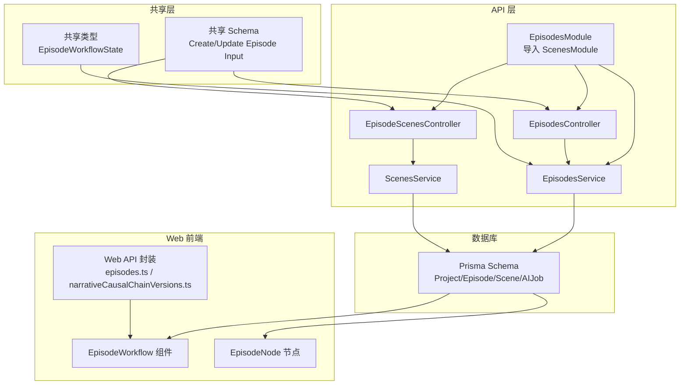
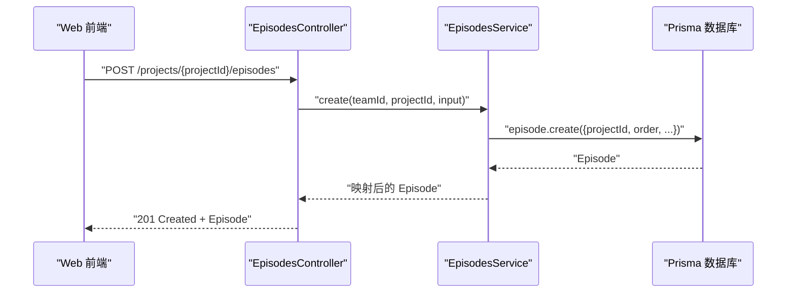
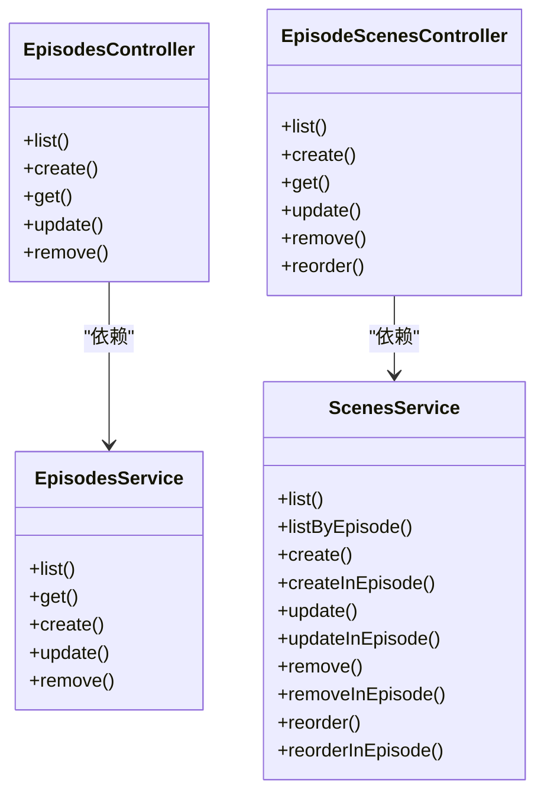

# 剧集管理模块

<cite>
**本文引用的文件**   
- [apps/api/src/episodes/episodes.module.ts](file://apps/api/src/episodes/episodes.module.ts)
- [apps/api/src/episodes/episodes.controller.ts](file://apps/api/src/episodes/episodes.controller.ts)
- [apps/api/src/episodes/episodes.service.ts](file://apps/api/src/episodes/episodes.service.ts)
- [apps/api/src/episodes/episode-scenes.controller.ts](file://apps/api/src/episodes/episode-scenes.controller.ts)
- [apps/api/src/scenes/scenes.service.ts](file://apps/api/src/scenes/scenes.service.ts)
- [apps/api/prisma/schema.prisma](file://apps/api/prisma/schema.prisma)
- [packages/shared/src/schemas/episode.ts](file://packages/shared/src/schemas/episode.ts)
- [packages/shared/src/types.ts](file://packages/shared/src/types.ts)
- [apps/api/src/projects/projects.service.ts](file://apps/api/src/projects/projects.service.ts)
- [apps/api/src/projects/narrative-causal-chain-versions.service.ts](file://apps/api/src/projects/narrative-causal-chain-versions.service.ts)
- [apps/web/src/lib/api/episodes.ts](file://apps/web/src/lib/api/episodes.ts)
- [apps/web/src/lib/api/narrativeCausalChainVersions.ts](file://apps/web/src/lib/api/narrativeCausalChainVersions.ts)
- [apps/web/src/lib/workflowV2/state.ts](file://apps/web/src/lib/workflowV2/state.ts)
- [apps/web/src/components/editor/EpisodeWorkflow.tsx](file://apps/web/src/components/editor/EpisodeWorkflow.tsx)
- [apps/web/src/components/canvas/nodes/EpisodeNode.tsx](file://apps/web/src/components/canvas/nodes/EpisodeNode.tsx)
- [docs/prd/episode-planning-workflow.md](file://docs/prd/episode-planning-workflow.md)
</cite>

## 目录

1. [简介](#简介)
2. [项目结构](#项目结构)
3. [核心组件](#核心组件)
4. [架构总览](#架构总览)
5. [详细组件分析](#详细组件分析)
6. [依赖关系分析](#依赖关系分析)
7. [性能考量](#性能考量)
8. [故障排查指南](#故障排查指南)
9. [结论](#结论)
10. [附录](#附录)

## 简介

本技术文档围绕剧集管理模块展开，系统性阐述 EpisodesModule 的架构设计与实现原理，覆盖剧集规划、场景组织与剧集生命周期管理。文档重点解析以下方面：

- EpisodesController 的 API 接口设计与鉴权机制
- EpisodesService 的核心业务逻辑：数据验证、顺序约束、完整性检查与删除保护
- EpisodeScenesController 的场景关联管理：新增、查询、更新、删除与重排
- 剧集工作流的技术实现：规划阶段、执行阶段、完成阶段的状态管理
- 导出、分享与版本控制能力：基于叙事因果链版本的快照与恢复

## 项目结构

剧集管理模块位于后端 API 工程的 episodes 子域，配合 scenes 模块与共享 Schema，形成前后端一致的数据契约与状态模型。

图表来源

- [apps/api/src/episodes/episodes.module.ts](file://apps/api/src/episodes/episodes.module.ts#L1-L13)
- [apps/api/src/episodes/episodes.controller.ts](file://apps/api/src/episodes/episodes.controller.ts#L1-L55)
- [apps/api/src/episodes/episode-scenes.controller.ts](file://apps/api/src/episodes/episode-scenes.controller.ts#L1-L83)
- [apps/api/src/episodes/episodes.service.ts](file://apps/api/src/episodes/episodes.service.ts#L1-L146)
- [apps/api/src/scenes/scenes.service.ts](file://apps/api/src/scenes/scenes.service.ts#L1-L365)
- [apps/api/prisma/schema.prisma](file://apps/api/prisma/schema.prisma#L176-L233)
- [packages/shared/src/schemas/episode.ts](file://packages/shared/src/schemas/episode.ts#L1-L80)
- [packages/shared/src/types.ts](file://packages/shared/src/types.ts#L25-L32)
- [apps/web/src/lib/api/episodes.ts](file://apps/web/src/lib/api/episodes.ts#L1-L62)
- [apps/web/src/lib/api/narrativeCausalChainVersions.ts](file://apps/web/src/lib/api/narrativeCausalChainVersions.ts#L1-L56)

章节来源

- [apps/api/src/episodes/episodes.module.ts](file://apps/api/src/episodes/episodes.module.ts#L1-L13)
- [apps/api/prisma/schema.prisma](file://apps/api/prisma/schema.prisma#L176-L233)

## 核心组件

- EpisodesModule：聚合控制器与服务，导入 ScenesModule 以复用场景能力。
- EpisodesController：提供剧集 CRUD 与鉴权；参数通过共享 Schema 校验。
- EpisodesService：负责项目归属校验、剧集顺序唯一性、更新字段选择性写入、删除前作业冲突检测。
- EpisodeScenesController：提供按剧集维度的场景 CRUD 与重排；委托 ScenesService 执行。
- ScenesService：默认剧集保障、跨剧集/按剧集查询、场景重排事务一致性、AI 作业占用保护。
- 共享 Schema 与类型：统一输入校验与前端状态枚举，确保前后端一致性。

章节来源

- [apps/api/src/episodes/episodes.controller.ts](file://apps/api/src/episodes/episodes.controller.ts#L1-L55)
- [apps/api/src/episodes/episodes.service.ts](file://apps/api/src/episodes/episodes.service.ts#L1-L146)
- [apps/api/src/episodes/episode-scenes.controller.ts](file://apps/api/src/episodes/episode-scenes.controller.ts#L1-L83)
- [apps/api/src/scenes/scenes.service.ts](file://apps/api/src/scenes/scenes.service.ts#L1-L365)
- [packages/shared/src/schemas/episode.ts](file://packages/shared/src/schemas/episode.ts#L1-L80)
- [packages/shared/src/types.ts](file://packages/shared/src/types.ts#L25-L32)

## 架构总览

后端采用 NestJS 控制器-服务分层，结合 Prisma 数据访问层与共享 Schema 校验，前端通过封装的 API 方法与工作流组件驱动状态流转。

图表来源

- [apps/api/src/episodes/episodes.controller.ts](file://apps/api/src/episodes/episodes.controller.ts#L19-L23)
- [apps/api/src/episodes/episodes.service.ts](file://apps/api/src/episodes/episodes.service.ts#L57-L80)
- [apps/api/prisma/schema.prisma](file://apps/api/prisma/schema.prisma#L176-L195)

## 详细组件分析

### EpisodesController：剧集 API 设计

- 路由层级：/projects/:projectId/episodes
- 鉴权：使用 JWT 守卫，依赖当前用户上下文
- 校验：请求体通过共享 Schema 校验，不符合则抛出错误
- 能力：
  - 列表：按顺序升序返回剧集
  - 创建：支持指定 id 与 order，写入标题、摘要、大纲、核心表达、上下文缓存与工作流状态
  - 查询：按 id 获取剧集
  - 更新：按需更新字段，支持工作流状态切换
  - 删除：删除前检查剧集内场景是否处于 AI 作业中

章节来源

- [apps/api/src/episodes/episodes.controller.ts](file://apps/api/src/episodes/episodes.controller.ts#L1-L55)
- [packages/shared/src/schemas/episode.ts](file://packages/shared/src/schemas/episode.ts#L6-L20)

### EpisodesService：剧集业务逻辑

- 项目归属校验：确保剧集属于当前团队且未被软删除
- 顺序唯一性：利用数据库唯一索引约束保证同一项目内 order 不重复
- 更新策略：仅对传入字段进行更新，避免全量覆盖
- 删除保护：若剧集下存在正在排队或运行中的 AI 作业，拒绝删除并提示取消作业
- 时间格式化：统一返回 ISO 字符串时间戳

章节来源

- [apps/api/src/episodes/episodes.service.ts](file://apps/api/src/episodes/episodes.service.ts#L31-L143)
- [apps/api/prisma/schema.prisma](file://apps/api/prisma/schema.prisma#L193-L195)

### EpisodeScenesController：场景关联管理

- 路由层级：/projects/:projectId/episodes/:episodeId/scenes
- 能力：
  - 列表：按剧集返回场景
  - 新增：在指定剧集内创建场景
  - 查询：按剧集内的场景 id 获取
  - 更新：按剧集内的场景 id 更新
  - 删除：按剧集内的场景 id 删除
  - 重排：按给定场景 id 序列在剧集内重新排序

章节来源

- [apps/api/src/episodes/episode-scenes.controller.ts](file://apps/api/src/episodes/episode-scenes.controller.ts#L1-L83)

### ScenesService：场景服务与重排事务

- 默认剧集保障：若项目不存在默认剧集（order=1），自动创建
- 查询能力：支持按项目与按剧集查询场景，并按顺序升序返回
- 更新策略：仅对传入字段进行更新
- 删除保护：若场景处于排队或运行中的 AI 作业，拒绝删除
- 重排事务：在同一事务中批量更新场景 order，确保一致性；同时要求所有场景 id 属于同一剧集

章节来源

- [apps/api/src/scenes/scenes.service.ts](file://apps/api/src/scenes/scenes.service.ts#L44-L363)

### 数据模型与状态

- Episode 实体：包含顺序、标题、摘要、大纲、核心表达、上下文缓存与工作流状态
- Scene 实体：包含场景描述、动作描述、演员、提示词、关键帧/运动/对话等中间产物、状态与笔记
- EpisodeWorkflowState：IDLE、CORE_EXPRESSION_READY、SCENE_LIST_EDITING、SCENE_PROCESSING、COMPLETE
- 项目级工作流状态：包含 EPISODE_PLANNING、EPISODE_PLAN_EDITING、EPISODE_CREATING 等，支撑剧集规划到创作的全流程

章节来源

- [apps/api/prisma/schema.prisma](file://apps/api/prisma/schema.prisma#L176-L233)
- [packages/shared/src/types.ts](file://packages/shared/src/types.ts#L25-L47)
- [docs/prd/episode-planning-workflow.md](file://docs/prd/episode-planning-workflow.md#L344-L353)

### 剧集工作流：状态管理与前端集成

- 前端工作流组件：展示步骤导航、场景状态标签与批处理操作，联动后端 API
- EpisodeNode：在画布中根据项目与选中剧集渲染节点，支持加载剧集列表与工作流运行状态
- 工作流状态补丁：通过构建 Episode 艺术品状态补丁，记录锁定/更新时间，支撑前端进度与状态展示

章节来源

- [apps/web/src/components/editor/EpisodeWorkflow.tsx](file://apps/web/src/components/editor/EpisodeWorkflow.tsx#L246-L257)
- [apps/web/src/components/canvas/nodes/EpisodeNode.tsx](file://apps/web/src/components/canvas/nodes/EpisodeNode.tsx#L41-L68)
- [apps/web/src/lib/workflowV2/state.ts](file://apps/web/src/lib/workflowV2/state.ts#L108-L138)

### 版本控制：叙事因果链版本

- 项目服务在更新时检测因果链变更，自动创建版本快照（手动来源）
- 版本服务提供列表、详情、创建快照、恢复版本能力，并限制每个项目的版本数量
- Web 端提供版本浏览、快照与恢复交互入口

章节来源

- [apps/api/src/projects/projects.service.ts](file://apps/api/src/projects/projects.service.ts#L171-L198)
- [apps/api/src/projects/narrative-causal-chain-versions.service.ts](file://apps/api/src/projects/narrative-causal-chain-versions.service.ts#L65-L116)
- [apps/web/src/lib/api/narrativeCausalChainVersions.ts](file://apps/web/src/lib/api/narrativeCausalChainVersions.ts#L22-L56)

## 依赖关系分析

- EpisodesModule 导入 ScenesModule，使剧集控制器可直接复用场景服务
- 控制器依赖共享 Schema 进行输入校验，确保前后端一致
- 服务层依赖 Prisma 进行数据持久化与约束校验
- 前端通过封装的 API 方法与工作流组件驱动状态流转

图表来源

- [apps/api/src/episodes/episodes.controller.ts](file://apps/api/src/episodes/episodes.controller.ts#L1-L55)
- [apps/api/src/episodes/episodes.service.ts](file://apps/api/src/episodes/episodes.service.ts#L1-L146)
- [apps/api/src/episodes/episode-scenes.controller.ts](file://apps/api/src/episodes/episode-scenes.controller.ts#L1-L83)
- [apps/api/src/scenes/scenes.service.ts](file://apps/api/src/scenes/scenes.service.ts#L1-L365)

章节来源

- [apps/api/src/episodes/episodes.module.ts](file://apps/api/src/episodes/episodes.module.ts#L1-L13)

## 性能考量

- 顺序查询与索引：剧集与场景均按 order 升序查询，数据库层面建立唯一索引与复合索引，降低排序与去重成本
- 事务重排：场景重排在单个事务中批量更新，减少并发冲突与不一致风险
- 选择性更新：服务层仅对传入字段写入，避免不必要的写放大
- 前端懒加载：画布与工作流组件在需要时才加载剧集与场景数据，降低初始负载

## 故障排查指南

- 删除失败（剧集含进行中作业）：当剧集内场景存在排队或运行中的 AI 作业时，删除会被拒绝。请先取消相关作业再删除。
- 顺序冲突（创建/更新）：同一项目内剧集 order 必须唯一，违反唯一约束会触发错误。请调整顺序或使用不同项目。
- 场景删除失败（场景含进行中作业）：场景处于排队或运行中的 AI 作业时，删除会被拒绝。请先取消相关作业再删除。
- 输入校验失败：请求体不符合共享 Schema 约束时，控制器会抛出错误。请核对字段类型、长度与必填项。

章节来源

- [apps/api/src/episodes/episodes.service.ts](file://apps/api/src/episodes/episodes.service.ts#L74-L79)
- [apps/api/src/episodes/episodes.service.ts](file://apps/api/src/episodes/episodes.service.ts#L134-L139)
- [apps/api/src/scenes/scenes.service.ts](file://apps/api/src/scenes/scenes.service.ts#L272-L276)
- [apps/api/src/scenes/scenes.service.ts](file://apps/api/src/scenes/scenes.service.ts#L299-L303)

## 结论

剧集管理模块通过清晰的控制器-服务分层、严格的输入校验与数据库约束、以及完善的场景重排事务，实现了可靠的剧集规划与创作管理。结合前端工作流组件与版本控制能力，系统能够支撑从规划到完成的完整生命周期管理，并为导出与分享奠定基础。

## 附录

### API 定义概览（节选）

- 剧集 CRUD
  - GET /projects/{projectId}/episodes
  - POST /projects/{projectId}/episodes
  - GET /projects/{projectId}/episodes/{episodeId}
  - PATCH /projects/{projectId}/episodes/{episodeId}
  - DELETE /projects/{projectId}/episodes/{episodeId}
- 场景 CRUD（按剧集）
  - GET /projects/{projectId}/episodes/{episodeId}/scenes
  - POST /projects/{projectId}/episodes/{episodeId}/scenes
  - GET /projects/{projectId}/episodes/{episodeId}/scenes/{sceneId}
  - PATCH /projects/{projectId}/episodes/{episodeId}/scenes/{sceneId}
  - DELETE /projects/{projectId}/episodes/{episodeId}/scenes/{sceneId}
  - POST /projects/{projectId}/episodes/{episodeId}/scenes/reorder

章节来源

- [apps/web/src/lib/api/episodes.ts](file://apps/web/src/lib/api/episodes.ts#L4-L62)
- [apps/api/src/episodes/episode-scenes.controller.ts](file://apps/api/src/episodes/episode-scenes.controller.ts#L19-L81)
