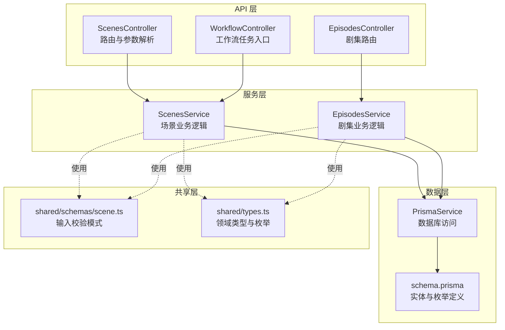
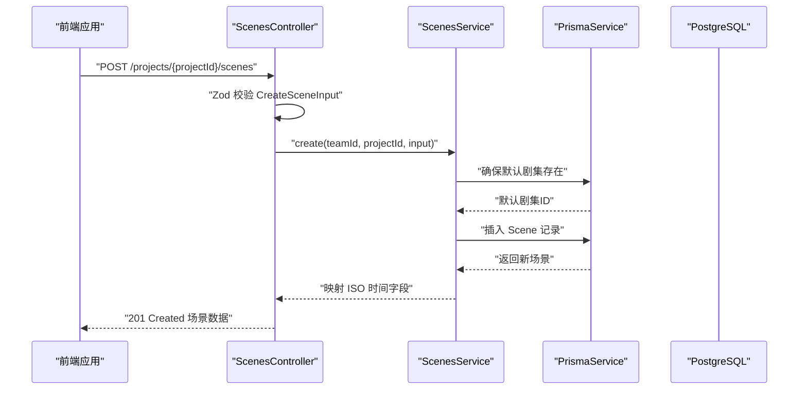
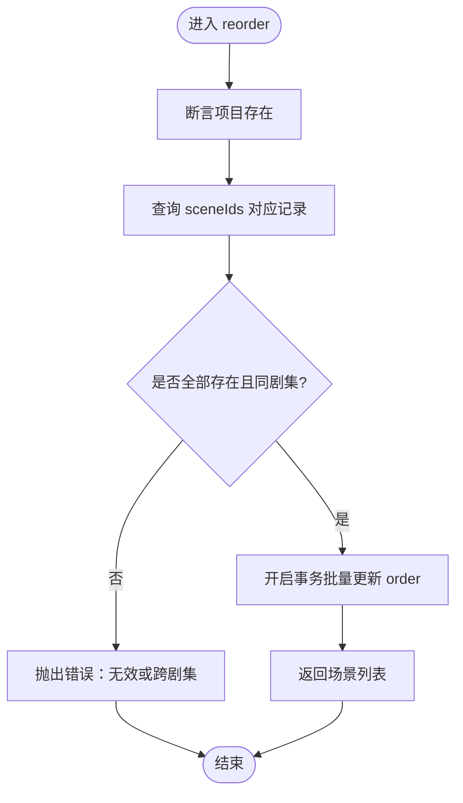
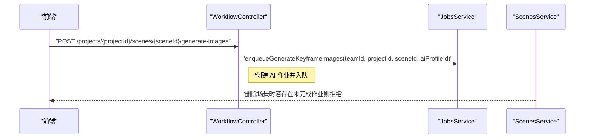
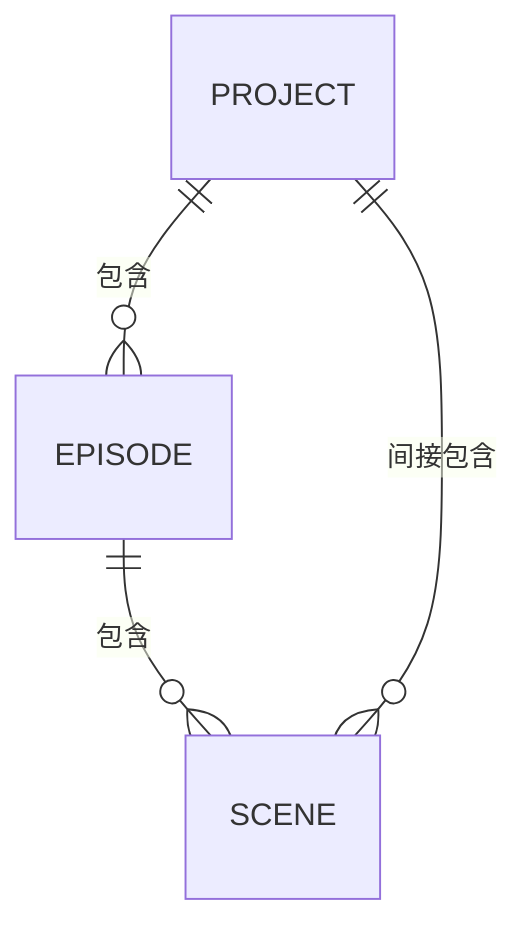
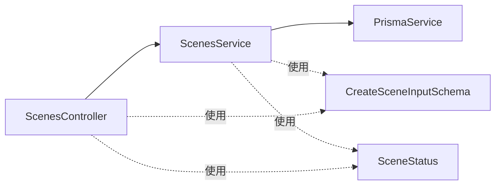

# 场景管理模块

<cite>
**本文引用的文件**
- [apps/api/src/scenes/scenes.controller.ts](file://apps/api/src/scenes/scenes.controller.ts)
- [apps/api/src/scenes/scenes.service.ts](file://apps/api/src/scenes/scenes.service.ts)
- [apps/api/src/scenes/scenes.module.ts](file://apps/api/src/scenes/scenes.module.ts)
- [packages/shared/src/schemas/scene.ts](file://packages/shared/src/schemas/scene.ts)
- [apps/api/prisma/schema.prisma](file://apps/api/prisma/schema.prisma)
- [apps/api/src/episodes/episodes.controller.ts](file://apps/api/src/episodes/episodes.controller.ts)
- [apps/api/src/episodes/episodes.service.ts](file://apps/api/src/episodes/episodes.service.ts)
- [apps/api/src/jobs/workflow.controller.ts](file://apps/api/src/jobs/workflow.controller.ts)
- [apps/web/src/lib/api/scenes.ts](file://apps/web/src/lib/api/scenes.ts)
- [apps/web/src/lib/api/scenePatchQueue.ts](file://apps/web/src/lib/api/scenePatchQueue.ts)
- [apps/web/src/stores/episodeScenesStore.ts](file://apps/web/src/stores/episodeScenesStore.ts)
- [apps/web/src/stores/searchStore.ts](file://apps/web/src/stores/searchStore.ts)
- [packages/shared/src/types.ts](file://packages/shared/src/types.ts)
</cite>

## 目录

1. [简介](#简介)
2. [项目结构](#项目结构)
3. [核心组件](#核心组件)
4. [架构总览](#架构总览)
5. [详细组件分析](#详细组件分析)
6. [依赖关系分析](#依赖关系分析)
7. [性能考虑](#性能考虑)
8. [故障排查指南](#故障排查指南)
9. [结论](#结论)
10. [附录](#附录)

## 简介

本技术文档围绕场景管理模块进行系统化说明，重点覆盖以下方面：

- 设计架构与实现细节：场景生成、细化、版本控制与状态管理
- API 接口设计：场景的创建、更新、删除与批量重排
- 核心业务逻辑：数据验证、状态转换与工作流集成
- 场景与项目/剧集的关系及在创作流程中的关键作用
- 场景内容管理：分镜脚本、视觉元素与多媒体资源处理
- 搜索、过滤与排序的实现思路

## 项目结构

场景管理模块由三层组成：

- 控制器层：负责路由与输入参数解析
- 服务层：封装业务逻辑与数据库交互
- 数据模型层：通过 Prisma 定义实体关系与枚举

**图表来源**

- [apps/api/src/scenes/scenes.controller.ts](file://apps/api/src/scenes/scenes.controller.ts#L1-L67)
- [apps/api/src/episodes/episodes.controller.ts](file://apps/api/src/episodes/episodes.controller.ts#L1-L55)
- [apps/api/src/jobs/workflow.controller.ts](file://apps/api/src/jobs/workflow.controller.ts#L1-L266)
- [apps/api/src/scenes/scenes.service.ts](file://apps/api/src/scenes/scenes.service.ts#L1-L365)
- [apps/api/src/episodes/episodes.service.ts](file://apps/api/src/episodes/episodes.service.ts#L1-L146)
- [apps/api/prisma/schema.prisma](file://apps/api/prisma/schema.prisma#L197-L233)
- [packages/shared/src/schemas/scene.ts](file://packages/shared/src/schemas/scene.ts#L1-L56)
- [packages/shared/src/types.ts](file://packages/shared/src/types.ts#L37-L47)

**章节来源**

- [apps/api/src/scenes/scenes.controller.ts](file://apps/api/src/scenes/scenes.controller.ts#L1-L67)
- [apps/api/src/scenes/scenes.service.ts](file://apps/api/src/scenes/scenes.service.ts#L1-L365)
- [apps/api/src/scenes/scenes.module.ts](file://apps/api/src/scenes/scenes.module.ts#L1-L12)
- [apps/api/prisma/schema.prisma](file://apps/api/prisma/schema.prisma#L197-L233)
- [packages/shared/src/schemas/scene.ts](file://packages/shared/src/schemas/scene.ts#L1-L56)
- [packages/shared/src/types.ts](file://packages/shared/src/types.ts#L37-L47)

## 核心组件

- ScenesController：提供场景列表、创建、查询、更新、删除、重排等 REST 接口，并基于 JWT 进行鉴权
- ScenesService：实现场景数据校验、默认剧集保障、跨表关联检查、AI 工作流冲突检测、批量重排事务性更新
- shared/schemas/scene.ts：定义 CreateSceneInputSchema/UpdateSceneInputSchema，统一前后端输入校验
- schema.prisma：定义 Scene 实体、Episode 与 Project 的关系，以及 SceneStatus 枚举
- 前端对接：apps/web/src/lib/api/scenes.ts 提供场景 CRUD 与重排调用；scenePatchQueue.ts 合并与节流更新；episodeScenesStore.ts 管理剧集内场景状态与本地/远程同步

**章节来源**

- [apps/api/src/scenes/scenes.controller.ts](file://apps/api/src/scenes/scenes.controller.ts#L14-L64)
- [apps/api/src/scenes/scenes.service.ts](file://apps/api/src/scenes/scenes.service.ts#L23-L365)
- [packages/shared/src/schemas/scene.ts](file://packages/shared/src/schemas/scene.ts#L26-L56)
- [apps/api/prisma/schema.prisma](file://apps/api/prisma/schema.prisma#L197-L233)
- [apps/web/src/lib/api/scenes.ts](file://apps/web/src/lib/api/scenes.ts#L1-L75)
- [apps/web/src/lib/api/scenePatchQueue.ts](file://apps/web/src/lib/api/scenePatchQueue.ts#L1-L89)
- [apps/web/src/stores/episodeScenesStore.ts](file://apps/web/src/stores/episodeScenesStore.ts#L1-L157)

## 架构总览

场景管理模块采用典型的三层架构：

- 表现层：Web 前端通过 API 客户端与控制器交互
- 应用层：控制器负责鉴权与参数解析，服务层执行业务规则
- 数据层：Prisma 访问 PostgreSQL，维护实体关系与索引

**图表来源**

- [apps/api/src/scenes/scenes.controller.ts](file://apps/api/src/scenes/scenes.controller.ts#L24-L28)
- [apps/api/src/scenes/scenes.service.ts](file://apps/api/src/scenes/scenes.service.ts#L105-L131)
- [apps/api/prisma/schema.prisma](file://apps/api/prisma/schema.prisma#L197-L233)

**章节来源**

- [apps/api/src/scenes/scenes.controller.ts](file://apps/api/src/scenes/scenes.controller.ts#L1-L67)
- [apps/api/src/scenes/scenes.service.ts](file://apps/api/src/scenes/scenes.service.ts#L1-L365)
- [apps/api/prisma/schema.prisma](file://apps/api/prisma/schema.prisma#L197-L233)

## 详细组件分析

### ScenesController API 设计

- 路由前缀：/projects/:projectId/scenes
- 鉴权：所有接口使用 JwtAuthGuard
- 主要接口
  - GET /projects/:projectId/scenes → 列出项目下默认剧集的场景（按 order 升序）
  - POST /projects/:projectId/scenes → 创建场景（支持传入自定义 id 与 order）
  - GET /projects/:projectId/scenes/:sceneId → 获取单个场景
  - PATCH /projects/:projectId/scenes/:sceneId → 更新场景（部分字段可更新）
  - DELETE /projects/:projectId/scenes/:sceneId → 删除场景（若存在未完成的 AI 作业则拒绝）
  - POST /projects/:projectId/scenes/reorder → 批量重排场景（同一剧集内顺序调整）

输入校验

- 使用 Zod 模式 CreateSceneInputSchema/UpdateSceneInputSchema
- 支持多种内容字段：summary、sceneDescription、actionDescription、shotPrompt、motionPrompt、castCharacterIds、generatedImages、generatedVideos、storyboard 相关 JSON、dialogues、contextSummary、status、notes 等

前端对接

- apps/web/src/lib/api/scenes.ts 提供对应请求方法
- 场景更新采用队列合并与节流（scenePatchQueue.ts），避免频繁网络请求

**章节来源**

- [apps/api/src/scenes/scenes.controller.ts](file://apps/api/src/scenes/scenes.controller.ts#L14-L64)
- [packages/shared/src/schemas/scene.ts](file://packages/shared/src/schemas/scene.ts#L26-L56)
- [apps/web/src/lib/api/scenes.ts](file://apps/web/src/lib/api/scenes.ts#L1-L75)
- [apps/web/src/lib/api/scenePatchQueue.ts](file://apps/web/src/lib/api/scenePatchQueue.ts#L53-L89)

### ScenesService 核心业务逻辑

- 项目与剧集断言
  - assertProject：校验项目归属与存在性
  - assertEpisode：校验剧集属于项目
  - ensureDefaultEpisode：若不存在默认剧集（order=1），自动创建并返回其 id
- 场景 CRUD
  - list/listByEpisode：按项目或剧集列出场景，按 order 升序
  - get/getInEpisode：按 id 查询场景
  - create/createInEpisode：创建场景并写入多类 JSON 字段与文本字段
  - update/updateInEpisode：按需更新字段，支持 JSON 与字符串字段
- 删除保护
  - remove/removeInEpisode：若场景正被 AI 作业处理（queued/running），则拒绝删除并提示取消作业
- 重排
  - reorder/reorderInEpisode：校验 sceneIds 属于同一剧集，使用事务一次性更新 order
- 时间字段处理
  - mapScene：将 Date 转换为 ISO 字符串返回给 API

**图表来源**

- [apps/api/src/scenes/scenes.service.ts](file://apps/api/src/scenes/scenes.service.ts#L309-L338)

**章节来源**

- [apps/api/src/scenes/scenes.service.ts](file://apps/api/src/scenes/scenes.service.ts#L27-L365)

### 场景状态管理与工作流集成

- 状态枚举：SceneStatus 包含 pending、scene_generating、scene_confirmed、keyframe_generating、keyframe_confirmed、motion_generating、completed、needs_update 等
- 工作流控制器提供大量场景细化任务入口，例如：
  - 生成场景锚点、关键帧提示、分镜圣经、分镜计划、翻译、生成图片/视频、动作提示、对话等
- 删除保护：当场景存在未完成的 AI 作业时禁止删除，防止破坏工作流一致性

**图表来源**

- [apps/api/src/jobs/workflow.controller.ts](file://apps/api/src/jobs/workflow.controller.ts#L199-L219)
- [apps/api/src/scenes/scenes.service.ts](file://apps/api/src/scenes/scenes.service.ts#L255-L280)

**章节来源**

- [apps/api/prisma/schema.prisma](file://apps/api/prisma/schema.prisma#L42-L51)
- [apps/api/src/jobs/workflow.controller.ts](file://apps/api/src/jobs/workflow.controller.ts#L1-L266)
- [apps/api/src/scenes/scenes.service.ts](file://apps/api/src/scenes/scenes.service.ts#L255-L280)
- [packages/shared/src/types.ts](file://packages/shared/src/types.ts#L37-L47)

### 场景与项目/剧集的关系

- 一个项目包含多个剧集，一个剧集包含多个场景
- 默认剧集（order=1）在首次创建场景时自动确保存在
- 场景重排限定在同一剧集内，保证创作节奏与结构稳定

**图表来源**

- [apps/api/prisma/schema.prisma](file://apps/api/prisma/schema.prisma#L116-L141)
- [apps/api/prisma/schema.prisma](file://apps/api/prisma/schema.prisma#L176-L195)
- [apps/api/prisma/schema.prisma](file://apps/api/prisma/schema.prisma#L197-L233)

**章节来源**

- [apps/api/src/scenes/scenes.service.ts](file://apps/api/src/scenes/scenes.service.ts#L44-L67)
- [apps/api/prisma/schema.prisma](file://apps/api/prisma/schema.prisma#L116-L141)
- [apps/api/prisma/schema.prisma](file://apps/api/prisma/schema.prisma#L176-L195)
- [apps/api/prisma/schema.prisma](file://apps/api/prisma/schema.prisma#L197-L233)

### 场景内容管理：分镜脚本、视觉元素与多媒体资源

- 内容字段
  - 文本：summary、sceneDescription、actionDescription、shotPrompt、motionPrompt、notes
  - JSON：storyboardSceneBibleJson、storyboardPlanJson、storyboardGroupsJson、dialogues、contextSummary
  - 数组：generatedImages（含 keyframe、url、prompt、provider、model、metadata 等）、generatedVideos
  - 关联：castCharacterIds（角色 id 列表）
- 服务层对上述字段进行条件写入与更新，确保只更新传入的字段
- 前端通过队列合并与节流更新，减少网络压力并提升交互体验

**章节来源**

- [packages/shared/src/schemas/scene.ts](file://packages/shared/src/schemas/scene.ts#L26-L56)
- [apps/api/src/scenes/scenes.service.ts](file://apps/api/src/scenes/scenes.service.ts#L105-L159)
- [apps/web/src/lib/api/scenePatchQueue.ts](file://apps/web/src/lib/api/scenePatchQueue.ts#L32-L40)

### 搜索、过滤与排序

- 前端搜索范围：项目标题/摘要/主角/风格 与 场景摘要/描述/动作/镜头提示
- 过滤条件：按场景状态过滤（如 completed）
- 排序策略：场景按 order 升序排列；剧集按 order 升序排列
- 该能力由前端搜索存储实现，后端未提供专门的搜索 API

**章节来源**

- [apps/web/src/stores/searchStore.ts](file://apps/web/src/stores/searchStore.ts#L58-L106)
- [apps/api/src/scenes/scenes.service.ts](file://apps/api/src/scenes/scenes.service.ts#L69-L85)
- [apps/api/src/episodes/episodes.service.ts](file://apps/api/src/episodes/episodes.service.ts#L39-L46)

## 依赖关系分析

- 控制器依赖服务：ScenesController 注入 ScenesService
- 服务依赖 Prisma：ScenesService 依赖 PrismaService 进行数据库操作
- 输入校验依赖共享模式：shared/schemas/scene.ts 提供 Zod 模式
- 类型依赖共享类型：shared/types.ts 提供 SceneStatus 等领域类型
- 前端依赖 API 客户端：apps/web/src/lib/api/scenes.ts 与 scenePatchQueue.ts

**图表来源**

- [apps/api/src/scenes/scenes.controller.ts](file://apps/api/src/scenes/scenes.controller.ts#L1-L12)
- [apps/api/src/scenes/scenes.service.ts](file://apps/api/src/scenes/scenes.service.ts#L1-L10)
- [packages/shared/src/schemas/scene.ts](file://packages/shared/src/schemas/scene.ts#L26-L56)
- [packages/shared/src/types.ts](file://packages/shared/src/types.ts#L37-L47)

**章节来源**

- [apps/api/src/scenes/scenes.controller.ts](file://apps/api/src/scenes/scenes.controller.ts#L1-L12)
- [apps/api/src/scenes/scenes.service.ts](file://apps/api/src/scenes/scenes.service.ts#L1-L10)
- [packages/shared/src/schemas/scene.ts](file://packages/shared/src/schemas/scene.ts#L26-L56)
- [packages/shared/src/types.ts](file://packages/shared/src/types.ts#L37-L47)

## 性能考虑

- 事务批量更新：重排场景使用 $transaction 并行更新，降低锁竞争与往返次数
- 条件字段更新：服务层仅对传入字段进行更新，减少写放大
- 前端节流合并：scenePatchQueue.ts 合并多次更新并在 800ms 后批量提交，避免频繁网络请求
- 索引优化：场景与剧集均建立复合索引以支持按 order 查询与排序

**章节来源**

- [apps/api/src/scenes/scenes.service.ts](file://apps/api/src/scenes/scenes.service.ts#L328-L335)
- [apps/web/src/lib/api/scenePatchQueue.ts](file://apps/web/src/lib/api/scenePatchQueue.ts#L45-L51)
- [apps/api/prisma/schema.prisma](file://apps/api/prisma/schema.prisma#L230-L233)

## 故障排查指南

- 删除场景时报错“正在被 AI 处理”
  - 原因：存在未完成的 AI 作业（queued/running）
  - 处理：先取消对应作业，再执行删除
- 重排报错“无效 sceneIds 或跨剧集”
  - 原因：传入的场景不在当前项目或跨剧集
  - 处理：确保 sceneIds 均属于同一剧集且属于当前项目
- 创建/更新失败（字段非法）
  - 原因：Zod 校验不通过（长度、格式、类型）
  - 处理：根据 shared/schemas/scene.ts 的约束修正输入

**章节来源**

- [apps/api/src/scenes/scenes.service.ts](file://apps/api/src/scenes/scenes.service.ts#L255-L280)
- [apps/api/src/scenes/scenes.service.ts](file://apps/api/src/scenes/scenes.service.ts#L309-L338)
- [packages/shared/src/schemas/scene.ts](file://packages/shared/src/schemas/scene.ts#L26-L56)

## 结论

场景管理模块通过清晰的三层架构与严格的输入校验，实现了从创作到细化的完整闭环。服务层在保证数据一致性的同时，提供了灵活的内容字段与状态管理；前端通过队列与节流提升了交互性能。与工作流系统的深度集成使得场景细化过程可追踪、可回滚、可并发推进。

## 附录

- 场景状态枚举参考：pending、scene_generating、scene_confirmed、keyframe_generating、keyframe_confirmed、motion_generating、completed、needs_update
- 剧集默认顺序：order=1 的默认剧集会在首次创建场景时自动创建
- 前端本地状态与远程同步：episodeScenesStore.ts 在 API 模式下通过队列异步同步更新

**章节来源**

- [apps/api/prisma/schema.prisma](file://apps/api/prisma/schema.prisma#L42-L51)
- [apps/api/src/scenes/scenes.service.ts](file://apps/api/src/scenes/scenes.service.ts#L44-L67)
- [apps/web/src/stores/episodeScenesStore.ts](file://apps/web/src/stores/episodeScenesStore.ts#L96-L121)
