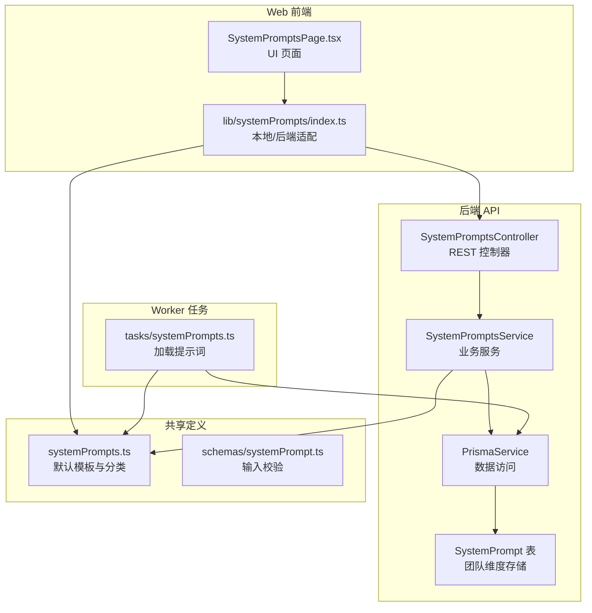
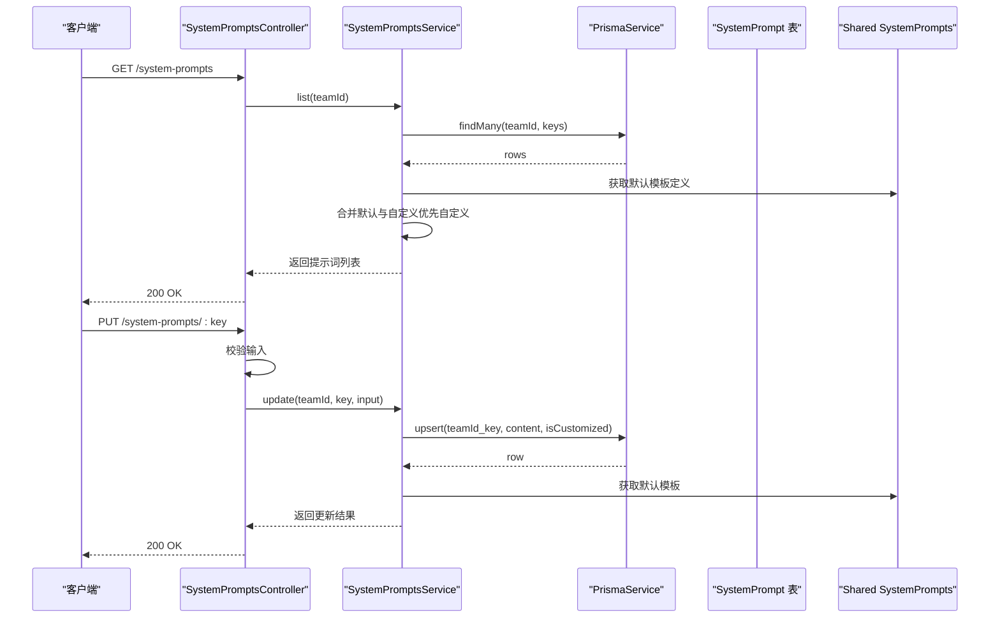
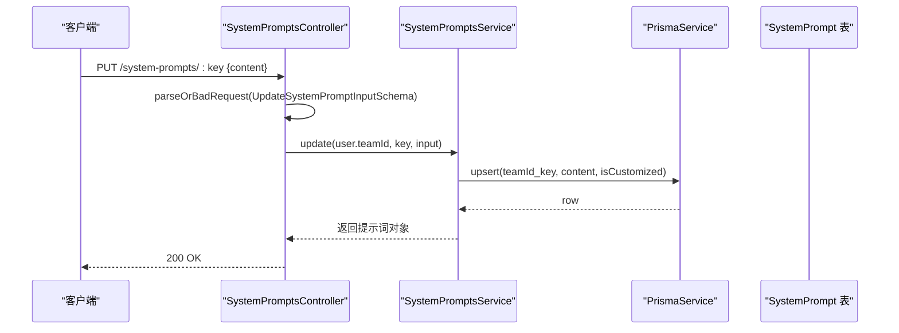
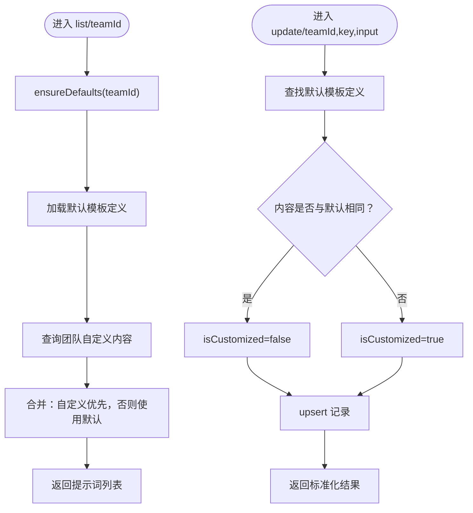
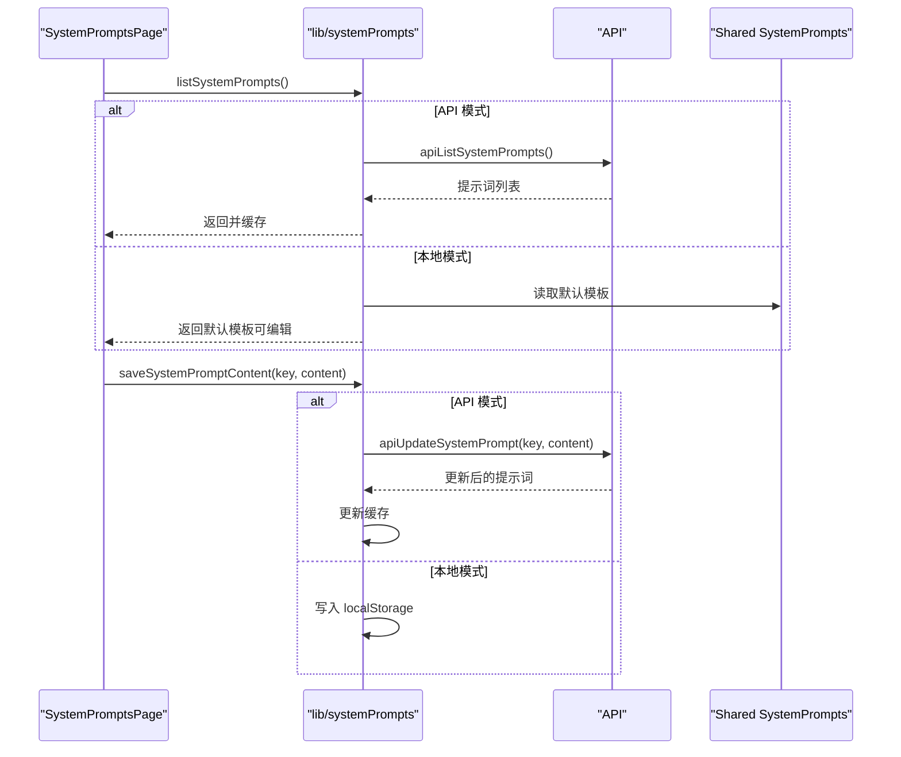
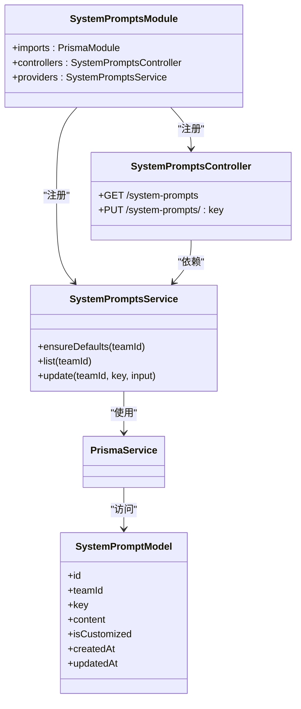

# 系统提示管理模块

<cite>
**本文档引用的文件**
- [apps/api/src/system-prompts/system-prompts.module.ts](file://apps/api/src/system-prompts/system-prompts.module.ts)
- [apps/api/src/system-prompts/system-prompts.controller.ts](file://apps/api/src/system-prompts/system-prompts.controller.ts)
- [apps/api/src/system-prompts/system-prompts.service.ts](file://apps/api/src/system-prompts/system-prompts.service.ts)
- [apps/api/prisma/migrations/20260109190000_add_system_prompts/migration.sql](file://apps/api/prisma/migrations/20260109190000_add_system_prompts/migration.sql)
- [apps/api/prisma/schema.prisma](file://apps/api/prisma/schema.prisma)
- [packages/shared/src/systemPrompts.ts](file://packages/shared/src/systemPrompts.ts)
- [packages/shared/src/schemas/systemPrompt.ts](file://packages/shared/src/schemas/systemPrompt.ts)
- [apps/web/src/lib/systemPrompts/index.ts](file://apps/web/src/lib/systemPrompts/index.ts)
- [apps/web/src/lib/systemPrompts/index.api.test.ts](file://apps/web/src/lib/systemPrompts/index.api.test.ts)
- [apps/web/src/components/SystemPromptsPage.tsx](file://apps/web/src/components/SystemPromptsPage.tsx)
- [apps/worker/src/tasks/systemPrompts.ts](file://apps/worker/src/tasks/systemPrompts.ts)
</cite>

## 目录

1. [简介](#简介)
2. [项目结构](#项目结构)
3. [核心组件](#核心组件)
4. [架构总览](#架构总览)
5. [详细组件分析](#详细组件分析)
6. [依赖关系分析](#依赖关系分析)
7. [性能考量](#性能考量)
8. [故障排查指南](#故障排查指南)
9. [结论](#结论)
10. [附录](#附录)

## 简介

本模块负责系统提示词（System Prompts）的统一管理，涵盖提示词的创建、编辑、删除与版本管理。系统通过“默认模板 + 团队自定义”的双层策略，既保证提示词的稳定性与一致性，又允许团队按需定制。模块支持 API 模式（后端持久化）与 Web 本地模式（浏览器存储），并在 AI 工作流中作为上下文构建、指令传递与输出格式化的基础。

## 项目结构

系统提示管理模块横跨后端 API、共享定义、Web 前端与 Worker 任务四个层面：

- 后端 API：提供系统提示词的查询与更新接口，基于 Prisma 数据库存储团队自定义内容。
- 共享定义：集中维护系统提示词的默认模板、分类与校验规则。
- Web 前端：提供系统提示词的浏览、编辑、AI 优化与本地/后端同步能力。
- Worker 任务：在后端执行链路中按团队维度加载提示词，优先使用自定义内容，否则回退到默认模板。

图表来源

- [apps/api/src/system-prompts/system-prompts.controller.ts](file://apps/api/src/system-prompts/system-prompts.controller.ts#L1-L26)
- [apps/api/src/system-prompts/system-prompts.service.ts](file://apps/api/src/system-prompts/system-prompts.service.ts#L1-L85)
- [apps/api/prisma/schema.prisma](file://apps/api/prisma/schema.prisma#L337-L350)
- [packages/shared/src/systemPrompts.ts](file://packages/shared/src/systemPrompts.ts#L1-L1395)
- [packages/shared/src/schemas/systemPrompt.ts](file://packages/shared/src/schemas/systemPrompt.ts#L1-L9)
- [apps/web/src/lib/systemPrompts/index.ts](file://apps/web/src/lib/systemPrompts/index.ts#L1-L197)
- [apps/web/src/components/SystemPromptsPage.tsx](file://apps/web/src/components/SystemPromptsPage.tsx#L1-L474)
- [apps/worker/src/tasks/systemPrompts.ts](file://apps/worker/src/tasks/systemPrompts.ts#L1-L27)

章节来源

- [apps/api/src/system-prompts/system-prompts.module.ts](file://apps/api/src/system-prompts/system-prompts.module.ts#L1-L13)
- [apps/api/src/system-prompts/system-prompts.controller.ts](file://apps/api/src/system-prompts/system-prompts.controller.ts#L1-L26)
- [apps/api/src/system-prompts/system-prompts.service.ts](file://apps/api/src/system-prompts/system-prompts.service.ts#L1-L85)
- [apps/api/prisma/schema.prisma](file://apps/api/prisma/schema.prisma#L337-L350)
- [packages/shared/src/systemPrompts.ts](file://packages/shared/src/systemPrompts.ts#L1-L1395)
- [packages/shared/src/schemas/systemPrompt.ts](file://packages/shared/src/schemas/systemPrompt.ts#L1-L9)
- [apps/web/src/lib/systemPrompts/index.ts](file://apps/web/src/lib/systemPrompts/index.ts#L1-L197)
- [apps/web/src/components/SystemPromptsPage.tsx](file://apps/web/src/components/SystemPromptsPage.tsx#L1-L474)
- [apps/worker/src/tasks/systemPrompts.ts](file://apps/worker/src/tasks/systemPrompts.ts#L1-L27)

## 核心组件

- SystemPromptsModule：后端模块装配，导入 PrismaModule，注册控制器与服务。
- SystemPromptsController：提供 GET /system-prompts（列出）与 PUT /system-prompts/:key（更新）接口，鉴权使用 JWT。
- SystemPromptsService：核心业务逻辑，负责默认模板初始化、团队维度提示词查询与更新、自定义标记与回退策略。
- Shared SystemPrompts：集中定义系统提示词的默认模板、分类与键值映射，以及输入校验规则。
- Web 适配层：在 API 模式与本地模式之间切换，提供缓存、失效与同步能力。
- Worker 任务：在后端执行链路中按团队维度加载提示词，优先使用自定义内容，否则回退到默认模板。

章节来源

- [apps/api/src/system-prompts/system-prompts.module.ts](file://apps/api/src/system-prompts/system-prompts.module.ts#L1-L13)
- [apps/api/src/system-prompts/system-prompts.controller.ts](file://apps/api/src/system-prompts/system-prompts.controller.ts#L1-L26)
- [apps/api/src/system-prompts/system-prompts.service.ts](file://apps/api/src/system-prompts/system-prompts.service.ts#L1-L85)
- [packages/shared/src/systemPrompts.ts](file://packages/shared/src/systemPrompts.ts#L1-L1395)
- [packages/shared/src/schemas/systemPrompt.ts](file://packages/shared/src/schemas/systemPrompt.ts#L1-L9)
- [apps/web/src/lib/systemPrompts/index.ts](file://apps/web/src/lib/systemPrompts/index.ts#L1-L197)
- [apps/worker/src/tasks/systemPrompts.ts](file://apps/worker/src/tasks/systemPrompts.ts#L1-L27)

## 架构总览

系统提示管理采用“默认模板 + 团队自定义”的双层策略：

- 默认模板：集中于共享包，包含大量工作流相关的系统提示词（如分镜、关键帧、运动提示词、台词、JSON 修复、叙事因果链等），并按类别组织。
- 团队自定义：后端按 teamId + key 存储自定义内容，isCustomized 标记是否覆盖默认模板。
- 加载策略：优先使用团队自定义内容，若未自定义或为空则回退到默认模板；Worker 任务同样遵循该策略。

图表来源

- [apps/api/src/system-prompts/system-prompts.controller.ts](file://apps/api/src/system-prompts/system-prompts.controller.ts#L1-L26)
- [apps/api/src/system-prompts/system-prompts.service.ts](file://apps/api/src/system-prompts/system-prompts.service.ts#L1-L85)
- [apps/api/prisma/schema.prisma](file://apps/api/prisma/schema.prisma#L337-L350)
- [packages/shared/src/systemPrompts.ts](file://packages/shared/src/systemPrompts.ts#L1-L1395)

## 详细组件分析

### SystemPromptsController API 设计

- 鉴权：所有接口使用 JWT 认证守卫。
- GET /system-prompts：返回当前团队的所有系统提示词，优先使用自定义内容，否则使用默认模板。
- PUT /system-prompts/:key：更新指定 key 的提示词内容，使用 Zod 校验输入长度与非空。

图表来源

- [apps/api/src/system-prompts/system-prompts.controller.ts](file://apps/api/src/system-prompts/system-prompts.controller.ts#L1-L26)
- [packages/shared/src/schemas/systemPrompt.ts](file://packages/shared/src/schemas/systemPrompt.ts#L1-L9)
- [apps/api/src/system-prompts/system-prompts.service.ts](file://apps/api/src/system-prompts/system-prompts.service.ts#L61-L83)
- [apps/api/prisma/schema.prisma](file://apps/api/prisma/schema.prisma#L337-L350)

章节来源

- [apps/api/src/system-prompts/system-prompts.controller.ts](file://apps/api/src/system-prompts/system-prompts.controller.ts#L1-L26)
- [packages/shared/src/schemas/systemPrompt.ts](file://packages/shared/src/schemas/systemPrompt.ts#L1-L9)

### SystemPromptsService 核心业务逻辑

- 默认模板初始化：ensureDefaults 在首次访问时按团队维度批量插入默认模板，使用 skipDuplicates 避免并发冲突。
- 列表查询：list 先确保默认模板存在，再查询团队自定义内容，若未自定义或为空则回退到默认模板。
- 更新逻辑：update 根据输入内容与默认模板对比，设置 isCustomized 标记；upsert 创建或更新记录；返回标准化结果（包含默认内容与自定义标记）。

图表来源

- [apps/api/src/system-prompts/system-prompts.service.ts](file://apps/api/src/system-prompts/system-prompts.service.ts#L17-L83)
- [apps/api/prisma/schema.prisma](file://apps/api/prisma/schema.prisma#L337-L350)
- [packages/shared/src/systemPrompts.ts](file://packages/shared/src/systemPrompts.ts#L1-L1395)

章节来源

- [apps/api/src/system-prompts/system-prompts.service.ts](file://apps/api/src/system-prompts/system-prompts.service.ts#L1-L85)

### 提示词模板分类与组织

系统提示词按类别组织，常见类别包括：

- workflow：工作流主流程（如 scene_list、scene_anchor、action_beats、motion_prompt、dialogue 等）
- workflow.fix：工作流修复（如 JSON 修复、纠偏）
- workflow.narrativeCausalChain：叙事因果链（phase1/2/3/4）
- ui.systemPrompts：UI 优化（如系统提示词优化器）
- agent.canvas：画布工作流构建 Agent
- web.ai.\*：Web 本地模式下的上下文压缩、级联更新、多模态提示词等

章节来源

- [packages/shared/src/systemPrompts.ts](file://packages/shared/src/systemPrompts.ts#L1-L1395)

### Web 端提示词管理与 AI 优化

- 模式切换：根据运行模式（API 模式 vs 本地模式）决定数据来源与持久化位置。
- 缓存与失效：API 模式下使用内存 Map 缓存列表，支持失效与重新加载；本地模式使用 localStorage。
- AI 优化：通过系统提示词优化器（ui.system_prompts.optimizer.system）对当前提示词进行优化，支持去除 Markdown、保持原意与输出格式约束。

图表来源

- [apps/web/src/lib/systemPrompts/index.ts](file://apps/web/src/lib/systemPrompts/index.ts#L1-L197)
- [apps/web/src/components/SystemPromptsPage.tsx](file://apps/web/src/components/SystemPromptsPage.tsx#L1-L474)
- [packages/shared/src/systemPrompts.ts](file://packages/shared/src/systemPrompts.ts#L1-L1395)

章节来源

- [apps/web/src/lib/systemPrompts/index.ts](file://apps/web/src/lib/systemPrompts/index.ts#L1-L197)
- [apps/web/src/lib/systemPrompts/index.api.test.ts](file://apps/web/src/lib/systemPrompts/index.api.test.ts#L1-L80)
- [apps/web/src/components/SystemPromptsPage.tsx](file://apps/web/src/components/SystemPromptsPage.tsx#L1-L474)

### Worker 任务中的提示词加载

Worker 在执行链路中按团队维度加载提示词，策略与后端一致：优先使用自定义内容，否则回退到默认模板。该机制确保后端链路的稳定性与一致性。

章节来源

- [apps/worker/src/tasks/systemPrompts.ts](file://apps/worker/src/tasks/systemPrompts.ts#L1-L27)

## 依赖关系分析

- 模块耦合：SystemPromptsModule 仅导入 PrismaModule，控制器与服务通过依赖注入连接，耦合度低。
- 外部依赖：Prisma 作为 ORM 访问 PostgreSQL；Zod 用于输入校验；共享包提供默认模板与类型定义。
- 数据模型：SystemPrompt 表以 teamId + key 为唯一索引，支持按团队维度隔离与快速查询。

图表来源

- [apps/api/src/system-prompts/system-prompts.module.ts](file://apps/api/src/system-prompts/system-prompts.module.ts#L1-L13)
- [apps/api/src/system-prompts/system-prompts.controller.ts](file://apps/api/src/system-prompts/system-prompts.controller.ts#L1-L26)
- [apps/api/src/system-prompts/system-prompts.service.ts](file://apps/api/src/system-prompts/system-prompts.service.ts#L1-L85)
- [apps/api/prisma/schema.prisma](file://apps/api/prisma/schema.prisma#L337-L350)

章节来源

- [apps/api/src/system-prompts/system-prompts.module.ts](file://apps/api/src/system-prompts/system-prompts.module.ts#L1-L13)
- [apps/api/src/system-prompts/system-prompts.controller.ts](file://apps/api/src/system-prompts/system-prompts.controller.ts#L1-L26)
- [apps/api/src/system-prompts/system-prompts.service.ts](file://apps/api/src/system-prompts/system-prompts.service.ts#L1-L85)
- [apps/api/prisma/schema.prisma](file://apps/api/prisma/schema.prisma#L337-L350)

## 性能考量

- 查询优化：list 使用 in 查询默认模板的 key 列表，避免多次往返；索引包含 teamId 与 updatedAt，有利于排序与筛选。
- 写入优化：ensureDefaults 使用 createMany + skipDuplicates，降低并发写入冲突成本。
- 缓存策略：Web 端 API 模式使用内存 Map 缓存，避免重复请求；本地模式使用 localStorage，减少网络开销。
- 输入校验：Zod 在控制器层进行严格校验，提前拒绝无效输入，减少后续处理成本。

章节来源

- [apps/api/src/system-prompts/system-prompts.service.ts](file://apps/api/src/system-prompts/system-prompts.service.ts#L17-L83)
- [apps/web/src/lib/systemPrompts/index.ts](file://apps/web/src/lib/systemPrompts/index.ts#L61-L82)
- [packages/shared/src/schemas/systemPrompt.ts](file://packages/shared/src/schemas/systemPrompt.ts#L1-L9)

## 故障排查指南

- 404 未找到：当 key 不存在时，更新接口会抛出异常。请确认 key 是否在默认模板定义中。
- 输入校验失败：content 长度超出限制或为空会导致校验错误。请检查输入长度与空白字符。
- 数据库异常：loadSystemPrompt 在读取失败时会回退到默认模板，确保链路可用性。
- 缓存不一致：Web 端保存后会更新缓存，若出现不一致，可刷新页面或调用失效函数。

章节来源

- [apps/api/src/system-prompts/system-prompts.service.ts](file://apps/api/src/system-prompts/system-prompts.service.ts#L61-L83)
- [apps/worker/src/tasks/systemPrompts.ts](file://apps/worker/src/tasks/systemPrompts.ts#L14-L26)
- [apps/web/src/lib/systemPrompts/index.ts](file://apps/web/src/lib/systemPrompts/index.ts#L136-L163)

## 结论

系统提示管理模块通过“默认模板 + 团队自定义”的双层策略，在保证稳定性的同时提供了灵活的定制能力。后端 API 提供标准的 REST 接口与严格的输入校验，Web 前端支持本地/后端双模式与 AI 优化，Worker 任务确保后端链路的一致性。模块设计清晰、职责分离，具备良好的扩展性与可维护性。

## 附录

- 数据模型：SystemPrompt 表包含团队标识、键值、内容、自定义标记与时间戳，唯一索引确保团队内键的唯一性。
- 默认模板：涵盖工作流主流程、修复、叙事因果链、UI 优化、Agent 与 Web 本地模式等多类场景。
- 最佳实践：建议团队在首次使用时保留默认模板，仅对关键提示词进行自定义；使用 AI 优化器定期优化提示词以提升输出质量与稳定性。

章节来源

- [apps/api/prisma/migrations/20260109190000_add_system_prompts/migration.sql](file://apps/api/prisma/migrations/20260109190000_add_system_prompts/migration.sql#L1-L22)
- [apps/api/prisma/schema.prisma](file://apps/api/prisma/schema.prisma#L337-L350)
- [packages/shared/src/systemPrompts.ts](file://packages/shared/src/systemPrompts.ts#L1-L1395)
