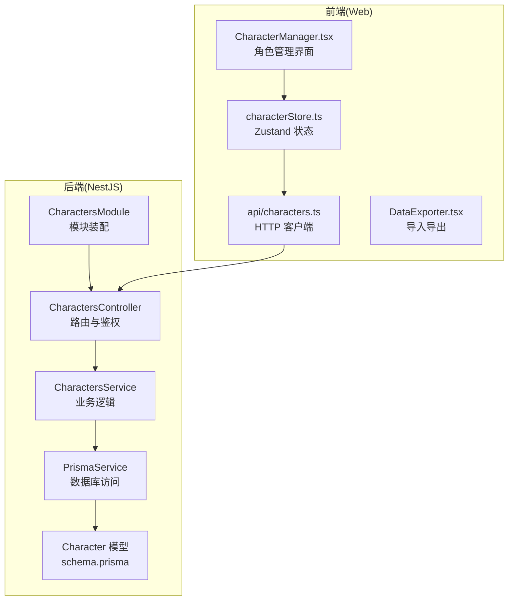
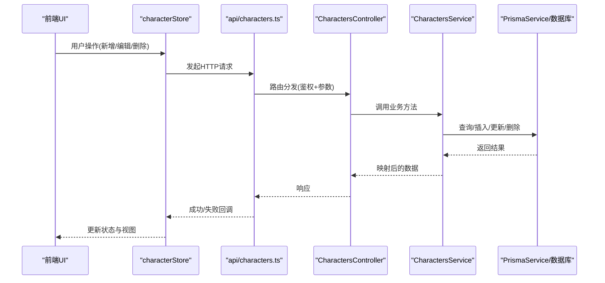
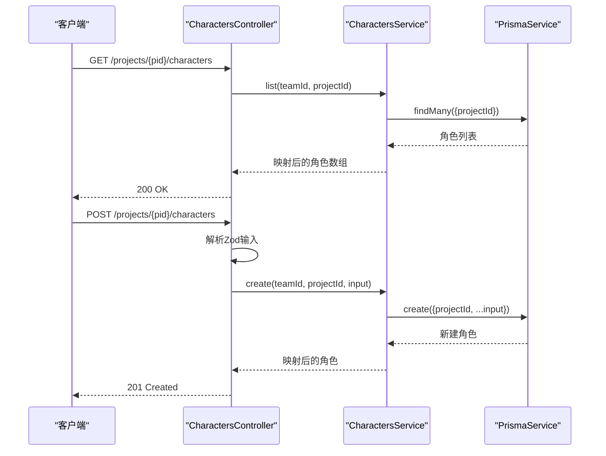
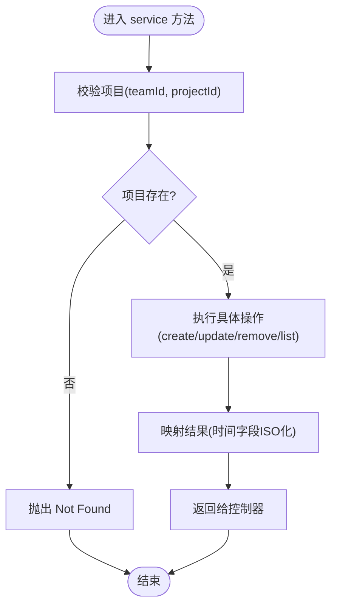
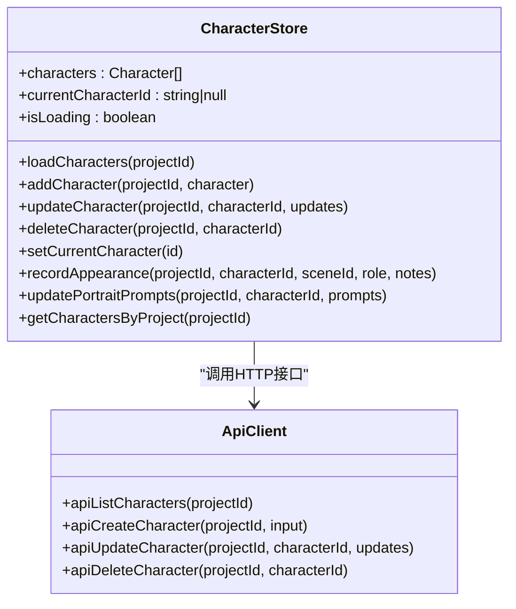
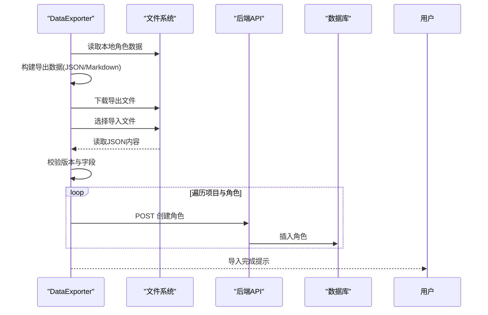
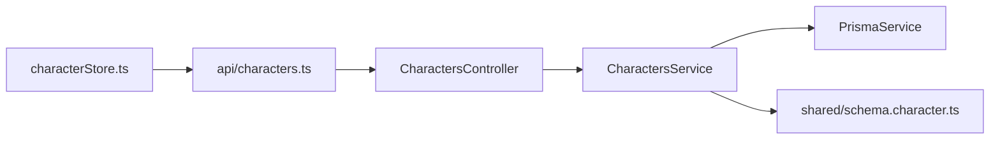

# 角色管理模块

<cite>
**本文档引用的文件**
- [apps/api/src/characters/characters.module.ts](file://apps/api/src/characters/characters.module.ts)
- [apps/api/src/characters/characters.controller.ts](file://apps/api/src/characters/characters.controller.ts)
- [apps/api/src/characters/characters.service.ts](file://apps/api/src/characters/characters.service.ts)
- [packages/shared/src/schemas/character.ts](file://packages/shared/src/schemas/character.ts)
- [apps/api/prisma/schema.prisma](file://apps/api/prisma/schema.prisma)
- [apps/web/src/lib/api/characters.ts](file://apps/web/src/lib/api/characters.ts)
- [apps/web/src/stores/characterStore.ts](file://apps/web/src/stores/characterStore.ts)
- [apps/web/src/lib/characterCreateDraft.ts](file://apps/web/src/lib/characterCreateDraft.ts)
- [apps/web/src/components/editor/CharacterManager.tsx](file://apps/web/src/components/editor/CharacterManager.tsx)
- [apps/web/src/components/editor/DataExporter.tsx](file://apps/web/src/components/editor/DataExporter.tsx)
- [apps/web/src/components/LocalDataMigrationBanner.tsx](file://apps/web/src/components/LocalDataMigrationBanner.tsx)
- [apps/web/src/types/index.ts](file://apps/web/src/types/index.ts)
</cite>

## 目录

1. [引言](#引言)
2. [项目结构](#项目结构)
3. [核心组件](#核心组件)
4. [架构总览](#架构总览)
5. [详细组件分析](#详细组件分析)
6. [依赖关系分析](#依赖关系分析)
7. [性能考虑](#性能考虑)
8. [故障排除指南](#故障排除指南)
9. [结论](#结论)
10. [附录](#附录)

## 引言

本文件为角色管理模块的全面技术文档，围绕 CharactersModule 的架构设计与实现原理展开，覆盖角色创建、编辑、删除与关系管理功能；详解 CharactersController 的 API 接口设计与数据流；剖析 CharactersService 的核心业务逻辑与数据验证策略；阐述角色与项目、场景的关联关系及其在创作流程中的作用；并提供角色导入导出、数据格式转换与批量操作的技术实现细节，以及角色搜索、筛选与排序的实现思路。

## 项目结构

角色管理模块横跨后端 NestJS 应用与前端 Web 应用两部分：

- 后端：NestJS 模块 CharactersModule，控制器 CharactersController，服务 CharactersService，配合 Prisma 数据模型 Character。
- 前端：Web 应用通过 api/characters.ts 发起 HTTP 请求，使用 characterStore.ts 管理本地/远程角色数据，提供角色编辑界面与导入导出能力。

图表来源

- [apps/api/src/characters/characters.module.ts](file://apps/api/src/characters/characters.module.ts#L1-L12)
- [apps/api/src/characters/characters.controller.ts](file://apps/api/src/characters/characters.controller.ts#L1-L47)
- [apps/api/src/characters/characters.service.ts](file://apps/api/src/characters/characters.service.ts#L1-L118)
- [apps/api/prisma/schema.prisma](file://apps/api/prisma/schema.prisma#L235-L257)
- [apps/web/src/lib/api/characters.ts](file://apps/web/src/lib/api/characters.ts#L1-L76)
- [apps/web/src/stores/characterStore.ts](file://apps/web/src/stores/characterStore.ts#L1-L346)
- [apps/web/src/components/editor/CharacterManager.tsx](file://apps/web/src/components/editor/CharacterManager.tsx#L2540-L2980)
- [apps/web/src/components/editor/DataExporter.tsx](file://apps/web/src/components/editor/DataExporter.tsx#L1-L800)

章节来源

- [apps/api/src/characters/characters.module.ts](file://apps/api/src/characters/characters.module.ts#L1-L12)
- [apps/api/src/characters/characters.controller.ts](file://apps/api/src/characters/characters.controller.ts#L1-L47)
- [apps/api/src/characters/characters.service.ts](file://apps/api/src/characters/characters.service.ts#L1-L118)
- [apps/api/prisma/schema.prisma](file://apps/api/prisma/schema.prisma#L235-L257)
- [apps/web/src/lib/api/characters.ts](file://apps/web/src/lib/api/characters.ts#L1-L76)
- [apps/web/src/stores/characterStore.ts](file://apps/web/src/stores/characterStore.ts#L1-L346)
- [apps/web/src/components/editor/CharacterManager.tsx](file://apps/web/src/components/editor/CharacterManager.tsx#L2540-L2980)
- [apps/web/src/components/editor/DataExporter.tsx](file://apps/web/src/components/editor/DataExporter.tsx#L1-L800)

## 核心组件

- CharactersModule：装配控制器与服务，形成角色管理模块边界。
- CharactersController：REST API 控制器，负责鉴权、参数解析与路由分发。
- CharactersService：核心业务逻辑，执行数据验证、项目权限校验、数据库操作与结果映射。
- 前端 api/characters.ts：统一的 HTTP 客户端封装，屏蔽具体路由细节。
- characterStore.ts：Zustand 状态管理，负责本地/远程数据同步、批量操作与变更持久化。
- schema.character.ts：共享的 Zod 校验模式，保证前后端输入一致。
- schema.prisma：数据库模型定义，包含角色表结构与索引。

章节来源

- [apps/api/src/characters/characters.module.ts](file://apps/api/src/characters/characters.module.ts#L1-L12)
- [apps/api/src/characters/characters.controller.ts](file://apps/api/src/characters/characters.controller.ts#L1-L47)
- [apps/api/src/characters/characters.service.ts](file://apps/api/src/characters/characters.service.ts#L1-L118)
- [packages/shared/src/schemas/character.ts](file://packages/shared/src/schemas/character.ts#L1-L32)
- [apps/api/prisma/schema.prisma](file://apps/api/prisma/schema.prisma#L235-L257)
- [apps/web/src/lib/api/characters.ts](file://apps/web/src/lib/api/characters.ts#L1-L76)
- [apps/web/src/stores/characterStore.ts](file://apps/web/src/stores/characterStore.ts#L1-L346)

## 架构总览

角色管理采用典型的三层架构：

- 表现层：前端 UI 与状态管理，负责用户交互与数据展示。
- 应用层：NestJS 控制器与服务，负责请求处理、参数校验与业务编排。
- 数据层：Prisma ORM 与 PostgreSQL，负责数据持久化与查询优化。

图表来源

- [apps/web/src/stores/characterStore.ts](file://apps/web/src/stores/characterStore.ts#L147-L337)
- [apps/web/src/lib/api/characters.ts](file://apps/web/src/lib/api/characters.ts#L1-L76)
- [apps/api/src/characters/characters.controller.ts](file://apps/api/src/characters/characters.controller.ts#L1-L47)
- [apps/api/src/characters/characters.service.ts](file://apps/api/src/characters/characters.service.ts#L1-L118)

## 详细组件分析

### CharactersController API 设计

- 路由层级：/projects/:projectId/characters，支持按项目隔离角色数据。
- 鉴权：使用 JWT 守卫，确保仅团队成员可访问。
- 参数校验：使用 Zod 模式解析请求体，统一错误处理。
- 主要接口：
  - GET /projects/:projectId/characters：列出项目内角色，按更新时间倒序。
  - POST /projects/:projectId/characters：创建角色，支持自定义 ID。
  - PATCH /projects/:projectId/characters/:characterId：更新角色，支持部分字段。
  - DELETE /projects/:projectId/characters/:characterId：删除角色。

图表来源

- [apps/api/src/characters/characters.controller.ts](file://apps/api/src/characters/characters.controller.ts#L14-L43)
- [apps/api/src/characters/characters.service.ts](file://apps/api/src/characters/characters.service.ts#L35-L68)
- [packages/shared/src/schemas/character.ts](file://packages/shared/src/schemas/character.ts#L3-L29)

章节来源

- [apps/api/src/characters/characters.controller.ts](file://apps/api/src/characters/characters.controller.ts#L1-L47)
- [packages/shared/src/schemas/character.ts](file://packages/shared/src/schemas/character.ts#L1-L32)

### CharactersService 业务逻辑

- 项目权限校验：查询项目是否存在且未删除，确保操作在合法团队与项目范围内。
- 数据映射：将数据库时间字段转换为 ISO 字符串，统一 API 输出格式。
- CRUD 实现：
  - list：按项目查询并按更新时间倒序。
  - create：支持自定义 ID，其余字段带默认值或可选。
  - update：支持部分字段更新，避免覆盖未变更字段。
  - remove：先校验存在性，再删除。
- 错误处理：未找到项目或角色时抛出 NotFound 异常。

图表来源

- [apps/api/src/characters/characters.service.ts](file://apps/api/src/characters/characters.service.ts#L27-L114)

章节来源

- [apps/api/src/characters/characters.service.ts](file://apps/api/src/characters/characters.service.ts#L1-L118)

### 前端角色状态与 UI

- api/characters.ts：封装 GET/POST/PATCH/DELETE 请求，构造请求体时仅包含有效字段。
- characterStore.ts：
  - 加载角色：支持本地存储与 API 模式切换。
  - 新增/更新/删除：本地即时更新，异步同步至后端；失败回滚。
  - 出场记录：recordAppearance 支持按场景记录角色出场与角色类型。
  - 画像提示词：updatePortraitPrompts 支持更新角色画像提示词。
  - 归一化：normalizePortraitPrompts/normalizeRelationships/normalizeAppearances 确保数据结构一致。
- CharacterManager.tsx：提供角色卡片、标签、编辑与删除入口，展示出场次数与关系标签。

图表来源

- [apps/web/src/stores/characterStore.ts](file://apps/web/src/stores/characterStore.ts#L122-L337)
- [apps/web/src/lib/api/characters.ts](file://apps/web/src/lib/api/characters.ts#L6-L76)

章节来源

- [apps/web/src/lib/api/characters.ts](file://apps/web/src/lib/api/characters.ts#L1-L76)
- [apps/web/src/stores/characterStore.ts](file://apps/web/src/stores/characterStore.ts#L1-L346)
- [apps/web/src/components/editor/CharacterManager.tsx](file://apps/web/src/components/editor/CharacterManager.tsx#L2540-L2980)

### 角色与项目、场景的关联关系

- 项目关联：角色属于项目，查询时按 projectId 过滤，创建时绑定 projectId。
- 场景关联：角色可通过 appearances 记录在特定场景中的出场情况，支持主/配角/背景角色标记。
- 类型定义：Character 接口包含 projectId、appearances 等字段，确保跨模块一致性。

章节来源

- [apps/api/prisma/schema.prisma](file://apps/api/prisma/schema.prisma#L235-L257)
- [apps/web/src/types/index.ts](file://apps/web/src/types/index.ts#L1-L800)
- [apps/web/src/stores/characterStore.ts](file://apps/web/src/stores/characterStore.ts#L74-L92)

### 角色导入导出与批量操作

- 导出：DataExporter 支持 JSON/Markdown 格式导出，可选择包含角色数据与分镜数据，并统计总数。
- 导入：支持从 JSON 文件导入项目数据，校验版本与必要字段，逐项目/逐角色写入。
- 批量导入：LocalDataMigrationBanner 将本地历史角色数据批量创建到后端。
- 角色草稿：characterCreateDraft 提供创建草稿的本地持久化，支持恢复与清理。

图表来源

- [apps/web/src/components/editor/DataExporter.tsx](file://apps/web/src/components/editor/DataExporter.tsx#L299-L348)
- [apps/web/src/components/LocalDataMigrationBanner.tsx](file://apps/web/src/components/LocalDataMigrationBanner.tsx#L187-L213)
- [apps/web/src/lib/characterCreateDraft.ts](file://apps/web/src/lib/characterCreateDraft.ts#L35-L99)

章节来源

- [apps/web/src/components/editor/DataExporter.tsx](file://apps/web/src/components/editor/DataExporter.tsx#L1-L800)
- [apps/web/src/components/LocalDataMigrationBanner.tsx](file://apps/web/src/components/LocalDataMigrationBanner.tsx#L187-L213)
- [apps/web/src/lib/characterCreateDraft.ts](file://apps/web/src/lib/characterCreateDraft.ts#L1-L116)

### 角色搜索、筛选与排序

- 前端搜索：CharacterManager 展示角色列表，支持按出场次数与关系标签快速识别。
- 项目级过滤：在场景细化等页面，基于当前项目筛选角色列表，提升可用性。
- 排序策略：后端按 updatedAt 倒序；前端可结合 UI 交互进行二次排序或筛选。

章节来源

- [apps/web/src/components/editor/CharacterManager.tsx](file://apps/web/src/components/editor/CharacterManager.tsx#L2540-L2980)
- [apps/api/src/characters/characters.service.ts](file://apps/api/src/characters/characters.service.ts#L35-L42)

## 依赖关系分析

- 模块耦合：CharactersModule 低耦合地装配控制器与服务，职责清晰。
- 控制器依赖：依赖 CharactersService 提供业务能力，自身仅处理路由与鉴权。
- 服务依赖：依赖 PrismaService 访问数据库，依赖 Zod 模式进行输入校验。
- 前端依赖：api/characters.ts 与 shared schema 保持一致，避免重复校验逻辑。
- 数据模型：Character 模型包含角色核心字段与 JSON 字段（如 portraitPrompts、relationships、appearances），满足灵活扩展。

图表来源

- [apps/api/src/characters/characters.controller.ts](file://apps/api/src/characters/characters.controller.ts#L1-L47)
- [apps/api/src/characters/characters.service.ts](file://apps/api/src/characters/characters.service.ts#L1-L118)
- [packages/shared/src/schemas/character.ts](file://packages/shared/src/schemas/character.ts#L1-L32)
- [apps/web/src/lib/api/characters.ts](file://apps/web/src/lib/api/characters.ts#L1-L76)
- [apps/web/src/stores/characterStore.ts](file://apps/web/src/stores/characterStore.ts#L1-L346)

章节来源

- [apps/api/src/characters/characters.controller.ts](file://apps/api/src/characters/characters.controller.ts#L1-L47)
- [apps/api/src/characters/characters.service.ts](file://apps/api/src/characters/characters.service.ts#L1-L118)
- [packages/shared/src/schemas/character.ts](file://packages/shared/src/schemas/character.ts#L1-L32)
- [apps/web/src/lib/api/characters.ts](file://apps/web/src/lib/api/characters.ts#L1-L76)
- [apps/web/src/stores/characterStore.ts](file://apps/web/src/stores/characterStore.ts#L1-L346)

## 性能考虑

- 查询优化：后端按项目过滤并按更新时间倒序，减少无关扫描；数据库为 Character 表建立索引。
- 前端缓存：characterStore 在 API 模式下仍可利用本地存储进行快速加载与回退。
- 批量操作：导入导出采用分步处理与进度反馈，避免长时间阻塞 UI。
- 数据映射：服务层统一时间格式化，减少前端重复处理。

## 故障排除指南

- 404 未找到：当项目或角色不存在时，服务层抛出异常；前端应提示用户刷新或检查权限。
- 参数校验失败：Zod 模式解析失败会触发统一错误处理；前端应根据错误信息修正输入。
- 导入失败：检查 JSON 版本与字段完整性；若出现鉴权错误，需重新登录或检查团队权限。
- 同步问题：本地与后端状态不一致时，前端提供回滚与重载机制；必要时清理草稿或重新拉取。

章节来源

- [apps/api/src/characters/characters.service.ts](file://apps/api/src/characters/characters.service.ts#L27-L114)
- [apps/web/src/lib/api/characters.ts](file://apps/web/src/lib/api/characters.ts#L1-L76)
- [apps/web/src/stores/characterStore.ts](file://apps/web/src/stores/characterStore.ts#L152-L179)

## 结论

角色管理模块通过清晰的分层设计与严格的输入校验，实现了角色在项目内的创建、编辑、删除与关系维护；前后端协作良好，支持本地与远程两种运行模式；导入导出与批量操作提升了数据迁移与规模化管理效率；出场记录与关系网络为创作流程提供了重要支撑。后续可在关系网络可视化与出场统计报表方面进一步增强。

## 附录

- 数据模型概览（角色核心字段与 JSON 扩展）
  - 核心字段：id、projectId、name、briefDescription、avatar、appearance、personality、background、themeColor、primaryColor、secondaryColor。
  - JSON 字段：portraitPrompts（画像提示词）、customStyle（自定义画风）、relationships（关系网络）、appearances（出场记录）。

章节来源

- [apps/api/prisma/schema.prisma](file://apps/api/prisma/schema.prisma#L235-L257)
- [apps/web/src/types/index.ts](file://apps/web/src/types/index.ts#L1-L800)
