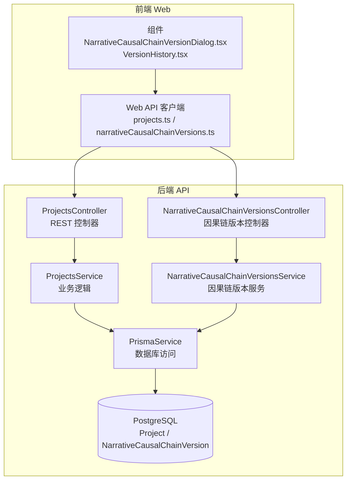
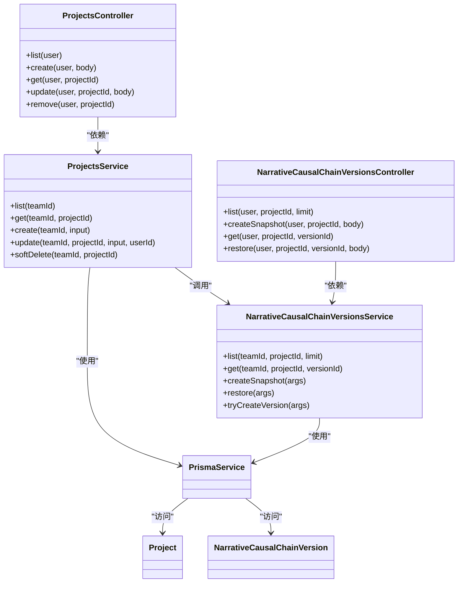
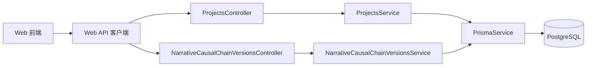
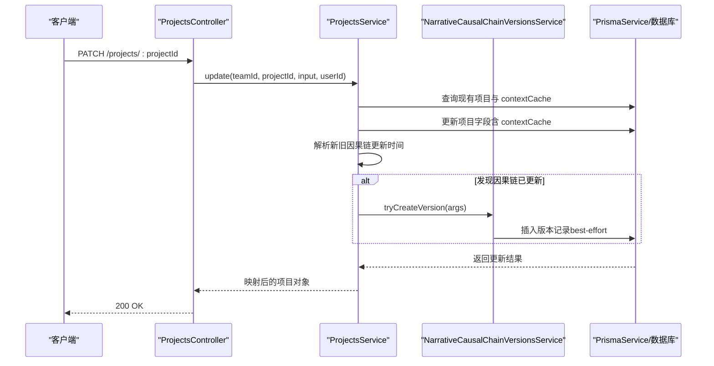

# 项目管理模块

<cite>
**本文引用的文件**
- [apps/api/src/projects/projects.controller.ts](file://apps/api/src/projects/projects.controller.ts)
- [apps/api/src/projects/projects.service.ts](file://apps/api/src/projects/projects.service.ts)
- [apps/api/src/projects/narrative-causal-chain-versions.controller.ts](file://apps/api/src/projects/narrative-causal-chain-versions.controller.ts)
- [apps/api/src/projects/narrative-causal-chain-versions.service.ts](file://apps/api/src/projects/narrative-causal-chain-versions.service.ts)
- [apps/api/src/projects/projects.module.ts](file://apps/api/src/projects/projects.module.ts)
- [packages/shared/src/schemas/project.ts](file://packages/shared/src/schemas/project.ts)
- [packages/shared/src/schemas/narrativeCausalChain.ts](file://packages/shared/src/schemas/narrativeCausalChain.ts)
- [apps/api/prisma/schema.prisma](file://apps/api/prisma/schema.prisma)
- [apps/api/prisma/migrations/20251217105000_add_causal_chain_versions/migration.sql](file://apps/api/prisma/migrations/20251217105000_add_causal_chain_versions/migration.sql)
- [apps/web/src/lib/api/projects.ts](file://apps/web/src/lib/api/projects.ts)
- [apps/web/src/lib/api/narrativeCausalChainVersions.ts](file://apps/web/src/lib/api/narrativeCausalChainVersions.ts)
- [apps/web/src/components/editor/NarrativeCausalChainVersionDialog.tsx](file://apps/web/src/components/editor/NarrativeCausalChainVersionDialog.tsx)
- [apps/web/src/components/editor/VersionHistory.tsx](file://apps/web/src/components/editor/VersionHistory.tsx)
</cite>

## 目录

1. [简介](#简介)
2. [项目结构](#项目结构)
3. [核心组件](#核心组件)
4. [架构总览](#架构总览)
5. [详细组件分析](#详细组件分析)
6. [依赖分析](#依赖分析)
7. [性能考虑](#性能考虑)
8. [故障排查指南](#故障排查指南)
9. [结论](#结论)
10. [附录](#附录)

## 简介

本技术文档围绕项目管理模块（ProjectsModule）进行系统化梳理，重点覆盖以下方面：

- 项目生命周期管理：创建、查询、更新、软删除
- 项目状态管理：工作流状态与场景步骤
- 因果链版本管理：版本快照、历史查询、版本恢复
- REST API 设计与调用示例
- 错误处理机制与性能优化建议
- 与前端 Web 层及 Worker 的集成方式与数据流转

## 项目结构

项目管理模块位于后端 API 应用中，采用 NestJS 控制器/服务分层架构，并通过 Prisma 访问 PostgreSQL 数据库。前端 Web 应用通过统一的 HTTP 接口与后端交互。

图表来源

- [apps/api/src/projects/projects.controller.ts](file://apps/api/src/projects/projects.controller.ts#L1-L43)
- [apps/api/src/projects/projects.service.ts](file://apps/api/src/projects/projects.service.ts#L1-L215)
- [apps/api/src/projects/narrative-causal-chain-versions.controller.ts](file://apps/api/src/projects/narrative-causal-chain-versions.controller.ts#L1-L84)
- [apps/api/src/projects/narrative-causal-chain-versions.service.ts](file://apps/api/src/projects/narrative-causal-chain-versions.service.ts#L1-L339)
- [apps/api/prisma/schema.prisma](file://apps/api/prisma/schema.prisma#L116-L174)
- [apps/web/src/lib/api/projects.ts](file://apps/web/src/lib/api/projects.ts#L1-L53)
- [apps/web/src/lib/api/narrativeCausalChainVersions.ts](file://apps/web/src/lib/api/narrativeCausalChainVersions.ts#L1-L57)

章节来源

- [apps/api/src/projects/projects.module.ts](file://apps/api/src/projects/projects.module.ts#L1-L15)

## 核心组件

- ProjectsController：提供项目 CRUD 与查询接口，统一鉴权与输入校验
- ProjectsService：封装项目业务逻辑，含统计聚合、事务性创建、软删除、因果链版本自动记录
- NarrativeCausalChainVersionsController：提供因果链版本列表、快照、详情、恢复接口
- NarrativeCausalChainVersionsService：负责版本持久化、元数据提取、版本裁剪与最佳努力写入
- Prisma 模型：Project、NarrativeCausalChainVersion 及枚举类型定义
- 前端 API 客户端与 UI 组件：封装 HTTP 请求并驱动版本管理交互

章节来源

- [apps/api/src/projects/projects.controller.ts](file://apps/api/src/projects/projects.controller.ts#L1-L43)
- [apps/api/src/projects/projects.service.ts](file://apps/api/src/projects/projects.service.ts#L1-L215)
- [apps/api/src/projects/narrative-causal-chain-versions.controller.ts](file://apps/api/src/projects/narrative-causal-chain-versions.controller.ts#L1-L84)
- [apps/api/src/projects/narrative-causal-chain-versions.service.ts](file://apps/api/src/projects/narrative-causal-chain-versions.service.ts#L1-L339)
- [apps/api/prisma/schema.prisma](file://apps/api/prisma/schema.prisma#L116-L174)

## 架构总览

项目管理模块遵循“控制器-服务-数据层”的分层设计，控制器负责路由与参数解析，服务承担业务规则与跨模型协作，Prisma 提供类型安全的数据访问。

图表来源

- [apps/api/src/projects/projects.controller.ts](file://apps/api/src/projects/projects.controller.ts#L1-L43)
- [apps/api/src/projects/projects.service.ts](file://apps/api/src/projects/projects.service.ts#L1-L215)
- [apps/api/src/projects/narrative-causal-chain-versions.controller.ts](file://apps/api/src/projects/narrative-causal-chain-versions.controller.ts#L1-L84)
- [apps/api/src/projects/narrative-causal-chain-versions.service.ts](file://apps/api/src/projects/narrative-causal-chain-versions.service.ts#L1-L339)
- [apps/api/prisma/schema.prisma](file://apps/api/prisma/schema.prisma#L116-L174)

## 详细组件分析

### ProjectsController：REST API 设计

- 路由与鉴权
  - 使用 JWT 鉴权守卫保护所有接口
  - 通过当前用户装饰器注入用户上下文，提取团队 ID 与用户 ID
- 接口清单
  - GET /projects：列出团队下未删除的项目，按更新时间倒序
  - POST /projects：创建项目，支持自定义 ID
  - GET /projects/:projectId：按团队与 ID 查询项目
  - PATCH /projects/:projectId：更新项目，支持工作流状态、场景步骤、上下文缓存等
  - DELETE /projects/:projectId：软删除项目（设置 deletedAt）
- 输入校验
  - 使用共享 Zod Schema 对请求体进行严格校验，不符合则抛出错误

章节来源

- [apps/api/src/projects/projects.controller.ts](file://apps/api/src/projects/projects.controller.ts#L1-L43)
- [packages/shared/src/schemas/project.ts](file://packages/shared/src/schemas/project.ts#L7-L30)

### ProjectsService：核心业务逻辑

- 列表与统计
  - 查询未删除项目并批量计算剧集数量、有核心表达的剧节数、场景总数与已完成场景数
  - 统计失败时降级返回不含统计的项目对象
- 单个项目查询
  - 严格按团队过滤，未找到则抛出“未找到”
- 创建项目
  - 事务内创建项目并初始化第一条剧集（order=1，初始状态）
- 更新项目
  - 严格按团队过滤存在性校验
  - 支持部分字段更新（标题、摘要、风格、主角、艺术风格配置、工作流状态、当前场景顺序/步骤、上下文缓存）
  - 若检测到因果链上下文发生变化，自动尝试写入版本记录（手动来源），失败为最佳努力
- 软删除
  - 存在性校验后设置 deletedAt

章节来源

- [apps/api/src/projects/projects.service.ts](file://apps/api/src/projects/projects.service.ts#L55-L212)
- [apps/api/prisma/schema.prisma](file://apps/api/prisma/schema.prisma#L116-L141)

### 因果链版本管理：控制器与服务

- 控制器接口
  - GET /projects/:projectId/narrative-causal-chain/versions：列出版本（默认限制 50，最大 200）
  - POST /projects/:projectId/narrative-causal-chain/versions：创建快照（标签/备注可选）
  - GET /projects/:projectId/narrative-causal-chain/versions/:versionId：获取版本详情
  - POST /projects/:projectId/narrative-causal-chain/versions/:versionId/restore：恢复版本（标签/备注可选）
- 服务实现要点
  - 项目存在性断言
  - 版本列表与详情：使用原生 SQL 查询，兼容未迁移场景（捕获异常并返回空列表/抛未找到）
  - 快照创建：从项目 contextCache 中提取因果链，若为空则拒绝；提取 completedPhase 等元信息并写入版本
  - 恢复：将目标版本写回项目 contextCache，并创建“恢复”来源的版本记录
  - 最佳努力写入：tryCreateVersion 在数据库未迁移时返回 null，不影响主流程

章节来源

- [apps/api/src/projects/narrative-causal-chain-versions.controller.ts](file://apps/api/src/projects/narrative-causal-chain-versions.controller.ts#L1-L84)
- [apps/api/src/projects/narrative-causal-chain-versions.service.ts](file://apps/api/src/projects/narrative-causal-chain-versions.service.ts#L65-L335)
- [apps/api/prisma/migrations/20251217105000_add_causal_chain_versions/migration.sql](file://apps/api/prisma/migrations/20251217105000_add_causal_chain_versions/migration.sql#L1-L40)

### 数据模型与类型

- Project 模型
  - 包含工作流状态、当前场景顺序/步骤、上下文缓存（JSON）、软删除字段
- NarrativeCausalChainVersion 模型
  - 记录来源（AI/手动/恢复）、阶段号、完成阶段、校验状态、schema 版本、标签/备注、来源版本 ID、完整因果链 JSON
- 枚举与状态
  - ProjectWorkflowState、EpisodeWorkflowState、SceneStatus、ProviderType、AIJobStatus、NarrativeCausalChainVersionSource

章节来源

- [apps/api/prisma/schema.prisma](file://apps/api/prisma/schema.prisma#L16-L73)
- [apps/api/prisma/schema.prisma](file://apps/api/prisma/schema.prisma#L116-L174)

### 前端集成与调用示例

- 项目 API（Web 客户端）
  - 列表、详情、创建、更新、删除
- 因果链版本 API（Web 客户端）
  - 列表、详情、创建快照、恢复
- 前端组件
  - 版本对话框：支持浏览、创建快照、恢复版本、刷新列表
  - 版本历史面板：展示版本列表、添加标签、恢复版本

章节来源

- [apps/web/src/lib/api/projects.ts](file://apps/web/src/lib/api/projects.ts#L1-L53)
- [apps/web/src/lib/api/narrativeCausalChainVersions.ts](file://apps/web/src/lib/api/narrativeCausalChainVersions.ts#L1-L57)
- [apps/web/src/components/editor/NarrativeCausalChainVersionDialog.tsx](file://apps/web/src/components/editor/NarrativeCausalChainVersionDialog.tsx#L1-L467)
- [apps/web/src/components/editor/VersionHistory.tsx](file://apps/web/src/components/editor/VersionHistory.tsx#L1-L230)

## 依赖分析

- 控制器依赖服务，服务依赖 PrismaService
- ProjectsService 依赖 NarrativeCausalChainVersionsService 实现因果链版本自动记录
- 前端通过统一 API 客户端与后端交互，UI 组件驱动版本管理流程

图表来源

- [apps/api/src/projects/projects.controller.ts](file://apps/api/src/projects/projects.controller.ts#L1-L43)
- [apps/api/src/projects/narrative-causal-chain-versions.controller.ts](file://apps/api/src/projects/narrative-causal-chain-versions.controller.ts#L1-L84)
- [apps/api/src/projects/projects.service.ts](file://apps/api/src/projects/projects.service.ts#L1-L215)
- [apps/api/src/projects/narrative-causal-chain-versions.service.ts](file://apps/api/src/projects/narrative-causal-chain-versions.service.ts#L1-L339)
- [apps/api/prisma/schema.prisma](file://apps/api/prisma/schema.prisma#L116-L174)

## 性能考虑

- 列表统计的并发优化
  - 使用 Promise.all 并行计算每个项目的统计指标，减少往返次数
- 版本查询的分页与上限
  - 限制最大返回条数，避免大列表导致的内存与网络压力
- 最佳努力写入
  - 版本记录失败不阻断主流程，保证用户体验连续性
- 数据库索引
  - 版本表按项目/团队/时间建立索引，提升查询效率
- 类型安全与校验
  - 前端与共享 Schema 双重校验，减少无效请求与数据库错误

## 故障排查指南

- 404 未找到
  - 项目不存在或已被软删除；检查 teamId 与 projectId 是否匹配
- 400 参数错误
  - 因果链快照创建时，contextCache 中缺少因果链；检查前端是否已生成因果链
- 数据库未迁移
  - 版本列表/详情/插入可能因缺少版本表而失败；确认迁移脚本执行
- 权限问题
  - 控制器使用 JWT 鉴权，确保前端携带有效 Token；团队成员身份由服务层按 teamId 校验

章节来源

- [apps/api/src/projects/projects.service.ts](file://apps/api/src/projects/projects.service.ts#L104-L109)
- [apps/api/src/projects/narrative-causal-chain-versions.service.ts](file://apps/api/src/projects/narrative-causal-chain-versions.service.ts#L174-L204)
- [apps/api/src/projects/narrative-causal-chain-versions.controller.ts](file://apps/api/src/projects/narrative-causal-chain-versions.controller.ts#L33-L41)

## 结论

项目管理模块以清晰的分层架构实现了项目全生命周期管理与因果链版本追踪。通过严格的输入校验、事务性操作与最佳努力写入策略，既保证了数据一致性，又提升了用户体验。建议在生产环境中配合完善的监控与告警，持续优化版本查询与统计性能。

## 附录

### API 调用示例（路径与方法）

- 列出项目
  - 方法：GET
  - 路径：/projects
- 创建项目
  - 方法：POST
  - 路径：/projects
  - 请求体字段：id（可选）、title、summary（可选）、protagonist（可选）、style（可选）、artStyleConfig（可选）
- 获取项目
  - 方法：GET
  - 路径：/projects/{projectId}
- 更新项目
  - 方法：PATCH
  - 路径：/projects/{projectId}
  - 请求体字段：title（可选）、summary（可选）、style（可选）、protagonist（可选）、artStyleConfig（可选）、workflowState（可选）、currentSceneOrder（可选）、currentSceneStep（可选）、contextCache（可选）
- 删除项目
  - 方法：DELETE
  - 路径：/projects/{projectId}

- 版本列表
  - 方法：GET
  - 路径：/projects/{projectId}/narrative-causal-chain/versions?limit=N
- 创建快照
  - 方法：POST
  - 路径：/projects/{projectId}/narrative-causal-chain/versions
  - 请求体字段：label（可选）、note（可选）
- 获取版本
  - 方法：GET
  - 路径：/projects/{projectId}/narrative-causal-chain/versions/{versionId}
- 恢复版本
  - 方法：POST
  - 路径：/projects/{projectId}/narrative-causal-chain/versions/{versionId}/restore
  - 请求体字段：label（可选）、note（可选）

章节来源

- [apps/web/src/lib/api/projects.ts](file://apps/web/src/lib/api/projects.ts#L6-L52)
- [apps/web/src/lib/api/narrativeCausalChainVersions.ts](file://apps/web/src/lib/api/narrativeCausalChainVersions.ts#L22-L56)

### 项目状态与工作流

- 工作流状态（ProjectWorkflowState）
  - IDLE、DATA_COLLECTING、DATA_COLLECTED、WORLD_VIEW_BUILDING、CHARACTER_MANAGING、EPISODE_PLANNING、EPISODE_PLAN_EDITING、EPISODE_CREATING、SCENE_LIST_GENERATING、SCENE_LIST_EDITING、SCENE_LIST_CONFIRMED、SCENE_PROCESSING、ALL_SCENES_COMPLETE、ALL_EPISODES_COMPLETE、EXPORTING
- 场景步骤（SceneStep）
  - scene_description、keyframe_prompt、motion_prompt、dialogue
- 场景状态（SceneStatus）
  - pending、scene_generating、scene_confirmed、keyframe_generating、keyframe_confirmed、motion_generating、completed、needs_update

章节来源

- [packages/shared/src/types.ts](file://packages/shared/src/types.ts#L6-L47)
- [apps/api/prisma/schema.prisma](file://apps/api/prisma/schema.prisma#L16-L51)

### 因果链版本序列图（更新项目触发自动记录）

图表来源

- [apps/api/src/projects/projects.controller.ts](file://apps/api/src/projects/projects.controller.ts#L30-L39)
- [apps/api/src/projects/projects.service.ts](file://apps/api/src/projects/projects.service.ts#L141-L198)
- [apps/api/src/projects/narrative-causal-chain-versions.service.ts](file://apps/api/src/projects/narrative-causal-chain-versions.service.ts#L258-L335)
