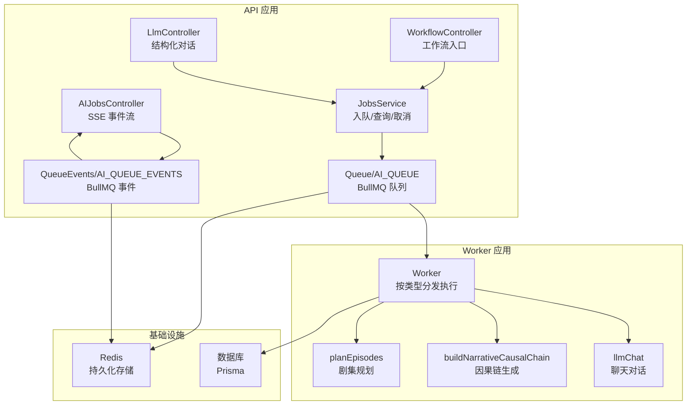
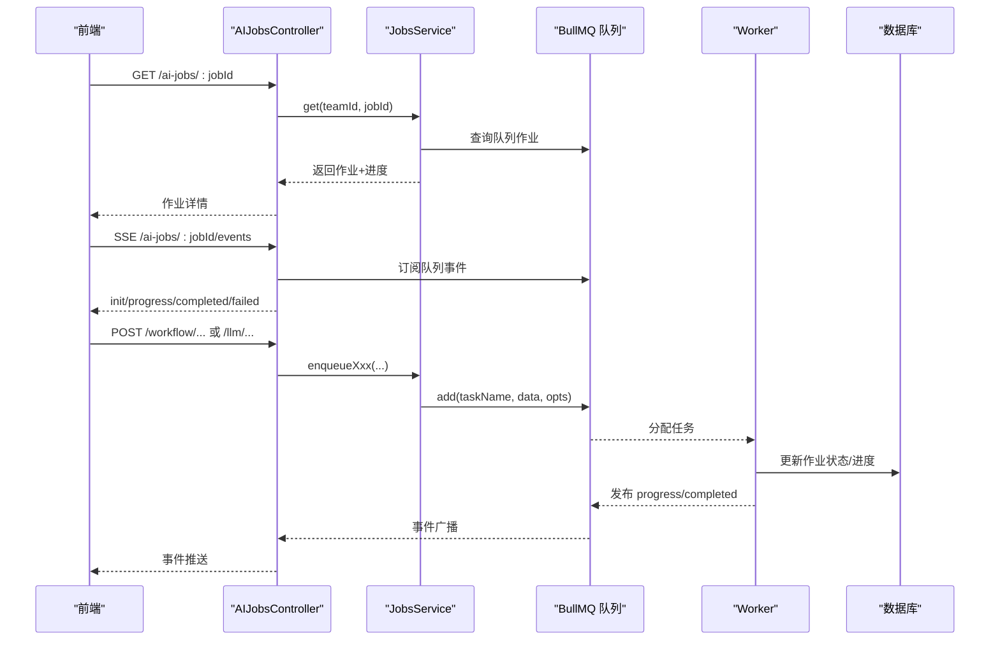
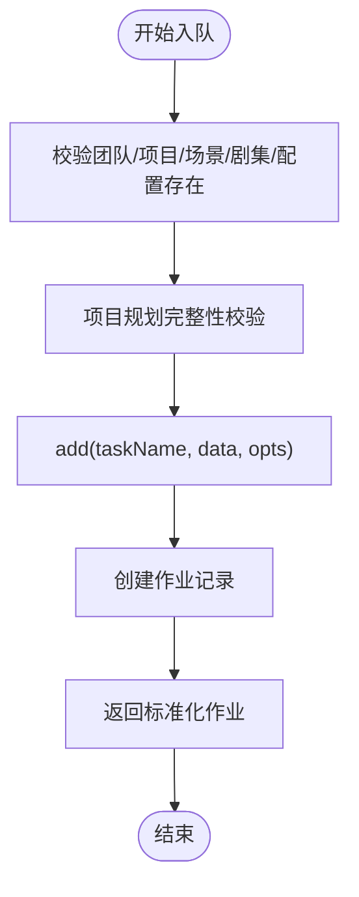
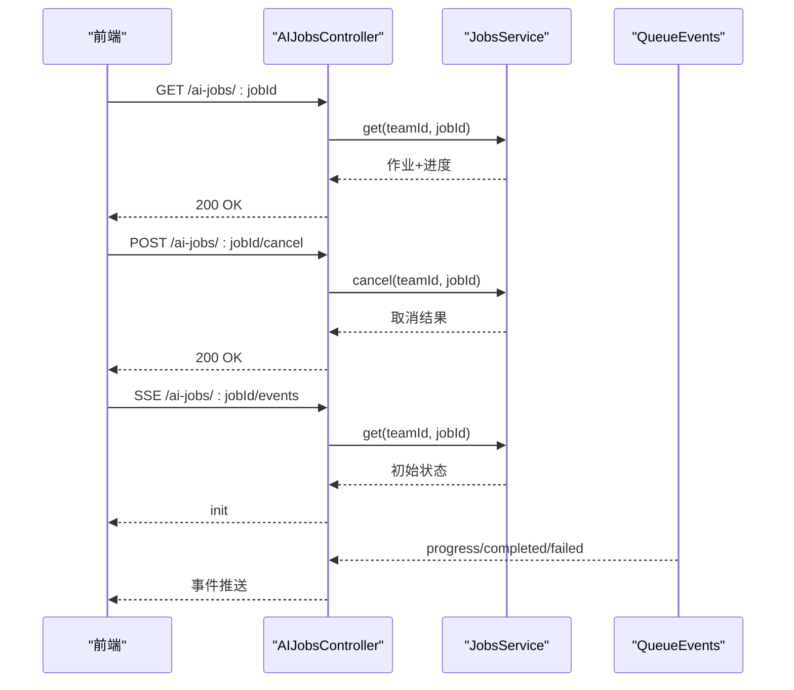
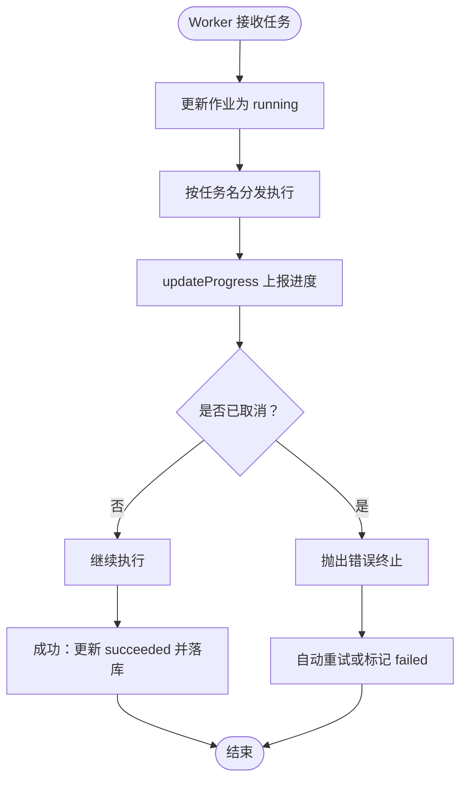
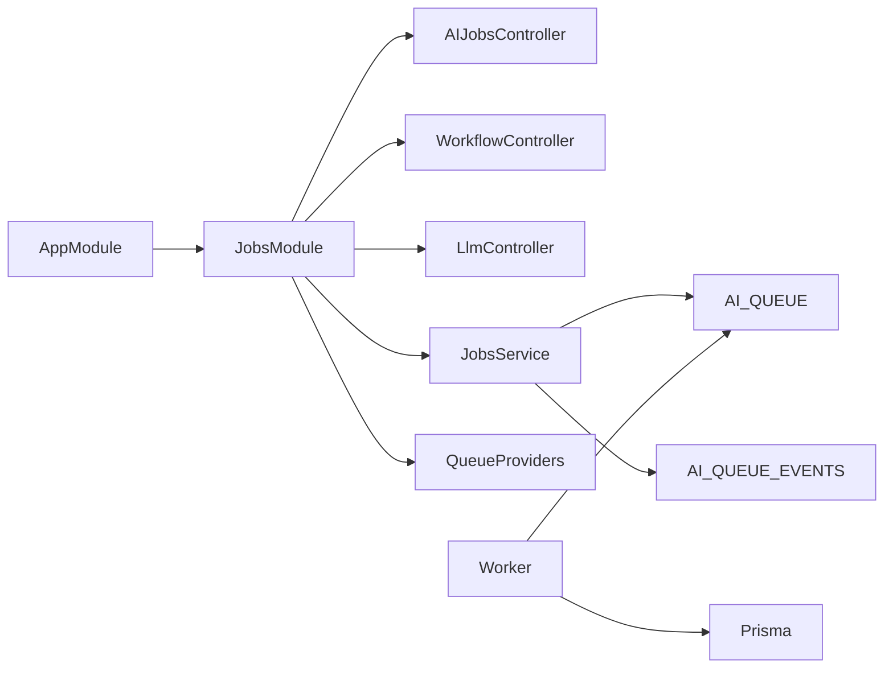

# 作业调度

<cite>
**本文引用的文件**
- [apps/api/src/jobs/jobs.service.ts](file://apps/api/src/jobs/jobs.service.ts)
- [apps/api/src/jobs/ai-jobs.controller.ts](file://apps/api/src/jobs/ai-jobs.controller.ts)
- [apps/api/src/jobs/llm.controller.ts](file://apps/api/src/jobs/llm.controller.ts)
- [apps/api/src/jobs/workflow.controller.ts](file://apps/api/src/jobs/workflow.controller.ts)
- [apps/api/src/jobs/planningValidation.ts](file://apps/api/src/jobs/planningValidation.ts)
- [apps/api/src/jobs/queue.providers.ts](file://apps/api/src/jobs/queue.providers.ts)
- [apps/api/src/jobs/jobs.constants.ts](file://apps/api/src/jobs/jobs.constants.ts)
- [apps/api/src/jobs/jobs.module.ts](file://apps/api/src/jobs/jobs.module.ts)
- [apps/api/src/app.module.ts](file://apps/api/src/app.module.ts)
- [apps/worker/src/worker.ts](file://apps/worker/src/worker.ts)
- [apps/worker/src/tasks/planEpisodes.ts](file://apps/worker/src/tasks/planEpisodes.ts)
- [apps/worker/src/tasks/buildNarrativeCausalChain.ts](file://apps/worker/src/tasks/buildNarrativeCausalChain.ts)
- [apps/worker/src/tasks/llmChat.ts](file://apps/worker/src/tasks/llmChat.ts)
</cite>

## 目录

1. [简介](#简介)
2. [项目结构](#项目结构)
3. [核心组件](#核心组件)
4. [架构总览](#架构总览)
5. [组件详解](#组件详解)
6. [依赖关系分析](#依赖关系分析)
7. [性能与可靠性](#性能与可靠性)
8. [故障排查指南](#故障排查指南)
9. [结论](#结论)
10. [附录](#附录)

## 简介

本文件面向AIXSSS作业调度系统，聚焦于BullMQ集成与任务队列管理架构，系统性梳理JobsService的任务调度逻辑、队列与进度追踪机制，以及AIJobsController、LlmController、WorkflowController的接口职责与行为边界。同时阐述规划验证、队列配置与连接管理、作业优先级与重试策略、错误处理与生命周期管理，并给出完整的监控与运维建议。

## 项目结构

- API侧负责接收请求、参数校验、入队与状态查询，以及通过SSE推送进度事件。
- Worker侧负责消费队列、执行具体任务、更新作业状态与进度。
- 队列与事件通过BullMQ在Redis中持久化，支持重试、清理与事件监听。

图示来源

- [apps/api/src/jobs/ai-jobs.controller.ts](file://apps/api/src/jobs/ai-jobs.controller.ts#L1-L69)
- [apps/api/src/jobs/workflow.controller.ts](file://apps/api/src/jobs/workflow.controller.ts#L1-L266)
- [apps/api/src/jobs/llm.controller.ts](file://apps/api/src/jobs/llm.controller.ts#L1-L75)
- [apps/api/src/jobs/jobs.service.ts](file://apps/api/src/jobs/jobs.service.ts#L1-L1055)
- [apps/api/src/jobs/queue.providers.ts](file://apps/api/src/jobs/queue.providers.ts#L1-L39)
- [apps/worker/src/worker.ts](file://apps/worker/src/worker.ts#L1-L755)

章节来源

- [apps/api/src/app.module.ts](file://apps/api/src/app.module.ts#L1-L37)
- [apps/api/src/jobs/jobs.module.ts](file://apps/api/src/jobs/jobs.module.ts#L1-L16)

## 核心组件

- JobsService：统一的任务入队、状态查询、取消与进度映射；封装项目/场景/剧集/AI配置的权限与完整性校验；统一的队列选项（重试、指数退避、完成/失败清理）。
- AIJobsController：提供作业详情查询、取消与SSE事件流，前端可订阅进度/完成/失败事件。
- WorkflowController：工作流编排入口，将高层操作拆解为具体任务并入队。
- LlmController：结构化对话与结构化测试入队，支持参数覆盖。
- QueueProviders：基于环境变量构建队列与事件实例，支持Redis URL解析与队列名称配置。
- Worker：按任务类型分发执行，更新作业状态与进度，处理重试与失败收敛。

章节来源

- [apps/api/src/jobs/jobs.service.ts](file://apps/api/src/jobs/jobs.service.ts#L1-L1055)
- [apps/api/src/jobs/ai-jobs.controller.ts](file://apps/api/src/jobs/ai-jobs.controller.ts#L1-L69)
- [apps/api/src/jobs/workflow.controller.ts](file://apps/api/src/jobs/workflow.controller.ts#L1-L266)
- [apps/api/src/jobs/llm.controller.ts](file://apps/api/src/jobs/llm.controller.ts#L1-L75)
- [apps/api/src/jobs/queue.providers.ts](file://apps/api/src/jobs/queue.providers.ts#L1-L39)
- [apps/worker/src/worker.ts](file://apps/worker/src/worker.ts#L1-L755)

## 架构总览

- API侧通过控制器将业务请求转换为队列任务，统一由JobsService进行参数校验与入队。
- Worker侧根据任务名分发到对应任务处理器，逐阶段更新进度并最终落库。
- BullMQ事件用于前端SSE订阅，实现进度/完成/失败的实时通知。
- Redis作为队列与事件的持久化后端，支持重试与清理策略。

图示来源

- [apps/api/src/jobs/ai-jobs.controller.ts](file://apps/api/src/jobs/ai-jobs.controller.ts#L33-L65)
- [apps/api/src/jobs/jobs.service.ts](file://apps/api/src/jobs/jobs.service.ts#L88-L149)
- [apps/worker/src/worker.ts](file://apps/worker/src/worker.ts#L50-L729)

## 组件详解

### JobsService：任务调度与生命周期

- 作业入队：提供计划、因果链、场景/剧集/镜头等多类任务的入队方法，统一设置队列选项（重试次数、指数退避、完成/失败清理数量）。
- 作业查询：返回标准化作业结构，包含时间戳与进度；进度来自队列作业的progress字段。
- 作业取消：仅允许未完成作业取消，尝试从队列移除并更新状态为cancelled。
- 权限与完整性：在入队前校验团队、项目、场景、剧集、AI配置存在性；对项目规划进行完整性校验（摘要长度、风格提示）。
- LLM专用：提供同步等待与异步入队两种模式，后者适合长耗时或网络不稳定场景。

图示来源

- [apps/api/src/jobs/jobs.service.ts](file://apps/api/src/jobs/jobs.service.ts#L101-L149)
- [apps/api/src/jobs/planningValidation.ts](file://apps/api/src/jobs/planningValidation.ts#L15-L30)

章节来源

- [apps/api/src/jobs/jobs.service.ts](file://apps/api/src/jobs/jobs.service.ts#L1-L1055)
- [apps/api/src/jobs/planningValidation.ts](file://apps/api/src/jobs/planningValidation.ts#L1-L32)

### AIJobsController：作业查询与SSE事件

- GET /ai-jobs/:jobId：返回作业详情（含进度）。
- POST /ai-jobs/:jobId/cancel：取消未完成作业。
- SSE /ai-jobs/:jobId/events：初始化发送一次初始状态，随后推送progress/completed/failed事件，前端可据此更新UI。

图示来源

- [apps/api/src/jobs/ai-jobs.controller.ts](file://apps/api/src/jobs/ai-jobs.controller.ts#L23-L65)

章节来源

- [apps/api/src/jobs/ai-jobs.controller.ts](file://apps/api/src/jobs/ai-jobs.controller.ts#L1-L69)

### WorkflowController：工作流编排与任务协调

- 将高层工作流动作（如剧集规划、因果链生成、场景列表生成、镜头生成等）映射为具体任务类型并入队。
- 对每个任务进行参数校验（如目标集数、相机模式、强制覆盖等），保证输入合法性。
- 通过JobsService统一入队，保持一致性与可观测性。

章节来源

- [apps/api/src/jobs/workflow.controller.ts](file://apps/api/src/jobs/workflow.controller.ts#L1-L266)
- [apps/api/src/jobs/jobs.service.ts](file://apps/api/src/jobs/jobs.service.ts#L101-L836)

### LlmController：大语言模型作业处理

- /llm/chat：结构化聊天入队，支持消息数组与长度限制。
- /llm/structured-test：结构化测试入队，支持响应格式约束与参数覆盖。
- JobsService提供同步等待与异步入队两种模式，满足不同场景需求。

章节来源

- [apps/api/src/jobs/llm.controller.ts](file://apps/api/src/jobs/llm.controller.ts#L1-L75)
- [apps/api/src/jobs/jobs.service.ts](file://apps/api/src/jobs/jobs.service.ts#L901-L1028)

### QueueProviders：队列配置与连接管理

- 基于环境变量构建Queue与QueueEvents实例，支持Redis URL解析（协议、主机、端口、密码）。
- 支持自定义队列名称，默认队列名为“ai-jobs”。

章节来源

- [apps/api/src/jobs/queue.providers.ts](file://apps/api/src/jobs/queue.providers.ts#L1-L39)
- [apps/api/src/jobs/jobs.constants.ts](file://apps/api/src/jobs/jobs.constants.ts#L1-L5)

### Worker：任务执行与状态收敛

- 按任务名分发到对应处理器（如planEpisodes、buildNarrativeCausalChain、llmChat等）。
- 在执行过程中通过updateProgress上报进度，支持协作式取消（检测取消状态后抛错终止）。
- 成功后更新作业状态为succeeded并落库；失败时根据重试策略决定自动重试或标记failed。
- 使用锁与stall保护，避免误判与重复执行。

图示来源

- [apps/worker/src/worker.ts](file://apps/worker/src/worker.ts#L50-L729)

章节来源

- [apps/worker/src/worker.ts](file://apps/worker/src/worker.ts#L1-L755)

### 任务实现示例

#### 剧集规划（planEpisodes）

- 构建系统提示词与用户提示词，必要时提升最大输出token上限。
- 结构化输出：通过JSON Schema约束模型输出，失败时进行三次修复尝试。
- 去重优化：对相似度高的剧集进行改写，避免“换皮复述”。

章节来源

- [apps/worker/src/tasks/planEpisodes.ts](file://apps/worker/src/tasks/planEpisodes.ts#L1-L612)

#### 因果链生成（buildNarrativeCausalChain）

- 分阶段生成：冲突引擎、信息层、节拍结构、叙事线与自洽校验。
- 严格Schema校验与修复策略，确保输出结构稳定。

章节来源

- [apps/worker/src/tasks/buildNarrativeCausalChain.ts](file://apps/worker/src/tasks/buildNarrativeCausalChain.ts#L1-L800)

#### LLM聊天（llmChat）

- 标准化消息输入，调用供应商接口，返回内容与token用量。

章节来源

- [apps/worker/src/tasks/llmChat.ts](file://apps/worker/src/tasks/llmChat.ts#L1-L64)

## 依赖关系分析

- 模块装配：AppModule导入JobsModule；JobsModule导出JobsService并注册控制器与队列提供者。
- 控制器依赖：AIJobsController、WorkflowController、LlmController均依赖JobsService。
- 队列依赖：JobsService注入AI_QUEUE与AI_QUEUE_EVENTS；Worker同样依赖队列名称与Redis连接。
- 数据依赖：JobsService依赖PrismaService访问数据库；Worker在执行任务时写入数据库。

图示来源

- [apps/api/src/app.module.ts](file://apps/api/src/app.module.ts#L16-L32)
- [apps/api/src/jobs/jobs.module.ts](file://apps/api/src/jobs/jobs.module.ts#L8-L12)
- [apps/api/src/jobs/jobs.service.ts](file://apps/api/src/jobs/jobs.service.ts#L37-L43)
- [apps/api/src/jobs/queue.providers.ts](file://apps/api/src/jobs/queue.providers.ts#L17-L36)
- [apps/worker/src/worker.ts](file://apps/worker/src/worker.ts#L44-L52)

章节来源

- [apps/api/src/app.module.ts](file://apps/api/src/app.module.ts#L1-L37)
- [apps/api/src/jobs/jobs.module.ts](file://apps/api/src/jobs/jobs.module.ts#L1-L16)

## 性能与可靠性

- 重试与退避：所有任务统一配置重试次数与指数退避，避免瞬时故障放大。
- 清理策略：完成/失败作业保留一定数量，便于问题追溯与审计。
- 并发控制：Worker并发度可通过环境变量配置，平衡吞吐与资源占用。
- 锁与stall保护：Worker启用锁时长与stall间隔，降低误判风险。
- 进度上报：任务执行过程分阶段上报进度，前端可及时感知执行状态。
- LLM超时：同步等待模式设置合理超时，避免阻塞API进程。

章节来源

- [apps/api/src/jobs/jobs.service.ts](file://apps/api/src/jobs/jobs.service.ts#L136-L146)
- [apps/worker/src/worker.ts](file://apps/worker/src/worker.ts#L721-L729)

## 故障排查指南

- 作业长时间处于queued：检查Worker是否运行、Redis连接是否正常、队列名称是否一致。
- 作业反复重试：查看事件流中的“将自动重试”提示，确认上游服务稳定性；必要时增加重试次数或调整退避策略。
- 作业最终失败：在作业详情中查看error字段，结合Worker日志定位具体异常。
- 取消无效：确认作业状态未变为succeeded/failed/cancelled；取消为协作式，需在任务内部检测并抛错。
- SSE无事件：确认事件订阅路径正确、队列事件已开启、前端未提前断开连接。

章节来源

- [apps/api/src/jobs/ai-jobs.controller.ts](file://apps/api/src/jobs/ai-jobs.controller.ts#L33-L65)
- [apps/api/src/jobs/jobs.service.ts](file://apps/api/src/jobs/jobs.service.ts#L1030-L1053)
- [apps/worker/src/worker.ts](file://apps/worker/src/worker.ts#L674-L719)

## 结论

AIXSSS作业调度系统以BullMQ为核心，结合API侧的统一入队与状态管理、Worker侧的任务分发与进度上报，形成了清晰、可观测、可扩展的作业调度体系。通过严格的参数校验、重试与清理策略、SSE事件流与协作式取消，系统在复杂AI工作流场景下具备良好的稳定性与用户体验。

## 附录

### 作业生命周期与监控要点

- 生命周期：queued → running → succeeded/failed/cancelled。
- 监控指标：队列积压、任务耗时分布、重试率、失败率、SSE事件推送延迟。
- 建议：接入外部监控系统（如Prometheus/Grafana）采集Worker日志与队列统计，设置告警阈值。

### 队列与事件配置

- 队列名称与Redis地址通过环境变量配置，支持rediss协议与密码认证。
- 事件订阅用于SSE推送，前端应做好断线重连与事件去重。

章节来源

- [apps/api/src/jobs/queue.providers.ts](file://apps/api/src/jobs/queue.providers.ts#L7-L36)
- [apps/api/src/jobs/jobs.constants.ts](file://apps/api/src/jobs/jobs.constants.ts#L1-L5)
