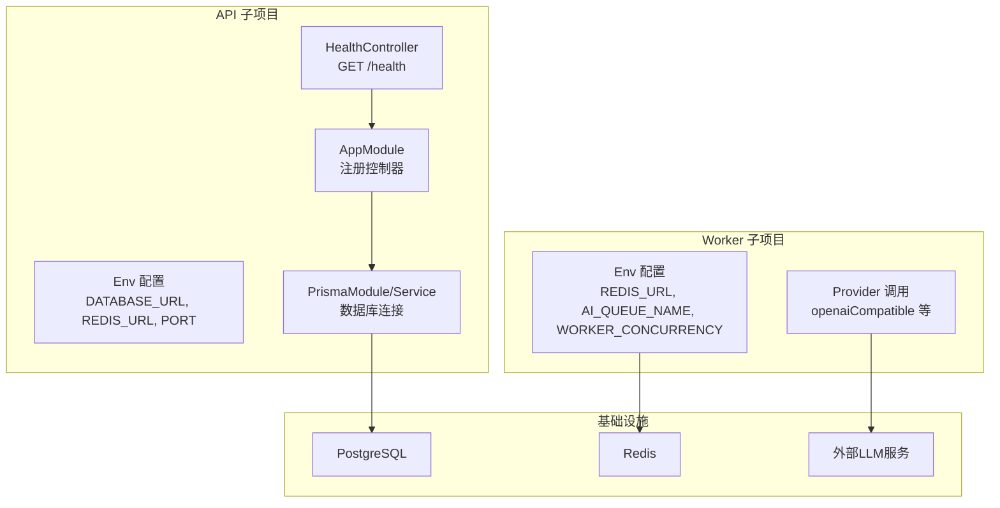
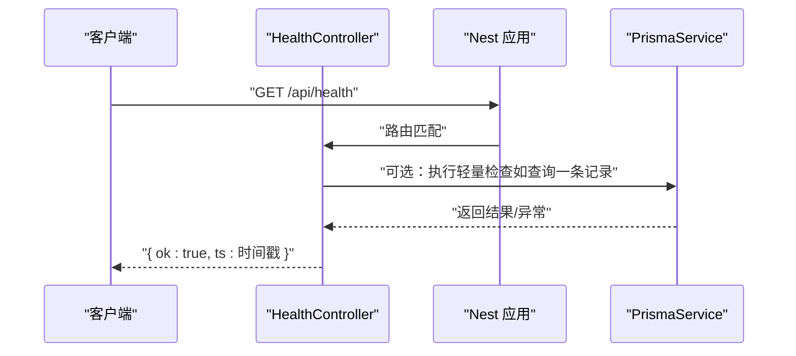
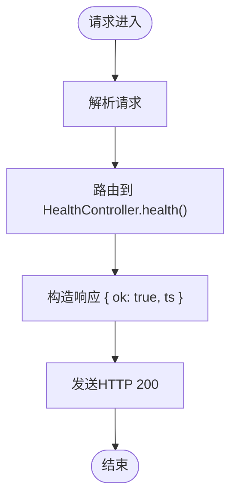
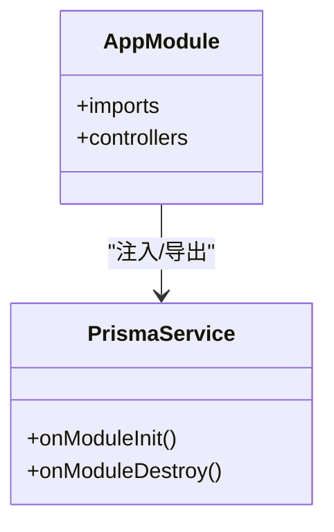
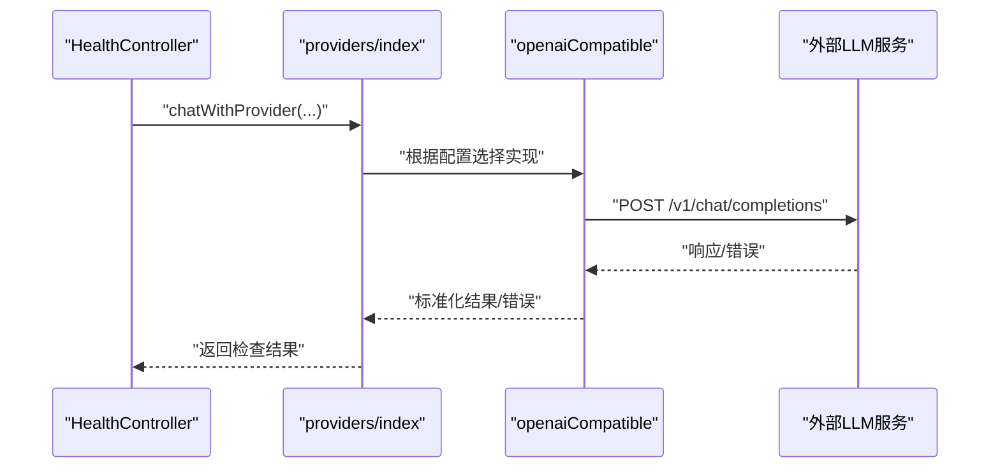
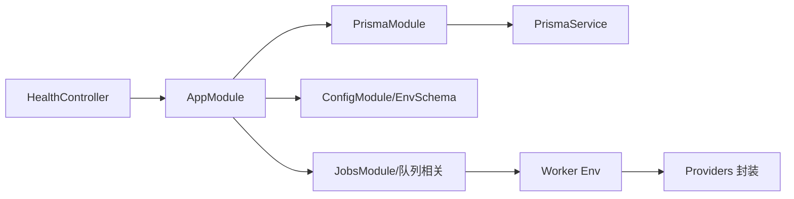

# 健康检查与监控

<cite>
**本文引用的文件**
- [apps/api/src/health/health.controller.ts](file://apps/api/src/health/health.controller.ts)
- [apps/api/src/app.module.ts](file://apps/api/src/app.module.ts)
- [apps/api/src/config/env.ts](file://apps/api/src/config/env.ts)
- [apps/api/src/prisma/prisma.module.ts](file://apps/api/src/prisma/prisma.module.ts)
- [apps/api/src/prisma/prisma.service.ts](file://apps/api/src/prisma/prisma.service.ts)
- [apps/api/src/main.ts](file://apps/api/src/main.ts)
- [apps/api/src/common/all-exceptions.filter.ts](file://apps/api/src/common/all-exceptions.filter.ts)
- [apps/api/package.json](file://apps/api/package.json)
- [apps/worker/src/config/env.ts](file://apps/worker/src/config/env.ts)
- [apps/worker/src/providers/index.ts](file://apps/worker/src/providers/index.ts)
- [apps/worker/src/providers/openaiCompatible.ts](file://apps/worker/src/providers/openaiCompatible.ts)
- [docker-compose.dev.yml](file://docker-compose.dev.yml)
</cite>

## 目录

1. [简介](#简介)
2. [项目结构](#项目结构)
3. [核心组件](#核心组件)
4. [架构总览](#架构总览)
5. [详细组件分析](#详细组件分析)
6. [依赖关系分析](#依赖关系分析)
7. [性能考量](#性能考量)
8. [故障排查指南](#故障排查指南)
9. [结论](#结论)
10. [附录](#附录)

## 简介

本文件面向AIXSSS健康检查与监控模块，聚焦HealthController的健康检查接口实现，涵盖服务状态监控、依赖服务检查与系统指标收集的现状与扩展建议；阐述健康检查的触发机制、检查频率与响应格式；定义监控指标与收集策略（数据库连接、Redis连接、外部服务可用性）；解释告警机制与故障检测策略；并提供最佳实践、性能优化建议以及监控仪表板与告警通知的集成指引。

## 项目结构

- 健康检查接口位于后端API子项目中，控制器暴露根路径下的健康检查端点。
- 应用通过NestJS模块化组织，Prisma用于数据库访问，环境变量控制运行参数。
- 外部服务调用集中在Worker子项目，采用OpenAI兼容协议对接多家大模型供应商。
- 开发环境通过Docker Compose提供PostgreSQL、Redis等基础设施。

图表来源

- [apps/api/src/health/health.controller.ts](file://apps/api/src/health/health.controller.ts#L1-L12)
- [apps/api/src/app.module.ts](file://apps/api/src/app.module.ts#L1-L37)
- [apps/api/src/config/env.ts](file://apps/api/src/config/env.ts#L1-L17)
- [apps/api/src/prisma/prisma.module.ts](file://apps/api/src/prisma/prisma.module.ts#L1-L12)
- [apps/api/src/prisma/prisma.service.ts](file://apps/api/src/prisma/prisma.service.ts#L1-L16)
- [apps/worker/src/config/env.ts](file://apps/worker/src/config/env.ts#L1-L15)
- [apps/worker/src/providers/openaiCompatible.ts](file://apps/worker/src/providers/openaiCompatible.ts#L1-L438)

章节来源

- [apps/api/src/health/health.controller.ts](file://apps/api/src/health/health.controller.ts#L1-L12)
- [apps/api/src/app.module.ts](file://apps/api/src/app.module.ts#L1-L37)
- [apps/api/src/config/env.ts](file://apps/api/src/config/env.ts#L1-L17)
- [apps/api/src/prisma/prisma.module.ts](file://apps/api/src/prisma/prisma.module.ts#L1-L12)
- [apps/api/src/prisma/prisma.service.ts](file://apps/api/src/prisma/prisma.service.ts#L1-L16)
- [apps/worker/src/config/env.ts](file://apps/worker/src/config/env.ts#L1-L15)
- [apps/worker/src/providers/openaiCompatible.ts](file://apps/worker/src/providers/openaiCompatible.ts#L1-L438)
- [docker-compose.dev.yml](file://docker-compose.dev.yml#L1-L35)

## 核心组件

- HealthController：提供基础健康检查接口，返回服务存活与时间戳信息。
- AppModule：注册HealthController，并加载PrismaModule等核心模块。
- PrismaService：负责数据库连接生命周期管理（初始化连接、销毁断开）。
- 环境配置：通过Zod Schema校验，统一读取数据库、Redis、队列等关键参数。
- 异常过滤器：统一错误响应格式，便于监控系统识别异常状态。

章节来源

- [apps/api/src/health/health.controller.ts](file://apps/api/src/health/health.controller.ts#L1-L12)
- [apps/api/src/app.module.ts](file://apps/api/src/app.module.ts#L1-L37)
- [apps/api/src/prisma/prisma.service.ts](file://apps/api/src/prisma/prisma.service.ts#L1-L16)
- [apps/api/src/config/env.ts](file://apps/api/src/config/env.ts#L1-L17)
- [apps/api/src/common/all-exceptions.filter.ts](file://apps/api/src/common/all-exceptions.filter.ts#L1-L91)

## 架构总览

健康检查与监控涉及三层：

- 接口层：HealthController对外提供健康检查端点。
- 业务/数据层：PrismaService负责数据库连接；Worker侧通过Provider调用外部服务。
- 基础设施层：PostgreSQL、Redis、外部LLM服务。

图表来源

- [apps/api/src/health/health.controller.ts](file://apps/api/src/health/health.controller.ts#L1-L12)
- [apps/api/src/prisma/prisma.service.ts](file://apps/api/src/prisma/prisma.service.ts#L1-L16)
- [apps/api/src/main.ts](file://apps/api/src/main.ts#L1-L34)

## 详细组件分析

### HealthController 健康检查接口

- 接口路径：/api/health（全局前缀为api）
- 方法：GET
- 响应：包含布尔状态与毫秒级时间戳，便于探针快速判断服务存活与时间同步。
- 触发机制：由Kubernetes、云平台或自建探针定时轮询该端点。
- 检查频率：建议根据SLA设定，如每10-30秒一次；对生产环境可结合负载与延迟动态调整。
- 扩展建议：在当前实现基础上增加数据库连通性检查、Redis可用性检查、外部服务可达性检查等。

图表来源

- [apps/api/src/health/health.controller.ts](file://apps/api/src/health/health.controller.ts#L1-L12)
- [apps/api/src/main.ts](file://apps/api/src/main.ts#L1-L34)

章节来源

- [apps/api/src/health/health.controller.ts](file://apps/api/src/health/health.controller.ts#L1-L12)
- [apps/api/src/main.ts](file://apps/api/src/main.ts#L1-L34)

### 数据库连接状态检查（Prisma）

- 连接建立：PrismaService在模块初始化阶段执行连接；销毁阶段执行断开。
- 健康检查策略：可在HealthController中增加一次轻量查询（如查询系统表或版本），以验证连接可用性。
- 性能影响：避免在健康检查中执行复杂查询；若需深度检查，可考虑异步或降级策略。

图表来源

- [apps/api/src/prisma/prisma.module.ts](file://apps/api/src/prisma/prisma.module.ts#L1-L12)
- [apps/api/src/prisma/prisma.service.ts](file://apps/api/src/prisma/prisma.service.ts#L1-L16)
- [apps/api/src/app.module.ts](file://apps/api/src/app.module.ts#L1-L37)

章节来源

- [apps/api/src/prisma/prisma.module.ts](file://apps/api/src/prisma/prisma.module.ts#L1-L12)
- [apps/api/src/prisma/prisma.service.ts](file://apps/api/src/prisma/prisma.service.ts#L1-L16)
- [apps/api/src/app.module.ts](file://apps/api/src/app.module.ts#L1-L37)

### Redis 连接状态检查

- 配置来源：API与Worker均通过环境变量配置Redis地址。
- 健康检查策略：在HealthController中增加一次PING或获取键值的轻量操作，验证连接与基本可用性。
- 注意事项：避免在高并发下频繁执行昂贵命令；可缓存连接实例并在检查前复用。

章节来源

- [apps/api/src/config/env.ts](file://apps/api/src/config/env.ts#L1-L17)
- [apps/worker/src/config/env.ts](file://apps/worker/src/config/env.ts#L1-L15)

### 外部服务可用性检查（LLM Provider）

- 调用链路：Worker通过Provider封装不同供应商（OpenAI兼容、Doubao Ark、Gemini）。
- 健康检查策略：在HealthController中增加一次短超时的轻量请求（如最小消息长度的对话），验证外部服务可达与鉴权有效。
- 超时与错误处理：参考openaiCompatible实现中的超时控制与错误归一化，确保健康检查不会被上游不稳定阻塞。

图表来源

- [apps/worker/src/providers/index.ts](file://apps/worker/src/providers/index.ts#L1-L44)
- [apps/worker/src/providers/openaiCompatible.ts](file://apps/worker/src/providers/openaiCompatible.ts#L1-L438)

章节来源

- [apps/worker/src/providers/index.ts](file://apps/worker/src/providers/index.ts#L1-L44)
- [apps/worker/src/providers/openaiCompatible.ts](file://apps/worker/src/providers/openaiCompatible.ts#L1-L438)

### 告警机制与故障检测策略

- 告警维度建议：
  - 服务不可达：连续N次健康检查失败触发告警。
  - 响应超时：健康检查耗时超过阈值触发告警。
  - 数据库/Redis不可用：检查失败或连接异常触发告警。
  - 外部服务错误率：基于Worker侧错误统计触发告警。
- 故障检测策略：
  - 指数退避重试：对临时性错误进行有限次数重试。
  - 分级降级：在外部服务不可用时返回“服务降级”状态，避免级联故障。
  - 多活探测：对多个上游实例进行并行探测，提升准确性。

章节来源

- [apps/api/src/common/all-exceptions.filter.ts](file://apps/api/src/common/all-exceptions.filter.ts#L1-L91)
- [apps/worker/src/providers/openaiCompatible.ts](file://apps/worker/src/providers/openaiCompatible.ts#L1-L438)

## 依赖关系分析

- HealthController依赖NestJS控制器装饰器与AppModule注册。
- AppModule依赖PrismaModule、AuthModule、JobsModule等，PrismaModule提供PrismaService。
- 环境配置由ConfigModule与Zod Schema校验，统一从进程环境读取。
- Worker侧通过Provider封装外部服务调用，与API侧解耦。

图表来源

- [apps/api/src/health/health.controller.ts](file://apps/api/src/health/health.controller.ts#L1-L12)
- [apps/api/src/app.module.ts](file://apps/api/src/app.module.ts#L1-L37)
- [apps/api/src/config/env.ts](file://apps/api/src/config/env.ts#L1-L17)
- [apps/api/src/prisma/prisma.module.ts](file://apps/api/src/prisma/prisma.module.ts#L1-L12)
- [apps/api/src/prisma/prisma.service.ts](file://apps/api/src/prisma/prisma.service.ts#L1-L16)
- [apps/worker/src/config/env.ts](file://apps/worker/src/config/env.ts#L1-L15)
- [apps/worker/src/providers/index.ts](file://apps/worker/src/providers/index.ts#L1-L44)

章节来源

- [apps/api/src/health/health.controller.ts](file://apps/api/src/health/health.controller.ts#L1-L12)
- [apps/api/src/app.module.ts](file://apps/api/src/app.module.ts#L1-L37)
- [apps/api/src/config/env.ts](file://apps/api/src/config/env.ts#L1-L17)
- [apps/api/src/prisma/prisma.module.ts](file://apps/api/src/prisma/prisma.module.ts#L1-L12)
- [apps/api/src/prisma/prisma.service.ts](file://apps/api/src/prisma/prisma.service.ts#L1-L16)
- [apps/worker/src/config/env.ts](file://apps/worker/src/config/env.ts#L1-L15)
- [apps/worker/src/providers/index.ts](file://apps/worker/src/providers/index.ts#L1-L44)

## 性能考量

- 健康检查应保持极低延迟：避免复杂查询与外部调用；必要时仅做PING或最小代价检查。
- 并发与资源：在高并发场景下，避免在健康检查中创建新连接或执行阻塞操作。
- 超时设置：为外部服务检查设置合理超时，防止探针被拖慢。
- 缓存与复用：复用数据库与Redis连接，减少握手成本。
- 日志与采样：对异常进行采样记录，避免日志风暴影响性能。

## 故障排查指南

- 健康检查返回非200：
  - 检查Nest应用是否正常启动（端口、CORS、全局前缀）。
  - 查看异常过滤器输出的错误体，定位具体异常类型与请求ID。
- 数据库不可用：
  - 检查DATABASE_URL与数据库实例状态；确认PrismaService已成功连接。
- Redis不可用：
  - 检查REDIS_URL与实例状态；确认Worker与API侧配置一致。
- 外部服务错误：
  - 检查AI_REQUEST_TIMEOUT_MS、供应商鉴权与网络连通性；参考openaiCompatible的错误归一化逻辑。

章节来源

- [apps/api/src/common/all-exceptions.filter.ts](file://apps/api/src/common/all-exceptions.filter.ts#L1-L91)
- [apps/api/src/main.ts](file://apps/api/src/main.ts#L1-L34)
- [apps/api/src/prisma/prisma.service.ts](file://apps/api/src/prisma/prisma.service.ts#L1-L16)
- [apps/worker/src/providers/openaiCompatible.ts](file://apps/worker/src/providers/openaiCompatible.ts#L1-L438)

## 结论

当前HealthController提供基础健康检查能力，建议在此基础上扩展数据库、Redis与外部服务的可用性检查，并完善告警与故障检测策略。通过合理的超时、降级与采样机制，可显著提升系统的可观测性与稳定性。

## 附录

### 健康检查接口定义

- 路径：/api/health
- 方法：GET
- 成功响应：包含布尔状态与时间戳
- 失败响应：由异常过滤器统一返回标准错误体

章节来源

- [apps/api/src/health/health.controller.ts](file://apps/api/src/health/health.controller.ts#L1-L12)
- [apps/api/src/common/all-exceptions.filter.ts](file://apps/api/src/common/all-exceptions.filter.ts#L1-L91)
- [apps/api/src/main.ts](file://apps/api/src/main.ts#L1-L34)

### 监控指标与收集策略

- 数据库连接：轻量查询（如SELECT 1），周期性采样
- Redis连接：PING或GET操作，周期性采样
- 外部服务可用性：短超时轻量请求，统计成功率与错误率
- 系统指标：CPU、内存、磁盘、网络I/O（由平台或探针采集）

### 告警通知配置指南

- 告警规则：失败次数阈值、响应时间阈值、错误率阈值
- 通知渠道：邮件、IM、电话（按级别分级）
- 集成方式：Prometheus/Grafana、云监控平台或自建APM

### 最佳实践

- 健康检查无副作用：不写入数据、不执行长事务
- 超时与重试：合理设置超时与有限重试
- 分级降级：在外部依赖不可用时返回可区分的状态
- 采样与聚合：对高频探针进行采样与聚合上报
