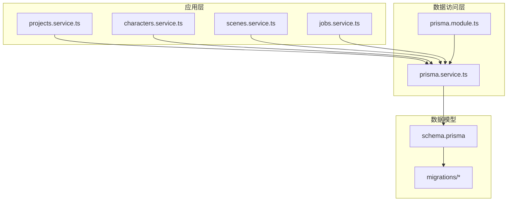
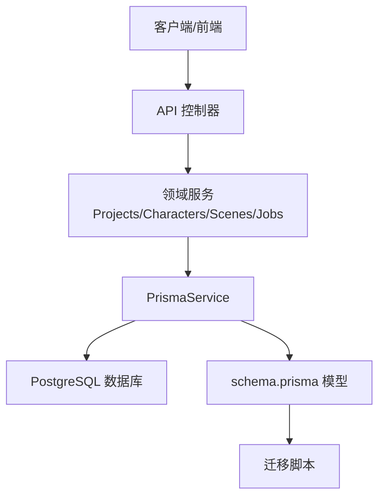
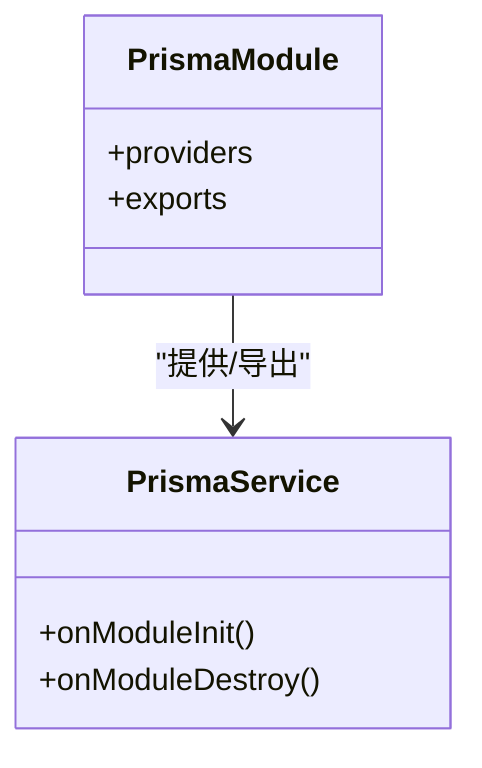
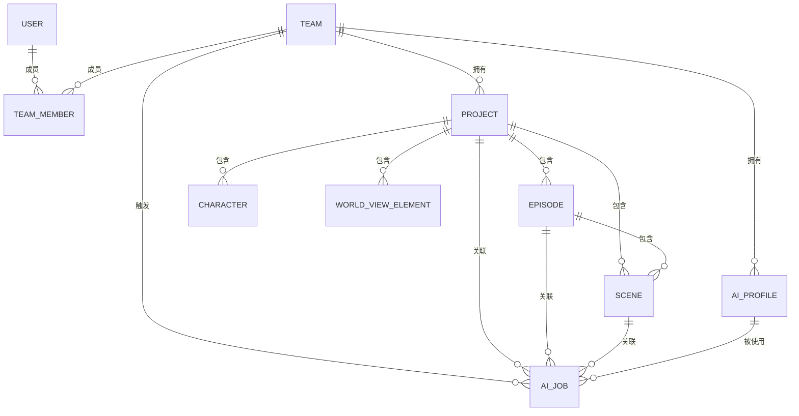
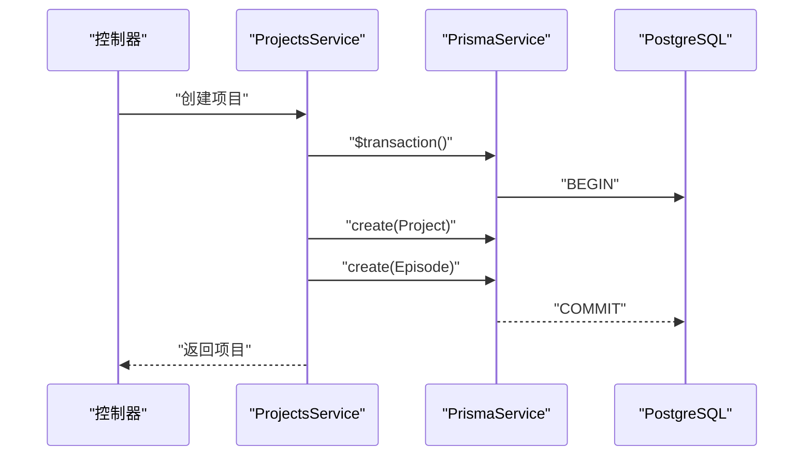
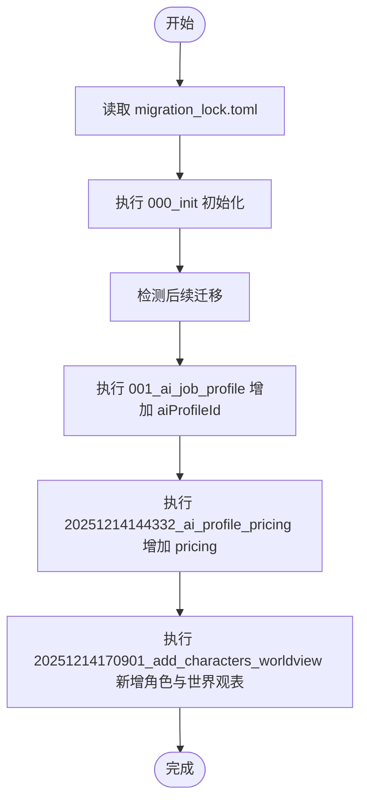
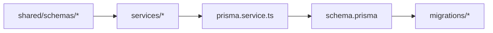

# 数据模型

<cite>
**本文引用的文件**
- [apps/api/prisma/schema.prisma](file://apps/api/prisma/schema.prisma)
- [apps/api/prisma/migrations/migration_lock.toml](file://apps/api/prisma/migrations/migration_lock.toml)
- [apps/api/prisma/migrations/000_init/migration.sql](file://apps/api/prisma/migrations/000_init/migration.sql)
- [apps/api/prisma/migrations/001_ai_job_profile/migration.sql](file://apps/api/prisma/migrations/001_ai_job_profile/migration.sql)
- [apps/api/prisma/migrations/20251214144332_ai_profile_pricing/migration.sql](file://apps/api/prisma/migrations/20251214144332_ai_profile_pricing/migration.sql)
- [apps/api/prisma/migrations/20251214170901_add_characters_worldview/migration.sql](file://apps/api/prisma/migrations/20251214170901_add_characters_worldview/migration.sql)
- [apps/api/src/prisma/prisma.service.ts](file://apps/api/src/prisma/prisma.service.ts)
- [apps/api/src/prisma/prisma.module.ts](file://apps/api/src/prisma/prisma.module.ts)
- [apps/api/src/projects/projects.service.ts](file://apps/api/src/projects/projects.service.ts)
- [apps/api/src/characters/characters.service.ts](file://apps/api/src/characters/characters.service.ts)
- [apps/api/src/scenes/scenes.service.ts](file://apps/api/src/scenes/scenes.service.ts)
- [apps/api/src/jobs/jobs.service.ts](file://apps/api/src/jobs/jobs.service.ts)
- [packages/shared/src/schemas/project.ts](file://packages/shared/src/schemas/project.ts)
- [packages/shared/src/schemas/character.ts](file://packages/shared/src/schemas/character.ts)
- [packages/shared/src/schemas/scene.ts](file://packages/shared/src/schemas/scene.ts)
- [packages/shared/src/schemas/aiProfile.ts](file://packages/shared/src/schemas/aiProfile.ts)
</cite>

## 目录

1. [简介](#简介)
2. [项目结构](#项目结构)
3. [核心组件](#核心组件)
4. [架构总览](#架构总览)
5. [详细组件分析](#详细组件分析)
6. [依赖分析](#依赖分析)
7. [性能考虑](#性能考虑)
8. [故障排查指南](#故障排查指南)
9. [结论](#结论)
10. [附录](#附录)

## 简介

本文件面向AIXSSS的数据模型与Prisma ORM实践，系统性说明数据库连接、模型定义、关系映射、迁移管理、版本控制与演进策略，并结合服务层封装与查询优化给出可操作建议。重点覆盖以下核心模型：Project（项目）、Character（角色）、Scene（场景）、AIJob（AI任务），并解释PrismaService服务封装与数据库操作接口。

## 项目结构

围绕数据模型的关键目录与文件如下：

- Prisma定义与迁移
  - schema.prisma：模型定义、枚举、索引与关系
  - migrations/\*：历史迁移脚本与锁文件
- 应用层服务
  - prisma.module.ts、prisma.service.ts：Prisma客户端封装与注入
  - projects.service.ts、characters.service.ts、scenes.service.ts、jobs.service.ts：各领域服务对Prisma的调用示例
- 数据验证
  - shared包中各Schema：输入参数的Zod校验规则

**图表来源**

- [apps/api/src/prisma/prisma.module.ts](file://apps/api/src/prisma/prisma.module.ts#L1-L12)
- [apps/api/src/prisma/prisma.service.ts](file://apps/api/src/prisma/prisma.service.ts#L1-L16)
- [apps/api/prisma/schema.prisma](file://apps/api/prisma/schema.prisma#L1-L351)
- [apps/api/prisma/migrations/000_init/migration.sql](file://apps/api/prisma/migrations/000_init/migration.sql#L1-L202)

**章节来源**

- [apps/api/src/prisma/prisma.module.ts](file://apps/api/src/prisma/prisma.module.ts#L1-L12)
- [apps/api/src/prisma/prisma.service.ts](file://apps/api/src/prisma/prisma.service.ts#L1-L16)
- [apps/api/prisma/schema.prisma](file://apps/api/prisma/schema.prisma#L1-L351)

## 核心组件

- PrismaService：继承PrismaClient，实现OnModuleInit/OnModuleDestroy生命周期钩子，负责连接与断开数据库
- PrismaModule：全局模块，向整个应用提供PrismaService单例
- 服务层：ProjectsService、CharactersService、ScenesService、JobsService通过PrismaService执行CRUD与事务

典型职责划分：

- PrismaService：连接生命周期管理
- PrismaModule：依赖注入入口
- 业务服务：封装查询、事务、跨表关联与结果映射

**章节来源**

- [apps/api/src/prisma/prisma.service.ts](file://apps/api/src/prisma/prisma.service.ts#L1-L16)
- [apps/api/src/prisma/prisma.module.ts](file://apps/api/src/prisma/prisma.module.ts#L1-L12)
- [apps/api/src/projects/projects.service.ts](file://apps/api/src/projects/projects.service.ts#L1-L215)
- [apps/api/src/characters/characters.service.ts](file://apps/api/src/characters/characters.service.ts#L1-L118)
- [apps/api/src/scenes/scenes.service.ts](file://apps/api/src/scenes/scenes.service.ts#L1-L365)
- [apps/api/src/jobs/jobs.service.ts](file://apps/api/src/jobs/jobs.service.ts#L1-L1055)

## 架构总览

下图展示Prisma在应用中的位置与交互：

**图表来源**

- [apps/api/src/prisma/prisma.service.ts](file://apps/api/src/prisma/prisma.service.ts#L1-L16)
- [apps/api/prisma/schema.prisma](file://apps/api/prisma/schema.prisma#L1-L351)
- [apps/api/prisma/migrations/000_init/migration.sql](file://apps/api/prisma/migrations/000_init/migration.sql#L1-L202)

## 详细组件分析

### Prisma ORM 配置与使用

- 数据源与生成器
  - provider为postgresql，连接字符串来自环境变量
  - 生成器client指向prisma-client-js
- 生命周期管理
  - onModuleInit中调用$connect建立连接
  - onModuleDestroy中调用$disconnect断开连接
- 注入方式
  - 全局模块导出PrismaService，业务服务通过@Inject注入使用

**图表来源**

- [apps/api/src/prisma/prisma.service.ts](file://apps/api/src/prisma/prisma.service.ts#L1-L16)
- [apps/api/src/prisma/prisma.module.ts](file://apps/api/src/prisma/prisma.module.ts#L1-L12)

**章节来源**

- [apps/api/src/prisma/prisma.service.ts](file://apps/api/src/prisma/prisma.service.ts#L1-L16)
- [apps/api/src/prisma/prisma.module.ts](file://apps/api/src/prisma/prisma.module.ts#L1-L12)

### schema.prisma 实体关系设计

- 数据库连接
  - datasource db 使用postgresql，url取自环境变量
- 核心模型与关系
  - User、Team、TeamMember：团队成员与归属
  - Project：属于Team，包含工作流状态、当前场景序号与步骤
  - Episode：属于Project，有序集合
  - Scene：属于Project与Episode，包含状态、JSON字段与多模态输出
  - Character：属于Project
  - WorldViewElement：属于Project
  - AIProfile：属于Team，支持定价JSON
  - AuditLog：审计日志
  - AIJob：属于Team/Project/Episode/Scene/AIProfile，记录任务状态与重试
  - SystemPrompt：团队级系统提示词
- 枚举
  - TeamRole、ProjectWorkflowState、EpisodeWorkflowState、SceneStatus、ProviderType、AIJobStatus、NarrativeCausalChainVersionSource
- 索引与唯一约束
  - 多处复合索引与唯一索引，如Project(teamId, updatedAt)，Scene(projectId, order)等
- 外键与级联
  - 多处onDelete=Cascade或SetNull，确保数据一致性

**图表来源**

- [apps/api/prisma/schema.prisma](file://apps/api/prisma/schema.prisma#L75-L350)

**章节来源**

- [apps/api/prisma/schema.prisma](file://apps/api/prisma/schema.prisma#L1-L351)

### 数据模型字段与约束要点

- Project
  - 工作流状态：默认值、业务流程驱动
  - 当前场景序号与步骤：用于流程推进
  - JSON缓存：上下文缓存
- Episode
  - 有序集合：基于projectId+order唯一
  - 核心表达式JSON：用于内容规划
- Scene
  - 状态枚举：pending到completed全链路
  - JSON字段：generatedImages、generatedVideos、storyboard相关、dialogues、contextSummary等
  - castCharacterIds数组：关联角色
- Character
  - 多个文本与JSON字段：外观、个性、背景、关系、外观片段等
  - 颜色主题字段：主题色、主次色
- AIProfile
  - provider、model、baseURL、加密密钥、生成参数、pricing(JSON)
- AIJob
  - 类型、状态、尝试次数、错误、结果JSON、时间戳
  - 可关联Project/Episode/Scene/AIProfile
- SystemPrompt
  - key唯一、内容、是否定制化

**章节来源**

- [apps/api/prisma/schema.prisma](file://apps/api/prisma/schema.prisma#L116-L350)

### PrismaService 封装与数据库操作接口

- 连接管理
  - 在NestJS模块初始化时建立连接，在销毁时断开
- 服务层调用模式
  - 通过@Inject注入PrismaService
  - 使用prisma.model进行查询、更新、删除、计数与事务
  - 结果映射：统一将Date转为ISO字符串，便于API传输
- 事务示例
  - 创建项目时同时创建默认集（Episode）

**图表来源**

- [apps/api/src/projects/projects.service.ts](file://apps/api/src/projects/projects.service.ts#L112-L139)

**章节来源**

- [apps/api/src/projects/projects.service.ts](file://apps/api/src/projects/projects.service.ts#L1-L215)
- [apps/api/src/characters/characters.service.ts](file://apps/api/src/characters/characters.service.ts#L1-L118)
- [apps/api/src/scenes/scenes.service.ts](file://apps/api/src/scenes/scenes.service.ts#L1-L365)
- [apps/api/src/jobs/jobs.service.ts](file://apps/api/src/jobs/jobs.service.ts#L1-L1055)

### 数据迁移管理、版本控制与演进策略

- 迁移锁
  - migration_lock.toml锁定迁移提供者与数据库类型
- 初始迁移
  - 000_init：创建枚举、表、索引、外键
- 后续演进
  - 001_ai_job_profile：为AIJob增加aiProfileId并建外键
  - 20251214144332_ai_profile_pricing：为AIProfile增加pricing JSON列
  - 20251214170901_add_characters_worldview：新增Character与WorldViewElement表及索引、外键
- 演进原则
  - 新增列采用可选JSON字段承载扩展数据
  - 通过外键与索引保证引用完整性与查询效率
  - 通过migration_lock避免并发破坏

**图表来源**

- [apps/api/prisma/migrations/migration_lock.toml](file://apps/api/prisma/migrations/migration_lock.toml#L1-L4)
- [apps/api/prisma/migrations/000_init/migration.sql](file://apps/api/prisma/migrations/000_init/migration.sql#L1-L202)
- [apps/api/prisma/migrations/001_ai_job_profile/migration.sql](file://apps/api/prisma/migrations/001_ai_job_profile/migration.sql#L1-L11)
- [apps/api/prisma/migrations/20251214144332_ai_profile_pricing/migration.sql](file://apps/api/prisma/migrations/20251214144332_ai_profile_pricing/migration.sql#L1-L3)
- [apps/api/prisma/migrations/20251214170901_add_characters_worldview/migration.sql](file://apps/api/prisma/migrations/20251214170901_add_characters_worldview/migration.sql#L1-L52)

**章节来源**

- [apps/api/prisma/migrations/migration_lock.toml](file://apps/api/prisma/migrations/migration_lock.toml#L1-L4)
- [apps/api/prisma/migrations/000_init/migration.sql](file://apps/api/prisma/migrations/000_init/migration.sql#L1-L202)
- [apps/api/prisma/migrations/001_ai_job_profile/migration.sql](file://apps/api/prisma/migrations/001_ai_job_profile/migration.sql#L1-L11)
- [apps/api/prisma/migrations/20251214144332_ai_profile_pricing/migration.sql](file://apps/api/prisma/migrations/20251214144332_ai_profile_pricing/migration.sql#L1-L3)
- [apps/api/prisma/migrations/20251214170901_add_characters_worldview/migration.sql](file://apps/api/prisma/migrations/20251214170901_add_characters_worldview/migration.sql#L1-L52)

### 数据访问模式、查询优化与性能考虑

- 查询模式
  - 单表查询：findMany/findFirst/orderBy/where
  - 聚合与计数：\_count、count
  - 事务：$transaction包裹多表写入
- 性能优化建议
  - 为高频过滤字段建立复合索引（如Project(teamId, updatedAt)、Scene(projectId, order)）
  - 使用select仅返回必要字段，减少网络与序列化开销
  - 对JSON字段的查询尽量避免在WHERE中做复杂计算，必要时在应用层处理
  - 批量统计使用Promise.all并行化，降低总延迟
- 错误处理
  - NotFound异常用于资源不存在
  - BadRequest异常用于参数范围校验（如目标剧集数量范围）

**章节来源**

- [apps/api/src/projects/projects.service.ts](file://apps/api/src/projects/projects.service.ts#L55-L102)
- [apps/api/src/scenes/scenes.service.ts](file://apps/api/src/scenes/scenes.service.ts#L69-L85)
- [apps/api/src/jobs/jobs.service.ts](file://apps/api/src/jobs/jobs.service.ts#L101-L149)

### 数据验证规则与业务逻辑约束

- 输入校验（Zod）
  - Project：标题长度、摘要/风格/主角最大长度、ID格式与可选性
  - Character：名称长度、多字段最大长度、颜色字段长度限制
  - Scene：顺序非负整数、多字段最大长度、生成内容结构校验
  - AIProfile：提供商枚举、模型名长度、温度/采样等参数范围、定价结构
- 业务约束
  - Scene.castCharacterIds为字符串数组，用于关联角色
  - Project.workflowState与currentSceneOrder/currentSceneStep驱动流程推进
  - AIJob.aiProfileId可为空，表示未绑定特定配置
  - SystemPrompt.key在teamId维度唯一

**章节来源**

- [packages/shared/src/schemas/project.ts](file://packages/shared/src/schemas/project.ts#L1-L33)
- [packages/shared/src/schemas/character.ts](file://packages/shared/src/schemas/character.ts#L1-L32)
- [packages/shared/src/schemas/scene.ts](file://packages/shared/src/schemas/scene.ts#L1-L56)
- [packages/shared/src/schemas/aiProfile.ts](file://packages/shared/src/schemas/aiProfile.ts#L1-L51)

## 依赖分析

- 组件耦合
  - 服务层强依赖PrismaService，弱依赖共享Schema（输入校验）
  - PrismaService与schema.prisma强耦合，迁移脚本决定底层表结构
- 外部依赖
  - PostgreSQL作为数据存储
  - BullMQ用于异步队列（与AIJob配合）
- 循环依赖
  - 无直接循环依赖，模块化清晰

**图表来源**

- [apps/api/src/prisma/prisma.service.ts](file://apps/api/src/prisma/prisma.service.ts#L1-L16)
- [apps/api/prisma/schema.prisma](file://apps/api/prisma/schema.prisma#L1-L351)
- [packages/shared/src/schemas/project.ts](file://packages/shared/src/schemas/project.ts#L1-L33)

**章节来源**

- [apps/api/src/prisma/prisma.service.ts](file://apps/api/src/prisma/prisma.service.ts#L1-L16)
- [apps/api/prisma/schema.prisma](file://apps/api/prisma/schema.prisma#L1-L351)
- [packages/shared/src/schemas/project.ts](file://packages/shared/src/schemas/project.ts#L1-L33)

## 性能考虑

- 索引策略
  - 优先为过滤与排序字段建立复合索引（如teamId+updatedAt）
  - 为唯一约束字段建立唯一索引（如projectId+order）
- 查询优化
  - 使用select裁剪字段
  - 使用事务减少往返
  - 并行统计与批量查询
- 存储与序列化
  - JSON字段仅在需要时加载，避免不必要的序列化
- 缓存与队列
  - AIJob通过队列异步执行，Prisma仅持久化状态

[本节为通用指导，无需列出具体文件来源]

## 故障排查指南

- 连接问题
  - 检查DATABASE_URL环境变量
  - 确认PrismaService在模块初始化时已连接
- 迁移问题
  - 检查migration_lock.toml与数据库类型匹配
  - 确认迁移脚本顺序正确且无冲突
- 约束冲突
  - 外键错误：确认关联实体存在且未被级联删除
  - 唯一约束：检查唯一索引冲突（如Scene的projectId+order）
- 查询异常
  - NotFound：确认teamId与资源ID匹配
  - 参数范围：如目标剧集数量超出范围需调整

**章节来源**

- [apps/api/src/jobs/jobs.service.ts](file://apps/api/src/jobs/jobs.service.ts#L112-L114)
- [apps/api/prisma/migrations/migration_lock.toml](file://apps/api/prisma/migrations/migration_lock.toml#L1-L4)

## 结论

本数据模型以Prisma为核心，通过明确的实体关系、合理的索引与迁移策略，支撑从项目、角色、场景到AI任务的全流程创作管线。服务层以PrismaService为统一入口，结合Zod输入校验与事务封装，既保证了数据一致性，也为后续扩展提供了稳定基座。

## 附录

- 常用查询模式
  - 列表：where + orderBy + select
  - 统计：\_count、count
  - 事务：$transaction包裹多表写入
- 字段与索引清单（摘录）
  - Project(teamId, updatedAt)、Scene(projectId, order)、AIJob(teamId, createdAt)、SystemPrompt(teamId, key)等

[本节为概览性内容，无需列出具体文件来源]
