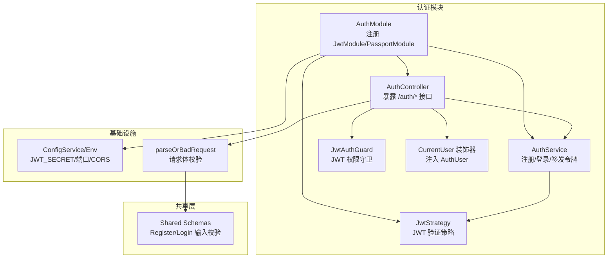
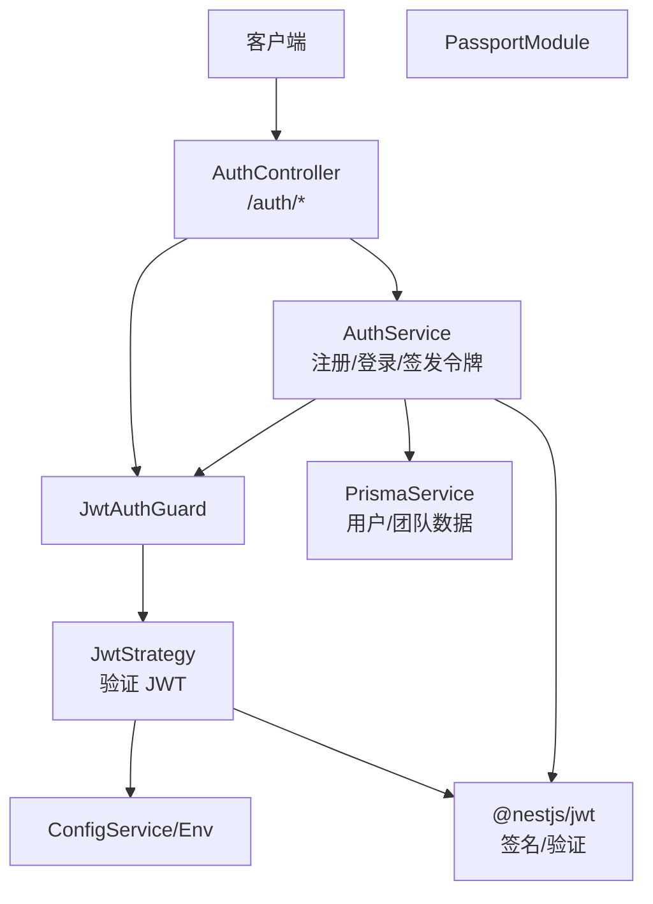
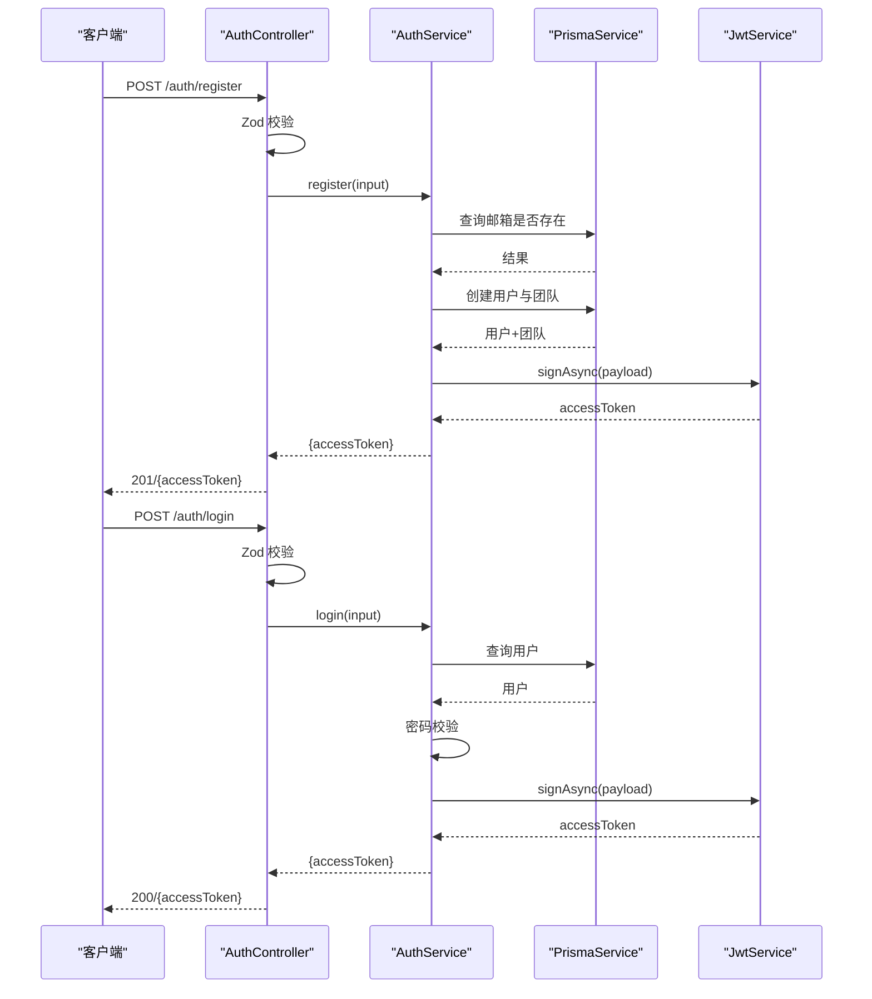
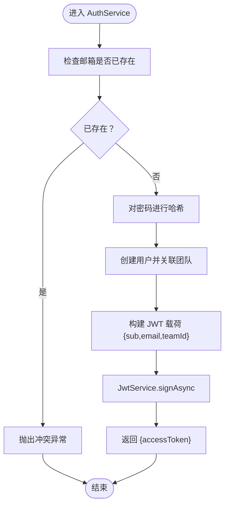
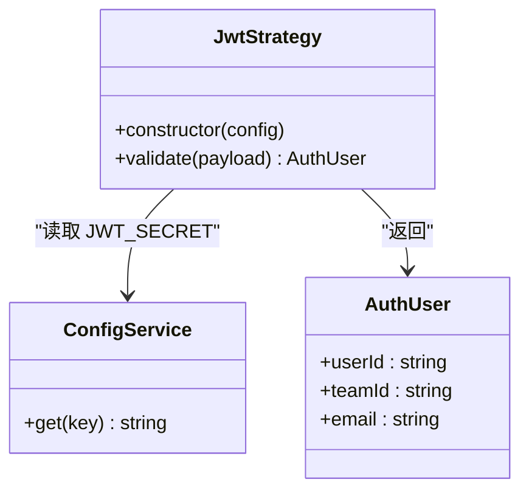
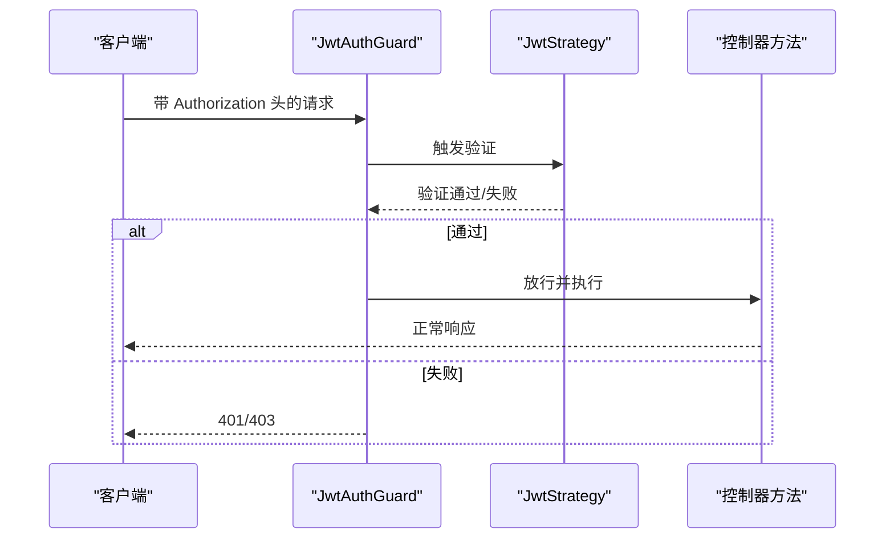
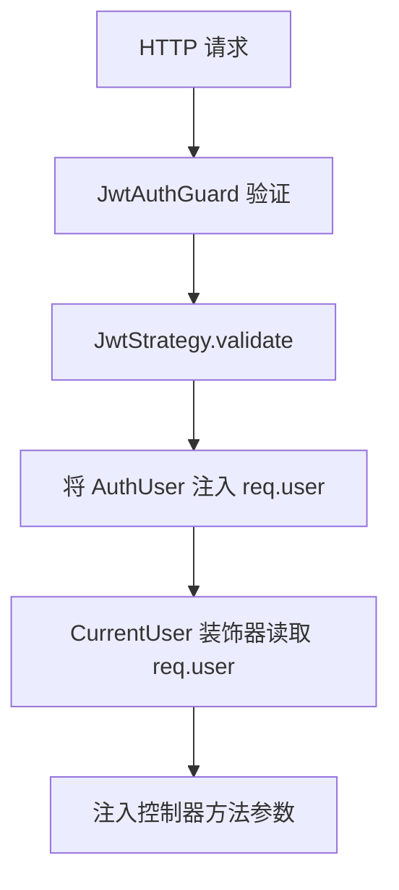
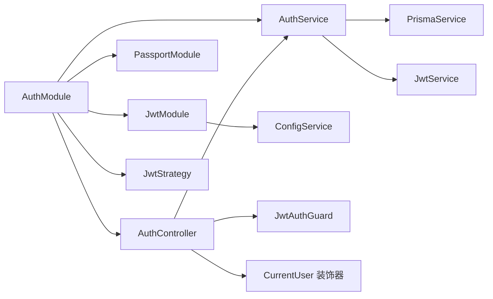

# 认证授权模块

<cite>
**本文引用的文件**
- [apps/api/src/auth/auth.controller.ts](file://apps/api/src/auth/auth.controller.ts)
- [apps/api/src/auth/auth.service.ts](file://apps/api/src/auth/auth.service.ts)
- [apps/api/src/auth/auth.types.ts](file://apps/api/src/auth/auth.types.ts)
- [apps/api/src/auth/jwt.strategy.ts](file://apps/api/src/auth/jwt.strategy.ts)
- [apps/api/src/auth/jwt-auth.guard.ts](file://apps/api/src/auth/jwt-auth.guard.ts)
- [apps/api/src/auth/current-user.decorator.ts](file://apps/api/src/auth/current-user.decorator.ts)
- [apps/api/src/auth/auth.module.ts](file://apps/api/src/auth/auth.module.ts)
- [apps/api/src/config/env.ts](file://apps/api/src/config/env.ts)
- [apps/api/src/common/zod.ts](file://apps/api/src/common/zod.ts)
- [apps/api/src/app.module.ts](file://apps/api/src/app.module.ts)
- [apps/api/src/main.ts](file://apps/api/src/main.ts)
- [packages/shared/src/schemas/auth.ts](file://packages/shared/src/schemas/auth.ts)
</cite>

## 目录

1. [简介](#简介)
2. [项目结构](#项目结构)
3. [核心组件](#核心组件)
4. [架构总览](#架构总览)
5. [详细组件分析](#详细组件分析)
6. [依赖关系分析](#依赖关系分析)
7. [性能考量](#性能考量)
8. [故障排查指南](#故障排查指南)
9. [结论](#结论)
10. [附录](#附录)

## 简介

本文件为 AIXSSS 认证授权模块的技术文档，聚焦于基于 JWT 的认证与授权实现，涵盖以下主题：

- JWT 策略配置与令牌签发/验证流程
- AuthController 的 API 接口设计（登录、注册、获取当前用户）
- JwtAuthGuard 守卫的权限控制与路由保护策略
- CurrentUser 装饰器的用户信息提取与注入机制
- AuthTypes 中的类型定义与接口规范
- 安全考虑与最佳实践
- 完整的 API 使用示例与错误处理策略

## 项目结构

认证授权模块位于后端应用的 auth 子目录中，采用按功能分层的组织方式：控制器负责暴露 REST 接口；服务层封装业务逻辑；守卫与策略用于权限控制；装饰器用于参数解析；模块集中管理依赖注入与配置。

图表来源

- [apps/api/src/auth/auth.controller.ts](file://apps/api/src/auth/auth.controller.ts#L1-L33)
- [apps/api/src/auth/auth.service.ts](file://apps/api/src/auth/auth.service.ts#L1-L77)
- [apps/api/src/auth/jwt-auth.guard.ts](file://apps/api/src/auth/jwt-auth.guard.ts#L1-L8)
- [apps/api/src/auth/current-user.decorator.ts](file://apps/api/src/auth/current-user.decorator.ts#L1-L10)
- [apps/api/src/auth/jwt.strategy.ts](file://apps/api/src/auth/jwt.strategy.ts#L1-L34)
- [apps/api/src/auth/auth.module.ts](file://apps/api/src/auth/auth.module.ts#L1-L30)
- [apps/api/src/common/zod.ts](file://apps/api/src/common/zod.ts#L1-L16)
- [packages/shared/src/schemas/auth.ts](file://packages/shared/src/schemas/auth.ts#L1-L19)
- [apps/api/src/config/env.ts](file://apps/api/src/config/env.ts#L1-L17)

章节来源

- [apps/api/src/auth/auth.controller.ts](file://apps/api/src/auth/auth.controller.ts#L1-L33)
- [apps/api/src/auth/auth.module.ts](file://apps/api/src/auth/auth.module.ts#L1-L30)
- [apps/api/src/app.module.ts](file://apps/api/src/app.module.ts#L1-L37)

## 核心组件

- AuthController：对外暴露 /auth/register、/auth/login、/auth/me 三个接口，分别用于注册、登录与获取当前用户信息。
- AuthService：实现注册与登录逻辑，负责密码哈希、数据库查询、团队关联以及 JWT 令牌签发。
- JwtStrategy：基于 passport-jwt 的策略，从 Authorization 头中提取 Bearer Token 并验证签名，返回 AuthUser。
- JwtAuthGuard：基于 Passport 的守卫，拦截受保护路由，触发 JwtStrategy 进行鉴权。
- CurrentUser 装饰器：从请求对象中提取已验证的 AuthUser，并注入到控制器方法参数。
- AuthTypes：定义 AuthUser 类型，作为认证上下文中的用户主体。
- Shared Schemas：对注册与登录输入进行 Zod 校验，确保请求体符合约束。
- Zod 工具：统一的请求体解析与错误抛出机制，保证输入合法性。
- 配置：通过 ConfigService 获取 JWT_SECRET、端口、CORS 等环境变量。

章节来源

- [apps/api/src/auth/auth.controller.ts](file://apps/api/src/auth/auth.controller.ts#L1-L33)
- [apps/api/src/auth/auth.service.ts](file://apps/api/src/auth/auth.service.ts#L1-L77)
- [apps/api/src/auth/jwt.strategy.ts](file://apps/api/src/auth/jwt.strategy.ts#L1-L34)
- [apps/api/src/auth/jwt-auth.guard.ts](file://apps/api/src/auth/jwt-auth.guard.ts#L1-L8)
- [apps/api/src/auth/current-user.decorator.ts](file://apps/api/src/auth/current-user.decorator.ts#L1-L10)
- [apps/api/src/auth/auth.types.ts](file://apps/api/src/auth/auth.types.ts#L1-L8)
- [packages/shared/src/schemas/auth.ts](file://packages/shared/src/schemas/auth.ts#L1-L19)
- [apps/api/src/common/zod.ts](file://apps/api/src/common/zod.ts#L1-L16)
- [apps/api/src/config/env.ts](file://apps/api/src/config/env.ts#L1-L17)

## 架构总览

下图展示了认证授权模块在系统中的位置与交互关系，以及 JWT 令牌的签发与验证路径。

图表来源

- [apps/api/src/auth/auth.controller.ts](file://apps/api/src/auth/auth.controller.ts#L1-L33)
- [apps/api/src/auth/jwt-auth.guard.ts](file://apps/api/src/auth/jwt-auth.guard.ts#L1-L8)
- [apps/api/src/auth/jwt.strategy.ts](file://apps/api/src/auth/jwt.strategy.ts#L1-L34)
- [apps/api/src/auth/auth.service.ts](file://apps/api/src/auth/auth.service.ts#L1-L77)
- [apps/api/src/auth/auth.module.ts](file://apps/api/src/auth/auth.module.ts#L1-L30)
- [apps/api/src/config/env.ts](file://apps/api/src/config/env.ts#L1-L17)

## 详细组件分析

### AuthController：API 接口设计

- 注册接口：POST /auth/register
  - 请求体使用 Zod 校验 RegisterInputSchema，失败时抛出 400 错误。
  - 调用 AuthService.register，成功返回包含 accessToken 的响应。
- 登录接口：POST /auth/login
  - 请求体使用 Zod 校验 LoginInputSchema，失败时抛出 400 错误。
  - 调用 AuthService.login，成功返回包含 accessToken 的响应。
- 获取当前用户：GET /auth/me
  - 使用 JwtAuthGuard 保护，验证通过后由 CurrentUser 装饰器注入 AuthUser，返回当前用户信息。

图表来源

- [apps/api/src/auth/auth.controller.ts](file://apps/api/src/auth/auth.controller.ts#L1-L33)
- [apps/api/src/auth/auth.service.ts](file://apps/api/src/auth/auth.service.ts#L1-L77)
- [apps/api/src/common/zod.ts](file://apps/api/src/common/zod.ts#L1-L16)
- [packages/shared/src/schemas/auth.ts](file://packages/shared/src/schemas/auth.ts#L1-L19)

章节来源

- [apps/api/src/auth/auth.controller.ts](file://apps/api/src/auth/auth.controller.ts#L1-L33)
- [packages/shared/src/schemas/auth.ts](file://packages/shared/src/schemas/auth.ts#L1-L19)
- [apps/api/src/common/zod.ts](file://apps/api/src/common/zod.ts#L1-L16)

### AuthService：注册与登录流程

- 注册流程要点
  - 检查邮箱是否已存在，存在则抛出冲突异常。
  - 使用 bcrypt 对明文密码进行哈希处理。
  - 创建用户并为其创建初始团队，设置 OWNER 角色。
  - 从用户与团队信息中提取 userId、email、teamId，调用 JwtService 签发 accessToken。
- 登录流程要点
  - 根据邮箱查询用户并包含 membership 团队信息。
  - 校验密码，失败抛出未授权异常。
  - 提取第一个团队的 teamId，签发 accessToken 返回给客户端。

图表来源

- [apps/api/src/auth/auth.service.ts](file://apps/api/src/auth/auth.service.ts#L1-L77)

章节来源

- [apps/api/src/auth/auth.service.ts](file://apps/api/src/auth/auth.service.ts#L1-L77)

### JwtStrategy：JWT 策略配置与验证

- 策略来源
  - 从 Authorization 头部提取 Bearer Token。
  - 使用 ConfigService 获取 JWT_SECRET。
  - 设置 ignoreExpiration=false，启用过期检查。
- 验证结果
  - validate 将 JWT 载荷映射为 AuthUser，供后续中间件与守卫使用。

图表来源

- [apps/api/src/auth/jwt.strategy.ts](file://apps/api/src/auth/jwt.strategy.ts#L1-L34)
- [apps/api/src/config/env.ts](file://apps/api/src/config/env.ts#L1-L17)
- [apps/api/src/auth/auth.types.ts](file://apps/api/src/auth/auth.types.ts#L1-L8)

章节来源

- [apps/api/src/auth/jwt.strategy.ts](file://apps/api/src/auth/jwt.strategy.ts#L1-L34)
- [apps/api/src/config/env.ts](file://apps/api/src/config/env.ts#L1-L17)
- [apps/api/src/auth/auth.types.ts](file://apps/api/src/auth/auth.types.ts#L1-L8)

### JwtAuthGuard：权限控制与路由保护

- 继承自 AuthGuard('jwt')，在受保护路由上生效。
- 当请求携带有效 JWT 且未过期时，JwtStrategy 验证通过，请求继续执行；否则返回未授权或认证失败。

图表来源

- [apps/api/src/auth/jwt-auth.guard.ts](file://apps/api/src/auth/jwt-auth.guard.ts#L1-L8)
- [apps/api/src/auth/jwt.strategy.ts](file://apps/api/src/auth/jwt.strategy.ts#L1-L34)

章节来源

- [apps/api/src/auth/jwt-auth.guard.ts](file://apps/api/src/auth/jwt-auth.guard.ts#L1-L8)

### CurrentUser 装饰器：用户信息提取与注入

- 通过 createParamDecorator 在请求上下文中读取已验证的 AuthUser。
- 控制器方法参数直接接收 AuthUser，简化访问当前用户信息的写法。

图表来源

- [apps/api/src/auth/current-user.decorator.ts](file://apps/api/src/auth/current-user.decorator.ts#L1-L10)
- [apps/api/src/auth/jwt.strategy.ts](file://apps/api/src/auth/jwt.strategy.ts#L1-L34)

章节来源

- [apps/api/src/auth/current-user.decorator.ts](file://apps/api/src/auth/current-user.decorator.ts#L1-L10)

### AuthTypes：类型定义与接口规范

- AuthUser：包含 userId、teamId、email 三要素，作为认证上下文中的标准用户主体。

章节来源

- [apps/api/src/auth/auth.types.ts](file://apps/api/src/auth/auth.types.ts#L1-L8)

### 输入校验与错误处理

- Zod 校验：parseOrBadRequest 将 Zod 校验失败转换为 400 错误，包含 issues 字段便于前端定位问题。
- 共享 Schema：RegisterInputSchema 与 LoginInputSchema 约束邮箱、密码长度等字段。
- 业务异常：AuthService 在重复邮箱、无效凭据、无团队等场景抛出相应异常。

章节来源

- [apps/api/src/common/zod.ts](file://apps/api/src/common/zod.ts#L1-L16)
- [packages/shared/src/schemas/auth.ts](file://packages/shared/src/schemas/auth.ts#L1-L19)
- [apps/api/src/auth/auth.service.ts](file://apps/api/src/auth/auth.service.ts#L1-L77)

## 依赖关系分析

- AuthModule 负责装配 JwtModule 与 PassportModule，并注册 JwtStrategy 与 AuthService。
- JwtModule 通过 ConfigService 异步获取 JWT_SECRET 与过期时间配置。
- AuthController 依赖 AuthService、JwtAuthGuard、CurrentUser 装饰器。
- AuthService 依赖 PrismaService 与 JwtService。

图表来源

- [apps/api/src/auth/auth.module.ts](file://apps/api/src/auth/auth.module.ts#L1-L30)
- [apps/api/src/auth/auth.controller.ts](file://apps/api/src/auth/auth.controller.ts#L1-L33)
- [apps/api/src/auth/auth.service.ts](file://apps/api/src/auth/auth.service.ts#L1-L77)

章节来源

- [apps/api/src/auth/auth.module.ts](file://apps/api/src/auth/auth.module.ts#L1-L30)
- [apps/api/src/app.module.ts](file://apps/api/src/app.module.ts#L1-L37)

## 性能考量

- 密码哈希成本：注册时使用 bcrypt，建议在生产环境评估哈希轮数以平衡安全性与性能。
- 数据库查询：注册时一次性创建用户与团队，避免多次往返；登录时按邮箱查询并包含 membership，减少后续查询。
- JWT 过期策略：JwtModule 配置了 7 天过期时间，建议结合刷新令牌策略或短期令牌 + 刷新接口以提升安全性。
- 中间件链路：JwtAuthGuard 仅在受保护路由生效，避免对公开接口造成额外开销。

## 故障排查指南

- 400 错误（请求体不合法）
  - 检查请求体是否满足 RegisterInputSchema 或 LoginInputSchema 约束。
  - 关注 parseOrBadRequest 抛出的 issues 字段，定位具体字段问题。
- 409 冲突（邮箱已存在）
  - 注册时若邮箱已被占用，需提示用户更换邮箱或走找回流程。
- 401 未授权（无效凭据/无团队）
  - 登录时邮箱不存在或密码错误会触发未授权异常。
  - 用户无团队绑定也会导致未授权异常。
- 401 未认证（缺少/无效 JWT）
  - JwtAuthGuard 会在缺失或无效 Authorization 头时拒绝请求。
  - 确认前端正确携带 Bearer Token。
- 环境变量问题
  - JWT_SECRET 必须至少 32 位，否则启动时配置校验会失败。
  - CORS 配置需允许前端域名，避免跨域预检失败。

章节来源

- [apps/api/src/common/zod.ts](file://apps/api/src/common/zod.ts#L1-L16)
- [apps/api/src/auth/auth.service.ts](file://apps/api/src/auth/auth.service.ts#L1-L77)
- [apps/api/src/auth/jwt-auth.guard.ts](file://apps/api/src/auth/jwt-auth.guard.ts#L1-L8)
- [apps/api/src/config/env.ts](file://apps/api/src/config/env.ts#L1-L17)

## 结论

本认证授权模块以 NestJS + Passport + JWT 为基础，实现了简洁而健壮的用户注册、登录与身份验证流程。通过 Zod 校验与统一异常处理，提升了接口的可靠性与可维护性；通过守卫与装饰器，将认证上下文无缝注入到控制器方法中，降低了样板代码。建议在生产环境中结合刷新令牌、速率限制与审计日志进一步完善安全体系。

## 附录

### API 使用示例（不含具体代码）

- 注册
  - 方法：POST
  - 路径：/api/auth/register
  - 请求体：包含 email、password、可选 teamName
  - 成功响应：包含 accessToken
- 登录
  - 方法：POST
  - 路径：/api/auth/login
  - 请求体：包含 email、password
  - 成功响应：包含 accessToken
- 获取当前用户
  - 方法：GET
  - 路径：/api/auth/me
  - 请求头：Authorization: Bearer <accessToken>
  - 成功响应：AuthUser 对象（包含 userId、teamId、email）

章节来源

- [apps/api/src/auth/auth.controller.ts](file://apps/api/src/auth/auth.controller.ts#L1-L33)
- [packages/shared/src/schemas/auth.ts](file://packages/shared/src/schemas/auth.ts#L1-L19)
- [apps/api/src/auth/auth.types.ts](file://apps/api/src/auth/auth.types.ts#L1-L8)
