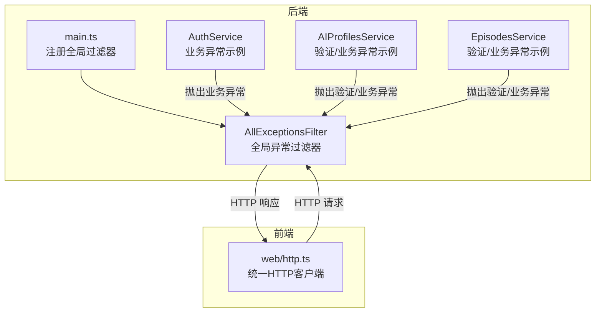
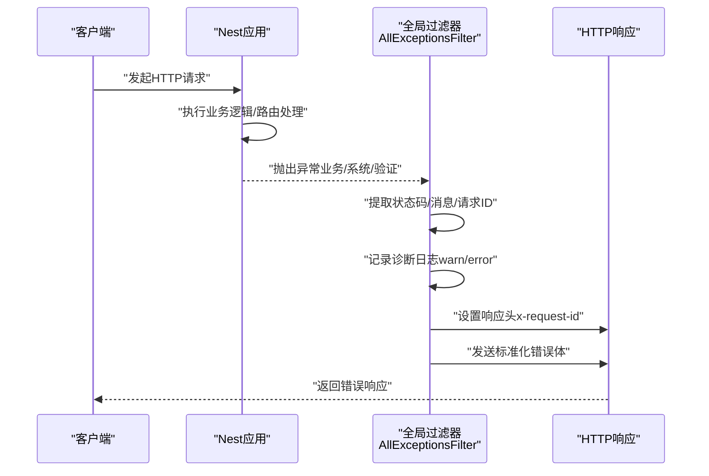
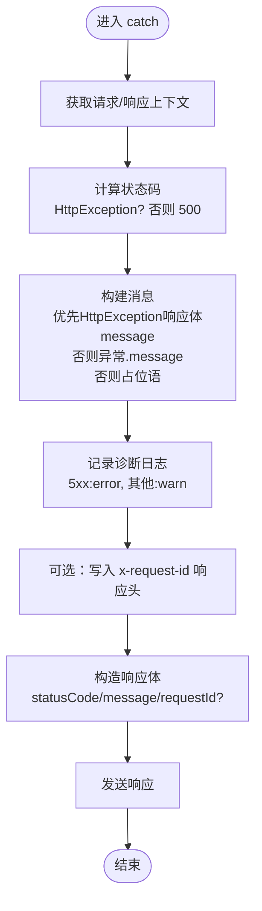
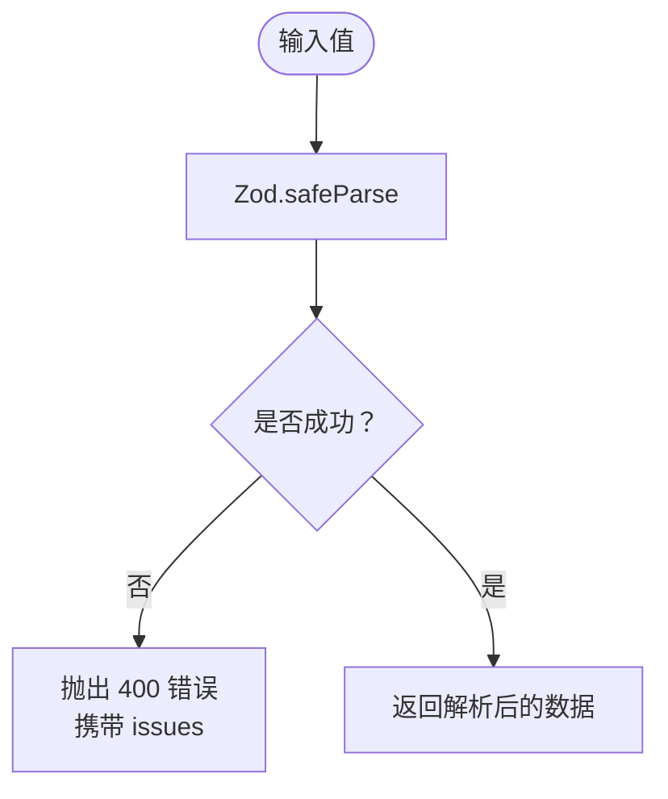
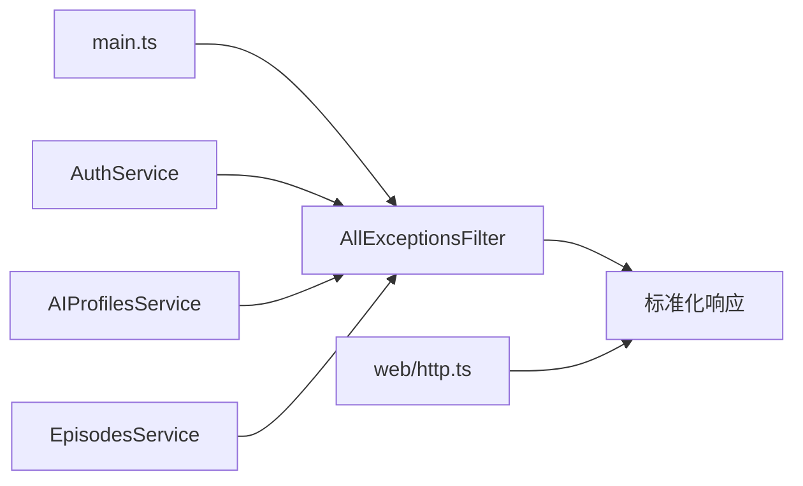

# 错误处理与异常过滤

<cite>
**本文引用的文件**
- [apps/api/src/common/all-exceptions.filter.ts](file://apps/api/src/common/all-exceptions.filter.ts)
- [apps/api/src/common/zod.ts](file://apps/api/src/common/zod.ts)
- [apps/api/src/main.ts](file://apps/api/src/main.ts)
- [apps/api/src/auth/auth.service.ts](file://apps/api/src/auth/auth.service.ts)
- [apps/api/src/ai-profiles/ai-profiles.service.ts](file://apps/api/src/ai-profiles/ai-profiles.service.ts)
- [apps/api/src/episodes/episodes.service.ts](file://apps/api/src/episodes/episodes.service.ts)
- [apps/web/src/lib/api/http.ts](file://apps/web/src/lib/api/http.ts)
</cite>

## 目录

1. [简介](#简介)
2. [项目结构](#项目结构)
3. [核心组件](#核心组件)
4. [架构总览](#架构总览)
5. [组件详解](#组件详解)
6. [依赖关系分析](#依赖关系分析)
7. [性能考量](#性能考量)
8. [故障排查指南](#故障排查指南)
9. [结论](#结论)
10. [附录](#附录)

## 简介

本文件面向AIXSSS后端的错误处理与异常过滤机制，重点覆盖以下内容：

- 全局异常过滤器AllExceptionsFilter的工作原理：HTTP异常捕获、错误响应格式化、日志记录与请求ID透传。
- Zod验证错误的处理策略与自定义验证规则的落地方式。
- 异常分类与处理方式：业务异常、验证异常、系统异常。
- 错误响应标准格式与错误码定义建议。
- 异常处理最佳实践与调试技巧。
- 自定义异常类型的创建与使用指南。

## 项目结构

后端基于NestJS + Fastify，全局异常过滤器在应用启动时注册为全局过滤器；前端通过统一的HTTP客户端读取服务端错误并展示。

**图示来源**

- [apps/api/src/main.ts](file://apps/api/src/main.ts#L1-L34)
- [apps/api/src/common/all-exceptions.filter.ts](file://apps/api/src/common/all-exceptions.filter.ts#L1-L91)
- [apps/api/src/auth/auth.service.ts](file://apps/api/src/auth/auth.service.ts#L1-L77)
- [apps/api/src/ai-profiles/ai-profiles.service.ts](file://apps/api/src/ai-profiles/ai-profiles.service.ts#L95-L202)
- [apps/api/src/episodes/episodes.service.ts](file://apps/api/src/episodes/episodes.service.ts#L70-L146)
- [apps/web/src/lib/api/http.ts](file://apps/web/src/lib/api/http.ts#L1-L90)

**章节来源**

- [apps/api/src/main.ts](file://apps/api/src/main.ts#L1-L34)

## 核心组件

- 全局异常过滤器 AllExceptionsFilter：统一拦截未处理异常，构造标准化错误响应，并输出诊断日志。
- Zod 验证工具 parseOrBadRequest：将Zod校验失败转换为HTTP 400错误，便于前端识别与展示。
- 业务服务：在各领域服务中按需抛出Nest内置异常类型，由全局过滤器统一处理。
- 前端HTTP客户端：解析服务端错误响应，提取请求ID与错误详情，用于调试与用户提示。

**章节来源**

- [apps/api/src/common/all-exceptions.filter.ts](file://apps/api/src/common/all-exceptions.filter.ts#L1-L91)
- [apps/api/src/common/zod.ts](file://apps/api/src/common/zod.ts#L1-L16)
- [apps/web/src/lib/api/http.ts](file://apps/web/src/lib/api/http.ts#L1-L90)

## 架构总览

下图展示了从请求进入后端，到异常被捕获与响应返回的完整流程，以及前后端交互的关键节点。

**图示来源**

- [apps/api/src/common/all-exceptions.filter.ts](file://apps/api/src/common/all-exceptions.filter.ts#L33-L84)
- [apps/api/src/main.ts](file://apps/api/src/main.ts#L21-L22)
- [apps/web/src/lib/api/http.ts](file://apps/web/src/lib/api/http.ts#L58-L90)

## 组件详解

### 全局异常过滤器 AllExceptionsFilter

- 拦截范围：所有未被业务层捕获的异常。
- 状态码确定：若为HttpException则采用其状态码；否则默认500。
- 消息提取：优先从HttpException响应对象中提取message字段，支持字符串或字符串数组合并；其次回退到异常.message；开发环境暴露真实异常信息，生产环境统一为“服务器内部错误”。
- 日志记录：对5xx错误使用error级别，4xx使用warn级别，包含请求ID、方法、URL、状态码与消息等元数据。
- 响应格式：固定包含statusCode与message；若存在请求ID则附加requestId字段；同时在响应头中透传x-request-id，便于跨服务追踪。
- 请求ID透传：当请求上下文存在id且响应对象支持header时，将x-request-id写入响应头。

**图示来源**

- [apps/api/src/common/all-exceptions.filter.ts](file://apps/api/src/common/all-exceptions.filter.ts#L35-L84)

**章节来源**

- [apps/api/src/common/all-exceptions.filter.ts](file://apps/api/src/common/all-exceptions.filter.ts#L1-L91)

### Zod 验证与错误处理

- 工具函数 parseOrBadRequest：对输入进行Zod安全解析，失败时抛出HTTP 400错误，错误体包含message与issues数组，便于前端展示具体校验问题。
- 使用建议：在控制器或服务层调用该函数进行参数校验，确保错误能被全局过滤器统一处理并返回一致格式。

**图示来源**

- [apps/api/src/common/zod.ts](file://apps/api/src/common/zod.ts#L4-L13)

**章节来源**

- [apps/api/src/common/zod.ts](file://apps/api/src/common/zod.ts#L1-L16)

### 异常分类与处理策略

- 业务异常（400/401/403/404/409等）
  - 示例：认证失败、资源不存在、冲突、工作流约束等。
  - 处理：直接抛出对应Nest异常类型，由全局过滤器统一转为HTTP状态码与标准化错误体。
- 验证异常（400）
  - 示例：输入参数缺失、格式不合法、唯一性冲突等。
  - 处理：使用parseOrBadRequest进行Zod校验，失败即抛400；也可在业务层显式抛BadRequestException。
- 系统异常（500）
  - 示例：数据库连接失败、未知异常等。
  - 处理：未捕获异常默认映射为500，开发环境显示真实异常信息，生产环境统一提示“服务器内部错误”。

**章节来源**

- [apps/api/src/auth/auth.service.ts](file://apps/api/src/auth/auth.service.ts#L22-L73)
- [apps/api/src/ai-profiles/ai-profiles.service.ts](file://apps/api/src/ai-profiles/ai-profiles.service.ts#L101-L171)
- [apps/api/src/episodes/episodes.service.ts](file://apps/api/src/episodes/episodes.service.ts#L74-L79)

### 错误响应标准格式与错误码定义

- 标准响应体
  - 字段：statusCode（数字）、message（字符串）、requestId（可选）
  - 示例：{"statusCode":404,"message":"请求的资源不存在","requestId":"abc123"}
- 错误码建议
  - 400：参数/格式/业务规则校验失败（如重复、非法输入）
  - 401：未授权（如登录凭据无效）
  - 403：禁止访问（如权限不足）
  - 404：资源不存在
  - 409：冲突（如唯一键冲突）
  - 422：语义化校验失败（如Zod issues）
  - 500：服务器内部错误
- 建议
  - 对于Zod校验失败，保持400并在错误体中保留issues以便前端逐项提示。
  - 对于业务规则冲突，尽量给出明确的业务提示文本，避免泄露内部实现细节。

**章节来源**

- [apps/api/src/common/all-exceptions.filter.ts](file://apps/api/src/common/all-exceptions.filter.ts#L9-L13)
- [apps/api/src/common/zod.ts](file://apps/api/src/common/zod.ts#L7-L10)

### 前端错误消费与调试

- 统一HTTP客户端会读取响应头中的x-request-id，并结合响应体中的message与detail，拼接最终错误信息。
- 若响应体为JSON，优先解析为对象；否则回退为文本。
- 建议：前端在错误弹窗或日志中展示requestId，便于后端定位与复现。

**章节来源**

- [apps/web/src/lib/api/http.ts](file://apps/web/src/lib/api/http.ts#L30-L90)

## 依赖关系分析

- main.ts 将AllExceptionsFilter注册为全局过滤器，确保所有异常均被拦截。
- 业务服务在各自模块内按需抛出异常，无需关心响应格式与日志细节。
- 前端通过统一HTTP客户端消费后端错误，自动携带与解析请求ID。

**图示来源**

- [apps/api/src/main.ts](file://apps/api/src/main.ts#L21-L22)
- [apps/api/src/common/all-exceptions.filter.ts](file://apps/api/src/common/all-exceptions.filter.ts#L33-L84)
- [apps/web/src/lib/api/http.ts](file://apps/web/src/lib/api/http.ts#L58-L90)

**章节来源**

- [apps/api/src/main.ts](file://apps/api/src/main.ts#L1-L34)

## 性能考量

- 过滤器仅在异常发生时执行，正常路径零开销。
- 日志记录为可选操作，异常发生频率低，对整体性能影响有限。
- 建议：生产环境避免输出敏感堆栈，仅记录必要元数据；对高频错误可通过指标系统监控趋势。

## 故障排查指南

- 如何获取请求ID
  - 在响应头中查找x-request-id；前端会自动读取并拼接到错误信息中。
- 如何区分异常类型
  - 查看statusCode：4xx通常为业务/验证异常，5xx为系统异常。
  - 查看message与issues（Zod场景），快速定位问题根因。
- 开发与生产差异
  - 生产环境不会暴露真实异常堆栈，如需定位问题，请结合请求ID与服务端日志。
- 常见问题
  - 400但无issues：检查是否使用parseOrBadRequest或是否在业务层直接抛出BadRequestException。
  - 404但提示不明确：确认服务层是否抛出NotFoundException并带有明确文案。
  - 500频繁出现：检查上游依赖（数据库、外部接口）稳定性与超时重试策略。

**章节来源**

- [apps/api/src/common/all-exceptions.filter.ts](file://apps/api/src/common/all-exceptions.filter.ts#L57-L84)
- [apps/web/src/lib/api/http.ts](file://apps/web/src/lib/api/http.ts#L80-L86)

## 结论

AIXSSS通过全局异常过滤器实现了统一、可观测、可追踪的错误处理机制；配合Zod验证工具，前端能够获得一致且可读性强的错误体验。遵循本文的分类与格式规范，有助于提升系统的稳定性与可维护性。

## 附录

### 自定义异常类型的创建与使用指南

- 创建步骤
  - 在业务服务中根据场景选择合适的Nest异常类型（如BadRequestException、UnauthorizedException、NotFoundException、ConflictException等）。
  - 在控制器或服务层抛出异常，确保异常消息清晰、不含敏感信息。
  - 由AllExceptionsFilter统一捕获并返回标准化响应。
- 最佳实践
  - 为每个业务域定义清晰的异常边界，避免混合不同语义的错误。
  - 对外暴露的消息应面向用户友好，必要时在日志中保留更详细的上下文。
  - 对于可预期的业务错误（如唯一性冲突、工作流约束），尽量提供可操作的提示。

**章节来源**

- [apps/api/src/auth/auth.service.ts](file://apps/api/src/auth/auth.service.ts#L22-L73)
- [apps/api/src/ai-profiles/ai-profiles.service.ts](file://apps/api/src/ai-profiles/ai-profiles.service.ts#L101-L171)
- [apps/api/src/episodes/episodes.service.ts](file://apps/api/src/episodes/episodes.service.ts#L74-L79)
