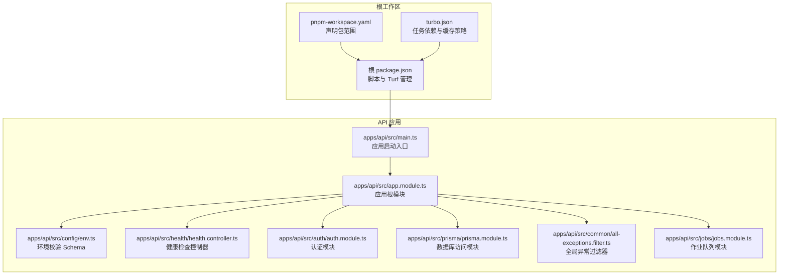
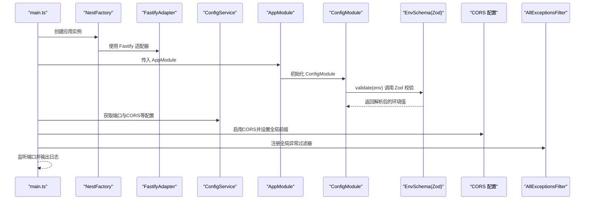
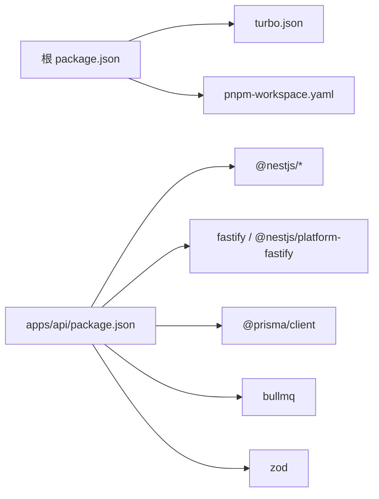

# 项目结构

<cite>
**本文引用的文件**
- [apps/api/src/app.module.ts](file://apps/api/src/app.module.ts)
- [apps/api/src/main.ts](file://apps/api/src/main.ts)
- [apps/api/src/config/env.ts](file://apps/api/src/config/env.ts)
- [apps/api/src/auth/auth.module.ts](file://apps/api/src/auth/auth.module.ts)
- [apps/api/src/prisma/prisma.module.ts](file://apps/api/src/prisma/prisma.module.ts)
- [apps/api/src/common/all-exceptions.filter.ts](file://apps/api/src/common/all-exceptions.filter.ts)
- [apps/api/src/common/zod.ts](file://apps/api/src/common/zod.ts)
- [apps/api/src/health/health.controller.ts](file://apps/api/src/health/health.controller.ts)
- [apps/api/src/jobs/jobs.module.ts](file://apps/api/src/jobs/jobs.module.ts)
- [apps/api/tsconfig.json](file://apps/api/tsconfig.json)
- [apps/api/package.json](file://apps/api/package.json)
- [apps/api/env.example](file://apps/api/env.example)
- [apps/api/ENVIRONMENT.md](file://apps/api/ENVIRONMENT.md)
- [package.json](file://package.json)
- [pnpm-workspace.yaml](file://pnpm-workspace.yaml)
- [turbo.json](file://turbo.json)
</cite>

## 目录

1. [简介](#简介)
2. [项目结构](#项目结构)
3. [核心组件](#核心组件)
4. [架构总览](#架构总览)
5. [详细组件分析](#详细组件分析)
6. [依赖分析](#依赖分析)
7. [性能考虑](#性能考虑)
8. [故障排查指南](#故障排查指南)
9. [结论](#结论)
10. [附录](#附录)

## 简介

本文件面向AIXSSS API服务的代码结构与运行机制，聚焦于基于NestJS的模块化架构设计，系统性阐述以下主题：

- AppModule的依赖注入配置、模块导入顺序与全局配置
- main.ts启动流程、Fastify集成与服务器配置
- ConfigModule的环境变量验证机制与EnvSchema的Zod验证规则
- 模块间依赖关系与导入策略
- 项目目录结构、文件组织原则与命名约定
- 模块扩展指南与最佳实践

## 项目结构

AIXSSS采用多包工作区（monorepo）组织方式，根级通过Turbo管理构建与测试任务，应用层以NestJS为核心，按功能域拆分模块，共享层提供跨应用复用的类型与模式定义。

图表来源

- [apps/api/src/main.ts](file://apps/api/src/main.ts#L1-L34)
- [apps/api/src/app.module.ts](file://apps/api/src/app.module.ts#L1-L37)
- [apps/api/src/config/env.ts](file://apps/api/src/config/env.ts#L1-L17)
- [apps/api/src/health/health.controller.ts](file://apps/api/src/health/health.controller.ts#L1-L12)
- [apps/api/src/auth/auth.module.ts](file://apps/api/src/auth/auth.module.ts#L1-L30)
- [apps/api/src/prisma/prisma.module.ts](file://apps/api/src/prisma/prisma.module.ts#L1-L12)
- [apps/api/src/common/all-exceptions.filter.ts](file://apps/api/src/common/all-exceptions.filter.ts#L1-L91)
- [apps/api/src/jobs/jobs.module.ts](file://apps/api/src/jobs/jobs.module.ts#L1-L16)

章节来源

- [package.json](file://package.json#L1-L24)
- [pnpm-workspace.yaml](file://pnpm-workspace.yaml#L1-L6)
- [turbo.json](file://turbo.json#L1-L30)

## 核心组件

- 应用根模块（AppModule）：集中导入ConfigModule、PrismaModule与各业务模块，并注册健康检查控制器。
- 启动入口（main.ts）：创建Nest应用实例，集成Fastify适配器，加载配置并启用CORS、全局前缀与全局异常过滤器。
- 环境配置（ConfigModule + EnvSchema）：通过Zod对环境变量进行强类型校验，确保运行时参数安全可靠。
- 全局异常过滤器：统一处理HTTP与非HTTP异常，输出结构化错误响应并记录日志。
- 数据库模块（PrismaModule）：全局提供PrismaService，供各业务模块注入使用。
- 认证模块（AuthModule）：基于JWT与Passport实现鉴权能力，从ConfigService读取密钥。
- 作业队列模块（JobsModule）：封装队列提供者与控制器，支撑异步任务编排。

章节来源

- [apps/api/src/app.module.ts](file://apps/api/src/app.module.ts#L1-L37)
- [apps/api/src/main.ts](file://apps/api/src/main.ts#L1-L34)
- [apps/api/src/config/env.ts](file://apps/api/src/config/env.ts#L1-L17)
- [apps/api/src/common/all-exceptions.filter.ts](file://apps/api/src/common/all-exceptions.filter.ts#L1-L91)
- [apps/api/src/prisma/prisma.module.ts](file://apps/api/src/prisma/prisma.module.ts#L1-L12)
- [apps/api/src/auth/auth.module.ts](file://apps/api/src/auth/auth.module.ts#L1-L30)
- [apps/api/src/jobs/jobs.module.ts](file://apps/api/src/jobs/jobs.module.ts#L1-L16)

## 架构总览

下图展示应用启动与模块装配的关键交互：

图表来源

- [apps/api/src/main.ts](file://apps/api/src/main.ts#L1-L34)
- [apps/api/src/app.module.ts](file://apps/api/src/app.module.ts#L16-L32)
- [apps/api/src/config/env.ts](file://apps/api/src/config/env.ts#L3-L12)

## 详细组件分析

### AppModule：模块装配与依赖注入

- 导入顺序与职责
  - ConfigModule.forRoot：全局启用配置模块，通过EnvSchema.validate进行环境变量校验。
  - PrismaModule：全局提供数据库访问能力。
  - 业务模块：按领域划分导入，如AuthModule、ProjectsModule、ScenesModule、CharactersModule、WorldViewModule、AIProfilesModule、EpisodesModule、JobsModule、SystemPromptsModule。
  - 控制器：注册HealthController作为健康检查入口。
- 依赖注入策略
  - 通过@Global装饰PrismaModule，确保PrismaService在应用任意位置可用。
  - 各模块内部通过providers与exports暴露服务，避免循环依赖。
- 全局配置
  - AppModule不直接设置CORS或全局前缀，这些在main.ts中集中配置，保持模块职责单一。

章节来源

- [apps/api/src/app.module.ts](file://apps/api/src/app.module.ts#L16-L35)

### main.ts：启动流程与Fastify集成

- 初始化步骤
  - 创建Nest应用实例并绑定FastifyAdapter。
  - 通过ConfigService读取端口与CORS配置，未配置时采用默认值。
  - 启用CORS并允许凭据，设置全局前缀为“api”。
  - 注册AllExceptionsFilter为全局异常处理器。
  - 在0.0.0.0监听，便于容器与外部访问。
- 错误处理
  - 启动失败时输出错误日志并退出进程，保证可观测性。

章节来源

- [apps/api/src/main.ts](file://apps/api/src/main.ts#L9-L31)

### ConfigModule与EnvSchema：环境变量验证机制

- 验证规则
  - NODE_ENV：限定枚举值，默认development。
  - PORT：数字、整数、正数，默认3001。
  - DATABASE_URL：必填字符串。
  - JWT_SECRET：最小长度32字符。
  - API_KEY_ENCRYPTION_KEY：最小长度32字符。
  - REDIS_URL：默认redis://localhost:6379。
  - AI_QUEUE_NAME：默认“ai-jobs”，用于BullMQ队列。
  - CORS_ORIGIN：可选字符串。
- 执行时机
  - ConfigModule.forRoot的validate回调在应用启动早期执行，Zod解析失败会阻止应用启动，确保运行时安全。

章节来源

- [apps/api/src/config/env.ts](file://apps/api/src/config/env.ts#L3-L12)
- [apps/api/src/app.module.ts](file://apps/api/src/app.module.ts#L18-L21)

### 全局异常过滤器：统一错误响应

- 行为特征
  - 捕获所有未处理异常，区分HTTP与非HTTP异常，提取状态码与消息。
  - 生产环境隐藏底层异常细节，开发环境输出完整信息。
  - 将请求ID写入响应头，便于链路追踪。
  - 结构化错误体包含状态码、消息与可选请求ID。
- 日志策略
  - 5xx错误写入stderr，4xx错误写入stdout，辅助诊断。

章节来源

- [apps/api/src/common/all-exceptions.filter.ts](file://apps/api/src/common/all-exceptions.filter.ts#L34-L84)

### PrismaModule：数据访问层

- 角色定位
  - 以@Global装饰，向全应用提供PrismaService。
  - 通过exports导出服务，供业务模块注入使用。
- 最佳实践
  - 仅在需要持久化的模块中注入PrismaService，避免过度耦合。

章节来源

- [apps/api/src/prisma/prisma.module.ts](file://apps/api/src/prisma/prisma.module.ts#L4-L8)

### AuthModule：认证与鉴权

- 组件构成
  - 基于JwtModule与PassportModule，使用JWT策略进行身份验证。
  - 通过ConfigService动态注入JWT密钥与过期时间。
- 导入策略
  - 显式导入ConfigModule，确保ConfigService可用。
  - 通过exports对外暴露AuthService，供其他模块使用。

章节来源

- [apps/api/src/auth/auth.module.ts](file://apps/api/src/auth/auth.module.ts#L10-L26)

### JobsModule：作业队列与工作流

- 组成
  - 提供队列相关providers与JobsService。
  - 暴露AI作业、工作流与LLM相关控制器。
- 导入策略
  - 通过exports导出JobsService，供上层模块调用。

章节来源

- [apps/api/src/jobs/jobs.module.ts](file://apps/api/src/jobs/jobs.module.ts#L8-L12)

### 健康检查：HealthController

- 职责
  - 提供轻量级健康检查接口，返回运行状态与时间戳。
- 集成
  - 由AppModule直接注册为控制器，无需额外模块导入。

章节来源

- [apps/api/src/health/health.controller.ts](file://apps/api/src/health/health.controller.ts#L3-L8)

### TypeScript与构建配置

- 编译目标与模块解析
  - 目标ES2022，模块解析NodeNext，启用装饰器元数据与实验特性。
- 工作区与任务
  - 根package.json通过Turbo脚本统一管理开发、构建、类型检查、测试与格式化任务。
  - pnpm-workspace.yaml声明apps与packages范围，确保跨包依赖解析正确。

章节来源

- [apps/api/tsconfig.json](file://apps/api/tsconfig.json#L2-L16)
- [package.json](file://package.json#L7-L16)
- [pnpm-workspace.yaml](file://pnpm-workspace.yaml#L1-L3)
- [turbo.json](file://turbo.json#L4-L27)

## 依赖分析

- 包管理与工作区
  - 根级package.json定义统一脚本；pnpm-workspace.yaml声明apps与packages范围；turbo.json定义任务依赖与缓存。
- 应用依赖
  - apps/api/package.json声明NestJS、Fastify、Prisma、BullMQ、Zod等核心依赖，体现模块化与解耦设计。
- 环境变量与示例
  - env.example与ENVIRONMENT.md提供本地开发所需环境变量清单与说明，强调DATABASE_URL、JWT_SECRET、API_KEY_ENCRYPTION_KEY、REDIS_URL、AI_QUEUE_NAME与CORS_ORIGIN等关键项。

图表来源

- [package.json](file://package.json#L1-L24)
- [pnpm-workspace.yaml](file://pnpm-workspace.yaml#L1-L6)
- [turbo.json](file://turbo.json#L1-L30)
- [apps/api/package.json](file://apps/api/package.json#L18-L36)

章节来源

- [apps/api/package.json](file://apps/api/package.json#L1-L52)
- [apps/api/env.example](file://apps/api/env.example#L1-L23)
- [apps/api/ENVIRONMENT.md](file://apps/api/ENVIRONMENT.md#L1-L31)

## 性能考虑

- 服务器选择：Fastify适配器相比Express具备更高吞吐与更低延迟，适合高并发API场景。
- 全局前缀与CORS：统一前缀简化路由管理；CORS允许凭据提升跨域体验，但需谨慎控制origin白名单。
- 异常过滤：全局异常过滤减少重复错误处理逻辑，降低响应路径开销。
- 队列与异步：JobsModule结合BullMQ实现异步任务，避免阻塞主请求线程。
- 类型安全：Zod校验与严格tsconfig减少运行时错误，提高稳定性。

## 故障排查指南

- 启动失败
  - 检查环境变量是否满足EnvSchema要求（如DATABASE_URL、JWT_SECRET、API_KEY_ENCRYPTION_KEY等）。
  - 查看main.ts启动日志与错误堆栈，确认端口占用与网络可达性。
- 4xx/5xx错误
  - 关注AllExceptionsFilter输出的请求ID，结合服务端日志定位问题。
  - 开发环境可查看完整异常信息，生产环境遵循简洁错误响应。
- CORS问题
  - 确认CORS_ORIGIN配置与前端地址一致，必要时允许通配符或具体域名。
- 数据库连接
  - 校验DATABASE_URL格式与可达性，确保Prisma迁移与生成命令正常执行。

章节来源

- [apps/api/src/common/all-exceptions.filter.ts](file://apps/api/src/common/all-exceptions.filter.ts#L46-L84)
- [apps/api/src/main.ts](file://apps/api/src/main.ts#L16-L25)
- [apps/api/src/config/env.ts](file://apps/api/src/config/env.ts#L3-L12)

## 结论

AIXSSS API服务以NestJS为核心，结合Fastify、Prisma、BullMQ与Zod，构建了模块化、类型安全且易于扩展的后端架构。AppModule集中装配模块与控制器，main.ts负责启动与全局配置，ConfigModule与EnvSchema确保环境变量的强约束。通过清晰的模块边界与职责划分，项目具备良好的可维护性与扩展性。

## 附录

### 目录结构与命名约定

- apps/api/src 下按功能域划分模块，文件命名采用小驼峰与模块名对应，如auth.module.ts、auth.service.ts、auth.controller.ts。
- 控制器统一以“...controller.ts”结尾，服务以“...service.ts”结尾，模块以“...module.ts”结尾。
- 公共工具与过滤器放置在common目录，如all-exceptions.filter.ts、zod.ts。
- 配置文件位于config目录，如env.ts。
- 健康检查控制器位于health目录。

### 模块扩展指南

- 新增领域模块
  - 在src下新建模块目录，创建module.ts、service.ts、controller.ts。
  - 在AppModule中导入新模块，并在需要时注册控制器。
- 配置新增字段
  - 在env.ts中添加Zod字段与默认值，更新ConfigModule.validate。
  - 在env.example与ENVIRONMENT.md补充说明。
- 安全与合规
  - 敏感配置（如密钥）必须通过环境变量注入，避免硬编码。
  - 生产环境开启严格的CORS与日志策略，限制异常详情泄露。
