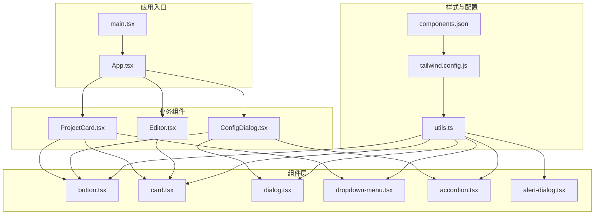
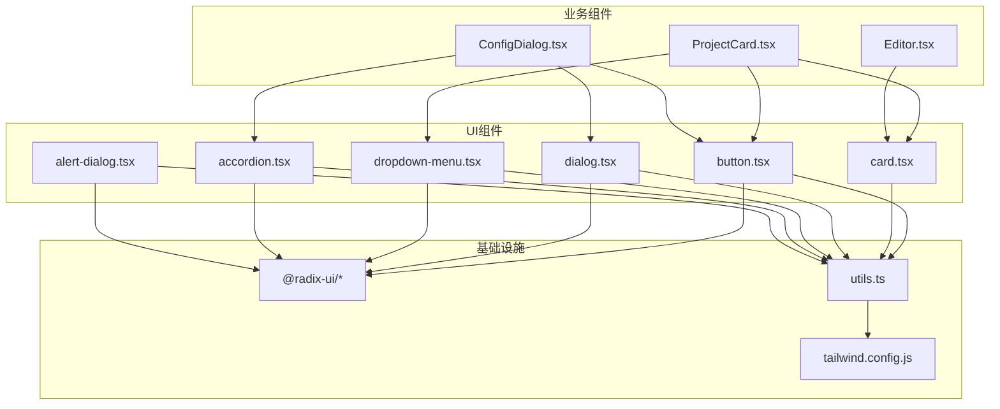
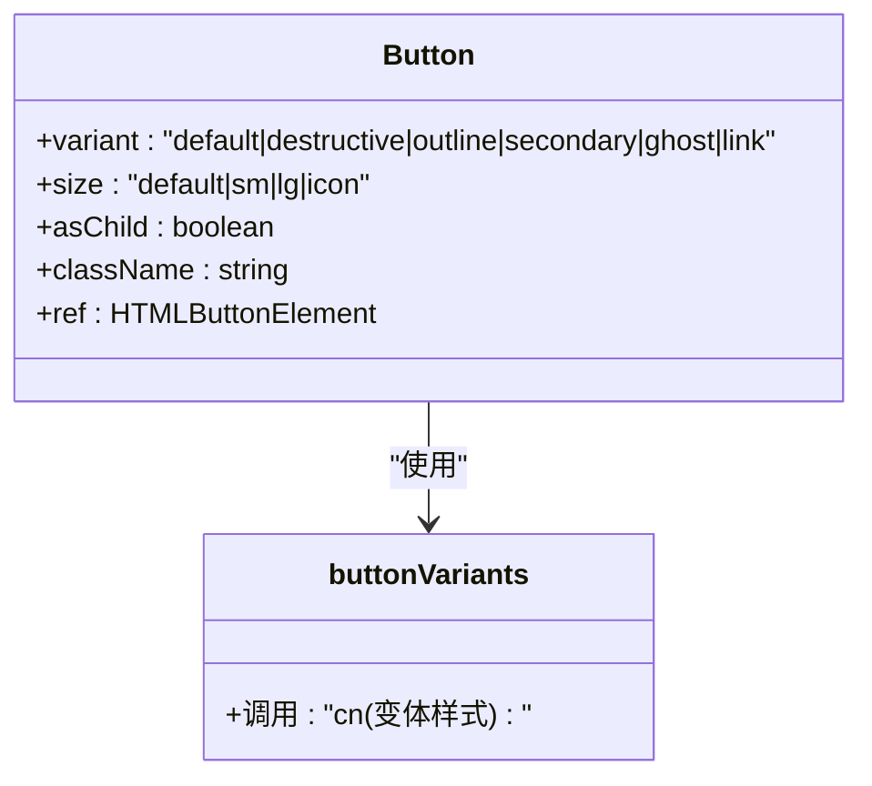
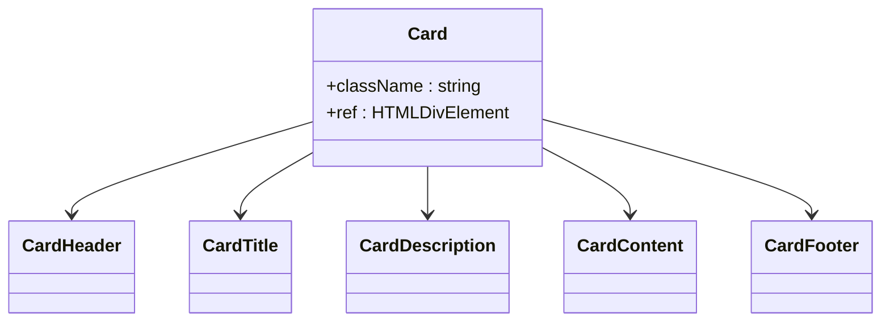
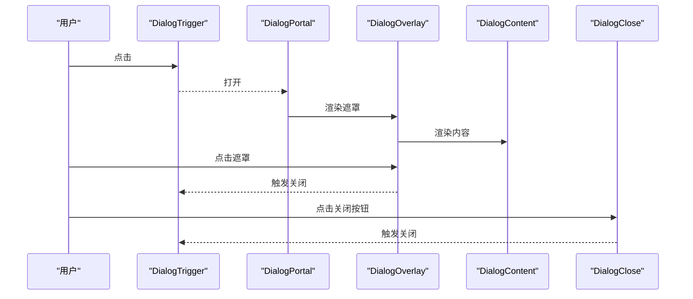
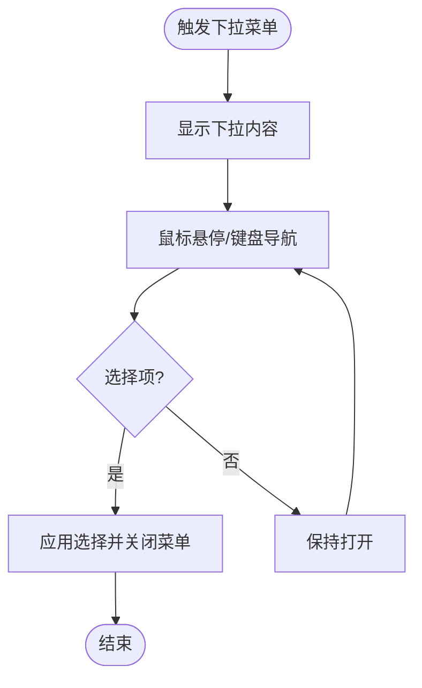
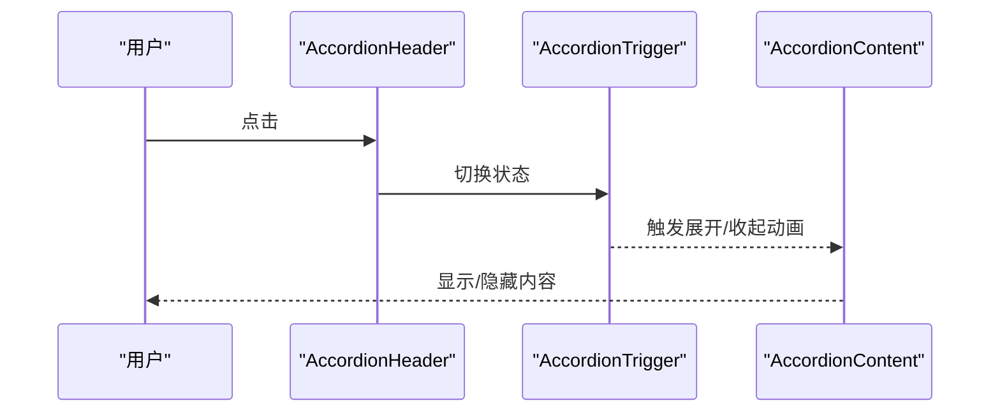
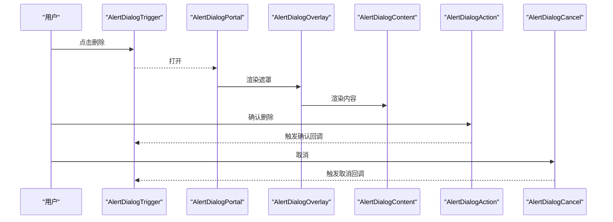
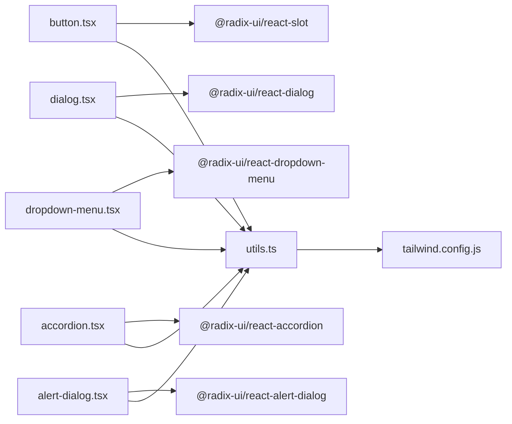

# UI组件库

<cite>
**本文引用的文件**
- [button.tsx](file://manga-creator/src/components/ui/button.tsx)
- [card.tsx](file://manga-creator/src/components/ui/card.tsx)
- [dialog.tsx](file://manga-creator/src/components/ui/dialog.tsx)
- [dropdown-menu.tsx](file://manga-creator/src/components/ui/dropdown-menu.tsx)
- [accordion.tsx](file://manga-creator/src/components/ui/accordion.tsx)
- [alert-dialog.tsx](file://manga-creator/src/components/ui/alert-dialog.tsx)
- [components.json](file://manga-creator/components.json)
- [tailwind.config.js](file://manga-creator/tailwind.config.js)
- [utils.ts](file://manga-creator/src/lib/utils.ts)
- [App.tsx](file://manga-creator/src/App.tsx)
- [ProjectCard.tsx](file://manga-creator/src/components/ProjectCard.tsx)
- [ConfigDialog.tsx](file://manga-creator/src/components/ConfigDialog.tsx)
- [Editor.tsx](file://manga-creator/src/components/Editor.tsx)
- [README.md](file://manga-creator/README.md)
</cite>

## 目录
1. [简介](#简介)
2. [项目结构](#项目结构)
3. [核心组件](#核心组件)
4. [架构总览](#架构总览)
5. [详细组件分析](#详细组件分析)
6. [依赖关系分析](#依赖关系分析)
7. [性能考量](#性能考量)
8. [故障排查指南](#故障排查指南)
9. [结论](#结论)
10. [附录](#附录)

## 简介
本文件围绕基于 Shadcn/ui 与 Radix UI 的组件库，系统梳理并文档化以下核心 UI 组件：button、card、dialog、dropdown-menu、accordion、alert-dialog。内容涵盖视觉设计、行为逻辑、使用方法、props 属性、支持事件、可定制样式、无障碍（a11y）特性，并结合项目中的实际使用示例，说明如何在现有项目中正确使用这些组件。同时，文档解释 components.json 配置文件的作用，以及如何扩展与定制 UI 组件以契合项目的“紫蓝渐变”设计系统，确保 UI 的一致性与高质量。

## 项目结构
该仓库前端采用 React + TypeScript + Vite + Tailwind CSS + Shadcn/ui + Radix UI 的组合。组件统一放置在 src/components/ui 下，遵循 Shadcn 的约定式结构；全局样式由 Tailwind 驱动，颜色体系通过 CSS 变量与主题扩展实现；components.json 作为 Shadcn 的配置文件，定义了样式风格、Tailwind 配置路径、别名等。

图表来源
- [App.tsx](file://manga-creator/src/App.tsx#L1-L81)
- [ProjectCard.tsx](file://manga-creator/src/components/ProjectCard.tsx#L1-L110)
- [ConfigDialog.tsx](file://manga-creator/src/components/ConfigDialog.tsx#L1-L197)
- [Editor.tsx](file://manga-creator/src/components/Editor.tsx#L1-L172)
- [components.json](file://manga-creator/components.json#L1-L21)
- [tailwind.config.js](file://manga-creator/tailwind.config.js#L1-L94)
- [utils.ts](file://manga-creator/src/lib/utils.ts#L1-L7)

章节来源
- [README.md](file://manga-creator/README.md#L71-L95)
- [components.json](file://manga-creator/components.json#L1-L21)
- [tailwind.config.js](file://manga-creator/tailwind.config.js#L1-L94)

## 核心组件
本节对六个核心 UI 组件进行总体说明，包括设计风格、默认行为、可定制点与无障碍特性。

- button
  - 设计风格：基于 Variants 的语义化变体（default、destructive、outline、secondary、ghost、link），尺寸（default、sm、lg、icon）。支持 asChild 透传为任意元素。
  - 行为逻辑：支持禁用态、焦点可见环、SVG 内嵌图标尺寸与交互。
  - 可定制样式：通过 variant/size/asChild 与 className 组合；可复用 buttonVariants。
  - 无障碍：继承原生按钮语义，支持键盘交互与焦点管理。
- card
  - 设计风格：卡片容器，包含 Header、Title、Description、Content、Footer 等子组件，统一圆角、边框与阴影。
  - 行为逻辑：无状态容器，按需组合使用。
  - 可定制样式：className 可叠加。
  - 无障碍：语义化 div 容器，建议在标题处使用 h2/h3 等语义标签。
- dialog
  - 设计风格：模态对话框，包含 Overlay、Portal、Trigger、Close、Content、Header/Footer、Title/Description。
  - 行为逻辑：受控/非受控均可；支持 ESC 关闭、点击遮罩关闭、焦点陷阱。
  - 可定制样式：Content/Overlay/Header/Footer/Title/Description 均可覆盖样式。
  - 无障碍：使用 @radix-ui/react-dialog，具备自动焦点管理与键盘交互。
- dropdown-menu
  - 设计风格：下拉菜单，支持 Sub、Group、RadioGroup、Checkbox/Radio Item、Label、Separator、Shortcut。
  - 行为逻辑：触发器、内容区、子菜单联动；支持键盘导航与焦点管理。
  - 可定制样式：Item/SubContent/Content 等均支持 className。
  - 无障碍：使用 @radix-ui/react-dropdown-menu，具备键盘导航与焦点管理。
- accordion
  - 设计风格：折叠面板，包含 Root、Item、Trigger、Content。
  - 行为逻辑：单开/多开模式；展开/收起动画。
  - 可定制样式：Item/Trigger/Content 均可覆盖样式。
  - 无障碍：使用 @radix-ui/react-accordion，具备键盘导航与焦点管理。
- alert-dialog
  - 设计风格：警示对话框，包含 Overlay、Portal、Trigger、Content、Header/Footer、Title/Description、Action/Cancel。
  - 行为逻辑：强调危险操作；Action/Cancel 使用 buttonVariants。
  - 可定制样式：Content/Action/Cancel 均可覆盖样式。
  - 无障碍：使用 @radix-ui/react-alert-dialog，具备焦点管理与键盘交互。

章节来源
- [button.tsx](file://manga-creator/src/components/ui/button.tsx#L1-L58)
- [card.tsx](file://manga-creator/src/components/ui/card.tsx#L1-L77)
- [dialog.tsx](file://manga-creator/src/components/ui/dialog.tsx#L1-L122)
- [dropdown-menu.tsx](file://manga-creator/src/components/ui/dropdown-menu.tsx#L1-L199)
- [accordion.tsx](file://manga-creator/src/components/ui/accordion.tsx#L1-L57)
- [alert-dialog.tsx](file://manga-creator/src/components/ui/alert-dialog.tsx#L1-L140)

## 架构总览
下图展示了应用如何在业务组件中使用 UI 组件，以及 UI 组件如何依赖 Radix UI 与 Tailwind CSS。

图表来源
- [ProjectCard.tsx](file://manga-creator/src/components/ProjectCard.tsx#L1-L110)
- [ConfigDialog.tsx](file://manga-creator/src/components/ConfigDialog.tsx#L1-L197)
- [Editor.tsx](file://manga-creator/src/components/Editor.tsx#L1-L172)
- [button.tsx](file://manga-creator/src/components/ui/button.tsx#L1-L58)
- [card.tsx](file://manga-creator/src/components/ui/card.tsx#L1-L77)
- [dialog.tsx](file://manga-creator/src/components/ui/dialog.tsx#L1-L122)
- [dropdown-menu.tsx](file://manga-creator/src/components/ui/dropdown-menu.tsx#L1-L199)
- [accordion.tsx](file://manga-creator/src/components/ui/accordion.tsx#L1-L57)
- [alert-dialog.tsx](file://manga-creator/src/components/ui/alert-dialog.tsx#L1-L140)
- [utils.ts](file://manga-creator/src/lib/utils.ts#L1-L7)
- [tailwind.config.js](file://manga-creator/tailwind.config.js#L1-L94)

## 详细组件分析

### Button 组件
- 设计与行为
  - 通过 Variants 定义多种语义化变体与尺寸，支持禁用态、焦点可见环、SVG 内嵌图标尺寸与交互。
  - 支持 asChild 将渲染目标替换为任意元素（如链接、span 等），便于语义化与可访问性。
- Props
  - 继承原生 button 属性，新增 variant、size、asChild。
  - variant: default | destructive | outline | secondary | ghost | link
  - size: default | sm | lg | icon
  - asChild: boolean
- 事件
  - 支持原生按钮事件（onClick、onMouseDown 等）。
- 样式与定制
  - 通过 className 与 buttonVariants 组合覆盖样式；可复用 buttonVariants 保证一致的外观。
- 无障碍
  - 默认按钮语义，支持键盘激活与焦点管理。
- 使用示例（路径）
  - [App.tsx 中的返回按钮与设置按钮](file://manga-creator/src/App.tsx#L38-L57)
  - [ProjectCard.tsx 中的更多操作按钮](file://manga-creator/src/components/ProjectCard.tsx#L63-L82)

图表来源
- [button.tsx](file://manga-creator/src/components/ui/button.tsx#L1-L58)

章节来源
- [button.tsx](file://manga-creator/src/components/ui/button.tsx#L1-L58)
- [App.tsx](file://manga-creator/src/App.tsx#L38-L57)
- [ProjectCard.tsx](file://manga-creator/src/components/ProjectCard.tsx#L63-L82)

### Card 组件
- 设计与行为
  - 卡片容器，包含 Header、Title、Description、Content、Footer 子组件，统一圆角、边框与阴影。
- Props
  - 所有子组件均继承 HTML 元素属性，支持 className。
- 事件
  - 无特定事件，按需在父容器上绑定交互。
- 样式与定制
  - 通过 className 叠加自定义样式；建议在标题处使用语义化标签。
- 无障碍
  - 语义化 div 容器，建议配合标题语义标签使用。
- 使用示例（路径）
  - [ProjectCard.tsx 中的卡片结构](file://manga-creator/src/components/ProjectCard.tsx#L51-L107)
  - [Editor.tsx 中的左侧步骤导航卡片](file://manga-creator/src/components/Editor.tsx#L111-L160)

图表来源
- [card.tsx](file://manga-creator/src/components/ui/card.tsx#L1-L77)

章节来源
- [card.tsx](file://manga-creator/src/components/ui/card.tsx#L1-L77)
- [ProjectCard.tsx](file://manga-creator/src/components/ProjectCard.tsx#L51-L107)
- [Editor.tsx](file://manga-creator/src/components/Editor.tsx#L111-L160)

### Dialog 组件
- 设计与行为
  - 模态对话框，包含 Overlay、Portal、Trigger、Close、Content、Header/Footer、Title/Description。
  - 支持 ESC 关闭、点击遮罩关闭、焦点陷阱与动画过渡。
- Props
  - Overlay/Content/Title/Description/Trigger/Close 均支持 className 与原生属性。
- 事件
  - 通过 Radix 的 openChange 事件实现受控控制。
- 样式与定制
  - Content/Overlay/Header/Footer/Title/Description 均可覆盖样式。
- 无障碍
  - 使用 @radix-ui/react-dialog，具备自动焦点管理与键盘交互。
- 使用示例（路径）
  - [ConfigDialog.tsx 中的 API 配置弹窗](file://manga-creator/src/components/ConfigDialog.tsx#L101-L196)

图表来源
- [dialog.tsx](file://manga-creator/src/components/ui/dialog.tsx#L1-L122)
- [ConfigDialog.tsx](file://manga-creator/src/components/ConfigDialog.tsx#L101-L196)

章节来源
- [dialog.tsx](file://manga-creator/src/components/ui/dialog.tsx#L1-L122)
- [ConfigDialog.tsx](file://manga-creator/src/components/ConfigDialog.tsx#L101-L196)

### Dropdown Menu 组件
- 设计与行为
  - 下拉菜单，支持 Sub、Group、RadioGroup、Checkbox/Radio Item、Label、Separator、Shortcut。
  - 支持键盘导航与焦点管理。
- Props
  - SubTrigger/SubContent/Content/Item/CheckboxItem/RadioItem/Label/Separator/Shortcut 均支持 className。
- 事件
  - 通过 Radix 事件实现交互（如选择项变更）。
- 样式与定制
  - Item/SubContent/Content 等均支持 className。
- 无障碍
  - 使用 @radix-ui/react-dropdown-menu，具备键盘导航与焦点管理。
- 使用示例（路径）
  - [ProjectCard.tsx 中的更多操作菜单](file://manga-creator/src/components/ProjectCard.tsx#L63-L82)

图表来源
- [dropdown-menu.tsx](file://manga-creator/src/components/ui/dropdown-menu.tsx#L1-L199)
- [ProjectCard.tsx](file://manga-creator/src/components/ProjectCard.tsx#L63-L82)

章节来源
- [dropdown-menu.tsx](file://manga-creator/src/components/ui/dropdown-menu.tsx#L1-L199)
- [ProjectCard.tsx](file://manga-creator/src/components/ProjectCard.tsx#L63-L82)

### Accordion 组件
- 设计与行为
  - 折叠面板，包含 Root、Item、Trigger、Content。
  - 展开/收起动画，支持单开/多开模式。
- Props
  - Item/Trigger/Content 均支持 className。
- 事件
  - 通过 Radix 事件实现状态切换。
- 样式与定制
  - Item/Trigger/Content 均可覆盖样式。
- 无障碍
  - 使用 @radix-ui/react-accordion，具备键盘导航与焦点管理。
- 使用示例（路径）
  - [ConfigDialog.tsx 中的配置表单区域](file://manga-creator/src/components/ConfigDialog.tsx#L111-L186)

图表来源
- [accordion.tsx](file://manga-creator/src/components/ui/accordion.tsx#L1-L57)
- [ConfigDialog.tsx](file://manga-creator/src/components/ConfigDialog.tsx#L111-L186)

章节来源
- [accordion.tsx](file://manga-creator/src/components/ui/accordion.tsx#L1-L57)
- [ConfigDialog.tsx](file://manga-creator/src/components/ConfigDialog.tsx#L111-L186)

### Alert Dialog 组件
- 设计与行为
  - 警示对话框，包含 Overlay、Portal、Trigger、Content、Header/Footer、Title/Description、Action/Cancel。
  - 强调危险操作；Action/Cancel 使用 buttonVariants。
- Props
  - Content/Action/Cancel 均支持 className。
- 事件
  - 通过 Radix 事件实现受控控制。
- 样式与定制
  - Content/Action/Cancel 均可覆盖样式。
- 无障碍
  - 使用 @radix-ui/react-alert-dialog，具备焦点管理与键盘交互。
- 使用示例（路径）
  - [ProjectCard.tsx 中的删除项目确认](file://manga-creator/src/components/ProjectCard.tsx#L74-L81)

图表来源
- [alert-dialog.tsx](file://manga-creator/src/components/ui/alert-dialog.tsx#L1-L140)
- [ProjectCard.tsx](file://manga-creator/src/components/ProjectCard.tsx#L74-L81)

章节来源
- [alert-dialog.tsx](file://manga-creator/src/components/ui/alert-dialog.tsx#L1-L140)
- [ProjectCard.tsx](file://manga-creator/src/components/ProjectCard.tsx#L74-L81)

## 依赖关系分析
- 组件依赖 Radix UI 原子能力（对话框、下拉、手风琴、警示对话框），保证可访问性与动画一致性。
- 样式依赖 Tailwind CSS，通过 CSS 变量与主题扩展实现颜色与圆角等视觉规范。
- 工具函数 cn(...) 聚合 clsx 与 tailwind-merge，避免类名冲突并合并冲突样式。

图表来源
- [button.tsx](file://manga-creator/src/components/ui/button.tsx#L1-L58)
- [dialog.tsx](file://manga-creator/src/components/ui/dialog.tsx#L1-L122)
- [dropdown-menu.tsx](file://manga-creator/src/components/ui/dropdown-menu.tsx#L1-L199)
- [accordion.tsx](file://manga-creator/src/components/ui/accordion.tsx#L1-L57)
- [alert-dialog.tsx](file://manga-creator/src/components/ui/alert-dialog.tsx#L1-L140)
- [utils.ts](file://manga-creator/src/lib/utils.ts#L1-L7)
- [tailwind.config.js](file://manga-creator/tailwind.config.js#L1-L94)

章节来源
- [utils.ts](file://manga-creator/src/lib/utils.ts#L1-L7)
- [tailwind.config.js](file://manga-creator/tailwind.config.js#L1-L94)

## 性能考量
- 组件均为轻量包装，渲染成本低；通过 asChild 与 Slot 可减少不必要的 DOM 层级。
- 动画与过渡使用 Radix 的 data-state 属性驱动，避免额外状态管理。
- 样式合并使用 twMerge，减少重复类名带来的重绘。
- 在大量列表中使用 Card/Dialog/Dropdown 等组件时，建议：
  - 对 Dialog/AlertDialog 使用 Portal，避免层级过深导致的重排。
  - 对 Dropdown 使用 Portal，提升子菜单渲染性能。
  - 合理使用 className，避免过度拼接导致的样式抖动。

## 故障排查指南
- 无法聚焦或键盘不可用
  - 确保使用了正确的 Trigger/Root 组件包裹；例如 Dialog/AlertDialog/Alert/Dialog 的 Trigger 必须位于树内。
  - 检查是否正确引入 Portal，避免内容未挂载到正确容器。
- 点击遮罩无效或无法关闭
  - 确认 DialogOverlay/AlertDialogOverlay 是否被正确渲染且未被其他元素覆盖。
  - 检查 open/onOpenChange 的受控状态是否正确传递。
- 下拉菜单无法显示或位置异常
  - 确认 DropdownMenuContent/Portal 正确包裹；检查是否有 overflow 或定位问题。
  - 如使用 Sub，确认 SubTrigger/SubContent 成对出现。
- 样式冲突或覆盖不生效
  - 使用 cn(...) 合并类名，避免重复定义相同样式。
  - 检查 Tailwind 配置是否正确加载，CSS 变量是否生效。
- 无障碍问题
  - 确保标题与描述使用 Title/Description；按钮使用 Button 并提供可访问文本。
  - 对需要焦点管理的组件，确保首次焦点落在可交互元素上。

章节来源
- [dialog.tsx](file://manga-creator/src/components/ui/dialog.tsx#L1-L122)
- [alert-dialog.tsx](file://manga-creator/src/components/ui/alert-dialog.tsx#L1-L140)
- [dropdown-menu.tsx](file://manga-creator/src/components/ui/dropdown-menu.tsx#L1-L199)
- [utils.ts](file://manga-creator/src/lib/utils.ts#L1-L7)

## 结论
本组件库以 Shadcn/ui 为基础，结合 Radix UI 的可访问性与动画能力，提供了高一致性、易扩展的 UI 组件集合。通过 components.json 与 Tailwind CSS 的配置，项目实现了统一的设计语言与主题扩展。在实际业务中，button、card、dialog、dropdown-menu、accordion、alert-dialog 组件被广泛使用，覆盖了从基础交互到复杂表单与对话框的场景。建议在后续扩展中继续遵循现有命名与样式约定，保持组件的一致性与可维护性。

## 附录

### components.json 配置说明
- style: 组件风格（如 new-york），影响组件外观细节。
- rsc: 是否启用 RSC（本项目为 false）。
- tsx: 是否使用 TSX（本项目为 true）。
- tailwind: 配置 Tailwind 的 config、css、baseColor、cssVariables、prefix。
- aliases: 组件别名映射，如 components、ui、lib、hooks 等，便于导入路径统一。

章节来源
- [components.json](file://manga-creator/components.json#L1-L21)

### 设计系统与定制指南（紫蓝渐变）
- 色彩系统
  - 主色调：紫蓝渐变（参考 README 的主色调说明）。
  - 背景色：深蓝灰。
  - 文字色：Slate 系列。
- 定制建议
  - 在 tailwind.config.js 中扩展 colors.primary/secondary/destructive 等变量，确保与项目主色调一致。
  - 使用 CSS 变量与主题扩展，避免硬编码颜色值。
  - 通过 buttonVariants 与 Card 等组件的 className 覆盖，统一按钮与卡片的视觉风格。
  - 在业务组件中使用渐变色（如进度条）时，保持与主色调一致的色阶。

章节来源
- [README.md](file://manga-creator/README.md#L152-L163)
- [tailwind.config.js](file://manga-creator/tailwind.config.js#L1-L94)
- [ProjectCard.tsx](file://manga-creator/src/components/ProjectCard.tsx#L98-L104)

### 实际使用示例（路径）
- 按钮
  - [App.tsx 中的返回按钮与设置按钮](file://manga-creator/src/App.tsx#L38-L57)
  - [ProjectCard.tsx 中的更多操作按钮](file://manga-creator/src/components/ProjectCard.tsx#L63-L82)
- 卡片
  - [ProjectCard.tsx 中的卡片结构](file://manga-creator/src/components/ProjectCard.tsx#L51-L107)
  - [Editor.tsx 中的左侧步骤导航卡片](file://manga-creator/src/components/Editor.tsx#L111-L160)
- 对话框
  - [ConfigDialog.tsx 中的 API 配置弹窗](file://manga-creator/src/components/ConfigDialog.tsx#L101-L196)
- 下拉菜单
  - [ProjectCard.tsx 中的更多操作菜单](file://manga-creator/src/components/ProjectCard.tsx#L63-L82)
- 手风琴
  - [ConfigDialog.tsx 中的配置表单区域](file://manga-creator/src/components/ConfigDialog.tsx#L111-L186)
- 警示对话框
  - [ProjectCard.tsx 中的删除项目确认](file://manga-creator/src/components/ProjectCard.tsx#L74-L81)