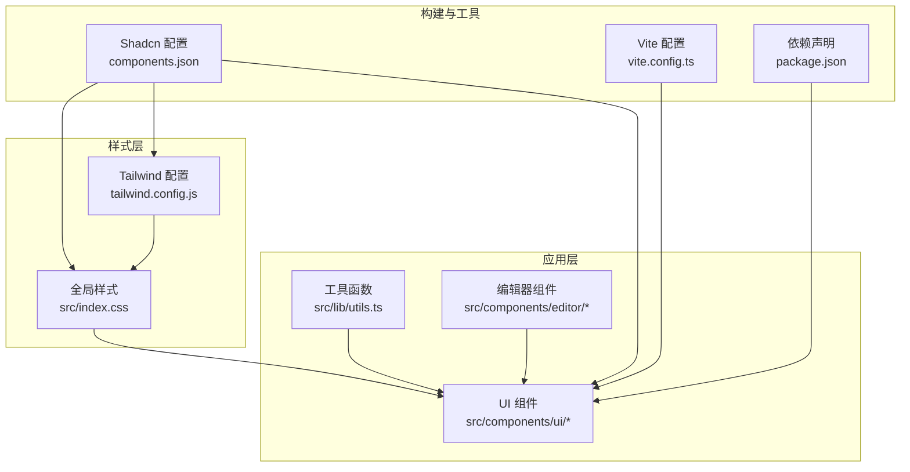
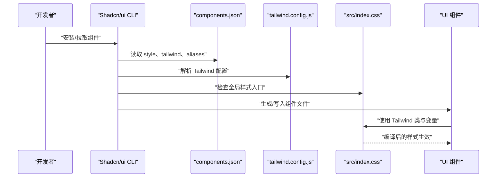
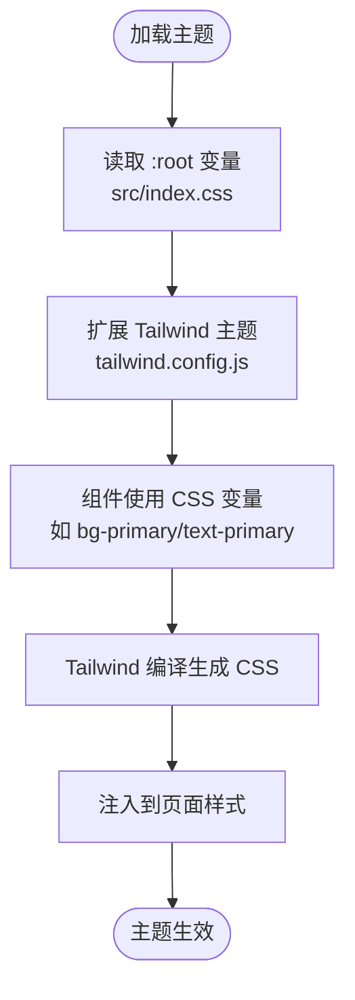
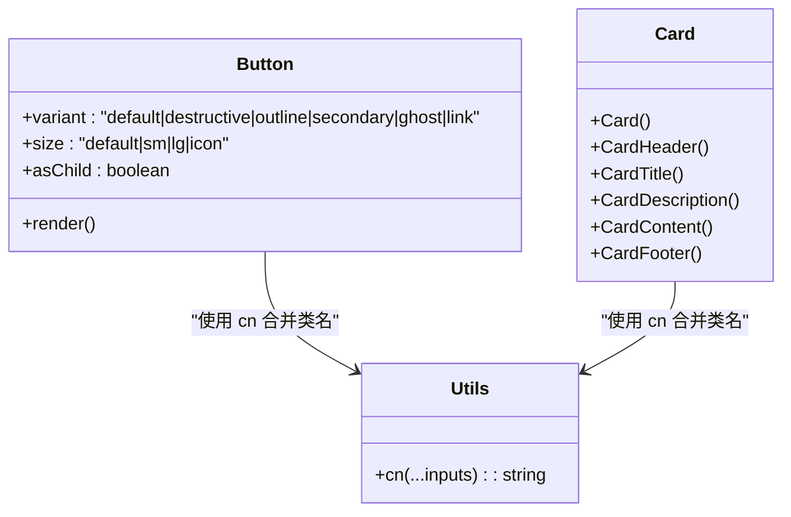
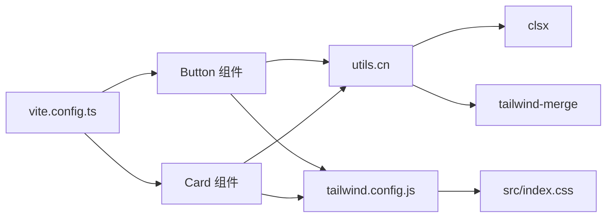

# UI组件系统与主题配置

<cite>
**本文引用的文件**
- [components.json](file://manga-creator/components.json)
- [tailwind.config.js](file://manga-creator/tailwind.config.js)
- [index.css](file://manga-creator/src/index.css)
- [package.json](file://manga-creator/package.json)
- [vite.config.ts](file://manga-creator/vite.config.ts)
- [button.tsx](file://manga-creator/src/components/ui/button.tsx)
- [card.tsx](file://manga-creator/src/components/ui/card.tsx)
- [utils.ts](file://manga-creator/src/lib/utils.ts)
- [BasicSettings.tsx](file://manga-creator/src/components/editor/BasicSettings.tsx)
</cite>

## 目录
1. [引言](#引言)
2. [项目结构](#项目结构)
3. [核心组件](#核心组件)
4. [架构总览](#架构总览)
5. [详细组件分析](#详细组件分析)
6. [依赖关系分析](#依赖关系分析)
7. [性能考量](#性能考量)
8. [故障排查指南](#故障排查指南)
9. [结论](#结论)
10. [附录](#附录)

## 引言
本文件聚焦于UI组件系统的整体配置与主题体系，重点解析 components.json 在项目中的作用及其与 Shadcn/ui CLI 的集成方式。我们将从配置项入手，说明 aliases、tailwind、rsc 等如何影响组件导入路径、样式生成与 SSR 兼容性；并提供扩展新组件与定制默认样式变量的操作步骤，帮助团队在保持 UI 统一性的前提下，实现“紫蓝渐变”的设计语言落地。

## 项目结构
manga-creator 使用 Vite + React + TailwindCSS 构建，UI 组件集中于 src/components/ui，主题变量由 src/index.css 定义并通过 tailwind.config.js 扩展。components.json 作为 Shadcn/ui 的配置文件，统一了组件安装、别名映射与样式生成策略。

图表来源
- [components.json](file://manga-creator/components.json#L1-L21)
- [tailwind.config.js](file://manga-creator/tailwind.config.js#L1-L94)
- [index.css](file://manga-creator/src/index.css#L1-L40)
- [vite.config.ts](file://manga-creator/vite.config.ts#L1-L30)
- [package.json](file://manga-creator/package.json#L1-L62)

章节来源
- [components.json](file://manga-creator/components.json#L1-L21)
- [tailwind.config.js](file://manga-creator/tailwind.config.js#L1-L94)
- [index.css](file://manga-creator/src/index.css#L1-L40)
- [vite.config.ts](file://manga-creator/vite.config.ts#L1-L30)
- [package.json](file://manga-creator/package.json#L1-L62)

## 核心组件
- 组件别名与导入路径
  - aliases 字段定义了常用路径别名，如 components、ui、lib、hooks 等，确保组件导入路径一致且可维护。
  - 例如：ui 别名指向 "@/components/ui"，便于在组件内部通过别名导入工具函数与子组件。
- Tailwind 集成
  - tailwind.config.js 中通过 theme.extend 声明了基于 CSS 变量的颜色、圆角与动画，配合 src/index.css 的 :root 变量，形成统一的主题系统。
  - components.json 的 tailwind 字段指定了 tailwind.config.js 与 src/index.css 的相对路径，确保 CLI 与构建工具正确识别样式源。
- RSC 与 TSX
  - rsc: false 表示不启用 React Server Components，组件按客户端渲染方式开发。
  - tsx: true 表示使用 TSX 文件，便于类型安全与组件变体管理。

章节来源
- [components.json](file://manga-creator/components.json#L1-L21)
- [tailwind.config.js](file://manga-creator/tailwind.config.js#L1-L94)
- [index.css](file://manga-creator/src/index.css#L1-L40)

## 架构总览
Shadcn/ui CLI 通过 components.json 读取样式风格、Tailwind 配置与别名，按需生成或安装组件到指定目录。组件内部通过 utils.cn 合并类名，使用 Tailwind 变量实现主题化，最终由 Tailwind 编译器生成 CSS 并注入到全局样式中。

图表来源
- [components.json](file://manga-creator/components.json#L1-L21)
- [tailwind.config.js](file://manga-creator/tailwind.config.js#L1-L94)
- [index.css](file://manga-creator/src/index.css#L1-L40)

## 详细组件分析

### 组件别名与导入路径（aliases）
- 作用
  - 统一导入路径，减少相对路径带来的维护成本。
  - 与 Vite 别名 @ 对齐，提升开发体验与一致性。
- 影响
  - 组件内部可直接使用 "@/lib/utils"、"@/components/ui" 等别名，避免深层 ../ 导致的脆弱路径。
  - 与 Shadcn/cli 的 aliases 字段保持一致，确保 CLI 生成的组件导入路径正确。

章节来源
- [components.json](file://manga-creator/components.json#L13-L19)
- [vite.config.ts](file://manga-creator/vite.config.ts#L1-L30)

### Tailwind 配置与主题变量（tailwind）
- 颜色系统
  - 通过 theme.extend.colors 声明语义化颜色，如 primary、secondary、destructive、muted、accent、popover、card 等，均映射到 CSS 变量。
- 圆角与动画
  - 使用 var(--radius) 控制圆角，使用 keyframes 与 animation 实现组件动画（如 Accordion）。
- 全局样式
  - src/index.css 通过 @tailwind base/components/utilities 注入基础层、组件层与工具层，并在 @layer base 中定义 :root 变量，形成主题基线。

图表来源
- [index.css](file://manga-creator/src/index.css#L1-L40)
- [tailwind.config.js](file://manga-creator/tailwind.config.js#L1-L94)

章节来源
- [tailwind.config.js](file://manga-creator/tailwind.config.js#L1-L94)
- [index.css](file://manga-creator/src/index.css#L1-L40)

### 组件变体与样式合并（utils.cn）
- 组件变体
  - 以 Button 为例，通过 class-variance-authority 定义 variant 与 size 的组合，形成丰富的视觉层次。
- 类名合并
  - utils.cn 使用 clsx 与 tailwind-merge 合并类名，解决冲突与覆盖问题，保证最终样式稳定。

图表来源
- [button.tsx](file://manga-creator/src/components/ui/button.tsx#L1-L58)
- [card.tsx](file://manga-creator/src/components/ui/card.tsx#L1-L77)
- [utils.ts](file://manga-creator/src/lib/utils.ts#L1-L7)

章节来源
- [button.tsx](file://manga-creator/src/components/ui/button.tsx#L1-L58)
- [card.tsx](file://manga-creator/src/components/ui/card.tsx#L1-L77)
- [utils.ts](file://manga-creator/src/lib/utils.ts#L1-L7)

### 服务器端渲染兼容性（RSC）
- 当前配置
  - components.json 中 rsc: false，表示不启用 React Server Components，组件按客户端渲染方式开发。
- 影响
  - 有利于快速迭代与本地开发体验；若未来迁移至 RSC，需同步调整组件与构建配置。

章节来源
- [components.json](file://manga-creator/components.json#L1-L21)

### 与 Shadcn/ui CLI 的集成
- CLI 读取顺序
  - style: "new-york" 决定组件风格。
  - tailwind.config 与 tailwind.css 指向 tailwind.config.js 与 src/index.css。
  - aliases 与 Vite 别名保持一致，确保 CLI 生成的组件导入路径正确。
- 安装与定制
  - 通过 CLI 安装组件后，组件会放置在 ui 目录，使用 utils.cn 与 Tailwind 变量实现主题化。

章节来源
- [components.json](file://manga-creator/components.json#L1-L21)

## 依赖关系分析
- 组件依赖
  - UI 组件依赖 utils.cn 进行类名合并，依赖 Tailwind 变量实现主题化。
- 构建依赖
  - Vite 通过别名 @ 解析路径，Tailwind 通过 tailwind.config.js 与 src/index.css 生成样式。
- 外部依赖
  - class-variance-authority、clsx、tailwind-merge 等提供变体与类名合并能力。

图表来源
- [button.tsx](file://manga-creator/src/components/ui/button.tsx#L1-L58)
- [card.tsx](file://manga-creator/src/components/ui/card.tsx#L1-L77)
- [utils.ts](file://manga-creator/src/lib/utils.ts#L1-L7)
- [tailwind.config.js](file://manga-creator/tailwind.config.js#L1-L94)
- [index.css](file://manga-creator/src/index.css#L1-L40)
- [vite.config.ts](file://manga-creator/vite.config.ts#L1-L30)

章节来源
- [package.json](file://manga-creator/package.json#L1-L62)
- [vite.config.ts](file://manga-creator/vite.config.ts#L1-L30)

## 性能考量
- 类名合并
  - 使用 tailwind-merge 可减少重复类名，降低运行时样式冲突与重绘开销。
- 动画与圆角
  - 使用 CSS 变量控制圆角与动画，避免在 JS 中频繁计算，提升渲染性能。
- 构建体积
  - 通过 Tailwind 的按需扫描与 CSS 变量，减少未使用样式的打包体积。

## 故障排查指南
- 样式未生效
  - 检查 src/index.css 是否包含 @tailwind base/components/utilities。
  - 确认 tailwind.config.js 的 content 路径是否包含组件目录。
- 组件导入报错
  - 确保 Vite 别名 @ 与 components.json 中 aliases 保持一致。
  - 检查组件内部是否使用正确的别名导入 "@/lib/utils"。
- 构建失败
  - 若 rsc 设置与实际组件不匹配，可能导致构建异常；当前 rsc: false，组件按客户端渲染开发。
- 主题不统一
  - 检查 :root 变量是否被覆盖或遗漏；确保组件使用语义化颜色类（如 bg-primary/text-primary）而非硬编码颜色。

章节来源
- [index.css](file://manga-creator/src/index.css#L1-L40)
- [tailwind.config.js](file://manga-creator/tailwind.config.js#L1-L94)
- [components.json](file://manga-creator/components.json#L1-L21)
- [vite.config.ts](file://manga-creator/vite.config.ts#L1-L30)

## 结论
components.json 是连接 Shadcn/ui 与项目主题体系的关键枢纽。通过合理配置 aliases、tailwind 与 rsc，可以实现组件导入的一致性、样式生成的可控性与 SSR 兼容性。结合 Tailwind 变量与 utils.cn 的类名合并机制，能够高效地扩展与定制 UI 组件，满足“紫蓝渐变”设计语言的需求。建议在团队内建立统一的组件命名与变体规范，确保主题一致性与可维护性。

## 附录

### 实操步骤：扩展新 UI 组件
- 步骤 1：在终端执行 Shadcn/ui CLI 安装命令，选择目标组件与风格。
- 步骤 2：确认 CLI 生成的组件位于 ui 目录，导入路径使用 "@/components/ui" 别名。
- 步骤 3：在组件中使用 utils.cn 合并类名，并使用 Tailwind 语义化颜色类。
- 步骤 4：如需新增变体，参考 Button 的变体定义方式，在组件中扩展 variant/size。
- 步骤 5：在 src/index.css 的 :root 中补充必要的 CSS 变量，确保 Tailwind 可正确解析。

章节来源
- [components.json](file://manga-creator/components.json#L1-L21)
- [button.tsx](file://manga-creator/src/components/ui/button.tsx#L1-L58)
- [utils.ts](file://manga-creator/src/lib/utils.ts#L1-L7)
- [index.css](file://manga-creator/src/index.css#L1-L40)

### 实操步骤：修改默认样式变量（适配“紫蓝渐变”）
- 步骤 1：在 src/index.css 的 :root 中调整 primary、secondary、accent 等变量值，体现“紫蓝渐变”。
- 步骤 2：在 tailwind.config.js 的 theme.extend.colors 中确认对应语义化颜色映射。
- 步骤 3：在组件中使用语义化类名（如 bg-primary/text-primary），避免硬编码颜色。
- 步骤 4：如需自定义圆角或动画，可在 theme.extend 中扩展，并通过 CSS 变量统一管理。

章节来源
- [index.css](file://manga-creator/src/index.css#L1-L40)
- [tailwind.config.js](file://manga-creator/tailwind.config.js#L1-L94)

### 实操步骤：添加新的组件变体或覆盖默认主题颜色
- 新增变体
  - 在组件中定义新的 variant/size 组合，并在 utils.cn 合并逻辑中确保优先级与覆盖规则清晰。
- 覆盖默认主题颜色
  - 在 src/index.css 的 :root 中增加或修改变量，或在 tailwind.config.js 的 theme.extend 中扩展颜色映射。
- 验证与回归
  - 在 BasicSettings 或其他页面中验证颜色与渐变效果，确保视觉一致性。

章节来源
- [button.tsx](file://manga-creator/src/components/ui/button.tsx#L1-L58)
- [card.tsx](file://manga-creator/src/components/ui/card.tsx#L1-L77)
- [index.css](file://manga-creator/src/index.css#L1-L40)
- [BasicSettings.tsx](file://manga-creator/src/components/editor/BasicSettings.tsx#L113-L150)