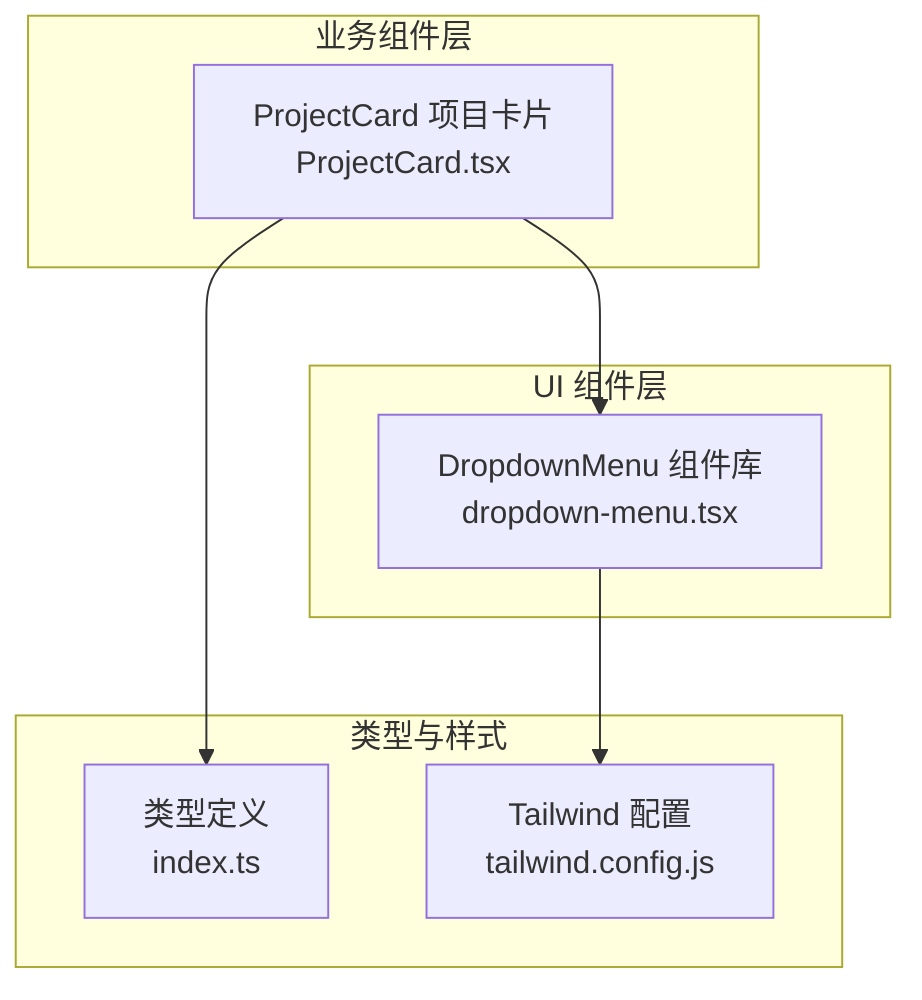
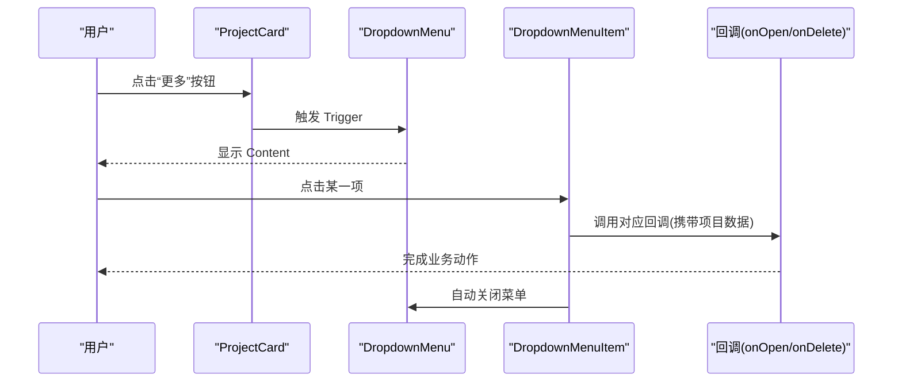
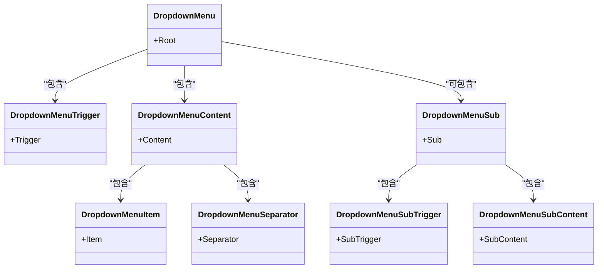
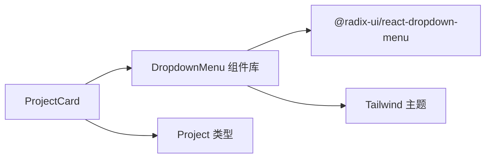

# 下拉菜单组件 (Dropdown Menu)

<cite>
**本文引用的文件**
- [dropdown-menu.tsx](file://manga-creator/src/components/ui/dropdown-menu.tsx)
- [ProjectCard.tsx](file://manga-creator/src/components/ProjectCard.tsx)
- [index.ts](file://manga-creator/src/types/index.ts)
- [tailwind.config.js](file://manga-creator/tailwind.config.js)
- [ProjectCard.test.tsx](file://manga-creator/src/components/ProjectCard.test.tsx)
- [package-lock.json](file://manga-creator/package-lock.json)
</cite>

## 目录
1. [简介](#简介)
2. [项目结构](#项目结构)
3. [核心组件](#核心组件)
4. [架构总览](#架构总览)
5. [详细组件分析](#详细组件分析)
6. [依赖关系分析](#依赖关系分析)
7. [性能考虑](#性能考虑)
8. [故障排查指南](#故障排查指南)
9. [结论](#结论)
10. [附录](#附录)

## 简介
本技术文档围绕项目卡片上下文菜单中的下拉菜单组件展开，系统性说明其复合结构与交互行为，并结合项目卡片的实际集成方式，给出键盘导航与无障碍支持的实践建议，同时指出常见问题与优化策略（如菜单错位、延迟渲染等）。

## 项目结构
下拉菜单组件位于 UI 组件层，作为可复用的基础控件；项目卡片通过该组件提供“打开项目”“删除项目”等上下文操作入口。整体组织遵循按功能域分层：UI 基础组件、业务卡片组件、类型定义与样式配置。

图表来源
- [dropdown-menu.tsx](file://manga-creator/src/components/ui/dropdown-menu.tsx#L1-L199)
- [ProjectCard.tsx](file://manga-creator/src/components/ProjectCard.tsx#L1-L110)
- [index.ts](file://manga-creator/src/types/index.ts#L43-L55)
- [tailwind.config.js](file://manga-creator/tailwind.config.js#L1-L94)

章节来源
- [dropdown-menu.tsx](file://manga-creator/src/components/ui/dropdown-menu.tsx#L1-L199)
- [ProjectCard.tsx](file://manga-creator/src/components/ProjectCard.tsx#L1-L110)
- [index.ts](file://manga-creator/src/types/index.ts#L43-L55)
- [tailwind.config.js](file://manga-creator/tailwind.config.js#L1-L94)

## 核心组件
下拉菜单由一组基于 Radix UI 的原语封装而成，形成复合结构：
- 触发器：用于激活菜单
- 内容区：承载菜单项与分隔线等
- 菜单项：可点击的条目，支持图标与快捷键提示
- 分隔线：用于视觉分组
- 子菜单组：支持嵌套菜单（含子触发器与子内容）

这些组件共同实现“点击 Item 后触发回调并自动关闭菜单”的交互闭环，且具备良好的无障碍与键盘导航能力。

章节来源
- [dropdown-menu.tsx](file://manga-creator/src/components/ui/dropdown-menu.tsx#L6-L199)

## 架构总览
下拉菜单在项目卡片中的集成路径如下：用户点击卡片右上角的“更多”按钮，触发下拉菜单；用户选择“打开项目”或“删除项目”，分别调用传入的回调函数，完成业务动作。

图表来源
- [ProjectCard.tsx](file://manga-creator/src/components/ProjectCard.tsx#L63-L82)
- [dropdown-menu.tsx](file://manga-creator/src/components/ui/dropdown-menu.tsx#L6-L199)

章节来源
- [ProjectCard.tsx](file://manga-creator/src/components/ProjectCard.tsx#L63-L82)
- [ProjectCard.test.tsx](file://manga-creator/src/components/ProjectCard.test.tsx#L126-L164)

## 详细组件分析

### 复合结构与职责
- DropdownMenu：根容器，管理状态与生命周期
- DropdownMenuTrigger：触发器，通常包裹按钮
- DropdownMenuContent：菜单内容区，负责定位与动画
- DropdownMenuItem：菜单项，支持 inset 缩进与图标
- DropdownMenuSeparator：分隔线，用于分组
- 子菜单相关：DropdownMenuSub、DropdownMenuSubTrigger、DropdownMenuSubContent

图表来源
- [dropdown-menu.tsx](file://manga-creator/src/components/ui/dropdown-menu.tsx#L6-L199)

章节来源
- [dropdown-menu.tsx](file://manga-creator/src/components/ui/dropdown-menu.tsx#L6-L199)

### 交互逻辑与回调
- 点击菜单项会触发回调并自动关闭菜单
- 在项目卡片中，点击“打开项目”调用 onOpen(project)，点击“删除项目”调用 onDelete(project.id)
- 触发器使用 asChild 包裹按钮，避免重复的焦点与事件冒泡问题；同时在触发器上阻止事件冒泡，避免误触卡片点击

章节来源
- [ProjectCard.tsx](file://manga-creator/src/components/ProjectCard.tsx#L63-L82)
- [ProjectCard.test.tsx](file://manga-creator/src/components/ProjectCard.test.tsx#L126-L164)

### 键盘导航与无障碍支持
- 组件基于 Radix UI，天然支持键盘导航（如方向键移动、Enter/Space 确认）
- 菜单项具备焦点态样式与禁用态处理，符合无障碍规范
- 内容区使用 Portal 渲染，避免父级容器的 overflow 影响定位与滚动
- 动画与过渡通过 data-state 属性驱动，确保可访问性与可读性

章节来源
- [dropdown-menu.tsx](file://manga-creator/src/components/ui/dropdown-menu.tsx#L56-L155)
- [package-lock.json](file://manga-creator/package-lock.json#L1900-L1936)

### 数据绑定与上下文
- 项目卡片接收 Project 类型数据，通过 props 将项目信息传递给菜单项
- 菜单项回调中使用项目 id 或完整对象，保证业务操作所需上下文

章节来源
- [index.ts](file://manga-creator/src/types/index.ts#L43-L55)
- [ProjectCard.tsx](file://manga-creator/src/components/ProjectCard.tsx#L12-L16)

### 菜单定位与视觉
- 内容区使用 Portal 渲染，配合 sideOffset 与 data-[side=...] 的动画类，确保在不同屏幕位置稳定显示
- z-50 提升层级，避免被其他元素遮挡
- 支持最大高度与纵向滚动，适配大量菜单项场景

章节来源
- [dropdown-menu.tsx](file://manga-creator/src/components/ui/dropdown-menu.tsx#L56-L73)

## 依赖关系分析
- 组件依赖 Radix UI 的原语，提供可访问性与跨浏览器一致性
- 使用 Tailwind CSS 提供主题色与尺寸，确保一致的视觉与交互体验
- 项目卡片依赖类型定义，保证传入数据结构的正确性

图表来源
- [dropdown-menu.tsx](file://manga-creator/src/components/ui/dropdown-menu.tsx#L1-L199)
- [ProjectCard.tsx](file://manga-creator/src/components/ProjectCard.tsx#L1-L110)
- [index.ts](file://manga-creator/src/types/index.ts#L43-L55)
- [tailwind.config.js](file://manga-creator/tailwind.config.js#L1-L94)
- [package-lock.json](file://manga-creator/package-lock.json#L1900-L1936)

章节来源
- [package-lock.json](file://manga-creator/package-lock.json#L1900-L1936)
- [tailwind.config.js](file://manga-creator/tailwind.config.js#L1-L94)

## 性能考虑
- 大型菜单项的延迟渲染：对于包含复杂内容（如列表、图片、异步数据）的菜单项，建议采用懒加载或虚拟化方案，减少初始渲染压力
- 滚动优化：内容区已支持纵向滚动，避免菜单溢出导致布局抖动
- 动画与过渡：使用 Radix UI 的 data-state 控制动画，保持流畅的同时避免不必要的重排
- 事件冒泡控制：在触发器上阻止事件冒泡，降低外层容器的事件处理成本

章节来源
- [dropdown-menu.tsx](file://manga-creator/src/components/ui/dropdown-menu.tsx#L56-L73)
- [ProjectCard.tsx](file://manga-creator/src/components/ProjectCard.tsx#L63-L68)

## 故障排查指南
- 菜单错位或被遮挡
  - 检查 z-index 是否足够高（组件内部已使用 z-50）
  - 检查父级容器是否设置了 overflow 并限制了可见区域，必要时调整容器样式或使用 Portal（组件已内置 Portal）
  - 确认 sideOffset 与对齐参数（align）是否合适
- 键盘无法导航
  - 确保菜单处于可聚焦状态，且未被禁用
  - 检查是否有自定义样式覆盖了焦点态
- 回调未触发
  - 确认菜单项 onClick 是否正确绑定项目上下文
  - 检查触发器上的事件冒泡是否被阻止（asChild 与 stopPropagation 的组合）
- 可访问性问题
  - 确保菜单项具备可读的文本标签
  - 避免仅使用图标表达含义，需配合文本或 aria-label

章节来源
- [dropdown-menu.tsx](file://manga-creator/src/components/ui/dropdown-menu.tsx#L56-L73)
- [ProjectCard.tsx](file://manga-creator/src/components/ProjectCard.tsx#L63-L82)

## 结论
下拉菜单组件以 Radix UI 为基础，提供了完善的可访问性与键盘导航能力，并通过 Portal 与 z-index 等机制保障定位与层级稳定性。在项目卡片中，它以简洁的方式承载“打开项目”“删除项目”等关键操作，配合类型安全的数据绑定与测试验证，形成了可靠的上下文菜单体验。针对大型菜单与复杂交互，建议采用延迟渲染与虚拟化等优化手段，持续提升性能与可用性。

## 附录
- 快捷键参考
  - 方向键：在菜单内移动
  - Enter/Space：确认选中项
  - Esc：关闭菜单
- 最佳实践
  - 使用 asChild 包裹触发器，避免重复事件处理
  - 对危险操作（如删除）使用强调色与二次确认
  - 为菜单项提供清晰的图标与文本说明