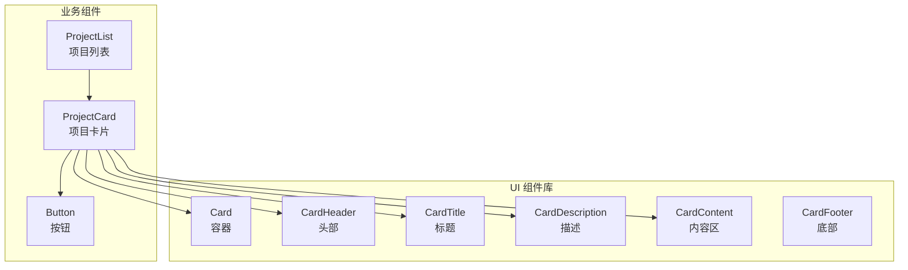
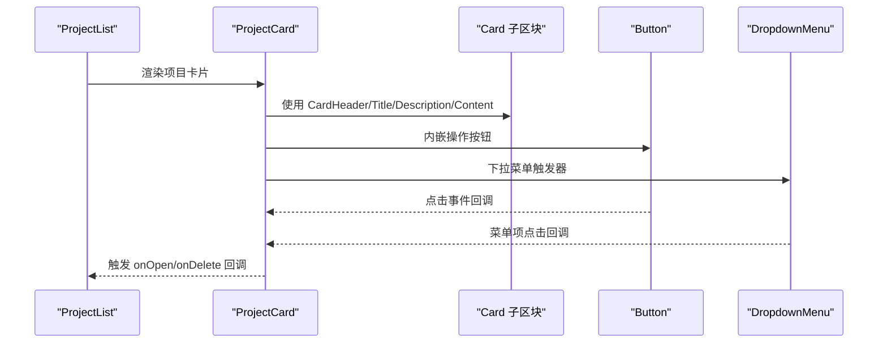
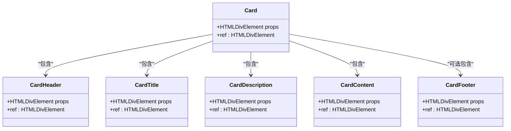
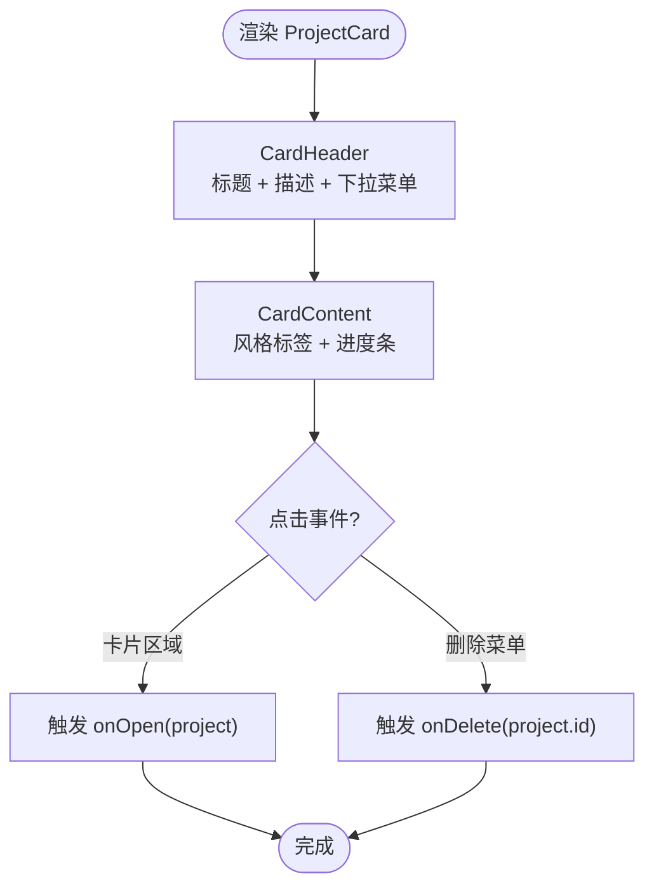
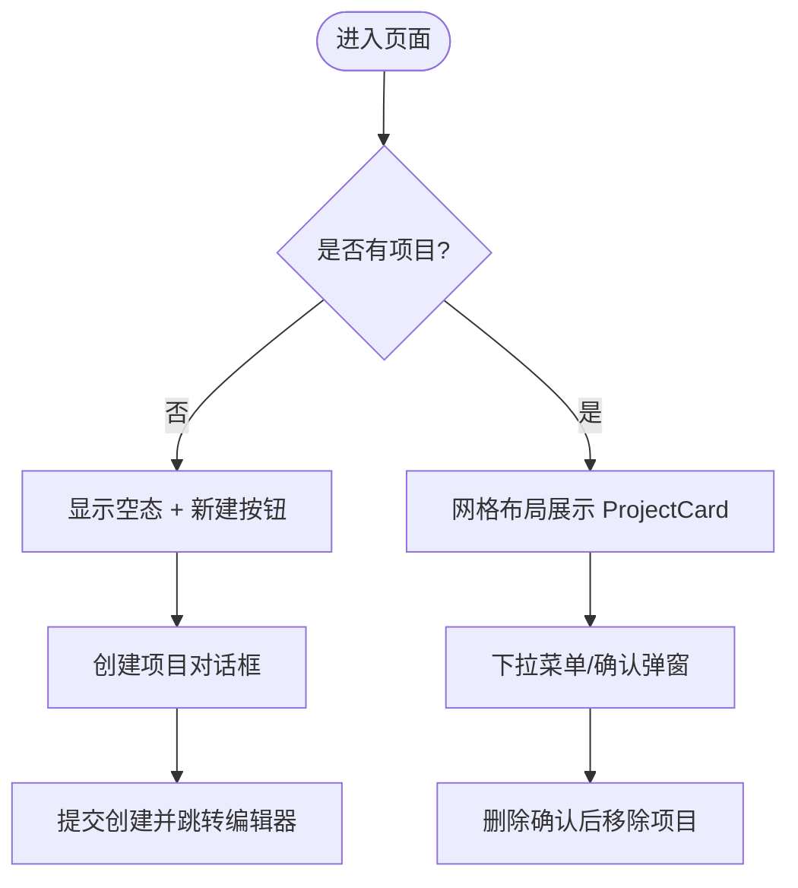
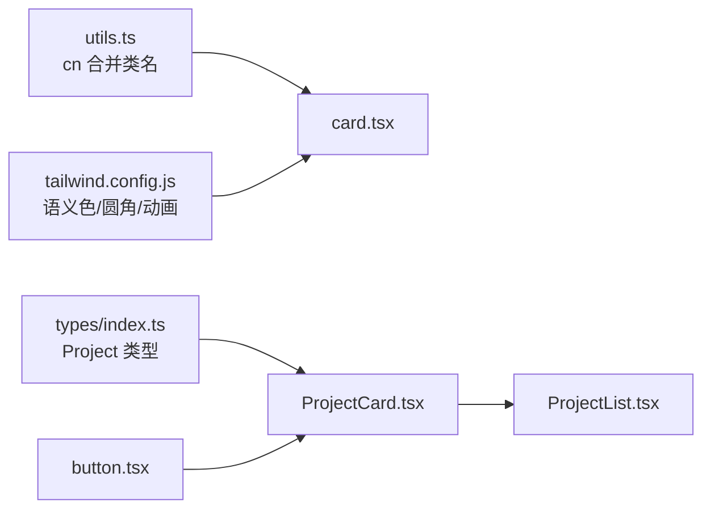

# 卡片组件 (Card)

<cite>
**本文引用的文件**
- [card.tsx](file://manga-creator/src/components/ui/card.tsx)
- [ProjectCard.tsx](file://manga-creator/src/components/ProjectCard.tsx)
- [ProjectList.tsx](file://manga-creator/src/components/ProjectList.tsx)
- [button.tsx](file://manga-creator/src/components/ui/button.tsx)
- [types/index.ts](file://manga-creator/src/types/index.ts)
- [tailwind.config.js](file://manga-creator/tailwind.config.js)
- [utils.ts](file://manga-creator/src/lib/utils.ts)
</cite>

## 目录
1. [简介](#简介)
2. [项目结构](#项目结构)
3. [核心组件](#核心组件)
4. [架构总览](#架构总览)
5. [详细组件分析](#详细组件分析)
6. [依赖关系分析](#依赖关系分析)
7. [性能考量](#性能考量)
8. [故障排查指南](#故障排查指南)
9. [结论](#结论)
10. [附录](#附录)

## 简介
本文件围绕卡片组件（Card）展开，重点说明其作为项目展示容器的核心作用，尤其是其在 ProjectCard 中的应用。Card 提供了统一的容器结构（header、content、footer），并通过 children 实现内容投影，使上层组件可以灵活组合按钮、输入框、对话框等任意子元素，形成一致的视觉与交互体验。本文将系统梳理其结构组成、可定制区域、props 语义、响应式布局策略以及与 Tailwind 设计系统的契合方式，并给出在项目列表与编辑界面中的使用示例路径与最佳实践。

## 项目结构
- 卡片组件位于 UI 组件库目录，提供基础卡片容器与若干子区块组件，便于在业务组件中按需组合。
- ProjectCard 是业务层卡片，基于 Card 子区块组件构建项目卡片，内嵌按钮、下拉菜单、进度条等。
- ProjectList 使用网格布局展示多个 ProjectCard，并通过对话框与确认弹窗管理项目创建与删除。

图表来源
- [card.tsx](file://manga-creator/src/components/ui/card.tsx#L1-L77)
- [ProjectCard.tsx](file://manga-creator/src/components/ProjectCard.tsx#L1-L110)
- [ProjectList.tsx](file://manga-creator/src/components/ProjectList.tsx#L1-L196)
- [button.tsx](file://manga-creator/src/components/ui/button.tsx#L1-L58)

章节来源
- [card.tsx](file://manga-creator/src/components/ui/card.tsx#L1-L77)
- [ProjectCard.tsx](file://manga-creator/src/components/ProjectCard.tsx#L1-L110)
- [ProjectList.tsx](file://manga-creator/src/components/ProjectList.tsx#L1-L196)

## 核心组件
- Card：通用容器，负责边框、背景、阴影与圆角等外观；通过 className 合并扩展样式。
- CardHeader：卡片头部区域，提供垂直方向的间距与内边距，适合放置标题与操作按钮。
- CardTitle：标题文本，强调字重与行高，适合作为主标题。
- CardDescription：描述文本，使用“muted”语义色，适合副标题或辅助信息。
- CardContent：内容区，提供内边距并去除顶部留白，适合放置表单、列表、进度条等。
- CardFooter：底部区，提供底部内边距与顶部留白，适合放置操作按钮组。

这些组件均通过 forwardRef 将 ref 透传给底层 div，并以 className 合并的方式接收外部样式，从而实现高度可定制与可组合。

章节来源
- [card.tsx](file://manga-creator/src/components/ui/card.tsx#L1-L77)

## 架构总览
Card 在业务层的典型用法是：ProjectCard 作为展示容器，内部组合 CardHeader/Title/Description/Content 与 Button/DropdownMenu 等 UI 组件，形成“项目卡片”的完整视图。ProjectList 则通过网格布局（grid）在不同屏幕尺寸下自适应排列多个 ProjectCard。

图表来源
- [ProjectList.tsx](file://manga-creator/src/components/ProjectList.tsx#L120-L141)
- [ProjectCard.tsx](file://manga-creator/src/components/ProjectCard.tsx#L51-L108)
- [card.tsx](file://manga-creator/src/components/ui/card.tsx#L1-L77)
- [button.tsx](file://manga-creator/src/components/ui/button.tsx#L1-L58)

## 详细组件分析

### Card 容器与子区块
- 结构组成
  - header：CardHeader + CardTitle + CardDescription
  - content：CardContent
  - footer：CardFooter（本仓库中未直接使用）
- 可定制区域
  - 外层容器 Card 的 className 可用于覆盖圆角、边框、背景与阴影等外观。
  - 各子区块的 className 可用于微调内边距、间距与文字样式。
- props 语义
  - Card：接收 HTMLDivElement 的通用属性（如 onClick、className 等），通过 forwardRef 透传 ref。
  - 其他子区块：同理，接收对应 div 的通用属性并透传 ref。
- 内容投影模式
  - 通过 children 实现内容投影，上层组件可自由插入任意子元素（如 Button、DropdownMenu、Input 等）。

图表来源
- [card.tsx](file://manga-creator/src/components/ui/card.tsx#L1-L77)

章节来源
- [card.tsx](file://manga-creator/src/components/ui/card.tsx#L1-L77)

### ProjectCard：项目卡片
- 结构与职责
  - 使用 CardHeader 展示标题与创建时间，右侧放置下拉菜单按钮。
  - 使用 CardContent 展示项目风格标签与工作流进度条。
  - 通过 Button 与 DropdownMenu 提供打开/删除等操作。
- 关键交互
  - 点击卡片或菜单项触发 onOpen 回调。
  - 点击删除菜单项触发 onDelete 回调。
- 响应式与布局
  - 外层 Card 添加 hover 效果与缩放过渡，提升交互反馈。
  - 内部使用 flex 与 gap 控制标题与操作按钮的布局。

图表来源
- [ProjectCard.tsx](file://manga-creator/src/components/ProjectCard.tsx#L51-L108)
- [button.tsx](file://manga-creator/src/components/ui/button.tsx#L1-L58)

章节来源
- [ProjectCard.tsx](file://manga-creator/src/components/ProjectCard.tsx#L1-L110)
- [types/index.ts](file://manga-creator/src/types/index.ts#L43-L55)

### ProjectList：项目列表
- 结构与职责
  - 顶部操作栏包含标题与“新建项目”按钮。
  - 当无项目时显示引导文案与按钮；有项目时以网格布局展示多个 ProjectCard。
  - 使用对话框与确认弹窗管理项目创建与删除。
- 响应式布局
  - 使用 Tailwind 的 grid 与断点类在小屏到大屏之间自动调整列数（1/2/3 列）。

图表来源
- [ProjectList.tsx](file://manga-creator/src/components/ProjectList.tsx#L90-L141)
- [ProjectList.tsx](file://manga-creator/src/components/ProjectList.tsx#L144-L193)

章节来源
- [ProjectList.tsx](file://manga-creator/src/components/ProjectList.tsx#L1-L196)

## 依赖关系分析
- 组件依赖
  - ProjectCard 依赖 Card 子区块与 Button、DropdownMenu。
  - ProjectList 依赖 ProjectCard、Dialog、AlertDialog、Input、Label 等 UI 组件。
- 样式依赖
  - Card 使用 Tailwind 的语义颜色变量（如 card、primary、secondary、muted 等）。
  - 通过 cn 工具函数合并类名，保证样式优先级与一致性。
- 类型依赖
  - ProjectCard 接收 Project 类型，包含工作流状态与创建时间等字段。

图表来源
- [utils.ts](file://manga-creator/src/lib/utils.ts#L1-L7)
- [tailwind.config.js](file://manga-creator/tailwind.config.js#L1-L94)
- [types/index.ts](file://manga-creator/src/types/index.ts#L43-L55)
- [button.tsx](file://manga-creator/src/components/ui/button.tsx#L1-L58)
- [ProjectCard.tsx](file://manga-creator/src/components/ProjectCard.tsx#L1-L110)
- [ProjectList.tsx](file://manga-creator/src/components/ProjectList.tsx#L1-L196)

章节来源
- [utils.ts](file://manga-creator/src/lib/utils.ts#L1-L7)
- [tailwind.config.js](file://manga-creator/tailwind.config.js#L1-L94)
- [types/index.ts](file://manga-creator/src/types/index.ts#L43-L55)
- [button.tsx](file://manga-creator/src/components/ui/button.tsx#L1-L58)
- [ProjectCard.tsx](file://manga-creator/src/components/ProjectCard.tsx#L1-L110)
- [ProjectList.tsx](file://manga-creator/src/components/ProjectList.tsx#L1-L196)

## 性能考量
- 渲染开销
  - Card 子区块均为轻量 div 包装，开销极低。
  - ProjectCard 中的进度条使用内联样式宽度，更新时仅触发局部重绘。
- 交互优化
  - Card 外层 hover 效果与缩放过渡在移动端可能影响性能，建议在低端设备上谨慎使用。
- 样式合并
  - 通过 cn 合并类名避免重复样式，减少 DOM 属性数量，有利于渲染性能。

[本节为通用性能讨论，不直接分析具体文件]

## 故障排查指南
- 样式不生效
  - 检查是否正确引入 tailwind.config.js 中的语义色与圆角配置。
  - 确认 cn 工具函数已正确合并类名，避免被后续样式覆盖。
- 交互冲突
  - 在 ProjectCard 中，下拉菜单触发器需要阻止事件冒泡，避免误触卡片点击。
- 响应式异常
  - 确保父容器使用 grid 与断点类（如 md:、lg:），并在不同屏幕尺寸下验证列数变化。

章节来源
- [tailwind.config.js](file://manga-creator/tailwind.config.js#L1-L94)
- [utils.ts](file://manga-creator/src/lib/utils.ts#L1-L7)
- [ProjectCard.tsx](file://manga-creator/src/components/ProjectCard.tsx#L63-L82)
- [ProjectList.tsx](file://manga-creator/src/components/ProjectList.tsx#L131-L140)

## 结论
Card 组件通过清晰的结构划分与内容投影机制，为项目卡片等业务容器提供了稳定且可定制的基础。在 ProjectCard 与 ProjectList 的实践中，Card 与 Button、DropdownMenu、Dialog 等组件协同，实现了从列表到编辑的完整工作流。借助 Tailwind 的语义色与网格系统，卡片在不同屏幕尺寸下保持一致的视觉与交互体验。

[本节为总结性内容，不直接分析具体文件]

## 附录

### Props 与语义说明（面向使用者）
- Card
  - 通用 HTMLDivElement 属性：className、onClick、ref 等。
  - 用途：作为卡片容器，承载 header/content/footer 子区块。
- CardHeader
  - 通用 HTMLDivElement 属性：className、ref 等。
  - 用途：卡片头部区域，适合放置标题与操作按钮。
- CardTitle
  - 通用 HTMLDivElement 属性：className、ref 等。
  - 用途：主标题，强调字重与行高。
- CardDescription
  - 通用 HTMLDivElement 属性：className、ref 等。
  - 用途：副标题或辅助信息，使用“muted”语义色。
- CardContent
  - 通用 HTMLDivElement 属性：className、ref 等。
  - 用途：内容区，适合放置表单、列表、进度条等。
- CardFooter
  - 通用 HTMLDivElement 属性：className、ref 等。
  - 用途：底部区，适合放置操作按钮组。

章节来源
- [card.tsx](file://manga-creator/src/components/ui/card.tsx#L1-L77)

### 在项目列表与编辑界面中的使用示例（路径指引）
- 项目列表（网格布局）
  - 示例路径：[ProjectList.tsx](file://manga-creator/src/components/ProjectList.tsx#L131-L140)
  - 说明：使用 grid 与断点类在不同屏幕尺寸下自动调整列数。
- 项目卡片（内容投影与交互）
  - 示例路径：[ProjectCard.tsx](file://manga-creator/src/components/ProjectCard.tsx#L51-L108)
  - 说明：通过 CardHeader/Title/Description/Content 组合，内嵌 Button 与 DropdownMenu。
- 按钮组件（与 Card 配合）
  - 示例路径：[button.tsx](file://manga-creator/src/components/ui/button.tsx#L1-L58)
  - 说明：Button 支持 variant/size/asChild 等变体，可与 Card 内部布局无缝配合。

章节来源
- [ProjectList.tsx](file://manga-creator/src/components/ProjectList.tsx#L131-L140)
- [ProjectCard.tsx](file://manga-creator/src/components/ProjectCard.tsx#L51-L108)
- [button.tsx](file://manga-creator/src/components/ui/button.tsx#L1-L58)

### 响应式设计与布局建议
- 使用 Tailwind 的 grid 与断点类（如 grid-cols-1、md:grid-cols-2、lg:grid-cols-3）控制卡片列数。
- 在卡片内部使用 flex 与 gap 控制标题、描述与操作按钮的布局。
- 通过 cn 合并类名，确保样式优先级与主题一致性。

章节来源
- [ProjectList.tsx](file://manga-creator/src/components/ProjectList.tsx#L131-L140)
- [card.tsx](file://manga-creator/src/components/ui/card.tsx#L1-L77)
- [utils.ts](file://manga-creator/src/lib/utils.ts#L1-L7)