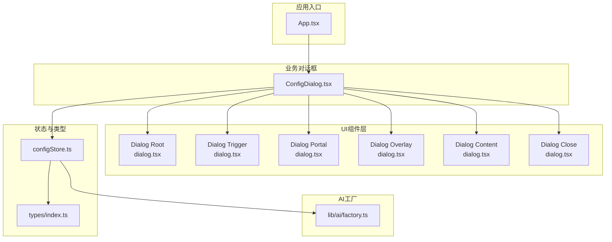
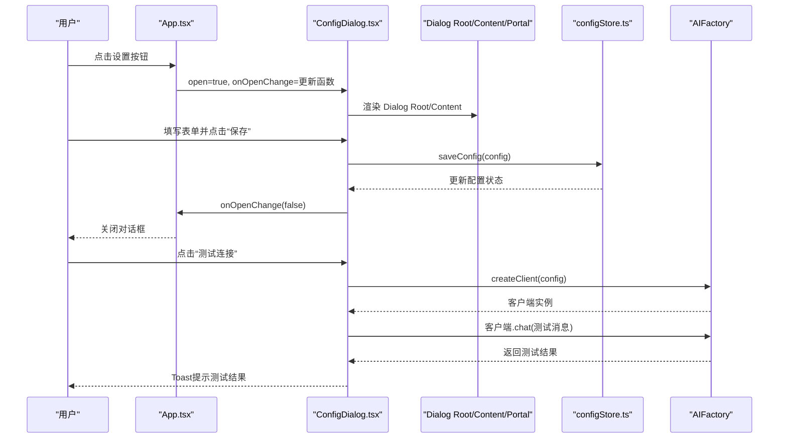
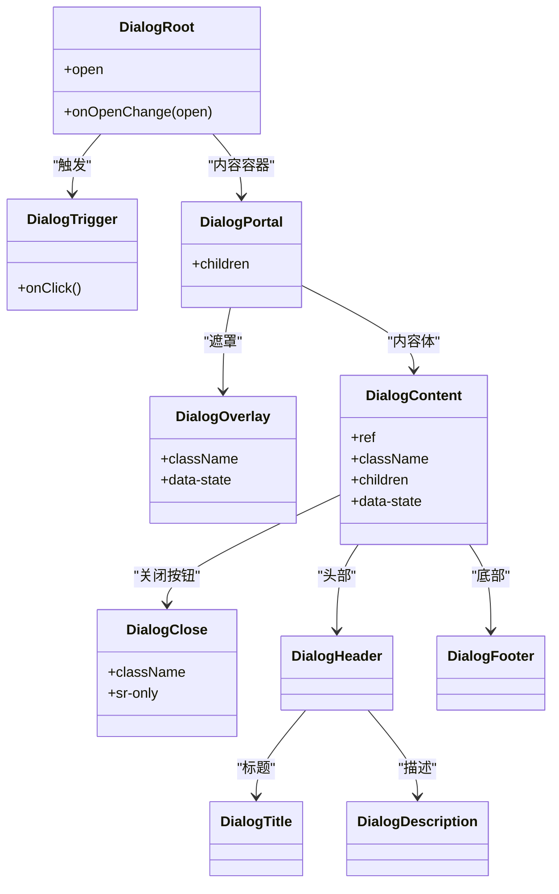
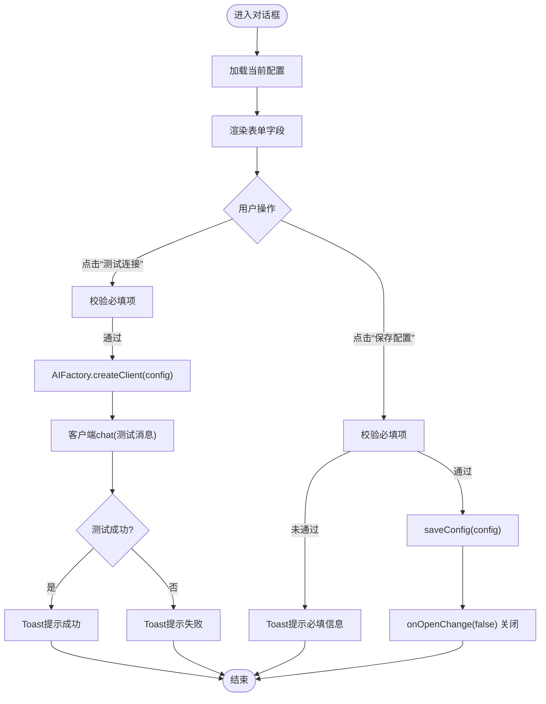
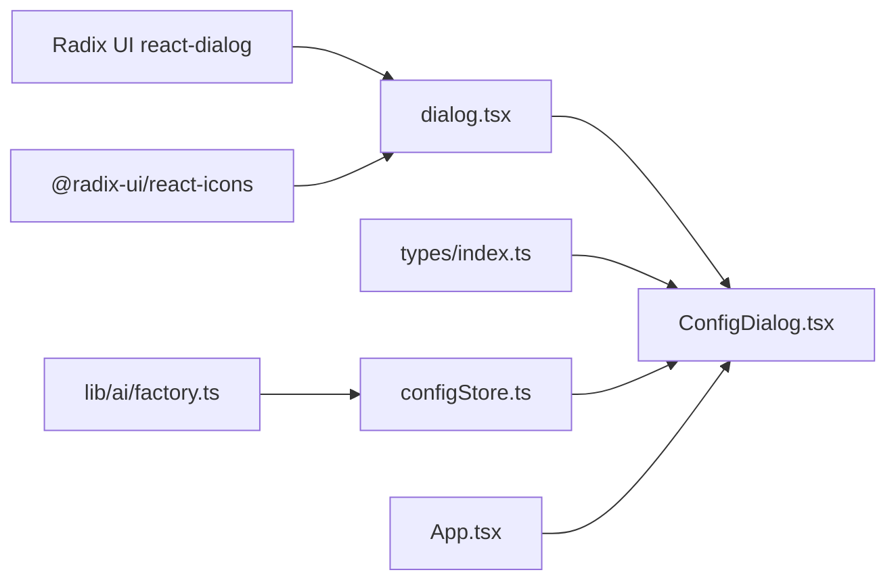

# 对话框组件 (Dialog)

<cite>
**本文引用的文件**
- [dialog.tsx](file://manga-creator/src/components/ui/dialog.tsx)
- [ConfigDialog.tsx](file://manga-creator/src/components/ConfigDialog.tsx)
- [configStore.ts](file://manga-creator/src/stores/configStore.ts)
- [App.tsx](file://manga-creator/src/App.tsx)
- [types/index.ts](file://manga-creator/src/types/index.ts)
- [factory.ts](file://manga-creator/src/lib/ai/factory.ts)
- [package-lock.json](file://manga-creator/package-lock.json)
</cite>

## 目录
1. [简介](#简介)
2. [项目结构](#项目结构)
3. [核心组件](#核心组件)
4. [架构总览](#架构总览)
5. [组件详解](#组件详解)
6. [依赖关系分析](#依赖关系分析)
7. [性能与可访问性](#性能与可访问性)
8. [故障排查指南](#故障排查指南)
9. [结论](#结论)
10. [附录](#附录)

## 简介
本文件围绕项目中的对话框组件进行系统化说明，重点阐述其在配置管理（如API密钥设置）中的关键作用。文档将深入解析基于 Radix UI 的非受控组件模式、open 与 onOpenChange 等核心控制属性、trigger 触发器与内容体的分离机制、通过 Portal 实现的层级管理，并结合 ConfigDialog.tsx 的实际用例，展示如何嵌入表单元素（如 Input、Select）与操作按钮。同时提供无障碍支持指导（焦点陷阱与屏幕阅读器兼容性）、常见问题排查步骤与最佳实践建议。

## 项目结构
该项目采用按功能模块组织的目录结构，对话框相关代码主要分布在以下位置：
- UI 组件层：components/ui/dialog.tsx 提供基于 Radix UI 的对话框封装
- 业务对话框：components/ConfigDialog.tsx 将对话框用于配置管理
- 应用入口：App.tsx 中以受控方式驱动 ConfigDialog 的打开/关闭
- 状态管理：stores/configStore.ts 提供配置读取、保存与连接测试
- 类型定义：types/index.ts 定义用户配置与供应商类型
- AI 客户端工厂：lib/ai/factory.ts 基于配置创建客户端实例

图表来源
- [App.tsx](file://manga-creator/src/App.tsx#L69-L76)
- [dialog.tsx](file://manga-creator/src/components/ui/dialog.tsx#L1-L122)
- [ConfigDialog.tsx](file://manga-creator/src/components/ConfigDialog.tsx#L1-L197)
- [configStore.ts](file://manga-creator/src/stores/configStore.ts#L1-L58)
- [types/index.ts](file://manga-creator/src/types/index.ts#L82-L91)
- [factory.ts](file://manga-creator/src/lib/ai/factory.ts#L44-L54)

章节来源
- [App.tsx](file://manga-creator/src/App.tsx#L69-L76)
- [dialog.tsx](file://manga-creator/src/components/ui/dialog.tsx#L1-L122)
- [ConfigDialog.tsx](file://manga-creator/src/components/ConfigDialog.tsx#L1-L197)
- [configStore.ts](file://manga-creator/src/stores/configStore.ts#L1-L58)
- [types/index.ts](file://manga-creator/src/types/index.ts#L82-L91)
- [factory.ts](file://manga-creator/src/lib/ai/factory.ts#L44-L54)

## 核心组件
- 基础对话框封装（基于 Radix UI）
  - Root、Trigger、Portal、Overlay、Content、Close、Title、Description、Header、Footer
  - 通过 forwardRef 包装 Content，内置 Portal 与 Overlay，实现层级与遮罩管理
- 业务对话框（配置管理）
  - 使用受控 open/onOpenChange 控制显示/隐藏
  - 内嵌表单元素（Select、Input、Label）与操作按钮（Button）
  - 集成配置存储与连接测试能力

章节来源
- [dialog.tsx](file://manga-creator/src/components/ui/dialog.tsx#L1-L122)
- [ConfigDialog.tsx](file://manga-creator/src/components/ConfigDialog.tsx#L1-L197)

## 架构总览
对话框在应用中的调用链路如下：
- App.tsx 通过状态变量控制 ConfigDialog 的 open/onOpenChange
- ConfigDialog 作为受控组件接收 open/onOpenChange，并在保存或测试后调用 onOpenChange(false) 关闭
- ConfigDialog 内部使用 UI 层的 Dialog Root/Content/Trigger/Portal 等组合
- 配置变更通过 configStore 保存并持久化，连接测试通过 AIFactory 创建客户端验证

图表来源
- [App.tsx](file://manga-creator/src/App.tsx#L69-L76)
- [ConfigDialog.tsx](file://manga-creator/src/components/ConfigDialog.tsx#L1-L197)
- [configStore.ts](file://manga-creator/src/stores/configStore.ts#L1-L58)
- [factory.ts](file://manga-creator/src/lib/ai/factory.ts#L44-L54)

## 组件详解

### 基础对话框封装（dialog.tsx）
- 非受控组件模式
  - Root、Trigger、Portal、Overlay、Content、Close 等均来自 @radix-ui/react-dialog
  - Content 内部包裹 Portal 与 Overlay，确保内容体独立渲染层级与遮罩
- 核心导出
  - Dialog、DialogTrigger、DialogPortal、DialogOverlay、DialogContent、DialogClose、DialogHeader、DialogFooter、DialogTitle、DialogDescription
- 关键实现要点
  - Content 使用 forwardRef 接收 ref 与 props，并在内部渲染 Portal 与 Overlay
  - Close 按钮包含 sr-only 文本，便于屏幕阅读器识别
  - 动画类名通过 data-[state=...] 切换，实现打开/关闭动画

图表来源
- [dialog.tsx](file://manga-creator/src/components/ui/dialog.tsx#L1-L122)

章节来源
- [dialog.tsx](file://manga-creator/src/components/ui/dialog.tsx#L1-L122)

### 业务对话框（ConfigDialog.tsx）
- 受控组件模式
  - open 与 onOpenChange 由父组件传入，用于控制显示/隐藏
  - 通过 useState 维护表单字段（provider、apiKey、baseURL、model）与交互状态（showApiKey、isTesting）
- 表单与操作
  - Select 选择供应商；Input 输入 API Key/Base URL/Model；Button 执行测试与保存
  - 保存时校验必填项，成功后调用 onOpenChange(false) 关闭对话框
  - 测试连接通过 AIFactory 创建客户端并发送测试消息，根据返回结果提示用户
- 与状态管理集成
  - 使用 useConfigStore 读取/保存配置与执行连接测试
  - 保存成功后更新 isConfigured 标志位

图表来源
- [ConfigDialog.tsx](file://manga-creator/src/components/ConfigDialog.tsx#L1-L197)
- [configStore.ts](file://manga-creator/src/stores/configStore.ts#L1-L58)
- [factory.ts](file://manga-creator/src/lib/ai/factory.ts#L44-L54)

章节来源
- [ConfigDialog.tsx](file://manga-creator/src/components/ConfigDialog.tsx#L1-L197)
- [configStore.ts](file://manga-creator/src/stores/configStore.ts#L1-L58)
- [types/index.ts](file://manga-creator/src/types/index.ts#L82-L91)
- [factory.ts](file://manga-creator/src/lib/ai/factory.ts#L44-L54)

### 触发器与内容体分离、Portal 层级管理
- 触发器与内容体分离
  - DialogTrigger 作为触发入口，Dialog Root/Content/Portal 独立渲染，实现“触发器与内容体”的解耦
- Portal 层级管理
  - Dialog Content 内部使用 DialogPortal，使内容体脱离父容器 DOM 结构，插入到指定挂载点，避免被父级样式或 overflow 影响
  - Overlay 与 Content 共同构成遮罩层，保证对话框层级高于其他内容

章节来源
- [dialog.tsx](file://manga-creator/src/components/ui/dialog.tsx#L1-L122)

### 在配置管理中的实际用例
- 打开/关闭控制
  - App.tsx 通过状态变量控制 ConfigDialog 的 open/onOpenChange，实现从菜单按钮打开配置对话框
- 表单元素嵌入
  - Select 用于选择供应商；Input 用于输入 API Key/Base URL/Model；Label 提供语义标签
- 操作按钮
  - 保存按钮：校验必填项后保存配置并关闭对话框
  - 测试按钮：异步测试连接，根据结果提示用户
- 与 AI 客户端集成
  - 通过 AIFactory.createClient(config) 创建客户端，执行 chat 调用进行连通性测试

章节来源
- [App.tsx](file://manga-creator/src/App.tsx#L69-L76)
- [ConfigDialog.tsx](file://manga-creator/src/components/ConfigDialog.tsx#L1-L197)
- [factory.ts](file://manga-creator/src/lib/ai/factory.ts#L44-L54)

## 依赖关系分析
- 外部依赖
  - @radix-ui/react-dialog：提供对话框原语（Root、Trigger、Portal、Overlay、Content、Close 等）
  - @radix-ui/react-icons：提供关闭图标
- 内部依赖
  - UI 层 dialog.tsx 依赖 Radix UI 原语与通用工具类
  - 业务层 ConfigDialog.tsx 依赖 UI 层组件、表单组件、Toast、store 与类型定义
  - configStore.ts 依赖存储与 AI 工厂
  - App.tsx 依赖 ConfigDialog 并传递 open/onOpenChange

图表来源
- [dialog.tsx](file://manga-creator/src/components/ui/dialog.tsx#L1-L122)
- [ConfigDialog.tsx](file://manga-creator/src/components/ConfigDialog.tsx#L1-L197)
- [configStore.ts](file://manga-creator/src/stores/configStore.ts#L1-L58)
- [types/index.ts](file://manga-creator/src/types/index.ts#L82-L91)
- [factory.ts](file://manga-creator/src/lib/ai/factory.ts#L44-L54)
- [App.tsx](file://manga-creator/src/App.tsx#L69-L76)

章节来源
- [package-lock.json](file://manga-creator/package-lock.json#L1485-L1695)
- [dialog.tsx](file://manga-creator/src/components/ui/dialog.tsx#L1-L122)
- [ConfigDialog.tsx](file://manga-creator/src/components/ConfigDialog.tsx#L1-L197)
- [configStore.ts](file://manga-creator/src/stores/configStore.ts#L1-L58)
- [types/index.ts](file://manga-creator/src/types/index.ts#L82-L91)
- [factory.ts](file://manga-creator/src/lib/ai/factory.ts#L44-L54)
- [App.tsx](file://manga-creator/src/App.tsx#L69-L76)

## 性能与可访问性
- 性能特性
  - 基于 Radix UI 的轻量原语，避免不必要的重渲染
  - Content 使用 forwardRef 与 data-state 动画切换，减少样式抖动
- 可访问性（A11y）
  - 关闭按钮包含 sr-only 文本，屏幕阅读器可读取“关闭”语义
  - DialogOverlay 与 Content 共同形成焦点陷阱，确保键盘焦点被限制在对话框内
  - 建议：为标题与描述提供明确的语义标签（DialogTitle/Description），提升屏幕阅读器体验
- 最佳实践
  - 避免在对话框中嵌套过多层级或复杂布局，保持焦点顺序清晰
  - 使用语义化标签与 aria 属性增强可访问性
  - 控制动画时长，避免影响可访问性工具的感知

[本节为通用指导，不直接分析具体文件，故无章节来源]

## 故障排查指南
- 对话框无法关闭
  - 检查父组件是否正确传递 onOpenChange，并在保存或测试成功后调用 onOpenChange(false)
  - 确认受控模式下的 open 值是否被外部状态正确更新
- 表单校验失败
  - 确保保存前对必填项（如 API Key、模型名称）进行校验
  - 若测试失败，检查供应商类型、Base URL 与模型名称是否匹配
- 连接测试异常
  - 确认 AIFactory.createClient(config) 能够根据配置创建客户端
  - 检查网络连通性与代理设置
- 嵌套对话框问题
  - 避免在同一页面中频繁打开多个对话框，以免造成层级混乱与焦点管理困难
  - 如确需嵌套，确保每个对话框都有独立的 open/onOpenChange 控制

章节来源
- [ConfigDialog.tsx](file://manga-creator/src/components/ConfigDialog.tsx#L44-L67)
- [configStore.ts](file://manga-creator/src/stores/configStore.ts#L45-L56)
- [factory.ts](file://manga-creator/src/lib/ai/factory.ts#L44-L54)

## 结论
本项目通过基于 Radix UI 的对话框封装与受控组件模式，实现了配置管理（尤其是 API 密钥设置）的简洁、可访问且可扩展的交互体验。Dialog Root/Content/Portal 的组合提供了良好的层级与遮罩管理；ConfigDialog 将表单与操作按钮整合，配合 configStore 与 AIFactory，完成了从配置录入到连接测试的闭环流程。遵循可访问性与最佳实践，可进一步提升用户体验与维护性。

[本节为总结性内容，不直接分析具体文件，故无章节来源]

## 附录
- 相关文件路径与职责
  - [dialog.tsx](file://manga-creator/src/components/ui/dialog.tsx)：对话框基础封装
  - [ConfigDialog.tsx](file://manga-creator/src/components/ConfigDialog.tsx)：配置管理对话框
  - [configStore.ts](file://manga-creator/src/stores/configStore.ts)：配置读取/保存/测试
  - [App.tsx](file://manga-creator/src/App.tsx)：应用入口与受控打开
  - [types/index.ts](file://manga-creator/src/types/index.ts)：类型定义
  - [factory.ts](file://manga-creator/src/lib/ai/factory.ts)：AI 客户端工厂
  - [package-lock.json](file://manga-creator/package-lock.json)：依赖版本

[本节为补充信息，不直接分析具体文件，故无章节来源]