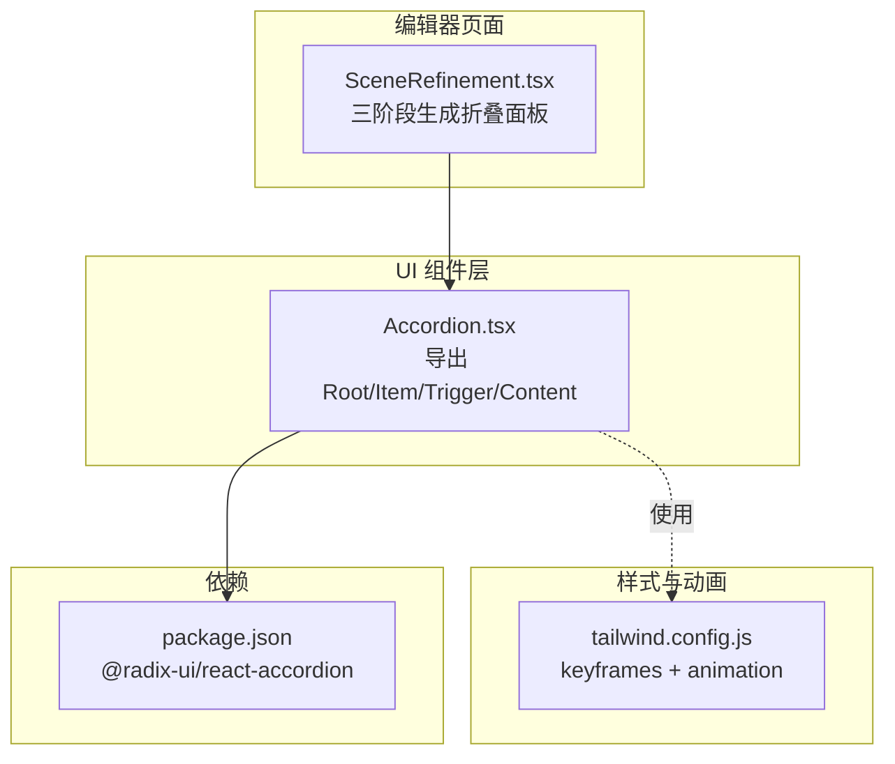
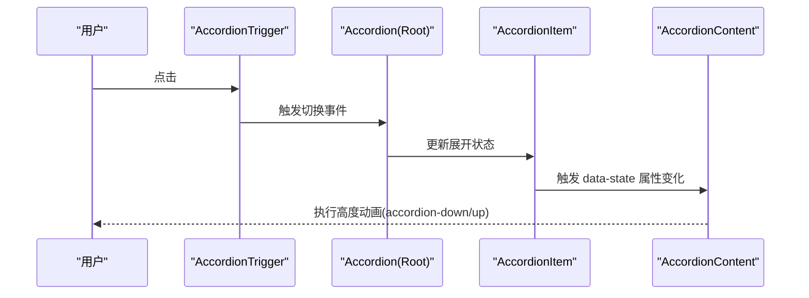
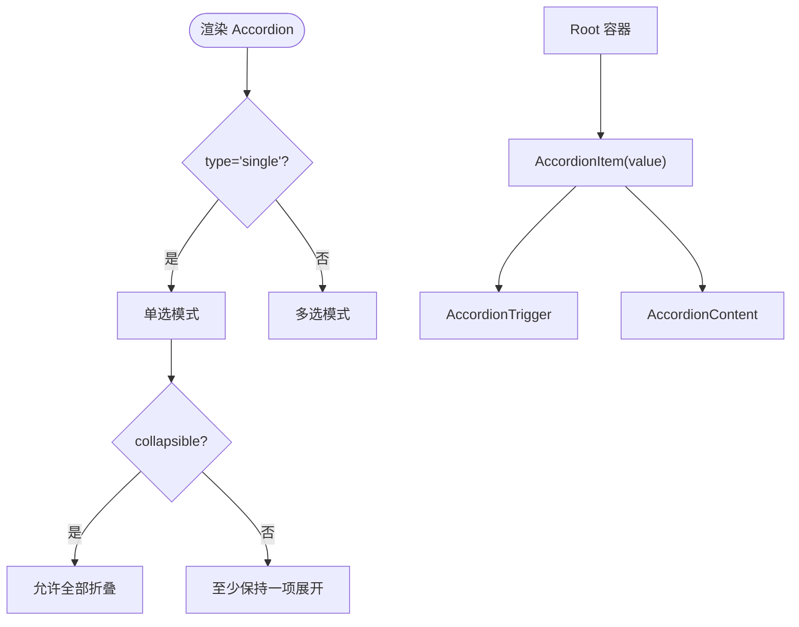
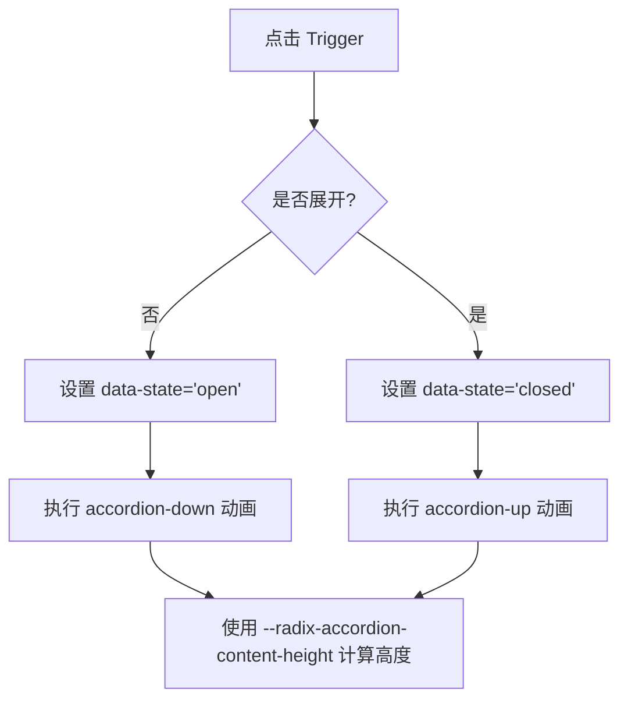
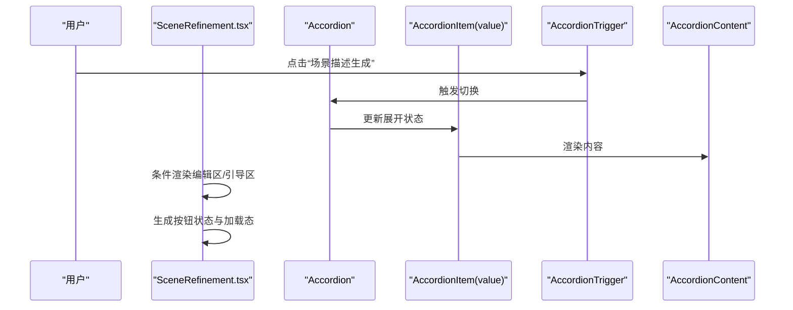
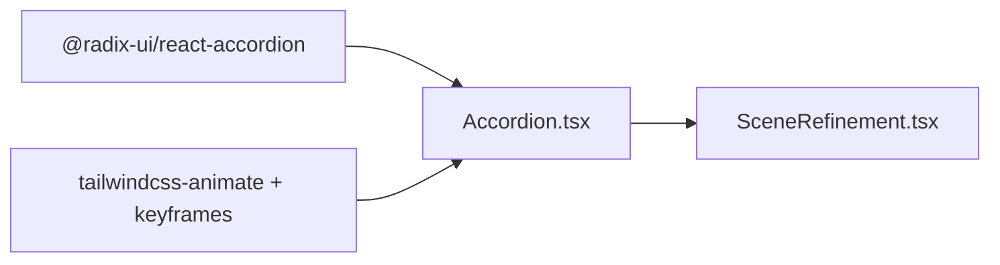

# 手风琴组件 (Accordion)

<cite>
**本文引用的文件**
- [accordion.tsx](file://manga-creator/src/components/ui/accordion.tsx)
- [SceneRefinement.tsx](file://manga-creator/src/components/editor/SceneRefinement.tsx)
- [tailwind.config.js](file://manga-creator/tailwind.config.js)
- [package.json](file://manga-creator/package.json)
</cite>

## 目录
1. [简介](#简介)
2. [项目结构](#项目结构)
3. [核心组件](#核心组件)
4. [架构总览](#架构总览)
5. [详细组件分析](#详细组件分析)
6. [依赖关系分析](#依赖关系分析)
7. [性能考量](#性能考量)
8. [故障排查指南](#故障排查指南)
9. [结论](#结论)
10. [附录](#附录)

## 简介
本文件围绕编辑器基础设定面板中的折叠区域管理能力，系统化梳理 Accordion 组件的受控与非受控模式、关键属性（如 value、onValueChange）、以及如何通过 AccordionItem、AccordionTrigger 和 AccordionContent 构建可交互的折叠结构。同时结合实际用例 SceneRefinement.tsx 展示多层级设置项的组织方式，并给出动画过渡效果（基于 CSS transition）与可访问性（如 aria-expanded 同步）的技术细节与最佳实践，帮助开发者避免常见错误并在内容动态加载时采取稳健策略。

## 项目结构
Accordion 组件位于 UI 组件层，作为通用交互部件被多个编辑器页面复用；动画由 Tailwind CSS 的 keyframes 与插件驱动；运行时依赖 Radix UI 的无障碍与状态管理。

图表来源
- [accordion.tsx](file://manga-creator/src/components/ui/accordion.tsx#L1-L56)
- [SceneRefinement.tsx](file://manga-creator/src/components/editor/SceneRefinement.tsx#L365-L570)
- [tailwind.config.js](file://manga-creator/tailwind.config.js#L49-L93)
- [package.json](file://manga-creator/package.json#L15-L33)

章节来源
- [accordion.tsx](file://manga-creator/src/components/ui/accordion.tsx#L1-L56)
- [SceneRefinement.tsx](file://manga-creator/src/components/editor/SceneRefinement.tsx#L365-L570)
- [tailwind.config.js](file://manga-creator/tailwind.config.js#L49-L93)
- [package.json](file://manga-creator/package.json#L15-L33)

## 核心组件
- Accordion：根容器，负责维护当前展开项的状态（受控/非受控），并提供 type、value、onValueChange 等属性。
- AccordionItem：折叠项容器，通常包含一个 Trigger 与一个 Content。
- AccordionTrigger：触发器，点击切换对应 Item 的展开/收起状态。
- AccordionContent：内容区，根据状态进行高度动画过渡。

这些组件均基于 Radix UI 的无障碍与状态机实现，确保键盘可达与屏幕阅读器友好。

章节来源
- [accordion.tsx](file://manga-creator/src/components/ui/accordion.tsx#L1-L56)

## 架构总览
下图展示了 Accordion 在编辑器页面中的典型使用路径：用户点击 Trigger -> Accordion 更新内部状态 -> Content 执行高度动画 -> UI 响应更新。

图表来源
- [accordion.tsx](file://manga-creator/src/components/ui/accordion.tsx#L22-L54)
- [SceneRefinement.tsx](file://manga-creator/src/components/editor/SceneRefinement.tsx#L365-L570)

## 详细组件分析

### 受控与非受控模式
- 非受控模式（Uncontrolled）
  - 不传入 value/onValueChange，由 Accordion 内部维护展开状态。
  - 适合简单场景，无需外部状态同步。
- 受控模式（Controlled）
  - 显式传入 value（当前展开项的值）与 onValueChange（状态变更回调），由父组件决定展开状态。
  - 适合需要与全局状态联动、跨面板同步或持久化的场景。

在实际页面中，三阶段生成的折叠面板使用了非受控模式（type="single" + collapsible），便于独立控制每个折叠项的状态。

章节来源
- [SceneRefinement.tsx](file://manga-creator/src/components/editor/SceneRefinement.tsx#L365-L570)

### 关键属性与用法
- type
  - 单选：type="single"，同一时间仅允许一项展开。
  - 多选：type="multiple"（本项目未使用）。
- collapsible
  - 允许全部折叠，即当前展开项可再次点击关闭。
- value
  - 受控模式下的当前展开项值（字符串）。
- onValueChange
  - 受控模式下的状态变更回调，接收新的展开项值或空值（当 collapsible 且再次点击已展开项时）。

章节来源
- [SceneRefinement.tsx](file://manga-creator/src/components/editor/SceneRefinement.tsx#L365-L570)

### 组件结构与嵌套规范
- 必须严格按顺序嵌套：Accordion > AccordionItem > AccordionTrigger + AccordionContent。
- 每个 AccordionItem 需提供唯一 value，用于标识该折叠项。
- AccordionTrigger 作为可点击区域，通常包裹标题与图标；AccordionContent 包裹具体内容。

图表来源
- [accordion.tsx](file://manga-creator/src/components/ui/accordion.tsx#L8-L54)
- [SceneRefinement.tsx](file://manga-creator/src/components/editor/SceneRefinement.tsx#L365-L570)

### 动画过渡效果（基于 CSS transition）
- 动画由 Tailwind keyframes 与 data-state 属性驱动：
  - data-state="open" -> 执行 accordion-down
  - data-state="closed" -> 执行 accordion-up
- 动画时长与缓动在 tailwind.config.js 中统一配置，组件类名直接引用对应动画名称。
- 高度计算依赖 Radix UI 提供的 --radix-accordion-content-height 变量，确保平滑过渡。

图表来源
- [accordion.tsx](file://manga-creator/src/components/ui/accordion.tsx#L42-L54)
- [tailwind.config.js](file://manga-creator/tailwind.config.js#L49-L93)

### 可访问性（aria-expanded 同步）
- Radix UI 会自动为 Trigger 设置 aria-expanded，值与 data-state 同步。
- 建议在复杂布局中为 Trigger 添加 aria-controls 指向对应 Content 的 id，提升屏幕阅读器体验。
- 键盘操作：Tab 到 Trigger，Space/Enter 切换；Esc 可在某些实现中关闭当前项（取决于 type/collapsible）。

章节来源
- [accordion.tsx](file://manga-creator/src/components/ui/accordion.tsx#L22-L54)

### 实际用例：三阶段生成的多层级设置组织
- 三阶段生成面板使用 Accordion 将“场景描述生成”“动作描述生成”“镜头提示词生成”三个步骤组织为独立折叠项。
- 每个阶段根据是否存在已有内容决定显示编辑区或引导区，并在生成过程中禁用按钮或显示加载态。
- 通过 value 标识各阶段，collapsible 允许用户自由切换查看不同阶段。

图表来源
- [SceneRefinement.tsx](file://manga-creator/src/components/editor/SceneRefinement.tsx#L365-L570)

章节来源
- [SceneRefinement.tsx](file://manga-creator/src/components/editor/SceneRefinement.tsx#L365-L570)

## 依赖关系分析
- 运行时依赖：@radix-ui/react-accordion 提供无障碍与状态管理。
- 样式依赖：tailwindcss-animate 插件与自定义 keyframes/animation，配合组件类名实现动画。
- 组件依赖：Accordion.tsx 作为薄封装，导出 Root/Item/Trigger/Content，供页面直接使用。

图表来源
- [package.json](file://manga-creator/package.json#L15-L33)
- [accordion.tsx](file://manga-creator/src/components/ui/accordion.tsx#L1-L56)
- [tailwind.config.js](file://manga-creator/tailwind.config.js#L49-L93)
- [SceneRefinement.tsx](file://manga-creator/src/components/editor/SceneRefinement.tsx#L365-L570)

章节来源
- [package.json](file://manga-creator/package.json#L15-L33)
- [accordion.tsx](file://manga-creator/src/components/ui/accordion.tsx#L1-L56)
- [tailwind.config.js](file://manga-creator/tailwind.config.js#L49-L93)
- [SceneRefinement.tsx](file://manga-creator/src/components/editor/SceneRefinement.tsx#L365-L570)

## 性能考量
- 动画性能：使用 CSS height 动画与 --radix-accordion-content-height，避免强制重排；尽量减少每帧 DOM 修改数量。
- 渲染优化：在内容区使用条件渲染（如存在已有内容时才渲染编辑区），降低不必要的子树渲染。
- 状态同步：受控模式下避免频繁 setState 导致的抖动，必要时使用防抖或批量更新策略。
- 大量折叠项：若折叠项数量较多，考虑虚拟滚动或延迟渲染，减少初始渲染压力。

## 故障排查指南
- 折叠项无法展开/收起
  - 检查是否正确嵌套：Accordion > AccordionItem > AccordionTrigger + AccordionContent。
  - 确认每个 AccordionItem 提供唯一 value。
  - 若使用受控模式，确保 onValueChange 正确更新父组件状态。
- 动画不生效
  - 确认 Tailwind 配置包含 keyframes 与 animation。
  - 确认组件类名包含 data-state 对应的动画类名。
- 可访问性问题
  - 确保 Trigger 具备可聚焦性，aria-expanded 与 data-state 同步。
  - 如需更明确的语义，为 Trigger 添加 aria-controls 指向对应 Content 的 id。
- 内容动态加载
  - 在内容首次可见时再渲染重型子树，避免一次性渲染大量节点。
  - 使用骨架屏或占位符，提升感知性能。
  - 对于异步数据，先显示“加载中”状态，完成后切换到编辑区，避免闪烁。

## 结论
Accordion 组件通过 Radix UI 的无障碍与状态机，结合 Tailwind 的动画系统，提供了稳定、可访问且高性能的折叠体验。在编辑器场景中，合理运用受控/非受控模式、正确的嵌套结构与动画配置，能够有效组织多层级设置项，提升用户的创作效率与体验。

## 附录
- 参考实现位置
  - 组件封装：[accordion.tsx](file://manga-creator/src/components/ui/accordion.tsx#L1-L56)
  - 页面用例：[SceneRefinement.tsx](file://manga-creator/src/components/editor/SceneRefinement.tsx#L365-L570)
  - 动画配置：[tailwind.config.js](file://manga-creator/tailwind.config.js#L49-L93)
  - 依赖声明：[package.json](file://manga-creator/package.json#L15-L33)