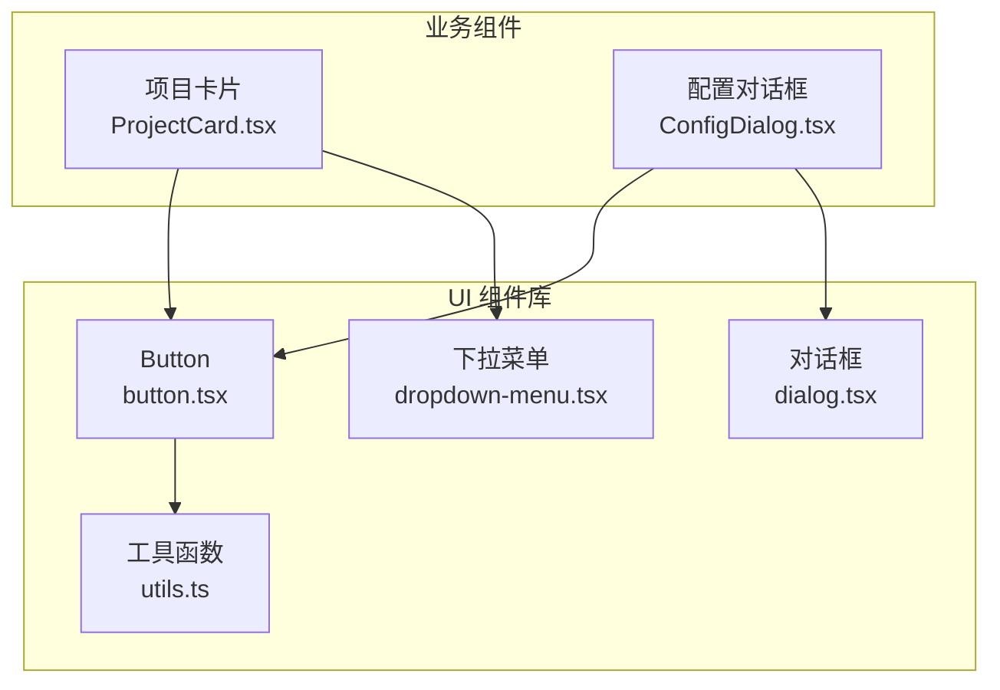
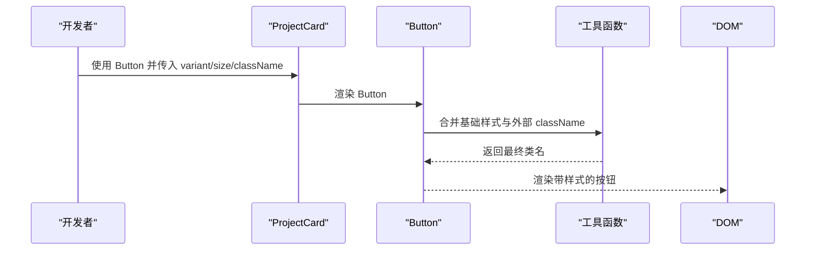
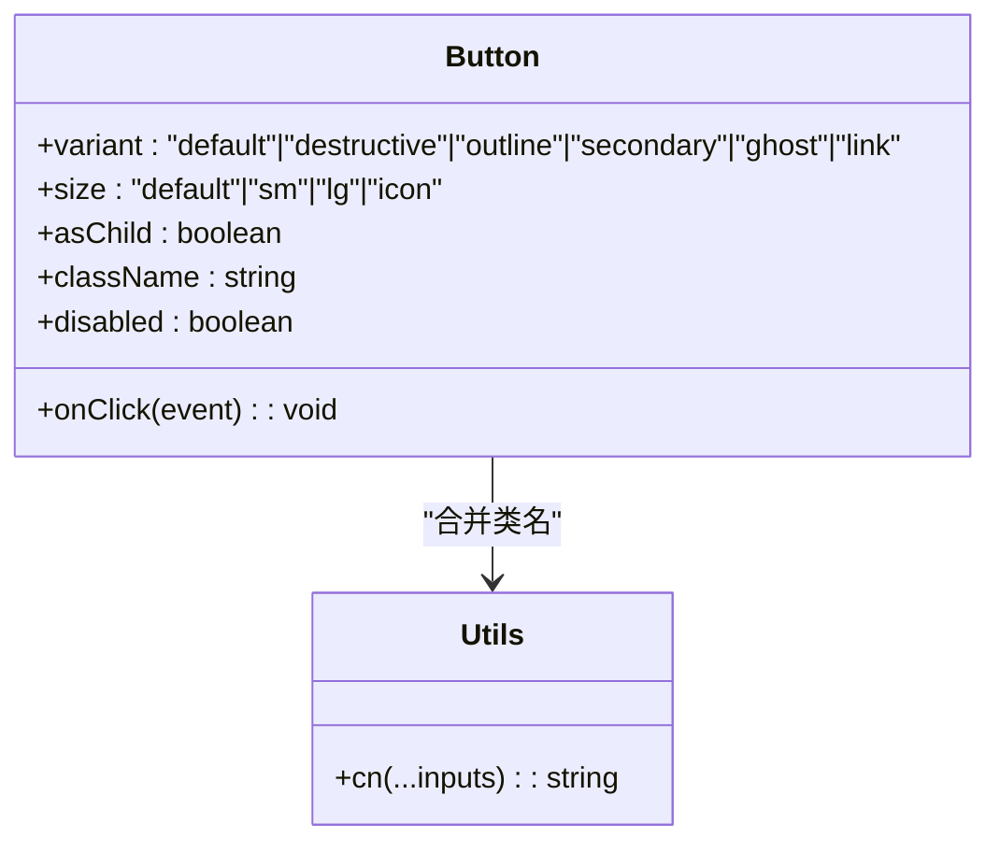
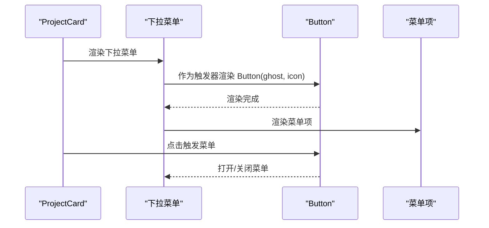
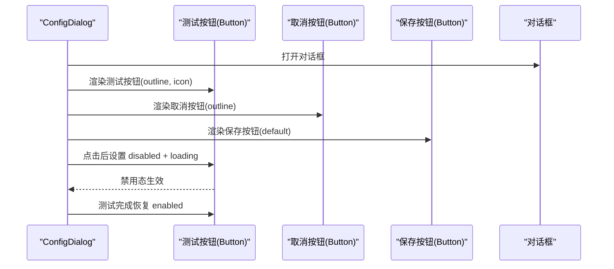
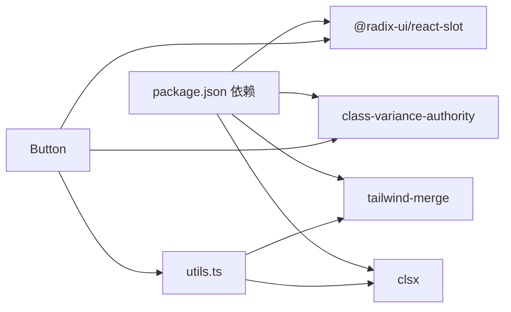

# 按钮组件 (Button)

<cite>
**本文引用的文件**
- [button.tsx](file://manga-creator/src/components/ui/button.tsx)
- [utils.ts](file://manga-creator/src/lib/utils.ts)
- [dialog.tsx](file://manga-creator/src/components/ui/dialog.tsx)
- [dropdown-menu.tsx](file://manga-creator/src/components/ui/dropdown-menu.tsx)
- [ProjectCard.tsx](file://manga-creator/src/components/ProjectCard.tsx)
- [ConfigDialog.tsx](file://manga-creator/src/components/ConfigDialog.tsx)
- [tailwind.config.js](file://manga-creator/tailwind.config.js)
- [package.json](file://manga-creator/package.json)
</cite>

## 目录
1. [简介](#简介)
2. [项目结构](#项目结构)
3. [核心组件](#核心组件)
4. [架构总览](#架构总览)
5. [详细组件分析](#详细组件分析)
6. [依赖关系分析](#依赖关系分析)
7. [性能考量](#性能考量)
8. [故障排查指南](#故障排查指南)
9. [结论](#结论)
10. [附录](#附录)

## 简介
本文件围绕项目中的 Button 组件展开，系统性说明其基于 Shadcn/ui 的设计思想与 Radix UI 的组合封装方式，完整文档化支持的 variant（如默认、破坏性、轮廓、次级、幽灵、链接）与 size（默认、小号、大号、图标）属性，以及公开的 props（如 disabled、loading、icon 等状态控制）。同时解释与 Tailwind CSS 类的整合机制，给出在 ProjectCard 和对话框中的实际使用示例路径，并说明如何通过 className 进行样式扩展以适配紫蓝渐变主题，最后覆盖无障碍访问要点与常见问题排查及性能优化建议。

## 项目结构
Button 组件位于 UI 组件库目录，采用“变体 + 尺寸”的组合式样式方案，结合工具函数实现类名合并与条件样式注入；其在业务组件中被广泛复用，例如 ProjectCard 的菜单触发按钮与 ConfigDialog 的操作按钮。

图表来源
- [button.tsx](file://manga-creator/src/components/ui/button.tsx#L1-L58)
- [utils.ts](file://manga-creator/src/lib/utils.ts#L1-L7)
- [dialog.tsx](file://manga-creator/src/components/ui/dialog.tsx#L1-L122)
- [dropdown-menu.tsx](file://manga-creator/src/components/ui/dropdown-menu.tsx#L1-L199)
- [ProjectCard.tsx](file://manga-creator/src/components/ProjectCard.tsx#L1-L110)
- [ConfigDialog.tsx](file://manga-creator/src/components/ConfigDialog.tsx#L1-L197)

章节来源
- [button.tsx](file://manga-creator/src/components/ui/button.tsx#L1-L58)
- [utils.ts](file://manga-creator/src/lib/utils.ts#L1-L7)
- [ProjectCard.tsx](file://manga-creator/src/components/ProjectCard.tsx#L1-L110)
- [ConfigDialog.tsx](file://manga-creator/src/components/ConfigDialog.tsx#L1-L197)
- [dialog.tsx](file://manga-creator/src/components/ui/dialog.tsx#L1-L122)
- [dropdown-menu.tsx](file://manga-creator/src/components/ui/dropdown-menu.tsx#L1-L199)

## 核心组件
- Button 组件：基于 Radix Slot 作为可插槽容器，使用 class-variance-authority 定义变体与尺寸，通过工具函数合并类名，支持 asChild 透传为子元素。
- 变体（variant）：default、destructive、outline、secondary、ghost、link。
- 尺寸（size）：default、sm、lg、icon。
- 公开 props：
  - 继承自原生 button 属性（如 onClick、disabled、aria-* 等）
  - variant、size（来自变体系统）
  - asChild（用于将 Button 渲染为子元素，常用于与 Radix 触发器配合）

章节来源
- [button.tsx](file://manga-creator/src/components/ui/button.tsx#L1-L58)

## 架构总览
Button 的样式由变体系统统一管理，运行时根据 variant 与 size 计算出基础样式类，再与外部传入的 className 合并，最终渲染到 DOM。该模式与 Tailwind CSS 主题变量无缝衔接，便于按需扩展。

图表来源
- [button.tsx](file://manga-creator/src/components/ui/button.tsx#L1-L58)
- [utils.ts](file://manga-creator/src/lib/utils.ts#L1-L7)
- [ProjectCard.tsx](file://manga-creator/src/components/ProjectCard.tsx#L1-L110)

## 详细组件分析

### Button 组件实现与样式系统
- 变体与尺寸定义：通过 class-variance-authority 的 cva 定义，包含默认、破坏性、轮廓、次级、幽灵、链接六种变体，以及默认、小号、大号、图标四种尺寸。
- 默认样式与交互：包含焦点可见轮廓、禁用态指针事件与透明度控制、SVG 子元素的尺寸与交互限制等。
- 渲染策略：使用 Radix Slot 作为可插槽容器，当 asChild 为真时渲染为子元素，否则渲染为 button 标签。
- 类名合并：通过工具函数将变体计算出的基础类与外部 className 合并，保证外部样式优先级。

图表来源
- [button.tsx](file://manga-creator/src/components/ui/button.tsx#L1-L58)
- [utils.ts](file://manga-creator/src/lib/utils.ts#L1-L7)

章节来源
- [button.tsx](file://manga-creator/src/components/ui/button.tsx#L1-L58)
- [utils.ts](file://manga-creator/src/lib/utils.ts#L1-L7)

### 支持的 variant 与 size
- 变体（variant）
  - default：主色背景与前景色，带阴影与悬停变暗效果
  - destructive：破坏性操作的背景与前景色，带阴影
  - outline：边框 + 背景 + 前景色，悬停高亮
  - secondary：次级背景与前景色，带阴影
  - ghost：仅悬停高亮，无底色
  - link：文本链接样式，带下划线与悬停下划线偏移
- 尺寸（size）
  - default：常规高度与内边距
  - sm：更小高度、圆角、内边距与字号
  - lg：更大高度与圆角、内边距
  - icon：方形图标按钮，适合菜单触发器

章节来源
- [button.tsx](file://manga-creator/src/components/ui/button.tsx#L1-L58)

### 公开 props 文档
- 继承自原生 button 的属性：onClick、disabled、aria-*、tabIndex、type 等
- 变体与尺寸：variant、size
- 插槽能力：asChild（用于与 Radix 触发器组合）
- 外部样式：className（用于扩展或覆盖样式）

章节来源
- [button.tsx](file://manga-creator/src/components/ui/button.tsx#L1-L58)

### 与 Tailwind CSS 的整合机制
- 主题变量：Tailwind 配置中定义了 primary、secondary、destructive、accent、muted、card、foreground、background、input、ring 等颜色变量，Button 的变体直接引用这些变量，确保与全局主题一致。
- 类名合并：工具函数负责合并基础类与外部类，避免冲突并保持优先级。
- SVG 子元素：Button 内部对 svg 子元素有特定尺寸与交互限制，确保图标按钮的一致性。

章节来源
- [tailwind.config.js](file://manga-creator/tailwind.config.js#L1-L94)
- [button.tsx](file://manga-creator/src/components/ui/button.tsx#L1-L58)
- [utils.ts](file://manga-creator/src/lib/utils.ts#L1-L7)

### 在 ProjectCard 中的使用
- 场景：项目卡片右上角的菜单触发按钮，使用 ghost 变体与 icon 尺寸，配合下拉菜单组件。
- 关键点：通过 asChild 与下拉菜单触发器配合，避免额外包裹层；点击事件通过阻止冒泡避免误触卡片打开。

图表来源
- [ProjectCard.tsx](file://manga-creator/src/components/ProjectCard.tsx#L1-L110)
- [dropdown-menu.tsx](file://manga-creator/src/components/ui/dropdown-menu.tsx#L1-L199)
- [button.tsx](file://manga-creator/src/components/ui/button.tsx#L1-L58)

章节来源
- [ProjectCard.tsx](file://manga-creator/src/components/ProjectCard.tsx#L1-L110)
- [dropdown-menu.tsx](file://manga-creator/src/components/ui/dropdown-menu.tsx#L1-L199)
- [button.tsx](file://manga-creator/src/components/ui/button.tsx#L1-L58)

### 在对话框中的使用
- 场景：配置对话框中，使用 outline 变体与 icon 尺寸的按钮作为显示/隐藏密钥的触发器；使用 default 变体与 outline 变体分别作为取消与保存按钮。
- 关键点：测试按钮在异步测试过程中会设置 disabled 与 loading 状态，按钮内部已内置禁用态样式，无需额外处理。

图表来源
- [ConfigDialog.tsx](file://manga-creator/src/components/ConfigDialog.tsx#L1-L197)
- [button.tsx](file://manga-creator/src/components/ui/button.tsx#L1-L58)
- [dialog.tsx](file://manga-creator/src/components/ui/dialog.tsx#L1-L122)

章节来源
- [ConfigDialog.tsx](file://manga-creator/src/components/ConfigDialog.tsx#L1-L197)
- [button.tsx](file://manga-creator/src/components/ui/button.tsx#L1-L58)
- [dialog.tsx](file://manga-creator/src/components/ui/dialog.tsx#L1-L122)

### 无障碍访问（ARIA 与 role）
- 默认 role：Button 组件渲染为原生 button，天然具备按钮语义与键盘可达性。
- 焦点与提示：组件内置焦点可见轮廓与 ring 样式，符合无障碍最佳实践。
- 禁用态：disabled 属性会自动应用禁用样式与交互限制，确保不可用状态清晰可见。
- 自定义 ARIA：如需扩展，可在外部传入 aria-* 属性（如 aria-label、aria-describedby）以增强可访问性。

章节来源
- [button.tsx](file://manga-creator/src/components/ui/button.tsx#L1-L58)

### 样式扩展与紫蓝渐变主题适配
- 扩展方式：通过 className 传入自定义类名，利用 Tailwind 主题变量与工具函数合并，实现对背景、边框、阴影、文字颜色等的覆盖。
- 渐变主题：可使用渐变色类（如 from-indigo-500 to-purple-600）与按钮变体组合，达到视觉统一。注意渐变类应与变体类共同作用，避免相互覆盖。
- 注意事项：当需要覆盖变体样式时，确保外部类名具有足够优先级；若使用插槽渲染，确认父容器的布局与对齐。

章节来源
- [button.tsx](file://manga-creator/src/components/ui/button.tsx#L1-L58)
- [utils.ts](file://manga-creator/src/lib/utils.ts#L1-L7)
- [tailwind.config.js](file://manga-creator/tailwind.config.js#L1-L94)

## 依赖关系分析
- 组件依赖
  - Button 依赖 Radix Slot 实现 asChild 插槽能力
  - Button 依赖 class-variance-authority 提供变体与尺寸系统
  - Button 依赖工具函数进行类名合并
- 外部依赖
  - Tailwind CSS 与 Tailwind Merge 提供样式系统与类名合并
  - Radix UI 生态（Dialog、Dropdown）与 Button 协同工作

图表来源
- [package.json](file://manga-creator/package.json#L1-L62)
- [button.tsx](file://manga-creator/src/components/ui/button.tsx#L1-L58)
- [utils.ts](file://manga-creator/src/lib/utils.ts#L1-L7)

章节来源
- [package.json](file://manga-creator/package.json#L1-L62)
- [button.tsx](file://manga-creator/src/components/ui/button.tsx#L1-L58)
- [utils.ts](file://manga-creator/src/lib/utils.ts#L1-L7)

## 性能考量
- 避免内联函数导致重渲染：在使用 Button 的容器组件中，尽量将事件处理器提升至外层或使用 useCallback 缓存，减少每次渲染创建新函数带来的开销。
- 类名合并成本：工具函数合并类名的成本极低，但在大量动态类名场景下仍建议复用稳定值，避免不必要的字符串拼接。
- 插槽渲染：asChild 渲染不会引入额外 DOM 节点，有助于减少层级与重排成本。

章节来源
- [button.tsx](file://manga-creator/src/components/ui/button.tsx#L1-L58)
- [utils.ts](file://manga-creator/src/lib/utils.ts#L1-L7)

## 故障排查指南
- 点击无响应
  - 检查 disabled 属性是否被设置为 true
  - 检查事件绑定是否正确传递到 Button 或其父容器
  - 若使用 asChild，请确认父级容器未拦截事件或阻止冒泡
- 样式不生效
  - 确认 className 是否与变体类冲突，必要时调整优先级
  - 检查 Tailwind 配置是否正确加载，颜色变量是否可用
- 渐变主题异常
  - 确认渐变类与按钮变体类共同存在且顺序合理
  - 检查是否存在覆盖性的外部样式导致渐变失效

章节来源
- [button.tsx](file://manga-creator/src/components/ui/button.tsx#L1-L58)
- [utils.ts](file://manga-creator/src/lib/utils.ts#L1-L7)
- [tailwind.config.js](file://manga-creator/tailwind.config.js#L1-L94)

## 结论
Button 组件通过变体与尺寸系统、Radix Slot 插槽能力与工具函数的类名合并，实现了高内聚、低耦合的 UI 组件封装。其与 Tailwind CSS 主题变量的深度集成，使得在不同场景下（如 ProjectCard、对话框）都能快速获得一致的视觉与交互体验。遵循无障碍与性能最佳实践，可进一步提升组件的可用性与稳定性。

## 附录
- 实际使用示例路径
  - ProjectCard 中的菜单触发按钮：[ProjectCard.tsx](file://manga-creator/src/components/ProjectCard.tsx#L1-L110)
  - ConfigDialog 中的测试按钮与操作按钮：[ConfigDialog.tsx](file://manga-creator/src/components/ConfigDialog.tsx#L1-L197)
- 相关组件参考
  - 对话框组件：[dialog.tsx](file://manga-creator/src/components/ui/dialog.tsx#L1-L122)
  - 下拉菜单组件：[dropdown-menu.tsx](file://manga-creator/src/components/ui/dropdown-menu.tsx#L1-L199)