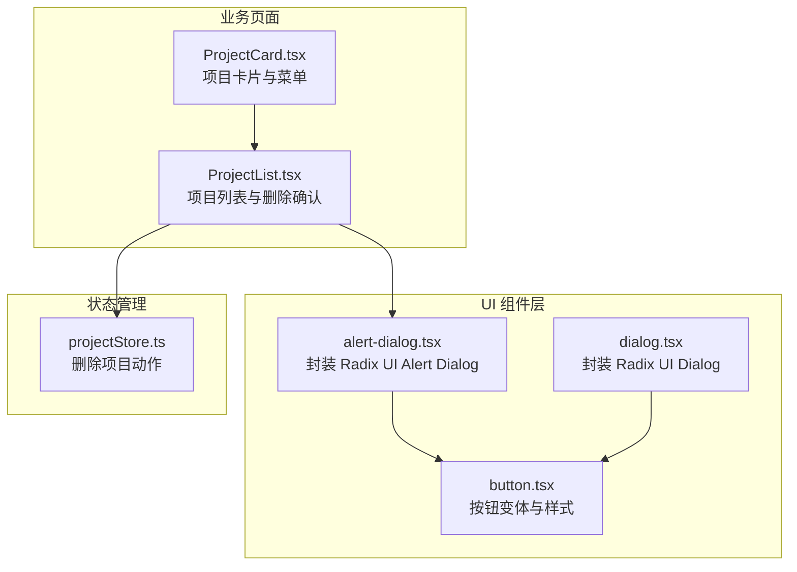
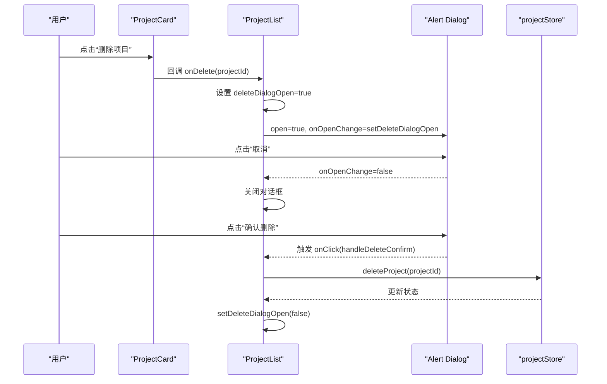
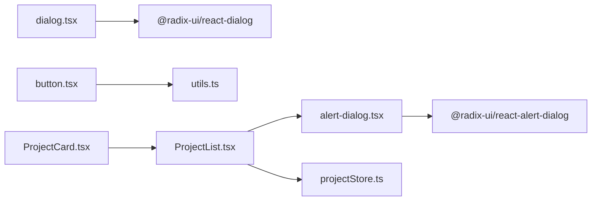
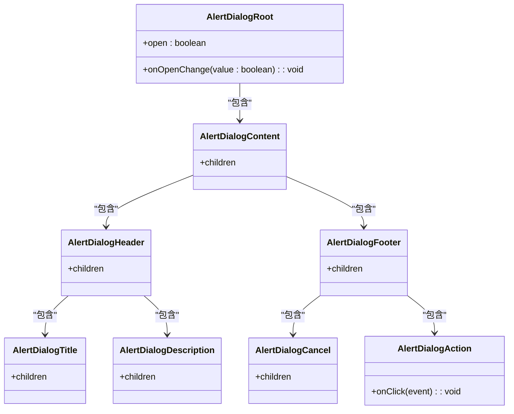

# 警示对话框组件（Alert Dialog）

<cite>
**本文引用的文件**
- [alert-dialog.tsx](file://manga-creator/src/components/ui/alert-dialog.tsx)
- [dialog.tsx](file://manga-creator/src/components/ui/dialog.tsx)
- [ProjectList.tsx](file://manga-creator/src/components/ProjectList.tsx)
- [ProjectCard.tsx](file://manga-creator/src/components/ProjectCard.tsx)
- [projectStore.ts](file://manga-creator/src/stores/projectStore.ts)
- [button.tsx](file://manga-creator/src/components/ui/button.tsx)
- [package-lock.json](file://manga-creator/package-lock.json)
</cite>

## 目录
1. [简介](#简介)
2. [项目结构](#项目结构)
3. [核心组件](#核心组件)
4. [架构总览](#架构总览)
5. [组件详解](#组件详解)
6. [依赖关系分析](#依赖关系分析)
7. [性能考量](#性能考量)
8. [故障排查指南](#故障排查指南)
9. [结论](#结论)
10. [附录](#附录)

## 简介
本专项文档聚焦“警示对话框组件（Alert Dialog）”，重点阐述其在执行危险操作（如项目删除）时的确认机制与行为约束。与普通对话框相比，警示对话框强调操作后果的视觉设计与强制用户响应，确保用户明确不可逆性，并通过语义化的取消与确认按钮、状态控制与无障碍要求，降低误操作风险。本文将结合项目管理流程中的实际使用场景，给出可复用的最佳实践与注意事项。

## 项目结构
警示对话框组件位于 UI 组件层，围绕 Radix UI 的 Alert Dialog 原子能力进行封装；在项目管理页面中，通过状态驱动实现“删除项目”的二次确认。

图表来源
- [alert-dialog.tsx](file://manga-creator/src/components/ui/alert-dialog.tsx#L1-L140)
- [dialog.tsx](file://manga-creator/src/components/ui/dialog.tsx#L1-L122)
- [button.tsx](file://manga-creator/src/components/ui/button.tsx#L1-L35)
- [ProjectList.tsx](file://manga-creator/src/components/ProjectList.tsx#L1-L196)
- [ProjectCard.tsx](file://manga-creator/src/components/ProjectCard.tsx#L1-L110)
- [projectStore.ts](file://manga-creator/src/stores/projectStore.ts#L68-L94)

章节来源
- [alert-dialog.tsx](file://manga-creator/src/components/ui/alert-dialog.tsx#L1-L140)
- [dialog.tsx](file://manga-creator/src/components/ui/dialog.tsx#L1-L122)
- [ProjectList.tsx](file://manga-creator/src/components/ProjectList.tsx#L1-L196)
- [ProjectCard.tsx](file://manga-creator/src/components/ProjectCard.tsx#L1-L110)
- [projectStore.ts](file://manga-creator/src/stores/projectStore.ts#L68-L94)

## 核心组件
- 警示对话框容器与内容：基于 Radix UI 的 Root、Content、Trigger、Portal、Overlay 等原子组件进行封装，提供标题、描述、头部、底部、取消与确认等子组件。
- 按钮样式：通过统一的按钮变体（默认/轮廓/破坏性等）为确认与取消按钮提供一致的视觉与交互反馈。
- 项目管理集成：在项目列表页中，以受控状态 open/onOpenChange 控制警示对话框的显示与隐藏，并在确认后执行删除动作。

章节来源
- [alert-dialog.tsx](file://manga-creator/src/components/ui/alert-dialog.tsx#L1-L140)
- [button.tsx](file://manga-creator/src/components/ui/button.tsx#L1-L35)
- [ProjectList.tsx](file://manga-creator/src/components/ProjectList.tsx#L173-L192)

## 架构总览
警示对话框在项目管理流程中的调用链路如下：用户在项目卡片中触发删除菜单项 → 页面状态打开警示对话框 → 用户选择取消或确认 → 确认时调用删除动作并关闭对话框。

图表来源
- [ProjectCard.tsx](file://manga-creator/src/components/ProjectCard.tsx#L63-L81)
- [ProjectList.tsx](file://manga-creator/src/components/ProjectList.tsx#L73-L87)
- [ProjectList.tsx](file://manga-creator/src/components/ProjectList.tsx#L173-L192)
- [projectStore.ts](file://manga-creator/src/stores/projectStore.ts#L83-L89)

## 组件详解

### 警示对话框与普通对话框的区别
- 设计意图与语义：
  - 警示对话框用于“危险/不可逆”操作，强调后果与强制确认，取消按钮通常为默认样式，确认按钮采用破坏性样式。
  - 普通对话框用于一般信息展示或非强制性交互，常包含关闭按钮与辅助操作。
- 结构差异：
  - 警示对话框提供 AlertDialogAction 与 AlertDialogCancel 子组件，分别对应确认与取消。
  - 普通对话框提供 DialogClose 子组件，用于关闭当前对话框。
- 行为差异：
  - 警示对话框更强调“必须显式确认”的交互，避免误触导致严重后果。
  - 普通对话框允许用户随时关闭，且关闭时不会触发业务动作。

章节来源
- [alert-dialog.tsx](file://manga-creator/src/components/ui/alert-dialog.tsx#L99-L126)
- [dialog.tsx](file://manga-creator/src/components/ui/dialog.tsx#L14-L19)
- [dialog.tsx](file://manga-creator/src/components/ui/dialog.tsx#L46-L49)

### cancel 与 action 按钮的语义角色
- 取消（AlertDialogCancel）：
  - 语义：放弃危险操作，返回原界面，不产生副作用。
  - 样式：采用“轮廓”变体，视觉上弱化破坏性，便于用户安全退出。
- 确认（AlertDialogAction）：
  - 语义：执行危险操作，不可逆，需用户再次确认。
  - 样式：采用“破坏性”变体，突出危险性，提醒用户谨慎操作。
- 在项目删除流程中：
  - 取消：关闭对话框，不删除项目。
  - 确认：调用删除动作并关闭对话框。

章节来源
- [alert-dialog.tsx](file://manga-creator/src/components/ui/alert-dialog.tsx#L111-L126)
- [button.tsx](file://manga-creator/src/components/ui/button.tsx#L1-L35)
- [ProjectList.tsx](file://manga-creator/src/components/ProjectList.tsx#L173-L192)

### 通过 onOpenChange 控制显示状态
- onOpenChange 是受控显示的关键属性，接收一个布尔值变化回调，用于同步外部状态。
- 在项目删除流程中：
  - 打开：点击“删除项目”后，将 deleteDialogOpen 设为 true。
  - 关闭：点击“取消”或“确认”后，将 deleteDialogOpen 设为 false。
- 注意：onOpenChange 会响应遮罩点击、Esc 键等默认关闭事件，保持与外部状态的一致性。

章节来源
- [ProjectList.tsx](file://manga-creator/src/components/ProjectList.tsx#L73-L87)
- [ProjectList.tsx](file://manga-creator/src/components/ProjectList.tsx#L173-L192)

### 项目管理流程中的使用示例
- 触发点：项目卡片的下拉菜单中“删除项目”项。
- 流程：
  - 用户点击“删除项目”，父组件设置 deleteDialogOpen 为 true。
  - 对话框显示标题、描述与两个按钮。
  - 用户点击“取消”或“确认”后，对话框关闭，删除动作仅在确认时执行。
- 删除动作：
  - 确认后调用 store 的 deleteProject 并更新本地状态。
  - 关闭对话框并提示用户操作结果。

章节来源
- [ProjectCard.tsx](file://manga-creator/src/components/ProjectCard.tsx#L63-L81)
- [ProjectList.tsx](file://manga-creator/src/components/ProjectList.tsx#L73-L87)
- [ProjectList.tsx](file://manga-creator/src/components/ProjectList.tsx#L173-L192)
- [projectStore.ts](file://manga-creator/src/stores/projectStore.ts#L83-L89)

### 无障碍要求与焦点策略
- 焦点策略：
  - 警示对话框应将初始焦点置于取消按钮，使用户在键盘导航时优先选择“安全退出”路径。
  - 当用户按下 Esc 或点击遮罩关闭时，焦点应回到触发源或保持在页面可控位置，避免丢失焦点。
- aria 属性建议：
  - 使用 aria-labelledby 与 aria-describedby 将标题与描述与对话框主体关联，提升读屏器上下文感知。
  - 为取消与确认按钮添加 aria-label 或可读文本，明确其语义与后果。
- 可访问性基础：
  - 警示对话框基于 Radix UI Alert Dialog 实现，具备默认的焦点陷阱与键盘交互行为，但具体焦点初始位置与 aria 属性需在业务层补充。

章节来源
- [alert-dialog.tsx](file://manga-creator/src/components/ui/alert-dialog.tsx#L1-L140)
- [package-lock.json](file://manga-creator/package-lock.json#L1478-L1505)

### 异常情况处理
- 点击遮罩或按 Esc 关闭：
  - onOpenChange 会收到 false，应确保对话框关闭且不执行删除动作。
  - 若需要在关闭时进行额外清理（如重置待删除项目 ID），可在 onOpenChange 内部处理。
- 确认按钮点击：
  - 确认后执行删除动作并关闭对话框，同时向用户反馈结果。
- 边界情况：
  - 项目不存在或已删除：在调用删除前进行校验，避免无效操作。
  - 网络或存储异常：在删除失败时保持对话框打开或提示错误，避免状态不一致。

章节来源
- [ProjectList.tsx](file://manga-creator/src/components/ProjectList.tsx#L73-L87)
- [ProjectList.tsx](file://manga-creator/src/components/ProjectList.tsx#L173-L192)
- [projectStore.ts](file://manga-creator/src/stores/projectStore.ts#L83-L89)

### 视觉设计与不可逆性提示
- 标题与描述：
  - 明确指出操作不可逆与影响范围，帮助用户做出知情决策。
- 按钮样式：
  - 取消按钮采用轮廓样式，确认按钮采用破坏性样式，强化视觉警示。
- 动画与过渡：
  - 内容组件提供进入/退出动画与淡入淡出效果，提升反馈感。

章节来源
- [alert-dialog.tsx](file://manga-creator/src/components/ui/alert-dialog.tsx#L46-L97)
- [alert-dialog.tsx](file://manga-creator/src/components/ui/alert-dialog.tsx#L111-L126)
- [ProjectList.tsx](file://manga-creator/src/components/ProjectList.tsx#L173-L192)

## 依赖关系分析
- 组件依赖：
  - 警示对话框依赖 Radix UI 的 Alert Dialog 原子组件，提供受控状态与可访问性基础。
  - 按钮样式依赖统一的按钮变体，保证视觉一致性。
- 业务依赖：
  - 项目列表页依赖项目存储的动作接口，完成删除与状态更新。
- 版本与兼容：
  - Radix UI Alert Dialog 与 Dialog 的依赖版本在包锁文件中声明，确保运行时兼容。

图表来源
- [alert-dialog.tsx](file://manga-creator/src/components/ui/alert-dialog.tsx#L1-L140)
- [dialog.tsx](file://manga-creator/src/components/ui/dialog.tsx#L1-L122)
- [button.tsx](file://manga-creator/src/components/ui/button.tsx#L1-L35)
- [ProjectList.tsx](file://manga-creator/src/components/ProjectList.tsx#L1-L196)
- [ProjectCard.tsx](file://manga-creator/src/components/ProjectCard.tsx#L1-L110)
- [projectStore.ts](file://manga-creator/src/stores/projectStore.ts#L68-L94)
- [package-lock.json](file://manga-creator/package-lock.json#L1478-L1505)

章节来源
- [package-lock.json](file://manga-creator/package-lock.json#L1478-L1505)

## 性能考量
- 渲染开销：
  - 警示对话框内容组件在打开时才挂载到 Portal，关闭时卸载，避免常驻 DOM。
- 动画与过渡：
  - 进入/退出动画与淡入淡出效果由原子组件提供，建议在复杂场景中避免过度嵌套或频繁切换。
- 状态同步：
  - onOpenChange 作为受控属性，应避免在回调中进行昂贵计算，保持快速响应。

章节来源
- [alert-dialog.tsx](file://manga-creator/src/components/ui/alert-dialog.tsx#L28-L44)
- [dialog.tsx](file://manga-creator/src/components/ui/dialog.tsx#L31-L53)

## 故障排查指南
- 对话框无法关闭：
  - 检查 onOpenChange 是否正确绑定到外部状态，确保在取消与确认后均能设为 false。
- 删除未生效：
  - 确认 handleDeleteConfirm 已被调用，且 store 的 deleteProject 正确执行。
- 焦点问题：
  - 若需要将初始焦点置于取消按钮，请在业务层补充焦点管理逻辑（例如通过 ref 或主动聚焦）。
- 读屏器体验：
  - 确保标题与描述通过 aria-labelledby/aria-describedby 与对话框主体关联，按钮具备清晰的 aria-label。

章节来源
- [ProjectList.tsx](file://manga-creator/src/components/ProjectList.tsx#L73-L87)
- [ProjectList.tsx](file://manga-creator/src/components/ProjectList.tsx#L173-L192)
- [projectStore.ts](file://manga-creator/src/stores/projectStore.ts#L83-L89)

## 结论
警示对话框组件通过语义化按钮、受控状态与无障碍设计，在项目删除等危险操作中提供了必要的确认与保护机制。结合项目管理流程的实际使用，建议在业务层补充焦点策略与 aria 属性，确保用户在任何交互方式下都能获得一致、安全、可访问的体验。

## 附录

### 类关系图（代码级）

图表来源
- [alert-dialog.tsx](file://manga-creator/src/components/ui/alert-dialog.tsx#L1-L140)