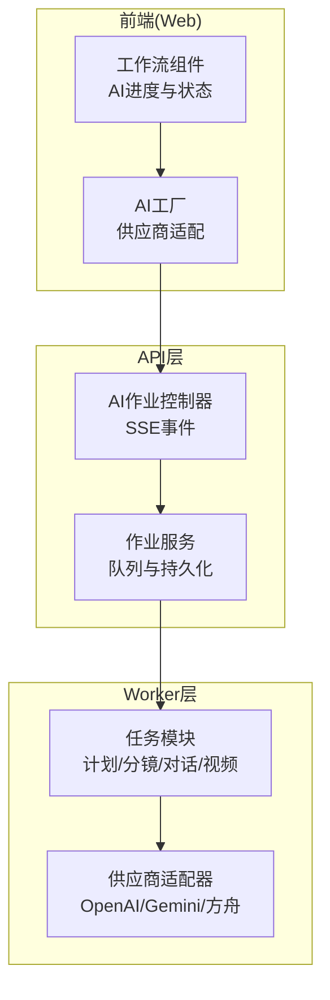
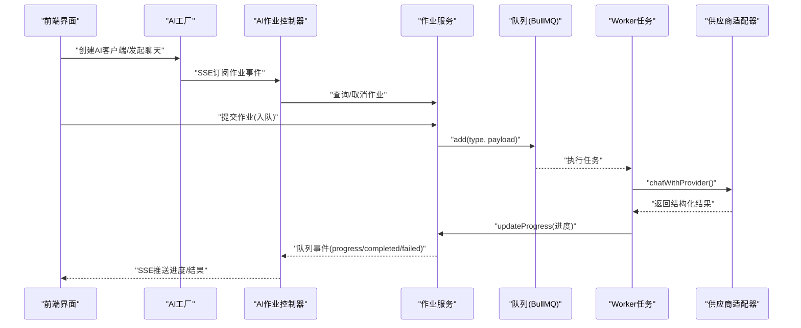
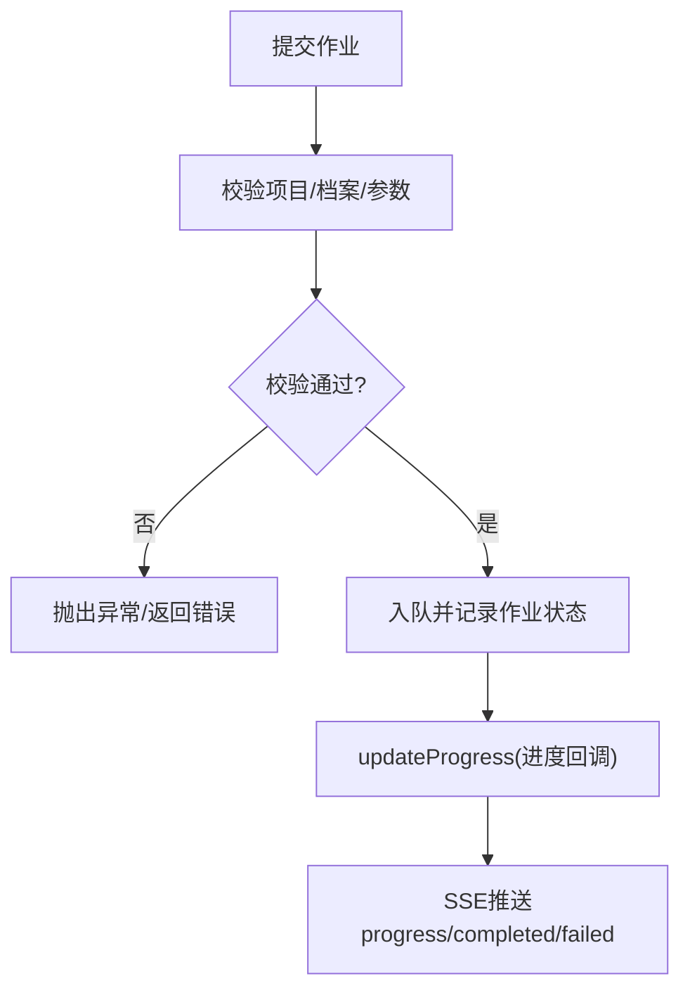
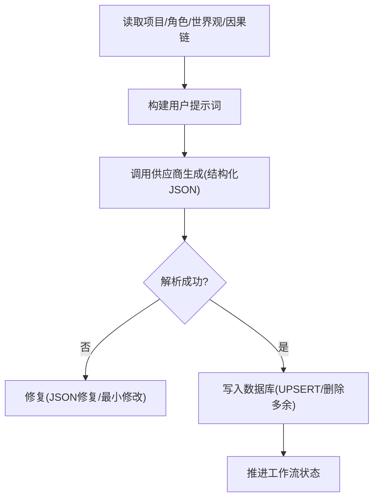
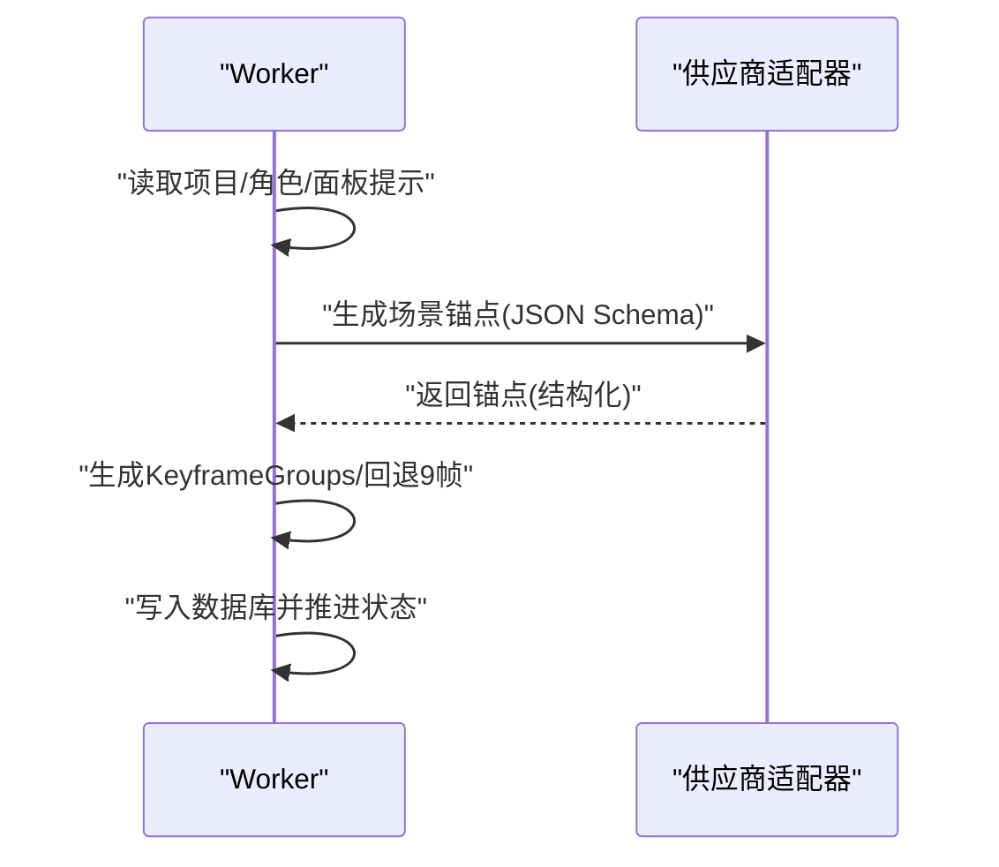
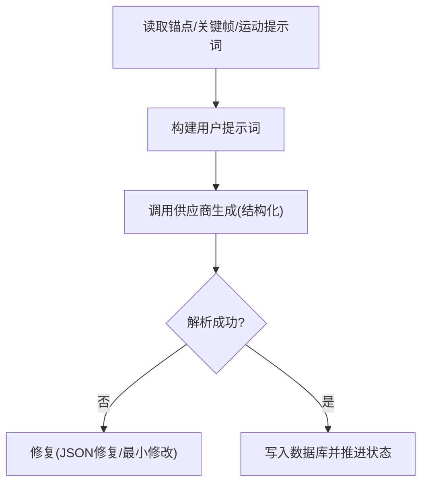
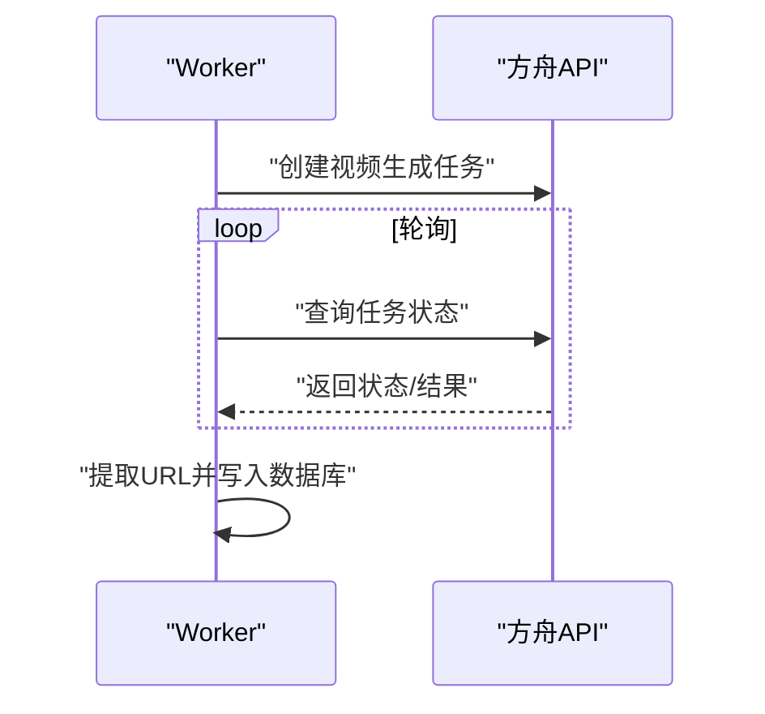
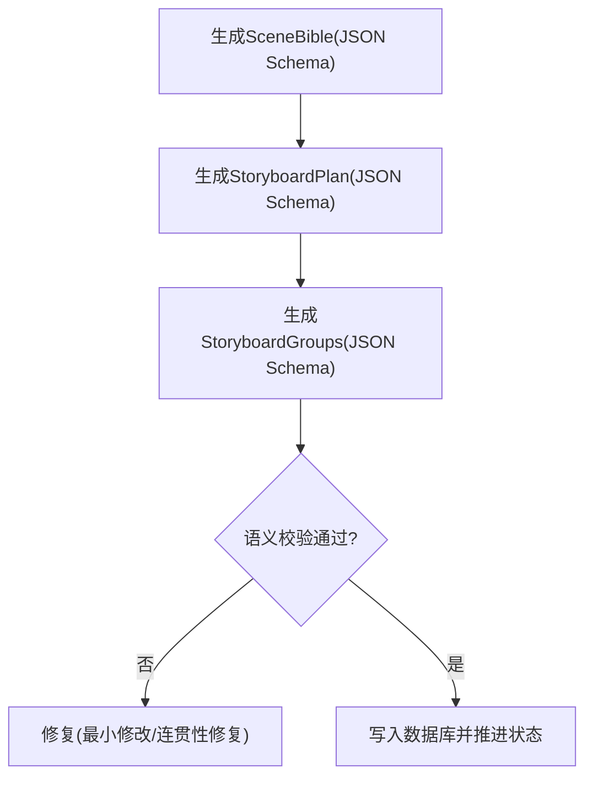
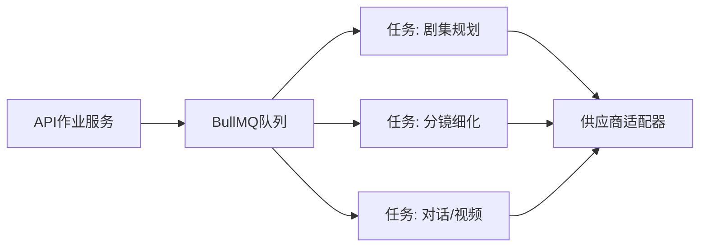

# AI任务实现

<cite>
**本文档引用的文件**
- [apps/api/src/jobs/jobs.service.ts](file://apps/api/src/jobs/jobs.service.ts)
- [apps/api/src/jobs/ai-jobs.controller.ts](file://apps/api/src/jobs/ai-jobs.controller.ts)
- [apps/web/src/lib/ai/factory.ts](file://apps/web/src/lib/ai/factory.ts)
- [apps/worker/src/providers/index.ts](file://apps/worker/src/providers/index.ts)
- [apps/worker/src/tasks/planEpisodes.ts](file://apps/worker/src/tasks/planEpisodes.ts)
- [apps/worker/src/tasks/generateEpisodeCoreExpression.ts](file://apps/worker/src/tasks/generateEpisodeCoreExpression.ts)
- [apps/worker/src/tasks/generateEpisodeSceneList.ts](file://apps/worker/src/tasks/generateEpisodeSceneList.ts)
- [apps/worker/src/tasks/generateSceneList.ts](file://apps/worker/src/tasks/generateSceneList.ts)
- [apps/worker/src/tasks/generateSceneAnchor.ts](file://apps/worker/src/tasks/generateSceneAnchor.ts)
- [apps/worker/src/tasks/generateDialogue.ts](file://apps/worker/src/tasks/generateDialogue.ts)
- [apps/worker/src/tasks/generateSceneVideo.ts](file://apps/worker/src/tasks/generateSceneVideo.ts)
- [apps/worker/src/tasks/refineSceneAll.ts](file://apps/worker/src/tasks/refineSceneAll.ts)
- [apps/worker/src/tasks/storyboard81.ts](file://apps/worker/src/tasks/storyboard81.ts)
</cite>

## 目录

1. [简介](#简介)
2. [项目结构](#项目结构)
3. [核心组件](#核心组件)
4. [架构总览](#架构总览)
5. [详细组件分析](#详细组件分析)
6. [依赖关系分析](#依赖关系分析)
7. [性能考量](#性能考量)
8. [故障排查指南](#故障排查指南)
9. [结论](#结论)
10. [附录](#附录)

## 简介

本技术文档面向AIXSSS的AI任务实现，系统梳理从场景生成、分镜细化、对话生成到视频生成的完整工作流。文档覆盖以下方面：

- 任务类型与职责边界：包括剧集规划、核心表达、分镜列表、场景锚点、关键帧提示词、运动提示词、对话生成、视频生成、分镜细化与81格分镜等。
- 输入输出格式与参数配置：明确各任务的输入上下文、结构化输出约束、JSON Schema校验与修复策略。
- 执行顺序与依赖关系：展示端到端工作流的步骤编排与状态流转。
- 状态管理与进度追踪：基于队列事件与进度回调的实时反馈机制。
- 结果处理与落库策略：事务性写入、去重与一致性保障。
- 扩展新AI任务的方法论：接口契约、提示词工程、结构化输出与错误恢复。

## 项目结构

AIXSSS采用前后端分离与任务执行解耦的设计：

- API层负责作业编排、鉴权、进度事件推送与作业查询。
- Web前端负责AI客户端封装、供应商适配与进度可视化。
- Worker层负责具体AI任务的提示词构建、调用供应商、结构化输出解析与数据库写入。

图表来源

- [apps/web/src/lib/ai/factory.ts](file://apps/web/src/lib/ai/factory.ts#L1-L98)
- [apps/api/src/jobs/ai-jobs.controller.ts](file://apps/api/src/jobs/ai-jobs.controller.ts#L1-L69)
- [apps/api/src/jobs/jobs.service.ts](file://apps/api/src/jobs/jobs.service.ts#L1-L1055)
- [apps/worker/src/providers/index.ts](file://apps/worker/src/providers/index.ts#L1-L44)

章节来源

- [apps/web/src/lib/ai/factory.ts](file://apps/web/src/lib/ai/factory.ts#L1-L98)
- [apps/api/src/jobs/ai-jobs.controller.ts](file://apps/api/src/jobs/ai-jobs.controller.ts#L1-L69)
- [apps/api/src/jobs/jobs.service.ts](file://apps/api/src/jobs/jobs.service.ts#L1-L1055)
- [apps/worker/src/providers/index.ts](file://apps/worker/src/providers/index.ts#L1-L44)

## 核心组件

- AI作业服务（API层）：封装作业入队、状态查询、取消与进度事件订阅，统一映射队列进度到API响应体。
- AI工厂（Web层）：根据运行模式（后端直连/本地直连）选择对应供应商适配器，统一流式输出与进度存储。
- 供应商适配器（Worker层）：抽象不同LLM/图像/视频供应商的聊天与生图接口，屏蔽差异。
- 任务模块（Worker层）：实现具体AI任务，包括提示词构建、结构化输出约束、解析与修复、数据库写入与状态推进。

章节来源

- [apps/api/src/jobs/jobs.service.ts](file://apps/api/src/jobs/jobs.service.ts#L1-L1055)
- [apps/api/src/jobs/ai-jobs.controller.ts](file://apps/api/src/jobs/ai-jobs.controller.ts#L1-L69)
- [apps/web/src/lib/ai/factory.ts](file://apps/web/src/lib/ai/factory.ts#L1-L98)
- [apps/worker/src/providers/index.ts](file://apps/worker/src/providers/index.ts#L1-L44)

## 架构总览

下图展示了从前端触发到Worker执行再到供应商响应的端到端流程，以及进度事件的推送路径。

图表来源

- [apps/web/src/lib/ai/factory.ts](file://apps/web/src/lib/ai/factory.ts#L1-L98)
- [apps/api/src/jobs/ai-jobs.controller.ts](file://apps/api/src/jobs/ai-jobs.controller.ts#L1-L69)
- [apps/api/src/jobs/jobs.service.ts](file://apps/api/src/jobs/jobs.service.ts#L1-L1055)
- [apps/worker/src/providers/index.ts](file://apps/worker/src/providers/index.ts#L1-L44)

## 详细组件分析

### 作业编排与进度追踪

- 入队与参数校验：API服务对项目、剧集、场景、AI档案进行存在性与完整性校验，确保工作流前置条件满足。
- 进度映射：将队列进度转换为API响应体，包含时间戳与进度数据。
- SSE事件：控制器监听队列事件，向订阅者推送初始化、进度、完成与失败事件。

图表来源

- [apps/api/src/jobs/jobs.service.ts](file://apps/api/src/jobs/jobs.service.ts#L101-L149)
- [apps/api/src/jobs/ai-jobs.controller.ts](file://apps/api/src/jobs/ai-jobs.controller.ts#L33-L65)

章节来源

- [apps/api/src/jobs/jobs.service.ts](file://apps/api/src/jobs/jobs.service.ts#L88-L149)
- [apps/api/src/jobs/ai-jobs.controller.ts](file://apps/api/src/jobs/ai-jobs.controller.ts#L15-L65)

### 场景生成与分镜规划

- 剧集规划（plan_episodes）：基于全局设定、画风、世界观、角色与叙事因果链，生成固定数量的剧集大纲，内置去重优化与JSON修复。
- 分镜列表（generate_episode_scene_list）：依据剧集核心表达与上一集内容，生成指定数量的分镜概要，确保与叙事骨架一致。
- 全局分镜（generate_scene_list）：在无剧集规划时，为默认第一集生成基础分镜列表。

图表来源

- [apps/worker/src/tasks/planEpisodes.ts](file://apps/worker/src/tasks/planEpisodes.ts#L387-L611)
- [apps/worker/src/tasks/generateEpisodeSceneList.ts](file://apps/worker/src/tasks/generateEpisodeSceneList.ts#L184-L326)
- [apps/worker/src/tasks/generateSceneList.ts](file://apps/worker/src/tasks/generateSceneList.ts#L19-L128)

章节来源

- [apps/worker/src/tasks/planEpisodes.ts](file://apps/worker/src/tasks/planEpisodes.ts#L387-L611)
- [apps/worker/src/tasks/generateEpisodeSceneList.ts](file://apps/worker/src/tasks/generateEpisodeSceneList.ts#L184-L326)
- [apps/worker/src/tasks/generateSceneList.ts](file://apps/worker/src/tasks/generateSceneList.ts#L19-L128)

### 场景锚点与关键帧提示词

- 场景锚点（generate_scene_anchor）：结合画风、当前与上一分镜概要，生成环境锁定的场景锚点，支持结构化输出修复。
- 关键帧提示词（refineSceneAll）：优先使用ActionBeats生成KeyframeGroups，回退到直接生成9帧关键帧提示词，确保序列感与连贯性。

图表来源

- [apps/worker/src/tasks/generateSceneAnchor.ts](file://apps/worker/src/tasks/generateSceneAnchor.ts#L33-L137)
- [apps/worker/src/tasks/refineSceneAll.ts](file://apps/worker/src/tasks/refineSceneAll.ts#L413-L477)

章节来源

- [apps/worker/src/tasks/generateSceneAnchor.ts](file://apps/worker/src/tasks/generateSceneAnchor.ts#L33-L137)
- [apps/worker/src/tasks/refineSceneAll.ts](file://apps/worker/src/tasks/refineSceneAll.ts#L413-L477)

### 对话生成与运动提示词

- 对话生成（generate_dialogue）：基于场景锚点、关键帧与运动提示词，生成结构化对白/旁白/独白/心理，具备输出修复与兜底策略。
- 运动提示词（refineSceneAll）：基于场景锚点与关键帧，生成连贯的运动/时空提示词，支持结构化输出修复。

图表来源

- [apps/worker/src/tasks/generateDialogue.ts](file://apps/worker/src/tasks/generateDialogue.ts#L111-L271)
- [apps/worker/src/tasks/refineSceneAll.ts](file://apps/worker/src/tasks/refineSceneAll.ts#L507-L547)

章节来源

- [apps/worker/src/tasks/generateDialogue.ts](file://apps/worker/src/tasks/generateDialogue.ts#L111-L271)
- [apps/worker/src/tasks/refineSceneAll.ts](file://apps/worker/src/tasks/refineSceneAll.ts#L507-L547)

### 视频生成

- 视频生成（generate_scene_video）：仅支持豆包/方舟(ARK)供应商，通过任务创建与轮询获取结果，提取视频URL并写入数据库。
- 超时与错误处理：统一的请求超时、轮询间隔与错误消息包装，便于前端提示。

图表来源

- [apps/worker/src/tasks/generateSceneVideo.ts](file://apps/worker/src/tasks/generateSceneVideo.ts#L140-L311)

章节来源

- [apps/worker/src/tasks/generateSceneVideo.ts](file://apps/worker/src/tasks/generateSceneVideo.ts#L140-L311)

### 分镜细化与81格分镜

- 分镜细化（refineSceneAll）：整合场景锚点、关键帧、运动与对话生成，推进至完成态，并维护面板脚本与指标。
- 81格分镜（storyboard81）：生成SceneBible、StoryboardPlan与StoryboardGroups，支持相机模式A/B校验与连贯性修复，提供翻译/回译能力。

图表来源

- [apps/worker/src/tasks/storyboard81.ts](file://apps/worker/src/tasks/storyboard81.ts#L553-L639)

章节来源

- [apps/worker/src/tasks/refineSceneAll.ts](file://apps/worker/src/tasks/refineSceneAll.ts#L661-L682)
- [apps/worker/src/tasks/storyboard81.ts](file://apps/worker/src/tasks/storyboard81.ts#L553-L639)

## 依赖关系分析

- 组件耦合
  - API层与Worker层通过队列解耦，API仅负责编排与事件推送，Worker专注任务执行。
  - Web前端通过AI工厂与API交互，AI工厂根据运行模式选择后端直连或本地直连。
  - Worker内部通过供应商适配器屏蔽不同供应商差异，任务模块仅依赖统一接口。
- 外部依赖
  - BullMQ队列：作业入队、重试、事件推送。
  - 供应商API：OpenAI兼容、Gemini、豆包/方舟。
  - Prisma：事务性写入与一致性保障。

图表来源

- [apps/api/src/jobs/jobs.service.ts](file://apps/api/src/jobs/jobs.service.ts#L1-L1055)
- [apps/worker/src/providers/index.ts](file://apps/worker/src/providers/index.ts#L1-L44)

章节来源

- [apps/api/src/jobs/jobs.service.ts](file://apps/api/src/jobs/jobs.service.ts#L1-L1055)
- [apps/worker/src/providers/index.ts](file://apps/worker/src/providers/index.ts#L1-L44)

## 性能考量

- 提示词长度与输出上限：针对长输出任务（如剧集规划）动态提升最大输出token，避免截断导致JSON不闭合。
- 结构化输出与修复：通过JSON Schema约束与“最小修改”修复策略，降低解析失败率与重试成本。
- 事务性写入：批量写入与删除操作在事务中执行，保证一致性与原子性。
- 超时与轮询：视频生成设置请求超时与轮询间隔，避免长时间阻塞与资源浪费。

## 故障排查指南

- 作业状态异常
  - 检查API层作业状态映射与队列事件是否正常推送。
  - 确认作业参数范围（如剧集数量、分镜数量）符合约束。
- 结构化输出解析失败
  - 使用任务内置修复流程（稳定参数、最小修改修复）。
  - 校验JSON Schema定义与供应商响应格式。
- 供应商调用失败
  - 检查API Key、BaseURL与模型配置。
  - 对于视频生成，确认方舟API Key格式与权限。
- 数据库写入失败
  - 查看事务日志与唯一索引冲突。
  - 确认项目/剧集/场景存在性与工作流状态一致性。

章节来源

- [apps/api/src/jobs/jobs.service.ts](file://apps/api/src/jobs/jobs.service.ts#L1-L1055)
- [apps/worker/src/tasks/planEpisodes.ts](file://apps/worker/src/tasks/planEpisodes.ts#L483-L521)
- [apps/worker/src/tasks/generateSceneVideo.ts](file://apps/worker/src/tasks/generateSceneVideo.ts#L70-L95)

## 结论

AIXSSS的AI任务实现通过清晰的任务边界、严格的结构化输出约束与完善的错误恢复机制，实现了从场景生成到视频产出的自动化流水线。API层、Web前端与Worker层的职责分离，使得系统具备良好的可扩展性与可维护性。后续扩展新任务时，建议遵循统一的提示词工程、结构化输出与修复策略，确保与现有工作流无缝集成。

## 附录

### 任务类型与输入输出要点

- 剧集规划（plan_episodes）
  - 输入：项目摘要、画风、世界观、角色、叙事因果链、目标剧集数
  - 输出：剧集数量与列表（含标题、logline、主要角色、节拍、场景范围、钩子）
  - 关键特性：去重优化、JSON修复、事务落库
- 核心表达（generate_episode_core_expression）
  - 输入：项目上下文、相邻剧集信息、本集outline
  - 输出：主题、情感弧、核心冲突、回报、视觉母题、结尾节拍、下一集钩子
- 分镜列表（generate_episode_scene_list / generate_scene_list）
  - 输入：项目/剧集/角色/因果链、上一集内容
  - 输出：分镜概要列表（限定数量）
- 场景锚点（generate_scene_anchor / refineSceneAll）
  - 输入：画风、当前/上一分镜、面板提示
  - 输出：环境锁定的场景描述（结构化）
- 关键帧提示词（refineSceneAll）
  - 输入：场景锚点、画风、角色
  - 输出：9帧关键帧提示词（结构化，含序列感约束）
- 运动提示词（refineSceneAll）
  - 输入：场景锚点、关键帧提示词
  - 输出：运动/时空提示词（结构化）
- 对话生成（generate_dialogue / refineSceneAll）
  - 输入：场景锚点、关键帧、运动提示词、角色
  - 输出：结构化对白/旁白/独白/心理
- 视频生成（generate_scene_video）
  - 输入：场景锚点、运动提示词
  - 输出：视频URL列表（写入数据库）
- 分镜细化（refineSceneAll）
  - 输入：面板脚本、动作节拍、角色
  - 输出：面板脚本版本、指标与最终完成态
- 81格分镜（storyboard81）
  - 输入：SceneBible、StoryboardPlan、相机模式
  - 输出：StoryboardGroups（含连贯性校验与修复）

章节来源

- [apps/worker/src/tasks/planEpisodes.ts](file://apps/worker/src/tasks/planEpisodes.ts#L387-L611)
- [apps/worker/src/tasks/generateEpisodeCoreExpression.ts](file://apps/worker/src/tasks/generateEpisodeCoreExpression.ts#L254-L425)
- [apps/worker/src/tasks/generateEpisodeSceneList.ts](file://apps/worker/src/tasks/generateEpisodeSceneList.ts#L184-L326)
- [apps/worker/src/tasks/generateSceneList.ts](file://apps/worker/src/tasks/generateSceneList.ts#L19-L128)
- [apps/worker/src/tasks/generateSceneAnchor.ts](file://apps/worker/src/tasks/generateSceneAnchor.ts#L33-L137)
- [apps/worker/src/tasks/refineSceneAll.ts](file://apps/worker/src/tasks/refineSceneAll.ts#L413-L694)
- [apps/worker/src/tasks/generateDialogue.ts](file://apps/worker/src/tasks/generateDialogue.ts#L111-L271)
- [apps/worker/src/tasks/generateSceneVideo.ts](file://apps/worker/src/tasks/generateSceneVideo.ts#L140-L311)
- [apps/worker/src/tasks/storyboard81.ts](file://apps/worker/src/tasks/storyboard81.ts#L553-L639)

### 扩展新AI任务方法论

- 明确任务边界与输入输出：定义JSON Schema与解析策略。
- 提示词工程：拆分系统提示与用户提示，注入上下文与约束。
- 结构化输出与修复：统一responseFormat与修复流程。
- 事务性写入：在任务结束时进行批量写入与状态推进。
- 进度与事件：通过updateProgress与SSE事件反馈执行状态。
- 供应商适配：在适配器层抽象接口，确保任务模块无感知。

章节来源

- [apps/worker/src/providers/index.ts](file://apps/worker/src/providers/index.ts#L1-L44)
- [apps/worker/src/tasks/planEpisodes.ts](file://apps/worker/src/tasks/planEpisodes.ts#L458-L462)
- [apps/worker/src/tasks/refineSceneAll.ts](file://apps/worker/src/tasks/refineSceneAll.ts#L255-L260)
