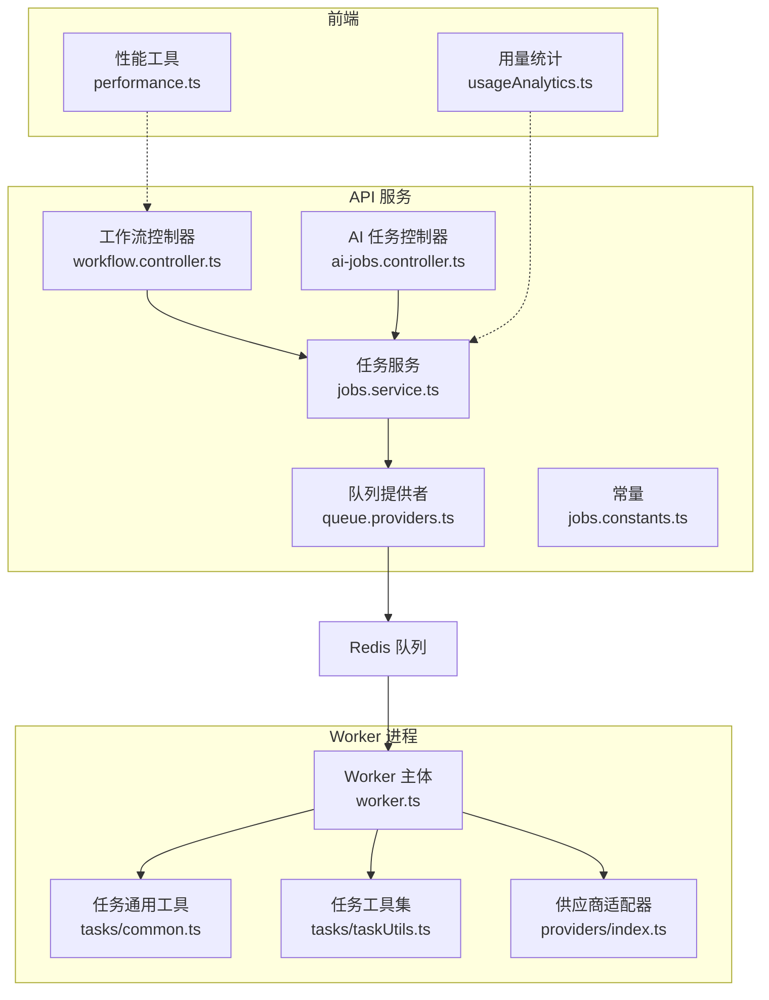
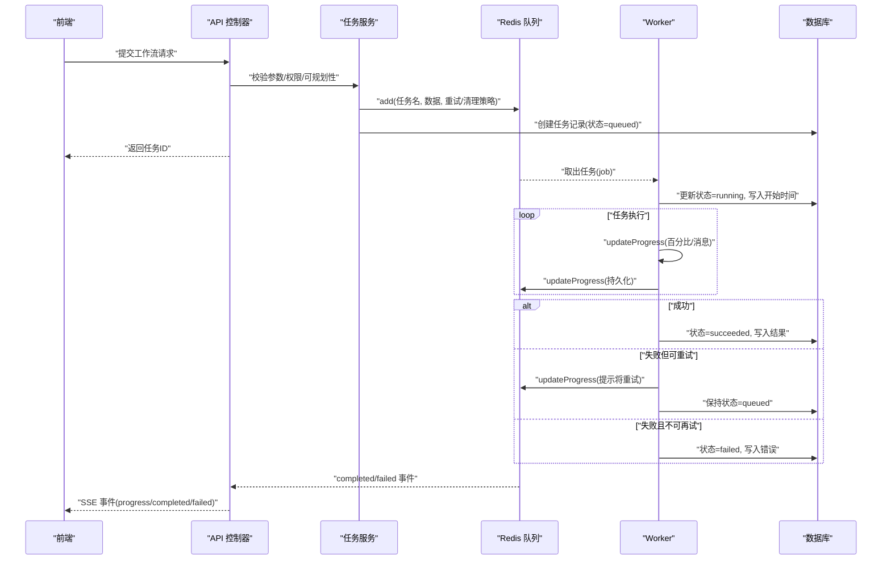
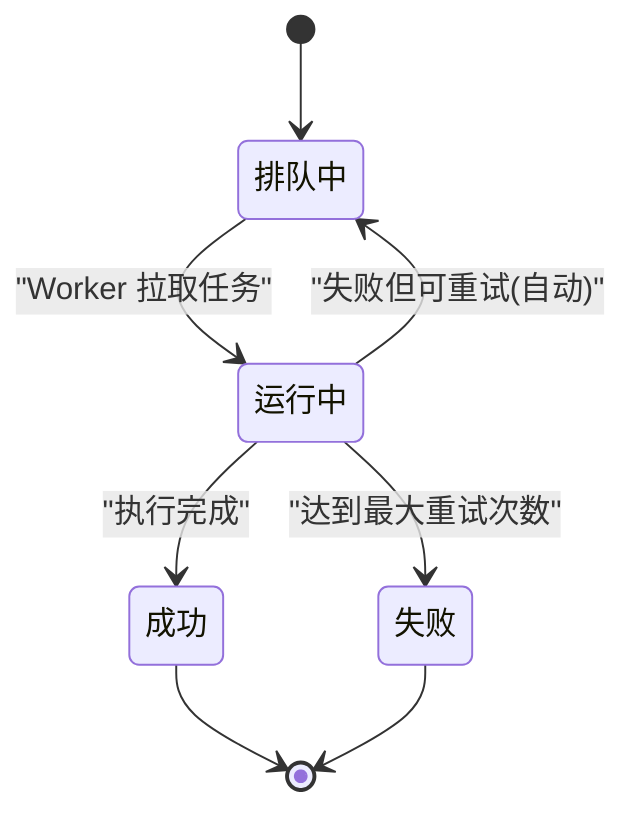
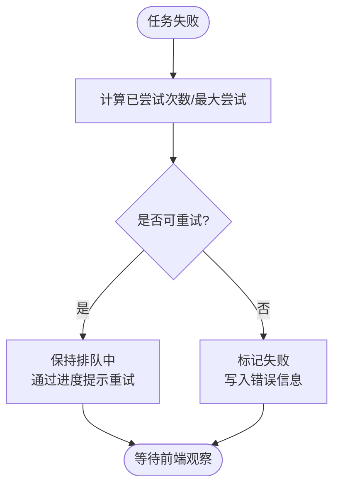
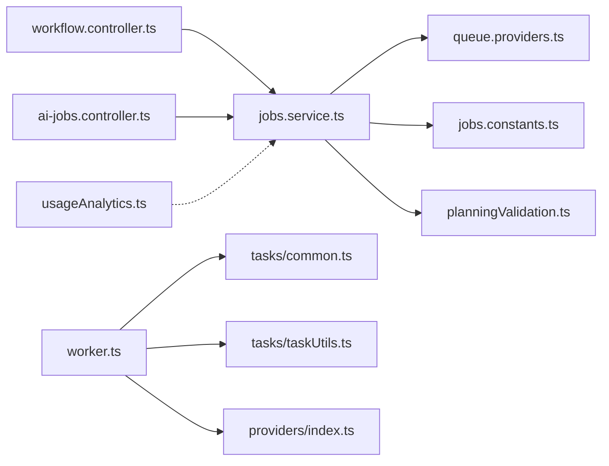

# 任务管理与调度

<cite>
**本文引用的文件**
- [apps/api/src/jobs/jobs.service.ts](file://apps/api/src/jobs/jobs.service.ts)
- [apps/api/src/jobs/ai-jobs.controller.ts](file://apps/api/src/jobs/ai-jobs.controller.ts)
- [apps/api/src/jobs/workflow.controller.ts](file://apps/api/src/jobs/workflow.controller.ts)
- [apps/api/src/jobs/queue.providers.ts](file://apps/api/src/jobs/queue.providers.ts)
- [apps/api/src/jobs/jobs.constants.ts](file://apps/api/src/jobs/jobs.constants.ts)
- [apps/api/src/jobs/planningValidation.ts](file://apps/api/src/jobs/planningValidation.ts)
- [apps/api/src/jobs/jobs.module.ts](file://apps/api/src/jobs/jobs.module.ts)
- [apps/worker/src/worker.ts](file://apps/worker/src/worker.ts)
- [apps/worker/src/tasks/common.ts](file://apps/worker/src/tasks/common.ts)
- [apps/worker/src/tasks/taskUtils.ts](file://apps/worker/src/tasks/taskUtils.ts)
- [apps/worker/src/providers/index.ts](file://apps/worker/src/providers/index.ts)
- [apps/web/src/lib/ai/usageAnalytics.ts](file://apps/web/src/lib/ai/usageAnalytics.ts)
- [apps/web/src/lib/performance.ts](file://apps/web/src/lib/performance.ts)
</cite>

## 目录

1. [简介](#简介)
2. [项目结构](#项目结构)
3. [核心组件](#核心组件)
4. [架构总览](#架构总览)
5. [详细组件分析](#详细组件分析)
6. [依赖关系分析](#依赖关系分析)
7. [性能考量](#性能考量)
8. [故障排查指南](#故障排查指南)
9. [结论](#结论)
10. [附录](#附录)

## 简介

本文件面向任务管理与调度系统，聚焦于AI任务的统一管理机制与调度策略，涵盖任务生命周期管理、状态追踪与错误处理、优先级与并发控制、资源分配、队列管理与重试、超时处理、监控与统计、调试工具以及扩展与定制化开发指南。系统采用前后端分离架构：API侧负责任务编排与状态持久化、前端通过SSE订阅进度；Worker侧负责实际任务执行与状态回写。

## 项目结构

系统由三部分组成：

- API服务（NestJS）：暴露REST接口，编排任务入队、查询任务、SSE事件推送、工作流控制器。
- Worker进程（BullMQ）：从队列拉取任务，执行具体AI生成/处理逻辑，更新数据库状态。
- Web前端：提供可视化工作流与调试工具，记录AI用量与性能指标。

图表来源

- [apps/api/src/jobs/workflow.controller.ts](file://apps/api/src/jobs/workflow.controller.ts#L44-L266)
- [apps/api/src/jobs/ai-jobs.controller.ts](file://apps/api/src/jobs/ai-jobs.controller.ts#L15-L69)
- [apps/api/src/jobs/jobs.service.ts](file://apps/api/src/jobs/jobs.service.ts#L37-L1055)
- [apps/api/src/jobs/queue.providers.ts](file://apps/api/src/jobs/queue.providers.ts#L17-L36)
- [apps/worker/src/worker.ts](file://apps/worker/src/worker.ts#L44-L755)
- [apps/worker/src/tasks/common.ts](file://apps/worker/src/tasks/common.ts#L1-L154)
- [apps/worker/src/tasks/taskUtils.ts](file://apps/worker/src/tasks/taskUtils.ts#L1-L294)
- [apps/worker/src/providers/index.ts](file://apps/worker/src/providers/index.ts#L1-L44)
- [apps/web/src/lib/ai/usageAnalytics.ts](file://apps/web/src/lib/ai/usageAnalytics.ts#L1-L77)
- [apps/web/src/lib/performance.ts](file://apps/web/src/lib/performance.ts#L1-L268)

章节来源

- [apps/api/src/jobs/jobs.module.ts](file://apps/api/src/jobs/jobs.module.ts#L1-L16)
- [apps/api/src/jobs/queue.providers.ts](file://apps/api/src/jobs/queue.providers.ts#L17-L36)
- [apps/api/src/jobs/jobs.constants.ts](file://apps/api/src/jobs/jobs.constants.ts#L1-L5)

## 核心组件

- 任务服务（JobsService）：封装所有任务入队逻辑，校验项目/场景/剧集/配置存在性，写入数据库并入队，支持批量与选项参数。
- 工作流控制器（WorkflowController）：基于Zod参数校验，将业务请求转换为具体任务入队。
- AI任务控制器（AIJobsController）：提供任务详情查询与SSE事件流，前端可订阅进度、完成与失败事件。
- 队列提供者（queue.providers.ts）：根据环境变量构造Redis连接与队列实例，注入到API模块。
- Worker主体（worker.ts）：注册各任务类型的处理器，统一更新任务状态、进度与结果，处理重试与失败策略。
- 任务工具（tasks/common.ts、tasks/taskUtils.ts）：提供模型参数抽取、风格提示拼装、格式修复、对话解析、进度缩放等通用能力。
- 供应商适配器（providers/index.ts）：统一对接不同大模型供应商（OpenAI兼容、Doubao Ark、Gemini）。
- 前端用量统计（usageAnalytics.ts）：订阅AI调用日志，聚合token与耗时，持久化到本地存储。
- 前端性能工具（performance.ts）：提供防抖、节流、批处理队列、空闲任务调度等前端性能优化工具。

章节来源

- [apps/api/src/jobs/jobs.service.ts](file://apps/api/src/jobs/jobs.service.ts#L37-L1055)
- [apps/api/src/jobs/workflow.controller.ts](file://apps/api/src/jobs/workflow.controller.ts#L44-L266)
- [apps/api/src/jobs/ai-jobs.controller.ts](file://apps/api/src/jobs/ai-jobs.controller.ts#L15-L69)
- [apps/worker/src/worker.ts](file://apps/worker/src/worker.ts#L44-L755)
- [apps/worker/src/tasks/common.ts](file://apps/worker/src/tasks/common.ts#L1-L154)
- [apps/worker/src/tasks/taskUtils.ts](file://apps/worker/src/tasks/taskUtils.ts#L1-L294)
- [apps/worker/src/providers/index.ts](file://apps/worker/src/providers/index.ts#L1-L44)
- [apps/web/src/lib/ai/usageAnalytics.ts](file://apps/web/src/lib/ai/usageAnalytics.ts#L1-L77)
- [apps/web/src/lib/performance.ts](file://apps/web/src/lib/performance.ts#L1-L268)

## 架构总览

系统采用“API编排 + Worker执行 + Redis队列”的解耦架构。API负责参数校验、权限控制、任务入队与状态查询；Worker负责具体任务执行、进度上报与状态回写；前端通过SSE订阅任务事件，实时获知进度与结果。

图表来源

- [apps/api/src/jobs/workflow.controller.ts](file://apps/api/src/jobs/workflow.controller.ts#L44-L266)
- [apps/api/src/jobs/jobs.service.ts](file://apps/api/src/jobs/jobs.service.ts#L101-L149)
- [apps/api/src/jobs/ai-jobs.controller.ts](file://apps/api/src/jobs/ai-jobs.controller.ts#L33-L65)
- [apps/worker/src/worker.ts](file://apps/worker/src/worker.ts#L50-L729)

## 详细组件分析

### 任务生命周期与状态追踪

- 入队阶段：API服务创建任务记录并写入Redis队列，设置初始状态为“排队中”，同时配置重试次数与完成/失败后的清理策略。
- 执行阶段：Worker拉取任务，更新状态为“运行中”，周期性上报进度；若检测到任务被取消，抛出异常以协作式中断后续步骤。
- 结束阶段：成功则写入结果；失败但可重试则保持“排队中”并通过进度提示当前尝试次数；最终不可再试则标记为“失败”。

图表来源

- [apps/worker/src/worker.ts](file://apps/worker/src/worker.ts#L674-L719)
- [apps/api/src/jobs/jobs.service.ts](file://apps/api/src/jobs/jobs.service.ts#L136-L146)

章节来源

- [apps/api/src/jobs/jobs.service.ts](file://apps/api/src/jobs/jobs.service.ts#L88-L149)
- [apps/worker/src/worker.ts](file://apps/worker/src/worker.ts#L62-L115)

### 错误处理与重试机制

- 自动重试：任务在API侧配置了最多若干次尝试与指数退避延迟；Worker在捕获异常后判断是否可重试，若可重试则通过进度消息提示前端“将自动重试”，并保持状态为“排队中”。
- 不可重试：当达到最大尝试次数，Worker将任务标记为“失败”，并在数据库中记录错误信息。
- 协作式取消：Worker在每次上报进度前检查任务状态，若已被标记为“取消”，则抛出异常终止执行，避免继续写入产物。

图表来源

- [apps/worker/src/worker.ts](file://apps/worker/src/worker.ts#L683-L719)

章节来源

- [apps/api/src/jobs/jobs.service.ts](file://apps/api/src/jobs/jobs.service.ts#L136-L146)
- [apps/worker/src/worker.ts](file://apps/worker/src/worker.ts#L74-L89)
- [apps/worker/src/worker.ts](file://apps/worker/src/worker.ts#L674-L719)

### 任务优先级、并发控制与资源分配

- 并发控制：Worker启动时通过环境变量设置并发度，限制同时执行的任务数量，避免资源争抢。
- 锁与失活：设置锁持续时间与失活检测间隔，降低开发环境热重启或网络抖动导致的误判。
- 资源分配：任务内部通过统一的供应商适配器与参数抽取工具，按配置选择模型与参数，确保资源合理使用。

章节来源

- [apps/worker/src/worker.ts](file://apps/worker/src/worker.ts#L721-L729)
- [apps/worker/src/tasks/common.ts](file://apps/worker/src/tasks/common.ts#L81-L116)
- [apps/worker/src/providers/index.ts](file://apps/worker/src/providers/index.ts#L12-L43)

### 队列管理与清理策略

- 完成/失败清理：API侧为每个任务入队时配置“完成/失败后保留数量”，避免历史数据无限增长。
- 事件监听：API通过队列事件向前端推送进度、完成与失败事件，前端以SSE订阅。

章节来源

- [apps/api/src/jobs/jobs.service.ts](file://apps/api/src/jobs/jobs.service.ts#L136-L146)
- [apps/api/src/jobs/ai-jobs.controller.ts](file://apps/api/src/jobs/ai-jobs.controller.ts#L33-L65)

### 任务监控、性能统计与调试

- AI用量统计：前端订阅AI调用日志，聚合token用量与耗时，持久化到本地存储，便于统计分析。
- 前端性能工具：提供防抖、节流、批处理队列、空闲任务调度与渲染计数等工具，优化UI交互与性能。

章节来源

- [apps/web/src/lib/ai/usageAnalytics.ts](file://apps/web/src/lib/ai/usageAnalytics.ts#L1-L77)
- [apps/web/src/lib/performance.ts](file://apps/web/src/lib/performance.ts#L1-L268)

### 开发与扩展指南

- 新增任务类型
  - 在API侧：在工作流控制器中新增路由与参数校验，调用任务服务的入队方法，传入必要的上下文与选项。
  - 在Worker侧：在Worker主文件中新增case分支，调用对应任务实现，完成后更新数据库状态与结果。
  - 在任务实现中：复用通用工具（如参数抽取、风格提示拼装、格式修复、进度缩放），保证一致性与可维护性。
- 优化现有任务
  - 合理设置重试次数与退避策略，避免频繁重试造成资源浪费。
  - 使用进度缩放工具将子步骤映射到整体进度，提升用户体验。
  - 对长耗时任务拆分阶段，及时上报进度与中间产物，便于恢复与调试。

章节来源

- [apps/api/src/jobs/workflow.controller.ts](file://apps/api/src/jobs/workflow.controller.ts#L44-L266)
- [apps/worker/src/worker.ts](file://apps/worker/src/worker.ts#L92-L673)
- [apps/worker/src/tasks/taskUtils.ts](file://apps/worker/src/tasks/taskUtils.ts#L278-L294)

## 依赖关系分析

图表来源

- [apps/api/src/jobs/workflow.controller.ts](file://apps/api/src/jobs/workflow.controller.ts#L44-L266)
- [apps/api/src/jobs/ai-jobs.controller.ts](file://apps/api/src/jobs/ai-jobs.controller.ts#L15-L69)
- [apps/api/src/jobs/jobs.service.ts](file://apps/api/src/jobs/jobs.service.ts#L37-L1055)
- [apps/api/src/jobs/queue.providers.ts](file://apps/api/src/jobs/queue.providers.ts#L17-L36)
- [apps/api/src/jobs/jobs.constants.ts](file://apps/api/src/jobs/jobs.constants.ts#L1-L5)
- [apps/api/src/jobs/planningValidation.ts](file://apps/api/src/jobs/planningValidation.ts#L15-L30)
- [apps/worker/src/worker.ts](file://apps/worker/src/worker.ts#L44-L755)
- [apps/worker/src/tasks/common.ts](file://apps/worker/src/tasks/common.ts#L1-L154)
- [apps/worker/src/tasks/taskUtils.ts](file://apps/worker/src/tasks/taskUtils.ts#L1-L294)
- [apps/worker/src/providers/index.ts](file://apps/worker/src/providers/index.ts#L1-L44)
- [apps/web/src/lib/ai/usageAnalytics.ts](file://apps/web/src/lib/ai/usageAnalytics.ts#L1-L77)

章节来源

- [apps/api/src/jobs/jobs.module.ts](file://apps/api/src/jobs/jobs.module.ts#L1-L16)

## 性能考量

- 前端性能优化：使用防抖与节流减少高频操作开销；批处理队列合并多次写入；空闲任务调度在主线程空闲时执行非关键任务；渲染计数器帮助定位过度渲染问题。
- 任务执行优化：统一参数抽取与模型选择，避免重复解析；进度缩放确保UI感知平滑；必要时拆分长任务为多阶段，提升可观测性与可恢复性。
- 队列与资源：合理设置Worker并发度与锁持续时间，平衡吞吐与稳定性；完成/失败清理策略控制历史数据规模。

章节来源

- [apps/web/src/lib/performance.ts](file://apps/web/src/lib/performance.ts#L1-L268)
- [apps/worker/src/worker.ts](file://apps/worker/src/worker.ts#L721-L729)
- [apps/worker/src/tasks/taskUtils.ts](file://apps/worker/src/tasks/taskUtils.ts#L278-L294)

## 故障排查指南

- 任务长时间无响应
  - 检查Worker并发度与锁持续时间设置是否合理。
  - 查看队列事件是否正常推送，确认SSE连接未断开。
- 任务反复重试
  - 确认API侧重试次数与退避策略配置；查看Worker是否正确识别“可重试”条件。
- 任务被取消但仍继续执行
  - 确认协作式取消逻辑是否生效（Worker在上报进度前检查任务状态）。
- 任务失败但前端显示“排队中”
  - 检查Worker是否正确计算当前尝试次数与最大尝试次数，避免误判“可重试”。

章节来源

- [apps/worker/src/worker.ts](file://apps/worker/src/worker.ts#L74-L89)
- [apps/worker/src/worker.ts](file://apps/worker/src/worker.ts#L683-L719)
- [apps/api/src/jobs/ai-jobs.controller.ts](file://apps/api/src/jobs/ai-jobs.controller.ts#L33-L65)

## 结论

该系统通过清晰的职责划分与标准化流程，实现了AI任务的统一管理与高效调度。API侧负责编排与状态持久化，Worker侧专注执行与进度反馈，前端通过SSE与性能工具实现可观测与优化。通过合理的重试、清理与并发控制策略，系统在稳定性与可扩展性方面具备良好基础。建议在新增任务类型时遵循现有模式，充分利用通用工具与统一参数体系，确保一致的用户体验与可维护性。

## 附录

- 任务类型清单（示例）
  - 剧集规划、叙事因果链构建、剧集核心表达生成、场景列表生成、场景锚点生成、关键帧提示生成、分镜计划/场景圣经/翻译、关键帧图像生成、视频生成、动作提示生成、对白生成、全量精修等。
- 关键实现路径参考
  - 任务入队与状态更新：[apps/api/src/jobs/jobs.service.ts](file://apps/api/src/jobs/jobs.service.ts#L101-L149)
  - 任务执行与重试策略：[apps/worker/src/worker.ts](file://apps/worker/src/worker.ts#L92-L673)
  - 供应商适配与参数抽取：[apps/worker/src/providers/index.ts](file://apps/worker/src/providers/index.ts#L12-L43)、[apps/worker/src/tasks/common.ts](file://apps/worker/src/tasks/common.ts#L81-L116)
  - 前端用量统计与性能工具：[apps/web/src/lib/ai/usageAnalytics.ts](file://apps/web/src/lib/ai/usageAnalytics.ts#L1-L77)、[apps/web/src/lib/performance.ts](file://apps/web/src/lib/performance.ts#L1-L268)
