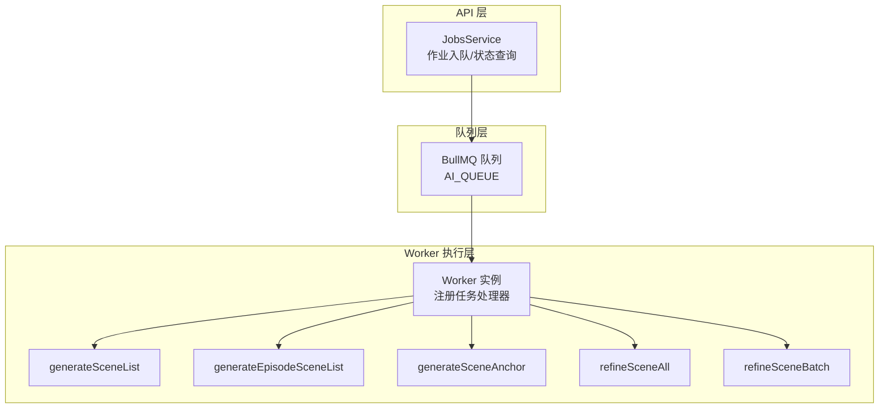
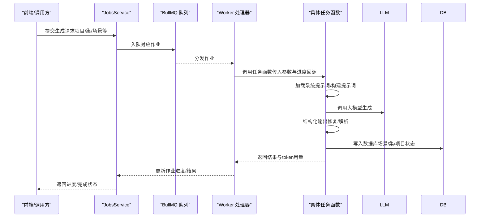
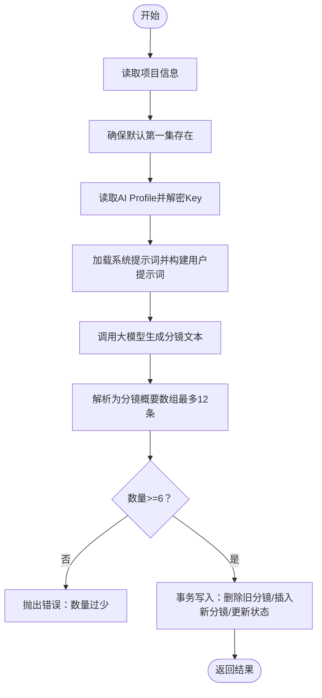
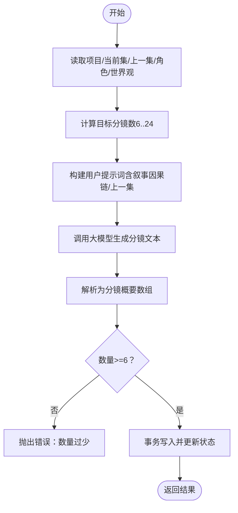
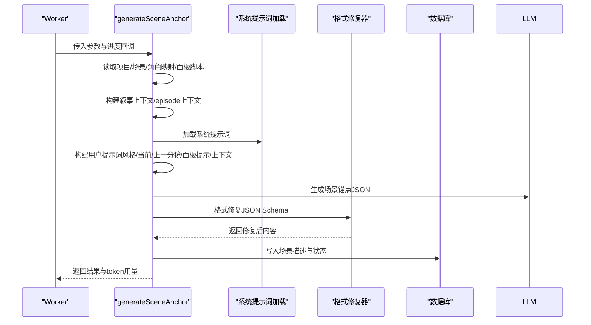
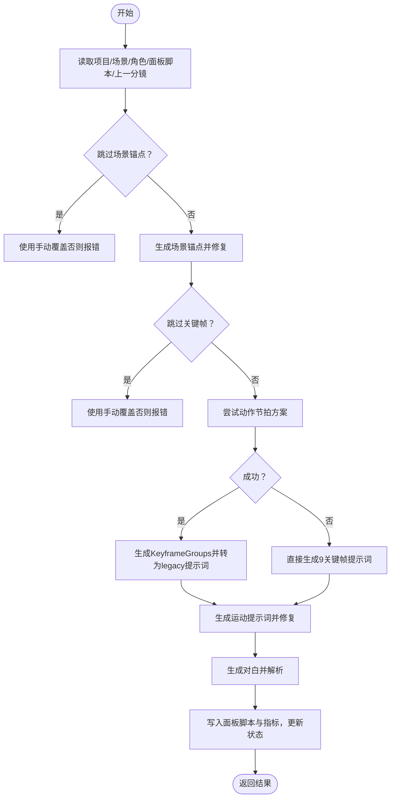
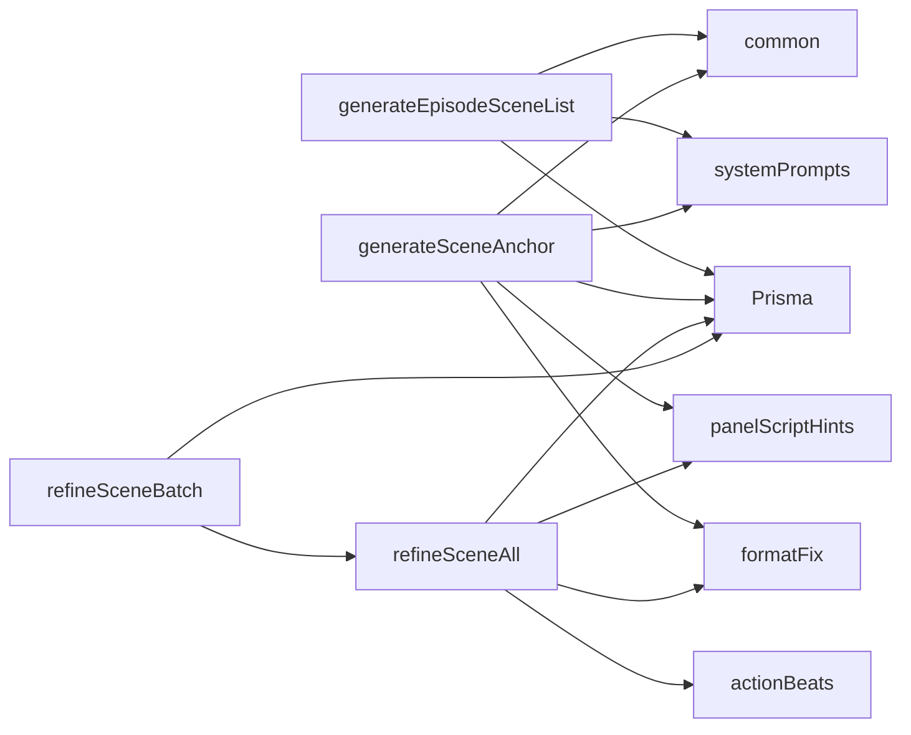

# 场景生成任务

<cite>
**本文引用的文件**
- [apps/worker/src/tasks/generateSceneList.ts](file://apps/worker/src/tasks/generateSceneList.ts)
- [apps/worker/src/tasks/generateEpisodeSceneList.ts](file://apps/worker/src/tasks/generateEpisodeSceneList.ts)
- [apps/worker/src/tasks/generateSceneAnchor.ts](file://apps/worker/src/tasks/generateSceneAnchor.ts)
- [apps/worker/src/tasks/refineSceneAll.ts](file://apps/worker/src/tasks/refineSceneAll.ts)
- [apps/worker/src/tasks/refineSceneBatch.ts](file://apps/worker/src/tasks/refineSceneBatch.ts)
- [apps/worker/src/tasks/common.ts](file://apps/worker/src/tasks/common.ts)
- [apps/worker/src/tasks/systemPrompts.ts](file://apps/worker/src/tasks/systemPrompts.ts)
- [apps/worker/src/tasks/formatFix.ts](file://apps/worker/src/tasks/formatFix.ts)
- [apps/worker/src/tasks/actionBeats.ts](file://apps/worker/src/tasks/actionBeats.ts)
- [apps/worker/src/tasks/panelScriptHints.ts](file://apps/worker/src/tasks/panelScriptHints.ts)
- [packages/shared/src/schemas/scene.ts](file://packages/shared/src/schemas/scene.ts)
- [packages/shared/src/types.ts](file://packages/shared/src/types.ts)
- [apps/api/src/jobs/jobs.service.ts](file://apps/api/src/jobs/jobs.service.ts)
- [apps/worker/src/worker.ts](file://apps/worker/src/worker.ts)
</cite>

## 目录

1. [简介](#简介)
2. [项目结构](#项目结构)
3. [核心组件](#核心组件)
4. [架构总览](#架构总览)
5. [详细组件分析](#详细组件分析)
6. [依赖分析](#依赖分析)
7. [性能考量](#性能考量)
8. [故障排查指南](#故障排查指南)
9. [结论](#结论)
10. [附录](#附录)

## 简介

本技术文档围绕“场景生成任务”的核心流程展开，系统性阐述从项目级分镜列表生成到单集分镜列表生成、再到场景锚点生成、关键帧提示词生成、运动提示词生成与对白生成的完整链路。文档重点覆盖以下方面：

- 核心算法与实现逻辑：generateSceneList、generateEpisodeSceneList、generateSceneAnchor、refineSceneAll、refineSceneBatch
- 场景锚点生成、场景细化与批量场景处理的具体算法
- 输入参数、输出格式与质量控制机制
- 质量评估标准、错误处理策略与性能优化方案
- 参数配置与处理策略的实际使用指引

## 项目结构

场景生成任务位于 worker 工作进程，通过 BullMQ 队列调度，API 层负责作业入队与进度查询。核心文件组织如下：

- 作业入队与调度：apps/api/src/jobs/jobs.service.ts
- 作业执行器：apps/worker/src/worker.ts
- 场景生成任务实现：apps/worker/src/tasks 下的多个任务文件
- 公共工具与系统提示词加载：apps/worker/src/tasks/common.ts、systemPrompts.ts
- 结构化输出修复与模式校验：apps/worker/src/tasks/formatFix.ts
- 动作节拍与关键帧组生成：apps/worker/src/tasks/actionBeats.ts
- 分镜脚本提示与面板指标：apps/worker/src/tasks/panelScriptHints.ts
- 数据模型与状态枚举：packages/shared/src/schemas/scene.ts、packages/shared/src/types.ts

图表来源

- [apps/api/src/jobs/jobs.service.ts](file://apps/api/src/jobs/jobs.service.ts#L305-L376)
- [apps/worker/src/worker.ts](file://apps/worker/src/worker.ts#L1-L29)

章节来源

- [apps/api/src/jobs/jobs.service.ts](file://apps/api/src/jobs/jobs.service.ts#L305-L376)
- [apps/worker/src/worker.ts](file://apps/worker/src/worker.ts#L1-L29)

## 核心组件

本节聚焦于场景生成任务的关键实现模块及其职责边界。

- generateSceneList：项目级分镜列表生成，面向全局项目摘要、风格与主角，生成若干条分镜概要并写入数据库，同时更新项目与集的状态机。
- generateEpisodeSceneList：单集分镜列表生成，结合上一集内容、叙事因果链、角色与世界观要素，生成目标数量的分镜概要。
- generateSceneAnchor：场景锚点生成，基于当前/上一分镜概要、风格与叙事上下文，生成场景氛围、光线与环境锚点，并进行结构化输出修复。
- refineSceneAll：场景全流程细化，依次生成场景锚点、关键帧提示词（优先采用动作节拍方案，失败时回退到直接生成）、运动提示词与对白，最终汇总面板脚本与指标。
- refineSceneBatch：批量细化，支持断点续跑，记录已完成与失败场景，逐个推进。

章节来源

- [apps/worker/src/tasks/generateSceneList.ts](file://apps/worker/src/tasks/generateSceneList.ts#L19-L127)
- [apps/worker/src/tasks/generateEpisodeSceneList.ts](file://apps/worker/src/tasks/generateEpisodeSceneList.ts#L184-L326)
- [apps/worker/src/tasks/generateSceneAnchor.ts](file://apps/worker/src/tasks/generateSceneAnchor.ts#L81-L222)
- [apps/worker/src/tasks/refineSceneAll.ts](file://apps/worker/src/tasks/refineSceneAll.ts#L262-L694)
- [apps/worker/src/tasks/refineSceneBatch.ts](file://apps/worker/src/tasks/refineSceneBatch.ts#L41-L182)

## 架构总览

场景生成任务的端到端流程如下：

图表来源

- [apps/api/src/jobs/jobs.service.ts](file://apps/api/src/jobs/jobs.service.ts#L305-L376)
- [apps/worker/src/worker.ts](file://apps/worker/src/worker.ts#L1-L29)
- [apps/worker/src/tasks/systemPrompts.ts](file://apps/worker/src/tasks/systemPrompts.ts#L4-L26)
- [apps/worker/src/tasks/formatFix.ts](file://apps/worker/src/tasks/formatFix.ts#L237-L278)

## 详细组件分析

### generateSceneList：项目级分镜列表生成

- 输入参数
  - prisma：数据库客户端
  - teamId、projectId、aiProfileId：团队/项目/模型配置标识
  - apiKeySecret：密钥解密密钥
  - updateProgress：进度回调
- 主要步骤
  - 读取项目信息（摘要、风格、主角）
  - 确保默认第一集存在
  - 读取 AI Profile 并解密 API Key
  - 加载系统提示词，拼装用户提示词（故事梗概、画风、主角）
  - 调用大模型生成分镜列表文本
  - 解析文本为分镜概要数组（最多12条）
  - 校验数量（最少6条），事务写入数据库并更新状态机
- 输出
  - sceneCount、scenes（顺序与概要）、tokenUsage
- 质量控制
  - 数量阈值校验，不足则抛错
  - 事务保证原子性
- 错误处理
  - 项目/集/AI Profile 不存在时抛错
  - 解析后数量不足时抛错

图表来源

- [apps/worker/src/tasks/generateSceneList.ts](file://apps/worker/src/tasks/generateSceneList.ts#L19-L127)

章节来源

- [apps/worker/src/tasks/generateSceneList.ts](file://apps/worker/src/tasks/generateSceneList.ts#L19-L127)

### generateEpisodeSceneList：单集分镜列表生成

- 输入参数
  - prisma、teamId、projectId、episodeId、aiProfileId、apiKeySecret、options.sceneCountHint、updateProgress
- 主要步骤
  - 读取项目、当前集与上一集信息（含 coreExpression）
  - 读取世界观与角色库，格式化为提示词片段
  - 计算目标分镜数量（6..24，默认12）
  - 构建用户提示词（含当前集/上一集/叙事因果链/目标数量）
  - 调用大模型生成分镜文本并解析
  - 校验数量（最少6条），事务写入并更新状态机
- 输出
  - episodeId、sceneCount、scenes、tokenUsage
- 质量控制
  - sceneCountHint 限幅至6..24
  - 数量阈值校验
- 错误处理
  - 项目/集不存在或缺少 coreExpression 抛错

图表来源

- [apps/worker/src/tasks/generateEpisodeSceneList.ts](file://apps/worker/src/tasks/generateEpisodeSceneList.ts#L184-L326)

章节来源

- [apps/worker/src/tasks/generateEpisodeSceneList.ts](file://apps/worker/src/tasks/generateEpisodeSceneList.ts#L184-L326)

### generateSceneAnchor：场景锚点生成

- 输入参数
  - prisma、teamId、projectId、sceneId、aiProfileId、apiKeySecret、updateProgress
- 主要步骤
  - 读取项目、场景与上一分镜
  - 读取角色映射与现有面板脚本，生成面板提示
  - 构建叙事上下文（基于项目 contextCache 与当前场景序号）
  - 构建 episode 上下文（含核心表达）
  - 加载系统提示词，构建用户提示词（风格、当前/上一分镜、面板提示、叙事/核心表达）
  - 调用大模型生成 JSON，使用结构化输出修复器进行格式修复
  - 写入数据库（场景描述、状态）
- 输出
  - sceneId、sceneDescription、fixed（是否经过修复）、tokenUsage
- 质量控制
  - 使用 JSON Schema 限制输出结构
  - 修复失败时回退到清洗后的原始内容
- 错误处理
  - 项目/场景不存在抛错

图表来源

- [apps/worker/src/tasks/generateSceneAnchor.ts](file://apps/worker/src/tasks/generateSceneAnchor.ts#L81-L222)
- [apps/worker/src/tasks/systemPrompts.ts](file://apps/worker/src/tasks/systemPrompts.ts#L4-L26)
- [apps/worker/src/tasks/formatFix.ts](file://apps/worker/src/tasks/formatFix.ts#L237-L278)

章节来源

- [apps/worker/src/tasks/generateSceneAnchor.ts](file://apps/worker/src/tasks/generateSceneAnchor.ts#L81-L222)
- [apps/worker/src/tasks/formatFix.ts](file://apps/worker/src/tasks/formatFix.ts#L237-L278)

### refineSceneAll：场景全流程细化

- 输入参数
  - prisma、teamId、projectId、sceneId、aiProfileId、apiKeySecret、updateProgress
- 主要步骤
  - 读取项目与场景，构建面板提示与上一分镜
  - 读取 AI Profile，解密 API Key
  - 场景锚点（可跳过或手动覆盖）
  - 关键帧提示词（优先使用动作节拍方案，失败回退直接生成9帧）
  - 运动提示词（基于锚点与关键帧）
  - 对白生成（解析为结构化列表，必要时回退为旁白）
  - 汇总面板脚本（包含锚点、关键帧、运动提示词与对话指标），更新状态机
- 输出
  - sceneId、sceneDescription、shotPrompt、motionPrompt、dialogueCount、tokenUsage
- 质量控制
  - 动作节拍方案：Zod 校验 + 语义校验（帧间连续性、锚点一致性等）
  - 结构化输出修复：统一 JSON Schema 与修复流程
  - 对白解析失败时回退为旁白
- 错误处理
  - 场景不存在抛不可恢复错误
  - 断点续跑：记录已完成/失败场景，支持恢复

图表来源

- [apps/worker/src/tasks/refineSceneAll.ts](file://apps/worker/src/tasks/refineSceneAll.ts#L262-L694)
- [apps/worker/src/tasks/actionBeats.ts](file://apps/worker/src/tasks/actionBeats.ts#L734-L800)
- [apps/worker/src/tasks/formatFix.ts](file://apps/worker/src/tasks/formatFix.ts#L237-L278)

章节来源

- [apps/worker/src/tasks/refineSceneAll.ts](file://apps/worker/src/tasks/refineSceneAll.ts#L262-L694)
- [apps/worker/src/tasks/actionBeats.ts](file://apps/worker/src/tasks/actionBeats.ts#L734-L800)

### refineSceneBatch：批量场景细化

- 输入参数
  - prisma、teamId、projectId、aiProfileId、apiKeySecret、sceneIds、updateProgress、previousProgress
- 主要步骤
  - 读取项目与场景（可指定 sceneIds 或全量）
  - 解析历史进度，去重已完成/失败场景
  - 逐个调用 refineSceneAll，合并总体进度
  - 支持断点续跑，记录已完成与失败场景
- 输出
  - totalScenes、completedSceneIds、failedScenes

章节来源

- [apps/worker/src/tasks/refineSceneBatch.ts](file://apps/worker/src/tasks/refineSceneBatch.ts#L41-L182)

## 依赖分析

- 任务间依赖
  - generateEpisodeSceneList 依赖项目/集/角色/世界观/叙事因果链
  - generateSceneAnchor 依赖面板脚本与叙事上下文
  - refineSceneAll 依赖动作节拍方案与格式修复器
- 外部依赖
  - 大模型提供商适配（OpenAI 兼容/Gemini/Doubao Ark 等）
  - Redis 队列（BullMQ）
  - 数据库（Prisma）

图表来源

- [apps/worker/src/tasks/generateEpisodeSceneList.ts](file://apps/worker/src/tasks/generateEpisodeSceneList.ts#L1-L326)
- [apps/worker/src/tasks/generateSceneAnchor.ts](file://apps/worker/src/tasks/generateSceneAnchor.ts#L1-L222)
- [apps/worker/src/tasks/refineSceneAll.ts](file://apps/worker/src/tasks/refineSceneAll.ts#L1-L694)
- [apps/worker/src/tasks/refineSceneBatch.ts](file://apps/worker/src/tasks/refineSceneBatch.ts#L1-L182)
- [apps/worker/src/tasks/systemPrompts.ts](file://apps/worker/src/tasks/systemPrompts.ts#L1-L27)
- [apps/worker/src/tasks/formatFix.ts](file://apps/worker/src/tasks/formatFix.ts#L1-L280)
- [apps/worker/src/tasks/actionBeats.ts](file://apps/worker/src/tasks/actionBeats.ts#L1-L800)
- [apps/worker/src/tasks/panelScriptHints.ts](file://apps/worker/src/tasks/panelScriptHints.ts#L1-L175)
- [apps/worker/src/tasks/common.ts](file://apps/worker/src/tasks/common.ts#L1-L154)

章节来源

- [apps/worker/src/tasks/generateEpisodeSceneList.ts](file://apps/worker/src/tasks/generateEpisodeSceneList.ts#L1-L326)
- [apps/worker/src/tasks/generateSceneAnchor.ts](file://apps/worker/src/tasks/generateSceneAnchor.ts#L1-L222)
- [apps/worker/src/tasks/refineSceneAll.ts](file://apps/worker/src/tasks/refineSceneAll.ts#L1-L694)
- [apps/worker/src/tasks/refineSceneBatch.ts](file://apps/worker/src/tasks/refineSceneBatch.ts#L1-L182)

## 性能考量

- 令牌用量统计
  - 通过公共工具合并各阶段 tokenUsage，便于成本控制与上限预警
- 输出修复与回退
  - 结构化输出修复器在首次解析失败时进行二次修复，失败则回退到清洗后的原始内容，避免任务中断
- 动作节拍方案
  - 优先采用动作节拍方案，失败后回退直接生成，兼顾质量与稳定性
- 断点续跑
  - 批量细化支持断点续跑，减少重复计算，提升吞吐

章节来源

- [apps/worker/src/tasks/common.ts](file://apps/worker/src/tasks/common.ts#L10-L17)
- [apps/worker/src/tasks/formatFix.ts](file://apps/worker/src/tasks/formatFix.ts#L244-L278)
- [apps/worker/src/tasks/refineSceneAll.ts](file://apps/worker/src/tasks/refineSceneAll.ts#L443-L477)
- [apps/worker/src/tasks/refineSceneBatch.ts](file://apps/worker/src/tasks/refineSceneBatch.ts#L78-L101)

## 故障排查指南

- 常见错误与定位
  - 项目/集/场景不存在：在任务入口处抛出不可恢复错误，需确认标识正确性
  - 分镜数量过少：generateSceneList 与 generateEpisodeSceneList 在解析后校验数量，不足时抛错
  - 缺少核心表达：generateEpisodeSceneList 要求 episode.coreExpression 存在
  - 结构化输出修复失败：formatFix 在修复后仍无法解析时回退到清洗内容
- 进度与日志
  - 通过 updateProgress 回调上报百分比与消息，便于前端展示与问题定位
- 断点续跑
  - refineSceneBatch 会记录已完成与失败场景，支持恢复执行

章节来源

- [apps/worker/src/tasks/generateSceneList.ts](file://apps/worker/src/tasks/generateSceneList.ts#L98-L100)
- [apps/worker/src/tasks/generateEpisodeSceneList.ts](file://apps/worker/src/tasks/generateEpisodeSceneList.ts#L299-L301)
- [apps/worker/src/tasks/generateEpisodeSceneList.ts](file://apps/worker/src/tasks/generateEpisodeSceneList.ts#L207-L208)
- [apps/worker/src/tasks/formatFix.ts](file://apps/worker/src/tasks/formatFix.ts#L272-L275)
- [apps/worker/src/tasks/refineSceneBatch.ts](file://apps/worker/src/tasks/refineSceneBatch.ts#L78-L101)

## 结论

场景生成任务通过模块化的任务函数与严格的结构化输出修复机制，实现了从项目/集分镜列表到单场景全流程细化的稳定流水线。配合断点续跑与令牌用量统计，既保障了生成质量，又提升了整体性能与可维护性。建议在实际使用中：

- 明确 sceneCountHint 的范围（6..24），并根据项目体量选择合适的目标数量
- 合理配置 AI Profile 的推理参数，平衡质量与成本
- 利用面板脚本提示与角色资产绑定，提升后续图生图/视频生成的一致性

## 附录

### 输入参数与输出格式对照

- generateSceneList
  - 输入：teamId、projectId、aiProfileId、apiKeySecret、updateProgress
  - 输出：sceneCount、scenes、tokenUsage
- generateEpisodeSceneList
  - 输入：teamId、projectId、episodeId、aiProfileId、apiKeySecret、options.sceneCountHint、updateProgress
  - 输出：episodeId、sceneCount、scenes、tokenUsage
- generateSceneAnchor
  - 输入：teamId、projectId、sceneId、aiProfileId、apiKeySecret、updateProgress
  - 输出：sceneId、sceneDescription、fixed、tokenUsage
- refineSceneAll
  - 输入：teamId、projectId、sceneId、aiProfileId、apiKeySecret、updateProgress
  - 输出：sceneId、sceneDescription、shotPrompt、motionPrompt、dialogueCount、tokenUsage
- refineSceneBatch
  - 输入：teamId、projectId、aiProfileId、apiKeySecret、sceneIds、updateProgress、previousProgress
  - 输出：totalScenes、completedSceneIds、failedScenes

章节来源

- [apps/worker/src/tasks/generateSceneList.ts](file://apps/worker/src/tasks/generateSceneList.ts#L19-L127)
- [apps/worker/src/tasks/generateEpisodeSceneList.ts](file://apps/worker/src/tasks/generateEpisodeSceneList.ts#L184-L326)
- [apps/worker/src/tasks/generateSceneAnchor.ts](file://apps/worker/src/tasks/generateSceneAnchor.ts#L81-L222)
- [apps/worker/src/tasks/refineSceneAll.ts](file://apps/worker/src/tasks/refineSceneAll.ts#L262-L694)
- [apps/worker/src/tasks/refineSceneBatch.ts](file://apps/worker/src/tasks/refineSceneBatch.ts#L41-L182)

### 质量评估标准

- 分镜数量：≥6 条（否则视为质量不达标）
- 结构化输出：符合 JSON Schema，关键字段齐全
- 连续性与一致性：动作节拍方案中帧间差异点≥3，锚点集合一致
- 对白解析：优先解析为结构化列表，失败回退为旁白

章节来源

- [apps/worker/src/tasks/generateSceneList.ts](file://apps/worker/src/tasks/generateSceneList.ts#L98-L100)
- [apps/worker/src/tasks/generateEpisodeSceneList.ts](file://apps/worker/src/tasks/generateEpisodeSceneList.ts#L299-L301)
- [apps/worker/src/tasks/formatFix.ts](file://apps/worker/src/tasks/formatFix.ts#L37-L138)
- [apps/worker/src/tasks/actionBeats.ts](file://apps/worker/src/tasks/actionBeats.ts#L466-L498)

### 参数配置与处理策略

- AI Profile 生成参数
  - temperature、topP、maxTokens、presencePenalty、frequencyPenalty、reasoningEffort
  - 通过 toProviderChatConfig 统一转换为 ProviderChatConfig
- 模型覆盖
  - 图像/视频模型可通过 generationParams 中的 imageModel/videoModel 覆盖
- provider 类型
  - 支持 deepseek、kimi、gemini、openai-compatible、doubao-ark
- 作业入队与状态提示
  - API 层负责入队与 UI 状态提示（如 SCENE_PROCESSING、SCENE_LIST_EDITING 等）

章节来源

- [apps/worker/src/tasks/common.ts](file://apps/worker/src/tasks/common.ts#L31-L64)
- [apps/worker/src/tasks/common.ts](file://apps/worker/src/tasks/common.ts#L81-L116)
- [apps/worker/src/tasks/common.ts](file://apps/worker/src/tasks/common.ts#L118-L153)
- [apps/api/src/jobs/jobs.service.ts](file://apps/api/src/jobs/jobs.service.ts#L378-L418)
- [packages/shared/src/types.ts](file://packages/shared/src/types.ts#L3-L23)
