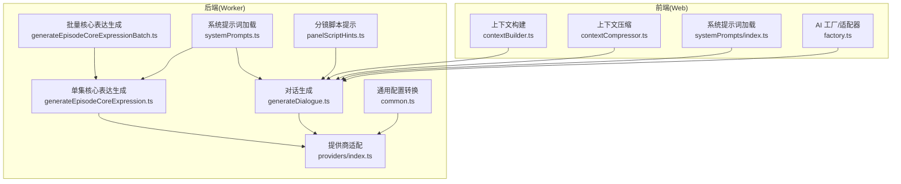
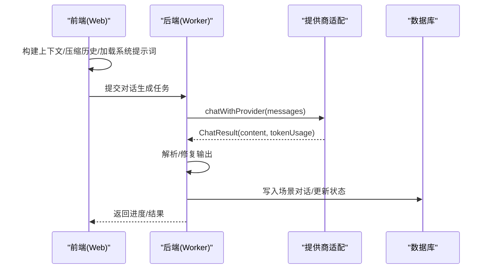
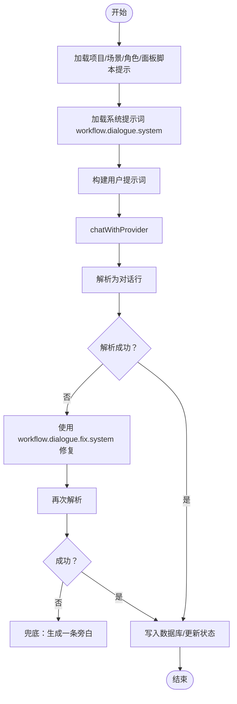
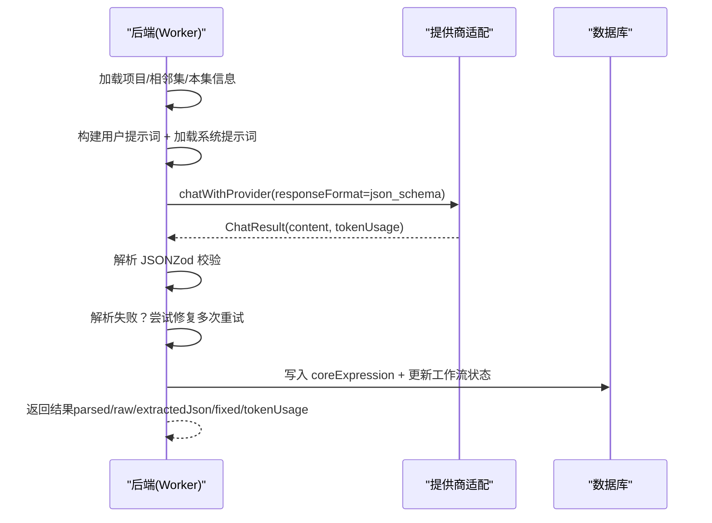
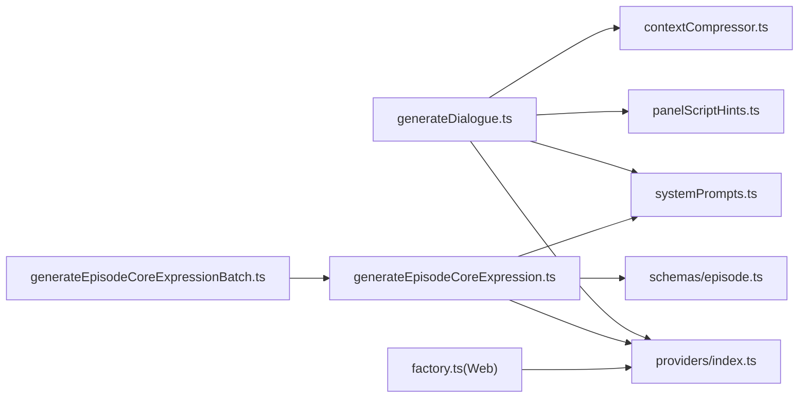

# 对话生成任务

<cite>
**本文引用的文件**
- [apps/worker/src/tasks/generateDialogue.ts](file://apps/worker/src/tasks/generateDialogue.ts)
- [apps/worker/src/tasks/generateEpisodeCoreExpression.ts](file://apps/worker/src/tasks/generateEpisodeCoreExpression.ts)
- [apps/worker/src/tasks/generateEpisodeCoreExpressionBatch.ts](file://apps/worker/src/tasks/generateEpisodeCoreExpressionBatch.ts)
- [apps/worker/src/tasks/common.ts](file://apps/worker/src/tasks/common.ts)
- [apps/worker/src/providers/index.ts](file://apps/worker/src/providers/index.ts)
- [apps/worker/src/tasks/systemPrompts.ts](file://apps/worker/src/tasks/systemPrompts.ts)
- [apps/worker/src/tasks/panelScriptHints.ts](file://apps/worker/src/tasks/panelScriptHints.ts)
- [packages/shared/src/systemPrompts.ts](file://packages/shared/src/systemPrompts.ts)
- [packages/shared/src/schemas/episode.ts](file://packages/shared/src/schemas/episode.ts)
- [apps/web/src/lib/ai/contextBuilder.ts](file://apps/web/src/lib/ai/contextBuilder.ts)
- [apps/web/src/lib/ai/contextCompressor.ts](file://apps/web/src/lib/ai/contextCompressor.ts)
- [apps/web/src/lib/ai/factory.ts](file://apps/web/src/lib/ai/factory.ts)
- [apps/web/src/lib/systemPrompts/index.ts](file://apps/web/src/lib/systemPrompts/index.ts)
</cite>

## 目录

1. [简介](#简介)
2. [项目结构](#项目结构)
3. [核心组件](#核心组件)
4. [架构总览](#架构总览)
5. [详细组件分析](#详细组件分析)
6. [依赖分析](#依赖分析)
7. [性能考虑](#性能考虑)
8. [故障排查指南](#故障排查指南)
9. [结论](#结论)
10. [附录](#附录)

## 简介

本技术文档围绕“对话生成任务”展开，系统梳理并深入解读以下关键能力：

- 对话生成算法的实现原理与优化策略
- generateDialogue 与 generateEpisodeCoreExpression 的具体实现逻辑
- 质量控制机制、上下文保持策略与多轮对话处理
- 参数配置、模板使用与个性化定制选项
- 性能优化技巧、缓存策略与错误恢复机制
- 实战示例与最佳实践，帮助读者根据不同场景调整对话生成参数

## 项目结构

对话生成任务横跨前端 Web 应用与后端 Worker 两大模块：

- Web 前端负责上下文构建、提示词模板填充、系统提示词加载与个性化定制
- Worker 后端负责调用统一的 AI 提供商接口、执行结构化解析与质量修复、持久化产出

图表来源

- [apps/web/src/lib/ai/contextBuilder.ts](file://apps/web/src/lib/ai/contextBuilder.ts#L276-L304)
- [apps/web/src/lib/ai/contextCompressor.ts](file://apps/web/src/lib/ai/contextCompressor.ts#L240-L298)
- [apps/web/src/lib/systemPrompts/index.ts](file://apps/web/src/lib/systemPrompts/index.ts#L109-L124)
- [apps/web/src/lib/ai/factory.ts](file://apps/web/src/lib/ai/factory.ts#L77-L97)
- [apps/worker/src/tasks/generateDialogue.ts](file://apps/worker/src/tasks/generateDialogue.ts#L111-L271)
- [apps/worker/src/tasks/generateEpisodeCoreExpression.ts](file://apps/worker/src/tasks/generateEpisodeCoreExpression.ts#L254-L425)
- [apps/worker/src/tasks/generateEpisodeCoreExpressionBatch.ts](file://apps/worker/src/tasks/generateEpisodeCoreExpressionBatch.ts#L46-L192)
- [apps/worker/src/providers/index.ts](file://apps/worker/src/providers/index.ts#L12-L25)
- [apps/worker/src/tasks/common.ts](file://apps/worker/src/tasks/common.ts#L81-L116)
- [apps/worker/src/tasks/systemPrompts.ts](file://apps/worker/src/tasks/systemPrompts.ts#L4-L26)
- [apps/worker/src/tasks/panelScriptHints.ts](file://apps/worker/src/tasks/panelScriptHints.ts#L95-L174)

章节来源

- [apps/web/src/lib/ai/contextBuilder.ts](file://apps/web/src/lib/ai/contextBuilder.ts#L1-L435)
- [apps/web/src/lib/ai/contextCompressor.ts](file://apps/web/src/lib/ai/contextCompressor.ts#L1-L519)
- [apps/web/src/lib/systemPrompts/index.ts](file://apps/web/src/lib/systemPrompts/index.ts#L1-L197)
- [apps/web/src/lib/ai/factory.ts](file://apps/web/src/lib/ai/factory.ts#L1-L98)
- [apps/worker/src/tasks/generateDialogue.ts](file://apps/worker/src/tasks/generateDialogue.ts#L1-L272)
- [apps/worker/src/tasks/generateEpisodeCoreExpression.ts](file://apps/worker/src/tasks/generateEpisodeCoreExpression.ts#L1-L426)
- [apps/worker/src/tasks/generateEpisodeCoreExpressionBatch.ts](file://apps/worker/src/tasks/generateEpisodeCoreExpressionBatch.ts#L1-L194)
- [apps/worker/src/providers/index.ts](file://apps/worker/src/providers/index.ts#L1-L44)
- [apps/worker/src/tasks/common.ts](file://apps/worker/src/tasks/common.ts#L1-L154)
- [apps/worker/src/tasks/systemPrompts.ts](file://apps/worker/src/tasks/systemPrompts.ts#L1-L27)
- [apps/worker/src/tasks/panelScriptHints.ts](file://apps/worker/src/tasks/panelScriptHints.ts#L1-L175)

## 核心组件

- 对话生成任务（generateDialogue）
  - 输入：项目/场景/角色/分镜脚本提示等上下文
  - 处理：构造系统提示词与用户提示词，调用提供商，解析输出，质量修复，写入数据库
  - 输出：场景的对白/独白/旁白/心理列表，标记场景完成状态
- 单集核心表达生成（generateEpisodeCoreExpression）
  - 输入：项目全局设定、相邻集信息、本集概要
  - 处理：结构化解析 + JSON 修复策略 + token 统计
  - 输出：Core Expression JSON，标记工作流状态
- 批量核心表达生成（generateEpisodeCoreExpressionBatch）
  - 输入：项目内若干集 ID 或全量
  - 处理：进度恢复、跳过已存在、失败收集、分集进度聚合
  - 输出：批次统计与失败明细
- 上下文构建与压缩（contextBuilder、contextCompressor）
  - 功能：角色/画风/世界观整合、历史上下文压缩、token 预估与限制检查
- 系统提示词与模板（systemPrompts、shared systemPrompts）
  - 功能：系统提示词加载、本地/远程覆盖、默认内容回退
- 提供商适配（providers/index）
  - 功能：统一聊天接口，支持 OpenAI 兼容/Gemini/Doubao Ark

章节来源

- [apps/worker/src/tasks/generateDialogue.ts](file://apps/worker/src/tasks/generateDialogue.ts#L111-L271)
- [apps/worker/src/tasks/generateEpisodeCoreExpression.ts](file://apps/worker/src/tasks/generateEpisodeCoreExpression.ts#L254-L425)
- [apps/worker/src/tasks/generateEpisodeCoreExpressionBatch.ts](file://apps/worker/src/tasks/generateEpisodeCoreExpressionBatch.ts#L46-L192)
- [apps/web/src/lib/ai/contextBuilder.ts](file://apps/web/src/lib/ai/contextBuilder.ts#L276-L304)
- [apps/web/src/lib/ai/contextCompressor.ts](file://apps/web/src/lib/ai/contextCompressor.ts#L168-L200)
- [apps/worker/src/tasks/systemPrompts.ts](file://apps/worker/src/tasks/systemPrompts.ts#L4-L26)
- [packages/shared/src/systemPrompts.ts](file://packages/shared/src/systemPrompts.ts#L310-L341)

## 架构总览

对话生成任务遵循“前端上下文构建 + 后端结构化解析 + 统一提供商调用”的分层架构。前端负责模板填充与系统提示词个性化，后端负责高质量输出与错误恢复。

图表来源

- [apps/web/src/lib/ai/contextBuilder.ts](file://apps/web/src/lib/ai/contextBuilder.ts#L276-L304)
- [apps/web/src/lib/ai/contextCompressor.ts](file://apps/web/src/lib/ai/contextCompressor.ts#L240-L298)
- [apps/web/src/lib/systemPrompts/index.ts](file://apps/web/src/lib/systemPrompts/index.ts#L109-L124)
- [apps/worker/src/providers/index.ts](file://apps/worker/src/providers/index.ts#L12-L25)
- [apps/worker/src/tasks/generateDialogue.ts](file://apps/worker/src/tasks/generateDialogue.ts#L191-L248)

## 详细组件分析

### 组件A：对话生成任务（generateDialogue）

- 输入数据来源
  - 项目：主角、风格、上下文缓存
  - 场景：概要、场景锚点、关键帧提示词、运动提示词、角色列表
  - 分镜脚本提示：面板脚本中的地点/时间/镜头/道具/资产等约束
- 提示词构建
  - 系统提示词键：workflow.dialogue.system
  - 用户提示词包含：分镜概要、场景锚点、关键帧、运动提示词、角色列表、面板脚本提示
- 调用流程
  - 解密 API Key，转换为提供商配置
  - 发送 system/user 消息，接收内容与 tokenUsage
- 输出解析与修复
  - 从文本解析为结构化对话行（对白/独白/旁白/心理）
  - 若解析失败，使用 workflow.dialogue.fix.system 与原始输出再次请求，进行格式修复
  - 若仍失败，兜底为一条旁白
- 质量控制
  - 进度上报：准备提示词、调用 AI、解析、写入、完成
  - 项目完成后自动检测所有场景是否完成，标记项目状态
- 数据持久化
  - 写入场景的 dialogues 字段，状态置为 completed

图表来源

- [apps/worker/src/tasks/generateDialogue.ts](file://apps/worker/src/tasks/generateDialogue.ts#L111-L271)
- [apps/worker/src/tasks/systemPrompts.ts](file://apps/worker/src/tasks/systemPrompts.ts#L4-L26)
- [apps/worker/src/tasks/panelScriptHints.ts](file://apps/worker/src/tasks/panelScriptHints.ts#L95-L174)

章节来源

- [apps/worker/src/tasks/generateDialogue.ts](file://apps/worker/src/tasks/generateDialogue.ts#L111-L271)
- [apps/worker/src/tasks/systemPrompts.ts](file://apps/worker/src/tasks/systemPrompts.ts#L4-L26)
- [apps/worker/src/tasks/panelScriptHints.ts](file://apps/worker/src/tasks/panelScriptHints.ts#L74-L80)

### 组件B：单集核心表达生成（generateEpisodeCoreExpression）

- 输入数据来源
  - 项目：全局设定、画风、上下文缓存（含叙事因果链、故事核心、主角核心、季级弧线等）
  - 相邻集：上一集/下一集的概要、Outline、Core Expression（用于避免“单集孤岛”）
  - 本集：集序、标题、概要、Outline
- 提示词构建
  - 系统提示词键：workflow.episode_core_expression.system
  - 用户提示词包含：全局设定、画风、世界观、角色库、叙事因果链、相邻集衔接、本集信息
- 结构化解析与修复
  - 使用 JSON Schema 约束 responseFormat
  - 解析失败时，采用稳定 JSON 修复配置（temperature=0 等）与 workflow.episode_core_expression.json_fix.system 重试修复
  - 最终写入数据库并标记工作流状态
- 输出
  - Core Expression JSON（主题、情绪弧、核心冲突、母题、结尾落点、下一集钩子）

图表来源

- [apps/worker/src/tasks/generateEpisodeCoreExpression.ts](file://apps/worker/src/tasks/generateEpisodeCoreExpression.ts#L254-L425)
- [packages/shared/src/schemas/episode.ts](file://packages/shared/src/schemas/episode.ts#L68-L78)
- [apps/worker/src/tasks/systemPrompts.ts](file://apps/worker/src/tasks/systemPrompts.ts#L4-L26)

章节来源

- [apps/worker/src/tasks/generateEpisodeCoreExpression.ts](file://apps/worker/src/tasks/generateEpisodeCoreExpression.ts#L254-L425)
- [packages/shared/src/schemas/episode.ts](file://packages/shared/src/schemas/episode.ts#L68-L78)

### 组件C：批量核心表达生成（generateEpisodeCoreExpressionBatch）

- 功能概述
  - 支持指定集 ID 或全量生成
  - 进度恢复：从 previousProgress 恢复已完成/跳过/失败集
  - 跳过策略：默认仅生成缺失的 coreExpression，避免覆盖
  - 失败收集：记录失败集及其错误信息
- 进度聚合
  - 将子任务进度映射为总体百分比，上报当前处理集序号与 ID

章节来源

- [apps/worker/src/tasks/generateEpisodeCoreExpressionBatch.ts](file://apps/worker/src/tasks/generateEpisodeCoreExpressionBatch.ts#L46-L192)

### 组件D：上下文构建与压缩（contextBuilder、contextCompressor）

- 上下文构建
  - 角色：外观/性格/背景/主题色/关系/出场次数
  - 画风：完整提示词或组合片段
  - 世界观：按类型分组格式化
  - 模板填充：支持多种占位符（角色/画风/场景/分镜/故事等）
- 上下文压缩
  - 项目核心信息压缩：风格、主角核心、故事核心
  - 场景摘要压缩：保留关键情绪与元素
  - 历史上下文压缩：限定最近 N 个分镜
  - token 预估与限制检查：估算总 token，动态调整策略（激进/平衡/保守）

章节来源

- [apps/web/src/lib/ai/contextBuilder.ts](file://apps/web/src/lib/ai/contextBuilder.ts#L105-L197)
- [apps/web/src/lib/ai/contextBuilder.ts](file://apps/web/src/lib/ai/contextBuilder.ts#L227-L270)
- [apps/web/src/lib/ai/contextBuilder.ts](file://apps/web/src/lib/ai/contextBuilder.ts#L276-L304)
- [apps/web/src/lib/ai/contextBuilder.ts](file://apps/web/src/lib/ai/contextBuilder.ts#L310-L387)
- [apps/web/src/lib/ai/contextBuilder.ts](file://apps/web/src/lib/ai/contextBuilder.ts#L393-L434)
- [apps/web/src/lib/ai/contextCompressor.ts](file://apps/web/src/lib/ai/contextCompressor.ts#L55-L94)
- [apps/web/src/lib/ai/contextCompressor.ts](file://apps/web/src/lib/ai/contextCompressor.ts#L99-L129)
- [apps/web/src/lib/ai/contextCompressor.ts](file://apps/web/src/lib/ai/contextCompressor.ts#L134-L163)
- [apps/web/src/lib/ai/contextCompressor.ts](file://apps/web/src/lib/ai/contextCompressor.ts#L168-L200)
- [apps/web/src/lib/ai/contextCompressor.ts](file://apps/web/src/lib/ai/contextCompressor.ts#L240-L298)

### 组件E：系统提示词与模板（systemPrompts）

- 后端加载
  - 优先读取团队自定义内容；若不存在则回退到默认系统提示词
- 前端加载
  - API 模式：从远端缓存加载；本地模式：从 localStorage 覆盖
  - 支持保存/重置系统提示词，实时生效

章节来源

- [apps/worker/src/tasks/systemPrompts.ts](file://apps/worker/src/tasks/systemPrompts.ts#L4-L26)
- [apps/web/src/lib/systemPrompts/index.ts](file://apps/web/src/lib/systemPrompts/index.ts#L109-L124)
- [apps/web/src/lib/systemPrompts/index.ts](file://apps/web/src/lib/systemPrompts/index.ts#L126-L163)
- [apps/web/src/lib/systemPrompts/index.ts](file://apps/web/src/lib/systemPrompts/index.ts#L165-L196)
- [packages/shared/src/systemPrompts.ts](file://packages/shared/src/systemPrompts.ts#L310-L341)
- [packages/shared/src/systemPrompts.ts](file://packages/shared/src/systemPrompts.ts#L524-L569)

### 组件F：提供商适配（providers/index）

- 统一聊天接口：根据配置路由到 OpenAI 兼容/Gemini/Doubao Ark
- 图像生成接口：OpenAI 兼容/Doubao Ark（Gemini 暂不支持）

章节来源

- [apps/worker/src/providers/index.ts](file://apps/worker/src/providers/index.ts#L12-L25)
- [apps/worker/src/providers/index.ts](file://apps/worker/src/providers/index.ts#L27-L43)

## 依赖分析

- 组件耦合
  - generateDialogue 依赖：系统提示词加载、提供商适配、面板脚本提示、上下文压缩（前端）
  - generateEpisodeCoreExpression 依赖：系统提示词加载、提供商适配、Zod Schema 校验
  - 批量任务依赖：单集生成任务与进度聚合
- 外部依赖
  - 提供商：OpenAI 兼容/Gemini/Doubao Ark
  - 数据库：Prisma（项目/场景/角色/世界设定/系统提示词）
  - 类型与 Schema：Zod（Core Expression）、共享系统提示词定义

图表来源

- [apps/worker/src/tasks/generateDialogue.ts](file://apps/worker/src/tasks/generateDialogue.ts#L1-L272)
- [apps/worker/src/tasks/generateEpisodeCoreExpression.ts](file://apps/worker/src/tasks/generateEpisodeCoreExpression.ts#L1-L426)
- [apps/worker/src/tasks/generateEpisodeCoreExpressionBatch.ts](file://apps/worker/src/tasks/generateEpisodeCoreExpressionBatch.ts#L1-L194)
- [apps/worker/src/providers/index.ts](file://apps/worker/src/providers/index.ts#L1-L44)
- [apps/worker/src/tasks/systemPrompts.ts](file://apps/worker/src/tasks/systemPrompts.ts#L1-L27)
- [apps/worker/src/tasks/panelScriptHints.ts](file://apps/worker/src/tasks/panelScriptHints.ts#L1-L175)
- [apps/web/src/lib/ai/contextCompressor.ts](file://apps/web/src/lib/ai/contextCompressor.ts#L1-L519)
- [apps/web/src/lib/ai/factory.ts](file://apps/web/src/lib/ai/factory.ts#L1-L98)
- [packages/shared/src/schemas/episode.ts](file://packages/shared/src/schemas/episode.ts#L68-L78)

章节来源

- [apps/worker/src/tasks/generateDialogue.ts](file://apps/worker/src/tasks/generateDialogue.ts#L1-L272)
- [apps/worker/src/tasks/generateEpisodeCoreExpression.ts](file://apps/worker/src/tasks/generateEpisodeCoreExpression.ts#L1-L426)
- [apps/worker/src/tasks/generateEpisodeCoreExpressionBatch.ts](file://apps/worker/src/tasks/generateEpisodeCoreExpressionBatch.ts#L1-L194)
- [apps/worker/src/providers/index.ts](file://apps/worker/src/providers/index.ts#L1-L44)
- [apps/worker/src/tasks/systemPrompts.ts](file://apps/worker/src/tasks/systemPrompts.ts#L1-L27)
- [apps/worker/src/tasks/panelScriptHints.ts](file://apps/worker/src/tasks/panelScriptHints.ts#L1-L175)
- [apps/web/src/lib/ai/contextCompressor.ts](file://apps/web/src/lib/ai/contextCompressor.ts#L1-L519)
- [apps/web/src/lib/ai/factory.ts](file://apps/web/src/lib/ai/factory.ts#L1-L98)
- [packages/shared/src/schemas/episode.ts](file://packages/shared/src/schemas/episode.ts#L68-L78)

## 性能考虑

- 提示词长度控制
  - 上下文压缩：根据策略（激进/平衡/保守）限制项目与场景 token，避免超限
  - 截断策略：对长文本与 JSON 进行安全截断，保留关键信息
- 结构化解析稳定性
  - generateEpisodeCoreExpression 使用 JSON Schema + 修复策略，降低解析失败率
  - 对温度等参数进行稳定化配置，提高可重复性
- 进度与并发
  - 批量任务支持进度恢复与失败重试，避免重复计算
- 令牌统计
  - 统一合并 tokenUsage，便于成本控制与上限预警

章节来源

- [apps/web/src/lib/ai/contextCompressor.ts](file://apps/web/src/lib/ai/contextCompressor.ts#L27-L50)
- [apps/web/src/lib/ai/contextCompressor.ts](file://apps/web/src/lib/ai/contextCompressor.ts#L168-L200)
- [apps/worker/src/tasks/generateEpisodeCoreExpression.ts](file://apps/worker/src/tasks/generateEpisodeCoreExpression.ts#L39-L52)
- [apps/worker/src/tasks/common.ts](file://apps/worker/src/tasks/common.ts#L10-L17)

## 故障排查指南

- 对话生成解析失败
  - 现象：解析为空，尝试一次修复；仍失败则兜底为旁白
  - 建议：检查系统提示词键是否正确，确认输出格式要求
- 核心表达解析失败
  - 现象：Zod 校验抛错；采用稳定修复配置与多次重试
  - 建议：核对 JSON Schema 字段，确保 responseFormat 正确
- 提示词超限
  - 现象：上下文过大导致 token 超限
  - 建议：降低历史上下文长度，启用更保守的压缩策略
- 提供商配置错误
  - 现象：调用失败或返回异常
  - 建议：检查 provider、model、baseURL、apiKey 是否正确

章节来源

- [apps/worker/src/tasks/generateDialogue.ts](file://apps/worker/src/tasks/generateDialogue.ts#L203-L238)
- [apps/worker/src/tasks/generateEpisodeCoreExpression.ts](file://apps/worker/src/tasks/generateEpisodeCoreExpression.ts#L370-L403)
- [apps/web/src/lib/ai/contextCompressor.ts](file://apps/web/src/lib/ai/contextCompressor.ts#L187-L200)
- [apps/worker/src/providers/index.ts](file://apps/worker/src/providers/index.ts#L12-L25)

## 结论

对话生成任务通过“前端上下文构建 + 后端结构化解析 + 统一提供商适配”的架构，实现了高质量、可恢复、可扩展的对话生成流水线。结合系统提示词的可定制化、上下文压缩与稳定化参数配置，能够在不同场景下取得稳定一致的产出，并具备良好的性能与可维护性。

## 附录

- 参数配置与模板使用
  - 系统提示词键：workflow.dialogue.system、workflow.episode_core_expression.system、workflow.episode_core_expression.json_fix.system
  - 模板占位符：{style}/{characters}/{worldview}/{scene_summary} 等
- 个性化定制
  - 团队级别自定义系统提示词，支持保存/重置
  - 前端本地覆盖与后端数据库覆盖双通道
- 最佳实践
  - 对话生成：确保场景锚点、关键帧、运动提示词完整；必要时启用面板脚本提示
  - 核心表达：提供相邻集信息与叙事因果链摘要，提升跨集一致性
  - 压缩策略：根据模型上下文窗口选择保守策略，避免超限

章节来源

- [packages/shared/src/systemPrompts.ts](file://packages/shared/src/systemPrompts.ts#L310-L341)
- [packages/shared/src/systemPrompts.ts](file://packages/shared/src/systemPrompts.ts#L524-L569)
- [apps/web/src/lib/systemPrompts/index.ts](file://apps/web/src/lib/systemPrompts/index.ts#L109-L124)
- [apps/web/src/lib/ai/contextBuilder.ts](file://apps/web/src/lib/ai/contextBuilder.ts#L310-L387)
- [apps/web/src/lib/ai/contextCompressor.ts](file://apps/web/src/lib/ai/contextCompressor.ts#L27-L50)
