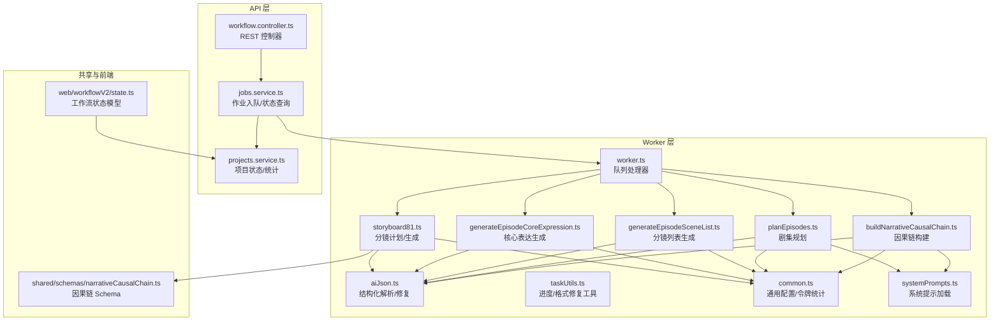
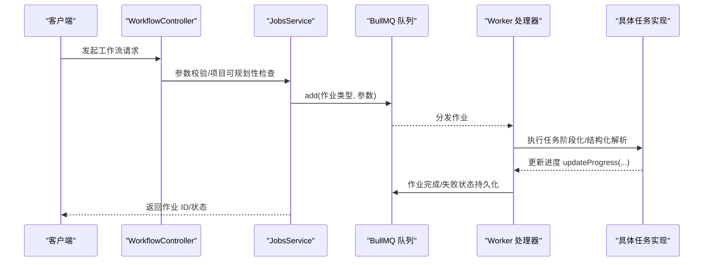
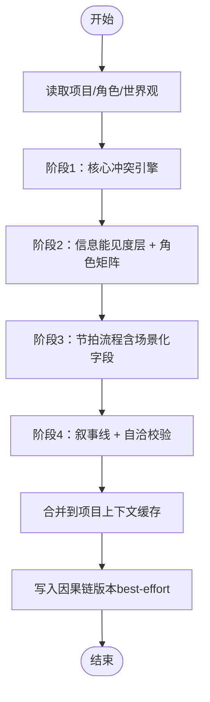
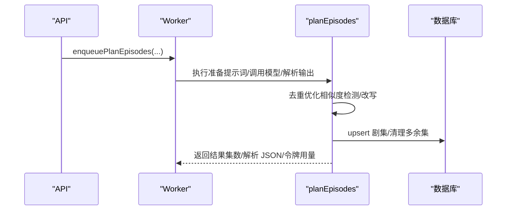
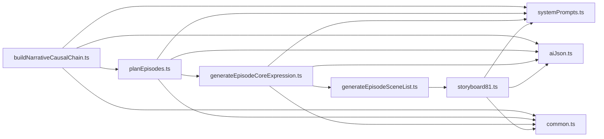

# 工作流编排任务

<cite>
**本文引用的文件**
- [apps/worker/src/tasks/buildNarrativeCausalChain.ts](file://apps/worker/src/tasks/buildNarrativeCausalChain.ts)
- [apps/worker/src/tasks/planEpisodes.ts](file://apps/worker/src/tasks/planEpisodes.ts)
- [apps/worker/src/tasks/generateEpisodeSceneList.ts](file://apps/worker/src/tasks/generateEpisodeSceneList.ts)
- [apps/worker/src/tasks/generateEpisodeCoreExpression.ts](file://apps/worker/src/tasks/generateEpisodeCoreExpression.ts)
- [apps/worker/src/tasks/storyboard81.ts](file://apps/worker/src/tasks/storyboard81.ts)
- [apps/worker/src/tasks/common.ts](file://apps/worker/src/tasks/common.ts)
- [apps/worker/src/tasks/systemPrompts.ts](file://apps/worker/src/tasks/systemPrompts.ts)
- [apps/worker/src/tasks/aiJson.ts](file://apps/worker/src/tasks/aiJson.ts)
- [apps/worker/src/tasks/taskUtils.ts](file://apps/worker/src/tasks/taskUtils.ts)
- [packages/shared/src/schemas/narrativeCausalChain.ts](file://packages/shared/src/schemas/narrativeCausalChain.ts)
- [apps/api/src/jobs/workflow.controller.ts](file://apps/api/src/jobs/workflow.controller.ts)
- [apps/api/src/jobs/jobs.service.ts](file://apps/api/src/jobs/jobs.service.ts)
- [apps/api/src/projects/projects.service.ts](file://apps/api/src/projects/projects.service.ts)
- [apps/web/src/lib/workflowV2/state.ts](file://apps/web/src/lib/workflowV2/state.ts)
- [apps/web/src/lib/workflowV2/index.ts](file://apps/web/src/lib/workflowV2/index.ts)
- [apps/worker/src/worker.ts](file://apps/worker/src/worker.ts)
</cite>

## 目录

1. [简介](#简介)
2. [项目结构](#项目结构)
3. [核心组件](#核心组件)
4. [架构总览](#架构总览)
5. [详细组件分析](#详细组件分析)
6. [依赖关系分析](#依赖关系分析)
7. [性能考虑](#性能考虑)
8. [故障排查指南](#故障排查指南)
9. [结论](#结论)
10. [附录](#附录)

## 简介

本技术文档围绕“工作流编排任务”展开，聚焦于高级创作工作流中的三大核心任务：叙事因果链构建、剧集规划与分镜生成。文档深入解析 buildNarrativeCausalChain、planEpisodes 等复杂工作流的状态管理机制，阐述任务间的依赖关系、执行顺序与协调策略，并给出错误处理、重试机制与进度追踪的实现要点。同时提供配置最佳实践、性能监控与调试技巧，以及可扩展的创作工作流定制指南。

## 项目结构

本项目采用前后端分离与任务队列解耦的架构：

- API 层负责请求接入、参数校验与作业入队（BullMQ），并维护项目/作业状态。
- Worker 层消费队列任务，执行具体工作流步骤，落地数据库并上报进度。
- Web 前端通过状态与进度接口感知工作流进展，提供可视化工作台与版本历史。

图示来源

- [apps/api/src/jobs/workflow.controller.ts](file://apps/api/src/jobs/workflow.controller.ts#L44-L265)
- [apps/api/src/jobs/jobs.service.ts](file://apps/api/src/jobs/jobs.service.ts#L101-L800)
- [apps/worker/src/worker.ts](file://apps/worker/src/worker.ts#L62-L733)
- [apps/worker/src/tasks/buildNarrativeCausalChain.ts](file://apps/worker/src/tasks/buildNarrativeCausalChain.ts#L782-L800)
- [apps/worker/src/tasks/planEpisodes.ts](file://apps/worker/src/tasks/planEpisodes.ts#L387-L423)
- [apps/worker/src/tasks/generateEpisodeSceneList.ts](file://apps/worker/src/tasks/generateEpisodeSceneList.ts#L184-L200)
- [apps/worker/src/tasks/generateEpisodeCoreExpression.ts](file://apps/worker/src/tasks/generateEpisodeCoreExpression.ts#L254-L275)
- [apps/worker/src/tasks/storyboard81.ts](file://apps/worker/src/tasks/storyboard81.ts#L553-L639)
- [apps/worker/src/tasks/aiJson.ts](file://apps/worker/src/tasks/aiJson.ts#L222-L315)
- [apps/worker/src/tasks/common.ts](file://apps/worker/src/tasks/common.ts#L81-L154)
- [apps/worker/src/tasks/systemPrompts.ts](file://apps/worker/src/tasks/systemPrompts.ts#L4-L26)
- [packages/shared/src/schemas/narrativeCausalChain.ts](file://packages/shared/src/schemas/narrativeCausalChain.ts#L175-L260)
- [apps/web/src/lib/workflowV2/state.ts](file://apps/web/src/lib/workflowV2/state.ts#L27-L74)

章节来源

- [apps/api/src/jobs/workflow.controller.ts](file://apps/api/src/jobs/workflow.controller.ts#L44-L265)
- [apps/api/src/jobs/jobs.service.ts](file://apps/api/src/jobs/jobs.service.ts#L101-L800)
- [apps/worker/src/worker.ts](file://apps/worker/src/worker.ts#L62-L733)

## 核心组件

- 作业控制器与服务：负责 REST 接口、参数校验、作业入队与状态查询。
- 作业处理器：统一消费队列任务，协调进度上报、错误处理与重试。
- 任务实现：按阶段拆分的 AI 生成任务，包含结构化解析、系统提示注入、去重与修复策略。
- 共享 Schema：因果链结构的强约束定义，保障跨阶段数据一致性。
- 前端工作流状态：项目/剧集维度的工作流状态模型与制品锁状态。

章节来源

- [apps/api/src/jobs/workflow.controller.ts](file://apps/api/src/jobs/workflow.controller.ts#L9-L31)
- [apps/api/src/jobs/jobs.service.ts](file://apps/api/src/jobs/jobs.service.ts#L101-L191)
- [apps/worker/src/worker.ts](file://apps/worker/src/worker.ts#L62-L733)
- [packages/shared/src/schemas/narrativeCausalChain.ts](file://packages/shared/src/schemas/narrativeCausalChain.ts#L175-L260)
- [apps/web/src/lib/workflowV2/state.ts](file://apps/web/src/lib/workflowV2/state.ts#L27-L74)

## 架构总览

工作流遵循“请求即作业、异步执行、状态持久化、进度可观测”的模式：

- API 层接收请求，校验参数与项目可规划性，创建作业记录并入队。
- Worker 层根据作业类型路由到对应任务，按阶段执行，落地数据库并持续上报进度。
- 错误处理采用“自动重试 + 状态保留”策略，避免前端误判。
- 共享 Schema 与系统提示确保输出结构化、可解析、可校验。

图示来源

- [apps/api/src/jobs/workflow.controller.ts](file://apps/api/src/jobs/workflow.controller.ts#L49-L115)
- [apps/api/src/jobs/jobs.service.ts](file://apps/api/src/jobs/jobs.service.ts#L101-L149)
- [apps/worker/src/worker.ts](file://apps/worker/src/worker.ts#L62-L733)

## 详细组件分析

### 叙事因果链构建（buildNarrativeCausalChain）

- 阶段化设计：将复杂因果链拆分为 4 阶段，每阶段专注一个子任务，提升稳定性与可控性。
- 结构化解析与修复：统一使用 JSON Schema 约束输出，配合“首次提取 + 轻量修复 + 二次修复”策略，保证可解析性。
- 数据合并与版本化：将新生成的因果链合并到项目上下文缓存，同时写入版本表（best-effort）。
- 任务入口与状态：支持指定阶段续跑与强制重跑，自动推进项目工作流状态。

图示来源

- [apps/worker/src/tasks/buildNarrativeCausalChain.ts](file://apps/worker/src/tasks/buildNarrativeCausalChain.ts#L782-L800)
- [packages/shared/src/schemas/narrativeCausalChain.ts](file://packages/shared/src/schemas/narrativeCausalChain.ts#L175-L260)

章节来源

- [apps/worker/src/tasks/buildNarrativeCausalChain.ts](file://apps/worker/src/tasks/buildNarrativeCausalChain.ts#L411-L780)
- [packages/shared/src/schemas/narrativeCausalChain.ts](file://packages/shared/src/schemas/narrativeCausalChain.ts#L10-L270)

### 剧集规划（planEpisodes）

- 目标集数控制：支持固定目标集数（1-24），并据此动态调整输出上限以避免截断。
- 去重优化：基于集标题/概要/场景范围的相似度检测，自动改写重复度偏高的集。
- 结构化解析与修复：统一 JSON Schema 约束，失败时进行“稳定修复配置 + 3 次修复尝试”。
- 数据落库：批量 upsert 剧集，删除多余集，推进项目工作流状态。

图示来源

- [apps/api/src/jobs/workflow.controller.ts](file://apps/api/src/jobs/workflow.controller.ts#L49-L55)
- [apps/api/src/jobs/jobs.service.ts](file://apps/api/src/jobs/jobs.service.ts#L101-L149)
- [apps/worker/src/tasks/planEpisodes.ts](file://apps/worker/src/tasks/planEpisodes.ts#L387-L611)

章节来源

- [apps/worker/src/tasks/planEpisodes.ts](file://apps/worker/src/tasks/planEpisodes.ts#L22-L74)
- [apps/worker/src/tasks/planEpisodes.ts](file://apps/worker/src/tasks/planEpisodes.ts#L122-L151)
- [apps/worker/src/tasks/planEpisodes.ts](file://apps/worker/src/tasks/planEpisodes.ts#L527-L562)

### 分镜列表生成（generateEpisodeSceneList）

- 输入依赖：依赖上一集分镜与本集核心表达，避免重复与孤岛。
- 输出策略：解析模型输出为有序分镜清单，写入数据库并推进项目/剧集工作流状态。
- 数量约束：最小 6，最大 24，默认 12，支持 hint 调整。

章节来源

- [apps/worker/src/tasks/generateEpisodeSceneList.ts](file://apps/worker/src/tasks/generateEpisodeSceneList.ts#L184-L326)

### 核心表达生成（generateEpisodeCoreExpression）

- 上下游衔接：读取相邻剧集的核心表达，避免“单集孤岛”，保持跨集一致性。
- 结构化解析：统一 JSON Schema 约束，失败时进行“稳定修复配置 + 3 次修复尝试”。
- 状态推进：写入核心表达并推进剧集工作流状态。

章节来源

- [apps/worker/src/tasks/generateEpisodeCoreExpression.ts](file://apps/worker/src/tasks/generateEpisodeCoreExpression.ts#L254-L425)

### 分镜计划与生成（storyboard81）

- 多层校验：包含 JSON Schema 校验、语义校验（如 9 宫格完整性、连贯性承接）、修复循环。
- 连贯性控制：基于前一组结束态对下一组进行角色/道具承接校验，必要时修复。
- 多阶段产出：Scene Bible → Plan → Group Panels → 翻译/回译 → 图像生成。

章节来源

- [apps/worker/src/tasks/storyboard81.ts](file://apps/worker/src/tasks/storyboard81.ts#L553-L639)
- [apps/worker/src/tasks/storyboard81.ts](file://apps/worker/src/tasks/storyboard81.ts#L132-L163)

### 通用工具与系统提示

- 通用配置：模型参数抽取、Provider 配置转换、令牌用量合并。
- 系统提示加载：支持团队级自定义系统提示回退默认内容。
- 结构化解析：统一的 JSON 提取/修复/解析流程，提供错误上下文定位。

章节来源

- [apps/worker/src/tasks/common.ts](file://apps/worker/src/tasks/common.ts#L81-L154)
- [apps/worker/src/tasks/systemPrompts.ts](file://apps/worker/src/tasks/systemPrompts.ts#L4-L26)
- [apps/worker/src/tasks/aiJson.ts](file://apps/worker/src/tasks/aiJson.ts#L222-L315)
- [apps/worker/src/tasks/taskUtils.ts](file://apps/worker/src/tasks/taskUtils.ts#L278-L294)

## 依赖关系分析

- 任务间依赖
  - 因果链构建完成后，剧集规划方可读取因果链摘要。
  - 剧集规划完成后，核心表达生成方可读取集 outline。
  - 核心表达生成完成后，分镜列表生成方可读取上一集分镜与本集核心表达。
  - 分镜列表生成完成后，进入分镜计划/生成阶段。
- 外部依赖
  - BullMQ 队列：作业入队、重试、状态持久化。
  - Prisma：数据库访问、事务、版本写入。
  - 供应商 API：OpenAI/Gemini/Doubao Ark 等，统一通过 Provider 抽象封装。

图示来源

- [apps/worker/src/tasks/buildNarrativeCausalChain.ts](file://apps/worker/src/tasks/buildNarrativeCausalChain.ts#L782-L800)
- [apps/worker/src/tasks/planEpisodes.ts](file://apps/worker/src/tasks/planEpisodes.ts#L387-L423)
- [apps/worker/src/tasks/generateEpisodeCoreExpression.ts](file://apps/worker/src/tasks/generateEpisodeCoreExpression.ts#L254-L275)
- [apps/worker/src/tasks/generateEpisodeSceneList.ts](file://apps/worker/src/tasks/generateEpisodeSceneList.ts#L184-L200)
- [apps/worker/src/tasks/storyboard81.ts](file://apps/worker/src/tasks/storyboard81.ts#L553-L639)
- [apps/worker/src/tasks/systemPrompts.ts](file://apps/worker/src/tasks/systemPrompts.ts#L4-L26)
- [apps/worker/src/tasks/aiJson.ts](file://apps/worker/src/tasks/aiJson.ts#L222-L315)
- [apps/worker/src/tasks/common.ts](file://apps/worker/src/tasks/common.ts#L81-L154)

## 性能考虑

- 输出上限与令牌控制
  - 剧集规划根据目标集数动态提升输出上限，避免 JSON 未闭合。
  - 核心表达与因果链生成采用“稳定修复配置”，降低模型推理漂移，提高解析成功率。
- 并发与重试
  - Worker 并发度可配置，作业具备指数退避重试，失败时保留状态避免前端误判。
- 数据落库策略
  - 使用事务批量 upsert，减少往返开销；对多余集进行一次性清理。
- 前端进度映射
  - 通过“缩放进度”将任务内部百分比映射到 UI 状态区间，提升体验一致性。

章节来源

- [apps/worker/src/tasks/planEpisodes.ts](file://apps/worker/src/tasks/planEpisodes.ts#L448-L456)
- [apps/worker/src/tasks/generateEpisodeCoreExpression.ts](file://apps/worker/src/tasks/generateEpisodeCoreExpression.ts#L39-L52)
- [apps/worker/src/tasks/buildNarrativeCausalChain.ts](file://apps/worker/src/tasks/buildNarrativeCausalChain.ts#L735-L752)
- [apps/worker/src/tasks/taskUtils.ts](file://apps/worker/src/tasks/taskUtils.ts#L278-L294)
- [apps/worker/src/worker.ts](file://apps/worker/src/worker.ts#L62-L733)

## 故障排查指南

- JSON 解析失败
  - 现象：输出被截断、无 JSON 起始、括号不匹配、类型不符。
  - 处理：检查 maxTokens 设置、减少目标集数/简化复杂度、切换更稳定模型。
- 作业自动重试
  - 现象：前端显示“将自动重试（X/Y）”。
  - 处理：查看 Worker 日志与作业错误字段，确认是否达到最大重试次数。
- 协作式取消
  - 现象：作业状态变为 cancelled，Worker 抛出“Job cancelled”。
  - 处理：前端取消后，Worker 会在下一个进度上报点检测并终止后续步骤。
- 去重优化失败回退
  - 现象：去重输出解析失败，保留原规划继续落库。
  - 处理：检查系统提示与修复消息，确认输出格式符合预期。

章节来源

- [apps/worker/src/tasks/aiJson.ts](file://apps/worker/src/tasks/aiJson.ts#L244-L315)
- [apps/worker/src/worker.ts](file://apps/worker/src/worker.ts#L674-L719)
- [apps/worker/src/tasks/planEpisodes.ts](file://apps/worker/src/tasks/planEpisodes.ts#L553-L562)

## 结论

本工作流通过“阶段化 + 结构化解析 + 修复循环 + 语义校验”的组合拳，实现了从叙事因果链到分镜生成的全链路自动化。其状态管理与进度追踪确保了前端可观测性与协作式取消，错误处理与重试策略提升了鲁棒性。结合共享 Schema 与系统提示，整体方案具备良好的可扩展性与可维护性。

## 附录

### 使用示例与扩展指南

- 创建项目后，先执行“构建因果链”以获得结构化骨架，再进行“剧集规划”。
- 在“剧集规划”完成后，逐集执行“核心表达生成”，再生成“分镜列表”。
- 进入“分镜计划/生成”阶段，完成翻译与图像生成。
- 如需自定义系统提示，可在团队设置中覆盖默认提示键，实现组织级规范。

章节来源

- [apps/api/src/jobs/workflow.controller.ts](file://apps/api/src/jobs/workflow.controller.ts#L49-L197)
- [apps/api/src/jobs/jobs.service.ts](file://apps/api/src/jobs/jobs.service.ts#L101-L800)
- [apps/worker/src/tasks/systemPrompts.ts](file://apps/worker/src/tasks/systemPrompts.ts#L4-L26)

### 配置最佳实践

- 模型选择：优先使用支持 JSON 输出模式的稳定模型；对长输出任务适当提高 maxTokens。
- 参数稳定：对 JSON 修复阶段设置较低温度与推理强度，减少格式漂移。
- 令牌统计：开启令牌用量合并，便于成本控制与性能分析。
- 重试策略：合理设置作业 attempts 与 backoff，避免频繁抖动。

章节来源

- [apps/worker/src/tasks/common.ts](file://apps/worker/src/tasks/common.ts#L81-L154)
- [apps/worker/src/tasks/planEpisodes.ts](file://apps/worker/src/tasks/planEpisodes.ts#L448-L456)
- [apps/worker/src/tasks/generateEpisodeCoreExpression.ts](file://apps/worker/src/tasks/generateEpisodeCoreExpression.ts#L39-L52)
- [apps/worker/src/tasks/buildNarrativeCausalChain.ts](file://apps/worker/src/tasks/buildNarrativeCausalChain.ts#L735-L752)
