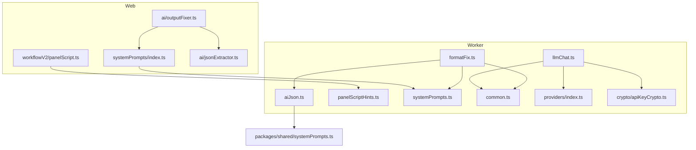
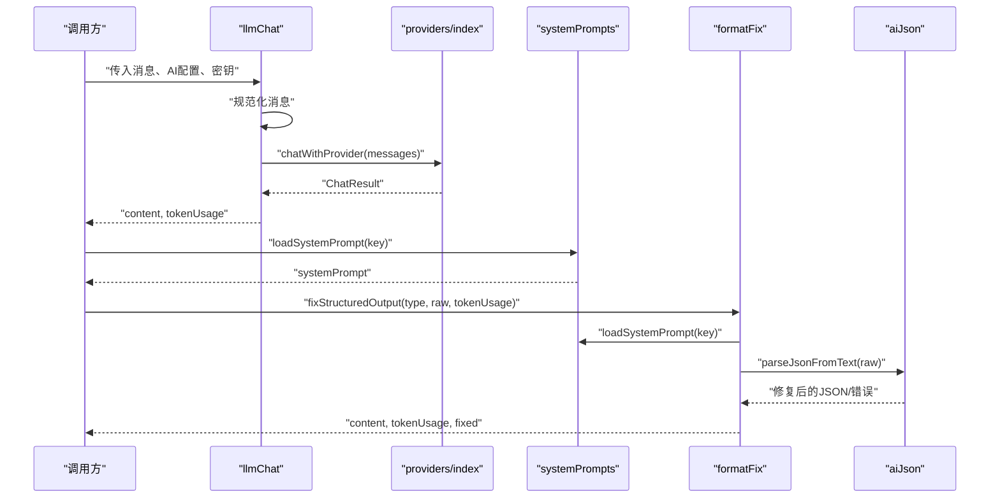
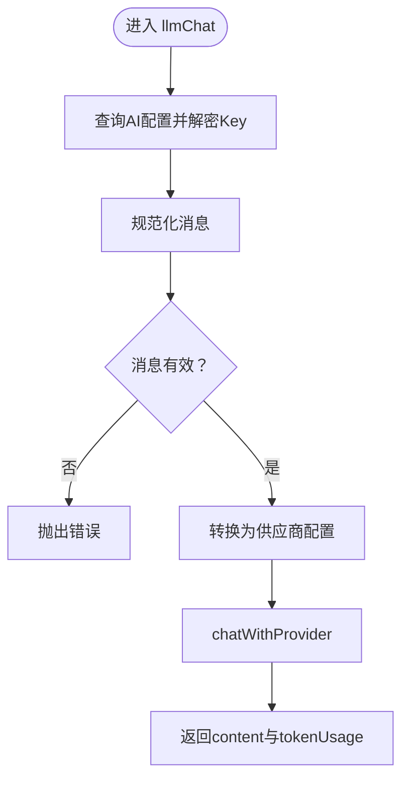
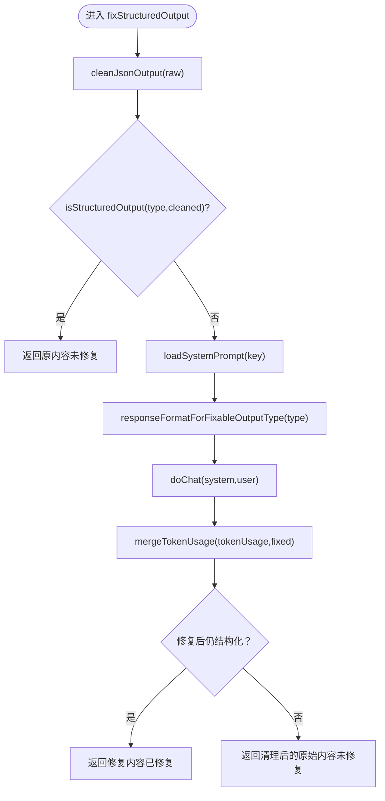
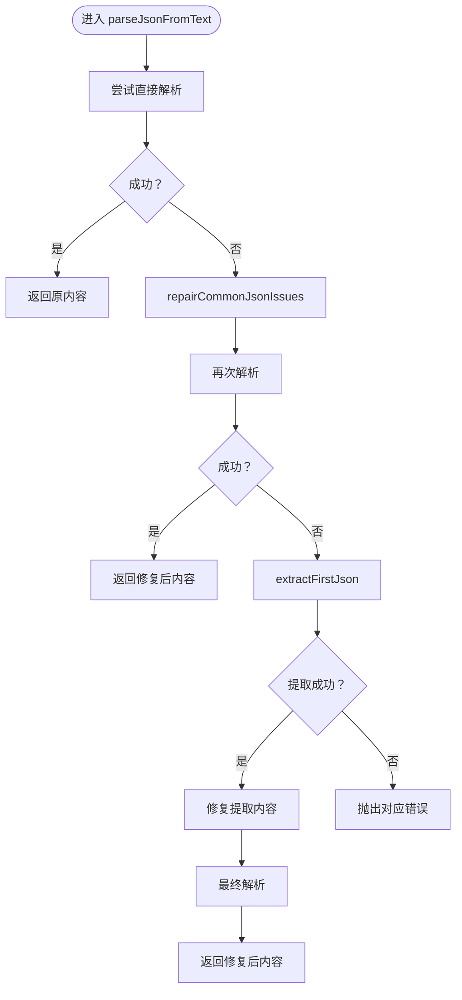
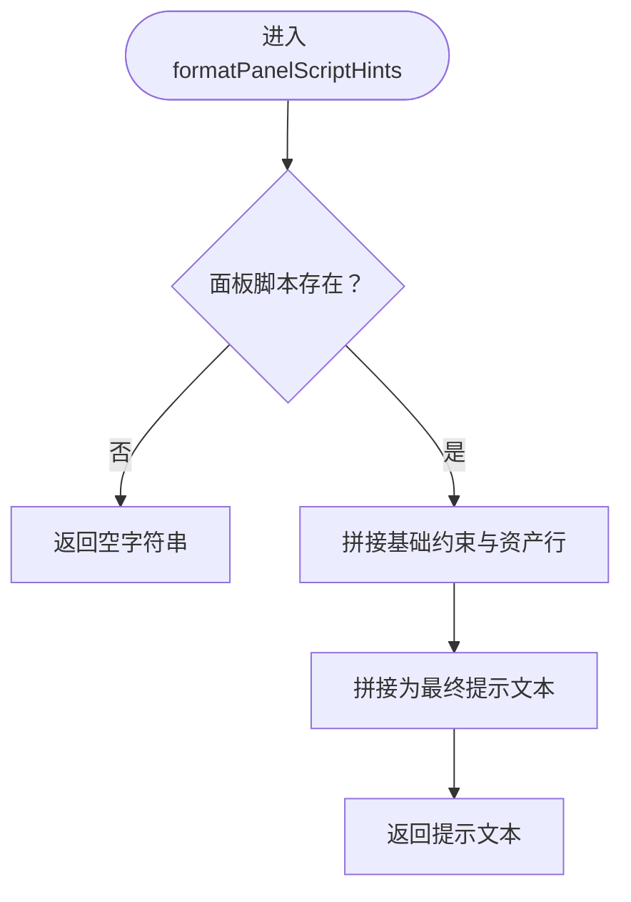
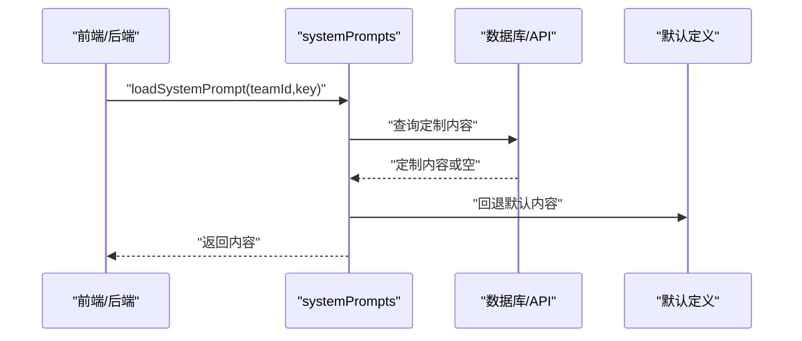
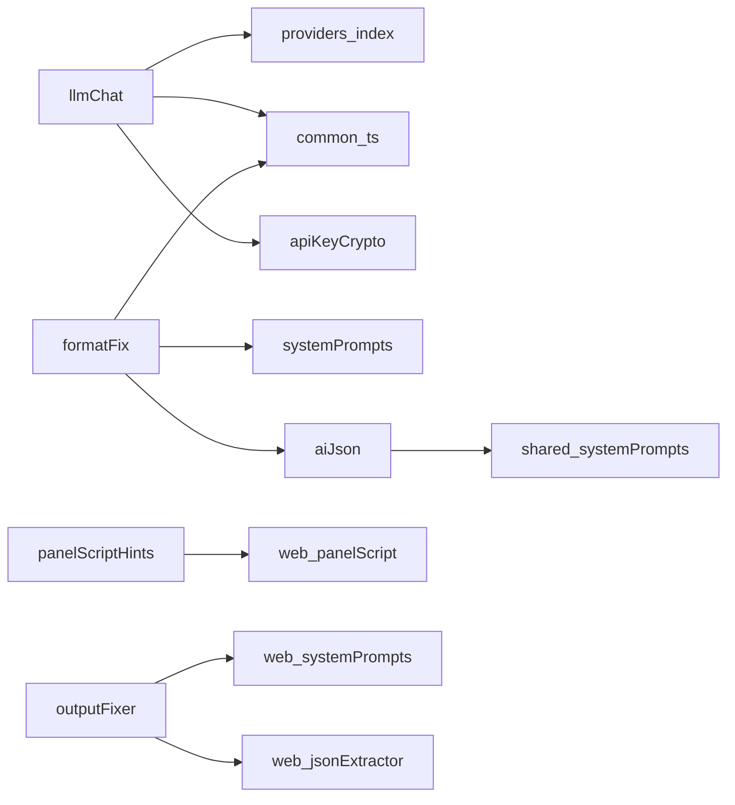

# 工具类任务

<cite>
**本文档引用的文件**
- [apps/worker/src/tasks/llmChat.ts](file://apps/worker/src/tasks/llmChat.ts)
- [apps/worker/src/tasks/formatFix.ts](file://apps/worker/src/tasks/formatFix.ts)
- [apps/worker/src/tasks/aiJson.ts](file://apps/worker/src/tasks/aiJson.ts)
- [apps/worker/src/tasks/panelScriptHints.ts](file://apps/worker/src/tasks/panelScriptHints.ts)
- [apps/worker/src/tasks/systemPrompts.ts](file://apps/worker/src/tasks/systemPrompts.ts)
- [apps/worker/src/tasks/common.ts](file://apps/worker/src/tasks/common.ts)
- [apps/worker/src/providers/index.ts](file://apps/worker/src/providers/index.ts)
- [apps/worker/src/crypto/apiKeyCrypto.ts](file://apps/worker/src/crypto/apiKeyCrypto.ts)
- [apps/web/src/lib/workflowV2/panelScript.ts](file://apps/web/src/lib/workflowV2/panelScript.ts)
- [apps/web/src/lib/systemPrompts/index.ts](file://apps/web/src/lib/systemPrompts/index.ts)
- [packages/shared/src/systemPrompts.ts](file://packages/shared/src/systemPrompts.ts)
- [apps/web/src/lib/ai/jsonExtractor.ts](file://apps/web/src/lib/ai/jsonExtractor.ts)
- [apps/web/src/lib/ai/outputFixer.ts](file://apps/web/src/lib/ai/outputFixer.ts)
- [apps/worker/src/tasks/aiJson.test.ts](file://apps/worker/src/tasks/aiJson.test.ts)
</cite>

## 目录

1. [简介](#简介)
2. [项目结构](#项目结构)
3. [核心组件](#核心组件)
4. [架构总览](#架构总览)
5. [详细组件分析](#详细组件分析)
6. [依赖分析](#依赖分析)
7. [性能考虑](#性能考虑)
8. [故障排查指南](#故障排查指南)
9. [结论](#结论)
10. [附录](#附录)

## 简介

本文件面向“工具类任务”，系统梳理并讲解以下辅助性AI任务的实现与应用：

- llmChat：统一的聊天接口封装，负责消息规范化、密钥解密、模型配置转换与调用。
- formatFix：结构化输出修复工具，结合系统提示与响应格式约束，将非结构化或半结构化输出修复为严格JSON。
- aiJson：LLM输出的JSON提取与修复流水线，支持从混合文本中提取首段完整JSON、修复常见问题并定位错误上下文。
- panelScriptHints：将面板脚本（分镜脚本）转换为人类可读的提示文本，帮助图生图/视频生成时对齐风格与资产。
- systemPrompts：系统提示词加载与覆盖机制，支持团队级定制与本地覆盖。

文档还涵盖参数配置、调用方式、集成策略、性能优化、错误处理与调试技巧，并提供在主任务中高效利用这些工具的最佳实践。

## 项目结构

工具类任务主要分布在后端Worker与前端Web两个侧：

- Worker侧：tasks目录提供llmChat、formatFix、aiJson、panelScriptHints、systemPrompts等任务；providers提供多供应商统一调用；common提供配置转换与token统计；crypto提供密钥解密。
- Web侧：workflowV2/panelScript.ts负责面板脚本的解析与补丁合并；web侧systemPrompts管理本地覆盖与API缓存；web侧ai模块提供前端侧JSON提取与修复请求封装。

**图表来源**

- [apps/worker/src/tasks/llmChat.ts](file://apps/worker/src/tasks/llmChat.ts#L1-L64)
- [apps/worker/src/tasks/formatFix.ts](file://apps/worker/src/tasks/formatFix.ts#L1-L280)
- [apps/worker/src/tasks/aiJson.ts](file://apps/worker/src/tasks/aiJson.ts#L1-L316)
- [apps/worker/src/tasks/panelScriptHints.ts](file://apps/worker/src/tasks/panelScriptHints.ts#L1-L175)
- [apps/worker/src/tasks/systemPrompts.ts](file://apps/worker/src/tasks/systemPrompts.ts#L1-L27)
- [apps/worker/src/tasks/common.ts](file://apps/worker/src/tasks/common.ts#L1-L154)
- [apps/worker/src/providers/index.ts](file://apps/worker/src/providers/index.ts#L1-L44)
- [apps/worker/src/crypto/apiKeyCrypto.ts](file://apps/worker/src/crypto/apiKeyCrypto.ts#L1-L23)
- [apps/web/src/lib/workflowV2/panelScript.ts](file://apps/web/src/lib/workflowV2/panelScript.ts#L1-L345)
- [apps/web/src/lib/systemPrompts/index.ts](file://apps/web/src/lib/systemPrompts/index.ts#L1-L197)
- [packages/shared/src/systemPrompts.ts](file://packages/shared/src/systemPrompts.ts#L1-L800)
- [apps/web/src/lib/ai/jsonExtractor.ts](file://apps/web/src/lib/ai/jsonExtractor.ts#L1-L129)
- [apps/web/src/lib/ai/outputFixer.ts](file://apps/web/src/lib/ai/outputFixer.ts#L1-L75)

**章节来源**

- [apps/worker/src/tasks/llmChat.ts](file://apps/worker/src/tasks/llmChat.ts#L1-L64)
- [apps/worker/src/tasks/formatFix.ts](file://apps/worker/src/tasks/formatFix.ts#L1-L280)
- [apps/worker/src/tasks/aiJson.ts](file://apps/worker/src/tasks/aiJson.ts#L1-L316)
- [apps/worker/src/tasks/panelScriptHints.ts](file://apps/worker/src/tasks/panelScriptHints.ts#L1-L175)
- [apps/worker/src/tasks/systemPrompts.ts](file://apps/worker/src/tasks/systemPrompts.ts#L1-L27)
- [apps/worker/src/tasks/common.ts](file://apps/worker/src/tasks/common.ts#L1-L154)
- [apps/worker/src/providers/index.ts](file://apps/worker/src/providers/index.ts#L1-L44)
- [apps/worker/src/crypto/apiKeyCrypto.ts](file://apps/worker/src/crypto/apiKeyCrypto.ts#L1-L23)
- [apps/web/src/lib/workflowV2/panelScript.ts](file://apps/web/src/lib/workflowV2/panelScript.ts#L1-L345)
- [apps/web/src/lib/systemPrompts/index.ts](file://apps/web/src/lib/systemPrompts/index.ts#L1-L197)
- [packages/shared/src/systemPrompts.ts](file://packages/shared/src/systemPrompts.ts#L1-L800)
- [apps/web/src/lib/ai/jsonExtractor.ts](file://apps/web/src/lib/ai/jsonExtractor.ts#L1-L129)
- [apps/web/src/lib/ai/outputFixer.ts](file://apps/web/src/lib/ai/outputFixer.ts#L1-L75)

## 核心组件

- llmChat：统一聊天接口，负责消息规范化、密钥解密、模型配置转换与调用，返回内容与token用量。
- formatFix：结构化输出修复，支持三种类型（场景锚点、关键帧提示词、运动提示词），内置响应格式约束与系统提示词加载。
- aiJson：LLM输出JSON提取与修复，支持多种修复路径（直接解析、修复后解析、提取首段JSON再解析），并提供错误上下文定位。
- panelScriptHints：将面板脚本结构化数据转换为人类可读提示，强调资产引用与参数建议，便于图生图/视频生成时对齐。
- systemPrompts：系统提示词加载与覆盖，优先读取团队定制内容，否则回退到默认定义。

**章节来源**

- [apps/worker/src/tasks/llmChat.ts](file://apps/worker/src/tasks/llmChat.ts#L27-L60)
- [apps/worker/src/tasks/formatFix.ts](file://apps/worker/src/tasks/formatFix.ts#L237-L278)
- [apps/worker/src/tasks/aiJson.ts](file://apps/worker/src/tasks/aiJson.ts#L222-L315)
- [apps/worker/src/tasks/panelScriptHints.ts](file://apps/worker/src/tasks/panelScriptHints.ts#L95-L174)
- [apps/worker/src/tasks/systemPrompts.ts](file://apps/worker/src/tasks/systemPrompts.ts#L4-L26)

## 架构总览

工具类任务围绕“消息规范化 → 配置转换 → 供应商调用 → 结果修复/提示生成”的主干流程展开。前端与后端分别提供本地与服务端能力，共享系统提示词定义。

**图表来源**

- [apps/worker/src/tasks/llmChat.ts](file://apps/worker/src/tasks/llmChat.ts#L27-L60)
- [apps/worker/src/providers/index.ts](file://apps/worker/src/providers/index.ts#L12-L25)
- [apps/worker/src/tasks/systemPrompts.ts](file://apps/worker/src/tasks/systemPrompts.ts#L4-L26)
- [apps/worker/src/tasks/formatFix.ts](file://apps/worker/src/tasks/formatFix.ts#L237-L278)
- [apps/worker/src/tasks/aiJson.ts](file://apps/worker/src/tasks/aiJson.ts#L222-L315)

## 详细组件分析

### llmChat：统一聊天接口

- 输入参数：Prisma客户端、团队ID、AI配置ID、消息数组、密钥密文、进度回调。
- 处理流程：
  - 查询AI配置，解密API Key。
  - 规范化消息（过滤非法项，校验角色与内容）。
  - 转换为供应商配置（模型、baseURL、温度等）。
  - 调用供应商聊天接口，更新进度，返回内容与token用量。
- 错误处理：配置不存在、消息无效、供应商调用失败均抛出错误。
- 性能注意：进度上报有助于前端反馈；避免在消息中携带大体积附件。

**图表来源**

- [apps/worker/src/tasks/llmChat.ts](file://apps/worker/src/tasks/llmChat.ts#L27-L60)
- [apps/worker/src/tasks/common.ts](file://apps/worker/src/tasks/common.ts#L81-L116)
- [apps/worker/src/providers/index.ts](file://apps/worker/src/providers/index.ts#L12-L25)
- [apps/worker/src/crypto/apiKeyCrypto.ts](file://apps/worker/src/crypto/apiKeyCrypto.ts#L8-L20)

**章节来源**

- [apps/worker/src/tasks/llmChat.ts](file://apps/worker/src/tasks/llmChat.ts#L27-L60)
- [apps/worker/src/tasks/common.ts](file://apps/worker/src/tasks/common.ts#L81-L116)
- [apps/worker/src/providers/index.ts](file://apps/worker/src/providers/index.ts#L12-L25)
- [apps/worker/src/crypto/apiKeyCrypto.ts](file://apps/worker/src/crypto/apiKeyCrypto.ts#L8-L20)

### formatFix：结构化输出修复

- 支持类型：场景锚点、关键帧提示词、运动提示词。
- 核心步骤：
  - 清理输出（提取被代码块包裹的JSON）。
  - 验证结构（按类型定义的schema校验）。
  - 若仍不结构化，加载对应系统提示词，启用JSON Schema响应格式，再次请求修复。
  - 合并token用量，回退策略：若修复失败则返回清理后的原始内容。
- 响应格式：统一返回content、tokenUsage与fixed标记。

**图表来源**

- [apps/worker/src/tasks/formatFix.ts](file://apps/worker/src/tasks/formatFix.ts#L237-L278)
- [apps/worker/src/tasks/systemPrompts.ts](file://apps/worker/src/tasks/systemPrompts.ts#L4-L26)
- [apps/worker/src/tasks/common.ts](file://apps/worker/src/tasks/common.ts#L10-L17)

**章节来源**

- [apps/worker/src/tasks/formatFix.ts](file://apps/worker/src/tasks/formatFix.ts#L237-L278)
- [apps/worker/src/tasks/systemPrompts.ts](file://apps/worker/src/tasks/systemPrompts.ts#L4-L26)
- [apps/worker/src/tasks/common.ts](file://apps/worker/src/tasks/common.ts#L10-L17)

### aiJson：JSON提取与修复

- 提取策略：
  - 直接解析：最快，避免“修复逻辑误伤合法JSON”。
  - 轻量修复：修复控制字符、尾随逗号、中文引号等。
  - 提取首段完整JSON：处理被解释文字/代码块包裹的情况。
- 错误分类与提示：
  - 未找到JSON起始符号、JSON未闭合、空内容、类型不匹配、解析失败等，并提供上下文定位。
- 前端配套：web侧jsonExtractor提供类似能力，便于前端快速定位候选JSON对象。

**图表来源**

- [apps/worker/src/tasks/aiJson.ts](file://apps/worker/src/tasks/aiJson.ts#L222-L315)
- [apps/web/src/lib/ai/jsonExtractor.ts](file://apps/web/src/lib/ai/jsonExtractor.ts#L98-L129)

**章节来源**

- [apps/worker/src/tasks/aiJson.ts](file://apps/worker/src/tasks/aiJson.ts#L1-L316)
- [apps/web/src/lib/ai/jsonExtractor.ts](file://apps/web/src/lib/ai/jsonExtractor.ts#L1-L129)
- [apps/worker/src/tasks/aiJson.test.ts](file://apps/worker/src/tasks/aiJson.test.ts#L1-L50)

### panelScriptHints：面板脚本提示生成

- 输入：面板脚本对象（含地点、时间/天气、镜头、站位/视线、道具、资产绑定、参数建议等）。
- 输出：格式化的提示文本，强调资产引用与参数建议，避免重复外观描述，只写差量。
- 选项：支持字符名映射与是否包含资产提示。

**图表来源**

- [apps/worker/src/tasks/panelScriptHints.ts](file://apps/worker/src/tasks/panelScriptHints.ts#L95-L174)
- [apps/web/src/lib/workflowV2/panelScript.ts](file://apps/web/src/lib/workflowV2/panelScript.ts#L255-L281)

**章节来源**

- [apps/worker/src/tasks/panelScriptHints.ts](file://apps/worker/src/tasks/panelScriptHints.ts#L95-L174)
- [apps/web/src/lib/workflowV2/panelScript.ts](file://apps/web/src/lib/workflowV2/panelScript.ts#L255-L281)

### systemPrompts：系统提示管理

- 加载策略：优先读取团队定制内容（数据库或API缓存），否则回退到默认定义。
- 前端覆盖：支持本地localStorage覆盖，便于离线或开发调试。
- 定义来源：packages/shared提供系统提示定义集合，包含工作流、修复、动作节拍、因果链等类别。

**图表来源**

- [apps/worker/src/tasks/systemPrompts.ts](file://apps/worker/src/tasks/systemPrompts.ts#L4-L26)
- [apps/web/src/lib/systemPrompts/index.ts](file://apps/web/src/lib/systemPrompts/index.ts#L84-L124)
- [packages/shared/src/systemPrompts.ts](file://packages/shared/src/systemPrompts.ts#L22-L800)

**章节来源**

- [apps/worker/src/tasks/systemPrompts.ts](file://apps/worker/src/tasks/systemPrompts.ts#L4-L26)
- [apps/web/src/lib/systemPrompts/index.ts](file://apps/web/src/lib/systemPrompts/index.ts#L84-L124)
- [packages/shared/src/systemPrompts.ts](file://packages/shared/src/systemPrompts.ts#L22-L800)

## 依赖分析

- llmChat依赖：
  - providers/index：统一供应商调用入口。
  - tasks/common：模型参数与baseURL转换。
  - crypto/apiKeyCrypto：密钥解密。
- formatFix依赖：
  - tasks/systemPrompts：加载修复用系统提示。
  - tasks/aiJson：提取与修复LLM输出。
  - tasks/common：token用量合并。
- aiJson依赖：
  - shared/systemPrompts：错误提示中引用默认定义。
- panelScriptHints依赖：
  - web侧workflowV2/panelScript：解析与补丁合并，确保输入结构化。
- web侧outputFixer依赖：
  - web侧systemPrompts：加载修复用系统提示。
  - web侧jsonExtractor：前端侧JSON提取。

**图表来源**

- [apps/worker/src/tasks/llmChat.ts](file://apps/worker/src/tasks/llmChat.ts#L1-L64)
- [apps/worker/src/providers/index.ts](file://apps/worker/src/providers/index.ts#L1-L44)
- [apps/worker/src/tasks/common.ts](file://apps/worker/src/tasks/common.ts#L1-L154)
- [apps/worker/src/crypto/apiKeyCrypto.ts](file://apps/worker/src/crypto/apiKeyCrypto.ts#L1-L23)
- [apps/worker/src/tasks/formatFix.ts](file://apps/worker/src/tasks/formatFix.ts#L1-L280)
- [apps/worker/src/tasks/systemPrompts.ts](file://apps/worker/src/tasks/systemPrompts.ts#L1-L27)
- [apps/worker/src/tasks/aiJson.ts](file://apps/worker/src/tasks/aiJson.ts#L1-L316)
- [packages/shared/src/systemPrompts.ts](file://packages/shared/src/systemPrompts.ts#L1-L800)
- [apps/worker/src/tasks/panelScriptHints.ts](file://apps/worker/src/tasks/panelScriptHints.ts#L1-L175)
- [apps/web/src/lib/workflowV2/panelScript.ts](file://apps/web/src/lib/workflowV2/panelScript.ts#L1-L345)
- [apps/web/src/lib/ai/outputFixer.ts](file://apps/web/src/lib/ai/outputFixer.ts#L1-L75)
- [apps/web/src/lib/ai/jsonExtractor.ts](file://apps/web/src/lib/ai/jsonExtractor.ts#L1-L129)

**章节来源**

- [apps/worker/src/tasks/llmChat.ts](file://apps/worker/src/tasks/llmChat.ts#L1-L64)
- [apps/worker/src/tasks/formatFix.ts](file://apps/worker/src/tasks/formatFix.ts#L1-L280)
- [apps/worker/src/tasks/aiJson.ts](file://apps/worker/src/tasks/aiJson.ts#L1-L316)
- [apps/worker/src/tasks/panelScriptHints.ts](file://apps/worker/src/tasks/panelScriptHints.ts#L1-L175)
- [apps/worker/src/tasks/systemPrompts.ts](file://apps/worker/src/tasks/systemPrompts.ts#L1-L27)
- [apps/worker/src/tasks/common.ts](file://apps/worker/src/tasks/common.ts#L1-L154)
- [apps/worker/src/providers/index.ts](file://apps/worker/src/providers/index.ts#L1-L44)
- [apps/worker/src/crypto/apiKeyCrypto.ts](file://apps/worker/src/crypto/apiKeyCrypto.ts#L1-L23)
- [apps/web/src/lib/workflowV2/panelScript.ts](file://apps/web/src/lib/workflowV2/panelScript.ts#L1-L345)
- [apps/web/src/lib/systemPrompts/index.ts](file://apps/web/src/lib/systemPrompts/index.ts#L1-L197)
- [packages/shared/src/systemPrompts.ts](file://packages/shared/src/systemPrompts.ts#L1-L800)
- [apps/web/src/lib/ai/outputFixer.ts](file://apps/web/src/lib/ai/outputFixer.ts#L1-L75)
- [apps/web/src/lib/ai/jsonExtractor.ts](file://apps/web/src/lib/ai/jsonExtractor.ts#L1-L129)

## 性能考虑

- token用量合并：在修复链路中累积token用量，便于成本控制与上限预警。
- 供应商配置转换：统一处理baseURL与模型参数，减少重复计算。
- 前端与后端并行：前端可先行提取候选JSON，后端进行严格修复与系统提示词加载，降低往返延迟。
- 进度上报：llmChat提供阶段性进度，改善用户体验与可观测性。
- 最小修复原则：formatFix仅在必要时触发修复，优先返回清理后的原始内容，避免过度干预。

[本节为通用指导，无需特定文件引用]

## 故障排查指南

- JSON解析失败：
  - 检查是否包含未转义控制字符、尾随逗号、中文引号等；使用aiJson的修复路径或前端jsonExtractor定位候选。
  - 参考错误提示中的上下文片段，定位具体位置。
- 输出非结构化：
  - 使用formatFix的系统提示与JSON Schema响应格式，强制模型输出严格JSON。
  - 若修复失败，回退到清理后的原始内容，避免中断流程。
- 空内容或截断：
  - 提高maxTokens或简化输入复杂度；检查模型是否支持JSON输出模式。
- 密钥问题：
  - 确认密钥解密流程正确；检查API Key有效性与额度状态。
- 系统提示词未生效：
  - 确认teamId与key匹配；前端可检查本地覆盖与API缓存状态。

**章节来源**

- [apps/worker/src/tasks/aiJson.ts](file://apps/worker/src/tasks/aiJson.ts#L244-L315)
- [apps/worker/src/tasks/formatFix.ts](file://apps/worker/src/tasks/formatFix.ts#L254-L278)
- [apps/worker/src/tasks/systemPrompts.ts](file://apps/worker/src/tasks/systemPrompts.ts#L4-L26)
- [apps/web/src/lib/systemPrompts/index.ts](file://apps/web/src/lib/systemPrompts/index.ts#L84-L124)

## 结论

工具类任务通过“消息规范化、配置转换、统一调用、修复与提示生成”的闭环，显著提升了结构化输出的稳定性与可消费性。llmChat提供统一入口，formatFix与aiJson构成强大的输出修复链，panelScriptHints与systemPrompts保障提示词与资产对齐。结合前端与后端能力，可在主任务中高效集成这些工具，实现从LLM到高质量结构化产物的可靠转化。

[本节为总结，无需特定文件引用]

## 附录

- 参数配置要点
  - AI配置：provider、model、baseURL、generationParams（temperature、topP、maxTokens、惩罚项等）。
  - 密钥管理：使用加密密文存储，运行时解密。
  - 响应格式：启用JSON Schema以约束模型输出。
- 调用方式与集成策略
  - 后端Worker：在队列任务中调用llmChat与formatFix，配合systemPrompts加载定制提示。
  - 前端Web：在UI交互中调用outputFixer与jsonExtractor，结合面板脚本解析与资产绑定。
- 最佳实践
  - 优先使用JSON Schema与系统提示词，减少非结构化输出。
  - 在修复失败时采用回退策略，保证流程可用性。
  - 合理设置maxTokens与温度参数，平衡质量与成本。
  - 使用token用量统计进行成本监控与阈值告警。

[本节为通用指导，无需特定文件引用]
