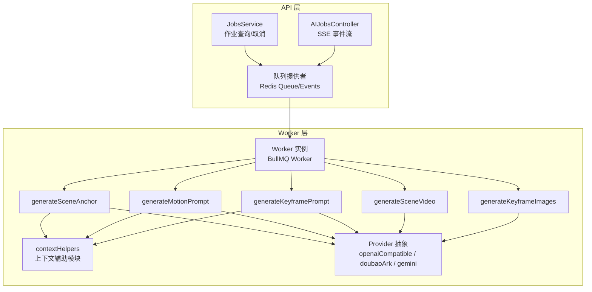
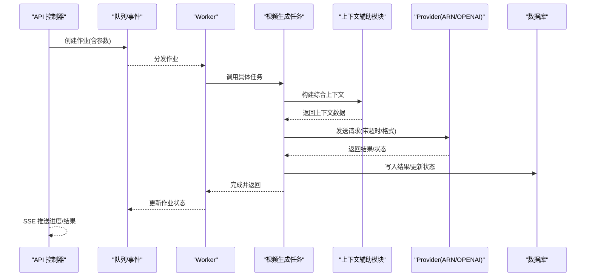
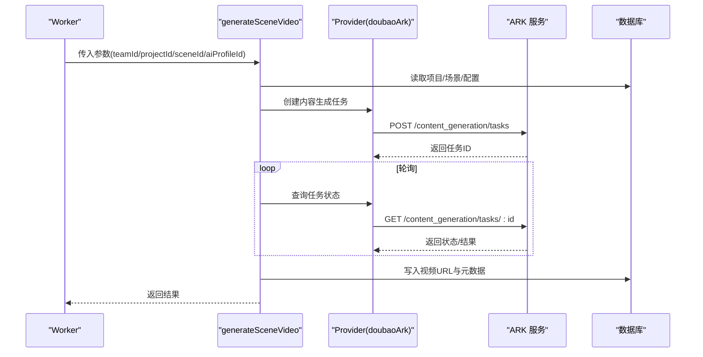
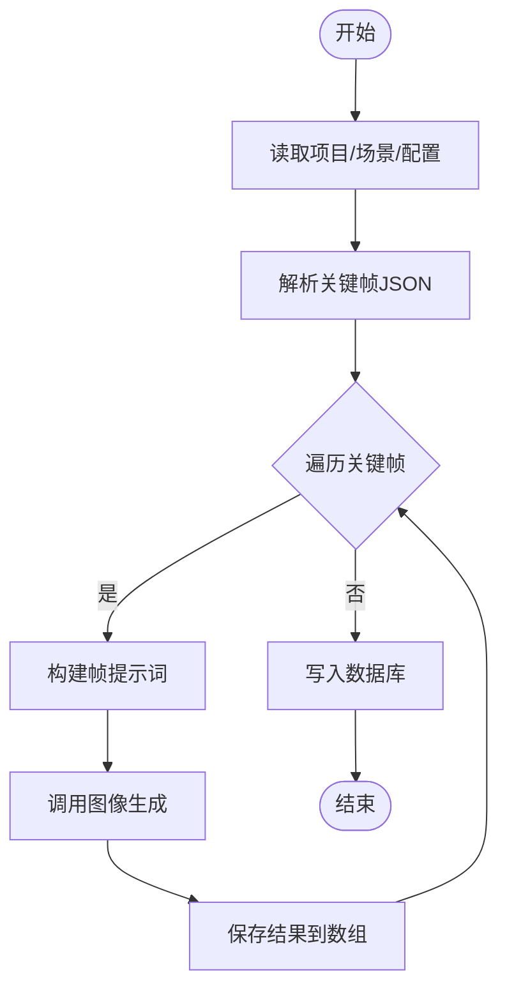
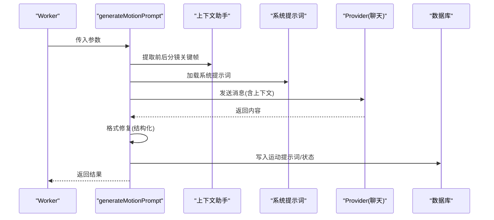
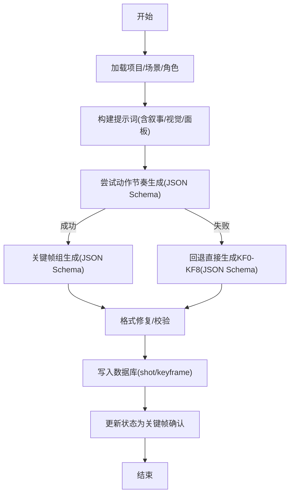
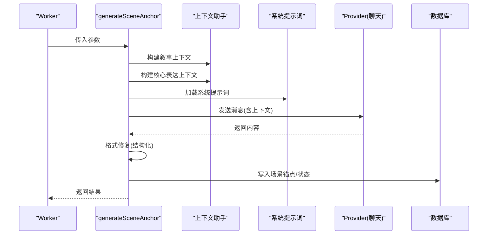
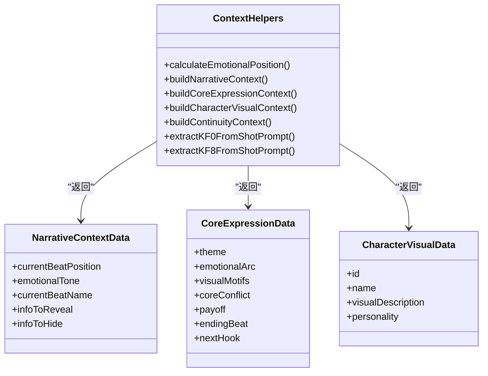
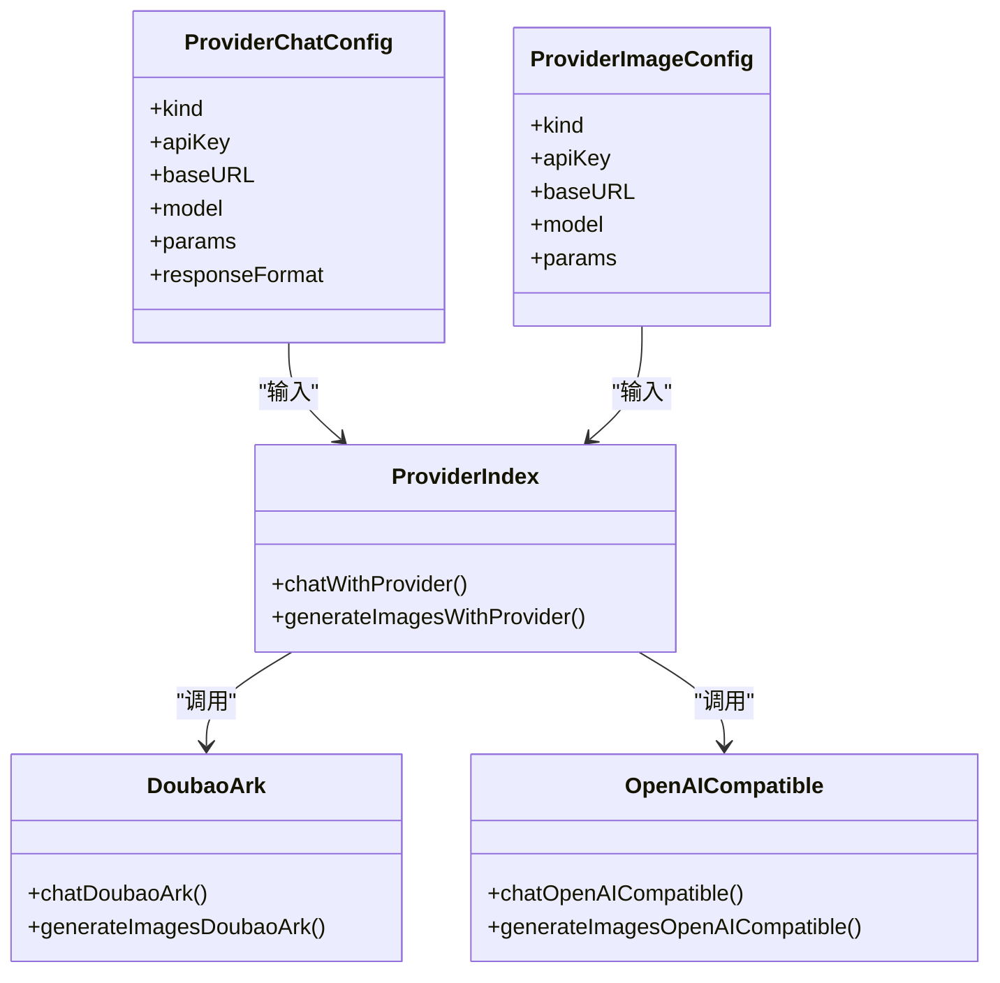
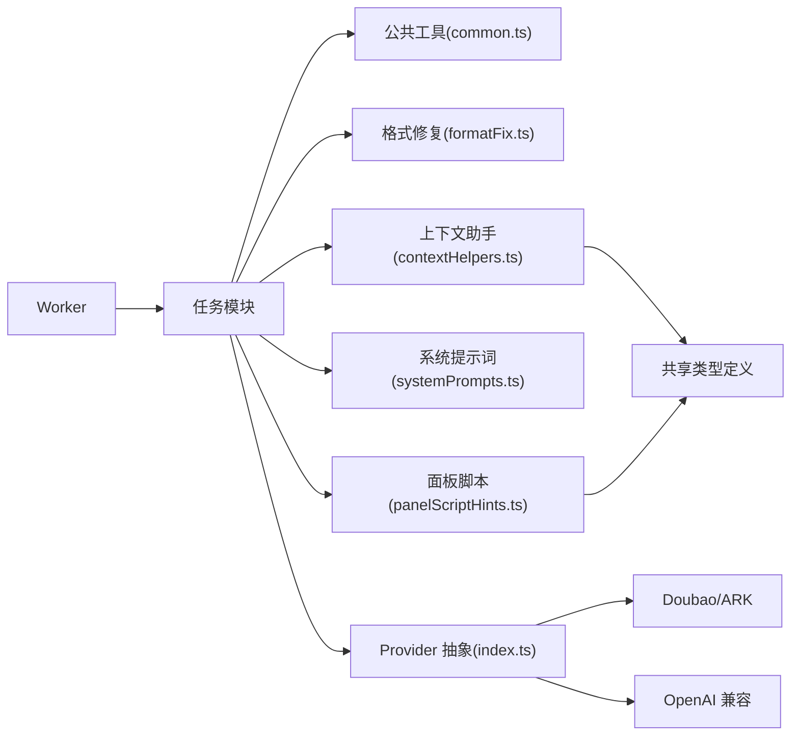

# 视频生成任务

<cite>
**本文引用的文件**
- [apps/worker/src/tasks/generateSceneVideo.ts](file://apps/worker/src/tasks/generateSceneVideo.ts)
- [apps/worker/src/tasks/generateKeyframeImages.ts](file://apps/worker/src/tasks/generateKeyframeImages.ts)
- [apps/worker/src/tasks/generateMotionPrompt.ts](file://apps/worker/src/tasks/generateMotionPrompt.ts)
- [apps/worker/src/tasks/generateKeyframePrompt.ts](file://apps/worker/src/tasks/generateKeyframePrompt.ts)
- [apps/worker/src/tasks/generateSceneAnchor.ts](file://apps/worker/src/tasks/generateSceneAnchor.ts)
- [apps/worker/src/tasks/common.ts](file://apps/worker/src/tasks/common.ts)
- [apps/worker/src/tasks/contextHelpers.ts](file://apps/worker/src/tasks/contextHelpers.ts)
- [apps/worker/src/providers/doubaoArk.ts](file://apps/worker/src/providers/doubaoArk.ts)
- [apps/worker/src/providers/openaiCompatible.ts](file://apps/worker/src/providers/openaiCompatible.ts)
- [apps/worker/src/providers/index.ts](file://apps/worker/src/providers/index.ts)
- [apps/worker/src/tasks/formatFix.ts](file://apps/worker/src/tasks/formatFix.ts)
- [apps/worker/src/tasks/systemPrompts.ts](file://apps/worker/src/tasks/systemPrompts.ts)
- [apps/worker/src/tasks/panelScriptHints.ts](file://apps/worker/src/tasks/panelScriptHints.ts)
- [apps/worker/src/worker.ts](file://apps/worker/src/worker.ts)
- [apps/api/src/jobs/queue.providers.ts](file://apps/api/src/jobs/queue.providers.ts)
- [apps/api/src/jobs/ai-jobs.controller.ts](file://apps/api/src/jobs/ai-jobs.controller.ts)
- [apps/api/src/jobs/jobs.service.ts](file://apps/api/src/jobs/jobs.service.ts)
- [apps/worker/package.json](file://apps/worker/package.json)
</cite>

## 目录

1. [简介](#简介)
2. [项目结构](#项目结构)
3. [核心组件](#核心组件)
4. [架构总览](#架构总览)
5. [详细组件分析](#详细组件分析)
6. [依赖分析](#依赖分析)
7. [性能考虑](#性能考虑)
8. [故障排查指南](#故障排查指南)
9. [结论](#结论)
10. [附录](#附录)

## 简介

本文件面向视频生成任务，系统性梳理从关键帧提示词生成、运动提示生成到视频合成的完整工作流。重点覆盖以下能力：

- generateSceneVideo：基于 ARK/豆包的视频生成任务，含任务创建、轮询、结果写入与错误处理。
- generateKeyframeImages：根据关键帧提示词生成静态关键帧图像，并持久化结果。
- generateMotionPrompt：结合前后分镜连续性与叙事上下文，生成运动提示词。
- generateKeyframePrompt：通过动作节奏与关键帧组生成器，产出结构化关键帧提示词。
- generateSceneAnchor：基于叙事因果链和核心表达生成场景锚点，支持综合上下文运用。

文档还涵盖质量控制、分辨率适配与格式转换机制、资源管理、并发控制与性能优化策略，并提供配置参数说明与使用示例，帮助处理不同类型的视频生成需求与质量要求。

## 项目结构

视频生成子系统位于 worker 工作进程，采用任务模块化组织，配合 API 层的队列与事件订阅，实现异步执行与进度推送。

**图表来源**

- [apps/api/src/jobs/ai-jobs.controller.ts](file://apps/api/src/jobs/ai-jobs.controller.ts#L15-L35)
- [apps/api/src/jobs/queue.providers.ts](file://apps/api/src/jobs/queue.providers.ts#L17-L36)
- [apps/api/src/jobs/jobs.service.ts](file://apps/api/src/jobs/jobs.service.ts#L37-L43)
- [apps/worker/src/worker.ts](file://apps/worker/src/worker.ts#L50-L90)
- [apps/worker/src/providers/index.ts](file://apps/worker/src/providers/index.ts#L12-L43)

**章节来源**

- [apps/worker/src/worker.ts](file://apps/worker/src/worker.ts#L44-L200)
- [apps/api/src/jobs/queue.providers.ts](file://apps/api/src/jobs/queue.providers.ts#L1-L36)
- [apps/api/src/jobs/ai-jobs.controller.ts](file://apps/api/src/jobs/ai-jobs.controller.ts#L1-L35)
- [apps/api/src/jobs/jobs.service.ts](file://apps/api/src/jobs/jobs.service.ts#L1-L43)

## 核心组件

- generateSceneVideo：负责创建 ARK 视频生成任务、轮询状态、提取结果并写入数据库。
- generateKeyframeImages：解析关键帧 JSON，逐帧生成图像并持久化。
- generateMotionPrompt：构建连续性上下文与叙事意图，生成运动提示词并写入数据库。
- generateKeyframePrompt：通过动作节奏与关键帧组生成器，产出结构化关键帧提示词，支持回退与格式修复。
- generateSceneAnchor：基于叙事因果链和核心表达生成场景锚点，支持综合上下文运用。
- contextHelpers：新增的上下文辅助模块，提供叙事上下文、核心表达上下文和角色视觉上下文的综合构建能力。
- Provider 抽象：统一聊天与图像生成接口，屏蔽不同供应商差异。
- 格式修复与校验：对结构化输出进行 JSON Schema 校验与修复。
- 上下文与动作节奏：提供情感位置、角色视觉、连续性上下文与关键帧组校验。

**章节来源**

- [apps/worker/src/tasks/generateSceneVideo.ts](file://apps/worker/src/tasks/generateSceneVideo.ts#L192-L311)
- [apps/worker/src/tasks/generateKeyframeImages.ts](file://apps/worker/src/tasks/generateKeyframeImages.ts#L103-L202)
- [apps/worker/src/tasks/generateMotionPrompt.ts](file://apps/worker/src/tasks/generateMotionPrompt.ts#L59-L180)
- [apps/worker/src/tasks/generateKeyframePrompt.ts](file://apps/worker/src/tasks/generateKeyframePrompt.ts#L145-L373)
- [apps/worker/src/tasks/generateSceneAnchor.ts](file://apps/worker/src/tasks/generateSceneAnchor.ts#L81-L228)
- [apps/worker/src/tasks/contextHelpers.ts](file://apps/worker/src/tasks/contextHelpers.ts#L1-L335)
- [apps/worker/src/providers/index.ts](file://apps/worker/src/providers/index.ts#L12-L43)
- [apps/worker/src/tasks/formatFix.ts](file://apps/worker/src/tasks/formatFix.ts#L237-L278)

## 架构总览

整体流程自上而下分为 API 控制层、队列与事件层、Worker 执行层与外部供应商层。Worker 根据作业类型路由到具体任务，任务内部通过 Provider 抽象调用不同供应商接口，完成后写入数据库并更新作业状态。

**图表来源**

- [apps/api/src/jobs/ai-jobs.controller.ts](file://apps/api/src/jobs/ai-jobs.controller.ts#L33-L35)
- [apps/worker/src/worker.ts](file://apps/worker/src/worker.ts#L50-L90)
- [apps/worker/src/tasks/generateSceneVideo.ts](file://apps/worker/src/tasks/generateSceneVideo.ts#L245-L310)
- [apps/worker/src/providers/index.ts](file://apps/worker/src/providers/index.ts#L12-L25)

## 详细组件分析

### 视频生成任务：generateSceneVideo

- 功能要点
  - 读取项目与场景信息，拼装风格与运动提示词。
  - 使用 ARK/豆包创建内容生成任务，轮询状态直至完成或失败。
  - 提取视频 URL 并写入数据库，更新作业进度。
- 关键参数与行为
  - 请求与视频轮询超时、轮询间隔可通过环境变量配置。
  - 支持 ARK 模型/接入点规范化与 API Key 规范化。
  - 错误处理包含 HTTP 状态码解析与详细错误信息拼接。
- 数据写入
  - 将生成的视频 URL、提示词、模型与元数据写入场景记录。

**图表来源**

- [apps/worker/src/tasks/generateSceneVideo.ts](file://apps/worker/src/tasks/generateSceneVideo.ts#L140-L190)
- [apps/worker/src/providers/doubaoArk.ts](file://apps/worker/src/providers/doubaoArk.ts#L210-L251)
- [apps/worker/src/tasks/generateSceneVideo.ts](file://apps/worker/src/tasks/generateSceneVideo.ts#L258-L310)

**章节来源**

- [apps/worker/src/tasks/generateSceneVideo.ts](file://apps/worker/src/tasks/generateSceneVideo.ts#L192-L311)
- [apps/worker/src/providers/doubaoArk.ts](file://apps/worker/src/providers/doubaoArk.ts#L58-L129)

### 关键帧图像生成：generateKeyframeImages

- 功能要点
  - 解析关键帧 JSON，按 KF0/KF1/KF2 等生成提示词，逐帧调用图像生成。
  - 支持多语言提示词构建与相机/主体/构图等维度描述。
  - 将生成的图像 URL、修订提示词与元数据写入场景。
- 关键参数与行为
  - 通过配置映射生成图像模型，支持 ARK/OPENAI 等供应商。
  - 进度按帧数线性推进，便于前端展示。
- 数据写入
  - 生成结果数组包含 keyframe、url、prompt、revisedPrompt、provider、model 等字段。

**图表来源**

- [apps/worker/src/tasks/generateKeyframeImages.ts](file://apps/worker/src/tasks/generateKeyframeImages.ts#L103-L202)
- [apps/worker/src/tasks/common.ts](file://apps/worker/src/tasks/common.ts#L118-L153)

**章节来源**

- [apps/worker/src/tasks/generateKeyframeImages.ts](file://apps/worker/src/tasks/generateKeyframeImages.ts#L103-L202)
- [apps/worker/src/tasks/common.ts](file://apps/worker/src/tasks/common.ts#L118-L153)

### 运动提示生成：generateMotionPrompt

- 功能要点
  - 构建当前分镜概要、前后分镜连续性上下文与面板脚本提示。
  - 加载系统提示词，调用聊天接口生成运动提示词。
  - 使用格式修复模块确保输出结构化，写入数据库并更新状态。
- 关键参数与行为
  - 支持情感位置（起承转合）与核心表达上下文注入。
  - 连续性上下文通过 KF0/KF8 提取，确保镜头切换连贯。
- 数据写入
  - 写入 motionPrompt 字段与 tokenUsage，并更新状态为"运动提示词生成中"。

**图表来源**

- [apps/worker/src/tasks/generateMotionPrompt.ts](file://apps/worker/src/tasks/generateMotionPrompt.ts#L59-L180)
- [apps/worker/src/tasks/contextHelpers.ts](file://apps/worker/src/tasks/contextHelpers.ts#L311-L334)
- [apps/worker/src/tasks/systemPrompts.ts](file://apps/worker/src/tasks/systemPrompts.ts#L4-L26)
- [apps/worker/src/tasks/formatFix.ts](file://apps/worker/src/tasks/formatFix.ts#L237-L278)

**章节来源**

- [apps/worker/src/tasks/generateMotionPrompt.ts](file://apps/worker/src/tasks/generateMotionPrompt.ts#L59-L180)
- [apps/worker/src/tasks/contextHelpers.ts](file://apps/worker/src/tasks/contextHelpers.ts#L82-L134)

### 关键帧提示词生成：generateKeyframePrompt

- 功能要点
  - 通过动作节奏与关键帧组生成器，产出结构化关键帧提示词。
  - 支持回退路径：若动作节奏/关键帧组生成失败，则直接生成 KF0-KF8。
  - 使用 JSON Schema 校验与修复，确保输出结构完整。
- 关键参数与行为
  - 情感位置（起承转合）与核心表达上下文注入，指导角色表情、姿态与氛围。
  - 相机类型、角度、纵横比与主体锚点引用约束。
- 数据写入
  - 写入 shotPrompt、actionPlanJson、keyframeGroupsJson，并更新状态为"关键帧确认"。

**图表来源**

- [apps/worker/src/tasks/generateKeyframePrompt.ts](file://apps/worker/src/tasks/generateKeyframePrompt.ts#L145-L373)
- [apps/worker/src/tasks/actionBeats.ts](file://apps/worker/src/tasks/actionBeats.ts#L734-L800)
- [apps/worker/src/tasks/formatFix.ts](file://apps/worker/src/tasks/formatFix.ts#L237-L278)

**章节来源**

- [apps/worker/src/tasks/generateKeyframePrompt.ts](file://apps/worker/src/tasks/generateKeyframePrompt.ts#L145-L373)
- [apps/worker/src/tasks/actionBeats.ts](file://apps/worker/src/tasks/actionBeats.ts#L545-L732)
- [apps/worker/src/tasks/formatFix.ts](file://apps/worker/src/tasks/formatFix.ts#L125-L138)

### 场景锚点生成：generateSceneAnchor

- 功能要点
  - 基于叙事因果链和核心表达生成场景锚点，支持综合上下文运用。
  - 构建叙事上下文（起承转合位置、情绪基调、当前节拍）与核心表达上下文。
  - 生成场景锚点 JSON，确保环境一致性与可复现性。
- 关键参数与行为
  - 支持剧集上下文、叙事因果链与核心表达的综合运用。
  - 情感曲线位置计算与当前阶段情绪注入。
- 数据写入
  - 写入 sceneDescription 字段与 tokenUsage，并更新状态为"场景确认"。

**图表来源**

- [apps/worker/src/tasks/generateSceneAnchor.ts](file://apps/worker/src/tasks/generateSceneAnchor.ts#L81-L228)
- [apps/worker/src/tasks/contextHelpers.ts](file://apps/worker/src/tasks/contextHelpers.ts#L154-L199)
- [apps/worker/src/tasks/contextHelpers.ts](file://apps/worker/src/tasks/contextHelpers.ts#L236-L282)
- [apps/worker/src/tasks/systemPrompts.ts](file://apps/worker/src/tasks/systemPrompts.ts#L4-L26)
- [apps/worker/src/tasks/formatFix.ts](file://apps/worker/src/tasks/formatFix.ts#L237-L278)

**章节来源**

- [apps/worker/src/tasks/generateSceneAnchor.ts](file://apps/worker/src/tasks/generateSceneAnchor.ts#L81-L228)
- [apps/worker/src/tasks/contextHelpers.ts](file://apps/worker/src/tasks/contextHelpers.ts#L136-L199)

### 上下文辅助模块：contextHelpers

- 功能要点
  - 提供叙事上下文构建：基于情感曲线位置（起承转合）与叙事因果链生成当前节拍信息。
  - 提供核心表达上下文构建：解析剧集核心表达数据，生成主题、情感曲线、视觉母题等描述。
  - 提供角色视觉上下文构建：整合角色外貌与性格描述，支持角色锚点引用。
  - 提供连续性上下文构建：提取前后分镜关键帧，确保镜头切换连贯。
- 关键参数与行为
  - 情感位置计算：根据分镜序号与总分镜数计算当前情感位置。
  - 叙事因果链解析：从项目上下文中提取因果链数据，支持三幕结构与五幕结构映射。
  - 核心表达解析：解析剧集核心表达 JSON，生成结构化上下文描述。
- 数据写入
  - 返回结构化字符串，供各任务模块组合使用。

**图表来源**

- [apps/worker/src/tasks/contextHelpers.ts](file://apps/worker/src/tasks/contextHelpers.ts#L82-L199)
- [apps/worker/src/tasks/contextHelpers.ts](file://apps/worker/src/tasks/contextHelpers.ts#L10-L75)

**章节来源**

- [apps/worker/src/tasks/contextHelpers.ts](file://apps/worker/src/tasks/contextHelpers.ts#L1-L335)

### Provider 抽象与适配

- 统一聊天与图像生成接口，屏蔽不同供应商差异。
- Doubao/ARK：支持模型/接入点规范化、响应文本抽取、令牌用量映射与错误包装。
- OpenAI 兼容：支持 responses/chat/completions 自适应、响应格式降级与错误分类。

**图表来源**

- [apps/worker/src/providers/index.ts](file://apps/worker/src/providers/index.ts#L12-L43)
- [apps/worker/src/providers/doubaoArk.ts](file://apps/worker/src/providers/doubaoArk.ts#L210-L300)
- [apps/worker/src/providers/openaiCompatible.ts](file://apps/worker/src/providers/openaiCompatible.ts#L275-L437)

**章节来源**

- [apps/worker/src/providers/index.ts](file://apps/worker/src/providers/index.ts#L1-L44)
- [apps/worker/src/providers/doubaoArk.ts](file://apps/worker/src/providers/doubaoArk.ts#L1-L301)
- [apps/worker/src/providers/openaiCompatible.ts](file://apps/worker/src/providers/openaiCompatible.ts#L1-L438)

## 依赖分析

- 组件耦合
  - Worker 通过队列分发作业，任务间低耦合，按作业名路由。
  - 任务依赖 Provider 抽象与公共工具（格式修复、上下文助手、系统提示词加载）。
  - 新增的上下文辅助模块为多个任务提供统一的上下文构建能力。
- 外部依赖
  - Redis/BullMQ：队列与事件。
  - ARK/OPENAI：外部供应商 API。
- 循环依赖
  - 未发现循环依赖；任务模块与 Provider 模块相互独立。

**图表来源**

- [apps/worker/src/worker.ts](file://apps/worker/src/worker.ts#L50-L90)
- [apps/worker/src/tasks/common.ts](file://apps/worker/src/tasks/common.ts#L1-L154)
- [apps/worker/src/tasks/formatFix.ts](file://apps/worker/src/tasks/formatFix.ts#L1-L280)
- [apps/worker/src/tasks/contextHelpers.ts](file://apps/worker/src/tasks/contextHelpers.ts#L1-L335)
- [apps/worker/src/tasks/systemPrompts.ts](file://apps/worker/src/tasks/systemPrompts.ts#L1-L27)
- [apps/worker/src/tasks/panelScriptHints.ts](file://apps/worker/src/tasks/panelScriptHints.ts#L1-L175)
- [apps/worker/src/providers/index.ts](file://apps/worker/src/providers/index.ts#L1-L44)

**章节来源**

- [apps/worker/src/worker.ts](file://apps/worker/src/worker.ts#L44-L200)
- [apps/worker/package.json](file://apps/worker/package.json#L14-L33)

## 性能考虑

- 超时与轮询
  - 请求超时、视频生成超时与轮询间隔可通过环境变量配置，避免长时间阻塞。
- 令牌用量统计
  - 统一合并聊天结果的 prompt/completion/total 令牌用量，便于成本控制与审计。
- 模型与尺寸
  - 图像生成支持尺寸与种子等参数透传；视频生成支持模型覆盖与接入点规范化。
- 并发与队列
  - BullMQ 队列与事件驱动，支持多 Worker 并发执行；协作式取消避免无效写入。
- 错误快速失败
  - 对 401/403 等鉴权错误提供明确提示，减少无效重试。

**章节来源**

- [apps/worker/src/tasks/generateSceneVideo.ts](file://apps/worker/src/tasks/generateSceneVideo.ts#L21-L40)
- [apps/worker/src/tasks/common.ts](file://apps/worker/src/tasks/common.ts#L10-L17)
- [apps/worker/src/providers/doubaoArk.ts](file://apps/worker/src/providers/doubaoArk.ts#L73-L96)
- [apps/worker/src/providers/openaiCompatible.ts](file://apps/worker/src/providers/openaiCompatible.ts#L52-L76)

## 故障排查指南

- 视频生成失败
  - 检查 API Key 是否正确（不含 Bearer 前缀）、模型/接入点是否规范。
  - 查看任务状态与错误详情，关注超时与 401/403 提示。
- 关键帧提示词结构异常
  - 使用格式修复模块进行二次修复；确认 JSON Schema 校验是否通过。
- 连续性问题
  - 检查前后分镜 KF0/KF8 是否一致；必要时调整关键帧组或手动修复。
- 上下文构建失败
  - 检查项目上下文缓存是否正确设置；确认核心表达数据格式。
- 队列与进度
  - 通过 API 的 SSE 事件流查看实时进度；若取消作业，Worker 会协作式终止。

**章节来源**

- [apps/worker/src/tasks/generateSceneVideo.ts](file://apps/worker/src/tasks/generateSceneVideo.ts#L84-L95)
- [apps/worker/src/tasks/formatFix.ts](file://apps/worker/src/tasks/formatFix.ts#L237-L278)
- [apps/worker/src/tasks/contextHelpers.ts](file://apps/worker/src/tasks/contextHelpers.ts#L311-L334)
- [apps/api/src/jobs/ai-jobs.controller.ts](file://apps/api/src/jobs/ai-jobs.controller.ts#L33-L35)

## 结论

本系统通过模块化的任务设计与 Provider 抽象，实现了从关键帧提示词、运动提示词到视频生成的完整流水线。新增的上下文辅助模块显著增强了任务间的上下文共享能力，支持叙事因果链、核心表达和角色视觉的综合运用。借助结构化输出校验、连续性上下文与统一的超时/轮询机制，既保障了质量，又提升了稳定性与可观测性。建议在生产环境中结合令牌用量统计与队列监控，持续优化模型与参数配置，以满足不同质量与成本要求。

## 附录

### 配置参数说明

- 请求与视频生成超时
  - AI_REQUEST_TIMEOUT_MS：上游请求超时（毫秒）
  - AI_VIDEO_TIMEOUT_MS：视频生成最长等待时间（毫秒）
  - AI_VIDEO_POLL_INTERVAL_MS：视频轮询间隔（毫秒）
- Provider 基础配置
  - REDIS_URL：Redis 连接串
  - AI_QUEUE_NAME：队列名称
  - API_KEY_ENCRYPTION_KEY：API Key 加密密钥（用于解密）
- 供应商特定
  - Doubao/ARK：BASE_URL、MODEL/OVERIDE（视频/图像模型）
  - OPENAI 兼容：BASE_URL、RESPONSE_FORMAT（结构化输出）

**章节来源**

- [apps/worker/src/tasks/generateSceneVideo.ts](file://apps/worker/src/tasks/generateSceneVideo.ts#L21-L40)
- [apps/worker/src/providers/doubaoArk.ts](file://apps/worker/src/providers/doubaoArk.ts#L73-L102)
- [apps/worker/src/providers/openaiCompatible.ts](file://apps/worker/src/providers/openaiCompatible.ts#L84-L101)
- [apps/worker/src/worker.ts](file://apps/worker/src/worker.ts#L44-L48)

### 使用示例（操作步骤）

- 生成关键帧提示词
  - 步骤：准备项目/场景/角色信息 → 调用 generateKeyframePrompt → 校验/修复输出 → 写入数据库
  - 参考：任务入口与提示词构建逻辑
- 生成关键帧图像
  - 步骤：读取 shotPrompt → 解析关键帧 JSON → 逐帧生成 → 写入数据库
  - 参考：关键帧图像生成任务
- 生成运动提示词
  - 步骤：提取前后分镜 KF0/KF8 → 构建连续性上下文 → 调用聊天 → 格式修复 → 写入数据库
  - 参考：运动提示词生成任务
- 生成场景锚点
  - 步骤：构建叙事上下文与核心表达上下文 → 调用聊天 → 格式修复 → 写入数据库
  - 参考：场景锚点生成任务
- 生成视频
  - 步骤：创建 ARK 任务 → 轮询状态 → 提取 URL → 写入数据库 → 更新作业
  - 参考：视频生成任务

**章节来源**

- [apps/worker/src/tasks/generateKeyframePrompt.ts](file://apps/worker/src/tasks/generateKeyframePrompt.ts#L145-L373)
- [apps/worker/src/tasks/generateKeyframeImages.ts](file://apps/worker/src/tasks/generateKeyframeImages.ts#L103-L202)
- [apps/worker/src/tasks/generateMotionPrompt.ts](file://apps/worker/src/tasks/generateMotionPrompt.ts#L59-L180)
- [apps/worker/src/tasks/generateSceneAnchor.ts](file://apps/worker/src/tasks/generateSceneAnchor.ts#L81-L228)
- [apps/worker/src/tasks/generateSceneVideo.ts](file://apps/worker/src/tasks/generateSceneVideo.ts#L192-L311)
