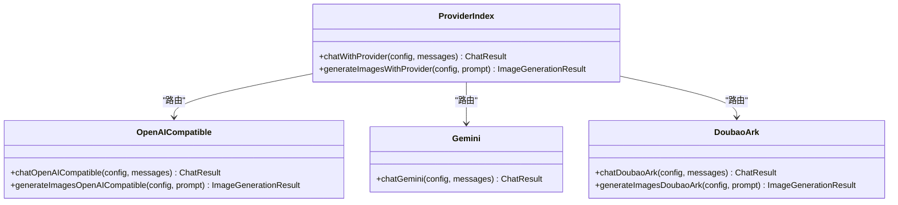

# Worker任务处理 (apps/worker)

<cite>
**本文引用的文件**
- [apps/worker/src/worker.ts](file://apps/worker/src/worker.ts)
- [apps/worker/src/config/env.ts](file://apps/worker/src/config/env.ts)
- [apps/worker/src/providers/index.ts](file://apps/worker/src/providers/index.ts)
- [apps/worker/src/providers/openaiCompatible.ts](file://apps/worker/src/providers/openaiCompatible.ts)
- [apps/worker/src/providers/gemini.ts](file://apps/worker/src/providers/gemini.ts)
- [apps/worker/src/providers/doubaoArk.ts](file://apps/worker/src/providers/doubaoArk.ts)
- [apps/worker/src/crypto/apiKeyCrypto.ts](file://apps/worker/src/crypto/apiKeyCrypto.ts)
- [apps/worker/src/tasks/common.ts](file://apps/worker/src/tasks/common.ts)
- [apps/worker/src/tasks/systemPrompts.ts](file://apps/worker/src/tasks/systemPrompts.ts)
- [apps/worker/src/tasks/generateSceneList.ts](file://apps/worker/src/tasks/generateSceneList.ts)
- [apps/worker/src/tasks/generateEpisodeSceneList.ts](file://apps/worker/src/tasks/generateEpisodeSceneList.ts)
- [apps/worker/src/tasks/planEpisodes.ts](file://apps/worker/src/tasks/planEpisodes.ts)
- [apps/worker/src/tasks/buildNarrativeCausalChain.ts](file://apps/worker/src/tasks/buildNarrativeCausalChain.ts)
- [apps/worker/src/tasks/storyboard81.ts](file://apps/worker/src/tasks/storyboard81.ts)
- [apps/worker/package.json](file://apps/worker/package.json)
</cite>

## 目录

1. [简介](#简介)
2. [项目结构](#项目结构)
3. [核心组件](#核心组件)
4. [架构总览](#架构总览)
5. [详细组件分析](#详细组件分析)
6. [依赖关系分析](#依赖关系分析)
7. [性能考虑](#性能考虑)
8. [故障排查指南](#故障排查指南)
9. [结论](#结论)
10. [附录](#附录)

## 简介

本文件面向AIXSSS Worker任务处理系统，围绕基于BullMQ的任务队列架构与异步处理机制进行深入技术说明。文档涵盖任务分类、任务实现与错误处理策略，阐述AI服务抽象、多供应商集成与配置管理，详解场景生成、分镜细化、内容优化等任务逻辑，解释任务调度、重试与失败处理，给出提供商集成实现细节、密钥管理与成本控制建议，并提供性能优化与监控指标、任务配置示例与调试技巧。

## 项目结构

Worker应用采用模块化设计，核心入口负责初始化Redis连接、创建BullMQ Worker并注册任务处理器；任务按功能拆分为多个文件，每个任务封装独立的业务逻辑；提供商适配层统一抽象不同AI供应商的接口差异；加密模块负责安全存储与解密API Key；公共工具模块提供参数抽取、模型映射与令牌统计等通用能力。

图表来源

- [apps/worker/src/worker.ts](file://apps/worker/src/worker.ts#L44-L755)
- [apps/worker/src/config/env.ts](file://apps/worker/src/config/env.ts#L1-L15)
- [apps/worker/src/providers/index.ts](file://apps/worker/src/providers/index.ts#L1-L44)
- [apps/worker/src/providers/openaiCompatible.ts](file://apps/worker/src/providers/openaiCompatible.ts#L275-L389)
- [apps/worker/src/providers/gemini.ts](file://apps/worker/src/providers/gemini.ts#L81-L122)
- [apps/worker/src/providers/doubaoArk.ts](file://apps/worker/src/providers/doubaoArk.ts#L210-L251)
- [apps/worker/src/crypto/apiKeyCrypto.ts](file://apps/worker/src/crypto/apiKeyCrypto.ts#L8-L20)
- [apps/worker/src/tasks/systemPrompts.ts](file://apps/worker/src/tasks/systemPrompts.ts#L4-L26)
- [apps/worker/src/tasks/common.ts](file://apps/worker/src/tasks/common.ts#L1-L154)

章节来源

- [apps/worker/src/worker.ts](file://apps/worker/src/worker.ts#L44-L755)
- [apps/worker/src/config/env.ts](file://apps/worker/src/config/env.ts#L1-L15)
- [apps/worker/package.json](file://apps/worker/package.json#L1-L35)

## 核心组件

- BullMQ Worker与队列
  - 使用Redis作为队列后端，通过Worker实例监听指定队列名称的任务。
  - 支持并发度配置、锁时长与失联检测，保障任务执行稳定性。
- 任务处理器
  - 统一入口根据job.name分发至对应任务函数，执行完成后更新数据库状态与结果。
  - 支持协作式取消：当任务状态变为取消时，抛出错误终止后续步骤，避免覆盖产物。
- 错误处理与重试
  - 基于BullMQ自动重试策略；若处于重试中，保持状态为排队并提示“将自动重试”，避免前端误判失败。
  - 达到最大重试次数后，写入失败状态与错误信息。
- AI服务抽象与多供应商集成
  - 提供统一的聊天与图像生成接口，内部根据配置路由到不同供应商实现。
  - 支持OpenAI兼容、Gemini、Doubao/ARK等，统一响应格式与令牌统计。
- 配置管理
  - 使用Zod校验环境变量，包括数据库URL、API Key加密密钥、Redis地址、队列名与并发度。
- 密钥管理
  - 使用AES-256-GCM对称加密存储API Key，运行时解密后注入到提供商配置。
- 通用工具
  - 参数合并与令牌统计、风格提示词拼装、模型参数抽取与供应商配置转换。

章节来源

- [apps/worker/src/worker.ts](file://apps/worker/src/worker.ts#L44-L755)
- [apps/worker/src/config/env.ts](file://apps/worker/src/config/env.ts#L1-L15)
- [apps/worker/src/providers/index.ts](file://apps/worker/src/providers/index.ts#L1-L44)
- [apps/worker/src/crypto/apiKeyCrypto.ts](file://apps/worker/src/crypto/apiKeyCrypto.ts#L8-L20)
- [apps/worker/src/tasks/common.ts](file://apps/worker/src/tasks/common.ts#L1-L154)

## 架构总览

Worker进程启动后，读取环境变量，建立Prisma与Redis连接，创建BullMQ Worker并注册任务处理器。任务执行前统一更新作业状态为运行中并记录开始时间；任务完成后根据是否取消决定写入成功或失败；错误发生时依据BullMQ重试策略决定是否继续重试或标记失败。

图表来源

- [apps/worker/src/worker.ts](file://apps/worker/src/worker.ts#L50-L117)
- [apps/worker/src/worker.ts](file://apps/worker/src/worker.ts#L674-L719)

## 详细组件分析

### 任务分类与调度机制

- 任务类型
  - LLM对话与结构化输出：llm_chat、llm_structured_test
  - 场景与分镜：generate_scene_list、generate_episode_scene_list、refine_scene_all、refine_scene_all_batch
  - 剧集规划：plan_episodes
  - 叙事因果链：build_narrative_causal_chain（多阶段）
  - 分镜板：generate_storyboard_scene_bible、generate_storyboard_plan、generate_storyboard_group、translate_storyboard_panels、back_translate_storyboard_panels
  - 关键帧与视频：generate_keyframe_prompt、generate_keyframe_images、generate_motion_prompt、generate_scene_video、generate_dialogue
- 调度与并发
  - Worker并发度由环境变量控制，默认4；锁时长与失联检测参数避免开发环境误判。
  - 任务执行期间支持进度上报，前端可轮询展示进度与消息。

章节来源

- [apps/worker/src/worker.ts](file://apps/worker/src/worker.ts#L92-L673)
- [apps/worker/src/worker.ts](file://apps/worker/src/worker.ts#L721-L729)

### 错误处理与重试策略

- 协作式取消
  - 执行过程中定期查询作业状态，若发现已取消则抛错终止，避免继续写入产物。
- 自动重试
  - 依据BullMQ attempts/backoff策略；处于重试中时保持状态为排队，进度提示“将自动重试”，避免前端误判。
- 达到最大重试次数
  - 写入失败状态与错误信息，前端可据此展示最终失败原因。
- 超时与异常
  - 供应商请求增加超时控制，超时抛出明确错误提示，便于定位网络/供应商问题。

图表来源

- [apps/worker/src/worker.ts](file://apps/worker/src/worker.ts#L674-L719)

章节来源

- [apps/worker/src/worker.ts](file://apps/worker/src/worker.ts#L74-L89)
- [apps/worker/src/worker.ts](file://apps/worker/src/worker.ts#L674-L719)

### AI服务抽象与多供应商集成

- 抽象接口
  - 统一聊天接口：chatWithProvider
  - 统一图像生成接口：generateImagesWithProvider
- 供应商实现
  - OpenAI兼容：支持responses与chat/completions双路径，自动降级与格式兼容处理。
  - Gemini：标准Google Generative Language API。
  - Doubao/ARK：火山方舟API，支持文本格式化与JSON结构化输出。
- 配置转换
  - 将AI Profile转换为各供应商的配置对象，注入API Key与模型参数。
- 令牌统计
  - 统一映射不同供应商的usage字段为prompt/complete/total三类统计。

图表来源

- [apps/worker/src/providers/index.ts](file://apps/worker/src/providers/index.ts#L12-L43)
- [apps/worker/src/providers/openaiCompatible.ts](file://apps/worker/src/providers/openaiCompatible.ts#L275-L389)
- [apps/worker/src/providers/gemini.ts](file://apps/worker/src/providers/gemini.ts#L81-L122)
- [apps/worker/src/providers/doubaoArk.ts](file://apps/worker/src/providers/doubaoArk.ts#L210-L251)

章节来源

- [apps/worker/src/providers/index.ts](file://apps/worker/src/providers/index.ts#L1-L44)
- [apps/worker/src/providers/openaiCompatible.ts](file://apps/worker/src/providers/openaiCompatible.ts#L1-L438)
- [apps/worker/src/providers/gemini.ts](file://apps/worker/src/providers/gemini.ts#L1-L125)
- [apps/worker/src/providers/doubaoArk.ts](file://apps/worker/src/providers/doubaoArk.ts#L1-L301)
- [apps/worker/src/tasks/common.ts](file://apps/worker/src/tasks/common.ts#L81-L154)

### 配置管理与密钥管理

- 环境变量
  - 数据库URL、API Key加密密钥、Redis地址、队列名、并发度均通过Zod校验，保证运行期配置正确性。
- API Key加密与解密
  - 使用AES-256-GCM对称加密，运行时解密后注入到提供商配置。
- 系统提示词
  - 支持团队级定制提示词，若未定制则回退到默认定义。

章节来源

- [apps/worker/src/config/env.ts](file://apps/worker/src/config/env.ts#L1-L15)
- [apps/worker/src/crypto/apiKeyCrypto.ts](file://apps/worker/src/crypto/apiKeyCrypto.ts#L8-L20)
- [apps/worker/src/tasks/systemPrompts.ts](file://apps/worker/src/tasks/systemPrompts.ts#L4-L26)

### 任务实现详解

#### 场景生成：generate_scene_list

- 输入：项目信息、AI Profile、样式提示词
- 流程：准备系统提示词与用户提示词 → 调用AI生成分镜列表 → 解析与入库 → 更新工作流状态
- 关键点：限制分镜数量下限，事务写入，进度上报

章节来源

- [apps/worker/src/tasks/generateSceneList.ts](file://apps/worker/src/tasks/generateSceneList.ts#L19-L127)

#### 剧集分镜生成：generate_episode_scene_list

- 输入：项目上下文、世界观、角色库、叙事因果链、上一集分镜
- 流程：构建用户提示词 → 结构化输出约束 → 生成与解析 → 去重优化 → 写入数据库
- 关键点：Jaccard相似度去重，保留原规划作为回退

章节来源

- [apps/worker/src/tasks/generateEpisodeSceneList.ts](file://apps/worker/src/tasks/generateEpisodeSceneList.ts#L184-L326)

#### 剧集规划：plan_episodes

- 输入：故事梗概、画风、世界观、角色库、叙事因果链
- 流程：结构化输出JSON Schema约束 → 生成与解析 → JSON修复循环 → 去重优化 → 写入数据库
- 关键点：针对不同模型调整推理努力度与最大输出，避免被截断；DeepSeek输出策略特殊处理

章节来源

- [apps/worker/src/tasks/planEpisodes.ts](file://apps/worker/src/tasks/planEpisodes.ts#L387-L611)

#### 叙事因果链：buildNarrativeCausalChain（多阶段）

- 阶段划分：冲突引擎、信息层级与角色矩阵、节拍结构（3A/3B）、叙事线与自洽校验
- 流程：逐阶段生成与解析 → JSON修复与语义校验 → 合并到项目上下文 → 版本化持久化
- 关键点：各阶段JSON Schema约束；缺失字段修复；阶段间衔接校验

章节来源

- [apps/worker/src/tasks/buildNarrativeCausalChain.ts](file://apps/worker/src/tasks/buildNarrativeCausalChain.ts#L782-L800)

#### 分镜板：storyboard81（Scene Bible/Plan/Group/翻译）

- 功能：Scene Bible生成、分镜计划、分镜组生成、面板翻译与回译
- 流程：结构化输出约束 → 生成与验证 → 语义校验（重复、连贯性、镜头规范） → 修复与重试
- 关键点：相机模式A/B校验、连贯性承接检查、模板渲染提示词构造

章节来源

- [apps/worker/src/tasks/storyboard81.ts](file://apps/worker/src/tasks/storyboard81.ts#L1-L800)

## 依赖关系分析

- 运行时依赖
  - BullMQ、ioredis、@prisma/client、zod、dotenv等
- 任务与提供商
  - 任务模块依赖providers/index.ts进行供应商路由；common.ts提供模型参数与配置转换；systemPrompts.ts提供提示词加载；crypto/apiKeyCrypto.ts提供密钥解密。
- 任务与数据库
  - 通过Prisma访问项目、剧集、场景、系统提示词等实体，事务写入保证一致性。

图表来源

- [apps/worker/package.json](file://apps/worker/package.json#L14-L22)
- [apps/worker/src/worker.ts](file://apps/worker/src/worker.ts#L1-L28)

章节来源

- [apps/worker/package.json](file://apps/worker/package.json#L1-L35)
- [apps/worker/src/worker.ts](file://apps/worker/src/worker.ts#L1-L28)

## 性能考虑

- 并发与资源
  - 合理设置WORKER_CONCURRENCY，避免过度并发导致Redis与供应商限流。
  - 长耗时任务应尽量拆分阶段并上报进度，便于前端感知与重试恢复。
- 请求超时
  - 通过AI_REQUEST_TIMEOUT_MS统一控制供应商请求超时，避免长时间阻塞。
- 输出长度与截断
  - 对长输出任务（如剧集规划）适当提高最大输出，避免JSON未闭合；对结构化输出启用响应格式以提升一致性。
- 令牌统计与成本控制
  - 使用mergeTokenUsage汇总任务总消耗；结合供应商价格模型估算成本；对高频任务设置合理maxTokens上限。
- 失联与锁时长
  - lockDuration与stalledInterval参数避免开发环境误判；生产环境可根据任务平均时长调整。

章节来源

- [apps/worker/src/worker.ts](file://apps/worker/src/worker.ts#L721-L729)
- [apps/worker/src/providers/openaiCompatible.ts](file://apps/worker/src/providers/openaiCompatible.ts#L52-L76)
- [apps/worker/src/tasks/common.ts](file://apps/worker/src/tasks/common.ts#L10-L17)

## 故障排查指南

- 任务状态异常
  - 检查作业状态是否被前端置为取消；若是，Worker会协作式终止并避免写入。
  - 查看数据库AIJob记录的status、error与finishedAt字段，定位失败原因。
- 供应商错误
  - OpenAI兼容：关注response_format不支持、端点不支持、max_tokens相关提示，必要时回退到普通输出或切换端点。
  - Gemini：确认API Key与模型可用性。
  - Doubao/ARK：确认使用“方舟控制台”生成的API Key，不要包含Bearer前缀；模型/接入点ID需正确。
- 超时与网络
  - 提升AI_REQUEST_TIMEOUT_MS；检查网络/代理/供应商可用性。
- JSON解析失败
  - 使用结构化输出Schema；启用JSON修复循环；查看修复提示中的具体字段缺失。

章节来源

- [apps/worker/src/worker.ts](file://apps/worker/src/worker.ts#L674-L719)
- [apps/worker/src/providers/openaiCompatible.ts](file://apps/worker/src/providers/openaiCompatible.ts#L245-L251)
- [apps/worker/src/providers/openaiCompatible.ts](file://apps/worker/src/providers/openaiCompatible.ts#L275-L389)
- [apps/worker/src/providers/gemini.ts](file://apps/worker/src/providers/gemini.ts#L65-L79)
- [apps/worker/src/providers/doubaoArk.ts](file://apps/worker/src/providers/doubaoArk.ts#L104-L129)

## 结论

Worker任务处理系统通过BullMQ实现稳定可靠的异步任务编排，配合多供应商AI抽象与严格的错误处理策略，能够高效完成从场景生成到分镜板制作的全流程任务。通过合理的并发、超时与结构化输出策略，系统在保证质量的同时兼顾性能与成本控制。建议在生产环境中持续监控任务成功率、重试率与令牌消耗，并根据业务负载动态调整并发与超时参数。

## 附录

### 任务配置示例与调试技巧

- 环境变量
  - DATABASE_URL、API_KEY_ENCRYPTION_KEY（≥32位）、REDIS_URL、AI_QUEUE_NAME、WORKER_CONCURRENCY
- 调试技巧
  - 在任务中打印进度与关键中间结果，便于定位解析/校验失败点。
  - 对结构化输出任务开启响应格式，结合修复循环逐步缩小问题范围。
  - 使用较小并发度与较短超时快速验证流程，再逐步扩大规模。

章节来源

- [apps/worker/src/config/env.ts](file://apps/worker/src/config/env.ts#L3-L10)
- [apps/worker/src/worker.ts](file://apps/worker/src/worker.ts#L731-L739)
