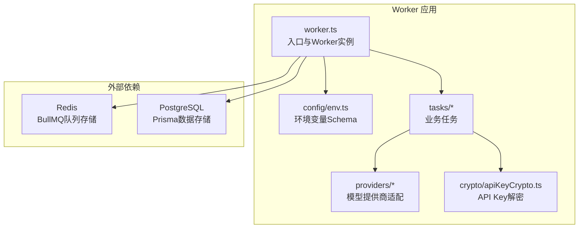
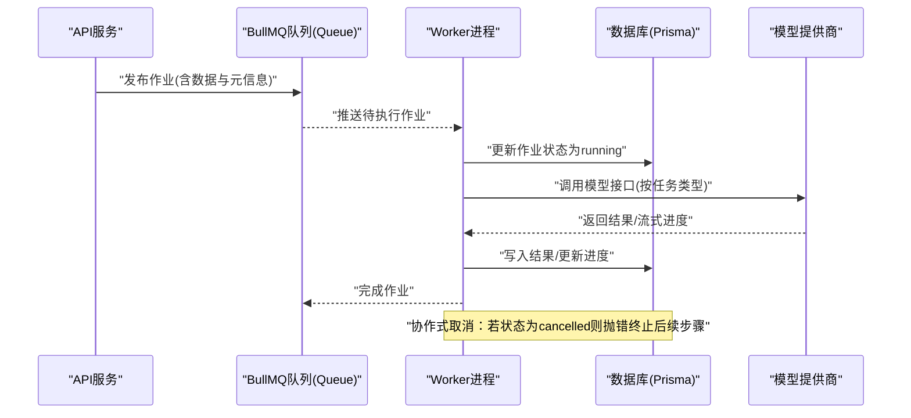
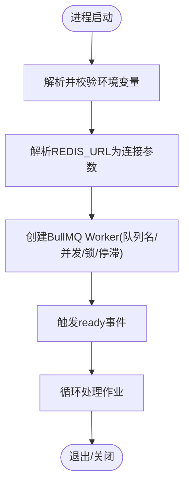
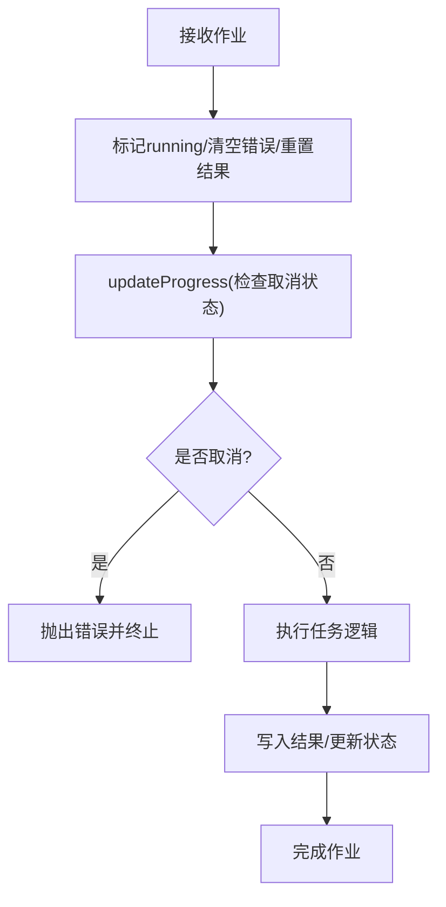
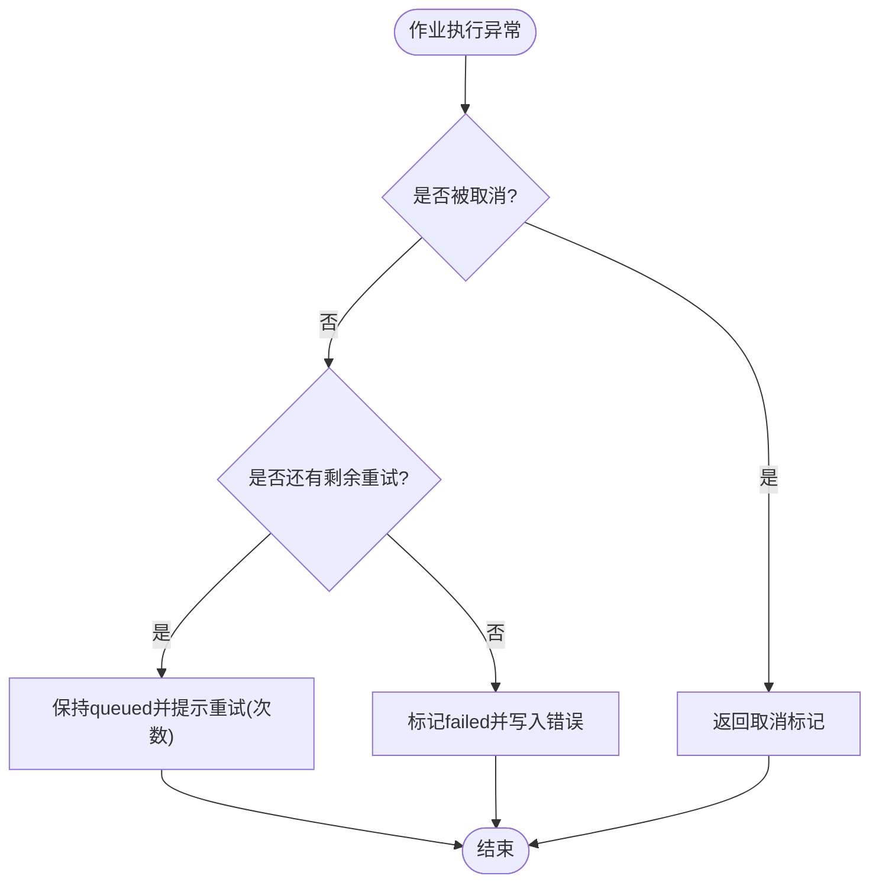
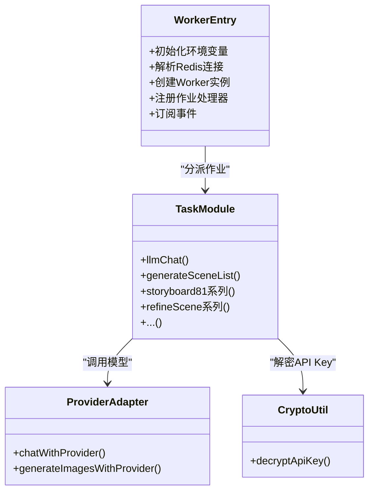
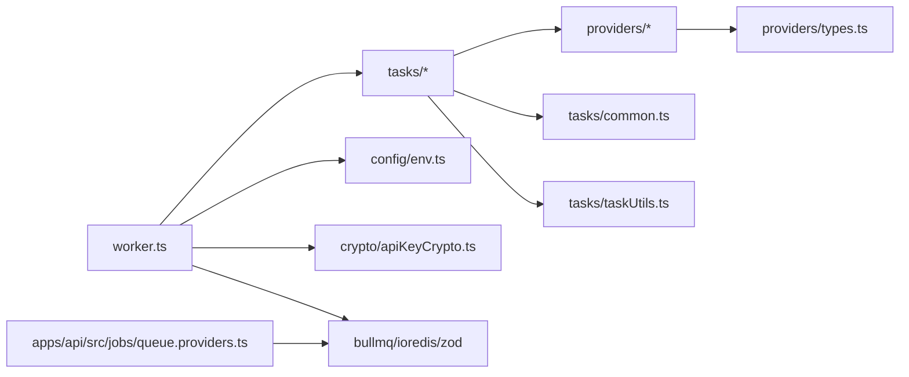

# Worker架构设计

<cite>
**本文引用的文件**
- [apps/worker/src/worker.ts](file://apps/worker/src/worker.ts)
- [apps/worker/src/config/env.ts](file://apps/worker/src/config/env.ts)
- [apps/worker/src/tasks/common.ts](file://apps/worker/src/tasks/common.ts)
- [apps/worker/src/tasks/taskUtils.ts](file://apps/worker/src/tasks/taskUtils.ts)
- [apps/worker/src/tasks/generateSceneList.ts](file://apps/worker/src/tasks/generateSceneList.ts)
- [apps/worker/src/tasks/llmChat.ts](file://apps/worker/src/tasks/llmChat.ts)
- [apps/worker/src/tasks/storyboard81.ts](file://apps/worker/src/tasks/storyboard81.ts)
- [apps/worker/src/providers/index.ts](file://apps/worker/src/providers/index.ts)
- [apps/worker/src/providers/types.ts](file://apps/worker/src/providers/types.ts)
- [apps/worker/src/crypto/apiKeyCrypto.ts](file://apps/worker/src/crypto/apiKeyCrypto.ts)
- [apps/worker/package.json](file://apps/worker/package.json)
- [apps/worker/env.example](file://apps/worker/env.example)
- [apps/worker/ENVIRONMENT.md](file://apps/worker/ENVIRONMENT.md)
- [apps/api/src/jobs/queue.providers.ts](file://apps/api/src/jobs/queue.providers.ts)
</cite>

## 目录

1. [简介](#简介)
2. [项目结构](#项目结构)
3. [核心组件](#核心组件)
4. [架构总览](#架构总览)
5. [组件详解](#组件详解)
6. [依赖关系分析](#依赖关系分析)
7. [性能考量](#性能考量)
8. [故障排查指南](#故障排查指南)
9. [结论](#结论)
10. [附录](#附录)

## 简介

本技术文档面向AIXSSS Worker架构设计，系统性阐述基于BullMQ的分布式任务队列实现原理与工程实践。重点包括：

- Worker进程初始化流程、Redis连接配置与队列管理机制
- 任务调度策略、并发控制与锁机制
- 错误处理与重试机制设计
- 环境变量配置、性能调优参数与监控指标
- 架构图与配置示例，以及如何扩展与定制Worker行为

## 项目结构

Worker位于apps/worker，采用模块化组织：

- 入口与运行时：worker.ts负责加载环境变量、建立Redis连接、实例化BullMQ Worker、注册作业处理器与事件监听
- 配置校验：env.ts定义Zod Schema，统一校验环境变量
- 任务层：tasks目录按业务域划分具体作业（如场景生成、分镜计划、故事板等）
- 提供商适配：providers目录封装不同大模型提供商的统一调用接口
- 加解密：crypto目录提供API Key解密能力
- 包与脚本：package.json定义依赖、构建与启动脚本

**图表来源**

- [apps/worker/src/worker.ts](file://apps/worker/src/worker.ts#L44-L755)
- [apps/worker/src/config/env.ts](file://apps/worker/src/config/env.ts#L1-L15)
- [apps/worker/src/providers/index.ts](file://apps/worker/src/providers/index.ts#L1-L44)
- [apps/worker/src/crypto/apiKeyCrypto.ts](file://apps/worker/src/crypto/apiKeyCrypto.ts#L1-L23)

**章节来源**

- [apps/worker/src/worker.ts](file://apps/worker/src/worker.ts#L1-L755)
- [apps/worker/src/config/env.ts](file://apps/worker/src/config/env.ts#L1-L15)
- [apps/worker/package.json](file://apps/worker/package.json#L1-L35)

## 核心组件

- 环境变量与Schema校验：统一读取并校验NODE_ENV、DATABASE_URL、API_KEY_ENCRYPTION_KEY、REDIS_URL、AI_QUEUE_NAME、WORKER_CONCURRENCY等关键参数
- Worker实例：基于BullMQ Worker，绑定队列名、并发度、锁与停滞检测参数
- 作业处理器：根据job.name分派至对应任务函数，执行完成后更新数据库状态
- 提供商适配：统一chatWithProvider/generateImagesWithProvider接口，屏蔽不同提供商差异
- 加解密：使用AES-256-GCM解密存储的API Key
- 任务工具：进度缩放、格式修复、对话解析、令牌用量合并等通用能力

**章节来源**

- [apps/worker/src/worker.ts](file://apps/worker/src/worker.ts#L44-L755)
- [apps/worker/src/config/env.ts](file://apps/worker/src/config/env.ts#L1-L15)
- [apps/worker/src/providers/index.ts](file://apps/worker/src/providers/index.ts#L1-L44)
- [apps/worker/src/crypto/apiKeyCrypto.ts](file://apps/worker/src/crypto/apiKeyCrypto.ts#L1-L23)

## 架构总览

Worker采用“队列驱动、事件感知、协作式取消、自动重试”的设计，确保高可用与可观测性。

**图表来源**

- [apps/worker/src/worker.ts](file://apps/worker/src/worker.ts#L50-L729)
- [apps/api/src/jobs/queue.providers.ts](file://apps/api/src/jobs/queue.providers.ts#L17-L36)

## 组件详解

### Worker初始化与Redis连接

- 环境变量解析：使用Zod Schema进行强类型校验，确保关键参数存在且合法
- Redis连接：支持redis/rediss协议，解析host/port/password，作为BullMQ连接参数
- Worker实例：绑定队列名、并发度、锁时长、停滞检测间隔与最大停滞次数，避免开发环境误判

**图表来源**

- [apps/worker/src/worker.ts](file://apps/worker/src/worker.ts#L44-L755)
- [apps/worker/src/config/env.ts](file://apps/worker/src/config/env.ts#L1-L15)

**章节来源**

- [apps/worker/src/worker.ts](file://apps/worker/src/worker.ts#L44-L755)
- [apps/worker/src/config/env.ts](file://apps/worker/src/config/env.ts#L1-L15)

### 作业调度与并发控制

- 并发度：由WORKER_CONCURRENCY控制，决定同时处理的作业数
- 锁机制：lockDuration设置锁有效期，避免长时间占用；stalledInterval与maxStalledCount配合检测与清理停滞作业
- 进度上报：updateProgress协作式检查取消状态，防止无效写入；支持百分比与消息提示

**图表来源**

- [apps/worker/src/worker.ts](file://apps/worker/src/worker.ts#L74-L89)
- [apps/worker/src/worker.ts](file://apps/worker/src/worker.ts#L62-L72)

**章节来源**

- [apps/worker/src/worker.ts](file://apps/worker/src/worker.ts#L721-L729)
- [apps/worker/src/worker.ts](file://apps/worker/src/worker.ts#L74-L89)

### 错误处理与重试机制

- 自动重试：BullMQ根据作业opts.attempts与退避策略自动重试
- 前端一致性：为避免“前端已报错、后端仍在跑”的错觉，当处于重试阶段时保持状态为queued并通过进度提示当前尝试次数
- 失败收敛：达到最大重试次数后，将状态置为failed并记录错误信息

**图表来源**

- [apps/worker/src/worker.ts](file://apps/worker/src/worker.ts#L674-L719)

**章节来源**

- [apps/worker/src/worker.ts](file://apps/worker/src/worker.ts#L674-L719)

### 任务类型与实现要点

- 通用任务接口：每个任务接收PrismaClient、上下文标识(teamId/projectId/episodeId/sceneId/aiProfileId)、API Key密钥、进度回调
- 提供商适配：统一ProviderChatConfig/ProviderImageConfig，屏蔽不同提供商差异
- 数据库交互：事务写入、状态流转、令牌用量统计等
- 进度管理：任务内部可多次updateProgress，最终由协作式updateProgress统一上报

**图表来源**

- [apps/worker/src/worker.ts](file://apps/worker/src/worker.ts#L94-L670)
- [apps/worker/src/providers/index.ts](file://apps/worker/src/providers/index.ts#L1-L44)
- [apps/worker/src/crypto/apiKeyCrypto.ts](file://apps/worker/src/crypto/apiKeyCrypto.ts#L1-L23)

**章节来源**

- [apps/worker/src/worker.ts](file://apps/worker/src/worker.ts#L94-L670)
- [apps/worker/src/tasks/llmChat.ts](file://apps/worker/src/tasks/llmChat.ts#L1-L64)
- [apps/worker/src/tasks/generateSceneList.ts](file://apps/worker/src/tasks/generateSceneList.ts#L1-L129)
- [apps/worker/src/tasks/storyboard81.ts](file://apps/worker/src/tasks/storyboard81.ts#L1-L200)
- [apps/worker/src/providers/index.ts](file://apps/worker/src/providers/index.ts#L1-L44)

### 任务工具与通用能力

- 令牌用量合并：mergeTokenUsage聚合多步调用的prompt/completion/total
- 提示词风格：styleFullPrompt从项目配置中提取完整风格提示
- 生成参数抽取：extractGenerationParams与extractModelOverrides标准化模型参数
- 进度缩放：createScaledProgress将子任务进度映射到整体范围
- 对话解析：parseDialoguesFromText解析多类型对话文本为结构化数据
- 格式修复：requestFormatFix针对特定输出类型构造修复提示并重试

**章节来源**

- [apps/worker/src/tasks/common.ts](file://apps/worker/src/tasks/common.ts#L1-L154)
- [apps/worker/src/tasks/taskUtils.ts](file://apps/worker/src/tasks/taskUtils.ts#L1-L294)

### 提供商类型与配置

- ProviderChatConfig/ProviderImageConfig统一描述提供商类型、基础URL、模型、参数与响应格式
- 支持openai_compatible、doubao_ark、gemini三种类型
- toProviderChatConfig/toProviderImageConfig将数据库配置转换为调用所需结构

**章节来源**

- [apps/worker/src/providers/types.ts](file://apps/worker/src/providers/types.ts#L1-L84)
- [apps/worker/src/tasks/common.ts](file://apps/worker/src/tasks/common.ts#L81-L153)

### API Key加解密

- 使用AES-256-GCM，密钥派生自API_KEY_ENCRYPTION_KEY
- 存储格式为“iv.b64.tag.b64.data.b64”
- 在任务执行前解密，注入到ProviderConfig.apiKey

**章节来源**

- [apps/worker/src/crypto/apiKeyCrypto.ts](file://apps/worker/src/crypto/apiKeyCrypto.ts#L1-L23)

## 依赖关系分析

- 内部依赖：worker.ts依赖tasks/_与providers/_；tasks依赖common.ts与taskUtils.ts；providers依赖types.ts
- 外部依赖：bullmq、ioredis、zod、dotenv、@prisma/client
- 队列对接：API侧通过Queue/QueueEvents连接同一Redis，共享队列名

**图表来源**

- [apps/worker/src/worker.ts](file://apps/worker/src/worker.ts#L1-L29)
- [apps/worker/src/providers/index.ts](file://apps/worker/src/providers/index.ts#L1-L44)
- [apps/worker/src/providers/types.ts](file://apps/worker/src/providers/types.ts#L1-L84)
- [apps/api/src/jobs/queue.providers.ts](file://apps/api/src/jobs/queue.providers.ts#L1-L36)

**章节来源**

- [apps/worker/package.json](file://apps/worker/package.json#L14-L22)
- [apps/api/src/jobs/queue.providers.ts](file://apps/api/src/jobs/queue.providers.ts#L17-L36)

## 性能考量

- 并发度调优：根据CPU/内存与模型提供商限流情况调整WORKER_CONCURRENCY
- 锁与停滞：lockDuration建议不低于单次任务平均耗时的2倍；stalledInterval与maxStalledCount平衡误杀与恢复
- 进度上报频率：避免过于频繁的updateProgress导致Redis压力，可在任务内聚合进度
- 重试策略：合理设置attempts与退避，避免雪崩；对幂等性差的操作谨慎开启自动重试
- 数据库事务：批量写入尽量使用事务，减少往返开销
- 缓存与预热：对常用系统提示与模板进行缓存，降低冷启动成本

## 故障排查指南

- 连接问题
  - Redis地址解析：确认REDIS_URL协议为redis/rediss，端口正确；Windows/Docker Desktop优先使用127.0.0.1
  - 环境变量缺失：核对.env文件，确保DATABASE_URL、API_KEY_ENCRYPTION_KEY、REDIS_URL、AI_QUEUE_NAME、WORKER_CONCURRENCY均存在
- 作业卡住
  - 检查stalledInterval与maxStalledCount配置；查看Worker日志failed事件
  - 协作式取消：若API端已置cancelled，Worker会在updateProgress处检测并终止
- 重试风暴
  - 前端显示“将自动重试”提示属预期；确认作业opts.attempts与后端maxAttempts一致
  - 若需禁用自动重试，将attempts设为1并在后端自行处理失败
- 令牌用量与格式
  - 使用mergeTokenUsage汇总；对非结构化输出使用requestFormatFix进行格式修复
- 日志定位
  - 关注ready事件与failed事件日志；核对作业ID与名称，结合Prisma日志定位数据库状态

**章节来源**

- [apps/worker/ENVIRONMENT.md](file://apps/worker/ENVIRONMENT.md#L1-L25)
- [apps/worker/src/worker.ts](file://apps/worker/src/worker.ts#L731-L749)
- [apps/worker/src/worker.ts](file://apps/worker/src/worker.ts#L674-L719)

## 结论

该Worker架构以BullMQ为核心，结合严格的环境变量校验、统一的提供商适配与任务工具、完善的错误与重试策略，实现了高可靠、可观测、易扩展的分布式任务执行体系。通过合理的并发与锁配置、进度与状态管理，以及清晰的职责边界，能够稳定支撑从LLM对话到故事板生成的复杂工作流。

## 附录

### 环境变量与默认值

- NODE_ENV：development/test/production，默认development
- DATABASE_URL：PostgreSQL连接串
- API_KEY_ENCRYPTION_KEY：用于解密AI Profile中的加密API Key
- REDIS_URL：Redis连接串，默认redis://localhost:6379
- AI_QUEUE_NAME：队列名，默认ai-jobs
- WORKER_CONCURRENCY：并发度，默认4

**章节来源**

- [apps/worker/src/config/env.ts](file://apps/worker/src/config/env.ts#L3-L10)
- [apps/worker/env.example](file://apps/worker/env.example#L1-L17)
- [apps/worker/ENVIRONMENT.md](file://apps/worker/ENVIRONMENT.md#L1-L25)

### 队列初始化（API侧）

- API侧通过Queue与QueueEvents连接Redis，使用相同队列名与连接参数，保证生产者与消费者一致

**章节来源**

- [apps/api/src/jobs/queue.providers.ts](file://apps/api/src/jobs/queue.providers.ts#L17-L36)
