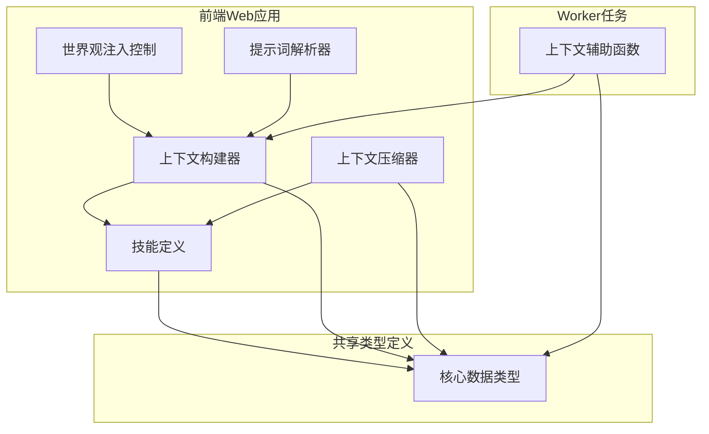
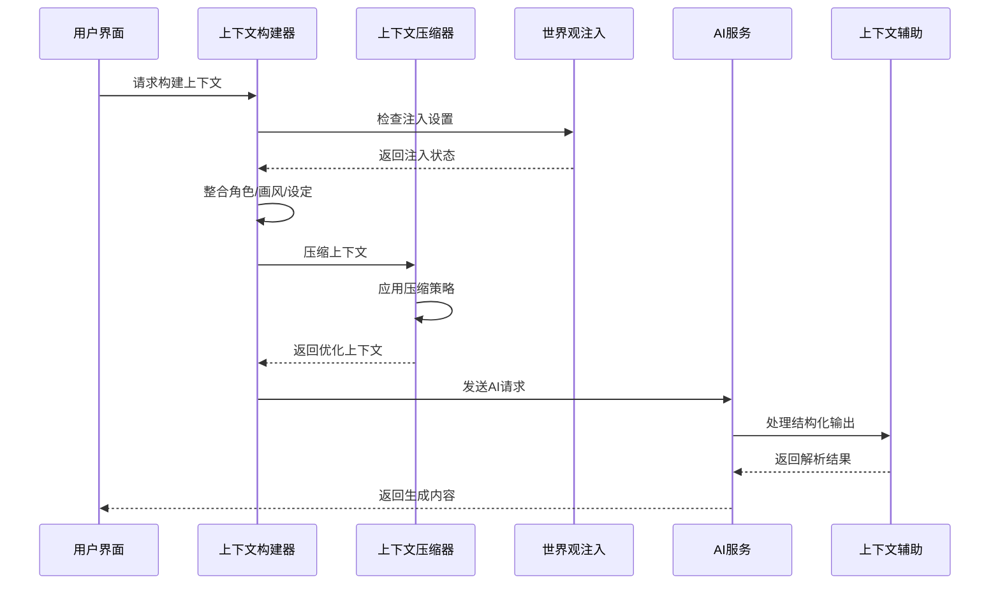
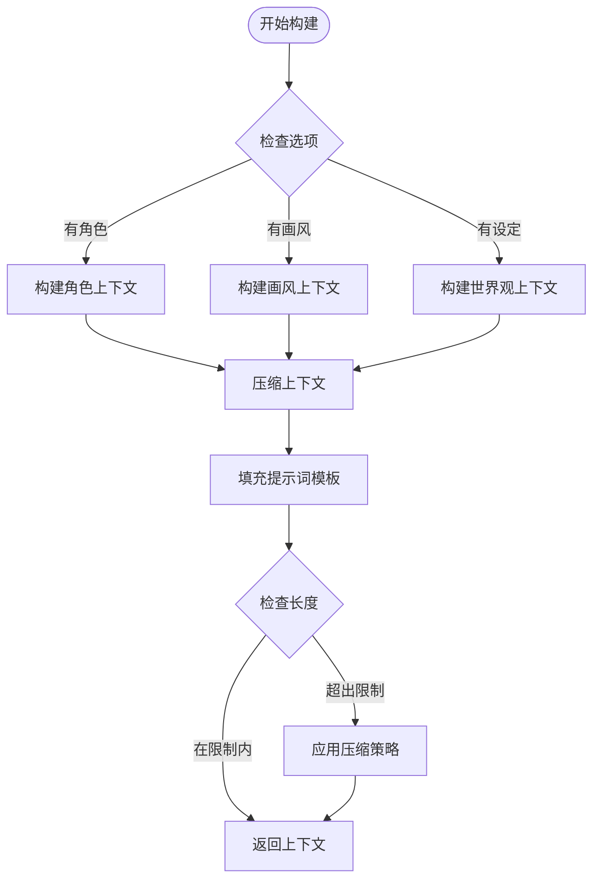
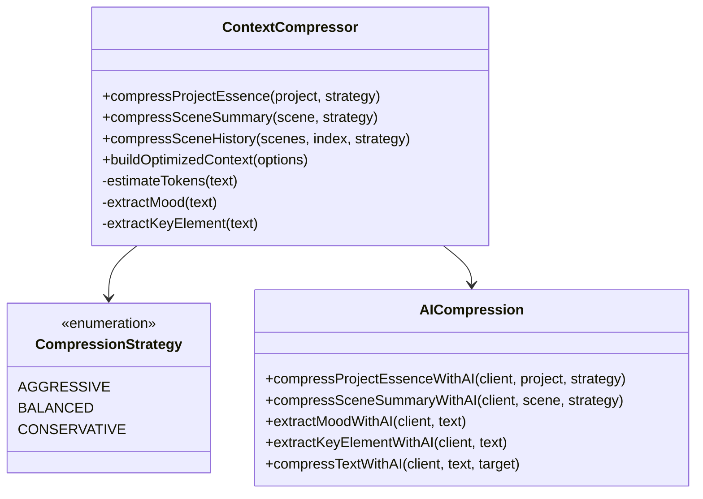
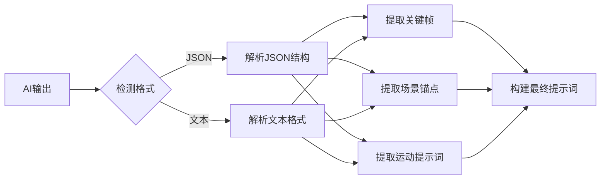
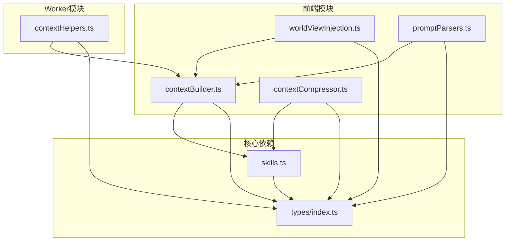

# 上下文辅助模块

<cite>
**本文档引用的文件**
- [apps/web/src/lib/ai/contextBuilder.ts](file://apps/web/src/lib/ai/contextBuilder.ts)
- [apps/web/src/lib/ai/contextCompressor.ts](file://apps/web/src/lib/ai/contextCompressor.ts)
- [apps/worker/src/tasks/contextHelpers.ts](file://apps/worker/src/tasks/contextHelpers.ts)
- [apps/web/src/lib/ai/worldViewInjection.ts](file://apps/web/src/lib/ai/worldViewInjection.ts)
- [apps/web/src/lib/ai/promptParsers.ts](file://apps/web/src/lib/ai/promptParsers.ts)
- [apps/web/src/lib/ai/skills.ts](file://apps/web/src/lib/ai/skills.ts)
- [apps/web/src/types/index.ts](file://apps/web/src/types/index.ts)
</cite>

## 目录

1. [简介](#简介)
2. [项目结构](#项目结构)
3. [核心组件](#核心组件)
4. [架构概览](#架构概览)
5. [详细组件分析](#详细组件分析)
6. [依赖分析](#依赖分析)
7. [性能考虑](#性能考虑)
8. [故障排除指南](#故障排除指南)
9. [结论](#结论)

## 简介

上下文辅助模块是AI创作工作流中的核心基础设施，负责为各种AI生成任务提供准确、完整且优化的上下文信息。该模块通过智能整合项目信息、角色设定、画风配置和世界观要素，确保AI生成的内容既符合创作需求又保持一致性。

模块主要包含四个核心功能：

- **上下文构建**：将分散的创作素材整合为结构化的提示词
- **上下文压缩**：智能减少上下文大小，避免token限制
- **上下文注入**：控制世界观信息的注入时机和范围
- **上下文解析**：处理和转换AI生成的结构化输出

## 项目结构

上下文辅助模块分布在前端Web应用和Worker任务两个层面：

**图表来源**

- [apps/web/src/lib/ai/contextBuilder.ts](file://apps/web/src/lib/ai/contextBuilder.ts#L1-L435)
- [apps/web/src/lib/ai/contextCompressor.ts](file://apps/web/src/lib/ai/contextCompressor.ts#L1-L519)
- [apps/worker/src/tasks/contextHelpers.ts](file://apps/worker/src/tasks/contextHelpers.ts#L1-L335)

**章节来源**

- [apps/web/src/lib/ai/contextBuilder.ts](file://apps/web/src/lib/ai/contextBuilder.ts#L1-L50)
- [apps/web/src/lib/ai/contextCompressor.ts](file://apps/web/src/lib/ai/contextCompressor.ts#L1-L50)
- [apps/worker/src/tasks/contextHelpers.ts](file://apps/worker/src/tasks/contextHelpers.ts#L1-L50)

## 核心组件

### 上下文构建器 (ContextBuilder)

上下文构建器是模块的核心组件，负责将各种创作素材整合为AI可理解的结构化上下文。

**主要功能**：

- 角色信息整合：外观、性格、背景、主题色等
- 画风配置处理：完整提示词合成
- 世界观要素分组：按类型组织设定信息
- 提示词模板填充：动态替换占位符

**关键特性**：

- 支持三种角色上下文模式：视觉导向、故事导向、全量模式
- 智能长度控制，避免超出token限制
- 完整的错误处理和数据验证

**章节来源**

- [apps/web/src/lib/ai/contextBuilder.ts](file://apps/web/src/lib/ai/contextBuilder.ts#L105-L197)
- [apps/web/src/lib/ai/contextBuilder.ts](file://apps/web/src/lib/ai/contextBuilder.ts#L203-L221)
- [apps/web/src/lib/ai/contextBuilder.ts](file://apps/web/src/lib/ai/contextBuilder.ts#L227-L270)

### 上下文压缩器 (ContextCompressor)

上下文压缩器专门处理大规模上下文的优化问题，确保AI请求不会超出token限制。

**压缩策略**：

- **激进策略**：最大压缩，适合简单内容
- **平衡策略**：中等压缩，适合大多数情况
- **保守策略**：最小压缩，适合复杂内容

**智能功能**：

- Token估算算法
- 历史上下文智能选择
- 情绪和关键元素提取
- AI智能压缩回退机制

**章节来源**

- [apps/web/src/lib/ai/contextCompressor.ts](file://apps/web/src/lib/ai/contextCompressor.ts#L27-L50)
- [apps/web/src/lib/ai/contextCompressor.ts](file://apps/web/src/lib/ai/contextCompressor.ts#L55-L94)
- [apps/web/src/lib/ai/contextCompressor.ts](file://apps/web/src/lib/ai/contextCompressor.ts#L134-L163)

### 上下文辅助函数 (Worker)

Worker层面的上下文辅助函数专注于叙事结构和角色信息的处理。

**核心功能**：

- 情感曲线计算：基于分镜位置计算情感位置
- 关键帧提取：从JSON结构中提取特定关键帧
- 叙事上下文构建：整合因果链和节拍信息
- 角色视觉上下文：生成角色外观描述

**章节来源**

- [apps/worker/src/tasks/contextHelpers.ts](file://apps/worker/src/tasks/contextHelpers.ts#L82-L92)
- [apps/worker/src/tasks/contextHelpers.ts](file://apps/worker/src/tasks/contextHelpers.ts#L111-L134)
- [apps/worker/src/tasks/contextHelpers.ts](file://apps/worker/src/tasks/contextHelpers.ts#L154-L199)

### 世界观注入控制

控制世界观信息在不同生成阶段的注入时机。

**注入时机**：

- 分镜列表生成时
- 场景锚点生成时
- 角色设定生成时

**配置管理**：

- 默认启用所有时机
- 支持本地存储持久化
- 灵活的注入时机组合

**章节来源**

- [apps/web/src/lib/ai/worldViewInjection.ts](file://apps/web/src/lib/ai/worldViewInjection.ts#L14-L50)
- [apps/web/src/lib/ai/worldViewInjection.ts](file://apps/web/src/lib/ai/worldViewInjection.ts#L108-L126)

## 架构概览

上下文辅助模块采用分层架构设计，确保各组件职责明确且松耦合：

**图表来源**

- [apps/web/src/lib/ai/contextBuilder.ts](file://apps/web/src/lib/ai/contextBuilder.ts#L276-L304)
- [apps/web/src/lib/ai/contextCompressor.ts](file://apps/web/src/lib/ai/contextCompressor.ts#L240-L298)
- [apps/worker/src/tasks/contextHelpers.ts](file://apps/worker/src/tasks/contextHelpers.ts#L154-L199)

## 详细组件分析

### 上下文构建流程

**图表来源**

- [apps/web/src/lib/ai/contextBuilder.ts](file://apps/web/src/lib/ai/contextBuilder.ts#L276-L387)
- [apps/web/src/lib/ai/contextCompressor.ts](file://apps/web/src/lib/ai/contextCompressor.ts#L168-L200)

### 上下文压缩算法

上下文压缩器实现了多层次的压缩策略：

**图表来源**

- [apps/web/src/lib/ai/contextCompressor.ts](file://apps/web/src/lib/ai/contextCompressor.ts#L27-L50)
- [apps/web/src/lib/ai/contextCompressor.ts](file://apps/web/src/lib/ai/contextCompressor.ts#L435-L477)

**章节来源**

- [apps/web/src/lib/ai/contextCompressor.ts](file://apps/web/src/lib/ai/contextCompressor.ts#L18-L24)
- [apps/web/src/lib/ai/contextCompressor.ts](file://apps/web/src/lib/ai/contextCompressor.ts#L240-L298)

### 提示词解析系统

提示词解析器支持多种输出格式的智能解析：

**图表来源**

- [apps/web/src/lib/ai/promptParsers.ts](file://apps/web/src/lib/ai/promptParsers.ts#L389-L470)
- [apps/web/src/lib/ai/promptParsers.ts](file://apps/web/src/lib/ai/promptParsers.ts#L472-L547)

**章节来源**

- [apps/web/src/lib/ai/promptParsers.ts](file://apps/web/src/lib/ai/promptParsers.ts#L1-L637)

## 依赖分析

上下文辅助模块的依赖关系体现了清晰的分层设计：

**图表来源**

- [apps/web/src/lib/ai/contextBuilder.ts](file://apps/web/src/lib/ai/contextBuilder.ts#L12-L18)
- [apps/web/src/lib/ai/contextCompressor.ts](file://apps/web/src/lib/ai/contextCompressor.ts#L14-L16)
- [apps/worker/src/tasks/contextHelpers.ts](file://apps/worker/src/tasks/contextHelpers.ts#L6-L7)

**章节来源**

- [apps/web/src/types/index.ts](file://apps/web/src/types/index.ts#L1-L800)
- [apps/web/src/lib/ai/skills.ts](file://apps/web/src/lib/ai/skills.ts#L1-L517)

## 性能考虑

### Token优化策略

上下文辅助模块实现了多层性能优化：

1. **智能压缩**：根据内容复杂度自动选择压缩策略
2. **增量更新**：仅更新发生变化的上下文部分
3. **缓存机制**：利用localStorage存储用户偏好设置
4. **异步处理**：AI智能压缩功能支持异步回退

### 内存管理

- 上下文构建器使用Map进行角色名称缓存
- 压缩器采用分步计算避免内存峰值
- 解析器支持流式处理大型JSON结构

## 故障排除指南

### 常见问题及解决方案

**问题1：上下文过大导致API错误**

- 检查压缩策略设置
- 简化角色和场景描述
- 调整maxTokens参数

**问题2：AI生成内容不符合预期**

- 验证提示词模板完整性
- 检查上下文注入设置
- 确认角色外观描述准确性

**问题3：结构化输出解析失败**

- 确认输出格式符合要求
- 检查JSON结构完整性
- 验证标签格式正确性

**章节来源**

- [apps/web/src/lib/ai/contextCompressor.ts](file://apps/web/src/lib/ai/contextCompressor.ts#L375-L430)
- [apps/web/src/lib/ai/promptParsers.ts](file://apps/web/src/lib/ai/promptParsers.ts#L128-L142)

## 结论

上下文辅助模块通过精心设计的架构和算法，为AI创作工作流提供了强大的上下文管理能力。模块的主要优势包括：

1. **完整性**：涵盖从项目基础信息到详细场景描述的所有上下文要素
2. **灵活性**：支持多种压缩策略和注入时机配置
3. **智能化**：AI辅助的压缩和解析功能提升生成质量
4. **可维护性**：清晰的分层架构便于扩展和维护

该模块为整个AI创作系统奠定了坚实的基础，确保生成内容的质量和一致性。
