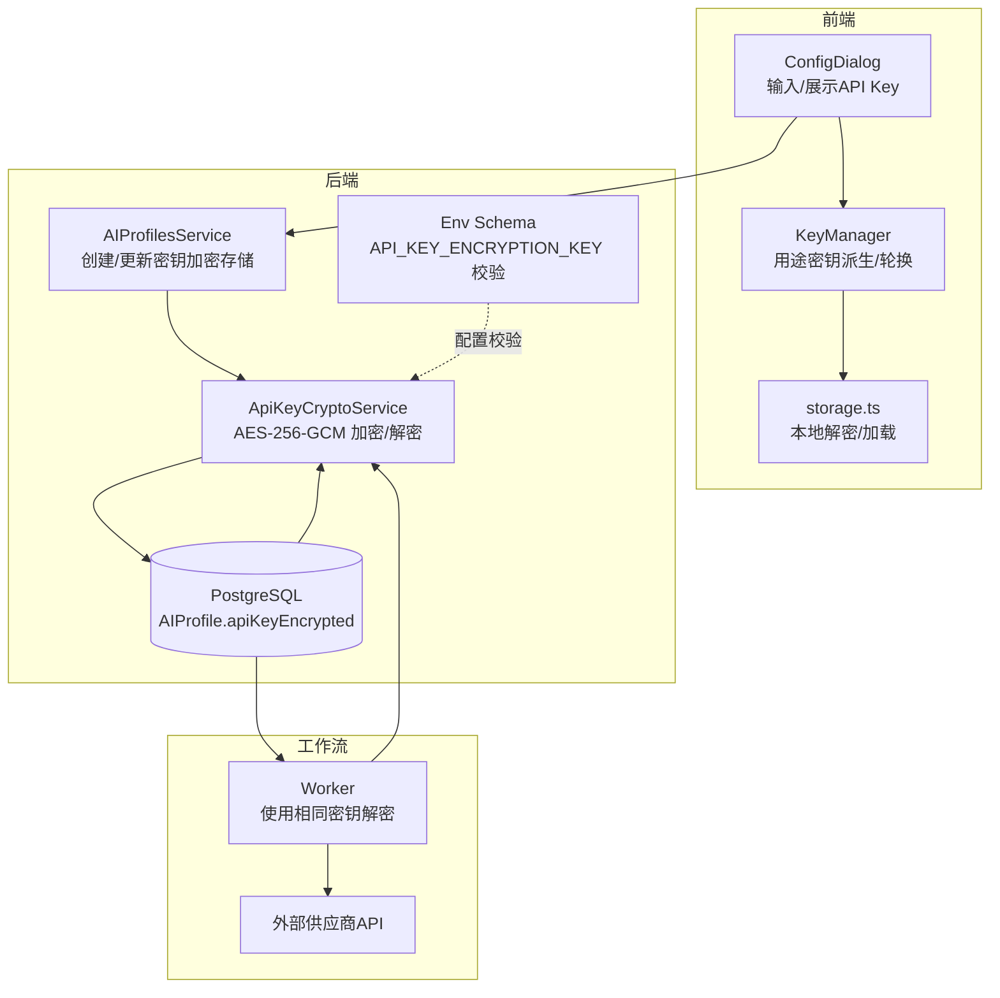
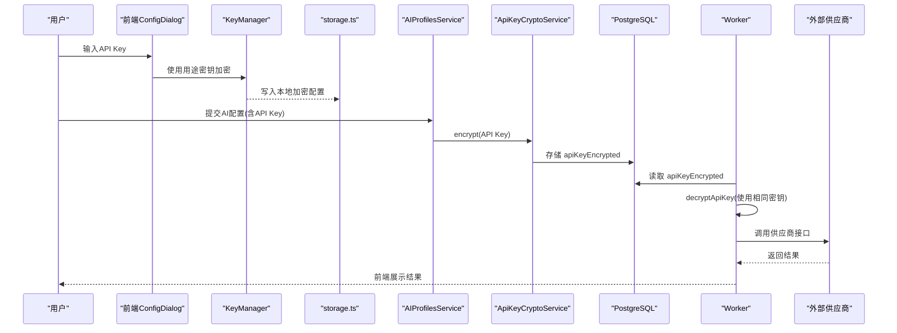
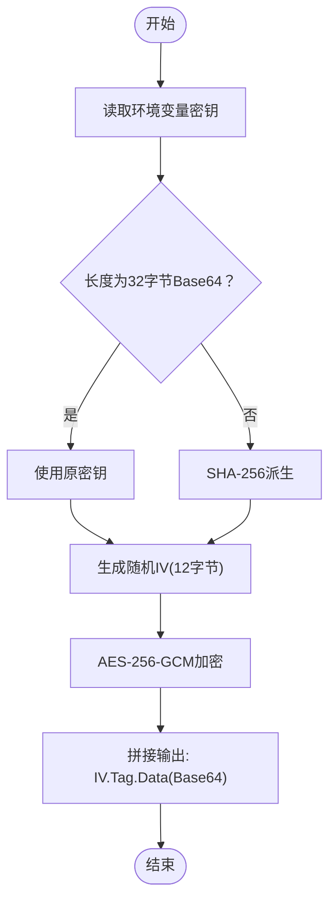
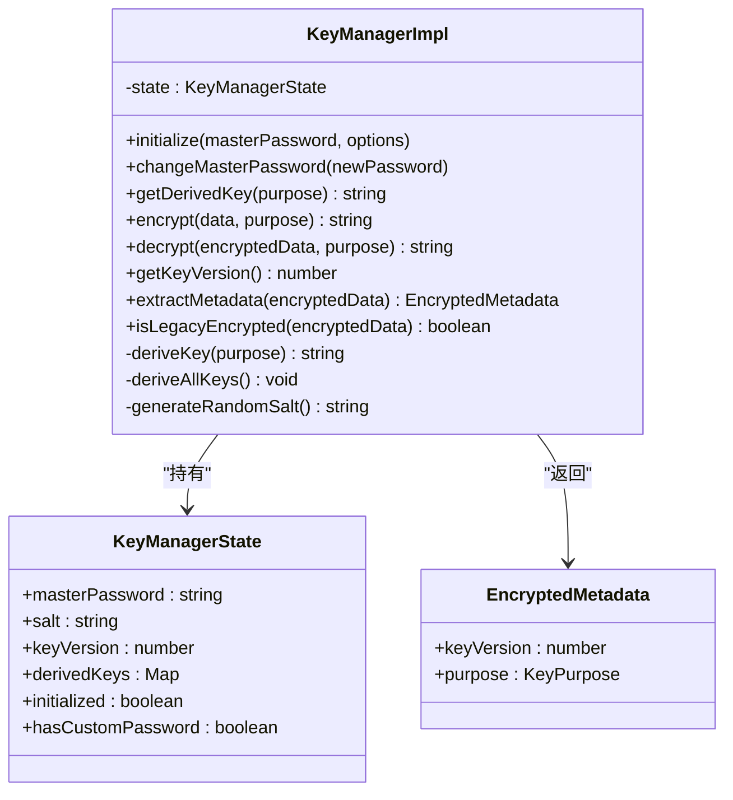
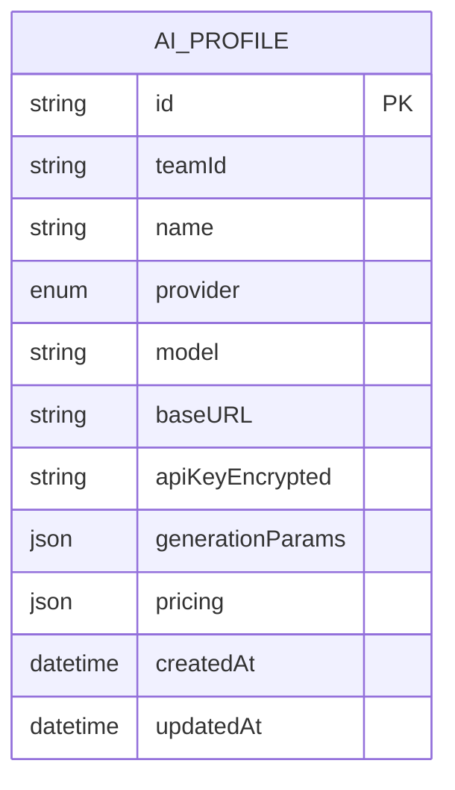
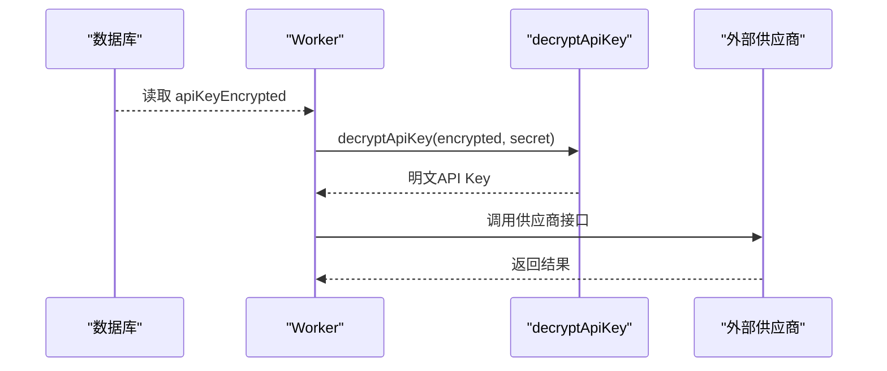
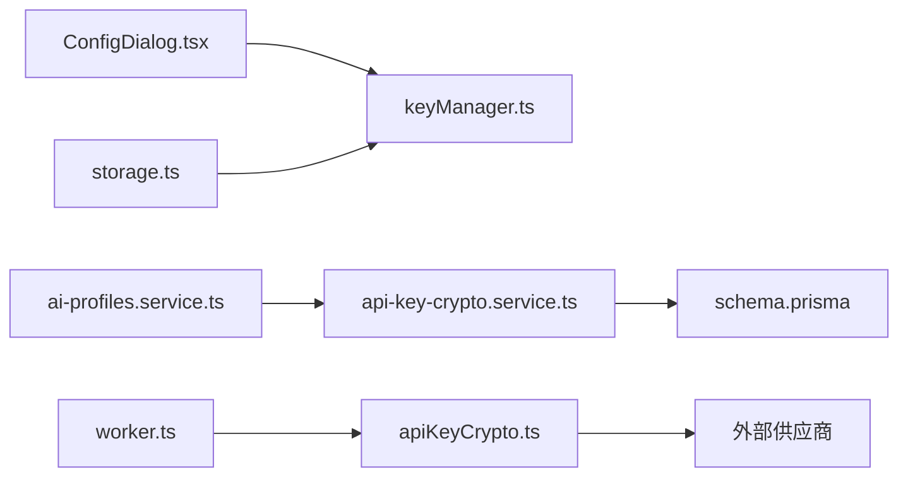

# API密钥安全管理

<cite>
**本文引用的文件**
- [apps/api/src/crypto/api-key-crypto.service.ts](file://apps/api/src/crypto/api-key-crypto.service.ts)
- [apps/worker/src/crypto/apiKeyCrypto.ts](file://apps/worker/src/crypto/apiKeyCrypto.ts)
- [apps/api/src/ai-profiles/ai-profiles.service.ts](file://apps/api/src/ai-profiles/ai-profiles.service.ts)
- [apps/api/prisma/schema.prisma](file://apps/api/prisma/schema.prisma)
- [apps/api/src/config/env.ts](file://apps/api/src/config/env.ts)
- [apps/worker/src/config/env.ts](file://apps/worker/src/config/env.ts)
- [apps/api/ENVIRONMENT.md](file://apps/api/ENVIRONMENT.md)
- [apps/worker/ENVIRONMENT.md](file://apps/worker/ENVIRONMENT.md)
- [apps/web/src/lib/keyManager.ts](file://apps/web/src/lib/keyManager.ts)
- [apps/web/src/lib/storage.ts](file://apps/web/src/lib/storage.ts)
- [apps/web/src/components/ConfigDialog.tsx](file://apps/web/src/components/ConfigDialog.tsx)
- [apps/web/src/lib/ai/providers/backend.ts](file://apps/web/src/lib/ai/providers/backend.ts)
- [docs/engineering/audit-baseline.md](file://docs/engineering/audit-baseline.md)
- [docs/prd/episode-planning-workflow.md](file://docs/prd/episode-planning-workflow.md)
</cite>

## 目录

1. [简介](#简介)
2. [项目结构](#项目结构)
3. [核心组件](#核心组件)
4. [架构总览](#架构总览)
5. [详细组件分析](#详细组件分析)
6. [依赖关系分析](#依赖关系分析)
7. [性能考量](#性能考量)
8. [故障排查指南](#故障排查指南)
9. [结论](#结论)
10. [附录](#附录)

## 简介

本文件围绕 AIXSSS 的 API 密钥安全管理展开，系统性阐述密钥的加密存储机制、安全传输策略、解密流程、密钥轮换与版本管理、内存与临时存储的安全处理、访问控制与权限管理、审计日志与合规要求，并提供最佳实践、安全检查清单与应急响应方案。重点覆盖后端服务对密钥的加密存储、工作流对密钥的解密使用、前端本地加密与密钥轮换机制，以及生产级安全基线与迁移方向。

## 项目结构

AIXSSS 将 API 密钥安全贯穿于三层：

- 前端本地加密与密钥轮换：通过主密码派生用途密钥，实现配置与项目数据的本地加密与版本化管理。
- 后端加密存储：将密钥以加密形式存储于数据库，配合严格的环境变量与配置校验。
- 工作流解密执行：在受控环境中使用相同的密钥解密后调用外部供应商接口。

图表来源

- [apps/web/src/lib/keyManager.ts](file://apps/web/src/lib/keyManager.ts#L36-L460)
- [apps/web/src/lib/storage.ts](file://apps/web/src/lib/storage.ts#L696-L713)
- [apps/web/src/components/ConfigDialog.tsx](file://apps/web/src/components/ConfigDialog.tsx#L1401-L1435)
- [apps/api/src/ai-profiles/ai-profiles.service.ts](file://apps/api/src/ai-profiles/ai-profiles.service.ts#L101-L132)
- [apps/api/src/crypto/api-key-crypto.service.ts](file://apps/api/src/crypto/api-key-crypto.service.ts#L1-L36)
- [apps/api/prisma/schema.prisma](file://apps/api/prisma/schema.prisma#L275-L292)
- [apps/api/src/config/env.ts](file://apps/api/src/config/env.ts#L1-L14)
- [apps/worker/src/config/env.ts](file://apps/worker/src/config/env.ts#L1-L12)
- [apps/worker/src/crypto/apiKeyCrypto.ts](file://apps/worker/src/crypto/apiKeyCrypto.ts#L1-L20)

章节来源

- [apps/api/src/crypto/api-key-crypto.service.ts](file://apps/api/src/crypto/api-key-crypto.service.ts#L1-L36)
- [apps/worker/src/crypto/apiKeyCrypto.ts](file://apps/worker/src/crypto/apiKeyCrypto.ts#L1-L20)
- [apps/api/src/ai-profiles/ai-profiles.service.ts](file://apps/api/src/ai-profiles/ai-profiles.service.ts#L101-L132)
- [apps/api/prisma/schema.prisma](file://apps/api/prisma/schema.prisma#L275-L292)
- [apps/api/src/config/env.ts](file://apps/api/src/config/env.ts#L1-L14)
- [apps/worker/src/config/env.ts](file://apps/worker/src/config/env.ts#L1-L12)
- [apps/api/ENVIRONMENT.md](file://apps/api/ENVIRONMENT.md#L1-L31)
- [apps/worker/ENVIRONMENT.md](file://apps/worker/ENVIRONMENT.md#L1-L25)
- [apps/web/src/lib/keyManager.ts](file://apps/web/src/lib/keyManager.ts#L36-L460)
- [apps/web/src/lib/storage.ts](file://apps/web/src/lib/storage.ts#L696-L713)
- [apps/web/src/components/ConfigDialog.tsx](file://apps/web/src/components/ConfigDialog.tsx#L1401-L1435)
- [apps/web/src/lib/ai/providers/backend.ts](file://apps/web/src/lib/ai/providers/backend.ts#L1-L25)
- [docs/engineering/audit-baseline.md](file://docs/engineering/audit-baseline.md#L1-L81)
- [docs/prd/episode-planning-workflow.md](file://docs/prd/episode-planning-workflow.md#L595-L605)

## 核心组件

- 后端密钥加密服务：基于 AES-256-GCM 的对称加密，使用固定长度密钥或 SHA-256 派生，保证密钥长度与安全性。
- 前端密钥管理器：基于 PBKDF2 的主密码派生多用途密钥，支持密钥版本与轮换，兼容遗留数据格式。
- 数据库模型：AIProfile 表包含加密后的 API Key 字段，确保密钥不出明文落库。
- 环境变量与配置校验：前后端均对密钥长度与格式进行严格校验，避免弱配置导致的安全风险。
- 工作流解密：在 Worker 中使用相同密钥解密后调用外部供应商，确保解密一致性。

章节来源

- [apps/api/src/crypto/api-key-crypto.service.ts](file://apps/api/src/crypto/api-key-crypto.service.ts#L1-L36)
- [apps/web/src/lib/keyManager.ts](file://apps/web/src/lib/keyManager.ts#L36-L460)
- [apps/api/prisma/schema.prisma](file://apps/api/prisma/schema.prisma#L275-L292)
- [apps/api/src/config/env.ts](file://apps/api/src/config/env.ts#L1-L14)
- [apps/worker/src/config/env.ts](file://apps/worker/src/config/env.ts#L1-L12)
- [apps/worker/src/crypto/apiKeyCrypto.ts](file://apps/worker/src/crypto/apiKeyCrypto.ts#L1-L20)

## 架构总览

密钥安全贯穿“前端输入/本地加密—后端加密存储—工作流解密执行”的闭环：

图表来源

- [apps/web/src/components/ConfigDialog.tsx](file://apps/web/src/components/ConfigDialog.tsx#L1401-L1435)
- [apps/web/src/lib/keyManager.ts](file://apps/web/src/lib/keyManager.ts#L181-L197)
- [apps/web/src/lib/storage.ts](file://apps/web/src/lib/storage.ts#L696-L713)
- [apps/api/src/ai-profiles/ai-profiles.service.ts](file://apps/api/src/ai-profiles/ai-profiles.service.ts#L101-L132)
- [apps/api/src/crypto/api-key-crypto.service.ts](file://apps/api/src/crypto/api-key-crypto.service.ts#L17-L35)
- [apps/api/prisma/schema.prisma](file://apps/api/prisma/schema.prisma#L275-L292)
- [apps/worker/src/crypto/apiKeyCrypto.ts](file://apps/worker/src/crypto/apiKeyCrypto.ts#L8-L20)

## 详细组件分析

### 后端密钥加密服务（Api Key 加密/解密）

- 加密算法：AES-256-GCM，随机 IV（12 字节），认证标签随密文存储，确保机密性与完整性。
- 密钥来源：从环境变量读取，推荐 32 字节 Base64 密钥；若不符合长度则回退为 SHA-256 派生，避免启动失败。
- 加密输出格式：IV.Base64 + Tag.Base64 + Data.Base64，便于解密时还原上下文。
- 解密流程：校验三段式格式，还原 IV 与 Tag，设置认证标签后解密，最后拼接明文。

图表来源

- [apps/api/src/crypto/api-key-crypto.service.ts](file://apps/api/src/crypto/api-key-crypto.service.ts#L10-L23)

章节来源

- [apps/api/src/crypto/api-key-crypto.service.ts](file://apps/api/src/crypto/api-key-crypto.service.ts#L1-L36)
- [apps/api/src/config/env.ts](file://apps/api/src/config/env.ts#L1-L14)
- [apps/api/ENVIRONMENT.md](file://apps/api/ENVIRONMENT.md#L15-L18)

### 前端密钥管理器（KeyManager）

- 主密码派生：PBKDF2，迭代次数根据环境调整；结合 Salt 与用途生成不同密钥，避免跨用途混淆。
- 用途密钥：支持 CONFIG/PROJECT/SCENE/GENERAL 等用途，分别派生独立密钥，降低影响面。
- 版本与轮换：密钥版本号随主密码轮换递增；旧密钥仍可用于解密历史数据，支持平滑迁移。
- 兼容性：保留遗留密钥兼容旧数据；新格式包含元数据与完整性校验，防止误判。
- 完整性校验：使用 HMAC-SHA256 校验密文完整性，避免错误密码解密出乱码。

图表来源

- [apps/web/src/lib/keyManager.ts](file://apps/web/src/lib/keyManager.ts#L79-L395)

章节来源

- [apps/web/src/lib/keyManager.ts](file://apps/web/src/lib/keyManager.ts#L36-L460)
- [apps/web/src/lib/storage.ts](file://apps/web/src/lib/storage.ts#L696-L713)
- [apps/web/src/components/ConfigDialog.tsx](file://apps/web/src/components/ConfigDialog.tsx#L1401-L1435)

### 数据库模型与密钥存储

- AIProfile 表包含 apiKeyEncrypted 字段，后端在创建/更新时对 API Key 进行加密后再入库。
- 通过索引与字段类型约束，确保查询与审计的可追踪性。

图表来源

- [apps/api/prisma/schema.prisma](file://apps/api/prisma/schema.prisma#L275-L292)

章节来源

- [apps/api/prisma/schema.prisma](file://apps/api/prisma/schema.prisma#L275-L292)
- [apps/api/src/ai-profiles/ai-profiles.service.ts](file://apps/api/src/ai-profiles/ai-profiles.service.ts#L101-L132)

### 工作流解密与外部调用

- Worker 使用与后端一致的密钥解密 API Key，再调用外部供应商接口。
- 环境变量与配置校验确保 Worker 与后端密钥一致，避免解密失败。

图表来源

- [apps/worker/src/crypto/apiKeyCrypto.ts](file://apps/worker/src/crypto/apiKeyCrypto.ts#L8-L20)
- [apps/worker/src/config/env.ts](file://apps/worker/src/config/env.ts#L6-L6)
- [apps/api/src/config/env.ts](file://apps/api/src/config/env.ts#L8-L8)

章节来源

- [apps/worker/src/crypto/apiKeyCrypto.ts](file://apps/worker/src/crypto/apiKeyCrypto.ts#L1-L20)
- [apps/worker/src/config/env.ts](file://apps/worker/src/config/env.ts#L1-L12)
- [apps/api/src/config/env.ts](file://apps/api/src/config/env.ts#L1-L14)

### 密钥轮换与版本管理

- 主密码轮换：每次更换主密码，密钥版本号递增；旧密钥仍可用于解密历史数据。
- 元数据版本：新格式加密数据包含版本与用途元数据，便于识别与迁移。
- 迁移策略：前端与后端均保留遗留密钥兼容逻辑，确保平滑过渡。

章节来源

- [apps/web/src/lib/keyManager.ts](file://apps/web/src/lib/keyManager.ts#L144-L153)
- [apps/web/src/lib/keyManager.ts](file://apps/web/src/lib/keyManager.ts#L296-L315)
- [apps/web/src/lib/keyManager.ts](file://apps/web/src/lib/keyManager.ts#L318-L323)

### 内存与临时存储安全处理

- 前端：KeyManager 在内存中派生与缓存用途密钥，不长期持久化主密码；解密后尽量缩短生命周期。
- 后端：ApiKeyCryptoService 仅在构造时派生一次密钥，避免重复计算与泄露风险。
- 工作流：Worker 在解密后立即使用密钥调用供应商，避免在内存中长期驻留明文。

章节来源

- [apps/web/src/lib/keyManager.ts](file://apps/web/src/lib/keyManager.ts#L80-L124)
- [apps/api/src/crypto/api-key-crypto.service.ts](file://apps/api/src/crypto/api-key-crypto.service.ts#L10-L15)
- [apps/worker/src/crypto/apiKeyCrypto.ts](file://apps/worker/src/crypto/apiKeyCrypto.ts#L8-L20)

### 访问控制、权限管理与审计日志

- 权限边界：AIProfile 属于团队资源，通过 teamId 与成员角色进行访问控制。
- 审计边界：AIJob.result 建议包含 tokenUsage、raw、parsed、meta 等字段，便于审计与追溯；API Key 仅在 Worker 解密使用。
- 建议：在后端增加 RBAC 与配额控制，完善审计日志字段与事件埋点。

章节来源

- [docs/prd/episode-planning-workflow.md](file://docs/prd/episode-planning-workflow.md#L595-L605)
- [apps/api/prisma/schema.prisma](file://apps/api/prisma/schema.prisma#L75-L114)

### 安全配置与威胁防护

- 环境变量校验：前后端均要求 API_KEY_ENCRYPTION_KEY 至少 32 字符，避免弱密钥。
- 前端加密参数：PBKDF2 迭代次数在测试环境降低，生产环境默认较高；建议在服务端使用更强方案。
- 威胁防护：前端加密无法阻止运行时/内存/DevTools 等风险，生产级应迁移至服务端托管密钥与队列化执行。

章节来源

- [apps/api/src/config/env.ts](file://apps/api/src/config/env.ts#L8-L8)
- [apps/worker/src/config/env.ts](file://apps/worker/src/config/env.ts#L6-L6)
- [apps/api/ENVIRONMENT.md](file://apps/api/ENVIRONMENT.md#L15-L18)
- [apps/worker/ENVIRONMENT.md](file://apps/worker/ENVIRONMENT.md#L12-L12)
- [docs/engineering/audit-baseline.md](file://docs/engineering/audit-baseline.md#L68-L71)

## 依赖关系分析

- 后端依赖：AIProfilesService 依赖 ApiKeyCryptoService；数据库模型依赖 Prisma。
- 前端依赖：ConfigDialog 依赖 KeyManager；storage.ts 依赖 KeyManager 与本地存储。
- 工作流依赖：Worker 依赖相同密钥与外部供应商接口。

图表来源

- [apps/web/src/components/ConfigDialog.tsx](file://apps/web/src/components/ConfigDialog.tsx#L1401-L1435)
- [apps/web/src/lib/keyManager.ts](file://apps/web/src/lib/keyManager.ts#L397-L401)
- [apps/web/src/lib/storage.ts](file://apps/web/src/lib/storage.ts#L696-L713)
- [apps/api/src/ai-profiles/ai-profiles.service.ts](file://apps/api/src/ai-profiles/ai-profiles.service.ts#L76-L79)
- [apps/api/src/crypto/api-key-crypto.service.ts](file://apps/api/src/crypto/api-key-crypto.service.ts#L1-L36)
- [apps/api/prisma/schema.prisma](file://apps/api/prisma/schema.prisma#L275-L292)
- [apps/worker/src/crypto/apiKeyCrypto.ts](file://apps/worker/src/crypto/apiKeyCrypto.ts#L1-L20)

章节来源

- [apps/web/src/components/ConfigDialog.tsx](file://apps/web/src/components/ConfigDialog.tsx#L1401-L1435)
- [apps/web/src/lib/keyManager.ts](file://apps/web/src/lib/keyManager.ts#L397-L401)
- [apps/web/src/lib/storage.ts](file://apps/web/src/lib/storage.ts#L696-L713)
- [apps/api/src/ai-profiles/ai-profiles.service.ts](file://apps/api/src/ai-profiles/ai-profiles.service.ts#L76-L79)
- [apps/api/src/crypto/api-key-crypto.service.ts](file://apps/api/src/crypto/api-key-crypto.service.ts#L1-L36)
- [apps/api/prisma/schema.prisma](file://apps/api/prisma/schema.prisma#L275-L292)
- [apps/worker/src/crypto/apiKeyCrypto.ts](file://apps/worker/src/crypto/apiKeyCrypto.ts#L1-L20)

## 性能考量

- 前端 PBKDF2 迭代次数在测试环境降低，生产环境默认较高，平衡安全与性能。
- 后端 AES-256-GCM 加密/解密开销较小，适合高频调用场景。
- 建议：在服务端使用更高强度的密钥派生算法（如 libsodium/argon2id）替代 PBKDF2，提升抗暴力破解能力。

章节来源

- [apps/web/src/lib/keyManager.ts](file://apps/web/src/lib/keyManager.ts#L21-L21)
- [docs/engineering/audit-baseline.md](file://docs/engineering/audit-baseline.md#L70-L71)

## 故障排查指南

- 密钥长度错误：检查环境变量 API_KEY_ENCRYPTION_KEY 是否为 32 字节 Base64。
- 解密失败：确认前端/后端/工作流使用相同密钥；检查本地加密数据格式与元数据版本。
- 前端不可解密：若为锁定状态（已设置自定义密码但未初始化），需正确输入主密码或重置。
- 外部调用失败：核对 AI Profile 的 provider/model/baseURL 配置，确保与供应商要求一致。

章节来源

- [apps/api/ENVIRONMENT.md](file://apps/api/ENVIRONMENT.md#L15-L18)
- [apps/worker/ENVIRONMENT.md](file://apps/worker/ENVIRONMENT.md#L12-L12)
- [apps/web/src/lib/storage.ts](file://apps/web/src/lib/storage.ts#L702-L713)
- [apps/web/src/lib/keyManager.ts](file://apps/web/src/lib/keyManager.ts#L334-L342)

## 结论

AIXSSS 在前端实现了本地加密与密钥轮换，在后端实现了密钥加密存储与严格的配置校验，并在工作流中完成解密与外部调用。整体方案符合生产级安全基线要求，但仍建议在服务端采用更强的密钥派生算法与 KMS/密钥托管，实现更稳健的密钥生命周期管理与审计能力。

## 附录

### 最佳实践

- 使用 32 字节 Base64 密钥作为 API_KEY_ENCRYPTION_KEY，避免弱配置。
- 在服务端使用更强的密钥派生算法（如 libsodium/argon2id）替代 PBKDF2。
- 实施密钥轮换策略：定期更换主密码，旧密钥保留用于历史数据解密。
- 前端仅用于本地加密与临时缓存，不作为核心安全边界。
- 后端实现 RBAC、配额控制与审计日志，完善可观测性。

### 安全检查清单

- [ ] 环境变量 API_KEY_ENCRYPTION_KEY 长度与格式校验通过
- [ ] 前端主密码设置与轮换功能正常
- [ ] 后端创建/更新 AI Profile 时密钥加密存储
- [ ] 工作流解密与外部调用成功
- [ ] 审计日志字段与事件埋点完善
- [ ] 生产环境关闭调试入口，严格缓存策略与 CSP

### 应急响应方案

- 密钥泄露：立即轮换主密码/密钥，撤销受影响的 AI Profile，通知相关用户重新设置。
- 解密失败：回滚到上一个密钥版本，检查环境变量与数据格式，必要时人工介入恢复。
- 外部调用异常：检查供应商接口状态与配额限制，切换备用模型或供应商。
