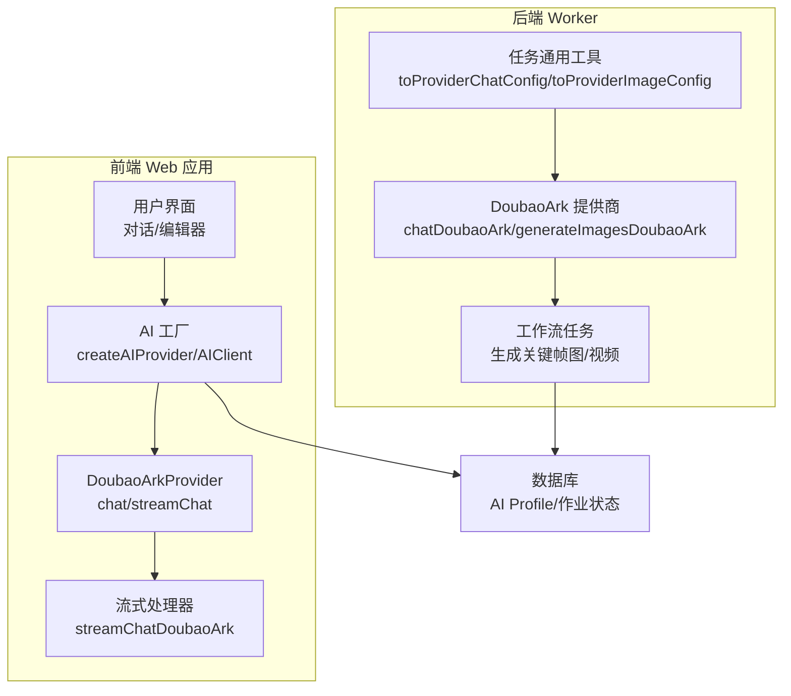
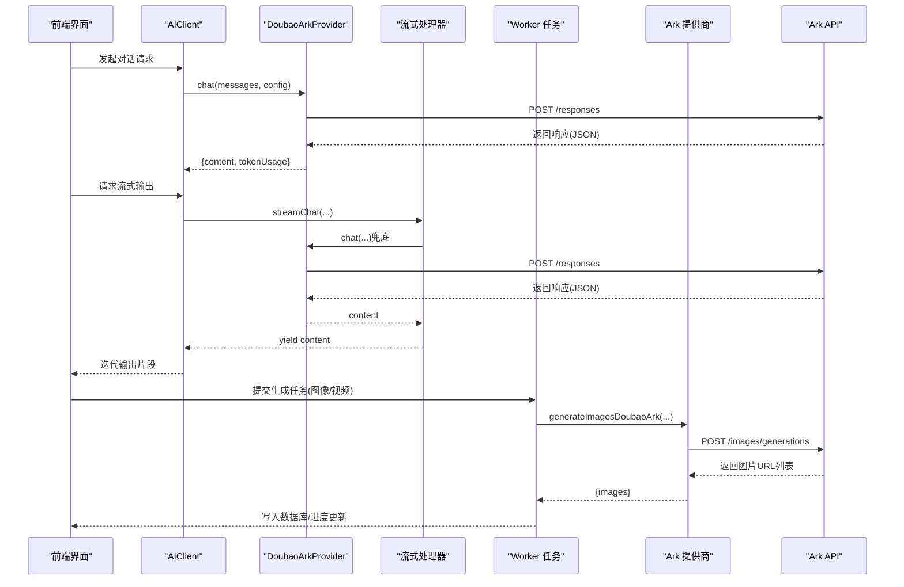
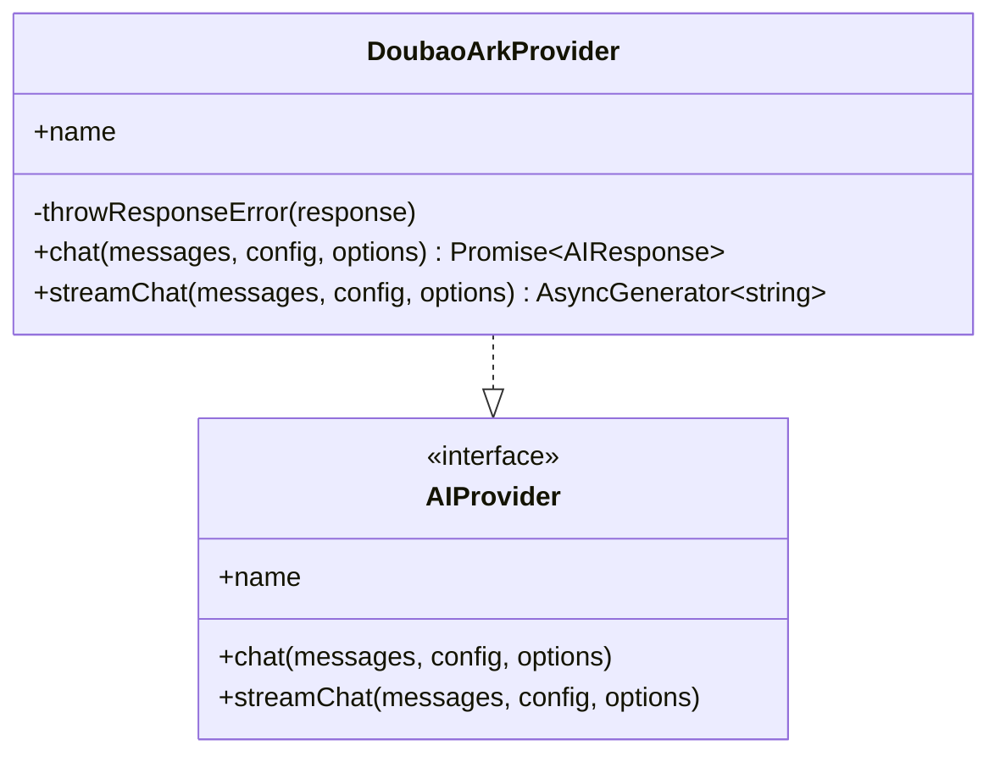
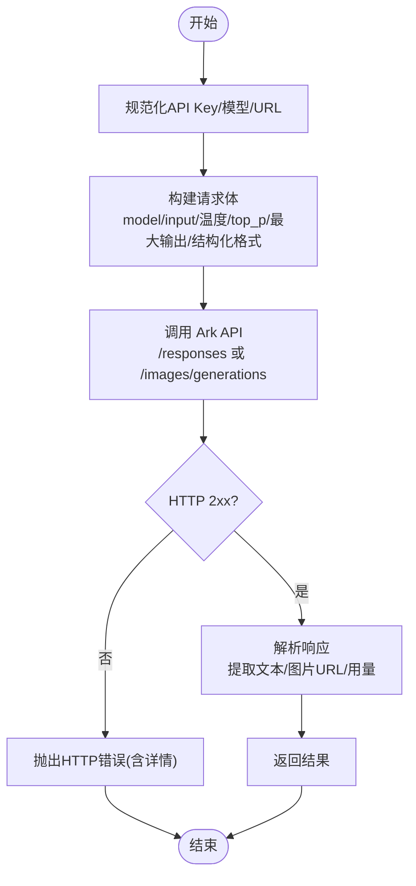
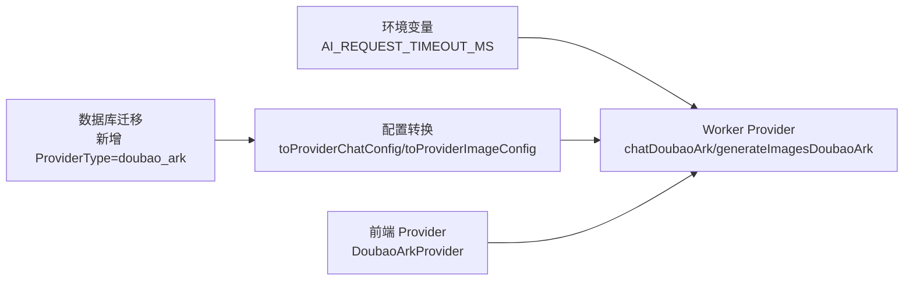

# Doubao Ark提供商

<cite>
**本文引用的文件**
- [apps/web/src/lib/ai/providers/doubaoArk.ts](file://apps/web/src/lib/ai/providers/doubaoArk.ts)
- [apps/web/src/lib/ai/streamingHandler.ts](file://apps/web/src/lib/ai/streamingHandler.ts)
- [apps/web/src/lib/ai/types.ts](file://apps/web/src/lib/ai/types.ts)
- [apps/web/src/lib/ai/factory.ts](file://apps/web/src/lib/ai/factory.ts)
- [apps/worker/src/providers/doubaoArk.ts](file://apps/worker/src/providers/doubaoArk.ts)
- [apps/worker/src/providers/types.ts](file://apps/worker/src/providers/types.ts)
- [apps/worker/src/tasks/common.ts](file://apps/worker/src/tasks/common.ts)
- [apps/worker/src/tasks/generateKeyframeImages.ts](file://apps/worker/src/tasks/generateKeyframeImages.ts)
- [apps/worker/src/tasks/generateSceneVideo.ts](file://apps/worker/src/tasks/generateSceneVideo.ts)
- [apps/api/prisma/migrations/20260121230000_add_doubao_ark_provider/migration.sql](file://apps/api/prisma/migrations/20260121230000_add_doubao_ark_provider/migration.sql)
- [apps/worker/src/config/env.ts](file://apps/worker/src/config/env.ts)
</cite>

## 目录

1. [简介](#简介)
2. [项目结构](#项目结构)
3. [核心组件](#核心组件)
4. [架构总览](#架构总览)
5. [详细组件分析](#详细组件分析)
6. [依赖关系分析](#依赖关系分析)
7. [性能考量](#性能考量)
8. [故障排除指南](#故障排除指南)
9. [结论](#结论)
10. [附录](#附录)

## 简介

本文件面向AIXSSS系统中“Doubao Ark提供商”的技术实现与使用说明，聚焦于字节跳动Doubao Ark API的集成与配置要点。文档覆盖以下方面：

- Ark模型的调用方式、参数映射与响应解析
- 多模态内容生成（图像/视频）与对话管理
- Doubao Ark特有的API接口、认证流程与数据格式
- 集成示例、参数调优与性能监控方案
- 使用技巧与常见问题排查

## 项目结构

Doubao Ark在前端与后端（Worker）分别提供了统一的AI Provider封装与任务编排能力：

- 前端Web应用通过AI Provider接口发起对话请求，并在必要时回退至非流式响应
- Worker侧提供完整的聊天、图像生成与视频内容生成任务，具备超时控制与错误处理
- 数据库迁移中新增了ProviderType枚举值，支持后端模式下的服务端调用

图表来源

- [apps/web/src/lib/ai/factory.ts](file://apps/web/src/lib/ai/factory.ts#L13-L28)
- [apps/web/src/lib/ai/providers/doubaoArk.ts](file://apps/web/src/lib/ai/providers/doubaoArk.ts#L103-L185)
- [apps/web/src/lib/ai/streamingHandler.ts](file://apps/web/src/lib/ai/streamingHandler.ts#L55-L82)
- [apps/worker/src/tasks/common.ts](file://apps/worker/src/tasks/common.ts#L81-L116)
- [apps/worker/src/providers/doubaoArk.ts](file://apps/worker/src/providers/doubaoArk.ts#L210-L251)
- [apps/worker/src/tasks/generateKeyframeImages.ts](file://apps/worker/src/tasks/generateKeyframeImages.ts#L103-L198)
- [apps/worker/src/tasks/generateSceneVideo.ts](file://apps/worker/src/tasks/generateSceneVideo.ts#L140-L235)

章节来源

- [apps/web/src/lib/ai/factory.ts](file://apps/web/src/lib/ai/factory.ts#L13-L28)
- [apps/worker/src/tasks/common.ts](file://apps/worker/src/tasks/common.ts#L81-L116)

## 核心组件

- DoubaoArkProvider（前端）：实现AIProvider接口，负责将消息、生成参数与Ark模型对接，构造请求并解析响应，同时提供流式接口的兜底实现
- DoubaoArk 提供商（Worker）：封装Ark Responses API与图像生成API，支持超时控制、错误解析与结构化输出格式透传
- 类型系统：统一的聊天消息、生成参数、响应格式与Provider配置类型，确保前后端一致的数据契约
- 工厂与客户端：根据ProviderType创建对应Provider实例，支持后端模式与本地模式切换

章节来源

- [apps/web/src/lib/ai/providers/doubaoArk.ts](file://apps/web/src/lib/ai/providers/doubaoArk.ts#L103-L185)
- [apps/worker/src/providers/doubaoArk.ts](file://apps/worker/src/providers/doubaoArk.ts#L210-L251)
- [apps/web/src/lib/ai/types.ts](file://apps/web/src/lib/ai/types.ts#L3-L29)
- [apps/worker/src/providers/types.ts](file://apps/worker/src/providers/types.ts#L37-L49)
- [apps/web/src/lib/ai/factory.ts](file://apps/web/src/lib/ai/factory.ts#L13-L28)

## 架构总览

Doubao Ark在系统中的调用路径如下：

- 前端：AIClient通过工厂创建DoubaoArkProvider，发起chat请求；若启用流式，前端提供兜底的非流式返回
- Worker：接收任务配置，转换为Ark Provider配置，调用Ark Responses API或图像生成API，产出结果并写入数据库

图表来源

- [apps/web/src/lib/ai/providers/doubaoArk.ts](file://apps/web/src/lib/ai/providers/doubaoArk.ts#L132-L184)
- [apps/web/src/lib/ai/streamingHandler.ts](file://apps/web/src/lib/ai/streamingHandler.ts#L55-L82)
- [apps/worker/src/providers/doubaoArk.ts](file://apps/worker/src/providers/doubaoArk.ts#L253-L300)

## 详细组件分析

### DoubaoArkProvider（前端）

- 负责校验与规范化API Key、模型ID/接入点ID、基础URL
- 将generationParams映射为Ark API参数（温度、top_p、max_output_tokens）
- 解析Ark Responses响应，优先提取最终assistant输出文本，支持token用量映射
- 提供streamChat接口的同步返回兜底，便于在不支持流式的环境中使用

图表来源

- [apps/web/src/lib/ai/providers/doubaoArk.ts](file://apps/web/src/lib/ai/providers/doubaoArk.ts#L103-L185)
- [apps/web/src/lib/ai/types.ts](file://apps/web/src/lib/ai/types.ts#L17-L29)

章节来源

- [apps/web/src/lib/ai/providers/doubaoArk.ts](file://apps/web/src/lib/ai/providers/doubaoArk.ts#L103-L185)

### DoubaoArk 提供商（Worker）

- 支持Responses API与图像生成API两类调用
- 统一的超时控制与错误解析，增强稳定性
- 对结构化输出（JSON Object/JSON Schema）进行格式透传，必要时关闭“思考/推理”以提升可解析性
- 图像生成默认关闭水印，便于后续I2V处理

图表来源

- [apps/worker/src/providers/doubaoArk.ts](file://apps/worker/src/providers/doubaoArk.ts#L210-L251)
- [apps/worker/src/providers/doubaoArk.ts](file://apps/worker/src/providers/doubaoArk.ts#L253-L300)

章节来源

- [apps/worker/src/providers/doubaoArk.ts](file://apps/worker/src/providers/doubaoArk.ts#L210-L251)
- [apps/worker/src/providers/doubaoArk.ts](file://apps/worker/src/providers/doubaoArk.ts#L253-L300)

### 类型与配置

- ChatMessage/GenerationParams/ResponseFormat等类型在前后端保持一致，确保跨层数据契约稳定
- ProviderChatConfig/ProviderImageConfig在Worker侧用于任务编排，支持从AI Profile读取并转换为Ark调用所需的配置
- Doubao Ark默认基础URL为“ark.cn-beijing.volces.com/api/v3”，模型默认值在图像生成场景下自动填充

章节来源

- [apps/web/src/lib/ai/types.ts](file://apps/web/src/lib/ai/types.ts#L3-L29)
- [apps/worker/src/providers/types.ts](file://apps/worker/src/providers/types.ts#L37-L49)
- [apps/worker/src/tasks/common.ts](file://apps/worker/src/tasks/common.ts#L81-L116)
- [apps/worker/src/tasks/common.ts](file://apps/worker/src/tasks/common.ts#L118-L153)

### 工厂与客户端

- 工厂根据ProviderType创建对应Provider实例，支持doubao-ark
- AIClient在本地模式下直接调用Provider，在后端模式下走服务端代理
- 流式输出包装器会在每个chunk到达时更新进度存储（用于开发面板）

章节来源

- [apps/web/src/lib/ai/factory.ts](file://apps/web/src/lib/ai/factory.ts#L13-L28)
- [apps/web/src/lib/ai/factory.ts](file://apps/web/src/lib/ai/factory.ts#L47-L74)

### 多模态内容生成与对话管理

- 对话：Responses API，支持温度、top_p、最大输出长度等参数；优先提取最终assistant输出文本
- 图像：/images/generations，支持尺寸、种子、水印等参数；默认关闭水印
- 视频：通过内容生成任务接口创建视频任务，需在AI Profile中选择Doubao Ark并配置视频模型
- 关键帧图：根据场景JSON构建关键帧提示词，批量生成并写入数据库

章节来源

- [apps/worker/src/providers/doubaoArk.ts](file://apps/worker/src/providers/doubaoArk.ts#L253-L300)
- [apps/worker/src/tasks/generateSceneVideo.ts](file://apps/worker/src/tasks/generateSceneVideo.ts#L140-L235)
- [apps/worker/src/tasks/generateKeyframeImages.ts](file://apps/worker/src/tasks/generateKeyframeImages.ts#L103-L198)

## 依赖关系分析

- ProviderType枚举扩展：数据库迁移中新增doubao_ark，使后端模式可识别该提供商
- Worker环境变量：通过AI_REQUEST_TIMEOUT_MS控制请求超时，保障长时间任务的稳定性
- Provider配置转换：toProviderChatConfig/toProviderImageConfig将AI Profile映射为Ark调用所需配置

图表来源

- [apps/api/prisma/migrations/20260121230000_add_doubao_ark_provider/migration.sql](file://apps/api/prisma/migrations/20260121230000_add_doubao_ark_provider/migration.sql#L1-L2)
- [apps/worker/src/config/env.ts](file://apps/worker/src/config/env.ts#L3-L10)
- [apps/worker/src/tasks/common.ts](file://apps/worker/src/tasks/common.ts#L81-L116)
- [apps/worker/src/providers/doubaoArk.ts](file://apps/worker/src/providers/doubaoArk.ts#L210-L251)

章节来源

- [apps/api/prisma/migrations/20260121230000_add_doubao_ark_provider/migration.sql](file://apps/api/prisma/migrations/20260121230000_add_doubao_ark_provider/migration.sql#L1-L2)
- [apps/worker/src/config/env.ts](file://apps/worker/src/config/env.ts#L3-L10)
- [apps/worker/src/tasks/common.ts](file://apps/worker/src/tasks/common.ts#L81-L116)

## 性能考量

- 超时控制：Worker侧通过AI_REQUEST_TIMEOUT_MS统一控制请求超时，默认120秒，可根据网络状况调整
- 参数调优：
  - 温度与top_p：平衡创造性与稳定性
  - 最大输出长度：限制响应长度，降低token消耗
  - 关闭“思考/推理”：在需要可解析JSON的链路中建议关闭，提升一致性
- 图像生成：默认关闭水印，减少后续I2V处理的额外成本
- 流式输出：前端提供兜底实现，避免因不支持流式导致的阻塞

章节来源

- [apps/worker/src/providers/doubaoArk.ts](file://apps/worker/src/providers/doubaoArk.ts#L73-L96)
- [apps/worker/src/providers/doubaoArk.ts](file://apps/worker/src/providers/doubaoArk.ts#L224-L233)
- [apps/worker/src/providers/doubaoArk.ts](file://apps/worker/src/providers/doubaoArk.ts#L265-L273)
- [apps/web/src/lib/ai/providers/doubaoArk.ts](file://apps/web/src/lib/ai/providers/doubaoArk.ts#L176-L184)

## 故障排除指南

- 认证错误（401/403）：
  - 确认使用“方舟控制台”生成的API Key，不要包含Bearer前缀或多余空格/换行
  - 核对API Key是否正确填入，前端与Worker侧均会进行去前后缀与空白处理
- 模型/接入点为空：
  - 填写推理接入点ID（ep-...）或模型ID（如doubao-seed-1-8-251215）
  - 支持从复杂文本中提取ep-xxxx，但模型ID/接入点ID不应包含空白
- 基础URL错误：
  - 默认URL为“ark.cn-beijing.volces.com/api/v3”，可在配置中覆盖
- 请求超时：
  - 提升AI_REQUEST_TIMEOUT_MS，检查网络/VPN/供应商可用性
- 响应解析异常：
  - Responses API优先提取最终assistant输出文本，避免误取reasoning/summary导致JSON解析失败
  - 在需要可解析JSON的链路中关闭“思考/推理”

章节来源

- [apps/web/src/lib/ai/providers/doubaoArk.ts](file://apps/web/src/lib/ai/providers/doubaoArk.ts#L137-L148)
- [apps/web/src/lib/ai/providers/doubaoArk.ts](file://apps/web/src/lib/ai/providers/doubaoArk.ts#L106-L130)
- [apps/worker/src/providers/doubaoArk.ts](file://apps/worker/src/providers/doubaoArk.ts#L104-L129)
- [apps/worker/src/providers/doubaoArk.ts](file://apps/worker/src/providers/doubaoArk.ts#L224-L233)
- [apps/worker/src/providers/doubaoArk.ts](file://apps/worker/src/providers/doubaoArk.ts#L158-L190)

## 结论

Doubao Ark提供商在AIXSSS中实现了统一的对话与多模态生成能力，前后端协同确保了稳定性与可扩展性。通过规范化的参数映射、统一的错误处理与超时控制，开发者可以快速集成Ark API并进行参数调优与性能监控。

## 附录

- 集成步骤概览：
  - 在AI设置中填写API Key、模型/接入点ID与基础URL
  - 选择doubao_ark作为提供商类型
  - 对需要可解析JSON的链路，开启结构化输出并关闭“思考/推理”
  - 如需图像/视频生成，使用Worker任务编排并关注水印与尺寸参数
- 参考路径：
  - 前端Provider实现：[apps/web/src/lib/ai/providers/doubaoArk.ts](file://apps/web/src/lib/ai/providers/doubaoArk.ts#L103-L185)
  - Worker提供商实现：[apps/worker/src/providers/doubaoArk.ts](file://apps/worker/src/providers/doubaoArk.ts#L210-L300)
  - 类型定义与配置转换：[apps/web/src/lib/ai/types.ts](file://apps/web/src/lib/ai/types.ts#L3-L29)、[apps/worker/src/providers/types.ts](file://apps/worker/src/providers/types.ts#L37-L49)、[apps/worker/src/tasks/common.ts](file://apps/worker/src/tasks/common.ts#L81-L153)
  - 数据库迁移：[apps/api/prisma/migrations/20260121230000_add_doubao_ark_provider/migration.sql](file://apps/api/prisma/migrations/20260121230000_add_doubao_ark_provider/migration.sql#L1-L2)
  - 环境变量：[apps/worker/src/config/env.ts](file://apps/worker/src/config/env.ts#L3-L10)
