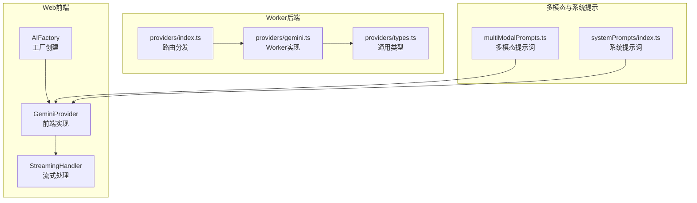
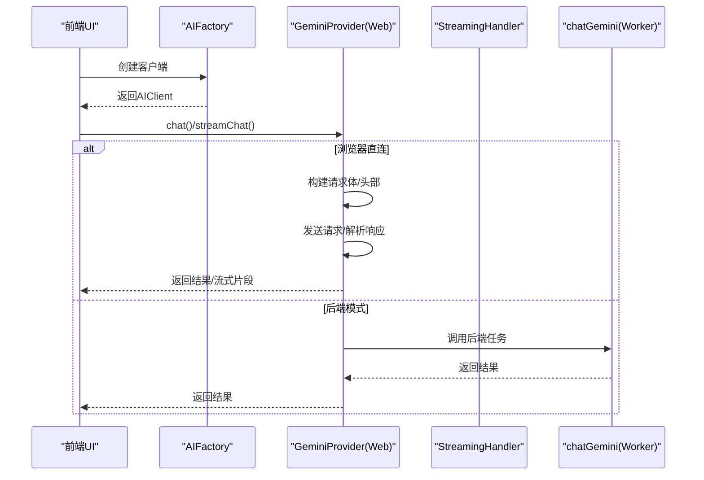
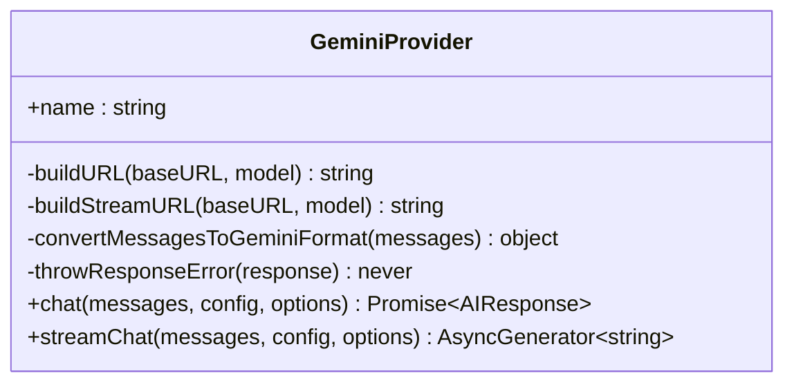
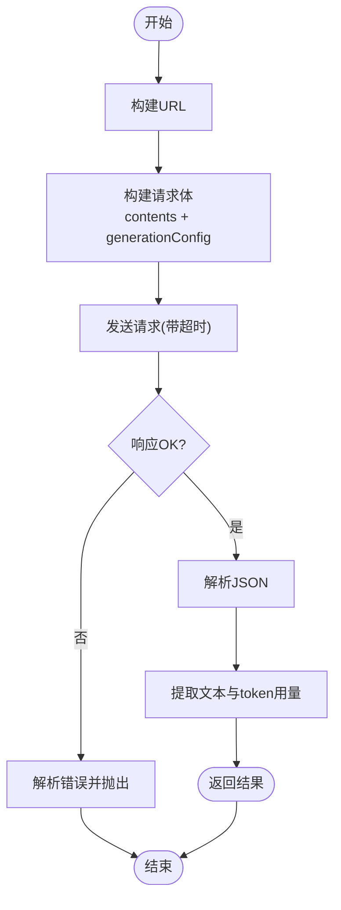
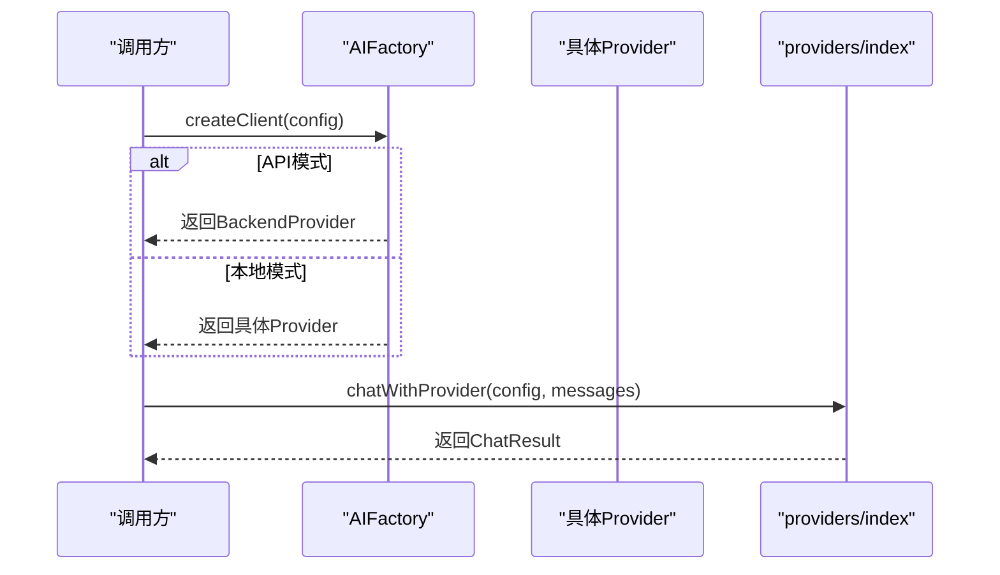
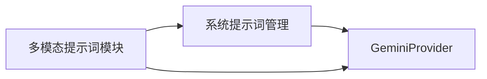
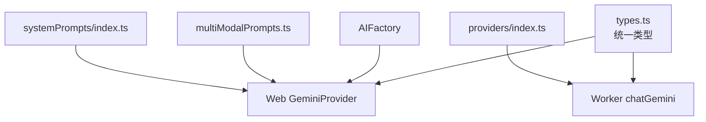

# Gemini提供商

<cite>
**本文档引用的文件**
- [apps/web/src/lib/ai/providers/gemini.ts](file://apps/web/src/lib/ai/providers/gemini.ts)
- [apps/worker/src/providers/gemini.ts](file://apps/worker/src/providers/gemini.ts)
- [apps/worker/src/providers/types.ts](file://apps/worker/src/providers/types.ts)
- [apps/web/src/lib/ai/factory.ts](file://apps/web/src/lib/ai/factory.ts)
- [apps/worker/src/providers/index.ts](file://apps/worker/src/providers/index.ts)
- [apps/web/src/lib/ai/multiModalPrompts.ts](file://apps/web/src/lib/ai/multiModalPrompts.ts)
- [apps/web/src/lib/ai/streamingHandler.ts](file://apps/web/src/lib/ai/streamingHandler.ts)
- [apps/web/src/lib/systemPrompts/index.ts](file://apps/web/src/lib/systemPrompts/index.ts)
- [apps/web/env.example](file://apps/web/env.example)
- [apps/worker/env.example](file://apps/worker/env.example)
</cite>

## 目录

1. [简介](#简介)
2. [项目结构](#项目结构)
3. [核心组件](#核心组件)
4. [架构总览](#架构总览)
5. [详细组件分析](#详细组件分析)
6. [依赖关系分析](#依赖关系分析)
7. [性能考虑](#性能考虑)
8. [故障排查指南](#故障排查指南)
9. [结论](#结论)
10. [附录](#附录)

## 简介

本文件面向AIXSSS项目中的Gemini提供商实现，系统性说明Google Gemini API的集成方式、配置要求、模型选择策略、参数配置与调用方式，并深入阐述多模态输入处理、内容安全过滤与响应解析机制。同时覆盖Gemini特有的API参数、认证方式、速率限制处理、集成示例、错误码处理与性能优化方案，以及常见问题的解决方案。

## 项目结构

Gemini提供商在前端与工作线程（Worker）两端均有实现，分别服务于Web前端直连与后端任务队列执行场景。核心文件包括：

- Web端Gemini提供者实现与工厂
- Worker端Gemini提供者与通用类型
- 多模态提示词生成模块
- 系统提示词管理
- 环境变量示例

图表来源

- [apps/web/src/lib/ai/factory.ts](file://apps/web/src/lib/ai/factory.ts#L13-L28)
- [apps/web/src/lib/ai/providers/gemini.ts](file://apps/web/src/lib/ai/providers/gemini.ts#L4-L172)
- [apps/web/src/lib/ai/streamingHandler.ts](file://apps/web/src/lib/ai/streamingHandler.ts#L343-L399)
- [apps/worker/src/providers/index.ts](file://apps/worker/src/providers/index.ts#L12-L25)
- [apps/worker/src/providers/gemini.ts](file://apps/worker/src/providers/gemini.ts#L81-L122)
- [apps/worker/src/providers/types.ts](file://apps/worker/src/providers/types.ts#L37-L58)
- [apps/web/src/lib/ai/multiModalPrompts.ts](file://apps/web/src/lib/ai/multiModalPrompts.ts#L1-L636)
- [apps/web/src/lib/systemPrompts/index.ts](file://apps/web/src/lib/systemPrompts/index.ts#L109-L124)

章节来源

- [apps/web/src/lib/ai/factory.ts](file://apps/web/src/lib/ai/factory.ts#L13-L28)
- [apps/worker/src/providers/index.ts](file://apps/worker/src/providers/index.ts#L12-L25)

## 核心组件

- Web端GeminiProvider：封装Gemini API调用、消息格式转换、流式解析与错误处理。
- Worker端chatGemini：基于超时控制与统一类型，完成非流式调用与结果解析。
- AIFactory：根据运行模式（API模式/本地模式）创建对应提供者实例。
- providers/index：根据kind路由到具体提供者实现。
- 多模态提示词模块：为音频、BGM、转场等生成提示词，支持AI生成与规则回退。
- 系统提示词管理：集中管理系统提示词，支持本地覆盖与API模式同步。

章节来源

- [apps/web/src/lib/ai/providers/gemini.ts](file://apps/web/src/lib/ai/providers/gemini.ts#L4-L172)
- [apps/worker/src/providers/gemini.ts](file://apps/worker/src/providers/gemini.ts#L81-L122)
- [apps/web/src/lib/ai/factory.ts](file://apps/web/src/lib/ai/factory.ts#L13-L28)
- [apps/worker/src/providers/index.ts](file://apps/worker/src/providers/index.ts#L12-L25)
- [apps/web/src/lib/ai/multiModalPrompts.ts](file://apps/web/src/lib/ai/multiModalPrompts.ts#L421-L509)
- [apps/web/src/lib/systemPrompts/index.ts](file://apps/web/src/lib/systemPrompts/index.ts#L109-L124)

## 架构总览

Web前端通过AIFactory创建GeminiProvider，支持非流式与流式两种调用；Worker通过providers/index路由到chatGemini，统一处理超时与错误。多模态提示词模块与系统提示词模块贯穿于消息构建与上下文注入。

图表来源

- [apps/web/src/lib/ai/factory.ts](file://apps/web/src/lib/ai/factory.ts#L39-L75)
- [apps/web/src/lib/ai/providers/gemini.ts](file://apps/web/src/lib/ai/providers/gemini.ts#L58-L106)
- [apps/web/src/lib/ai/streamingHandler.ts](file://apps/web/src/lib/ai/streamingHandler.ts#L343-L399)
- [apps/worker/src/providers/index.ts](file://apps/worker/src/providers/index.ts#L12-L25)
- [apps/worker/src/providers/gemini.ts](file://apps/worker/src/providers/gemini.ts#L81-L122)

## 详细组件分析

### Web端GeminiProvider实现

- URL构建：支持自定义baseURL，默认指向Google Generative Language API；流式URL通过alt=sse参数启用Server-Sent Events。
- 消息格式转换：将标准ChatMessage转换为Gemini contents结构，系统消息以用户消息形式前置，助手消息映射为model。
- 参数配置：generationConfig支持temperature、topP、maxOutputTokens；presencePenalty、frequencyPenalty、reasoningEffort在类型中声明但未在实现中使用。
- 认证方式：通过HTTP头x-goog-api-key传递API Key。
- 响应解析：从candidates[0].content.parts[0].text提取文本；usageMetadata提供prompt、completion、total token统计。
- 错误处理：统一抛出包含状态码与错误详情的错误信息。
- 流式处理：读取SSE数据块，逐行解析data JSON，提取text片段并yield。

图表来源

- [apps/web/src/lib/ai/providers/gemini.ts](file://apps/web/src/lib/ai/providers/gemini.ts#L4-L172)

章节来源

- [apps/web/src/lib/ai/providers/gemini.ts](file://apps/web/src/lib/ai/providers/gemini.ts#L7-L172)

### Worker端chatGemini实现

- 超时控制：通过AI_REQUEST_TIMEOUT_MS环境变量控制请求超时，未设置时默认120秒。
- URL构建：与Web端一致，使用/v1beta/models/{model}:generateContent。
- 请求体：contents转换与generationConfig参数透传。
- 错误处理：解析JSON错误或回退为文本，抛出包含状态与详情的错误。
- 响应解析：提取candidates[0].content.parts[0].text与usageMetadata。

图表来源

- [apps/worker/src/providers/gemini.ts](file://apps/worker/src/providers/gemini.ts#L15-L122)

章节来源

- [apps/worker/src/providers/gemini.ts](file://apps/worker/src/providers/gemini.ts#L81-L122)

### AIFactory与提供者路由

- AIFactory.createClient根据运行模式创建提供者实例：API模式使用BackendProvider，本地模式根据provider字段创建对应提供者。
- providers/index根据kind路由到具体实现，确保统一的调用接口。

图表来源

- [apps/web/src/lib/ai/factory.ts](file://apps/web/src/lib/ai/factory.ts#L77-L96)
- [apps/worker/src/providers/index.ts](file://apps/worker/src/providers/index.ts#L12-L25)

章节来源

- [apps/web/src/lib/ai/factory.ts](file://apps/web/src/lib/ai/factory.ts#L13-L28)
- [apps/worker/src/providers/index.ts](file://apps/worker/src/providers/index.ts#L12-L25)

### 多模态输入处理与系统提示

- 多模态提示词：模块提供音频提示词、BGM提示词与转场指令生成，支持AI生成与规则引擎回退。
- 系统提示词：集中管理与覆盖，支持本地存储与API模式同步，便于注入上下文与行为约束。

图表来源

- [apps/web/src/lib/ai/multiModalPrompts.ts](file://apps/web/src/lib/ai/multiModalPrompts.ts#L421-L509)
- [apps/web/src/lib/systemPrompts/index.ts](file://apps/web/src/lib/systemPrompts/index.ts#L109-L124)
- [apps/web/src/lib/ai/providers/gemini.ts](file://apps/web/src/lib/ai/providers/gemini.ts#L19-L39)

章节来源

- [apps/web/src/lib/ai/multiModalPrompts.ts](file://apps/web/src/lib/ai/multiModalPrompts.ts#L1-L636)
- [apps/web/src/lib/systemPrompts/index.ts](file://apps/web/src/lib/systemPrompts/index.ts#L109-L124)

## 依赖关系分析

- Web端GeminiProvider依赖标准类型与AI响应结构，内部实现消息格式转换与流式解析。
- Worker端chatGemini依赖统一类型定义与超时控制，保证稳定与可观测性。
- AIFactory与providers/index负责运行时路由与提供者创建，降低上层调用复杂度。
- 多模态与系统提示模块为消息构建提供上下文增强能力。

图表来源

- [apps/worker/src/providers/types.ts](file://apps/worker/src/providers/types.ts#L37-L58)
- [apps/web/src/lib/ai/providers/gemini.ts](file://apps/web/src/lib/ai/providers/gemini.ts#L4-L172)
- [apps/worker/src/providers/gemini.ts](file://apps/worker/src/providers/gemini.ts#L81-L122)
- [apps/worker/src/providers/index.ts](file://apps/worker/src/providers/index.ts#L12-L25)
- [apps/web/src/lib/ai/factory.ts](file://apps/web/src/lib/ai/factory.ts#L13-L28)
- [apps/web/src/lib/ai/multiModalPrompts.ts](file://apps/web/src/lib/ai/multiModalPrompts.ts#L1-L636)
- [apps/web/src/lib/systemPrompts/index.ts](file://apps/web/src/lib/systemPrompts/index.ts#L109-L124)

章节来源

- [apps/worker/src/providers/types.ts](file://apps/worker/src/providers/types.ts#L37-L58)
- [apps/web/src/lib/ai/providers/gemini.ts](file://apps/web/src/lib/ai/providers/gemini.ts#L4-L172)
- [apps/worker/src/providers/gemini.ts](file://apps/worker/src/providers/gemini.ts#L81-L122)
- [apps/worker/src/providers/index.ts](file://apps/worker/src/providers/index.ts#L12-L25)
- [apps/web/src/lib/ai/factory.ts](file://apps/web/src/lib/ai/factory.ts#L13-L28)

## 性能考虑

- 超时控制：Worker端通过AI_REQUEST_TIMEOUT_MS统一控制请求超时，避免长时间阻塞；默认120秒，可根据网络与模型复杂度调整。
- 流式传输：Web端支持SSE流式传输，提升交互体验；需注意浏览器兼容性与网络稳定性。
- Token用量：响应包含usageMetadata，可用于成本控制与配额监控。
- 模型选择：根据任务复杂度选择合适模型，避免不必要的高成本模型；合理设置generationConfig参数以平衡质量与速度。
- 多模态提示词：优先使用规则引擎快速生成，必要时再触发AI生成，减少API调用次数。

章节来源

- [apps/worker/src/providers/gemini.ts](file://apps/worker/src/providers/gemini.ts#L15-L20)
- [apps/web/src/lib/ai/providers/gemini.ts](file://apps/web/src/lib/ai/providers/gemini.ts#L108-L170)
- [apps/web/src/lib/ai/multiModalPrompts.ts](file://apps/web/src/lib/ai/multiModalPrompts.ts#L520-L564)

## 故障排查指南

- API Key无效或权限不足：Web端与Worker端均会解析错误并抛出包含状态码与错误详情的异常，检查API Key是否正确、是否具备相应权限与配额。
- 超时错误：Worker端若出现超时，检查网络/VPN/供应商可用性，或适当提高AI_REQUEST_TIMEOUT_MS。
- 流式解析失败：确认SSE数据格式与浏览器支持情况；解析失败时记录日志并回退到非流式处理。
- 系统提示词缺失：确保系统提示词键存在且内容有效，API模式下需同步至服务器。
- 多模态提示词生成失败：AI生成失败时自动回退到规则引擎，检查输入上下文完整性。

章节来源

- [apps/web/src/lib/ai/providers/gemini.ts](file://apps/web/src/lib/ai/providers/gemini.ts#L41-L56)
- [apps/worker/src/providers/gemini.ts](file://apps/worker/src/providers/gemini.ts#L65-L79)
- [apps/web/src/lib/ai/streamingHandler.ts](file://apps/web/src/lib/ai/streamingHandler.ts#L388-L398)
- [apps/web/src/lib/systemPrompts/index.ts](file://apps/web/src/lib/systemPrompts/index.ts#L109-L124)
- [apps/web/src/lib/ai/multiModalPrompts.ts](file://apps/web/src/lib/ai/multiModalPrompts.ts#L558-L564)

## 结论

AIXSSS的Gemini提供商在Web端与Worker端实现了统一的调用接口与稳定的错误处理机制。通过系统提示词与多模态提示词模块，能够有效增强上下文与产出质量。建议在生产环境中结合超时控制、流式传输与合理的模型参数配置，以获得最佳的性能与用户体验。

## 附录

### 配置要求与环境变量

- Web端环境变量示例：VITE_DATA_MODE、VITE_API_BASE_PATH等，用于控制数据模式与API基础路径。
- Worker端环境变量示例：DATABASE_URL、API_KEY_ENCRYPTION_KEY、REDIS_URL、AI_QUEUE_NAME、WORKER_CONCURRENCY等；Gemini调用无需额外专用环境变量，但需确保API Key正确配置。

章节来源

- [apps/web/env.example](file://apps/web/env.example#L5-L12)
- [apps/worker/env.example](file://apps/worker/env.example#L3-L15)

### 模型选择策略与参数配置

- 模型选择：默认使用gemini-pro，可通过配置项覆盖；根据任务复杂度与成本预算选择合适模型。
- generationConfig参数：
  - temperature：采样温度，数值越低越稳定，越高越创造性。
  - topP：核采样概率阈值，影响候选分布。
  - maxOutputTokens：最大输出token数，控制输出长度。
- 其他参数：presencePenalty、frequencyPenalty、reasoningEffort在类型中声明，但Web端实现未使用。

章节来源

- [apps/web/src/lib/ai/providers/gemini.ts](file://apps/web/src/lib/ai/providers/gemini.ts#L69-L75)
- [apps/worker/src/providers/types.ts](file://apps/worker/src/providers/types.ts#L8-L19)

### 认证方式与安全过滤

- 认证方式：通过HTTP头x-goog-api-key传递API Key。
- 内容安全：代码未显式注入安全过滤参数；如需启用，可在系统提示词中明确安全约束或在上游API层面配置。

章节来源

- [apps/web/src/lib/ai/providers/gemini.ts](file://apps/web/src/lib/ai/providers/gemini.ts#L79-L82)
- [apps/worker/src/providers/gemini.ts](file://apps/worker/src/providers/gemini.ts#L100-L103)

### 集成示例与调用流程

- Web端非流式调用：AIFactory创建客户端，调用GeminiProvider.chat，解析usageMetadata与content。
- Web端流式调用：AIFactory.streamChat，底层通过StreamingHandler解析SSE数据块，逐段产出。
- Worker端调用：通过providers/index路由到chatGemini，统一处理超时与错误。

章节来源

- [apps/web/src/lib/ai/factory.ts](file://apps/web/src/lib/ai/factory.ts#L43-L75)
- [apps/web/src/lib/ai/streamingHandler.ts](file://apps/web/src/lib/ai/streamingHandler.ts#L343-L399)
- [apps/worker/src/providers/index.ts](file://apps/worker/src/providers/index.ts#L12-L25)

### 错误码处理与常见问题

- 常见错误：401/403（API Key无效/权限不足）、429/5xx（限流/服务异常）、超时（网络/供应商问题）。
- 处理建议：检查API Key有效性与权限范围；在网络不稳定时提高超时阈值；在流式场景中增加重试与降级策略。

章节来源

- [apps/web/src/lib/ai/providers/gemini.ts](file://apps/web/src/lib/ai/providers/gemini.ts#L41-L56)
- [apps/worker/src/providers/gemini.ts](file://apps/worker/src/providers/gemini.ts#L22-L39)
