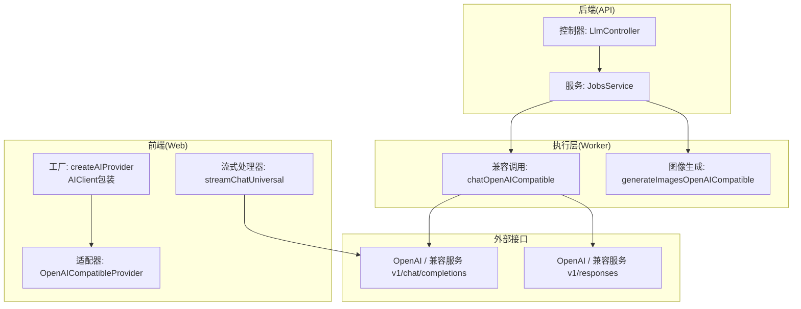
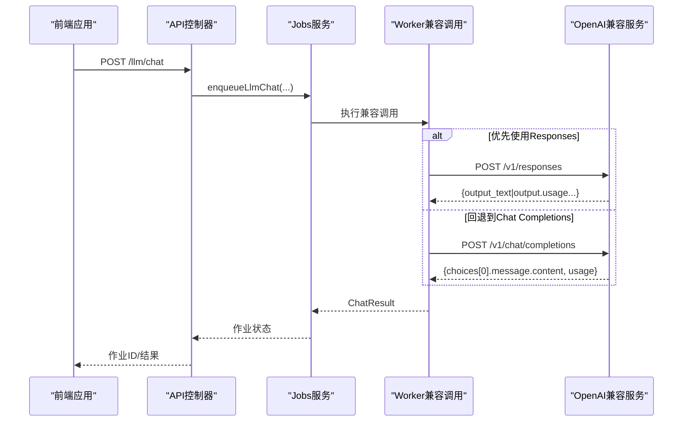
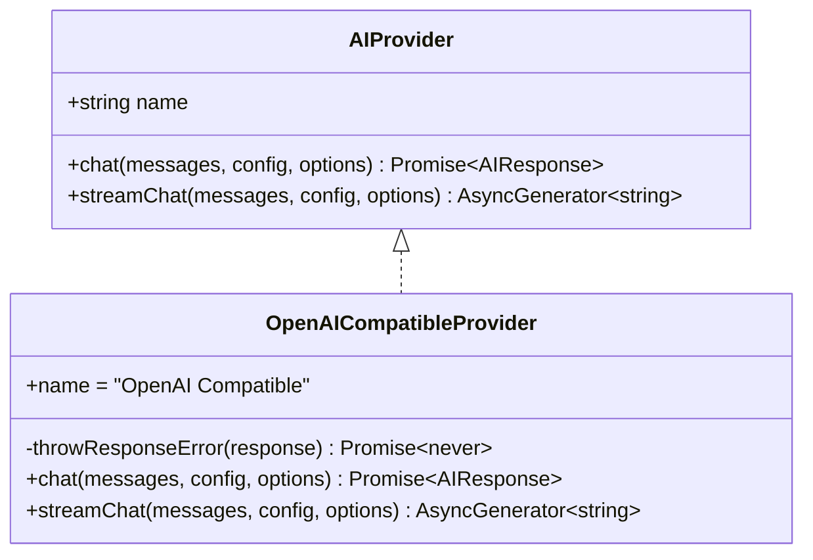
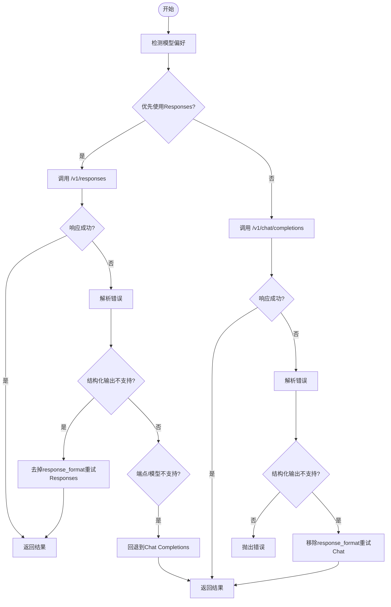
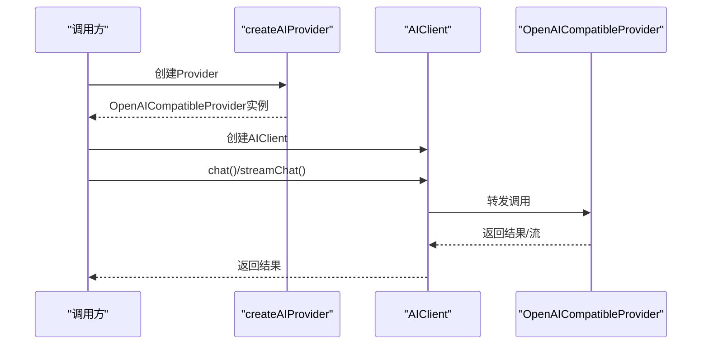
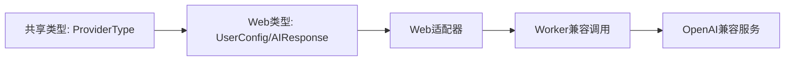

# OpenAI兼容提供商

<cite>
**本文档引用的文件**
- [apps/web/src/lib/ai/providers/openai.ts](file://apps/web/src/lib/ai/providers/openai.ts)
- [apps/worker/src/providers/openaiCompatible.ts](file://apps/worker/src/providers/openaiCompatible.ts)
- [apps/web/src/lib/ai/types.ts](file://apps/web/src/lib/ai/types.ts)
- [apps/web/src/lib/ai/factory.ts](file://apps/web/src/lib/ai/factory.ts)
- [apps/web/src/lib/ai/streamingHandler.ts](file://apps/web/src/lib/ai/streamingHandler.ts)
- [apps/api/src/jobs/llm.controller.ts](file://apps/api/src/jobs/llm.controller.ts)
- [apps/api/src/jobs/jobs.service.ts](file://apps/api/src/jobs/jobs.service.ts)
- [apps/api/src/main.ts](file://apps/api/src/main.ts)
- [apps/api/src/app.module.ts](file://apps/api/src/app.module.ts)
- [packages/shared/src/types.ts](file://packages/shared/src/types.ts)
- [apps/web/src/types/index.ts](file://apps/web/src/types/index.ts)
</cite>

## 目录

1. [简介](#简介)
2. [项目结构](#项目结构)
3. [核心组件](#核心组件)
4. [架构总览](#架构总览)
5. [详细组件分析](#详细组件分析)
6. [依赖关系分析](#依赖关系分析)
7. [性能考虑](#性能考虑)
8. [故障排查指南](#故障排查指南)
9. [结论](#结论)
10. [附录](#附录)

## 简介

本文件面向AIXSSS的OpenAI兼容提供商，系统性阐述OpenAI兼容API的实现原理与适配策略，覆盖以下要点：

- 支持的OpenAI API变体：Chat Completions与Responses API的双栈适配
- GPT系列模型的调用方式与参数映射策略
- 请求参数标准化、响应格式统一与流式响应处理
- 兼容性适配器设计模式、参数转换与错误处理机制
- 具体API调用示例路径、参数配置与性能优化技巧
- 兼容性问题排查指南与最佳实践建议

## 项目结构

OpenAI兼容提供商横跨前端Web应用与后端Worker两套实现，并通过API网关进行统一编排：

- Web前端：提供OpenAI兼容适配器、工厂与流式处理器
- Worker：提供兼容调用、超时控制与结构化输出回退
- API层：接收前端请求，封装为队列作业并交由Worker执行
- 类型系统：共享ProviderType与UserConfig等核心类型

**图表来源**

- [apps/web/src/lib/ai/factory.ts](file://apps/web/src/lib/ai/factory.ts#L13-L28)
- [apps/web/src/lib/ai/providers/openai.ts](file://apps/web/src/lib/ai/providers/openai.ts#L171-L384)
- [apps/web/src/lib/ai/streamingHandler.ts](file://apps/web/src/lib/ai/streamingHandler.ts#L417-L436)
- [apps/api/src/jobs/llm.controller.ts](file://apps/api/src/jobs/llm.controller.ts#L50-L72)
- [apps/api/src/jobs/jobs.service.ts](file://apps/api/src/jobs/jobs.service.ts#L38-L43)
- [apps/worker/src/providers/openaiCompatible.ts](file://apps/worker/src/providers/openaiCompatible.ts#L275-L389)

**章节来源**

- [apps/web/src/lib/ai/factory.ts](file://apps/web/src/lib/ai/factory.ts#L13-L28)
- [apps/web/src/lib/ai/streamingHandler.ts](file://apps/web/src/lib/ai/streamingHandler.ts#L417-L436)
- [apps/api/src/jobs/llm.controller.ts](file://apps/api/src/jobs/llm.controller.ts#L50-L72)
- [apps/api/src/jobs/jobs.service.ts](file://apps/api/src/jobs/jobs.service.ts#L38-L43)
- [apps/worker/src/providers/openaiCompatible.ts](file://apps/worker/src/providers/openaiCompatible.ts#L275-L389)

## 核心组件

- OpenAI兼容适配器（Web端）：负责将内部消息与参数映射为OpenAI兼容请求，自动在Chat Completions与Responses之间切换，并处理流式SSE解析
- 兼容调用函数（Worker端）：在后端模式下统一执行兼容调用，具备超时控制、结构化输出回退与错误归一化
- 工厂与客户端：根据ProviderType创建适配器实例，统一封装同步与流式调用
- 流式处理器：通用流式调用封装，支持中断与进度估算
- API控制器与服务：接收前端请求，校验参数，封装为队列作业

**章节来源**

- [apps/web/src/lib/ai/providers/openai.ts](file://apps/web/src/lib/ai/providers/openai.ts#L171-L384)
- [apps/worker/src/providers/openaiCompatible.ts](file://apps/worker/src/providers/openaiCompatible.ts#L275-L389)
- [apps/web/src/lib/ai/factory.ts](file://apps/web/src/lib/ai/factory.ts#L13-L28)
- [apps/web/src/lib/ai/streamingHandler.ts](file://apps/web/src/lib/ai/streamingHandler.ts#L417-L436)
- [apps/api/src/jobs/llm.controller.ts](file://apps/api/src/jobs/llm.controller.ts#L50-L72)

## 架构总览

OpenAI兼容提供商采用“前端适配 + 后端执行”的双层架构：

- 前端模式：直接调用OpenAI兼容服务，优先尝试Responses API，必要时回退至Chat Completions
- 后端模式：通过API控制器将请求入队，Worker侧执行兼容调用，自动处理参数与错误

**图表来源**

- [apps/api/src/jobs/llm.controller.ts](file://apps/api/src/jobs/llm.controller.ts#L55-L71)
- [apps/api/src/jobs/jobs.service.ts](file://apps/api/src/jobs/jobs.service.ts#L38-L43)
- [apps/worker/src/providers/openaiCompatible.ts](file://apps/worker/src/providers/openaiCompatible.ts#L275-L389)

## 详细组件分析

### OpenAI兼容适配器（Web端）

- 设计模式：类适配器，实现统一的AIProvider接口，封装不同模型与端点的差异
- 参数映射：
  - Chat Completions：temperature、top_p、presence_penalty、frequency_penalty、max_tokens
  - Responses API：max_output_tokens、reasoning.effort（按模型进行努力程度归一化）
- 响应标准化：统一提取content与tokenUsage，兼容prompt_tokens/input_tokens等字段
- 错误处理：捕获HTTP错误并抛出带状态码与详情的错误对象
- 流式处理：解析SSE数据行，逐块产出增量内容

**图表来源**

- [apps/web/src/lib/ai/types.ts](file://apps/web/src/lib/ai/types.ts#L17-L29)
- [apps/web/src/lib/ai/providers/openai.ts](file://apps/web/src/lib/ai/providers/openai.ts#L171-L384)

**章节来源**

- [apps/web/src/lib/ai/providers/openai.ts](file://apps/web/src/lib/ai/providers/openai.ts#L171-L384)
- [apps/web/src/lib/ai/types.ts](file://apps/web/src/lib/ai/types.ts#L17-L29)

### 兼容调用函数（Worker端）

- 超时控制：基于环境变量设置请求超时，超时自动中止并抛出明确错误
- 端点选择策略：
  - 模型偏好：GPT-5系列与o系列优先使用Responses API
  - 结构化输出：若上游不支持response_format/json_schema，则自动回退
  - 端点不可用：当出现未知端点或模型不支持时，回退到Chat Completions
- 参数归一化：针对不同模型的reasoningEffort进行保守映射
- 错误归一化：统一提取错误信息并附带HTTP状态

**图表来源**

- [apps/worker/src/providers/openaiCompatible.ts](file://apps/worker/src/providers/openaiCompatible.ts#L103-L149)
- [apps/worker/src/providers/openaiCompatible.ts](file://apps/worker/src/providers/openaiCompatible.ts#L209-L243)
- [apps/worker/src/providers/openaiCompatible.ts](file://apps/worker/src/providers/openaiCompatible.ts#L275-L389)

**章节来源**

- [apps/worker/src/providers/openaiCompatible.ts](file://apps/worker/src/providers/openaiCompatible.ts#L52-L76)
- [apps/worker/src/providers/openaiCompatible.ts](file://apps/worker/src/providers/openaiCompatible.ts#L103-L149)
- [apps/worker/src/providers/openaiCompatible.ts](file://apps/worker/src/providers/openaiCompatible.ts#L209-L243)
- [apps/worker/src/providers/openaiCompatible.ts](file://apps/worker/src/providers/openaiCompatible.ts#L275-L389)

### 工厂与客户端

- 工厂：根据ProviderType创建对应适配器实例，openai-compatible分支返回OpenAICompatibleProvider
- 客户端：统一封装chat与streamChat，支持可选的taskId用于进度追踪

**图表来源**

- [apps/web/src/lib/ai/factory.ts](file://apps/web/src/lib/ai/factory.ts#L13-L28)
- [apps/web/src/lib/ai/factory.ts](file://apps/web/src/lib/ai/factory.ts#L30-L75)

**章节来源**

- [apps/web/src/lib/ai/factory.ts](file://apps/web/src/lib/ai/factory.ts#L13-L28)
- [apps/web/src/lib/ai/factory.ts](file://apps/web/src/lib/ai/factory.ts#L30-L75)

### 流式响应处理器

- 通用流式封装：根据ProviderType自动路由到对应流式实现
- 中断能力：通过AbortController支持用户中断
- 进度估算：基于内容长度与预估总量计算进度百分比

**章节来源**

- [apps/web/src/lib/ai/streamingHandler.ts](file://apps/web/src/lib/ai/streamingHandler.ts#L417-L436)
- [apps/web/src/lib/ai/streamingHandler.ts](file://apps/web/src/lib/ai/streamingHandler.ts#L114-L201)

### API控制器与服务

- 控制器：校验请求体，支持结构化测试（response_format/json_schema）
- 服务：将请求封装为队列作业，交由Worker执行

**章节来源**

- [apps/api/src/jobs/llm.controller.ts](file://apps/api/src/jobs/llm.controller.ts#L50-L72)
- [apps/api/src/jobs/jobs.service.ts](file://apps/api/src/jobs/jobs.service.ts#L38-L43)

## 依赖关系分析

- 类型依赖：ProviderType来自共享包，UserConfig与AIResponse来自Web端类型定义
- 组件耦合：Web适配器与Worker兼容调用共享参数与错误处理逻辑，降低重复实现
- 外部依赖：OpenAI兼容服务的/v1/chat/completions与/v1/responses端点

**图表来源**

- [packages/shared/src/types.ts](file://packages/shared/src/types.ts#L3-L4)
- [apps/web/src/types/index.ts](file://apps/web/src/types/index.ts#L644-L657)
- [apps/web/src/lib/ai/providers/openai.ts](file://apps/web/src/lib/ai/providers/openai.ts#L171-L384)
- [apps/worker/src/providers/openaiCompatible.ts](file://apps/worker/src/providers/openaiCompatible.ts#L275-L389)

**章节来源**

- [packages/shared/src/types.ts](file://packages/shared/src/types.ts#L3-L4)
- [apps/web/src/types/index.ts](file://apps/web/src/types/index.ts#L644-L657)
- [apps/web/src/lib/ai/providers/openai.ts](file://apps/web/src/lib/ai/providers/openai.ts#L171-L384)
- [apps/worker/src/providers/openaiCompatible.ts](file://apps/worker/src/providers/openaiCompatible.ts#L275-L389)

## 性能考虑

- 超时控制：Worker端通过环境变量设置请求超时，避免长时间阻塞
- 端点选择：优先Responses API提升稳定性与结构化输出能力
- 参数归一化：减少因模型差异导致的参数不兼容
- 流式处理：前端可逐步渲染，改善用户体验
- 错误快速失败：对不支持的结构化输出及时回退，避免无效重试

**章节来源**

- [apps/worker/src/providers/openaiCompatible.ts](file://apps/worker/src/providers/openaiCompatible.ts#L52-L76)
- [apps/worker/src/providers/openaiCompatible.ts](file://apps/worker/src/providers/openaiCompatible.ts#L103-L149)
- [apps/web/src/lib/ai/streamingHandler.ts](file://apps/web/src/lib/ai/streamingHandler.ts#L441-L460)

## 故障排查指南

- 端点不可用/模型不支持Responses：自动回退到Chat Completions
- 结构化输出不支持：移除response_format后重试
- 超时错误：检查网络/供应商可用性，适当提高超时阈值
- 参数不兼容：确认max_tokens/max_completion_tokens与供应商要求一致
- 流式解析异常：检查SSE数据格式与编码

**章节来源**

- [apps/worker/src/providers/openaiCompatible.ts](file://apps/worker/src/providers/openaiCompatible.ts#L209-L243)
- [apps/worker/src/providers/openaiCompatible.ts](file://apps/worker/src/providers/openaiCompatible.ts#L245-L251)
- [apps/worker/src/providers/openaiCompatible.ts](file://apps/worker/src/providers/openaiCompatible.ts#L59-L76)
- [apps/web/src/lib/ai/providers/openai.ts](file://apps/web/src/lib/ai/providers/openai.ts#L360-L388)

## 结论

AIXSSS的OpenAI兼容提供商通过“前端适配 + 后端执行”的架构，在保持与OpenAI生态高度兼容的同时，提供了稳健的参数映射、响应标准化与流式处理能力。其核心优势在于：

- 模型感知的端点选择与参数归一化
- 结构化输出的自动回退与错误归一化
- 前后端协同的超时控制与进度追踪
- 可扩展的适配器模式，便于接入更多兼容服务

## 附录

### 支持的OpenAI API变体与调用方式

- Chat Completions：适用于通用对话与文本生成
- Responses API：适用于结构化输出与更强的推理能力（优先用于GPT-5与o系列）

**章节来源**

- [apps/web/src/lib/ai/providers/openai.ts](file://apps/web/src/lib/ai/providers/openai.ts#L43-L49)
- [apps/worker/src/providers/openaiCompatible.ts](file://apps/worker/src/providers/openaiCompatible.ts#L93-L101)

### 请求参数映射与响应格式标准化

- 参数映射：
  - Chat Completions：temperature、top_p、presence_penalty、frequency_penalty、max_tokens
  - Responses API：max_output_tokens、reasoning.effort
- 响应标准化：统一content与tokenUsage字段，兼容多种token统计字段

**章节来源**

- [apps/web/src/lib/ai/providers/openai.ts](file://apps/web/src/lib/ai/providers/openai.ts#L214-L236)
- [apps/web/src/lib/ai/providers/openai.ts](file://apps/web/src/lib/ai/providers/openai.ts#L87-L113)
- [apps/worker/src/providers/openaiCompatible.ts](file://apps/worker/src/providers/openaiCompatible.ts#L282-L306)
- [apps/worker/src/providers/openaiCompatible.ts](file://apps/worker/src/providers/openaiCompatible.ts#L151-L183)

### 流式响应处理流程

- 前端：解析SSE数据行，逐块产出增量内容
- 后端：统一兼容调用，必要时回退到非流式响应兜底

**章节来源**

- [apps/web/src/lib/ai/providers/openai.ts](file://apps/web/src/lib/ai/providers/openai.ts#L310-L382)
- [apps/web/src/lib/ai/streamingHandler.ts](file://apps/web/src/lib/ai/streamingHandler.ts#L121-L201)

### API调用示例与参数配置

- 示例路径（不展示具体代码内容）：
  - Web适配器聊天调用：[apps/web/src/lib/ai/providers/openai.ts](file://apps/web/src/lib/ai/providers/openai.ts#L197-L308)
  - Worker兼容聊天调用：[apps/worker/src/providers/openaiCompatible.ts](file://apps/worker/src/providers/openaiCompatible.ts#L275-L389)
  - 图像生成调用：[apps/worker/src/providers/openaiCompatible.ts](file://apps/worker/src/providers/openaiCompatible.ts#L391-L437)
  - API控制器结构化测试：[apps/api/src/jobs/llm.controller.ts](file://apps/api/src/jobs/llm.controller.ts#L61-L71)

**章节来源**

- [apps/web/src/lib/ai/providers/openai.ts](file://apps/web/src/lib/ai/providers/openai.ts#L197-L308)
- [apps/worker/src/providers/openaiCompatible.ts](file://apps/worker/src/providers/openaiCompatible.ts#L275-L389)
- [apps/worker/src/providers/openaiCompatible.ts](file://apps/worker/src/providers/openaiCompatible.ts#L391-L437)
- [apps/api/src/jobs/llm.controller.ts](file://apps/api/src/jobs/llm.controller.ts#L61-L71)

### 性能优化技巧

- 优先使用Responses API（GPT-5/o系列）
- 合理设置max_tokens/max_completion_tokens
- 使用流式响应提升交互体验
- 在后端模式下启用超时控制与重试策略

**章节来源**

- [apps/worker/src/providers/openaiCompatible.ts](file://apps/worker/src/providers/openaiCompatible.ts#L52-L76)
- [apps/worker/src/providers/openaiCompatible.ts](file://apps/worker/src/providers/openaiCompatible.ts#L103-L149)
- [apps/web/src/lib/ai/streamingHandler.ts](file://apps/web/src/lib/ai/streamingHandler.ts#L441-L460)
