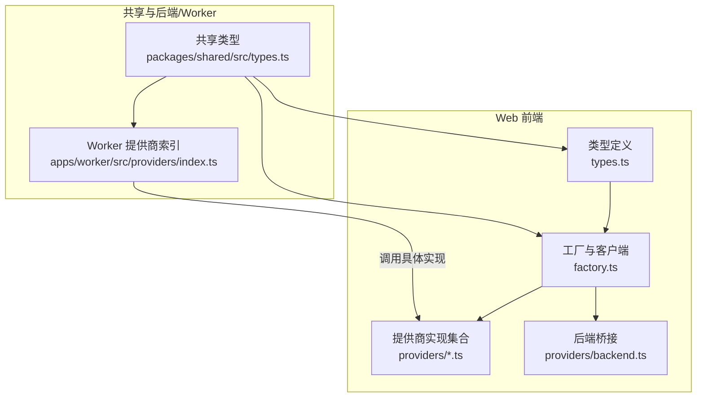
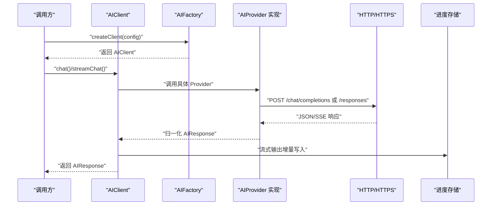
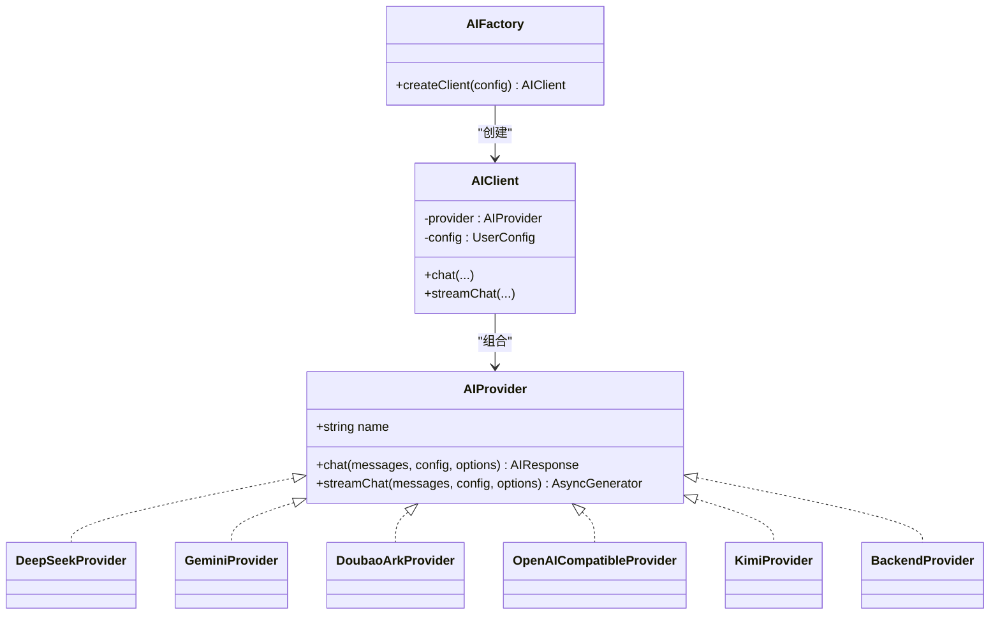
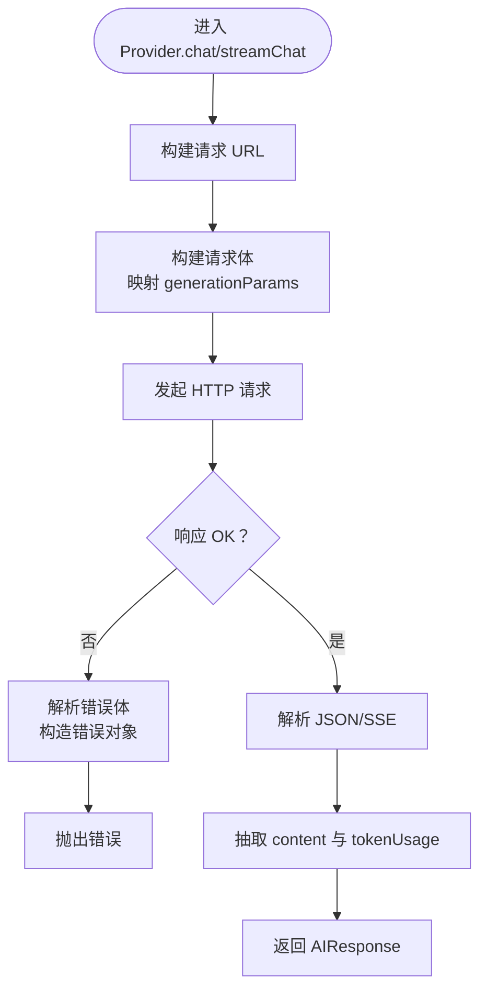
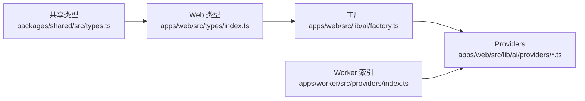

# 提供商抽象层

<cite>
**本文引用的文件**
- [apps/web/src/lib/ai/types.ts](file://apps/web/src/lib/ai/types.ts)
- [apps/web/src/lib/ai/factory.ts](file://apps/web/src/lib/ai/factory.ts)
- [apps/web/src/lib/ai/providers/deepseek.ts](file://apps/web/src/lib/ai/providers/deepseek.ts)
- [apps/web/src/lib/ai/providers/gemini.ts](file://apps/web/src/lib/ai/providers/gemini.ts)
- [apps/web/src/lib/ai/providers/doubaoArk.ts](file://apps/web/src/lib/ai/providers/doubaoArk.ts)
- [apps/web/src/lib/ai/providers/openai.ts](file://apps/web/src/lib/ai/providers/openai.ts)
- [apps/web/src/lib/ai/providers/kimi.ts](file://apps/web/src/lib/ai/providers/kimi.ts)
- [apps/web/src/lib/ai/providers/backend.ts](file://apps/web/src/lib/ai/providers/backend.ts)
- [apps/web/src/types/index.ts](file://apps/web/src/types/index.ts)
- [packages/shared/src/types.ts](file://packages/shared/src/types.ts)
- [apps/worker/src/providers/index.ts](file://apps/worker/src/providers/index.ts)
- [apps/web/src/lib/ai/factory.test.ts](file://apps/web/src/lib/ai/factory.test.ts)
- [apps/web/src/lib/ai/providers/providers.test.ts](file://apps/web/src/lib/ai/providers/providers.test.ts)
</cite>

## 目录

1. [引言](#引言)
2. [项目结构](#项目结构)
3. [核心组件](#核心组件)
4. [架构总览](#架构总览)
5. [详细组件分析](#详细组件分析)
6. [依赖关系分析](#依赖关系分析)
7. [性能考量](#性能考量)
8. [故障排查指南](#故障排查指南)
9. [结论](#结论)
10. [附录](#附录)

## 引言

本文件系统性梳理 AIXSSS 的 AI 提供商抽象层，围绕统一接口设计、工厂与注册机制、动态加载策略、通用请求处理流程、响应解析与错误处理、配置管理与参数标准化、兼容性处理、设计原则与扩展点，以及自定义提供商实现指南进行深入说明。目标是帮助开发者快速理解并安全地扩展新的 AI 提供商，同时确保跨前端与 Worker 的一致性。

## 项目结构

抽象层位于 Web 前端的 AI 子模块中，采用“接口 + 多实现 + 工厂 + 客户端”的分层组织方式，并通过共享类型与后端/Worker 层协同。

图表来源

- [apps/web/src/lib/ai/types.ts](file://apps/web/src/lib/ai/types.ts#L1-L30)
- [apps/web/src/lib/ai/factory.ts](file://apps/web/src/lib/ai/factory.ts#L1-L98)
- [apps/web/src/lib/ai/providers/backend.ts](file://apps/web/src/lib/ai/providers/backend.ts#L1-L25)
- [packages/shared/src/types.ts](file://packages/shared/src/types.ts#L1-L77)
- [apps/worker/src/providers/index.ts](file://apps/worker/src/providers/index.ts#L1-L44)

章节来源

- [apps/web/src/lib/ai/types.ts](file://apps/web/src/lib/ai/types.ts#L1-L30)
- [apps/web/src/lib/ai/factory.ts](file://apps/web/src/lib/ai/factory.ts#L1-L98)
- [packages/shared/src/types.ts](file://packages/shared/src/types.ts#L1-L77)
- [apps/worker/src/providers/index.ts](file://apps/worker/src/providers/index.ts#L1-L44)

## 核心组件

- ProviderInterface 抽象
  - 定义统一的聊天与流式聊天接口，屏蔽各提供商差异。
- 工厂与客户端
  - createAIProvider：基于 ProviderType 进行注册式创建。
  - AIFactory.createClient：根据运行模式（前端直连/后端代理）选择 Provider。
  - AIClient：封装 Provider 的调用与流式输出的进度桥接。
- 提供商实现
  - DeepSeek、Gemini、Doubao/ARK、OpenAI-Compatible、Kimi、Backend。
- 类型与配置
  - AIProviderConfig、AIRequestOptions、UserConfig、AIResponse、ProviderType 等。

章节来源

- [apps/web/src/lib/ai/types.ts](file://apps/web/src/lib/ai/types.ts#L17-L30)
- [apps/web/src/lib/ai/factory.ts](file://apps/web/src/lib/ai/factory.ts#L12-L28)
- [apps/web/src/lib/ai/factory.ts](file://apps/web/src/lib/ai/factory.ts#L77-L97)
- [apps/web/src/types/index.ts](file://apps/web/src/types/index.ts#L644-L657)

## 架构总览

统一抽象层通过 ProviderInterface 将“请求构建—HTTP 调用—SSE 解析—响应归一化—错误处理”流程标准化，工厂负责按类型实例化具体 Provider，客户端负责与 UI 进度系统对接。

图表来源

- [apps/web/src/lib/ai/factory.ts](file://apps/web/src/lib/ai/factory.ts#L77-L97)
- [apps/web/src/lib/ai/types.ts](file://apps/web/src/lib/ai/types.ts#L17-L30)
- [apps/web/src/lib/ai/providers/openai.ts](file://apps/web/src/lib/ai/providers/openai.ts#L197-L308)

## 详细组件分析

### ProviderInterface 设计与实现规范

- 接口职责
  - name：提供商名称，用于 UI 展示与日志识别。
  - chat：同步请求，返回 AIResponse。
  - streamChat：异步生成器，逐片产出字符串片段。
- 参数与返回
  - 请求参数：messages、AIProviderConfig、AIRequestOptions。
  - 返回：AIResponse，包含 content 与可选 tokenUsage。
- 实现要点
  - URL 构建：统一以 baseURL 与模型拼接路径，避免重复前缀。
  - 请求头：按提供商要求设置 Authorization、API Key 头。
  - 参数映射：generationParams 中的温度、采样、惩罚、最大 token 等映射到对应字段。
  - SSE 解析：按行解析 data: 行，过滤 [DONE]，解析 JSON 提取增量内容。
  - 错误处理：捕获 HTTP 错误，尝试解析错误体，构造带状态码与详情的错误对象。

章节来源

- [apps/web/src/lib/ai/types.ts](file://apps/web/src/lib/ai/types.ts#L17-L30)
- [apps/web/src/lib/ai/providers/deepseek.ts](file://apps/web/src/lib/ai/providers/deepseek.ts#L29-L72)
- [apps/web/src/lib/ai/providers/gemini.ts](file://apps/web/src/lib/ai/providers/gemini.ts#L58-L106)
- [apps/web/src/lib/ai/providers/doubaoArk.ts](file://apps/web/src/lib/ai/providers/doubaoArk.ts#L132-L174)
- [apps/web/src/lib/ai/providers/openai.ts](file://apps/web/src/lib/ai/providers/openai.ts#L197-L308)
- [apps/web/src/lib/ai/providers/kimi.ts](file://apps/web/src/lib/ai/providers/kimi.ts#L9-L74)

### 提供商注册机制与工厂模式

- 注册与创建
  - createAIProvider：基于 ProviderType 枚举进行分支创建，新增提供商只需在此处添加分支。
  - AIFactory.createClient：根据运行模式决定使用 BackendProvider 或前端直连 Provider。
- 动态加载策略
  - 通过 ProviderType 字符串驱动，无需硬编码导入，便于扩展。
  - 支持后端模式：前端不持有 apiKey，通过 aiProfileId 与后端协作。
- 客户端包装
  - AIClient：统一封装 chat 与 streamChat；对流式输出进行进度桥接，异常时保留已产出内容。

图表来源

- [apps/web/src/lib/ai/types.ts](file://apps/web/src/lib/ai/types.ts#L17-L30)
- [apps/web/src/lib/ai/factory.ts](file://apps/web/src/lib/ai/factory.ts#L12-L28)
- [apps/web/src/lib/ai/factory.ts](file://apps/web/src/lib/ai/factory.ts#L30-L75)
- [apps/web/src/lib/ai/providers/backend.ts](file://apps/web/src/lib/ai/providers/backend.ts#L5-L24)

章节来源

- [apps/web/src/lib/ai/factory.ts](file://apps/web/src/lib/ai/factory.ts#L12-L28)
- [apps/web/src/lib/ai/factory.ts](file://apps/web/src/lib/ai/factory.ts#L77-L97)
- [apps/web/src/lib/ai/providers/backend.ts](file://apps/web/src/lib/ai/providers/backend.ts#L5-L24)

### 通用请求处理流程、响应解析与错误处理

- 请求构建
  - URL：各 Provider 内部负责拼接 baseURL 与模型，避免重复与冲突。
  - Body：将 messages 与 generationParams 映射为对应字段；流式请求开启 stream。
- 响应解析
  - JSON：解析 choices/usage 或 candidates/content/parts 等结构，抽取 content。
  - SSE：按行解析 data:，过滤 [DONE]，解析增量内容。
  - TokenUsage：统一映射为 {prompt, completion, total}。
- 错误处理
  - 非 OK：读取并解析错误体，构造包含状态码与详情的错误对象，便于 UI 呈现与诊断。
  - 特定提供商：如 Doubao/ARK、Kimi、OpenAI-Compatible 在不同模型或端点不兼容时进行降级或回退。

图表来源

- [apps/web/src/lib/ai/providers/openai.ts](file://apps/web/src/lib/ai/providers/openai.ts#L197-L308)
- [apps/web/src/lib/ai/providers/gemini.ts](file://apps/web/src/lib/ai/providers/gemini.ts#L58-L106)
- [apps/web/src/lib/ai/providers/deepseek.ts](file://apps/web/src/lib/ai/providers/deepseek.ts#L29-L72)
- [apps/web/src/lib/ai/providers/doubaoArk.ts](file://apps/web/src/lib/ai/providers/doubaoArk.ts#L132-L174)
- [apps/web/src/lib/ai/providers/kimi.ts](file://apps/web/src/lib/ai/providers/kimi.ts#L9-L74)

章节来源

- [apps/web/src/lib/ai/providers/openai.ts](file://apps/web/src/lib/ai/providers/openai.ts#L197-L308)
- [apps/web/src/lib/ai/providers/gemini.ts](file://apps/web/src/lib/ai/providers/gemini.ts#L58-L106)
- [apps/web/src/lib/ai/providers/deepseek.ts](file://apps/web/src/lib/ai/providers/deepseek.ts#L29-L72)
- [apps/web/src/lib/ai/providers/doubaoArk.ts](file://apps/web/src/lib/ai/providers/doubaoArk.ts#L132-L174)
- [apps/web/src/lib/ai/providers/kimi.ts](file://apps/web/src/lib/ai/providers/kimi.ts#L9-L74)

### 提供商配置管理、参数标准化与兼容性处理

- 配置模型
  - UserConfig：provider、apiKey、baseURL、model、generationParams、aiProfileId（后端模式）。
  - AIProviderConfig：Provider 内部使用的配置视图。
- 参数标准化
  - generationParams：统一映射温度、采样、惩罚、最大 token 等；部分提供商对字段大小写或命名有差异，已在实现内处理。
- 兼容性处理
  - OpenAI-Compatible：针对特定模型优先使用 /responses API，并在端点不支持时回退到 /chat/completions；对推理强度等参数进行模型感知的规范化。
  - Doubao/ARK：对 apiKey/model/baseURL 进行清洗与归一化，兼容多种输入形式；对 token usage 字段进行多源映射。
  - Gemini：将 messages 转换为 contents/parts 结构，系统消息转换为用户消息前置。
  - Kimi：对思考类模型自动设置温度与最大 token 的默认值。

章节来源

- [apps/web/src/types/index.ts](file://apps/web/src/types/index.ts#L644-L657)
- [apps/web/src/lib/ai/providers/openai.ts](file://apps/web/src/lib/ai/providers/openai.ts#L51-L85)
- [apps/web/src/lib/ai/providers/openai.ts](file://apps/web/src/lib/ai/providers/openai.ts#L289-L308)
- [apps/web/src/lib/ai/providers/doubaoArk.ts](file://apps/web/src/lib/ai/providers/doubaoArk.ts#L29-L51)
- [apps/web/src/lib/ai/providers/doubaoArk.ts](file://apps/web/src/lib/ai/providers/doubaoArk.ts#L53-L78)
- [apps/web/src/lib/ai/providers/gemini.ts](file://apps/web/src/lib/ai/providers/gemini.ts#L19-L39)
- [apps/web/src/lib/ai/providers/kimi.ts](file://apps/web/src/lib/ai/providers/kimi.ts#L16-L29)

### 设计原则、扩展点与最佳实践

- 设计原则
  - 单一职责：Provider 专注协议细节；工厂负责创建；客户端负责进度与选项。
  - 开闭原则：新增提供商只需实现 AIProvider 并在工厂注册。
  - 一致性：统一响应结构与错误格式，便于上层处理。
- 扩展点
  - 新增 ProviderType → 工厂分支 → Provider 实现 → 测试覆盖。
  - 支持后端代理：通过 BackendProvider 与后端协作，避免前端暴露敏感信息。
- 最佳实践
  - URL 归一化：避免重复前缀与尾随斜杠。
  - 参数映射：严格区分字段大小写与命名差异。
  - SSE 解析：缓冲与行分割，过滤 [DONE]，异常日志记录。
  - 错误对象：携带状态码、状态文本与详情，便于 UI 呈现与诊断。
  - TokenUsage：优先使用官方 usage，若无则计算总和。

章节来源

- [apps/web/src/lib/ai/factory.ts](file://apps/web/src/lib/ai/factory.ts#L12-L28)
- [apps/web/src/lib/ai/providers/backend.ts](file://apps/web/src/lib/ai/providers/backend.ts#L5-L24)
- [apps/web/src/lib/ai/providers/openai.ts](file://apps/web/src/lib/ai/providers/openai.ts#L34-L49)
- [apps/web/src/lib/ai/providers/openai.ts](file://apps/web/src/lib/ai/providers/openai.ts#L174-L195)

### 自定义提供商实现指南

- 步骤
  1. 定义 Provider 名称与实现类，实现 AIProvider 接口。
  2. 在工厂中注册新类型分支，返回新 Provider 实例。
  3. 在共享类型中扩展 ProviderType，保持前后端一致。
  4. 编写单元测试，覆盖 chat 与 streamChat 的正常与异常路径。
- 接口规范
  - chat：返回 AIResponse，包含 content 与 tokenUsage。
  - streamChat：逐片产出字符串，遇到 [DONE] 结束。
  - 错误处理：抛出包含状态码与详情的错误对象。
- 参数与兼容性
  - 映射 generationParams，必要时进行模型感知的参数规范化。
  - 对特殊提供商（如 Gemini/Kimi/Doubao/ARK/OpenAI-Compatible）遵循其协议差异。
- 测试建议
  - 使用 fetch 桩函数模拟响应与错误。
  - 覆盖空消息、超长内容、SSE 解析异常、端点不支持回退等边界场景。

章节来源

- [apps/web/src/lib/ai/types.ts](file://apps/web/src/lib/ai/types.ts#L17-L30)
- [apps/web/src/lib/ai/factory.ts](file://apps/web/src/lib/ai/factory.ts#L12-L28)
- [packages/shared/src/types.ts](file://packages/shared/src/types.ts#L3-L4)
- [apps/web/src/lib/ai/factory.test.ts](file://apps/web/src/lib/ai/factory.test.ts#L33-L50)
- [apps/web/src/lib/ai/providers/providers.test.ts](file://apps/web/src/lib/ai/providers/providers.test.ts#L283-L420)

## 依赖关系分析

- 类型依赖
  - Web 前端类型与共享类型保持一致，确保 Worker 与 API 层也能复用。
- 工厂与实现耦合
  - 工厂对具体 Provider 的依赖为“字符串到类”的映射，耦合度低，便于扩展。
- 后端/Worker 协同
  - Worker 提供商索引负责在后端侧路由到具体实现，与前端工厂形成互补。

图表来源

- [packages/shared/src/types.ts](file://packages/shared/src/types.ts#L3-L4)
- [apps/web/src/types/index.ts](file://apps/web/src/types/index.ts#L644-L644)
- [apps/web/src/lib/ai/factory.ts](file://apps/web/src/lib/ai/factory.ts#L12-L28)
- [apps/worker/src/providers/index.ts](file://apps/worker/src/providers/index.ts#L12-L25)

章节来源

- [packages/shared/src/types.ts](file://packages/shared/src/types.ts#L3-L4)
- [apps/web/src/types/index.ts](file://apps/web/src/types/index.ts#L644-L644)
- [apps/web/src/lib/ai/factory.ts](file://apps/web/src/lib/ai/factory.ts#L12-L28)
- [apps/worker/src/providers/index.ts](file://apps/worker/src/providers/index.ts#L12-L25)

## 性能考量

- 流式输出
  - 使用 TextDecoder 与行缓冲解析 SSE，避免大块一次性解码。
  - 对异常中断保留已产出内容，提升用户体验。
- 参数优化
  - generationParams 的合理设置可减少不必要的 token 使用。
  - 对特定模型（如 Kimi 思考类）设置合适的温度与最大 token。
- 端点选择
  - OpenAI-Compatible 在合适模型下优先使用 /responses API，必要时回退，平衡功能与兼容性。

章节来源

- [apps/web/src/lib/ai/providers/openai.ts](file://apps/web/src/lib/ai/providers/openai.ts#L289-L308)
- [apps/web/src/lib/ai/providers/kimi.ts](file://apps/web/src/lib/ai/providers/kimi.ts#L16-L29)
- [apps/web/src/lib/ai/providers/openai.ts](file://apps/web/src/lib/ai/providers/openai.ts#L310-L382)

## 故障排查指南

- 常见问题
  - 未绑定 AI Profile：后端模式下缺少 aiProfileId，需在设置中保存配置。
  - API Key 不合法：Doubao/ARK 对 apiKey 进行清洗，去除 Bearer 前缀与多余空白。
  - 端点不支持：OpenAI-Compatible 在特定模型或端点不支持时会回退到另一个端点。
  - SSE 解析失败：检查 data: 行与 [DONE] 标记，确保网络稳定。
- 定位方法
  - 查看错误对象的状态码、状态文本与详情，结合日志定位。
  - 使用单元测试桩函数验证异常路径与边界条件。
- 修复建议
  - 校验 baseURL 与模型，避免重复前缀。
  - 对 generationParams 进行模型感知的规范化。
  - 在流式场景中保留已产出内容，避免丢失中间结果。

章节来源

- [apps/web/src/lib/ai/providers/backend.ts](file://apps/web/src/lib/ai/providers/backend.ts#L8-L13)
- [apps/web/src/lib/ai/providers/doubaoArk.ts](file://apps/web/src/lib/ai/providers/doubaoArk.ts#L106-L130)
- [apps/web/src/lib/ai/providers/openai.ts](file://apps/web/src/lib/ai/providers/openai.ts#L139-L169)
- [apps/web/src/lib/ai/providers/openai.ts](file://apps/web/src/lib/ai/providers/openai.ts#L353-L381)

## 结论

AIXSSS 的提供商抽象层通过统一接口、工厂注册与客户端包装，实现了对多家 AI 提供商的标准化接入。其设计兼顾了扩展性、兼容性与可维护性，既能在前端直连模式下灵活使用，也能通过后端代理保障安全。遵循本文档的实现规范与最佳实践，可快速、安全地集成新的提供商并保持整体一致性。

## 附录

- 关键实现路径
  - ProviderInterface 定义：[apps/web/src/lib/ai/types.ts](file://apps/web/src/lib/ai/types.ts#L17-L30)
  - 工厂与客户端：[apps/web/src/lib/ai/factory.ts](file://apps/web/src/lib/ai/factory.ts#L12-L97)
  - 各提供商实现：
    - DeepSeek：[apps/web/src/lib/ai/providers/deepseek.ts](file://apps/web/src/lib/ai/providers/deepseek.ts#L29-L139)
    - Gemini：[apps/web/src/lib/ai/providers/gemini.ts](file://apps/web/src/lib/ai/providers/gemini.ts#L58-L171)
    - Doubao/ARK：[apps/web/src/lib/ai/providers/doubaoArk.ts](file://apps/web/src/lib/ai/providers/doubaoArk.ts#L132-L185)
    - OpenAI-Compatible：[apps/web/src/lib/ai/providers/openai.ts](file://apps/web/src/lib/ai/providers/openai.ts#L197-L382)
    - Kimi：[apps/web/src/lib/ai/providers/kimi.ts](file://apps/web/src/lib/ai/providers/kimi.ts#L9-L163)
  - 后端桥接：[apps/web/src/lib/ai/providers/backend.ts](file://apps/web/src/lib/ai/providers/backend.ts#L5-L24)
  - 类型与共享类型：[apps/web/src/types/index.ts](file://apps/web/src/types/index.ts#L644-L726), [packages/shared/src/types.ts](file://packages/shared/src/types.ts#L3-L4)
  - Worker 提供商索引：[apps/worker/src/providers/index.ts](file://apps/worker/src/providers/index.ts#L12-L43)
- 测试参考
  - 工厂与客户端测试：[apps/web/src/lib/ai/factory.test.ts](file://apps/web/src/lib/ai/factory.test.ts#L33-L345)
  - 提供商行为测试：[apps/web/src/lib/ai/providers/providers.test.ts](file://apps/web/src/lib/ai/providers/providers.test.ts#L283-L453)
