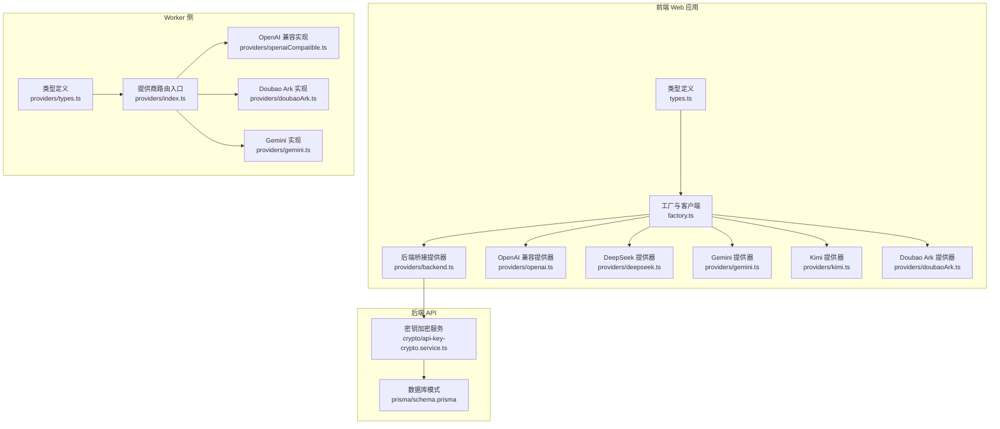
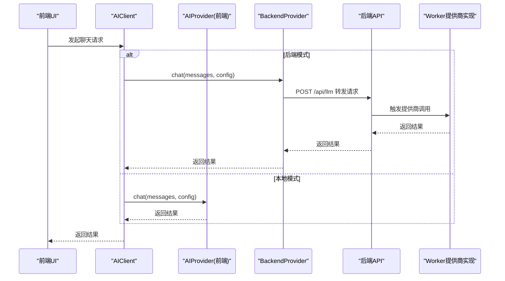
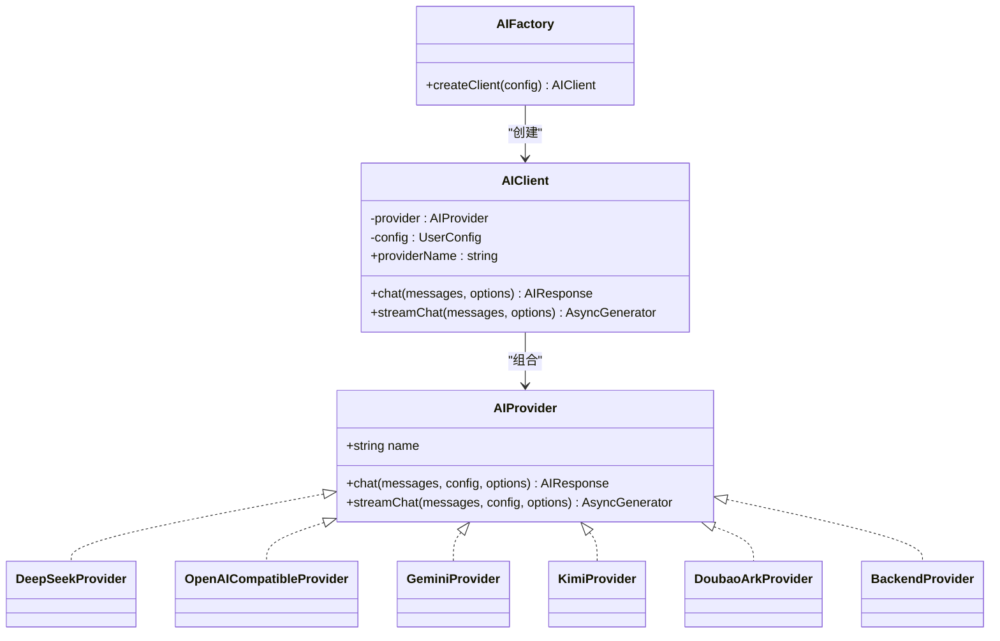
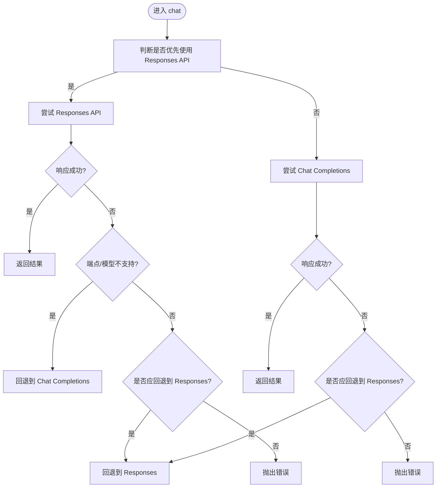
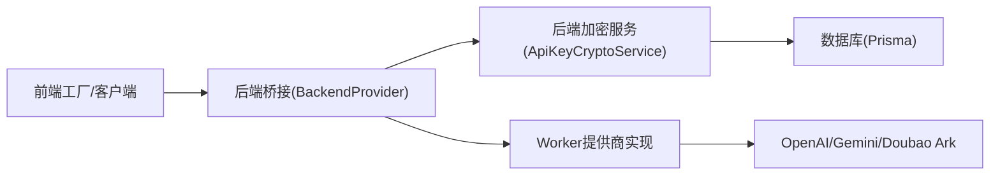

# 提供商集成

<cite>
**本文引用的文件**
- [apps/web/src/lib/ai/types.ts](file://apps/web/src/lib/ai/types.ts)
- [apps/web/src/lib/ai/factory.ts](file://apps/web/src/lib/ai/factory.ts)
- [apps/web/src/lib/ai/providers/backend.ts](file://apps/web/src/lib/ai/providers/backend.ts)
- [apps/web/src/lib/ai/providers/deepseek.ts](file://apps/web/src/lib/ai/providers/deepseek.ts)
- [apps/web/src/lib/ai/providers/openai.ts](file://apps/web/src/lib/ai/providers/openai.ts)
- [apps/web/src/lib/ai/providers/gemini.ts](file://apps/web/src/lib/ai/providers/gemini.ts)
- [apps/web/src/lib/ai/providers/kimi.ts](file://apps/web/src/lib/ai/providers/kimi.ts)
- [apps/web/src/lib/ai/providers/doubaoArk.ts](file://apps/web/src/lib/ai/providers/doubaoArk.ts)
- [apps/worker/src/providers/types.ts](file://apps/worker/src/providers/types.ts)
- [apps/worker/src/providers/index.ts](file://apps/worker/src/providers/index.ts)
- [apps/worker/src/providers/openaiCompatible.ts](file://apps/worker/src/providers/openaiCompatible.ts)
- [apps/worker/src/providers/doubaoArk.ts](file://apps/worker/src/providers/doubaoArk.ts)
- [apps/worker/src/providers/gemini.ts](file://apps/worker/src/providers/gemini.ts)
- [apps/api/src/crypto/api-key-crypto.service.ts](file://apps/api/src/crypto/api-key-crypto.service.ts)
- [apps/worker/src/crypto/apiKeyCrypto.ts](file://apps/worker/src/crypto/apiKeyCrypto.ts)
- [apps/api/prisma/schema.prisma](file://apps/api/prisma/schema.prisma)
</cite>

## 目录

1. [简介](#简介)
2. [项目结构](#项目结构)
3. [核心组件](#核心组件)
4. [架构总览](#架构总览)
5. [详细组件分析](#详细组件分析)
6. [依赖关系分析](#依赖关系分析)
7. [性能考虑](#性能考虑)
8. [故障排查指南](#故障排查指南)
9. [结论](#结论)
10. [附录](#附录)

## 简介

本文件面向AIXSSS的AI服务提供商集成，系统性阐述统一抽象层与多提供商适配实现，覆盖OpenAI、Gemini、DeepSeek、Kimi、Doubao Ark等。文档重点包括：

- 抽象层设计与统一接口
- 各提供商的集成策略与差异处理
- API密钥管理、加密存储与安全传输
- 提供商选择策略、超时与兜底机制
- 配置管理、成本控制与性能优化
- 扩展新提供商的指南与自定义集成示例

## 项目结构

前端Web应用与Worker侧分别实现了统一的AI抽象与具体提供商适配，后端API负责密钥加密存储与服务端调用桥接。

**图表来源**

- [apps/web/src/lib/ai/types.ts](file://apps/web/src/lib/ai/types.ts#L1-L30)
- [apps/web/src/lib/ai/factory.ts](file://apps/web/src/lib/ai/factory.ts#L1-L98)
- [apps/web/src/lib/ai/providers/backend.ts](file://apps/web/src/lib/ai/providers/backend.ts#L1-L25)
- [apps/web/src/lib/ai/providers/openai.ts](file://apps/web/src/lib/ai/providers/openai.ts#L1-L384)
- [apps/web/src/lib/ai/providers/deepseek.ts](file://apps/web/src/lib/ai/providers/deepseek.ts#L1-L140)
- [apps/web/src/lib/ai/providers/gemini.ts](file://apps/web/src/lib/ai/providers/gemini.ts#L1-L172)
- [apps/web/src/lib/ai/providers/kimi.ts](file://apps/web/src/lib/ai/providers/kimi.ts#L1-L164)
- [apps/web/src/lib/ai/providers/doubaoArk.ts](file://apps/web/src/lib/ai/providers/doubaoArk.ts#L1-L186)
- [apps/worker/src/providers/types.ts](file://apps/worker/src/providers/types.ts#L1-L84)
- [apps/worker/src/providers/index.ts](file://apps/worker/src/providers/index.ts#L1-L44)
- [apps/worker/src/providers/openaiCompatible.ts](file://apps/worker/src/providers/openaiCompatible.ts#L1-L438)
- [apps/worker/src/providers/doubaoArk.ts](file://apps/worker/src/providers/doubaoArk.ts#L1-L301)
- [apps/worker/src/providers/gemini.ts](file://apps/worker/src/providers/gemini.ts#L1-L125)
- [apps/api/src/crypto/api-key-crypto.service.ts](file://apps/api/src/crypto/api-key-crypto.service.ts#L1-L39)
- [apps/api/prisma/schema.prisma](file://apps/api/prisma/schema.prisma)

**章节来源**

- [apps/web/src/lib/ai/types.ts](file://apps/web/src/lib/ai/types.ts#L1-L30)
- [apps/web/src/lib/ai/factory.ts](file://apps/web/src/lib/ai/factory.ts#L1-L98)
- [apps/worker/src/providers/types.ts](file://apps/worker/src/providers/types.ts#L1-L84)
- [apps/worker/src/providers/index.ts](file://apps/worker/src/providers/index.ts#L1-L44)

## 核心组件

- 统一接口与类型
  - AIProvider接口定义了名称、同步对话与流式对话能力，确保各提供商实现一致的调用契约。
  - AIProviderConfig封装apiKey、baseURL、model与generationParams，便于跨提供商传递。
  - AIRequestOptions支持AbortSignal与任务ID，用于中断与进度上报。
- 工厂与客户端
  - createAIProvider根据ProviderType创建对应提供商实例。
  - AIFactory.createClient在“后端模式”下自动切换至BackendProvider，否则在本地模式下使用前端直连。
  - AIClient包装底层AIProvider，统一chat与streamChat，并在存在taskId时更新前端进度存储。
- 后端桥接
  - BackendProvider通过HTTP调用后端LLM接口，避免前端暴露apiKey，实现安全的集中式密钥管理。

**章节来源**

- [apps/web/src/lib/ai/types.ts](file://apps/web/src/lib/ai/types.ts#L1-L30)
- [apps/web/src/lib/ai/factory.ts](file://apps/web/src/lib/ai/factory.ts#L1-L98)
- [apps/web/src/lib/ai/providers/backend.ts](file://apps/web/src/lib/ai/providers/backend.ts#L1-L25)

## 架构总览

整体采用“前端抽象 + 多提供商适配 + 后端桥接 + Worker侧通用实现 + 后端加密存储”的分层架构。前端在“后端模式”下不直接持有apiKey，而是通过aiProfileId委托后端调用；Worker侧提供统一的提供商路由与实现，支持OpenAI兼容、Gemini与Doubao Ark。

**图表来源**

- [apps/web/src/lib/ai/factory.ts](file://apps/web/src/lib/ai/factory.ts#L77-L96)
- [apps/web/src/lib/ai/providers/backend.ts](file://apps/web/src/lib/ai/providers/backend.ts#L8-L14)
- [apps/worker/src/providers/index.ts](file://apps/worker/src/providers/index.ts#L12-L25)

## 详细组件分析

### 统一抽象层与工厂

- 抽象接口
  - AIProvider.name：标识提供商名称
  - chat与streamChat：分别提供一次性响应与SSE流式响应
- 工厂与客户端
  - createAIProvider：根据ProviderType映射到具体提供商类
  - AIFactory.createClient：在后端模式强制使用BackendProvider，否则校验本地配置并创建对应Provider
  - AIClient.streamChat：包装底层生成器，按chunk写入前端进度存储

**图表来源**

- [apps/web/src/lib/ai/types.ts](file://apps/web/src/lib/ai/types.ts#L17-L29)
- [apps/web/src/lib/ai/factory.ts](file://apps/web/src/lib/ai/factory.ts#L30-L75)

**章节来源**

- [apps/web/src/lib/ai/types.ts](file://apps/web/src/lib/ai/types.ts#L1-L30)
- [apps/web/src/lib/ai/factory.ts](file://apps/web/src/lib/ai/factory.ts#L1-L98)

### OpenAI 兼容提供器

- 设计要点
  - 自动选择Responses API或Chat Completions API，依据模型类型与错误信息进行智能回退
  - 参数归一化与推理强度映射，适配不同模型族的差异
  - 流式与非流式兜底：当Responses优先模型不支持流式时，回退为非流式输出
- 错误处理
  - 统一抛出带状态码与详情的错误对象，便于上层识别与提示

**图表来源**

- [apps/web/src/lib/ai/providers/openai.ts](file://apps/web/src/lib/ai/providers/openai.ts#L197-L308)
- [apps/worker/src/providers/openaiCompatible.ts](file://apps/worker/src/providers/openaiCompatible.ts#L275-L389)

**章节来源**

- [apps/web/src/lib/ai/providers/openai.ts](file://apps/web/src/lib/ai/providers/openai.ts#L1-L384)
- [apps/worker/src/providers/openaiCompatible.ts](file://apps/worker/src/providers/openaiCompatible.ts#L1-L438)

### Gemini 提供器

- 设计要点
  - 使用Google Generative Language API，消息格式转换为contents/parts结构
  - 支持generationConfig温度、采样与最大输出长度
  - 流式与非流式均基于SSE实现
- 错误处理
  - 统一解析JSON或文本错误体，构造可读错误信息

**章节来源**

- [apps/web/src/lib/ai/providers/gemini.ts](file://apps/web/src/lib/ai/providers/gemini.ts#L1-L172)
- [apps/worker/src/providers/gemini.ts](file://apps/worker/src/providers/gemini.ts#L1-L125)

### DeepSeek 提供器

- 设计要点
  - 默认基础URL与v1/chat/completions端点
  - 参数映射（temperature、top_p、max_tokens等）
  - 流式SSE解析，逐行处理data块
- 错误处理
  - 解析错误体并拼接状态信息，抛出可读异常

**章节来源**

- [apps/web/src/lib/ai/providers/deepseek.ts](file://apps/web/src/lib/ai/providers/deepseek.ts#L1-L140)

### Kimi 提供器

- 设计要点
  - 固定基础URL，针对“thinking”模型自动调整温度与最大tokens
  - 流式SSE解析，特殊处理推理模型的delta结构
- 错误处理
  - 记录状态码与响应体，抛出带状态的错误

**章节来源**

- [apps/web/src/lib/ai/providers/kimi.ts](file://apps/web/src/lib/ai/providers/kimi.ts#L1-L164)

### Doubao Ark 提供器

- 设计要点
  - 自动清洗与标准化API Key与模型ID（支持ep-...接入点ID）
  - 使用Responses API，优先提取最终输出文本，避免中间推理片段
  - 当前不支持流式，以非流式兜底
- 错误处理
  - 针对401/403给出明确提示，指导正确Key格式

**章节来源**

- [apps/web/src/lib/ai/providers/doubaoArk.ts](file://apps/web/src/lib/ai/providers/doubaoArk.ts#L1-L186)
- [apps/worker/src/providers/doubaoArk.ts](file://apps/worker/src/providers/doubaoArk.ts#L1-L301)

### Worker 侧提供商路由与实现

- 路由入口
  - chatWithProvider/generateImagesWithProvider根据kind分派到具体实现
- 实现细节
  - 统一的超时控制与错误解析
  - OpenAI兼容：Responses与Chat Completions双栈回退
  - Doubao Ark：Responses API与图片生成
  - Gemini：generateContent API

**章节来源**

- [apps/worker/src/providers/index.ts](file://apps/worker/src/providers/index.ts#L1-L44)
- [apps/worker/src/providers/types.ts](file://apps/worker/src/providers/types.ts#L1-L84)
- [apps/worker/src/providers/openaiCompatible.ts](file://apps/worker/src/providers/openaiCompatible.ts#L1-L438)
- [apps/worker/src/providers/doubaoArk.ts](file://apps/worker/src/providers/doubaoArk.ts#L1-L301)
- [apps/worker/src/providers/gemini.ts](file://apps/worker/src/providers/gemini.ts#L1-L125)

## 依赖关系分析

- 前端与后端
  - 前端在后端模式下通过BackendProvider调用后端API，后端再委派Worker执行实际提供商调用
- 后端与存储
  - 后端使用AES-256-GCM对API Key进行加密存储，密钥从环境变量派生
- Worker与提供商
  - Worker侧统一实现OpenAI兼容、Gemini与Doubao Ark，屏蔽差异

**图表来源**

- [apps/web/src/lib/ai/providers/backend.ts](file://apps/web/src/lib/ai/providers/backend.ts#L8-L14)
- [apps/api/src/crypto/api-key-crypto.service.ts](file://apps/api/src/crypto/api-key-crypto.service.ts#L1-L39)
- [apps/api/prisma/schema.prisma](file://apps/api/prisma/schema.prisma)

**章节来源**

- [apps/web/src/lib/ai/factory.ts](file://apps/web/src/lib/ai/factory.ts#L77-L96)
- [apps/api/src/crypto/api-key-crypto.service.ts](file://apps/api/src/crypto/api-key-crypto.service.ts#L1-L39)

## 性能考虑

- 超时控制
  - Worker侧统一通过环境变量设置请求超时，默认约120秒，避免长时间阻塞
- 流式输出
  - 优先使用SSE流式接口，减少首字节延迟；对不支持流式的模型采用非流式兜底
- 参数优化
  - 根据模型特性自动调整温度、最大tokens等参数，平衡质量与速度
- 成本控制
  - 统一记录token用量（prompt/completion/total），结合上限策略限制单次调用成本

**章节来源**

- [apps/worker/src/providers/openaiCompatible.ts](file://apps/worker/src/providers/openaiCompatible.ts#L52-L76)
- [apps/web/src/lib/ai/providers/openai.ts](file://apps/web/src/lib/ai/providers/openai.ts#L310-L321)

## 故障排查指南

- 常见错误与定位
  - API Key格式错误：Doubao Ark明确提示需使用“方舟控制台”生成的Key且不含Bearer前缀
  - 端点不支持：Responses API在部分模型或兼容实现上不可用，触发回退逻辑
  - 超时问题：检查网络/VPN/供应商可用性，必要时提高AI_REQUEST_TIMEOUT_MS
- 日志与诊断
  - 前端AIClient在流式错误时会记录当前已产出的输出长度，辅助定位截断位置
  - 各Provider统一抛出带状态码与详情的错误对象，便于前端提示

**章节来源**

- [apps/web/src/lib/ai/providers/doubaoArk.ts](file://apps/web/src/lib/ai/providers/doubaoArk.ts#L119-L122)
- [apps/worker/src/providers/openaiCompatible.ts](file://apps/worker/src/providers/openaiCompatible.ts#L59-L76)
- [apps/web/src/lib/ai/factory.ts](file://apps/web/src/lib/ai/factory.ts#L62-L72)

## 结论

AIXSSS通过统一的AIProvider抽象与工厂模式，实现了对多家提供商的一致接入；在后端模式下，前端不再持有敏感密钥，由后端集中加密存储并通过aiProfileId完成服务端调用；Worker侧提供统一路由与实现，具备完善的超时、回退与错误处理机制。该架构既保证了易用性与扩展性，也为成本控制与性能优化提供了良好基础。

## 附录

### API密钥管理、加密存储与安全传输

- 加密算法
  - AES-256-GCM，使用12字节随机IV与认证标签，确保机密性与完整性
- 密钥派生
  - 若环境变量提供的密钥为32字节base64，则直接使用；否则通过SHA-256派生固定长度密钥
- 存储与传输
  - 后端API在入库前对API Key进行加密，运行时解密；前端仅通过aiProfileId与后端交互，不直接接触明文Key

**章节来源**

- [apps/api/src/crypto/api-key-crypto.service.ts](file://apps/api/src/crypto/api-key-crypto.service.ts#L1-L39)
- [apps/worker/src/crypto/apiKeyCrypto.ts](file://apps/worker/src/crypto/apiKeyCrypto.ts#L1-L23)
- [apps/api/prisma/schema.prisma](file://apps/api/prisma/schema.prisma)

### 提供商选择策略、负载均衡与故障转移

- 选择策略
  - 按模型类型自动选择更优API（如GPT-5/o系列优先Responses API）
  - 用户配置可覆盖默认行为
- 负载均衡与故障转移
  - Worker侧通过统一路由与超时控制，结合错误回退策略（Responses/Chat Completions互换）提升可用性
  - 建议在后端引入多aiProfile与权重策略，实现多供应商轮询与熔断

**章节来源**

- [apps/web/src/lib/ai/providers/openai.ts](file://apps/web/src/lib/ai/providers/openai.ts#L51-L57)
- [apps/worker/src/providers/openaiCompatible.ts](file://apps/worker/src/providers/openaiCompatible.ts#L103-L111)

### 配置管理、成本控制与性能优化方案

- 配置管理
  - 前端：ProviderType、apiKey、baseURL、model、generationParams
  - 后端：aiProfileId与加密Key，配合Prisma schema管理
- 成本控制
  - 统一记录token用量，结合阈值告警与上限策略
- 性能优化
  - 优先流式接口；合理设置温度与最大tokens；启用合适的超时与重试策略

**章节来源**

- [apps/web/src/lib/ai/types.ts](file://apps/web/src/lib/ai/types.ts#L3-L9)
- [apps/api/prisma/schema.prisma](file://apps/api/prisma/schema.prisma)

### 扩展新提供商指南与自定义集成示例

- 新增步骤
  - 在前端实现AIProvider子类，实现chat与streamChat
  - 在工厂中注册ProviderType到类的映射
  - 如需后端模式，确保后端API支持该提供商的aiProfile配置
  - 在Worker侧新增路由与实现（如需）
- 自定义集成示例
  - 参考OpenAI兼容实现，结合模型特性与错误回退策略，快速适配新的兼容服务

**章节来源**

- [apps/web/src/lib/ai/factory.ts](file://apps/web/src/lib/ai/factory.ts#L13-L28)
- [apps/worker/src/providers/index.ts](file://apps/worker/src/providers/index.ts#L12-L25)
