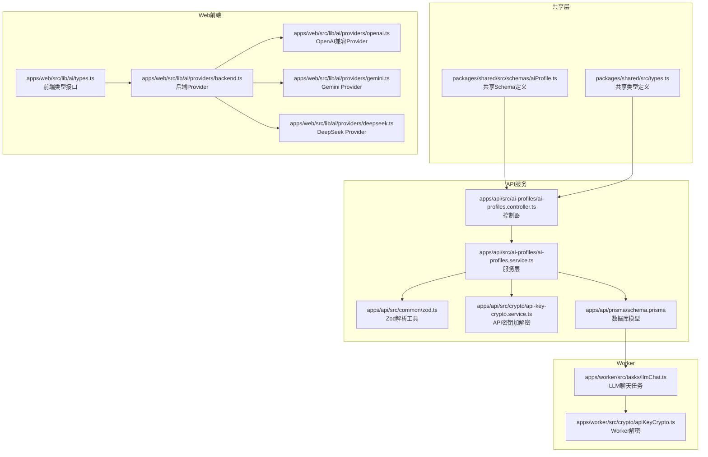
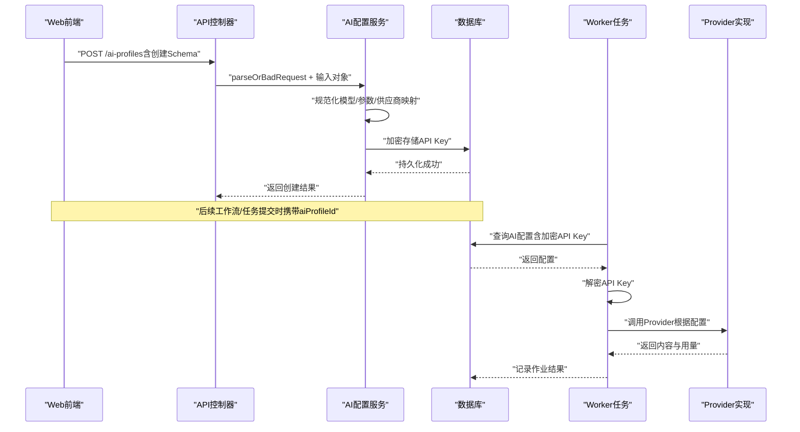
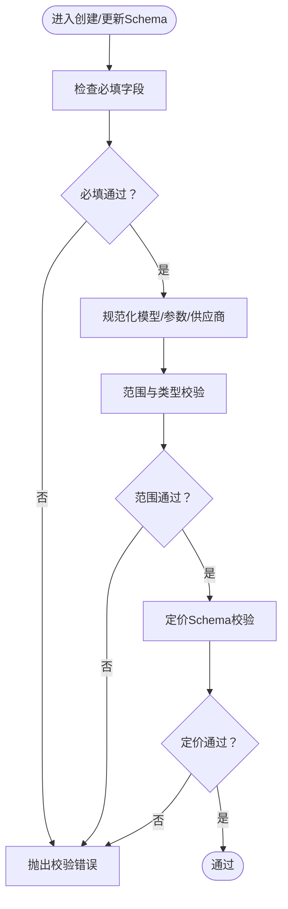
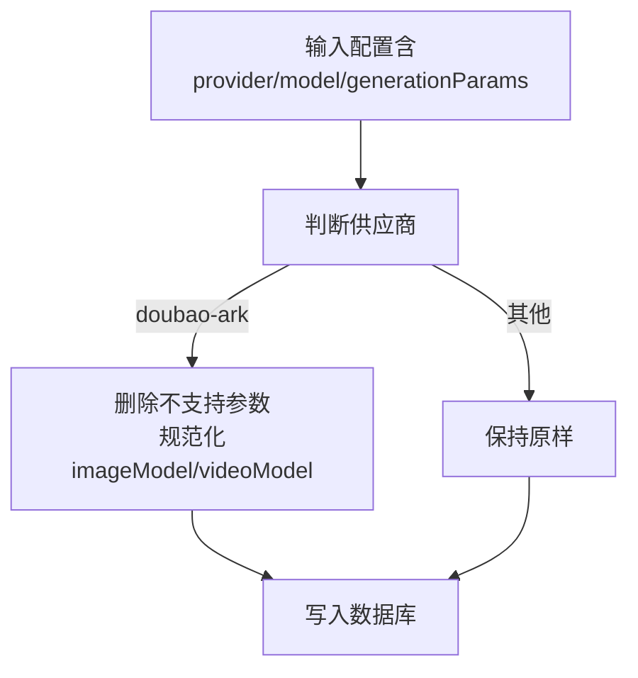
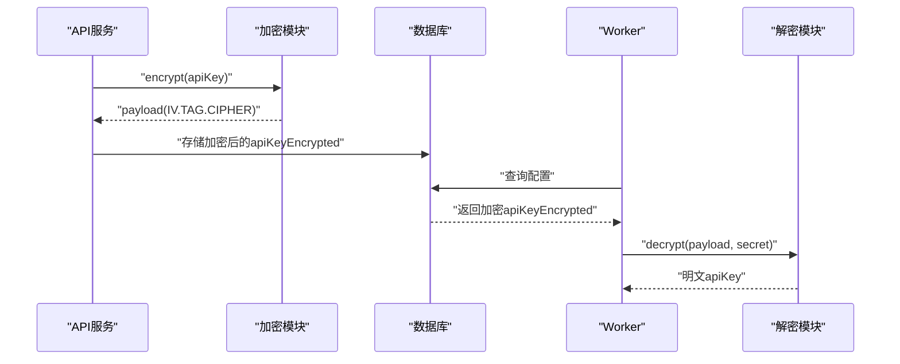
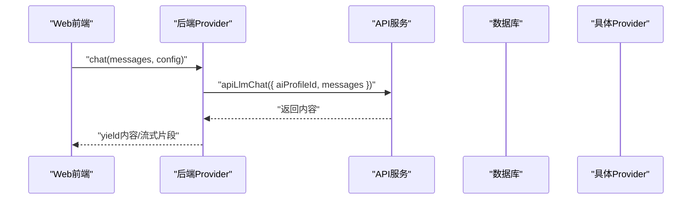
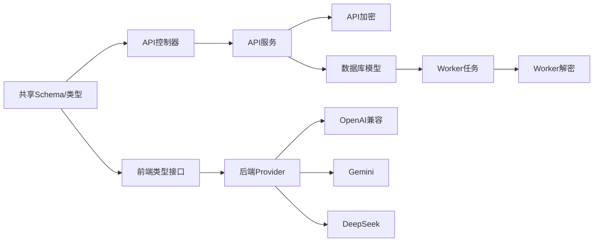

# AI配置Schema（AI Profile Schema）

<cite>
**本文引用的文件**
- [packages/shared/src/schemas/aiProfile.ts](file://packages/shared/src/schemas/aiProfile.ts)
- [apps/api/src/common/zod.ts](file://apps/api/src/common/zod.ts)
- [apps/api/src/ai-profiles/ai-profiles.controller.ts](file://apps/api/src/ai-profiles/ai-profiles.controller.ts)
- [apps/api/src/ai-profiles/ai-profiles.service.ts](file://apps/api/src/ai-profiles/ai-profiles.service.ts)
- [apps/api/src/crypto/api-key-crypto.service.ts](file://apps/api/src/crypto/api-key-crypto.service.ts)
- [apps/worker/src/crypto/apiKeyCrypto.ts](file://apps/worker/src/crypto/apiKeyCrypto.ts)
- [apps/worker/src/tasks/llmChat.ts](file://apps/worker/src/tasks/llmChat.ts)
- [apps/api/prisma/schema.prisma](file://apps/api/prisma/schema.prisma)
- [packages/shared/src/types.ts](file://packages/shared/src/types.ts)
- [apps/web/src/lib/ai/providers/openai.ts](file://apps/web/src/lib/ai/providers/openai.ts)
- [apps/web/src/lib/ai/providers/gemini.ts](file://apps/web/src/lib/ai/providers/gemini.ts)
- [apps/web/src/lib/ai/providers/deepseek.ts](file://apps/web/src/lib/ai/providers/deepseek.ts)
- [apps/web/src/lib/ai/providers/backend.ts](file://apps/web/src/lib/ai/providers/backend.ts)
- [apps/web/src/lib/ai/types.ts](file://apps/web/src/lib/ai/types.ts)
- [apps/api/src/jobs/workflow.controller.ts](file://apps/api/src/jobs/workflow.controller.ts)
</cite>

## 目录

1. [简介](#简介)
2. [项目结构](#项目结构)
3. [核心组件](#核心组件)
4. [架构总览](#架构总览)
5. [详细组件分析](#详细组件分析)
6. [依赖关系分析](#依赖关系分析)
7. [性能考量](#性能考量)
8. [故障排查指南](#故障排查指南)
9. [结论](#结论)
10. [附录](#附录)

## 简介

本文件围绕“AI配置Schema（AI Profile Schema）”展开，系统性阐述Zod Schema设计、供应商选择、API密钥验证、参数配置、成本控制等字段的验证规则；深入解释不同AI供应商的配置差异、必填字段验证、参数范围验证、安全加密验证等关键逻辑；并说明AI配置的动态验证、供应商切换验证、配置继承验证等高级特性。文档同时给出AI配置创建、更新、使用的完整验证示例，以及配置安全性保证的最佳实践。

## 项目结构

AI配置Schema位于共享包中，由API服务负责接收与校验，Worker侧负责解密与实际调用，Web前端提供多种Provider实现与统一类型接口。

**图表来源**

- [packages/shared/src/schemas/aiProfile.ts](file://packages/shared/src/schemas/aiProfile.ts#L1-L51)
- [packages/shared/src/types.ts](file://packages/shared/src/types.ts#L1-L77)
- [apps/api/src/ai-profiles/ai-profiles.controller.ts](file://apps/api/src/ai-profiles/ai-profiles.controller.ts#L1-L38)
- [apps/api/src/ai-profiles/ai-profiles.service.ts](file://apps/api/src/ai-profiles/ai-profiles.service.ts#L1-L202)
- [apps/api/src/common/zod.ts](file://apps/api/src/common/zod.ts#L1-L16)
- [apps/api/src/crypto/api-key-crypto.service.ts](file://apps/api/src/crypto/api-key-crypto.service.ts#L1-L39)
- [apps/api/prisma/schema.prisma](file://apps/api/prisma/schema.prisma#L275-L292)
- [apps/worker/src/crypto/apiKeyCrypto.ts](file://apps/worker/src/crypto/apiKeyCrypto.ts#L1-L23)
- [apps/worker/src/tasks/llmChat.ts](file://apps/worker/src/tasks/llmChat.ts#L1-L64)
- [apps/web/src/lib/ai/providers/backend.ts](file://apps/web/src/lib/ai/providers/backend.ts#L1-L25)
- [apps/web/src/lib/ai/providers/openai.ts](file://apps/web/src/lib/ai/providers/openai.ts#L1-L384)
- [apps/web/src/lib/ai/providers/gemini.ts](file://apps/web/src/lib/ai/providers/gemini.ts#L1-L172)
- [apps/web/src/lib/ai/providers/deepseek.ts](file://apps/web/src/lib/ai/providers/deepseek.ts#L1-L140)
- [apps/web/src/lib/ai/types.ts](file://apps/web/src/lib/ai/types.ts#L1-L30)

**章节来源**

- [packages/shared/src/schemas/aiProfile.ts](file://packages/shared/src/schemas/aiProfile.ts#L1-L51)
- [apps/api/src/ai-profiles/ai-profiles.controller.ts](file://apps/api/src/ai-profiles/ai-profiles.controller.ts#L1-L38)
- [apps/api/src/ai-profiles/ai-profiles.service.ts](file://apps/api/src/ai-profiles/ai-profiles.service.ts#L1-L202)
- [apps/api/src/common/zod.ts](file://apps/api/src/common/zod.ts#L1-L16)
- [apps/api/src/crypto/api-key-crypto.service.ts](file://apps/api/src/crypto/api-key-crypto.service.ts#L1-L39)
- [apps/api/prisma/schema.prisma](file://apps/api/prisma/schema.prisma#L275-L292)
- [apps/worker/src/crypto/apiKeyCrypto.ts](file://apps/worker/src/crypto/apiKeyCrypto.ts#L1-L23)
- [apps/worker/src/tasks/llmChat.ts](file://apps/worker/src/tasks/llmChat.ts#L1-L64)
- [apps/web/src/lib/ai/providers/backend.ts](file://apps/web/src/lib/ai/providers/backend.ts#L1-L25)
- [apps/web/src/lib/ai/providers/openai.ts](file://apps/web/src/lib/ai/providers/openai.ts#L1-L384)
- [apps/web/src/lib/ai/providers/gemini.ts](file://apps/web/src/lib/ai/providers/gemini.ts#L1-L172)
- [apps/web/src/lib/ai/providers/deepseek.ts](file://apps/web/src/lib/ai/providers/deepseek.ts#L1-L140)
- [apps/web/src/lib/ai/types.ts](file://apps/web/src/lib/ai/types.ts#L1-L30)

## 核心组件

- 共享Schema与类型
  - 提供供应商枚举、价格Schema、创建与更新输入Schema，确保前后端一致的校验规则。
- API控制器与服务
  - 控制器通过Zod解析工具进行输入校验，服务层执行业务逻辑（如模型规范化、参数归一化、供应商映射、API密钥加密存储）。
- 加密与解密
  - API侧使用AES-256-GCM对称加密存储API Key；Worker侧使用相同密钥派生与解密流程。
- 数据库模型
  - AIProfile模型包含供应商、模型、基础URL、加密API Key、生成参数、定价信息等字段。
- Web Provider实现
  - 后端Provider通过后端接口调用；OpenAI兼容、Gemini、DeepSeek分别适配各自API与消息格式。
- Worker任务
  - 从数据库加载配置，解密API Key，调用Provider并返回结果。

**章节来源**

- [packages/shared/src/schemas/aiProfile.ts](file://packages/shared/src/schemas/aiProfile.ts#L1-L51)
- [packages/shared/src/types.ts](file://packages/shared/src/types.ts#L1-L77)
- [apps/api/src/ai-profiles/ai-profiles.controller.ts](file://apps/api/src/ai-profiles/ai-profiles.controller.ts#L1-L38)
- [apps/api/src/ai-profiles/ai-profiles.service.ts](file://apps/api/src/ai-profiles/ai-profiles.service.ts#L1-L202)
- [apps/api/src/crypto/api-key-crypto.service.ts](file://apps/api/src/crypto/api-key-crypto.service.ts#L1-L39)
- [apps/api/prisma/schema.prisma](file://apps/api/prisma/schema.prisma#L275-L292)
- [apps/web/src/lib/ai/providers/backend.ts](file://apps/web/src/lib/ai/providers/backend.ts#L1-L25)
- [apps/web/src/lib/ai/providers/openai.ts](file://apps/web/src/lib/ai/providers/openai.ts#L1-L384)
- [apps/web/src/lib/ai/providers/gemini.ts](file://apps/web/src/lib/ai/providers/gemini.ts#L1-L172)
- [apps/web/src/lib/ai/providers/deepseek.ts](file://apps/web/src/lib/ai/providers/deepseek.ts#L1-L140)
- [apps/worker/src/tasks/llmChat.ts](file://apps/worker/src/tasks/llmChat.ts#L1-L64)

## 架构总览

下图展示从Web到API再到Worker的端到端调用链路，以及Schema与加密的关键节点。

**图表来源**

- [apps/api/src/ai-profiles/ai-profiles.controller.ts](file://apps/api/src/ai-profiles/ai-profiles.controller.ts#L19-L28)
- [apps/api/src/ai-profiles/ai-profiles.service.ts](file://apps/api/src/ai-profiles/ai-profiles.service.ts#L101-L132)
- [apps/api/prisma/schema.prisma](file://apps/api/prisma/schema.prisma#L275-L292)
- [apps/worker/src/tasks/llmChat.ts](file://apps/worker/src/tasks/llmChat.ts#L37-L60)
- [apps/web/src/lib/ai/providers/backend.ts](file://apps/web/src/lib/ai/providers/backend.ts#L8-L23)

**章节来源**

- [apps/api/src/ai-profiles/ai-profiles.controller.ts](file://apps/api/src/ai-profiles/ai-profiles.controller.ts#L1-L38)
- [apps/api/src/ai-profiles/ai-profiles.service.ts](file://apps/api/src/ai-profiles/ai-profiles.service.ts#L101-L132)
- [apps/api/prisma/schema.prisma](file://apps/api/prisma/schema.prisma#L275-L292)
- [apps/worker/src/tasks/llmChat.ts](file://apps/worker/src/tasks/llmChat.ts#L1-L64)
- [apps/web/src/lib/ai/providers/backend.ts](file://apps/web/src/lib/ai/providers/backend.ts#L1-L25)

## 详细组件分析

### Zod Schema 设计与字段验证

- 供应商类型
  - 使用共享枚举限制供应商取值，确保扩展新供应商时集中管理。
- 创建输入
  - id：可选，长度与字符集限制，便于自定义标识。
  - name/provider/apiKey/model/baseURL：必填字段均有长度与格式约束。
  - generationParams：温度、采样概率、最大令牌数、惩罚项、推理强度、图像/视频模型等参数均有限定范围或可选。
  - pricing：美元计价，单价按每千令牌校验范围。
- 更新输入
  - 继承创建Schema的字段，使用partial扩展，允许部分字段更新；定价可显式置空。

**图表来源**

- [packages/shared/src/schemas/aiProfile.ts](file://packages/shared/src/schemas/aiProfile.ts#L13-L48)

**章节来源**

- [packages/shared/src/schemas/aiProfile.ts](file://packages/shared/src/schemas/aiProfile.ts#L1-L51)
- [packages/shared/src/types.ts](file://packages/shared/src/types.ts#L1-L77)

### 供应商差异与必填字段验证

- 供应商枚举与映射
  - API层将前端枚举映射到数据库枚举，保证一致性。
- 模型规范化
  - 对特定供应商（如Doubao/ARK）进行接入点/模型名规范化，去除多余空白与保留必要前缀。
- baseURL处理
  - 更新时对某些供应商（如Kimi）强制清空baseURL，避免不兼容。
- 参数归一化
  - Doubao/ARK Responses API不支持部分惩罚参数，自动剔除；图像/视频模型同样进行规范化。

**图表来源**

- [apps/api/src/ai-profiles/ai-profiles.service.ts](file://apps/api/src/ai-profiles/ai-profiles.service.ts#L31-L54)

**章节来源**

- [apps/api/src/ai-profiles/ai-profiles.service.ts](file://apps/api/src/ai-profiles/ai-profiles.service.ts#L16-L72)

### 参数范围验证与动态行为

- 温度、采样概率、惩罚项：限定数值范围。
- 最大令牌数：整数且上限放宽至65536，满足高上下文模型需求。
- 推理强度：枚举受限，不同供应商间存在兼容性差异，服务层会做归一化处理。
- 图像/视频模型：可选，针对多能力供应商提供独立模型配置。

**章节来源**

- [packages/shared/src/schemas/aiProfile.ts](file://packages/shared/src/schemas/aiProfile.ts#L25-L38)

### 成本控制与定价Schema

- 定价Schema固定货币单位与单价范围，便于统一计费与预算控制。
- 支持缓存提示单价可选，便于区分不同模型或服务层级。

**章节来源**

- [packages/shared/src/schemas/aiProfile.ts](file://packages/shared/src/schemas/aiProfile.ts#L6-L11)

### 安全加密与密钥管理

- API侧加密
  - 使用AES-256-GCM，随机IV与认证标签，密钥可来自环境变量（推荐base64 32字节），否则回退哈希派生。
- Worker侧解密
  - 采用相同的密钥派生与解密流程，确保两端一致。
- 传输与存储
  - API存储加密后的密钥；Worker仅在任务执行时临时解密并调用Provider。

**图表来源**

- [apps/api/src/crypto/api-key-crypto.service.ts](file://apps/api/src/crypto/api-key-crypto.service.ts#L17-L35)
- [apps/worker/src/crypto/apiKeyCrypto.ts](file://apps/worker/src/crypto/apiKeyCrypto.ts#L8-L20)
- [apps/api/prisma/schema.prisma](file://apps/api/prisma/schema.prisma#L282)

**章节来源**

- [apps/api/src/crypto/api-key-crypto.service.ts](file://apps/api/src/crypto/api-key-crypto.service.ts#L1-L39)
- [apps/worker/src/crypto/apiKeyCrypto.ts](file://apps/worker/src/crypto/apiKeyCrypto.ts#L1-L23)
- [apps/api/prisma/schema.prisma](file://apps/api/prisma/schema.prisma#L275-L292)

### 动态验证与供应商切换验证

- 供应商切换
  - 更新时若提供新的供应商，服务层将其映射到数据库枚举；若未提供，则沿用现有值。
- baseURL清理
  - 切换到特定供应商时自动清空baseURL，避免历史配置导致的兼容问题。
- 参数兼容性
  - 不同供应商对generationParams的支持不同，服务层在写入前进行归一化处理。

**章节来源**

- [apps/api/src/ai-profiles/ai-profiles.service.ts](file://apps/api/src/ai-profiles/ai-profiles.service.ts#L134-L189)

### 配置继承与使用示例

- Web后端Provider
  - 通过后端接口调用，无需前端直连第三方API，配置直接从后端加载。
- Provider实现
  - OpenAI兼容：优先Responses API（如适用），否则回退Chat Completions；自动处理推理强度与令牌字段映射。
  - Gemini：消息格式转换、认证头处理、流式URL构建。
  - DeepSeek：标准Chat Completions调用。
- Worker任务
  - 从数据库读取配置，解密API Key，调用Provider并返回内容与用量。

**图表来源**

- [apps/web/src/lib/ai/providers/backend.ts](file://apps/web/src/lib/ai/providers/backend.ts#L8-L23)
- [apps/web/src/lib/ai/providers/openai.ts](file://apps/web/src/lib/ai/providers/openai.ts#L197-L308)
- [apps/web/src/lib/ai/providers/gemini.ts](file://apps/web/src/lib/ai/providers/gemini.ts#L58-L106)
- [apps/web/src/lib/ai/providers/deepseek.ts](file://apps/web/src/lib/ai/providers/deepseek.ts#L29-L72)
- [apps/worker/src/tasks/llmChat.ts](file://apps/worker/src/tasks/llmChat.ts#L37-L60)

**章节来源**

- [apps/web/src/lib/ai/providers/backend.ts](file://apps/web/src/lib/ai/providers/backend.ts#L1-L25)
- [apps/web/src/lib/ai/providers/openai.ts](file://apps/web/src/lib/ai/providers/openai.ts#L1-L384)
- [apps/web/src/lib/ai/providers/gemini.ts](file://apps/web/src/lib/ai/providers/gemini.ts#L1-L172)
- [apps/web/src/lib/ai/providers/deepseek.ts](file://apps/web/src/lib/ai/providers/deepseek.ts#L1-L140)
- [apps/worker/src/tasks/llmChat.ts](file://apps/worker/src/tasks/llmChat.ts#L1-L64)

### 工作流与任务集成

- 工作流控制器
  - 所有多步骤工作流均要求传入aiProfileId，确保任务执行时使用正确的AI配置。
- 任务执行
  - Worker根据aiProfileId加载配置，解密API Key，调用Provider完成具体任务。

**章节来源**

- [apps/api/src/jobs/workflow.controller.ts](file://apps/api/src/jobs/workflow.controller.ts#L9-L43)
- [apps/worker/src/tasks/llmChat.ts](file://apps/worker/src/tasks/llmChat.ts#L27-L60)

## 依赖关系分析

- 共享Schema与类型被API控制器与服务共同依赖，保证前后端一致的校验与数据结构。
- API服务依赖加密模块与数据库模型，Worker依赖解密模块与Provider集合。
- Web前端通过统一类型接口与Provider抽象解耦具体实现。

**图表来源**

- [packages/shared/src/schemas/aiProfile.ts](file://packages/shared/src/schemas/aiProfile.ts#L1-L51)
- [packages/shared/src/types.ts](file://packages/shared/src/types.ts#L1-L77)
- [apps/api/src/ai-profiles/ai-profiles.controller.ts](file://apps/api/src/ai-profiles/ai-profiles.controller.ts#L1-L38)
- [apps/api/src/ai-profiles/ai-profiles.service.ts](file://apps/api/src/ai-profiles/ai-profiles.service.ts#L1-L202)
- [apps/api/src/crypto/api-key-crypto.service.ts](file://apps/api/src/crypto/api-key-crypto.service.ts#L1-L39)
- [apps/api/prisma/schema.prisma](file://apps/api/prisma/schema.prisma#L275-L292)
- [apps/worker/src/crypto/apiKeyCrypto.ts](file://apps/worker/src/crypto/apiKeyCrypto.ts#L1-L23)
- [apps/worker/src/tasks/llmChat.ts](file://apps/worker/src/tasks/llmChat.ts#L1-L64)
- [apps/web/src/lib/ai/providers/backend.ts](file://apps/web/src/lib/ai/providers/backend.ts#L1-L25)
- [apps/web/src/lib/ai/providers/openai.ts](file://apps/web/src/lib/ai/providers/openai.ts#L1-L384)
- [apps/web/src/lib/ai/providers/gemini.ts](file://apps/web/src/lib/ai/providers/gemini.ts#L1-L172)
- [apps/web/src/lib/ai/providers/deepseek.ts](file://apps/web/src/lib/ai/providers/deepseek.ts#L1-L140)
- [apps/web/src/lib/ai/types.ts](file://apps/web/src/lib/ai/types.ts#L1-L30)

**章节来源**

- [packages/shared/src/schemas/aiProfile.ts](file://packages/shared/src/schemas/aiProfile.ts#L1-L51)
- [apps/api/src/ai-profiles/ai-profiles.controller.ts](file://apps/api/src/ai-profiles/ai-profiles.controller.ts#L1-L38)
- [apps/api/src/ai-profiles/ai-profiles.service.ts](file://apps/api/src/ai-profiles/ai-profiles.service.ts#L1-L202)
- [apps/api/src/crypto/api-key-crypto.service.ts](file://apps/api/src/crypto/api-key-crypto.service.ts#L1-L39)
- [apps/api/prisma/schema.prisma](file://apps/api/prisma/schema.prisma#L275-L292)
- [apps/worker/src/crypto/apiKeyCrypto.ts](file://apps/worker/src/crypto/apiKeyCrypto.ts#L1-L23)
- [apps/worker/src/tasks/llmChat.ts](file://apps/worker/src/tasks/llmChat.ts#L1-L64)
- [apps/web/src/lib/ai/providers/backend.ts](file://apps/web/src/lib/ai/providers/backend.ts#L1-L25)
- [apps/web/src/lib/ai/providers/openai.ts](file://apps/web/src/lib/ai/providers/openai.ts#L1-L384)
- [apps/web/src/lib/ai/providers/gemini.ts](file://apps/web/src/lib/ai/providers/gemini.ts#L1-L172)
- [apps/web/src/lib/ai/providers/deepseek.ts](file://apps/web/src/lib/ai/providers/deepseek.ts#L1-L140)
- [apps/web/src/lib/ai/types.ts](file://apps/web/src/lib/ai/types.ts#L1-L30)

## 性能考量

- 参数范围与整数约束
  - 通过Zod限制maxTokens等参数范围，减少无效请求与资源浪费。
- 供应商适配策略
  - OpenAI兼容优先Responses API，提升推理强度与输出控制；流式回退非流式以保证可用性。
- 流式处理
  - Provider侧采用SSE流式解析，前端逐片消费，降低首字延迟与内存占用。
- 数据库存储
  - API Key加密存储，避免明文泄露风险；generationParams与pricing以JSON形式存储，便于灵活扩展。

[本节为通用指导，不直接分析具体文件]

## 故障排查指南

- 校验失败
  - 使用统一解析工具捕获Zod校验错误，返回详细问题列表，便于定位字段与范围问题。
- API Key相关
  - 确认密钥未包含Bearer前缀与多余空白；更新时若为空字符串将触发错误。
- 供应商切换
  - 切换供应商后若出现连接异常，检查是否需要清空baseURL或调整模型名称。
- Worker解密失败
  - 确认密钥派生算法一致，secret与payload格式正确；检查环境变量配置。

**章节来源**

- [apps/api/src/common/zod.ts](file://apps/api/src/common/zod.ts#L4-L13)
- [apps/api/src/ai-profiles/ai-profiles.service.ts](file://apps/api/src/ai-profiles/ai-profiles.service.ts#L101-L106)
- [apps/worker/src/crypto/apiKeyCrypto.ts](file://apps/worker/src/crypto/apiKeyCrypto.ts#L8-L20)

## 结论

本Schema体系通过共享定义、严格的Zod校验、供应商差异化处理与端到端加密，实现了AI配置在创建、更新、使用全流程的安全与一致性。配合工作流控制器与Worker任务，确保配置可追溯、可审计、可复用，并为未来扩展更多供应商与能力提供清晰边界。

[本节为总结性内容，不直接分析具体文件]

## 附录

### 字段与规则速查

- 供应商：必须为预定义枚举之一
- 名称/模型：长度限制与字符集约束
- API Key：必填且去除前缀与多余空白
- baseURL：可选URL格式
- generationParams：温度、采样概率、最大令牌数、惩罚项、推理强度、图像/视频模型等
- 定价：美元计价，单价范围校验

**章节来源**

- [packages/shared/src/schemas/aiProfile.ts](file://packages/shared/src/schemas/aiProfile.ts#L13-L48)
- [packages/shared/src/types.ts](file://packages/shared/src/types.ts#L1-L77)
