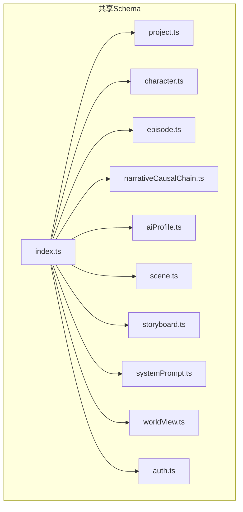
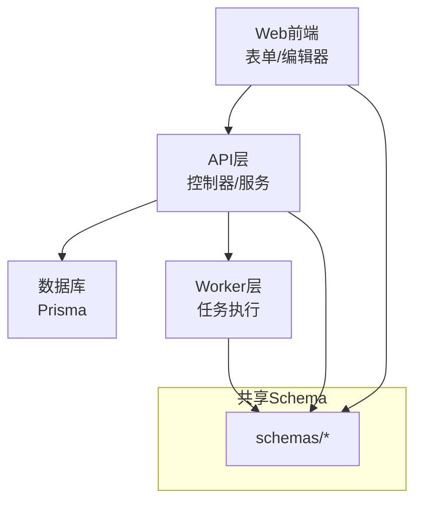
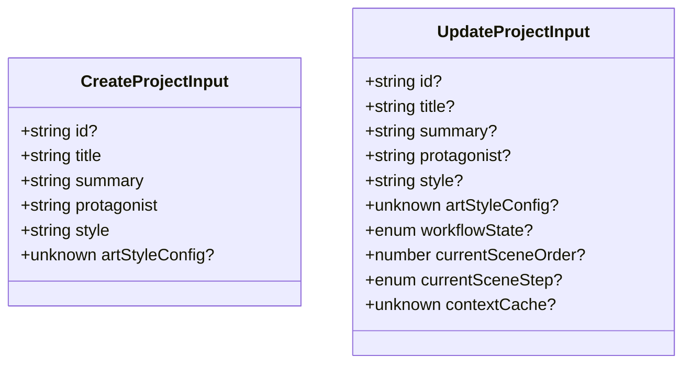
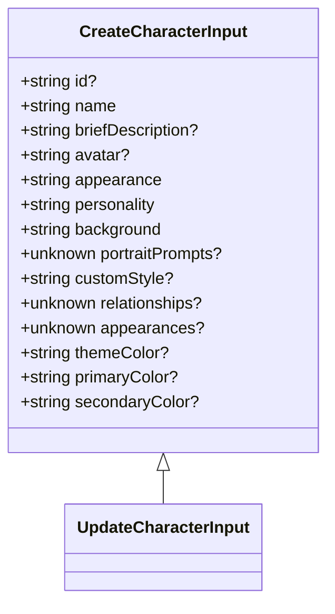
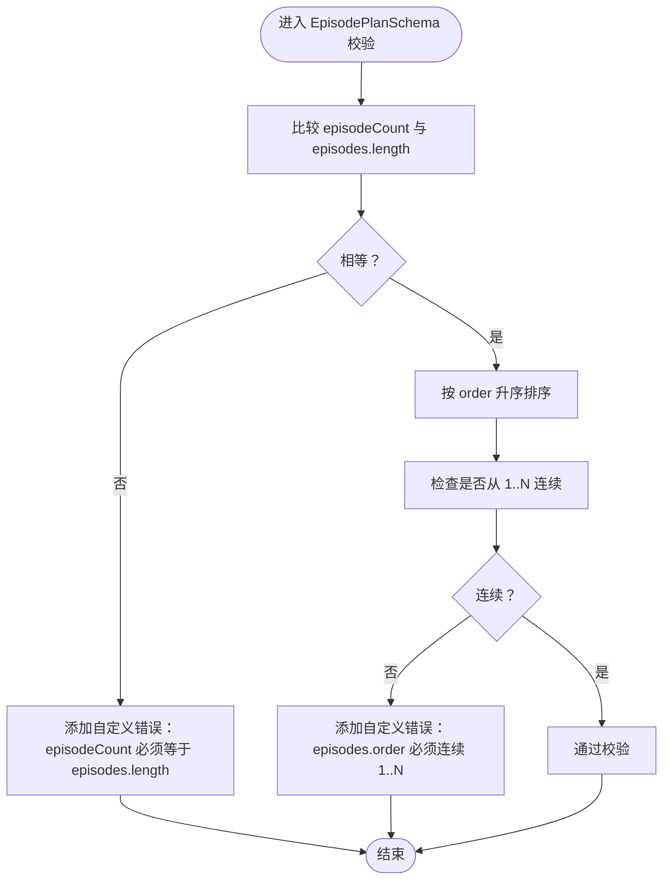
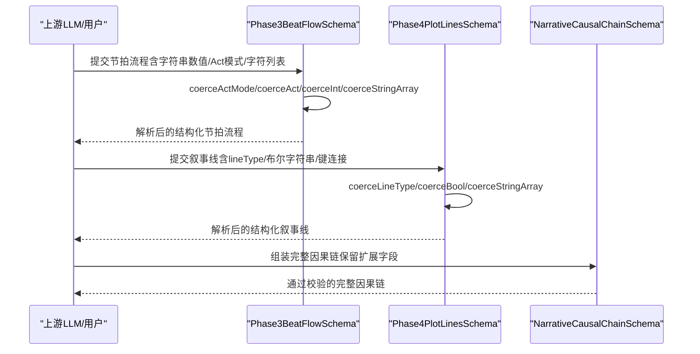
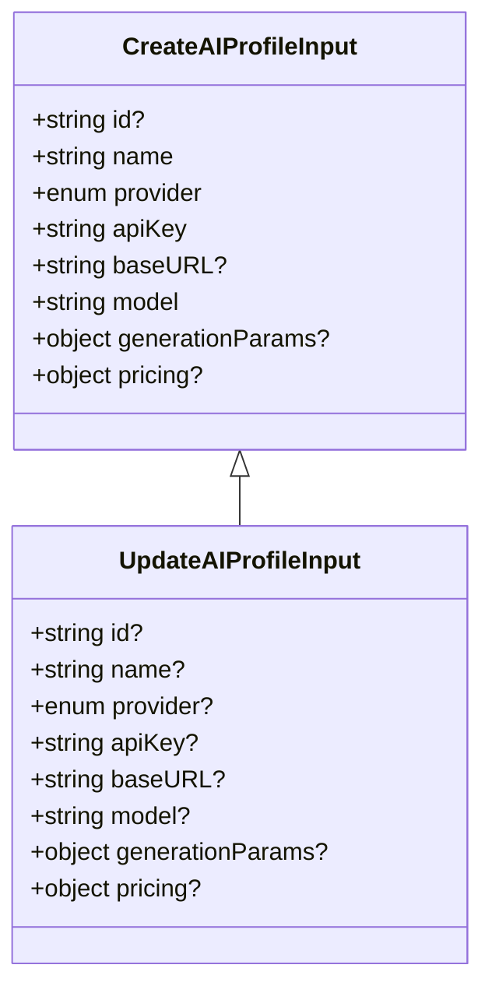
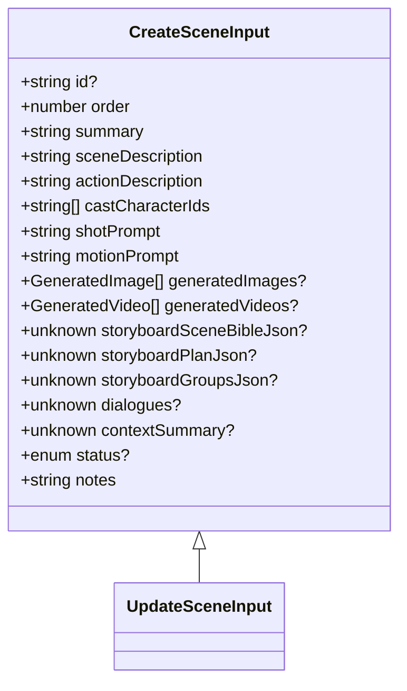
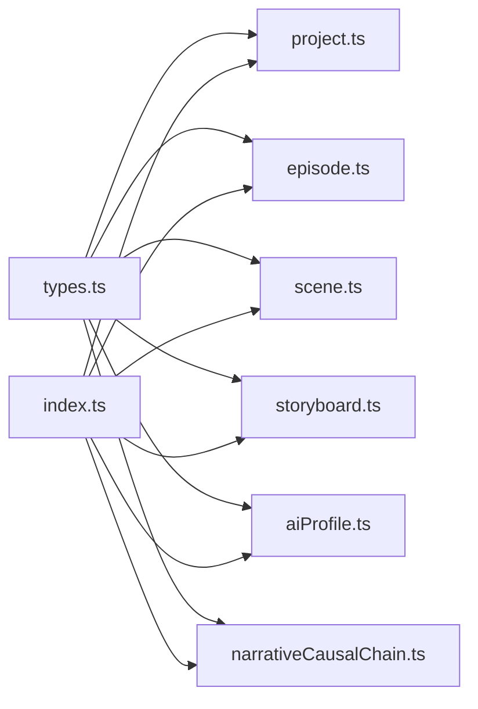

# Schema验证 (schemas/)

<cite>
**本文引用的文件**
- [packages/shared/src/schemas/index.ts](file://packages/shared/src/schemas/index.ts)
- [packages/shared/src/schemas/project.ts](file://packages/shared/src/schemas/project.ts)
- [packages/shared/src/schemas/character.ts](file://packages/shared/src/schemas/character.ts)
- [packages/shared/src/schemas/episode.ts](file://packages/shared/src/schemas/episode.ts)
- [packages/shared/src/schemas/narrativeCausalChain.ts](file://packages/shared/src/schemas/narrativeCausalChain.ts)
- [packages/shared/src/schemas/aiProfile.ts](file://packages/shared/src/schemas/aiProfile.ts)
- [packages/shared/src/schemas/scene.ts](file://packages/shared/src/schemas/scene.ts)
- [packages/shared/src/schemas/storyboard.ts](file://packages/shared/src/schemas/storyboard.ts)
- [packages/shared/src/schemas/systemPrompt.ts](file://packages/shared/src/schemas/systemPrompt.ts)
- [packages/shared/src/schemas/worldView.ts](file://packages/shared/src/schemas/worldView.ts)
- [packages/shared/src/schemas/auth.ts](file://packages/shared/src/schemas/auth.ts)
- [packages/shared/src/schemas/episode.test.ts](file://packages/shared/src/schemas/episode.test.ts)
- [packages/shared/src/schemas/narrativeCausalChain.test.ts](file://packages/shared/src/schemas/narrativeCausalChain.test.ts)
- [packages/shared/src/types.ts](file://packages/shared/src/types.ts)
</cite>

## 目录

1. [简介](#简介)
2. [项目结构](#项目结构)
3. [核心组件](#核心组件)
4. [架构总览](#架构总览)
5. [详细组件分析](#详细组件分析)
6. [依赖分析](#依赖分析)
7. [性能考虑](#性能考虑)
8. [故障排查指南](#故障排查指南)
9. [结论](#结论)
10. [附录](#附录)

## 简介

本文件面向AIXSSS共享Schema验证系统，系统基于Zod构建，覆盖项目(Project)、角色(Character)、场景(Scene)、剧集(Episode)、叙事因果链(Narrative Causal Chain)、AI配置(AI Profile)、故事板(Storyboard)与系统提示词(System Prompt)等实体的Schema定义。文档重点阐述以下方面：

- Zod Schema的设计原则与类型推断机制
- 各实体Schema的字段约束、嵌套结构、条件验证与数组/对象验证
- 数据一致性与跨端（前端/后端/Worker）验证策略
- 错误处理与调试建议
- 性能优化与最佳实践

## 项目结构

共享Schema位于packages/shared/src/schemas目录，通过index.ts统一导出，供web、api、worker三端复用。

图表来源

- [packages/shared/src/schemas/index.ts](file://packages/shared/src/schemas/index.ts#L1-L11)

章节来源

- [packages/shared/src/schemas/index.ts](file://packages/shared/src/schemas/index.ts#L1-L11)

## 核心组件

本节概述各实体Schema的核心目标与约束要点，并说明其在系统中的职责边界。

- 项目(Project)
  - 关键点：标识符正则校验、标题长度限制、摘要/主角/风格默认值、工作流状态与当前步骤字段
  - 类型推断：CreateProjectInput、UpdateProjectInput
- 角色(Character)
  - 关键点：角色名必填、头像/外貌/个性/背景默认值、关系/外观/自定义风格等可选结构
  - 类型推断：CreateCharacterInput、UpdateCharacterInput
- 剧集(Episode)
  - 关键点：序号整数、标题/摘要默认值、工作流状态、计划与核心表达的结构化Schema
  - 类型推断：CreateEpisodeInput、UpdateEpisodeInput、EpisodePlan、CoreExpression
- 叙事因果链(Narrative Causal Chain)
  - 关键点：分阶段Schema（冲突引擎、信息层+角色矩阵、节拍流程、叙事线+自洽校验）、版本号、完成阶段、passthrough保留扩展字段
  - 类型推断：Phase1~4、NarrativeCausalChain
- AI配置(AI Profile)
  - 关键点：提供商枚举、价格结构、请求参数范围、可选图像/视频模型
  - 类型推断：CreateAIProfileInput、UpdateAIProfileInput
- 场景(Scene)
  - 关键点：序号、描述/动作/分镜提示、生成资源数组、状态枚举、可选上下文缓存
  - 类型推断：CreateSceneInput、UpdateSceneInput
- 故事板(Storyboard)
  - 关键点：九宫格分组、镜头参数、连续性状态、渲染模板、状态机与版本控制
  - 类型推断：StoryboardGroup/Plan/Panel/Continuity等
- 系统提示词(System Prompt)
  - 关键点：内容长度与修剪
  - 类型推断：UpdateSystemPromptInput
- 世界观(World View)
  - 关键点：类型枚举、标题/内容默认值、顺序
  - 类型推断：CreateWorldViewElementInput、UpdateWorldViewElementInput
- 认证(Auth)
  - 关键点：注册/登录邮箱与密码约束

章节来源

- [packages/shared/src/schemas/project.ts](file://packages/shared/src/schemas/project.ts#L1-L33)
- [packages/shared/src/schemas/character.ts](file://packages/shared/src/schemas/character.ts#L1-L32)
- [packages/shared/src/schemas/episode.ts](file://packages/shared/src/schemas/episode.ts#L1-L80)
- [packages/shared/src/schemas/narrativeCausalChain.ts](file://packages/shared/src/schemas/narrativeCausalChain.ts#L1-L270)
- [packages/shared/src/schemas/aiProfile.ts](file://packages/shared/src/schemas/aiProfile.ts#L1-L51)
- [packages/shared/src/schemas/scene.ts](file://packages/shared/src/schemas/scene.ts#L1-L56)
- [packages/shared/src/schemas/storyboard.ts](file://packages/shared/src/schemas/storyboard.ts#L1-L180)
- [packages/shared/src/schemas/systemPrompt.ts](file://packages/shared/src/schemas/systemPrompt.ts#L1-L9)
- [packages/shared/src/schemas/worldView.ts](file://packages/shared/src/schemas/worldView.ts#L1-L26)
- [packages/shared/src/schemas/auth.ts](file://packages/shared/src/schemas/auth.ts#L1-L19)

## 架构总览

Schema在系统中的作用是“跨端一致的数据契约”。前端表单、API控制器、Worker任务均以相同Schema进行输入校验与类型推断，确保数据库写入与下游处理的稳定性。

## 详细组件分析

### 项目(Project) Schema

- 设计要点
  - 标识符id：长度、字符集与正则约束，可选
  - 标题/摘要/主角/风格：最小/最大长度限制，部分字段提供默认值
  - 工作流状态与当前步骤：通过枚举Schema约束
  - 更新Schema基于Partial扩展，允许部分字段更新
- 类型推断
  - CreateProjectInput、UpdateProjectInput

图表来源

- [packages/shared/src/schemas/project.ts](file://packages/shared/src/schemas/project.ts#L7-L30)

章节来源

- [packages/shared/src/schemas/project.ts](file://packages/shared/src/schemas/project.ts#L1-L33)

### 角色(Character) Schema

- 设计要点
  - 名称必填，其余如头像、外貌、个性、背景提供默认值
  - 关系/外观/自定义风格/主题色等为可选结构
  - 更新Schema基于Partial
- 类型推断
  - CreateCharacterInput、UpdateCharacterInput

图表来源

- [packages/shared/src/schemas/character.ts](file://packages/shared/src/schemas/character.ts#L3-L29)

章节来源

- [packages/shared/src/schemas/character.ts](file://packages/shared/src/schemas/character.ts#L1-L32)

### 剧集(Episode) Schema

- 设计要点
  - 基础字段：序号整数、标题/摘要默认值、工作流状态
  - 计划Episode子结构：序号、标题、简述、主要角色数组、节拍数组、场景范围、悬念等
  - EpisodePlanSchema：通过superRefine进行强约束（数量一致性与连续序号）
  - 核心表达CoreExpression：主题、情感弧（固定长度）、核心冲突、回报/视觉动机等
- 类型推断
  - CreateEpisodeInput、UpdateEpisodeInput、EpisodePlan、CoreExpression

图表来源

- [packages/shared/src/schemas/episode.ts](file://packages/shared/src/schemas/episode.ts#L38-L64)

章节来源

- [packages/shared/src/schemas/episode.ts](file://packages/shared/src/schemas/episode.ts#L1-L80)
- [packages/shared/src/schemas/episode.test.ts](file://packages/shared/src/schemas/episode.test.ts#L1-L72)

### 叙事因果链(Narrative Causal Chain) Schema

- 设计要点
  - 分阶段Schema：冲突引擎、信息层+角色矩阵、节拍流程（含Act模式/Act/字符列表等容错转换）、叙事线+自洽校验
  - 完整Schema：版本号、完成阶段、元信息、阶段数据、一致性校验
  - 容错转换：字符串到数字/布尔/枚举的预处理，数组字符串的分隔解析
  - passthrough保留扩展字段，避免后续阶段解析时被strip
- 类型推断
  - Phase1~4、NarrativeCausalChain、CAUSAL_CHAIN_PHASES

图表来源

- [packages/shared/src/schemas/narrativeCausalChain.ts](file://packages/shared/src/schemas/narrativeCausalChain.ts#L59-L91)
- [packages/shared/src/schemas/narrativeCausalChain.ts](file://packages/shared/src/schemas/narrativeCausalChain.ts#L127-L152)
- [packages/shared/src/schemas/narrativeCausalChain.ts](file://packages/shared/src/schemas/narrativeCausalChain.ts#L175-L258)

章节来源

- [packages/shared/src/schemas/narrativeCausalChain.ts](file://packages/shared/src/schemas/narrativeCausalChain.ts#L1-L270)
- [packages/shared/src/schemas/narrativeCausalChain.test.ts](file://packages/shared/src/schemas/narrativeCausalChain.test.ts#L1-L126)

### AI配置(AI Profile) Schema

- 设计要点
  - 提供商枚举、API Key、BaseURL、模型名长度限制
  - generationParams：温度、采样、最大Token、惩罚项、推理强度、图像/视频模型
  - 价格结构AIPricing：货币、提示/补全单价
  - 更新Schema允许显式清空价格配置
- 类型推断
  - CreateAIProfileInput、UpdateAIProfileInput

图表来源

- [packages/shared/src/schemas/aiProfile.ts](file://packages/shared/src/schemas/aiProfile.ts#L13-L48)

章节来源

- [packages/shared/src/schemas/aiProfile.ts](file://packages/shared/src/schemas/aiProfile.ts#L1-L51)

### 场景(Scene) Schema

- 设计要点
  - 序号整数、描述/动作/分镜提示、演员列表、生成资源（图片/视频）数组
  - 状态枚举、备注默认值、可选上下文缓存
  - 更新Schema基于Partial
- 类型推断
  - CreateSceneInput、UpdateSceneInput

图表来源

- [packages/shared/src/schemas/scene.ts](file://packages/shared/src/schemas/scene.ts#L26-L53)

章节来源

- [packages/shared/src/schemas/scene.ts](file://packages/shared/src/schemas/scene.ts#L1-L56)

### 故事板(Storyboard) Schema

- 设计要点
  - 分组ID枚举（九宫格关键帧）、相机模式、分组状态
  - 面板Schema：索引、中英文案、相机参数、翻译标记
  - 连续性状态：角色/道具状态、下一意图提示
  - 场景圣经：前提、角色关系、设定锁定、必须发生的节拍
  - 计划分组：起止连续性状态、目标英文描述
  - 渲染模板：版本号、英文提示词、渲染JSON
  - 分组最终态：包含渲染与元信息
  - Groups JSON：版本、设置、九宫格分组、运行摘要、翻译状态
- 类型推断
  - StoryboardGroup/Plan/Panel/Continuity/SceneBible/GroupsJson等

```mermaid
classDiagram
class StoryboardPanel {
+number index
+string en
+string zh?
+StoryboardPanelCamera? camera
+boolean dirtyZh?
}
class ContinuityCharacterState {
+string name
+string location
+string stance
+string facing
+string emotion
+PropsInHand props_in_hand
}
class ContinuityPropState {
+string name
+string state
+string holder?
}
class ContinuityState {
+ContinuityCharacterState[] characters
+ContinuityPropState[] props
+string next_intent_hint
}
class SceneBible {
+string scene_premise
+BibleChar[] characters
+string setting_lock
+string[] props_list
+string[] must_happen_beats
}
class StoryboardPlanGroup {
+enum group_id
+string shot_range
+string goal_en
+ContinuityState? start_state
+ContinuityState? end_state
}
class StoryboardGroupDraft {
+enum group_id
+string shot_range
+StoryboardPanel[] panels
+ContinuityState end_state
}
class StoryboardGroupRender {
+number template_version
+string prompt_en
+unknown render_json
}
class StoryboardGroup {
+enum group_id
+string shot_range
+StoryboardPanel[] panels
+ContinuityState end_state
+StoryboardGroupRender render
+Meta? meta
}
class StoryboardGroupsJson {
+number version
+Settings settings
+GroupItem[] groups
+string running_summary?
+Translation? translation
}
```

图表来源

- [packages/shared/src/schemas/storyboard.ts](file://packages/shared/src/schemas/storyboard.ts#L23-L178)

章节来源

- [packages/shared/src/schemas/storyboard.ts](file://packages/shared/src/schemas/storyboard.ts#L1-L180)

### 系统提示词(System Prompt) Schema

- 设计要点
  - 内容修剪与长度限制
- 类型推断
  - UpdateSystemPromptInput

章节来源

- [packages/shared/src/schemas/systemPrompt.ts](file://packages/shared/src/schemas/systemPrompt.ts#L1-L9)

### 世界观(World View) Schema

- 设计要点
  - 类型枚举、标题/内容默认值、顺序
  - 更新Schema基于Partial
- 类型推断
  - CreateWorldViewElementInput、UpdateWorldViewElementInput

章节来源

- [packages/shared/src/schemas/worldView.ts](file://packages/shared/src/schemas/worldView.ts#L1-L26)

### 认证(Auth) Schema

- 设计要点
  - 注册：邮箱、密码长度、团队名可选
  - 登录：邮箱、密码长度
- 类型推断
  - RegisterInput、LoginInput

章节来源

- [packages/shared/src/schemas/auth.ts](file://packages/shared/src/schemas/auth.ts#L1-L19)

## 依赖分析

- 枚举与常量来源
  - PROVIDER_TYPES、WORKFLOW_STATES、EPISODE_WORKFLOW_STATES、SCENE_STEPS、SCENE_STATUSES、GENERATED_IMAGE_KEYFRAMES、TEAM_ROLES
- 跨模块耦合
  - Episode/Scene/Storyboard等Schema依赖types.ts中的枚举与常量
  - NarrativeCausalChainSchema依赖passthrough保留扩展字段，便于后续阶段增量演进
- 导出聚合
  - index.ts统一导出，便于上层模块按需引入

图表来源

- [packages/shared/src/types.ts](file://packages/shared/src/types.ts#L1-L77)
- [packages/shared/src/schemas/index.ts](file://packages/shared/src/schemas/index.ts#L1-L11)

章节来源

- [packages/shared/src/types.ts](file://packages/shared/src/types.ts#L1-L77)
- [packages/shared/src/schemas/index.ts](file://packages/shared/src/schemas/index.ts#L1-L11)

## 性能考虑

- 预处理与容错
  - 使用z.preprocess将字符串转换为数字/枚举/布尔，减少后续校验分支与重复判断
  - 数组字符串按多种分隔符拆分，提升输入灵活性
- 结构化与扩展
  - 大多数Schema采用passthrough，避免strip导致的字段丢失，降低重跑与回填成本
- 默认值与可选
  - 合理使用default与optional，减少空值分支与冗余校验
- 测试驱动
  - 通过单元测试覆盖异常路径（如episodeCount不匹配、节拍序号不连续、情感弧长度不符），提前暴露问题

## 故障排查指南

- 常见错误定位
  - Episode计划：episodeCount与episodes长度不一致、order非连续1..N
  - 核心表达：情感弧长度不符合要求
  - 叙事因果链：Act模式/Act/escalation/estimatedScenes等字符串到数值的转换失败
  - 叙事线：lineType映射失败或布尔字符串未正确转换
- 调试建议
  - 在superRefine中添加明确的path与message，便于定位字段
  - 对复杂字段（如数组字符串）增加前置日志，确认分隔与过滤结果
  - 使用passthrough保留扩展字段，逐步验证后续阶段解析

章节来源

- [packages/shared/src/schemas/episode.test.ts](file://packages/shared/src/schemas/episode.test.ts#L34-L70)
- [packages/shared/src/schemas/narrativeCausalChain.test.ts](file://packages/shared/src/schemas/narrativeCausalChain.test.ts#L10-L71)

## 结论

AIXSSS的共享Schema体系以Zod为核心，围绕创作工作流的关键实体建立了严谨、可扩展且跨端一致的数据契约。通过分阶段Schema、容错预处理、passthrough扩展与完善的测试，系统在保障数据完整性的同时，兼顾了AI生成内容的不确定性与迭代演进需求。建议在新增实体或字段时，遵循现有模式：明确约束、提供默认值、保留扩展、配套测试与类型推断。

## 附录

- 使用示例与最佳实践
  - 输入校验：在API入口与Worker任务入口均使用对应Schema.parse或safeParse
  - 错误处理：结合Zod错误结构与HTTP状态码返回清晰的错误信息
  - 类型安全：优先使用z.infer导出的类型，避免手写重复类型定义
  - 迁移与版本：利用版本号与阶段性Schema，平滑推进数据结构演进
