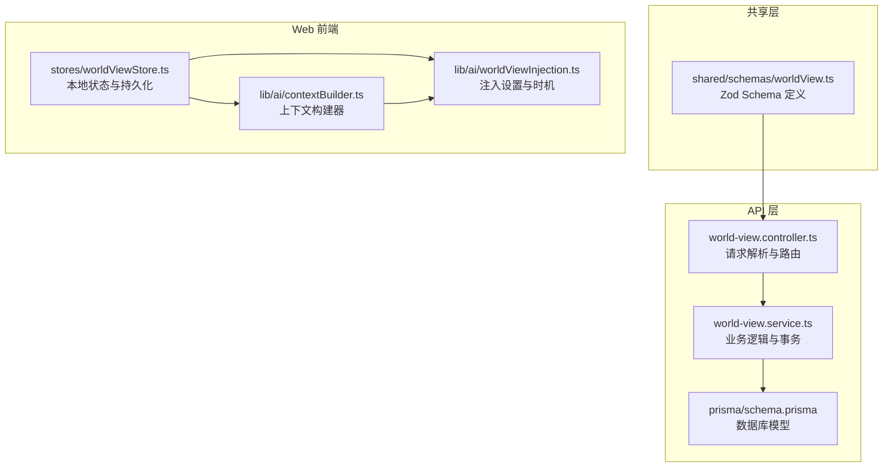
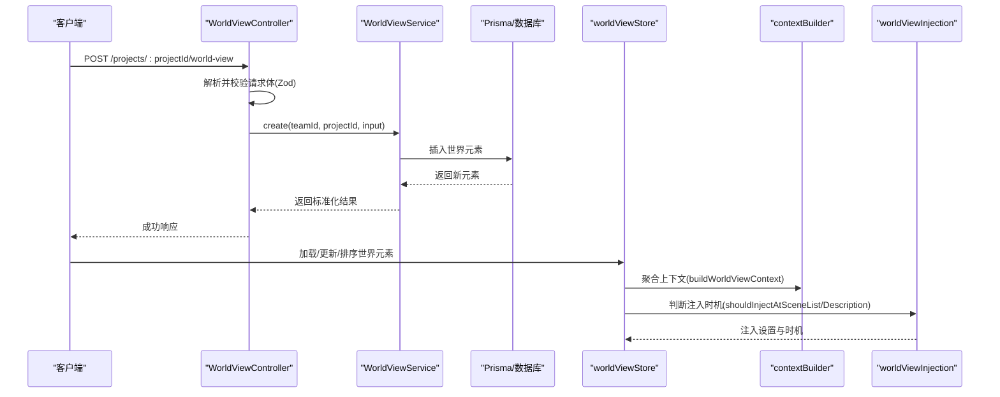
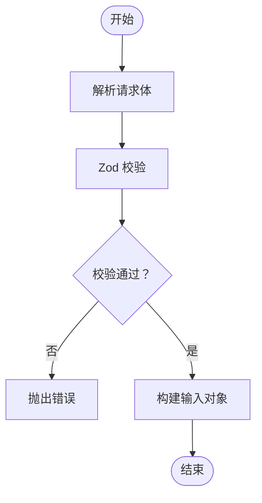
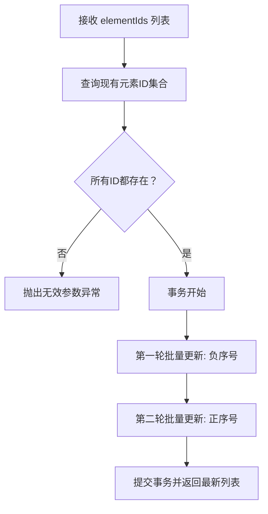
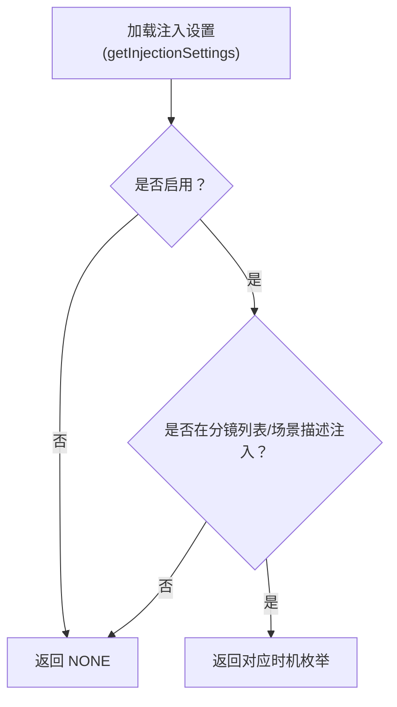
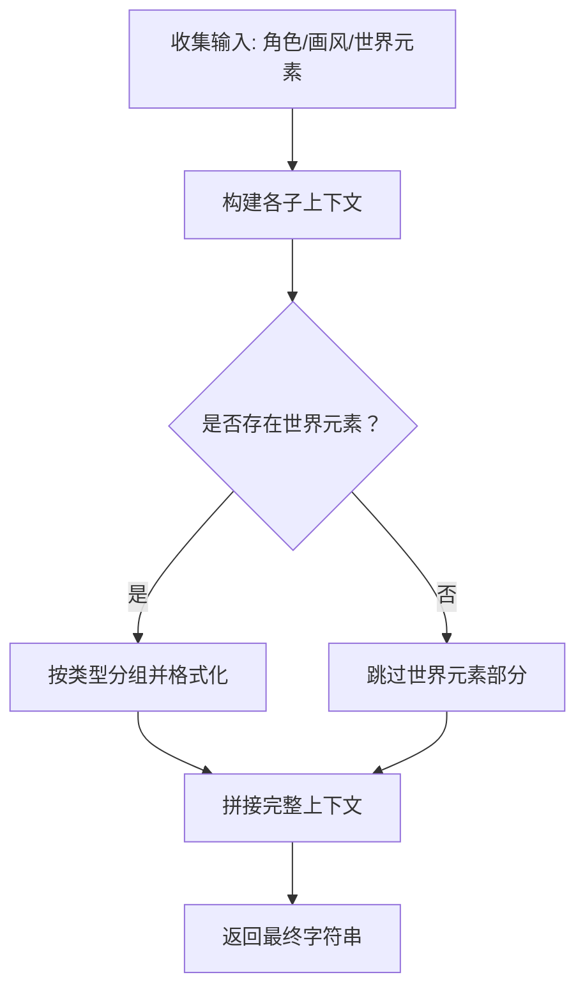
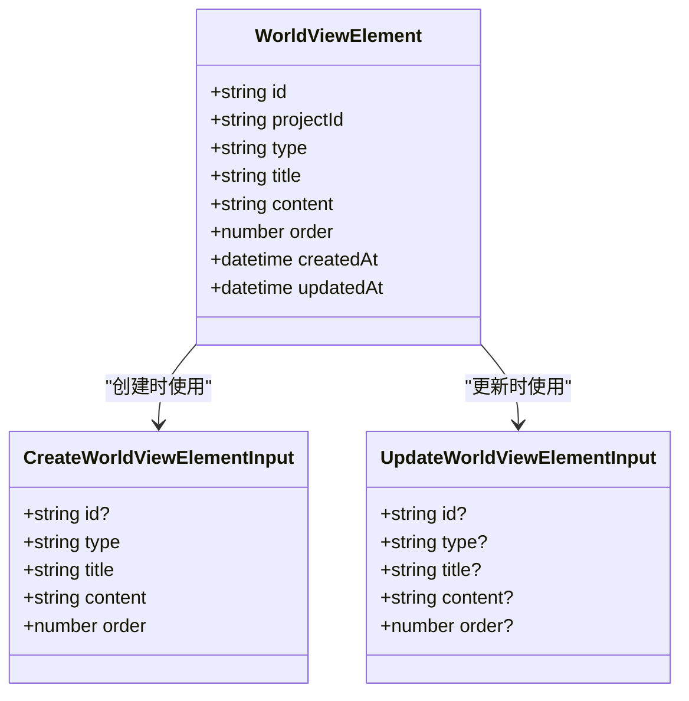
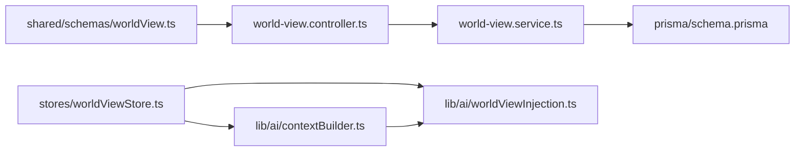

# 世界观Schema（World View Schema）

<cite>
**本文档引用的文件**
- [packages/shared/src/schemas/worldView.ts](file://packages/shared/src/schemas/worldView.ts)
- [apps/api/src/world-view/world-view.controller.ts](file://apps/api/src/world-view/world-view.controller.ts)
- [apps/api/src/world-view/world-view.service.ts](file://apps/api/src/world-view/world-view.service.ts)
- [apps/api/prisma/schema.prisma](file://apps/api/prisma/schema.prisma)
- [apps/web/src/lib/ai/worldViewInjection.ts](file://apps/web/src/lib/ai/worldViewInjection.ts)
- [apps/web/src/lib/ai/contextBuilder.ts](file://apps/web/src/lib/ai/contextBuilder.ts)
- [apps/web/src/stores/worldViewStore.ts](file://apps/web/src/stores/worldViewStore.ts)
- [apps/web/src/lib/ai/worldViewInjection.test.ts](file://apps/web/src/lib/ai/worldViewInjection.test.ts)
- [apps/web/src/lib/ai/contextBuilder.test.ts](file://apps/web/src/lib/ai/contextBuilder.test.ts)
- [apps/web/src/stores/worldViewStore.test.ts](file://apps/web/src/stores/worldViewStore.test.ts)
</cite>

## 目录

1. [简介](#简介)
2. [项目结构](#项目结构)
3. [核心组件](#核心组件)
4. [架构总览](#架构总览)
5. [详细组件分析](#详细组件分析)
6. [依赖关系分析](#依赖关系分析)
7. [性能考虑](#性能考虑)
8. [故障排除指南](#故障排除指南)
9. [结论](#结论)
10. [附录](#附录)

## 简介

本文件系统性地梳理了“世界观Schema”的设计与实现，涵盖Zod Schema验证规则、世界元素验证、关系映射验证、上下文注入验证等关键逻辑，并深入解释了层级结构验证、元素关联验证、内容完整性验证、复杂关系验证、循环引用检测与数据一致性检查等技术实现。文档还提供了世界观构建、元素管理、上下文注入的完整验证示例，以及数据结构优化策略，帮助开发者快速理解并高效扩展该能力。

## 项目结构

该功能横跨共享层（Shared）、API层（NestJS）、Web前端（React + Zustand）与Worker任务层，形成“Schema定义—控制器—服务—存储—前端状态—上下文构建—注入设置”的完整闭环。

图表来源

- [packages/shared/src/schemas/worldView.ts](file://packages/shared/src/schemas/worldView.ts#L1-L26)
- [apps/api/src/world-view/world-view.controller.ts](file://apps/api/src/world-view/world-view.controller.ts#L1-L58)
- [apps/api/src/world-view/world-view.service.ts](file://apps/api/src/world-view/world-view.service.ts#L1-L129)
- [apps/api/prisma/schema.prisma](file://apps/api/prisma/schema.prisma#L259-L273)
- [apps/web/src/stores/worldViewStore.ts](file://apps/web/src/stores/worldViewStore.ts#L1-L211)
- [apps/web/src/lib/ai/contextBuilder.ts](file://apps/web/src/lib/ai/contextBuilder.ts#L1-L435)
- [apps/web/src/lib/ai/worldViewInjection.ts](file://apps/web/src/lib/ai/worldViewInjection.ts#L1-L192)

章节来源

- [packages/shared/src/schemas/worldView.ts](file://packages/shared/src/schemas/worldView.ts#L1-L26)
- [apps/api/src/world-view/world-view.controller.ts](file://apps/api/src/world-view/world-view.controller.ts#L1-L58)
- [apps/api/src/world-view/world-view.service.ts](file://apps/api/src/world-view/world-view.service.ts#L1-L129)
- [apps/api/prisma/schema.prisma](file://apps/api/prisma/schema.prisma#L259-L273)
- [apps/web/src/stores/worldViewStore.ts](file://apps/web/src/stores/worldViewStore.ts#L1-L211)
- [apps/web/src/lib/ai/contextBuilder.ts](file://apps/web/src/lib/ai/contextBuilder.ts#L1-L435)
- [apps/web/src/lib/ai/worldViewInjection.ts](file://apps/web/src/lib/ai/worldViewInjection.ts#L1-L192)

## 核心组件

- Zod Schema 定义：统一定义世界元素输入/更新的字段约束与类型安全。
- 控制器：负责请求体解析与参数校验，调用服务层。
- 服务层：执行业务逻辑、事务处理、唯一性与顺序约束校验。
- 数据库模型：定义世界元素的持久化结构与索引。
- 前端状态：提供本地/远程双模式存储、元素增删改查、排序与上下文聚合。
- 上下文构建器：将世界元素、角色、画风等信息格式化为可注入的上下文。
- 注入设置：控制在哪些时机注入世界元素上下文。

章节来源

- [packages/shared/src/schemas/worldView.ts](file://packages/shared/src/schemas/worldView.ts#L1-L26)
- [apps/api/src/world-view/world-view.controller.ts](file://apps/api/src/world-view/world-view.controller.ts#L1-L58)
- [apps/api/src/world-view/world-view.service.ts](file://apps/api/src/world-view/world-view.service.ts#L1-L129)
- [apps/api/prisma/schema.prisma](file://apps/api/prisma/schema.prisma#L259-L273)
- [apps/web/src/stores/worldViewStore.ts](file://apps/web/src/stores/worldViewStore.ts#L1-L211)
- [apps/web/src/lib/ai/contextBuilder.ts](file://apps/web/src/lib/ai/contextBuilder.ts#L1-L435)
- [apps/web/src/lib/ai/worldViewInjection.ts](file://apps/web/src/lib/ai/worldViewInjection.ts#L1-L192)

## 架构总览

下面以序列图展示从API到前端的完整流程：请求进入控制器，经Zod解析后交由服务层执行业务逻辑，服务层通过事务保证顺序一致性；前端通过状态管理器维护本地/远程数据，并在合适时机注入上下文。

图表来源

- [apps/api/src/world-view/world-view.controller.ts](file://apps/api/src/world-view/world-view.controller.ts#L19-L54)
- [apps/api/src/world-view/world-view.service.ts](file://apps/api/src/world-view/world-view.service.ts#L44-L90)
- [apps/api/prisma/schema.prisma](file://apps/api/prisma/schema.prisma#L259-L273)
- [apps/web/src/stores/worldViewStore.ts](file://apps/web/src/stores/worldViewStore.ts#L55-L151)
- [apps/web/src/lib/ai/contextBuilder.ts](file://apps/web/src/lib/ai/contextBuilder.ts#L227-L270)
- [apps/web/src/lib/ai/worldViewInjection.ts](file://apps/web/src/lib/ai/worldViewInjection.ts#L108-L126)

## 详细组件分析

### Zod Schema 设计与验证规则

- 字段约束
  - id：可选，长度1-160，正则匹配字母数字、下划线、连字符。
  - type：枚举，限定为 era/geography/society/technology/magic/custom。
  - title：必填，长度1-120。
  - content：可选，默认空字符串，最大长度12000。
  - order：必填，非负整数。
- 输入/更新Schema
  - 创建Schema为完整对象；更新Schema基于创建Schema的部分化，允许逐项更新。
- 类型推导
  - 通过Zod的infer生成TypeScript类型，确保前后端类型一致。

图表来源

- [packages/shared/src/schemas/worldView.ts](file://packages/shared/src/schemas/worldView.ts#L6-L21)

章节来源

- [packages/shared/src/schemas/worldView.ts](file://packages/shared/src/schemas/worldView.ts#L1-L26)

### 世界元素验证与层级结构

- 层级结构验证
  - 通过order字段维护层级顺序，数据库层面以(项目ID, order)建立唯一索引，保证同一项目内顺序唯一。
- 内容完整性验证
  - title/content的长度与默认值约束，确保内容可被AI消费且不会出现空缺。
- 关联验证
  - 控制器与服务层均通过项目ID与团队ID进行访问控制，防止越权访问。
  - 排序接口在事务中分两阶段更新，避免交换顺序时违反唯一约束。

图表来源

- [apps/api/src/world-view/world-view.controller.ts](file://apps/api/src/world-view/world-view.controller.ts#L10-L12)
- [apps/api/src/world-view/world-view.service.ts](file://apps/api/src/world-view/world-view.service.ts#L92-L126)

章节来源

- [apps/api/src/world-view/world-view.controller.ts](file://apps/api/src/world-view/world-view.controller.ts#L1-L58)
- [apps/api/src/world-view/world-view.service.ts](file://apps/api/src/world-view/world-view.service.ts#L1-L129)
- [apps/api/prisma/schema.prisma](file://apps/api/prisma/schema.prisma#L259-L273)

### 上下文注入验证与时机控制

- 注入设置
  - 支持四种注入时机：仅分镜列表、仅场景描述、两者皆注入、不注入。
  - 提供默认设置与持久化（localStorage），合并默认值以兼容字段演进。
- 注入时机判断
  - 提供布尔函数判断在指定时机是否注入，便于在不同工作流节点选择性注入。
- 前端集成
  - store提供按类型分组与上下文拼接方法，便于在生成场景/角色等环节直接使用。

图表来源

- [apps/web/src/lib/ai/worldViewInjection.ts](file://apps/web/src/lib/ai/worldViewInjection.ts#L66-L81)
- [apps/web/src/lib/ai/worldViewInjection.ts](file://apps/web/src/lib/ai/worldViewInjection.ts#L133-L166)
- [apps/web/src/lib/ai/worldViewInjection.ts](file://apps/web/src/lib/ai/worldViewInjection.ts#L173-L191)

章节来源

- [apps/web/src/lib/ai/worldViewInjection.ts](file://apps/web/src/lib/ai/worldViewInjection.ts#L1-L192)
- [apps/web/src/stores/worldViewStore.ts](file://apps/web/src/stores/worldViewStore.ts#L174-L201)

### 上下文构建与数据一致性

- 上下文构建器
  - 支持角色、画风、世界元素三类上下文的独立构建与整合。
  - 世界元素上下文按类型分组，统一格式化输出，便于AI理解。
- 数据一致性
  - 前端store在本地/远程模式间切换时，保证元素ID、时间戳、排序等字段的一致性。
  - 排序操作在本地与远程均重算order，避免顺序错乱。

图表来源

- [apps/web/src/lib/ai/contextBuilder.ts](file://apps/web/src/lib/ai/contextBuilder.ts#L227-L270)
- [apps/web/src/lib/ai/contextBuilder.ts](file://apps/web/src/lib/ai/contextBuilder.ts#L276-L304)

章节来源

- [apps/web/src/lib/ai/contextBuilder.ts](file://apps/web/src/lib/ai/contextBuilder.ts#L1-L435)
- [apps/web/src/stores/worldViewStore.ts](file://apps/web/src/stores/worldViewStore.ts#L1-L211)

### 元素管理与复杂关系验证

- 元素管理
  - 支持增删改查、排序、按类型分组与上下文聚合。
  - 本地模式使用localStorage，远程模式调用API，保证离线可用与在线同步。
- 复杂关系验证
  - 世界元素本身为扁平结构，不涉及跨元素关系映射；若需引入关系，可在扩展Schema中增加关系字段并配套Zod校验。
  - 循环引用检测：当前Schema未定义跨元素引用，无需循环检测；若引入引用字段，建议在服务层进行DFS检测并在事务中回滚。

图表来源

- [apps/api/prisma/schema.prisma](file://apps/api/prisma/schema.prisma#L259-L273)
- [packages/shared/src/schemas/worldView.ts](file://packages/shared/src/schemas/worldView.ts#L6-L21)

章节来源

- [apps/api/prisma/schema.prisma](file://apps/api/prisma/schema.prisma#L259-L273)
- [apps/web/src/stores/worldViewStore.ts](file://apps/web/src/stores/worldViewStore.ts#L79-L151)
- [packages/shared/src/schemas/worldView.ts](file://packages/shared/src/schemas/worldView.ts#L1-L26)

### 验证示例与最佳实践

- 创建世界元素
  - 控制器使用Zod Schema解析请求体，失败即抛出错误。
  - 服务层插入数据库并返回标准化结果。
- 更新世界元素
  - 仅对传入字段进行条件更新，避免覆盖未变更字段。
- 排序
  - 两阶段事务更新，避免唯一约束冲突。
- 上下文注入
  - 根据注入设置在合适时机拼接世界元素上下文，提升生成质量与一致性。

章节来源

- [apps/api/src/world-view/world-view.controller.ts](file://apps/api/src/world-view/world-view.controller.ts#L24-L44)
- [apps/api/src/world-view/world-view.service.ts](file://apps/api/src/world-view/world-view.service.ts#L44-L90)
- [apps/web/src/lib/ai/worldViewInjection.ts](file://apps/web/src/lib/ai/worldViewInjection.ts#L108-L126)
- [apps/web/src/lib/ai/contextBuilder.ts](file://apps/web/src/lib/ai/contextBuilder.ts#L227-L270)

## 依赖关系分析

- 前后端依赖
  - shared层提供Schema，API层与Web前端共同依赖，确保类型一致。
- 控制器-服务-模型
  - 控制器依赖Zod Schema与服务层；服务层依赖Prisma模型与事务；模型定义唯一索引与外键关系。
- 前端依赖
  - store依赖API封装与本地存储；contextBuilder与worldViewInjection提供注入能力。

图表来源

- [packages/shared/src/schemas/worldView.ts](file://packages/shared/src/schemas/worldView.ts#L1-L26)
- [apps/api/src/world-view/world-view.controller.ts](file://apps/api/src/world-view/world-view.controller.ts#L1-L58)
- [apps/api/src/world-view/world-view.service.ts](file://apps/api/src/world-view/world-view.service.ts#L1-L129)
- [apps/api/prisma/schema.prisma](file://apps/api/prisma/schema.prisma#L259-L273)
- [apps/web/src/stores/worldViewStore.ts](file://apps/web/src/stores/worldViewStore.ts#L1-L211)
- [apps/web/src/lib/ai/contextBuilder.ts](file://apps/web/src/lib/ai/contextBuilder.ts#L1-L435)
- [apps/web/src/lib/ai/worldViewInjection.ts](file://apps/web/src/lib/ai/worldViewInjection.ts#L1-L192)

章节来源

- [packages/shared/src/schemas/worldView.ts](file://packages/shared/src/schemas/worldView.ts#L1-L26)
- [apps/api/src/world-view/world-view.controller.ts](file://apps/api/src/world-view/world-view.controller.ts#L1-L58)
- [apps/api/src/world-view/world-view.service.ts](file://apps/api/src/world-view/world-view.service.ts#L1-L129)
- [apps/api/prisma/schema.prisma](file://apps/api/prisma/schema.prisma#L259-L273)
- [apps/web/src/stores/worldViewStore.ts](file://apps/web/src/stores/worldViewStore.ts#L1-L211)
- [apps/web/src/lib/ai/contextBuilder.ts](file://apps/web/src/lib/ai/contextBuilder.ts#L1-L435)
- [apps/web/src/lib/ai/worldViewInjection.ts](file://apps/web/src/lib/ai/worldViewInjection.ts#L1-L192)

## 性能考虑

- 数据库索引
  - (projectId, order) 唯一索引保障顺序唯一性，查询与排序效率高。
- 事务批处理
  - 排序采用两阶段更新，减少锁竞争与唯一约束冲突。
- 前端缓存
  - 本地模式使用localStorage，降低网络开销；远程模式异步更新，避免阻塞UI。
- 上下文长度控制
  - 上下文构建器支持长度截断，避免超长上下文导致LLM处理失败。

[本节为通用指导，无需具体文件引用]

## 故障排除指南

- 请求体解析失败
  - 检查Zod Schema字段是否满足约束；控制器会抛出错误，前端应提示用户修正。
- 项目/元素不存在
  - 服务层在访问控制与存在性检查失败时抛出异常；前端应捕获并引导用户检查权限或ID。
- 排序异常
  - 确认elementIds均为当前项目元素ID；若包含非法ID，将触发参数异常。
- 注入设置异常
  - 检查localStorage写入权限；注入设置默认值合并逻辑可避免字段缺失。

章节来源

- [apps/api/src/world-view/world-view.controller.ts](file://apps/api/src/world-view/world-view.controller.ts#L24-L44)
- [apps/api/src/world-view/world-view.service.ts](file://apps/api/src/world-view/world-view.service.ts#L27-L33)
- [apps/web/src/lib/ai/worldViewInjection.test.ts](file://apps/web/src/lib/ai/worldViewInjection.test.ts#L67-L71)
- [apps/web/src/lib/ai/worldViewInjection.test.ts](file://apps/web/src/lib/ai/worldViewInjection.test.ts#L110-L121)

## 结论

该世界观Schema通过Zod实现严格的输入验证，结合API层的事务与数据库唯一索引，确保了数据一致性与顺序稳定性；前端通过store与上下文构建器实现了灵活的元素管理与注入控制。整体架构清晰、职责分离明确，具备良好的扩展性与可维护性。未来可在Schema中引入关系字段与循环检测，并在服务层完善复杂关系的校验与事务回滚策略。

[本节为总结性内容，无需具体文件引用]

## 附录

### 数据模型与字段说明

- WorldViewElement
  - id：元素唯一标识
  - projectId：所属项目
  - type：元素类型（era/geography/society/technology/magic/custom）
  - title：标题
  - content：内容
  - order：排序序号
  - createdAt/updatedAt：时间戳

章节来源

- [apps/api/prisma/schema.prisma](file://apps/api/prisma/schema.prisma#L259-L273)

### 验证规则速览

- 字段长度与格式
  - id：1-160，字母数字、下划线、连字符
  - title：1-120
  - content：0-12000，默认空字符串
  - order：非负整数
- 类型约束
  - type为枚举限定值

章节来源

- [packages/shared/src/schemas/worldView.ts](file://packages/shared/src/schemas/worldView.ts#L6-L17)

### 测试要点

- 注入设置默认值与持久化
- 注入时机判断逻辑
- 上下文构建与模板填充
- store的增删改查与排序一致性

章节来源

- [apps/web/src/lib/ai/worldViewInjection.test.ts](file://apps/web/src/lib/ai/worldViewInjection.test.ts#L23-L46)
- [apps/web/src/lib/ai/contextBuilder.test.ts](file://apps/web/src/lib/ai/contextBuilder.test.ts#L153-L173)
- [apps/web/src/stores/worldViewStore.test.ts](file://apps/web/src/stores/worldViewStore.test.ts#L367-L400)
