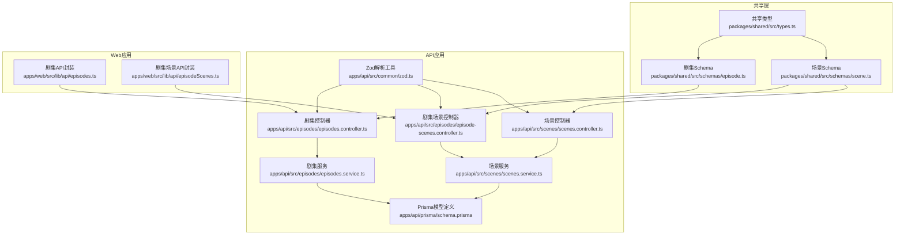
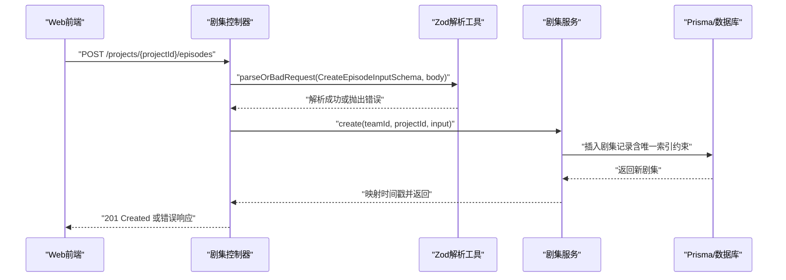
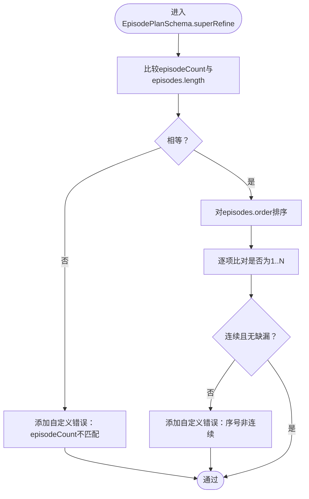
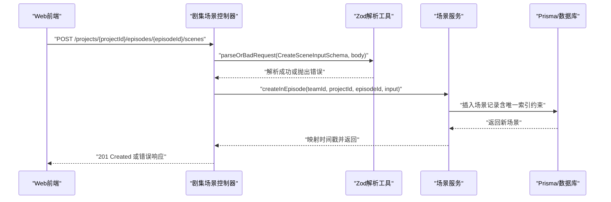
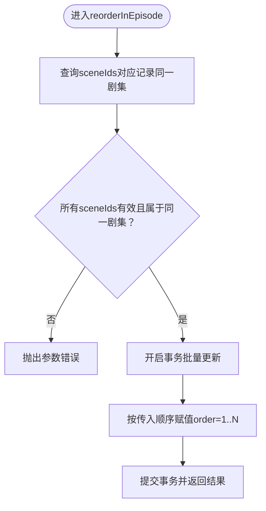
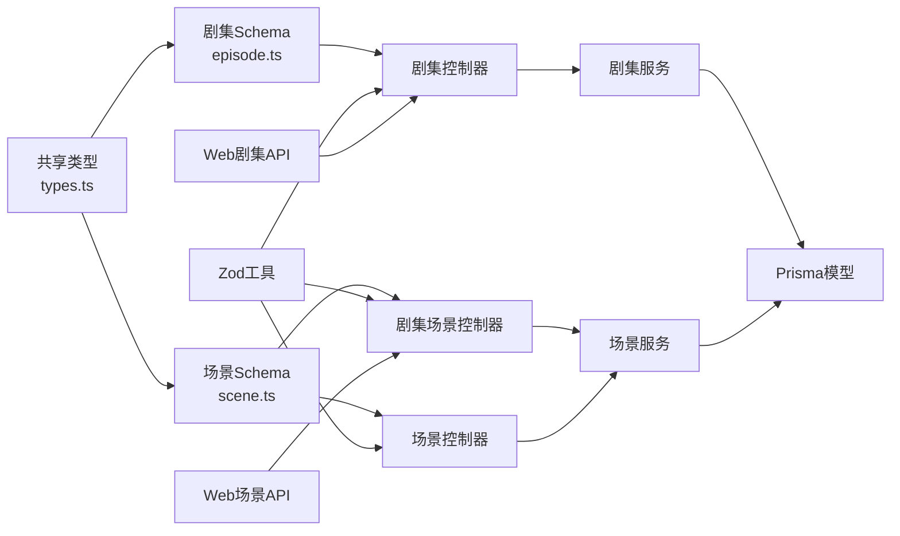

# 剧集Schema（Episode Schema）

<cite>
**本文引用的文件**
- [packages/shared/src/schemas/episode.ts](file://packages/shared/src/schemas/episode.ts)
- [packages/shared/src/schemas/scene.ts](file://packages/shared/src/schemas/scene.ts)
- [apps/api/src/common/zod.ts](file://apps/api/src/common/zod.ts)
- [apps/api/src/episodes/episodes.controller.ts](file://apps/api/src/episodes/episodes.controller.ts)
- [apps/api/src/episodes/episodes.service.ts](file://apps/api/src/episodes/episodes.service.ts)
- [apps/api/src/episodes/episode-scenes.controller.ts](file://apps/api/src/episodes/episode-scenes.controller.ts)
- [apps/api/src/scenes/scenes.controller.ts](file://apps/api/src/scenes/scenes.controller.ts)
- [apps/api/src/scenes/scenes.service.ts](file://apps/api/src/scenes/scenes.service.ts)
- [apps/api/prisma/schema.prisma](file://apps/api/prisma/schema.prisma)
- [packages/shared/src/types.ts](file://packages/shared/src/types.ts)
- [apps/web/src/lib/api/episodes.ts](file://apps/web/src/lib/api/episodes.ts)
- [apps/web/src/lib/api/episodeScenes.ts](file://apps/web/src/lib/api/episodeScenes.ts)
- [packages/shared/src/schemas/episode.test.ts](file://packages/shared/src/schemas/episode.test.ts)
</cite>

## 目录

1. [引言](#引言)
2. [项目结构](#项目结构)
3. [核心组件](#核心组件)
4. [架构总览](#架构总览)
5. [详细组件分析](#详细组件分析)
6. [依赖关系分析](#依赖关系分析)
7. [性能考量](#性能考量)
8. [故障排查指南](#故障排查指南)
9. [结论](#结论)
10. [附录](#附录)

## 引言

本技术文档围绕“剧集Schema”展开，系统性说明Zod Schema在后端与共享包中的设计与落地，覆盖以下关键点：

- 剧集实体的字段验证规则：剧集编号、标题、描述、场景列表、创作状态等
- 剧集与场景的关联验证、场景顺序验证、剧集状态流转验证
- 数组字段与嵌套对象的复杂验证、条件验证的实现方式
- 剧集创建、场景编排、完成状态管理的完整验证示例
- 数据一致性保障机制（Prisma唯一索引、服务层断言、事务重排）

## 项目结构

本项目采用多包与多应用的分层组织：

- 共享包（packages/shared）：存放跨前端、API、Worker共享的Schema与类型定义
- API应用（apps/api）：提供REST接口、业务服务、数据库交互
- Web应用（apps/web）：前端调用API，进行用户交互与数据展示
- Worker应用（apps/worker）：异步任务执行，与API协作完成生成与处理

图表来源

- [packages/shared/src/schemas/episode.ts](file://packages/shared/src/schemas/episode.ts#L1-L80)
- [packages/shared/src/schemas/scene.ts](file://packages/shared/src/schemas/scene.ts#L1-L56)
- [apps/api/src/episodes/episodes.controller.ts](file://apps/api/src/episodes/episodes.controller.ts#L1-L55)
- [apps/api/src/episodes/episodes.service.ts](file://apps/api/src/episodes/episodes.service.ts#L1-L146)
- [apps/api/src/episodes/episode-scenes.controller.ts](file://apps/api/src/episodes/episode-scenes.controller.ts#L1-L83)
- [apps/api/src/scenes/scenes.controller.ts](file://apps/api/src/scenes/scenes.controller.ts#L1-L67)
- [apps/api/src/scenes/scenes.service.ts](file://apps/api/src/scenes/scenes.service.ts#L1-L365)
- [apps/api/prisma/schema.prisma](file://apps/api/prisma/schema.prisma#L176-L233)
- [apps/api/src/common/zod.ts](file://apps/api/src/common/zod.ts#L1-L16)
- [apps/web/src/lib/api/episodes.ts](file://apps/web/src/lib/api/episodes.ts#L1-L63)
- [apps/web/src/lib/api/episodeScenes.ts](file://apps/web/src/lib/api/episodeScenes.ts#L1-L95)

章节来源

- [packages/shared/src/schemas/episode.ts](file://packages/shared/src/schemas/episode.ts#L1-L80)
- [packages/shared/src/schemas/scene.ts](file://packages/shared/src/schemas/scene.ts#L1-L56)
- [apps/api/src/episodes/episodes.controller.ts](file://apps/api/src/episodes/episodes.controller.ts#L1-L55)
- [apps/api/src/episodes/episodes.service.ts](file://apps/api/src/episodes/episodes.service.ts#L1-L146)
- [apps/api/src/episodes/episode-scenes.controller.ts](file://apps/api/src/episodes/episode-scenes.controller.ts#L1-L83)
- [apps/api/src/scenes/scenes.controller.ts](file://apps/api/src/scenes/scenes.controller.ts#L1-L67)
- [apps/api/src/scenes/scenes.service.ts](file://apps/api/src/scenes/scenes.service.ts#L1-L365)
- [apps/api/prisma/schema.prisma](file://apps/api/prisma/schema.prisma#L176-L233)
- [apps/api/src/common/zod.ts](file://apps/api/src/common/zod.ts#L1-L16)
- [apps/web/src/lib/api/episodes.ts](file://apps/web/src/lib/api/episodes.ts#L1-L63)
- [apps/web/src/lib/api/episodeScenes.ts](file://apps/web/src/lib/api/episodeScenes.ts#L1-L95)

## 核心组件

- 剧集Schema（Create/Update/计划/核心表达）
  - CreateEpisodeInputSchema：用于创建剧集的输入校验，包含编号、序号、标题、摘要、大纲、核心表达、上下文缓存、工作流状态等字段的长度、格式与默认值约束
  - EpisodePlanSchema：用于剧集规划的复杂校验，确保“剧集数量”与“剧集数组长度一致”，且“序号连续从1..N”
  - CoreExpressionSchema：核心表达的结构化校验，如情感弧线长度固定、主题/冲突/结尾节拍等字段的长度限制
  - UpdateEpisodeInputSchema：基于CreateSchema的部分化（partial），支持字段级更新
- 场景Schema（Create/Update）
  - CreateSceneInputSchema：场景输入校验，包含场景描述、动作描述、演员角色ID数组、关键帧/视频生成记录、故事板JSON、对白、上下文摘要、状态、备注等
  - UpdateSceneInputSchema：场景部分化更新
- 工作流状态枚举
  - EPISODE_WORKFLOW_STATES：剧集工作流状态枚举（IDLE、CORE_EXPRESSION_READY、SCENE_LIST_EDITING、SCENE_PROCESSING、COMPLETE）
  - SCENE_STATUSES：场景状态枚举（pending、scene_generating、scene_confirmed、keyframe_generating、keyframe_confirmed、motion_generating、completed、needs_update）
- 控制器与服务
  - 剧集控制器：接收请求体，使用parseOrBadRequest进行Zod解析，再调用服务层
  - 剧集服务：执行业务逻辑（断言项目存在、唯一序号约束、AI作业占用检查、删除保护等），并与Prisma交互
  - 场景控制器与服务：负责场景的增删改查、跨剧集/同剧集重排、AI作业占用检查、默认剧集保证等
- 数据库模型（Prisma）
  - Episode与Scene模型：定义字段类型、默认值、唯一索引（项目+序号、剧集+序号）、索引优化
  - 枚举类型：EpisodeWorkflowState、SceneStatus等

章节来源

- [packages/shared/src/schemas/episode.ts](file://packages/shared/src/schemas/episode.ts#L1-L80)
- [packages/shared/src/schemas/scene.ts](file://packages/shared/src/schemas/scene.ts#L1-L56)
- [packages/shared/src/types.ts](file://packages/shared/src/types.ts#L25-L47)
- [apps/api/src/episodes/episodes.controller.ts](file://apps/api/src/episodes/episodes.controller.ts#L1-L55)
- [apps/api/src/episodes/episodes.service.ts](file://apps/api/src/episodes/episodes.service.ts#L1-L146)
- [apps/api/src/episodes/episode-scenes.controller.ts](file://apps/api/src/episodes/episode-scenes.controller.ts#L1-L83)
- [apps/api/src/scenes/scenes.controller.ts](file://apps/api/src/scenes/scenes.controller.ts#L1-L67)
- [apps/api/src/scenes/scenes.service.ts](file://apps/api/src/scenes/scenes.service.ts#L1-L365)
- [apps/api/prisma/schema.prisma](file://apps/api/prisma/schema.prisma#L176-L233)
- [apps/api/src/common/zod.ts](file://apps/api/src/common/zod.ts#L1-L16)

## 架构总览

下图展示了从Web前端到API控制器、Zod解析、服务层与数据库的完整调用链路。

图表来源

- [apps/web/src/lib/api/episodes.ts](file://apps/web/src/lib/api/episodes.ts#L17-L35)
- [apps/api/src/episodes/episodes.controller.ts](file://apps/api/src/episodes/episodes.controller.ts#L19-L23)
- [apps/api/src/common/zod.ts](file://apps/api/src/common/zod.ts#L4-L13)
- [apps/api/src/episodes/episodes.service.ts](file://apps/api/src/episodes/episodes.service.ts#L57-L80)
- [apps/api/prisma/schema.prisma](file://apps/api/prisma/schema.prisma#L193-L194)

## 详细组件分析

### 剧集Schema设计与验证要点

- 字段范围与格式
  - 编号：字符串，长度限制与字符集约束；可选
  - 序号：正整数，用于项目内唯一排序
  - 标题/摘要：最大长度限制，默认空字符串
  - 大纲/核心表达/上下文缓存：未知类型（unknown）可承载JSON，可选
  - 工作流状态：使用EPISODE_WORKFLOW_STATES枚举，可选
- 复杂验证（superRefine）
  - 剧集规划：episodeCount必须等于episodes.length；episodes.order必须连续从1..N
- 核心表达：情感弧线长度固定为4；主题、核心冲突、结尾节拍等字段有长度限制；下一钩子可空
- 更新Schema：基于CreateSchema的部分化，允许仅传入需要更新的字段

图表来源

- [packages/shared/src/schemas/episode.ts](file://packages/shared/src/schemas/episode.ts#L38-L64)

章节来源

- [packages/shared/src/schemas/episode.ts](file://packages/shared/src/schemas/episode.ts#L6-L26)
- [packages/shared/src/schemas/episode.ts](file://packages/shared/src/schemas/episode.ts#L28-L36)
- [packages/shared/src/schemas/episode.ts](file://packages/shared/src/schemas/episode.ts#L38-L64)
- [packages/shared/src/schemas/episode.ts](file://packages/shared/src/schemas/episode.ts#L68-L76)
- [packages/shared/src/types.ts](file://packages/shared/src/types.ts#L25-L32)

### 场景Schema设计与验证要点

- 字段范围与格式
  - 编号：字符串，长度限制与字符集约束；可选
  - 序号：非负整数，用于剧集内排序
  - 描述类字段：均有最大长度限制，默认空字符串
  - 演员角色ID数组：元素为非空字符串数组，默认空数组
  - 关键帧/视频生成记录：对象数组，包含键帧、URL、提示词、提供商、模型、时间戳、元数据等字段
  - 故事板与对白：未知类型JSON，可选
  - 状态：使用SCENE_STATUSES枚举，可选
  - 备注：最大长度限制，默认空字符串
- 更新Schema：基于CreateSchema的部分化，支持字段级更新

章节来源

- [packages/shared/src/schemas/scene.ts](file://packages/shared/src/schemas/scene.ts#L26-L49)
- [packages/shared/src/schemas/scene.ts](file://packages/shared/src/schemas/scene.ts#L1-L15)
- [packages/shared/src/schemas/scene.ts](file://packages/shared/src/schemas/scene.ts#L17-L24)
- [packages/shared/src/types.ts](file://packages/shared/src/types.ts#L37-L47)

### 剧集与场景的关联验证

- 控制器层
  - 剧集控制器：使用parseOrBadRequest对Create/Update输入进行Zod解析
  - 场景控制器：支持按剧集维度的场景列表、创建、查询、更新、删除与重排
- 服务层
  - 剧集服务：断言项目存在，创建/更新时写入Prisma；删除前检查是否存在未完成的AI作业
  - 场景服务：断言项目/剧集存在；提供默认剧集保证；支持跨剧集/同剧集重排；重排使用事务批量更新序号
- 数据库层
  - 剧集：唯一索引（项目+序号），避免重复序号
  - 场景：唯一索引（剧集+序号），避免重复序号；复合索引（项目+剧集+序号）提升查询性能

图表来源

- [apps/api/src/episodes/episode-scenes.controller.ts](file://apps/api/src/episodes/episode-scenes.controller.ts#L28-L37)
- [apps/api/src/common/zod.ts](file://apps/api/src/common/zod.ts#L4-L13)
- [apps/api/src/scenes/scenes.service.ts](file://apps/api/src/scenes/scenes.service.ts#L133-L159)
- [apps/api/prisma/schema.prisma](file://apps/api/prisma/schema.prisma#L230-L231)

章节来源

- [apps/api/src/episodes/episode-scenes.controller.ts](file://apps/api/src/episodes/episode-scenes.controller.ts#L1-L83)
- [apps/api/src/scenes/scenes.controller.ts](file://apps/api/src/scenes/scenes.controller.ts#L1-L67)
- [apps/api/src/scenes/scenes.service.ts](file://apps/api/src/scenes/scenes.service.ts#L35-L42)
- [apps/api/src/scenes/scenes.service.ts](file://apps/api/src/scenes/scenes.service.ts#L133-L159)
- [apps/api/prisma/schema.prisma](file://apps/api/prisma/schema.prisma#L197-L233)

### 场景顺序验证与重排机制

- 跨剧集重排：校验sceneIds均属于同一项目，并在同一事务中按传入顺序重新赋值1..N
- 同剧集重排：校验sceneIds均属于同一剧集，并在同一事务中按传入顺序重新赋值1..N
- 事务保证：避免并发修改导致的序号错乱

图表来源

- [apps/api/src/scenes/scenes.service.ts](file://apps/api/src/scenes/scenes.service.ts#L340-L363)

章节来源

- [apps/api/src/scenes/scenes.service.ts](file://apps/api/src/scenes/scenes.service.ts#L309-L363)

### 剧集状态流转验证

- 工作流状态枚举：IDLE、CORE_EXPRESSION_READY、SCENE_LIST_EDITING、SCENE_PROCESSING、COMPLETE
- 控制器与服务：通过workflowState字段传递状态；服务层在创建/更新时写入数据库
- 数据库约束：状态来自枚举类型，非法值无法写入

章节来源

- [packages/shared/src/types.ts](file://packages/shared/src/types.ts#L25-L32)
- [packages/shared/src/schemas/episode.ts](file://packages/shared/src/schemas/episode.ts#L19-L19)
- [apps/api/prisma/schema.prisma](file://apps/api/prisma/schema.prisma#L34-L40)

### 条件验证与复杂验证实现

- EpisodePlanSchema.superRefine：自定义校验逻辑，确保计数与序号连续性
- CoreExpressionSchema：结构化字段长度约束（情感弧线长度固定）
- 场景状态：由枚举约束，避免非法状态写入

章节来源

- [packages/shared/src/schemas/episode.ts](file://packages/shared/src/schemas/episode.ts#L44-L64)
- [packages/shared/src/schemas/episode.ts](file://packages/shared/src/schemas/episode.ts#L68-L76)
- [packages/shared/src/types.ts](file://packages/shared/src/types.ts#L37-L47)

### 剧集创建、场景编排、完成状态管理的验证示例

- 剧集创建
  - Web前端构造请求体（可选编号、必填序号、可选标题/摘要/大纲/核心表达/上下文缓存/状态）
  - 控制器使用CreateEpisodeInputSchema解析
  - 服务层写入数据库，唯一索引防止重复序号
- 场景编排
  - Web前端构造场景请求体（必填序号、可选描述/提示词/生成记录/状态）
  - 控制器使用CreateSceneInputSchema解析
  - 服务层按剧集维度插入，唯一索引保证剧集内序号唯一
- 完成状态管理
  - 通过workflowState字段更新剧集状态
  - 删除前检查是否存在未完成的AI作业，避免破坏流程

章节来源

- [apps/web/src/lib/api/episodes.ts](file://apps/web/src/lib/api/episodes.ts#L17-L35)
- [apps/api/src/episodes/episodes.controller.ts](file://apps/api/src/episodes/episodes.controller.ts#L19-L23)
- [apps/api/src/common/zod.ts](file://apps/api/src/common/zod.ts#L4-L13)
- [apps/web/src/lib/api/episodeScenes.ts](file://apps/web/src/lib/api/episodeScenes.ts#L22-L44)
- [apps/api/src/episodes/episode-scenes.controller.ts](file://apps/api/src/episodes/episode-scenes.controller.ts#L28-L37)
- [apps/api/src/episodes/episodes.service.ts](file://apps/api/src/episodes/episodes.service.ts#L110-L143)
- [apps/api/src/scenes/scenes.service.ts](file://apps/api/src/scenes/scenes.service.ts#L255-L307)

### 数据一致性保障机制

- 数据库唯一索引
  - 项目+序号唯一：防止剧集序号重复
  - 剧集+序号唯一：防止场景序号重复
- 服务层断言
  - 项目/剧集存在性校验
  - 删除前AI作业占用检查
- 事务重排
  - 场景重排使用事务，保证顺序一致性
- Zod解析
  - 统一的解析失败异常，便于前端统一处理

章节来源

- [apps/api/prisma/schema.prisma](file://apps/api/prisma/schema.prisma#L193-L194)
- [apps/api/prisma/schema.prisma](file://apps/api/prisma/schema.prisma#L230-L231)
- [apps/api/src/episodes/episodes.service.ts](file://apps/api/src/episodes/episodes.service.ts#L31-L37)
- [apps/api/src/episodes/episodes.service.ts](file://apps/api/src/episodes/episodes.service.ts#L110-L143)
- [apps/api/src/scenes/scenes.service.ts](file://apps/api/src/scenes/scenes.service.ts#L35-L42)
- [apps/api/src/scenes/scenes.service.ts](file://apps/api/src/scenes/scenes.service.ts#L328-L335)
- [apps/api/src/common/zod.ts](file://apps/api/src/common/zod.ts#L4-L13)

## 依赖关系分析

- 共享Schema依赖共享类型（状态枚举）
- 控制器依赖共享Schema进行输入解析
- 服务层依赖Prisma模型与Zod工具
- Web前端依赖API封装模块

图表来源

- [packages/shared/src/types.ts](file://packages/shared/src/types.ts#L25-L47)
- [packages/shared/src/schemas/episode.ts](file://packages/shared/src/schemas/episode.ts#L1-L80)
- [packages/shared/src/schemas/scene.ts](file://packages/shared/src/schemas/scene.ts#L1-L56)
- [apps/api/src/episodes/episodes.controller.ts](file://apps/api/src/episodes/episodes.controller.ts#L1-L55)
- [apps/api/src/episodes/episode-scenes.controller.ts](file://apps/api/src/episodes/episode-scenes.controller.ts#L1-L83)
- [apps/api/src/scenes/scenes.controller.ts](file://apps/api/src/scenes/scenes.controller.ts#L1-L67)
- [apps/api/src/episodes/episodes.service.ts](file://apps/api/src/episodes/episodes.service.ts#L1-L146)
- [apps/api/src/scenes/scenes.service.ts](file://apps/api/src/scenes/scenes.service.ts#L1-L365)
- [apps/api/prisma/schema.prisma](file://apps/api/prisma/schema.prisma#L176-L233)
- [apps/api/src/common/zod.ts](file://apps/api/src/common/zod.ts#L1-L16)
- [apps/web/src/lib/api/episodes.ts](file://apps/web/src/lib/api/episodes.ts#L1-L63)
- [apps/web/src/lib/api/episodeScenes.ts](file://apps/web/src/lib/api/episodeScenes.ts#L1-L95)

章节来源

- [packages/shared/src/types.ts](file://packages/shared/src/types.ts#L1-L77)
- [packages/shared/src/schemas/episode.ts](file://packages/shared/src/schemas/episode.ts#L1-L80)
- [packages/shared/src/schemas/scene.ts](file://packages/shared/src/schemas/scene.ts#L1-L56)
- [apps/api/src/episodes/episodes.controller.ts](file://apps/api/src/episodes/episodes.controller.ts#L1-L55)
- [apps/api/src/episodes/episode-scenes.controller.ts](file://apps/api/src/episodes/episode-scenes.controller.ts#L1-L83)
- [apps/api/src/scenes/scenes.controller.ts](file://apps/api/src/scenes/scenes.controller.ts#L1-L67)
- [apps/api/src/episodes/episodes.service.ts](file://apps/api/src/episodes/episodes.service.ts#L1-L146)
- [apps/api/src/scenes/scenes.service.ts](file://apps/api/src/scenes/scenes.service.ts#L1-L365)
- [apps/api/prisma/schema.prisma](file://apps/api/prisma/schema.prisma#L176-L233)
- [apps/api/src/common/zod.ts](file://apps/api/src/common/zod.ts#L1-L16)
- [apps/web/src/lib/api/episodes.ts](file://apps/web/src/lib/api/episodes.ts#L1-L63)
- [apps/web/src/lib/api/episodeScenes.ts](file://apps/web/src/lib/api/episodeScenes.ts#L1-L95)

## 性能考量

- 查询排序与索引
  - 剧集按序号升序排列，利用索引提升查询效率
  - 场景按剧集+序号升序排列，利用唯一索引与复合索引提升查询与去重效率
- 事务批量更新
  - 场景重排使用事务批量更新，减少多次往返与锁竞争
- JSON字段存储
  - 大纲、核心表达、上下文缓存、生成记录等使用JSON字段，便于扩展但需注意查询与索引限制

## 故障排查指南

- 输入解析失败
  - 使用parseOrBadRequest统一捕获Zod解析错误，返回400与具体问题列表
- 重复序号
  - 创建/更新剧集时若违反项目+序号唯一约束，抛出400错误
- 删除保护
  - 删除剧集/场景前检查是否存在未完成的AI作业，若有则拒绝删除并提示取消作业
- 场景重排异常
  - 传入的sceneIds无效或跨越多个剧集，会触发参数错误

章节来源

- [apps/api/src/common/zod.ts](file://apps/api/src/common/zod.ts#L4-L13)
- [apps/api/src/episodes/episodes.service.ts](file://apps/api/src/episodes/episodes.service.ts#L74-L79)
- [apps/api/src/episodes/episodes.service.ts](file://apps/api/src/episodes/episodes.service.ts#L110-L143)
- [apps/api/src/scenes/scenes.service.ts](file://apps/api/src/scenes/scenes.service.ts#L255-L307)
- [apps/api/src/scenes/scenes.service.ts](file://apps/api/src/scenes/scenes.service.ts#L309-L326)

## 结论

本剧集Schema体系通过Zod强类型验证与Prisma唯一索引约束，实现了对剧集与场景数据的严格控制。结合服务层的断言与事务重排，确保了数据一致性与流程可控性。复杂验证（如剧集规划的计数与序号连续性）通过superRefine实现，满足业务规则。整体架构清晰、职责分离明确，便于扩展与维护。

## 附录

- 测试用例参考
  - 剧集规划：计数不匹配、序号非连续、情感弧线长度不合法等场景的断言
- 前端调用参考
  - Web端对剧集与场景的增删改查与重排操作封装

章节来源

- [packages/shared/src/schemas/episode.test.ts](file://packages/shared/src/schemas/episode.test.ts#L1-L72)
- [apps/web/src/lib/api/episodes.ts](file://apps/web/src/lib/api/episodes.ts#L1-L63)
- [apps/web/src/lib/api/episodeScenes.ts](file://apps/web/src/lib/api/episodeScenes.ts#L1-L95)
