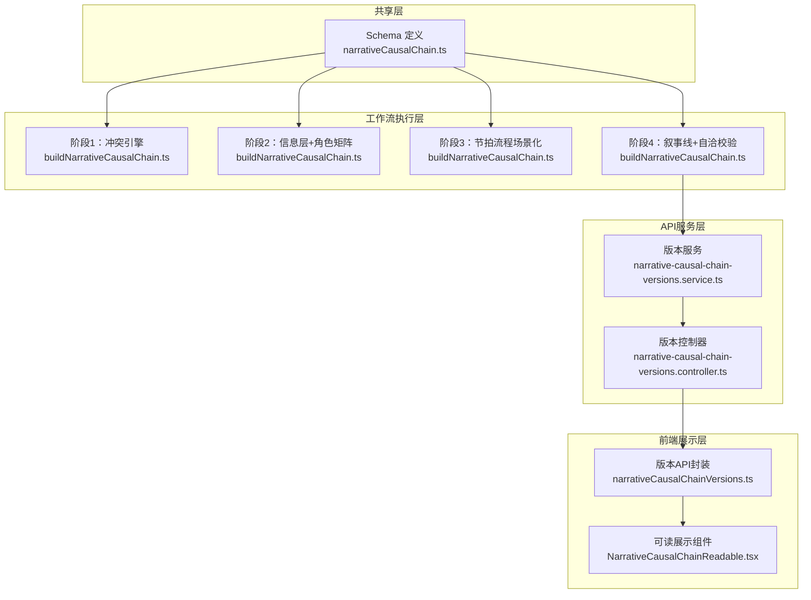
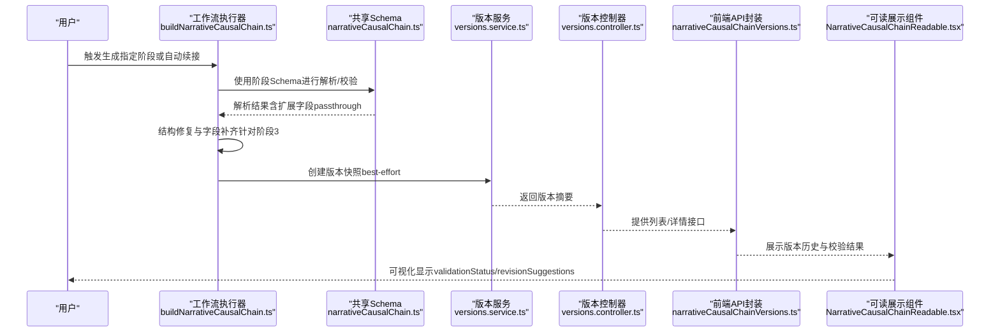
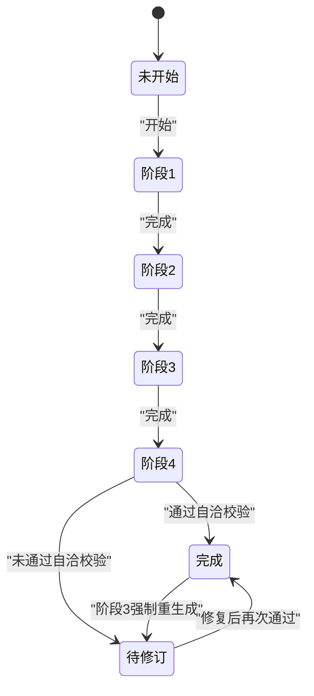
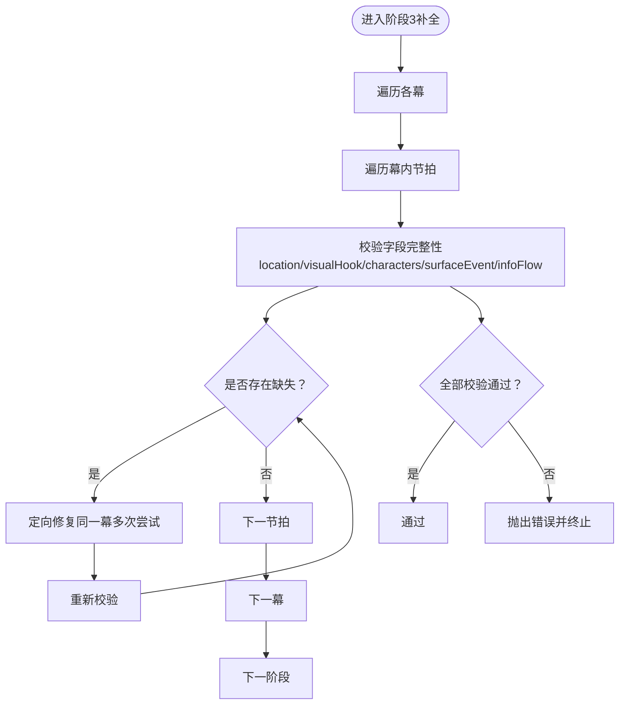

# 叙事因果链Schema（Narrative Causal Chain Schema）

<cite>
**本文档引用的文件**
- [narrativeCausalChain.ts](file://packages/shared/src/schemas/narrativeCausalChain.ts)
- [narrativeCausalChain.test.ts](file://packages/shared/src/schemas/narrativeCausalChain.test.ts)
- [buildNarrativeCausalChain.ts](file://apps/worker/src/tasks/buildNarrativeCausalChain.ts)
- [narrative-causal-chain-versions.service.ts](file://apps/api/src/projects/narrative-causal-chain-versions.service.ts)
- [narrative-causal-chain-versions.controller.ts](file://apps/api/src/projects/narrative-causal-chain-versions.controller.ts)
- [narrativeCausalChainVersions.ts](file://apps/web/src/lib/api/narrativeCausalChainVersions.ts)
- [NarrativeCausalChainReadable.tsx](file://apps/web/src/components/editor/NarrativeCausalChainReadable.tsx)
- [zod.ts](file://apps/api/src/common/zod.ts)
</cite>

## 目录

1. [简介](#简介)
2. [项目结构](#项目结构)
3. [核心组件](#核心组件)
4. [架构总览](#架构总览)
5. [详细组件分析](#详细组件分析)
6. [依赖关系分析](#依赖关系分析)
7. [性能考量](#性能考量)
8. [故障排查指南](#故障排查指南)
9. [结论](#结论)
10. [附录](#附录)

## 简介

本文件系统性阐述“叙事因果链Schema”的技术实现，涵盖Zod Schema定义、分阶段生成流程、状态管理与版本控制、历史记录验证、事件序列与逻辑依赖校验、嵌套因果关系与循环依赖检测、事件完整性检查，以及在叙事创作过程中的验证示例与性能优化策略。该Schema采用模块化分阶段设计，结合严格的类型约束与运行时校验，确保因果链从冲突引擎到节拍流程再到叙事线交织的完整一致性。

## 项目结构

围绕叙事因果链Schema的关键代码分布在以下模块：

- 共享Schema层：定义完整的因果链Schema与分阶段Schema
- 工作流执行层：按阶段生成因果链，执行字段修复与结构校验
- API服务层：提供版本快照、查询与恢复能力
- 前端展示层：读取并可视化因果链的校验结果与版本历史

图表来源

- [narrativeCausalChain.ts](file://packages/shared/src/schemas/narrativeCausalChain.ts#L1-L270)
- [buildNarrativeCausalChain.ts](file://apps/worker/src/tasks/buildNarrativeCausalChain.ts#L1-L1605)
- [narrative-causal-chain-versions.service.ts](file://apps/api/src/projects/narrative-causal-chain-versions.service.ts#L1-L336)
- [narrative-causal-chain-versions.controller.ts](file://apps/api/src/projects/narrative-causal-chain-versions.controller.ts#L1-L84)
- [narrativeCausalChainVersions.ts](file://apps/web/src/lib/api/narrativeCausalChainVersions.ts#L1-L57)
- [NarrativeCausalChainReadable.tsx](file://apps/web/src/components/editor/NarrativeCausalChainReadable.tsx#L623-L657)

章节来源

- [narrativeCausalChain.ts](file://packages/shared/src/schemas/narrativeCausalChain.ts#L1-L270)
- [buildNarrativeCausalChain.ts](file://apps/worker/src/tasks/buildNarrativeCausalChain.ts#L1-L1605)

## 核心组件

- 分阶段Schema
  - 阶段1：核心冲突引擎（大纲摘要、冲突引擎、必要性推导）
  - 阶段2：信息能见度层 + 角色矩阵（动机、角色目标、秘密、脆弱点）
  - 阶段3：节拍流程（三/四幕结构、场景化字段、升级值、咬合点）
  - 阶段4：叙事线 + 自洽校验（主线/副线、关键交叉、不可逆点、一致性检查）
- 完整Schema：整合所有阶段字段，并新增元信息（版本、状态、修订建议、完成阶段）
- 类型别名：Phase1/2/3/4PlotLines等，便于在工作流中复用

章节来源

- [narrativeCausalChain.ts](file://packages/shared/src/schemas/narrativeCausalChain.ts#L11-L268)

## 架构总览

下图展示了从AI生成到版本管理与前端可视化的端到端流程，重点体现Schema在各阶段的约束与校验作用。

图表来源

- [buildNarrativeCausalChain.ts](file://apps/worker/src/tasks/buildNarrativeCausalChain.ts#L820-L1599)
- [narrativeCausalChain.ts](file://packages/shared/src/schemas/narrativeCausalChain.ts#L175-L258)
- [narrative-causal-chain-versions.service.ts](file://apps/api/src/projects/narrative-causal-chain-versions.service.ts#L258-L335)
- [narrative-causal-chain-versions.controller.ts](file://apps/api/src/projects/narrative-causal-chain-versions.controller.ts#L25-L81)
- [narrativeCausalChainVersions.ts](file://apps/web/src/lib/api/narrativeCausalChainVersions.ts#L22-L56)
- [NarrativeCausalChainReadable.tsx](file://apps/web/src/components/editor/NarrativeCausalChainReadable.tsx#L645-L657)

## 详细组件分析

### 分阶段Schema与字段约束

- 阶段1：核心冲突引擎
  - outlineSummary：长度限制，描述完整故事流
  - conflictEngine.coreObjectOrEvent：核心冲突对象/事件
  - conflictEngine.stakesByFaction：势力利害关系映射
  - conflictEngine.firstMover：推动者信息（发起人、公开理由、隐藏意图、合法性面具）
  - conflictEngine.necessityDerivation：必要性推导列表
  - 设计要点：使用passthrough保留扩展字段，便于后续阶段增量扩展
- 阶段2：信息能见度层 + 角色矩阵
  - infoVisibilityLayers：层级名称、角色集合、信息边界、盲点、动机（gain/lossAvoid/激活触发）
  - characterMatrix：角色姓名、身份、目标、秘密、脆弱点、假设
  - 设计要点：对动机数值进行强约束（1-10整数），支持字符串预处理转换
- 阶段3：节拍流程（场景化）
  - beatFlow.actMode：三幕/四幕枚举，支持中文映射
  - acts.act：幕序号（1-4），acts.actName：幕标题
  - beats：节拍名称、表面事件、信息流动、冲突升级值、咬合点
  - 新增场景化字段：location、characters（字符串数组）、visualHook、emotionalTone、estimatedScenes
  - 设计要点：字符串到数字的预处理，字符数组的多分隔符容错解析
- 阶段4：叙事线 + 自洽校验
  - plotLines：lineType（主线/副线1-3）、driver、statedGoal、trueGoal、keyInterlocks、pointOfNoReturn
  - consistencyChecks：多条一致性检查（布尔值），notes作为审查备注
  - 设计要点：lineType中文映射，布尔值字符串容错转换

章节来源

- [narrativeCausalChain.ts](file://packages/shared/src/schemas/narrativeCausalChain.ts#L11-L268)

### 完整Schema与元信息

- version：Schema版本号，默认'2.0.0'，用于数据迁移与兼容
- validationStatus：'pass'/'needs_revision'/'incomplete'，表示整体自洽状态
- revisionSuggestions：修订建议列表
- completedPhase：当前完成阶段（0-4）
- 其余字段来自各阶段Schema，统一以passthrough保留扩展

章节来源

- [narrativeCausalChain.ts](file://packages/shared/src/schemas/narrativeCausalChain.ts#L175-L258)

### 状态管理与版本控制

- 状态流转
  - 初始：completedPhase=0，validationStatus='incomplete'
  - 阶段1完成：completedPhase=1，validationStatus='incomplete'
  - 阶段2完成：completedPhase=2，validationStatus='incomplete'
  - 阶段3完成：completedPhase=3，若发生force重生成则回退至'incomplete'，否则保持原状
  - 阶段4完成：completedPhase=4，根据一致性检查决定validationStatus='pass'或'needs_revision'
- 版本快照
  - 工作流在成功落库后创建版本快照，记录source、phase、completedPhase、validationStatus、chainSchemaVersion、label、note、basedOnVersionId
  - 采用best-effort策略，避免阻断主流程；数据库未迁移时静默失败
  - 限制每个项目的版本数量上限（默认50），超出时按时间裁剪

图表来源

- [buildNarrativeCausalChain.ts](file://apps/worker/src/tasks/buildNarrativeCausalChain.ts#L1458-L1567)
- [narrative-causal-chain-versions.service.ts](file://apps/api/src/projects/narrative-causal-chain-versions.service.ts#L258-L335)

章节来源

- [buildNarrativeCausalChain.ts](file://apps/worker/src/tasks/buildNarrativeCausalChain.ts#L1458-L1567)
- [narrative-causal-chain-versions.service.ts](file://apps/api/src/projects/narrative-causal-chain-versions.service.ts#L258-L335)

### 历史记录验证与API集成

- 版本列表与详情
  - 控制器提供分页查询与详情获取，安全限制最大返回条数
  - 详情包含chain字段，前端可直接渲染
- 前端封装
  - 提供列表、详情、创建快照、恢复接口
  - 可读组件展示validationStatus与consistencyChecks.notes
- 数据库迁移
  - 未迁移时版本插入降级为best-effort，不影响主流程

章节来源

- [narrative-causal-chain-versions.controller.ts](file://apps/api/src/projects/narrative-causal-chain-versions.controller.ts#L33-L81)
- [narrative-causal-chain-versions.service.ts](file://apps/api/src/projects/narrative-causal-chain-versions.service.ts#L65-L160)
- [narrativeCausalChainVersions.ts](file://apps/web/src/lib/api/narrativeCausalChainVersions.ts#L22-L56)
- [NarrativeCausalChainReadable.tsx](file://apps/web/src/components/editor/NarrativeCausalChainReadable.tsx#L623-L657)

### 事件序列验证与逻辑依赖关系

- 事件完整性检查（阶段3）
  - 逐幕逐节拍校验：location、visualHook、characters、surfaceEvent、infoFlow均需非空
  - 字符串数组characters至少包含一个非空角色名
  - 通过getBeatMissingFields与findPhase3IncompleteBeats收集缺失项
  - 对缺失字段进行定向修复（同一幕内多次尝试），最终仍不满足时报错
- 逻辑依赖关系
  - actMode决定幕数（三幕或四幕）
  - 每幕节拍数不得少于3个（结构完整性）
  - 一致性检查（阶段4）：多条布尔条件共同决定validationStatus

图表来源

- [buildNarrativeCausalChain.ts](file://apps/worker/src/tasks/buildNarrativeCausalChain.ts#L570-L646)
- [buildNarrativeCausalChain.ts](file://apps/worker/src/tasks/buildNarrativeCausalChain.ts#L1420-L1439)

章节来源

- [buildNarrativeCausalChain.ts](file://apps/worker/src/tasks/buildNarrativeCausalChain.ts#L570-L646)
- [buildNarrativeCausalChain.ts](file://apps/worker/src/tasks/buildNarrativeCausalChain.ts#L1420-L1439)

### 嵌套因果关系与循环依赖检测

- 嵌套因果关系
  - 通过keyInterlocks字段建立不同叙事线之间的咬合点，形成嵌套与交叉
  - 一致性检查包含“核心冲突具备三方张力”等规则，间接约束嵌套关系的合理性
- 循环依赖检测
  - 当前Schema未直接提供循环依赖检测逻辑
  - 建议在应用层增加基于keyInterlocks的拓扑排序或依赖图分析，以发现潜在循环
  - 可在阶段4一致性检查中扩展新的布尔规则，如“无循环依赖”

说明：本节为概念性指导，不直接对应具体源码实现。

### 叙事创作过程中的因果链验证示例

- 示例1：阶段3节拍字段缺失修复
  - 输入：节拍目录（beatName、escalation、interlock）+ 部分细节字段为空
  - 处理：按幕定向修复，逐步补齐location/visualHook/characters/surfaceEvent/infoFlow
  - 输出：完整节拍数据，若仍不满足则报错并给出缺失清单
- 示例2：阶段4一致性检查
  - 输入：明暗线交织与自洽校验结果
  - 处理：综合多条布尔检查，决定validationStatus
  - 输出：通过或需要修订，并附带revisionSuggestions

章节来源

- [buildNarrativeCausalChain.ts](file://apps/worker/src/tasks/buildNarrativeCausalChain.ts#L431-L467)
- [buildNarrativeCausalChain.ts](file://apps/worker/src/tasks/buildNarrativeCausalChain.ts#L1551-L1567)

### 数据结构优化与性能考虑

- 预处理与容错
  - coerceInt/coerceAct：字符串到整数的预处理，提升AI输出兼容性
  - coerceActMode：中文到枚举的映射，减少人工修正成本
  - coerceBool/lineType：布尔与枚举的容错转换，提高鲁棒性
  - coerceStringArray：多分隔符容错解析，适配不同AI输出风格
- 结构修复与增量更新
  - 阶段3按幕增量补全，失败时定向修复，避免整阶段重跑
  - 将目录先行写入上下文缓存，支持断点续跑
- 版本裁剪与最佳实践
  - 限制版本数量，避免历史膨胀
  - best-effort插入，数据库未迁移时不影响主流程
- 前端渲染
  - 可读组件仅渲染已存在的字段，避免空值渲染
  - notes作为审查备注统一展示

章节来源

- [narrativeCausalChain.ts](file://packages/shared/src/schemas/narrativeCausalChain.ts#L29-L91)
- [buildNarrativeCausalChain.ts](file://apps/worker/src/tasks/buildNarrativeCausalChain.ts#L1067-L1417)
- [narrative-causal-chain-versions.service.ts](file://apps/api/src/projects/narrative-causal-chain-versions.service.ts#L305-L317)

## 依赖关系分析

- 组件耦合
  - 工作流执行器依赖共享Schema进行解析与校验
  - 版本服务依赖工作流生成的元信息（completedPhase、validationStatus、version）
  - 前端通过API封装访问版本服务，渲染一致性检查结果
- 外部依赖
  - Zod用于类型与运行时校验
  - Prisma用于版本持久化与查询
  - LLM提供结构化JSON输出，配合JSON Schema格式化

图表来源

- [narrativeCausalChain.ts](file://packages/shared/src/schemas/narrativeCausalChain.ts#L1-L270)
- [buildNarrativeCausalChain.ts](file://apps/worker/src/tasks/buildNarrativeCausalChain.ts#L1-L1605)
- [narrative-causal-chain-versions.service.ts](file://apps/api/src/projects/narrative-causal-chain-versions.service.ts#L1-L336)
- [narrative-causal-chain-versions.controller.ts](file://apps/api/src/projects/narrative-causal-chain-versions.controller.ts#L1-L84)
- [narrativeCausalChainVersions.ts](file://apps/web/src/lib/api/narrativeCausalChainVersions.ts#L1-L57)
- [NarrativeCausalChainReadable.tsx](file://apps/web/src/components/editor/NarrativeCausalChainReadable.tsx#L623-L657)

章节来源

- [zod.ts](file://apps/api/src/common/zod.ts#L4-L13)

## 性能考量

- JSON修复稳定性
  - 在修复阶段降低推理强度，减少格式漂移与额外解释文本
  - 固定温度与采样参数，提升修复成功率
- 并行与增量
  - 阶段3按幕并行补全，幕间串行，幕内定向修复
  - 目录先行写入，支持断点续跑，减少重复计算
- 存储与查询
  - 版本裁剪与分页查询，避免历史膨胀导致查询缓慢
  - best-effort插入，避免阻断主流程

说明：以上为通用性能建议，具体实现参见工作流执行器中的参数配置与流程设计。

## 故障排查指南

- 常见问题
  - 阶段3节拍字段缺失：定位缺失字段清单，查看formatPhase3IncompleteBeats输出
  - 阶段4一致性检查未通过：检查consistencyChecks各项布尔值，结合revisionSuggestions进行修订
  - 版本插入失败：确认数据库迁移状态，版本服务采用best-effort策略
- 调试技巧
  - 使用previewLLMOutput截断长输出，快速定位问题片段
  - 通过parseOrBadRequest捕获Zod校验错误，获取详细问题列表
  - 在前端可读组件中查看validationStatus与notes，辅助定位问题

章节来源

- [buildNarrativeCausalChain.ts](file://apps/worker/src/tasks/buildNarrativeCausalChain.ts#L394-L409)
- [zod.ts](file://apps/api/src/common/zod.ts#L4-L13)
- [NarrativeCausalChainReadable.tsx](file://apps/web/src/components/editor/NarrativeCausalChainReadable.tsx#L623-L657)

## 结论

叙事因果链Schema通过分阶段设计与严格的Zod约束，实现了从冲突引擎到节拍流程再到叙事线交织的完整闭环。配合工作流的结构修复、版本快照与前端可视化，形成了高鲁棒性的创作与验证体系。建议在应用层进一步引入循环依赖检测与依赖图分析，以增强嵌套因果关系的合理性保障。

## 附录

- 测试用例要点
  - 阶段3：actMode/act/characters的容错转换
  - 阶段4：lineType/keyInterlocks/consistencyChecks的容错转换
  - 扩展字段保留：确保passthrough不会strip额外字段
- 关键实现路径
  - 分阶段Schema定义：[narrativeCausalChain.ts](file://packages/shared/src/schemas/narrativeCausalChain.ts#L11-L268)
  - 完整Schema与元信息：[narrativeCausalChain.ts](file://packages/shared/src/schemas/narrativeCausalChain.ts#L175-L258)
  - 工作流执行与修复：[buildNarrativeCausalChain.ts](file://apps/worker/src/tasks/buildNarrativeCausalChain.ts#L820-L1599)
  - 版本服务与控制器：[narrative-causal-chain-versions.service.ts](file://apps/api/src/projects/narrative-causal-chain-versions.service.ts#L258-L335)、[narrative-causal-chain-versions.controller.ts](file://apps/api/src/projects/narrative-causal-chain-versions.controller.ts#L25-L81)
  - 前端API与展示：[narrativeCausalChainVersions.ts](file://apps/web/src/lib/api/narrativeCausalChainVersions.ts#L22-L56)、[NarrativeCausalChainReadable.tsx](file://apps/web/src/components/editor/NarrativeCausalChainReadable.tsx#L645-L657)
