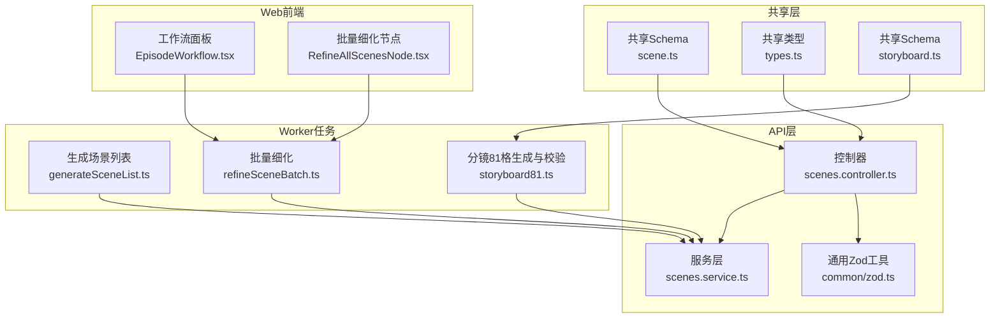
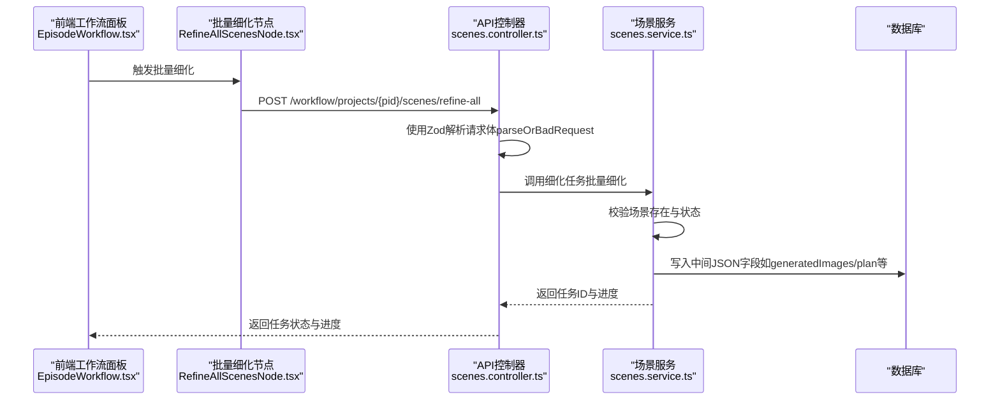
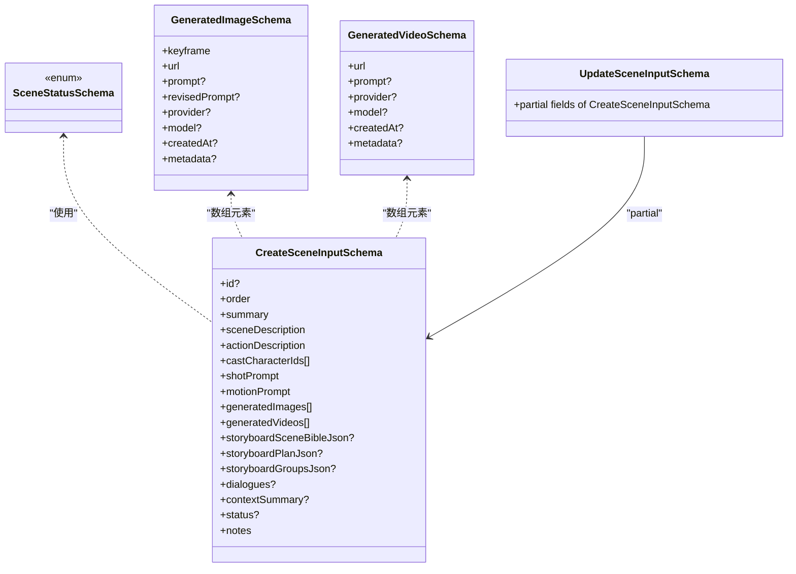
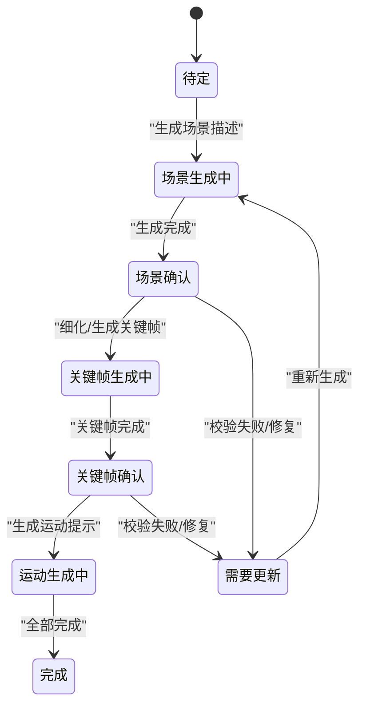
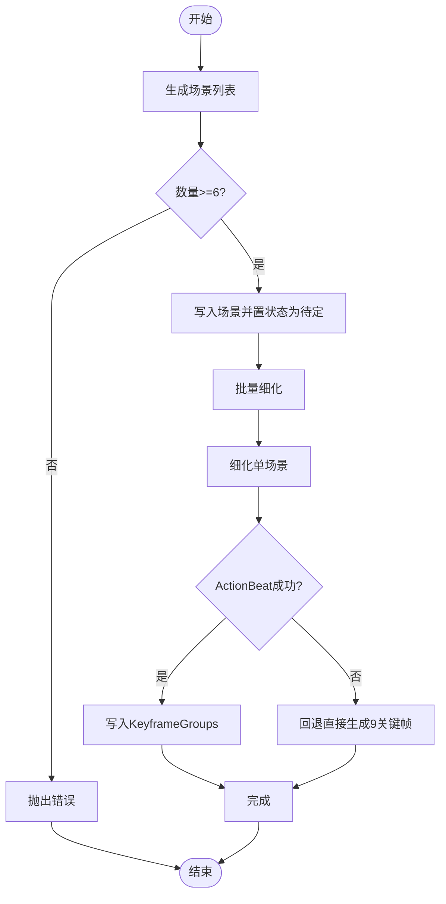
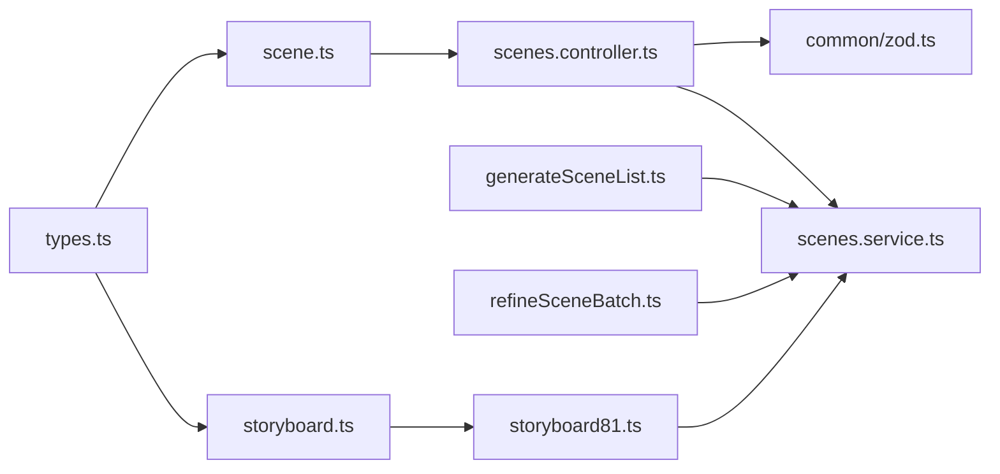

# 场景Schema（Scene Schema）

<cite>
**本文引用的文件**
- [packages/shared/src/schemas/scene.ts](file://packages/shared/src/schemas/scene.ts)
- [packages/shared/src/types.ts](file://packages/shared/src/types.ts)
- [apps/api/src/scenes/scenes.controller.ts](file://apps/api/src/scenes/scenes.controller.ts)
- [apps/api/src/scenes/scenes.service.ts](file://apps/api/src/scenes/scenes.service.ts)
- [apps/api/src/common/zod.ts](file://apps/api/src/common/zod.ts)
- [apps/worker/src/tasks/generateSceneList.ts](file://apps/worker/src/tasks/generateSceneList.ts)
- [apps/worker/src/tasks/refineSceneBatch.ts](file://apps/worker/src/tasks/refineSceneBatch.ts)
- [apps/worker/src/tasks/storyboard81.ts](file://apps/worker/src/tasks/storyboard81.ts)
- [packages/shared/src/schemas/storyboard.ts](file://packages/shared/src/schemas/storyboard.ts)
- [apps/web/src/components/editor/EpisodeWorkflow.tsx](file://apps/web/src/components/editor/EpisodeWorkflow.tsx)
- [apps/web/src/components/canvas/nodes/RefineAllScenesNode.tsx](file://apps/web/src/components/canvas/nodes/RefineAllScenesNode.tsx)
</cite>

## 目录

1. [简介](#简介)
2. [项目结构](#项目结构)
3. [核心组件](#核心组件)
4. [架构总览](#架构总览)
5. [详细组件分析](#详细组件分析)
6. [依赖关系分析](#依赖关系分析)
7. [性能考量](#性能考量)
8. [故障排查指南](#故障排查指南)
9. [结论](#结论)
10. [附录](#附录)

## 简介

本文件围绕“场景Schema（Scene Schema）”进行系统化技术文档编制，聚焦以下目标：

- 场景实体的Zod Schema定义与验证规则
- 场景状态管理与多模态内容验证
- 时间轴字段与数值精度控制
- 对话内容、动作描述、视觉效果参数等复杂数据结构的验证
- 场景生成、细化、优化过程中的验证流程
- 场景数据质量保障机制

该Schema在共享包中定义，被API服务与Web前端共同使用，贯穿从“生成场景列表”到“细化与优化”的全流程。

## 项目结构

与场景Schema相关的关键模块分布如下：

- 共享Schema与类型定义：packages/shared/src/schemas/scene.ts、packages/shared/src/types.ts、packages/shared/src/schemas/storyboard.ts
- API层：apps/api/src/scenes/\* 与 apps/api/src/common/zod.ts
- Worker任务：apps/worker/src/tasks/generateSceneList.ts、apps/worker/src/tasks/refineSceneBatch.ts、apps/worker/src/tasks/storyboard81.ts
- Web前端：apps/web/src/components/editor/EpisodeWorkflow.tsx、apps/web/src/components/canvas/nodes/RefineAllScenesNode.tsx

图表来源

- [packages/shared/src/schemas/scene.ts](file://packages/shared/src/schemas/scene.ts#L1-L56)
- [packages/shared/src/types.ts](file://packages/shared/src/types.ts#L1-L77)
- [packages/shared/src/schemas/storyboard.ts](file://packages/shared/src/schemas/storyboard.ts#L1-L180)
- [apps/api/src/scenes/scenes.controller.ts](file://apps/api/src/scenes/scenes.controller.ts#L1-L67)
- [apps/api/src/scenes/scenes.service.ts](file://apps/api/src/scenes/scenes.service.ts#L1-L365)
- [apps/api/src/common/zod.ts](file://apps/api/src/common/zod.ts#L1-L16)
- [apps/worker/src/tasks/generateSceneList.ts](file://apps/worker/src/tasks/generateSceneList.ts#L1-L129)
- [apps/worker/src/tasks/refineSceneBatch.ts](file://apps/worker/src/tasks/refineSceneBatch.ts#L1-L182)
- [apps/worker/src/tasks/storyboard81.ts](file://apps/worker/src/tasks/storyboard81.ts#L1-L800)
- [apps/web/src/components/editor/EpisodeWorkflow.tsx](file://apps/web/src/components/editor/EpisodeWorkflow.tsx#L374-L857)
- [apps/web/src/components/canvas/nodes/RefineAllScenesNode.tsx](file://apps/web/src/components/canvas/nodes/RefineAllScenesNode.tsx#L35-L55)

章节来源

- [packages/shared/src/schemas/scene.ts](file://packages/shared/src/schemas/scene.ts#L1-L56)
- [packages/shared/src/types.ts](file://packages/shared/src/types.ts#L1-L77)
- [apps/api/src/scenes/scenes.controller.ts](file://apps/api/src/scenes/scenes.controller.ts#L1-L67)
- [apps/api/src/scenes/scenes.service.ts](file://apps/api/src/scenes/scenes.service.ts#L1-L365)
- [apps/api/src/common/zod.ts](file://apps/api/src/common/zod.ts#L1-L16)
- [apps/worker/src/tasks/generateSceneList.ts](file://apps/worker/src/tasks/generateSceneList.ts#L1-L129)
- [apps/worker/src/tasks/refineSceneBatch.ts](file://apps/worker/src/tasks/refineSceneBatch.ts#L1-L182)
- [apps/worker/src/tasks/storyboard81.ts](file://apps/worker/src/tasks/storyboard81.ts#L1-L800)
- [packages/shared/src/schemas/storyboard.ts](file://packages/shared/src/schemas/storyboard.ts#L1-L180)
- [apps/web/src/components/editor/EpisodeWorkflow.tsx](file://apps/web/src/components/editor/EpisodeWorkflow.tsx#L374-L857)
- [apps/web/src/components/canvas/nodes/RefineAllScenesNode.tsx](file://apps/web/src/components/canvas/nodes/RefineAllScenesNode.tsx#L35-L55)

## 核心组件

- 场景状态枚举与键帧枚举：来源于共享类型定义，确保前后端一致的状态机与键帧标识。
- 场景Schema（Create/Update）：定义场景实体的字段、长度限制、正则约束、数组与可选字段策略。
- 生成图像与视频Schema：统一多模态产物的结构与可选元数据。
- 控制器与服务：控制器使用Zod进行请求体解析，服务层执行业务逻辑与数据库写入。
- Worker任务：生成场景列表、批量细化、分镜81格生成与严格校验。
- Web前端：工作流面板触发细化与监控进度，节点封装批量细化入口。

章节来源

- [packages/shared/src/types.ts](file://packages/shared/src/types.ts#L37-L62)
- [packages/shared/src/schemas/scene.ts](file://packages/shared/src/schemas/scene.ts#L1-L56)
- [apps/api/src/common/zod.ts](file://apps/api/src/common/zod.ts#L4-L13)
- [apps/api/src/scenes/scenes.controller.ts](file://apps/api/src/scenes/scenes.controller.ts#L24-L47)
- [apps/api/src/scenes/scenes.service.ts](file://apps/api/src/scenes/scenes.service.ts#L105-L159)
- [apps/worker/src/tasks/generateSceneList.ts](file://apps/worker/src/tasks/generateSceneList.ts#L19-L127)
- [apps/worker/src/tasks/refineSceneBatch.ts](file://apps/worker/src/tasks/refineSceneBatch.ts#L41-L182)
- [apps/worker/src/tasks/storyboard81.ts](file://apps/worker/src/tasks/storyboard81.ts#L553-L639)
- [apps/web/src/components/editor/EpisodeWorkflow.tsx](file://apps/web/src/components/editor/EpisodeWorkflow.tsx#L775-L857)
- [apps/web/src/components/canvas/nodes/RefineAllScenesNode.tsx](file://apps/web/src/components/canvas/nodes/RefineAllScenesNode.tsx#L35-L55)

## 架构总览

下图展示从Web前端发起细化到Worker任务执行，再到API服务持久化的整体流程，以及Schema在各环节的验证作用。

图表来源

- [apps/web/src/components/editor/EpisodeWorkflow.tsx](file://apps/web/src/components/editor/EpisodeWorkflow.tsx#L775-L857)
- [apps/web/src/components/canvas/nodes/RefineAllScenesNode.tsx](file://apps/web/src/components/canvas/nodes/RefineAllScenesNode.tsx#L35-L55)
- [apps/api/src/scenes/scenes.controller.ts](file://apps/api/src/scenes/scenes.controller.ts#L24-L47)
- [apps/api/src/common/zod.ts](file://apps/api/src/common/zod.ts#L4-L13)
- [apps/api/src/scenes/scenes.service.ts](file://apps/api/src/scenes/scenes.service.ts#L161-L203)

## 详细组件分析

### 场景Schema定义与字段验证

- 场景状态枚举：SceneStatusSchema基于共享类型SCENE_STATUSES，覆盖“待生成、关键帧生成、确认、完成、需要更新”等状态。
- 键帧枚举：GENERATED_IMAGE_KEYFRAMES定义KFO-KF8，用于生成图像的键帧标识。
- 创建输入（CreateSceneInputSchema）：
  - id：字符串，长度1-160，正则[A-Za-z0-9_-]，可选
  - order：非负整数
  - summary/sceneDescription/actionDescription/shotPrompt/motionPrompt：带最大长度限制的字符串，默认值为空字符串
  - castCharacterIds：字符串数组，元素非空
  - generatedImages/generatedVideos：数组，元素为统一的生成产物Schema（含url/prompt/provider/model/createdAt/metadata等）
  - storyboardSceneBibleJson/storyboardPlanJson/storyboardGroupsJson/dialogues/contextSummary：未知类型（Prisma.JsonValue），用于存储复杂结构
  - status：可选，取值来自SceneStatusSchema
  - notes：字符串，默认空
- 更新输入（UpdateSceneInputSchema）：基于CreateSchema的部分化，允许逐项更新

图表来源

- [packages/shared/src/schemas/scene.ts](file://packages/shared/src/schemas/scene.ts#L4-L49)
- [packages/shared/src/types.ts](file://packages/shared/src/types.ts#L37-L62)

章节来源

- [packages/shared/src/schemas/scene.ts](file://packages/shared/src/schemas/scene.ts#L1-L56)
- [packages/shared/src/types.ts](file://packages/shared/src/types.ts#L37-L62)

### 场景状态管理与工作流集成

- 状态枚举：SCENE_STATUSES覆盖“待定、场景生成中、场景确认、关键帧生成中、关键帧确认、运动生成中、完成、需要更新”。
- 工作流阶段：WORKFLOW_STATES与EPISODE_WORKFLOW_STATES定义项目/剧集级状态，场景状态作为子状态参与。
- API服务：在删除场景前检查是否存在“排队/运行中”的AI作业，防止并发破坏数据一致性。

图表来源

- [packages/shared/src/types.ts](file://packages/shared/src/types.ts#L37-L47)
- [apps/api/src/scenes/scenes.service.ts](file://apps/api/src/scenes/scenes.service.ts#L255-L280)

章节来源

- [packages/shared/src/types.ts](file://packages/shared/src/types.ts#L37-L47)
- [apps/api/src/scenes/scenes.service.ts](file://apps/api/src/scenes/scenes.service.ts#L255-L280)

### 多模态内容验证与时间轴字段

- 多模态产物：
  - 生成图像：键帧标识（KF0-KF8）、URL、提示词、提供商、模型、创建时间、元数据
  - 生成视频：URL、提示词、提供商、模型、创建时间、元数据
- 时间轴字段：键帧枚举与顺序在Worker任务中严格校验，确保9组关键帧完整且有序。
- 数值精度控制：Zod对整数、非负数、字符串长度进行约束，避免越界与空值污染。

章节来源

- [packages/shared/src/schemas/scene.ts](file://packages/shared/src/schemas/scene.ts#L6-L24)
- [packages/shared/src/types.ts](file://packages/shared/src/types.ts#L51-L62)
- [apps/worker/src/tasks/storyboard81.ts](file://apps/worker/src/tasks/storyboard81.ts#L181-L186)

### 复杂数据结构验证（对话、动作、视觉效果）

- 对话内容（dialogues）：未知类型，允许任意JSON结构，便于灵活扩展。
- 动作描述（actionDescription）：字符串，配合ActionBeat拆解与KeyframeGroups生成。
- 视觉效果参数：
  - 分镜计划（storyboardPlanJson）：包含9组分镜，每组含起止状态与镜头目标
  - 分镜组（storyboardGroupsJson）：包含9组3x3面板，每组含相机参数与连贯性状态
  - 场景圣经（storyboardSceneBibleJson）：场景前提、角色、设定锁、道具清单、必须发生的动作片段

章节来源

- [packages/shared/src/schemas/scene.ts](file://packages/shared/src/schemas/scene.ts#L42-L46)
- [packages/shared/src/schemas/storyboard.ts](file://packages/shared/src/schemas/storyboard.ts#L69-L108)
- [apps/worker/src/tasks/storyboard81.ts](file://apps/worker/src/tasks/storyboard81.ts#L284-L402)

### 场景生成、细化、优化的验证流程

- 生成场景列表：
  - 读取项目摘要、风格与主角，调用AI生成分镜摘要列表
  - 校验生成数量（至少6条），写入默认剧集的场景表，设置状态为“待定”
- 批量细化：
  - 逐场景调用细化任务，支持断点续跑与失败记录
  - 在细化过程中，可能回退到直接生成9关键帧模式，并写入legacy shot prompt
- 分镜81格生成与严格校验：
  - 结构化JSON生成：使用JSON Schema响应格式，确保字段齐全
  - 语义校验：面板数量、索引唯一性、英文描述非空、相机模式约束、角色/道具承接一致性
  - 修复循环：当解析或结构校验失败时，构造修复提示并二次生成，最多尝试N次

图表来源

- [apps/worker/src/tasks/generateSceneList.ts](file://apps/worker/src/tasks/generateSceneList.ts#L97-L118)
- [apps/worker/src/tasks/refineSceneBatch.ts](file://apps/worker/src/tasks/refineSceneBatch.ts#L122-L147)
- [apps/worker/src/tasks/storyboard81.ts](file://apps/worker/src/tasks/storyboard81.ts#L553-L639)

章节来源

- [apps/worker/src/tasks/generateSceneList.ts](file://apps/worker/src/tasks/generateSceneList.ts#L19-L127)
- [apps/worker/src/tasks/refineSceneBatch.ts](file://apps/worker/src/tasks/refineSceneBatch.ts#L41-L182)
- [apps/worker/src/tasks/storyboard81.ts](file://apps/worker/src/tasks/storyboard81.ts#L553-L639)

### 数据质量保障机制

- 请求体验证：API控制器统一使用parseOrBadRequest，Zod错误转换为400 Bad Request，携带具体问题路径与消息。
- 业务前置校验：删除场景前检查是否存在排队/运行中的AI作业，避免并发破坏。
- 结构化生成与修复：Worker任务采用“结构化JSON + 语义校验 + 修复循环”的三段式，确保输出符合Schema与连贯性要求。
- 类型一致性：共享类型与Schema在多端复用，减少不一致导致的运行期错误。

章节来源

- [apps/api/src/common/zod.ts](file://apps/api/src/common/zod.ts#L4-L13)
- [apps/api/src/scenes/scenes.controller.ts](file://apps/api/src/scenes/scenes.controller.ts#L24-L47)
- [apps/api/src/scenes/scenes.service.ts](file://apps/api/src/scenes/scenes.service.ts#L255-L280)
- [apps/worker/src/tasks/storyboard81.ts](file://apps/worker/src/tasks/storyboard81.ts#L553-L639)

## 依赖关系分析

- 共享Schema与类型：
  - scene.ts依赖types.ts中的状态与键帧枚举
  - storyboard.ts依赖types.ts中的键帧枚举，定义SceneBible、StoryboardPlan、StoryboardGroupsJson等复杂结构
- API层：
  - controller依赖shared的Create/Update Schema与parseOrBadRequest
  - service依赖Prisma模型与Zod输入，执行业务校验与持久化
- Worker层：
  - generateSceneList依赖Prisma读取项目与AI配置，写入场景
  - refineSceneBatch遍历场景并调用细化任务，支持断点续跑
  - storyboard81依赖shared的StoryBoard相关Schema与类型，执行严格校验与修复

图表来源

- [packages/shared/src/types.ts](file://packages/shared/src/types.ts#L1-L77)
- [packages/shared/src/schemas/scene.ts](file://packages/shared/src/schemas/scene.ts#L1-L56)
- [packages/shared/src/schemas/storyboard.ts](file://packages/shared/src/schemas/storyboard.ts#L1-L180)
- [apps/api/src/scenes/scenes.controller.ts](file://apps/api/src/scenes/scenes.controller.ts#L1-L67)
- [apps/api/src/common/zod.ts](file://apps/api/src/common/zod.ts#L1-L16)
- [apps/api/src/scenes/scenes.service.ts](file://apps/api/src/scenes/scenes.service.ts#L1-L365)
- [apps/worker/src/tasks/generateSceneList.ts](file://apps/worker/src/tasks/generateSceneList.ts#L1-L129)
- [apps/worker/src/tasks/refineSceneBatch.ts](file://apps/worker/src/tasks/refineSceneBatch.ts#L1-L182)
- [apps/worker/src/tasks/storyboard81.ts](file://apps/worker/src/tasks/storyboard81.ts#L1-L800)

章节来源

- [packages/shared/src/types.ts](file://packages/shared/src/types.ts#L1-L77)
- [packages/shared/src/schemas/scene.ts](file://packages/shared/src/schemas/scene.ts#L1-L56)
- [packages/shared/src/schemas/storyboard.ts](file://packages/shared/src/schemas/storyboard.ts#L1-L180)
- [apps/api/src/scenes/scenes.controller.ts](file://apps/api/src/scenes/scenes.controller.ts#L1-L67)
- [apps/api/src/common/zod.ts](file://apps/api/src/common/zod.ts#L1-L16)
- [apps/api/src/scenes/scenes.service.ts](file://apps/api/src/scenes/scenes.service.ts#L1-L365)
- [apps/worker/src/tasks/generateSceneList.ts](file://apps/worker/src/tasks/generateSceneList.ts#L1-L129)
- [apps/worker/src/tasks/refineSceneBatch.ts](file://apps/worker/src/tasks/refineSceneBatch.ts#L1-L182)
- [apps/worker/src/tasks/storyboard81.ts](file://apps/worker/src/tasks/storyboard81.ts#L1-L800)

## 性能考量

- Zod解析开销：在API入口集中进行解析，避免重复校验；对大字段（如JSON）采用Prisma.JsonValue存储，减少不必要的序列化成本。
- Worker任务批量化：批量细化支持断点续跑与进度聚合，降低网络与LLM调用次数。
- 结构化生成与修复：通过响应格式约束与语义校验，减少无效输出与重试成本。
- 数据库事务：重排场景顺序等操作使用事务，保证一致性与原子性。

## 故障排查指南

- 请求体校验失败（400）：
  - 检查字段类型、长度、正则与必填项是否满足Zod定义
  - 关注返回的issues路径与消息，定位具体字段
- 删除场景失败（400）：
  - 若存在排队/运行中的AI作业，需先取消作业再删除
- 批量细化异常：
  - 查看failedScenes与错误详情，结合日志定位失败场景
  - 支持重试与继续批量细化
- 分镜81格生成失败：
  - 关注结构化JSON生成与语义校验的修复提示
  - 检查面板数量、索引唯一性、相机模式约束与角色/道具承接

章节来源

- [apps/api/src/common/zod.ts](file://apps/api/src/common/zod.ts#L4-L13)
- [apps/api/src/scenes/scenes.service.ts](file://apps/api/src/scenes/scenes.service.ts#L255-L280)
- [apps/worker/src/tasks/refineSceneBatch.ts](file://apps/worker/src/tasks/refineSceneBatch.ts#L150-L153)
- [apps/worker/src/tasks/storyboard81.ts](file://apps/worker/src/tasks/storyboard81.ts#L553-L639)

## 结论

场景Schema通过严格的Zod定义与多端共享，确保了从生成、细化到优化全链路的数据一致性与质量。配合Worker任务的结构化生成与语义校验、API层的前置校验与事务控制，形成了稳健的场景数据治理闭环。建议在扩展新字段时保持与共享Schema与类型的一致性，并在新增校验规则时同步完善前端与Worker侧的修复与提示逻辑。

## 附录

- 相关系统提示词与工作流键：
  - ActionBeats系统提示词键：workflow.action_beats.\*（用于动作拆解与关键帧组生成）
  - 分镜81格生成系统提示词键：workflow.storyboard81.\*
  - 对话生成系统提示词键：workflow.dialogue.\*

章节来源

- [packages/shared/src/systemPrompts.ts](file://packages/shared/src/systemPrompts.ts#L96-L112)
- [apps/worker/src/tasks/storyboard81.ts](file://apps/worker/src/tasks/storyboard81.ts#L935-L949)
