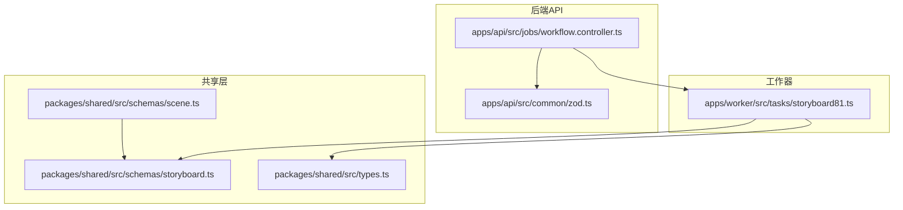
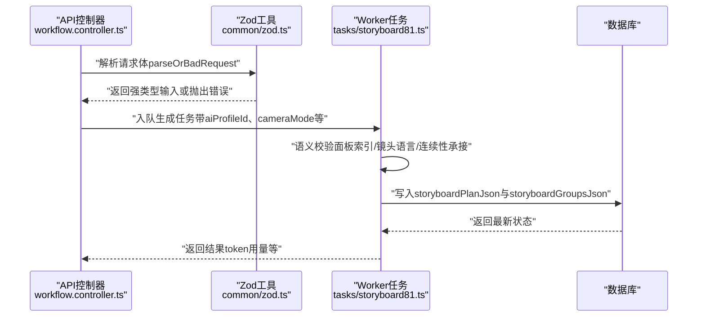
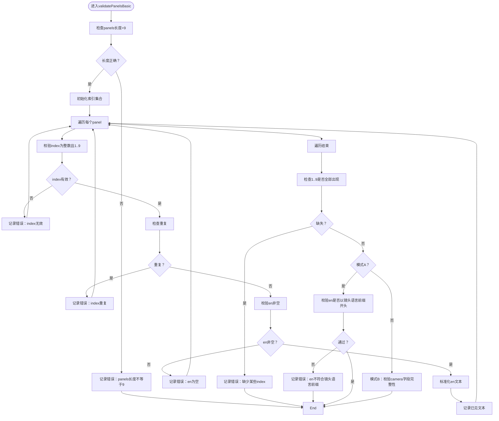
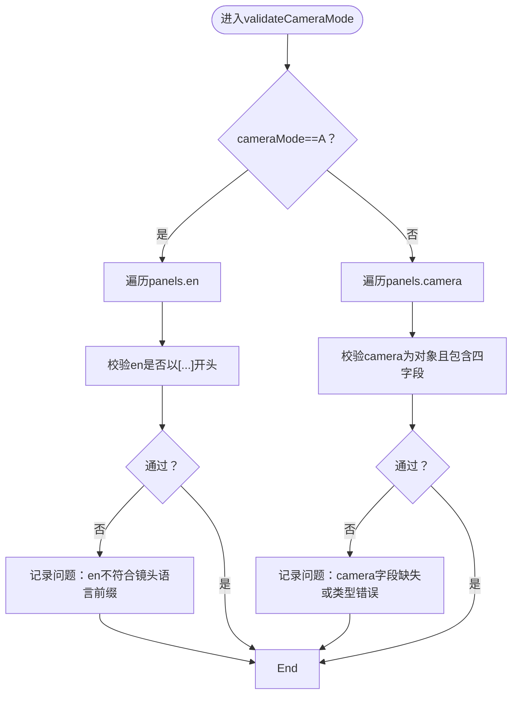
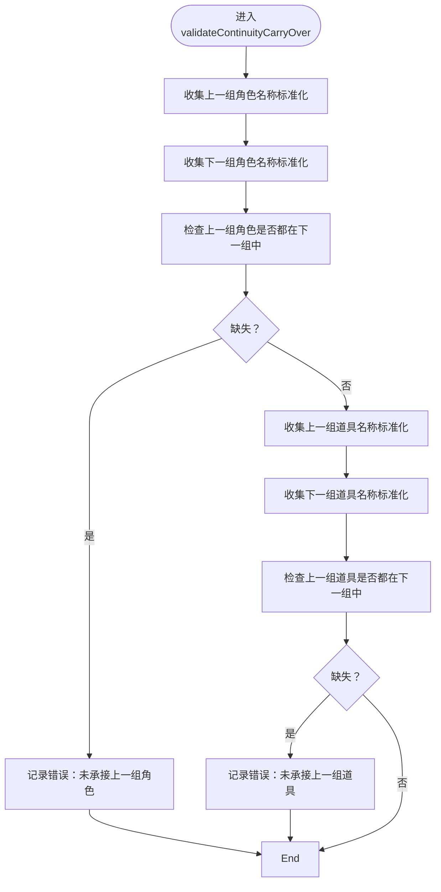
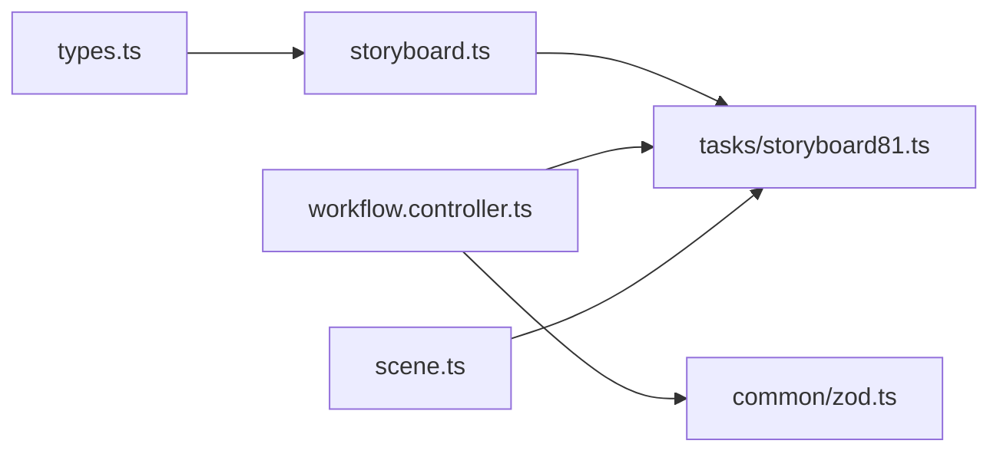

# 故事板Schema（Storyboard Schema）

<cite>
**本文引用的文件**
- [packages/shared/src/schemas/storyboard.ts](file://packages/shared/src/schemas/storyboard.ts)
- [packages/shared/src/types.ts](file://packages/shared/src/types.ts)
- [apps/worker/src/tasks/storyboard81.ts](file://apps/worker/src/tasks/storyboard81.ts)
- [apps/api/src/jobs/workflow.controller.ts](file://apps/api/src/jobs/workflow.controller.ts)
- [apps/api/src/common/zod.ts](file://apps/api/src/common/zod.ts)
- [packages/shared/src/schemas/scene.ts](file://packages/shared/src/schemas/scene.ts)
</cite>

## 目录

1. [简介](#简介)
2. [项目结构](#项目结构)
3. [核心组件](#核心组件)
4. [架构总览](#架构总览)
5. [详细组件分析](#详细组件分析)
6. [依赖关系分析](#依赖关系分析)
7. [性能考量](#性能考量)
8. [故障排查指南](#故障排查指南)
9. [结论](#结论)
10. [附录](#附录)

## 简介

本技术文档围绕“故事板Schema”的设计与实现进行系统化说明，重点覆盖以下方面：

- 分镜序列验证：面板索引完整性、唯一性与顺序校验
- 镜头描述验证：镜头语言规范与相机参数结构校验
- 视觉效果参数验证：渲染模板版本、提示词与渲染JSON结构
- 故事板与场景的关联验证：SceneBible、计划与分组的联动
- 复杂数据结构验证：嵌套对象、数组长度与默认值策略
- 创建、编辑、导出全流程的验证示例与数据质量保障机制

## 项目结构

故事板Schema位于共享包中，被API服务、Web前端与Worker任务共同使用。其核心文件如下：

- packages/shared/src/schemas/storyboard.ts：定义StoryBoard相关Zod Schema与类型
- packages/shared/src/types.ts：提供通用枚举与类型（如关键帧键名、工作流状态等）
- apps/worker/src/tasks/storyboard81.ts：实现语义级校验、状态流转与持久化
- apps/api/src/jobs/workflow.controller.ts：暴露工作流接口并进行输入参数Zod校验
- apps/api/src/common/zod.ts：统一的Zod解析与错误抛出工具
- packages/shared/src/schemas/scene.ts：场景Schema，体现故事板与场景的关联字段

**图表来源**

- [packages/shared/src/schemas/storyboard.ts](file://packages/shared/src/schemas/storyboard.ts#L1-L180)
- [packages/shared/src/types.ts](file://packages/shared/src/types.ts#L1-L77)
- [packages/shared/src/schemas/scene.ts](file://packages/shared/src/schemas/scene.ts#L1-L56)
- [apps/api/src/jobs/workflow.controller.ts](file://apps/api/src/jobs/workflow.controller.ts#L1-L266)
- [apps/api/src/common/zod.ts](file://apps/api/src/common/zod.ts#L1-L16)
- [apps/worker/src/tasks/storyboard81.ts](file://apps/worker/src/tasks/storyboard81.ts#L1-L200)

**章节来源**

- [packages/shared/src/schemas/storyboard.ts](file://packages/shared/src/schemas/storyboard.ts#L1-L180)
- [packages/shared/src/types.ts](file://packages/shared/src/types.ts#L1-L77)
- [packages/shared/src/schemas/scene.ts](file://packages/shared/src/schemas/scene.ts#L1-L56)
- [apps/api/src/jobs/workflow.controller.ts](file://apps/api/src/jobs/workflow.controller.ts#L1-L266)
- [apps/api/src/common/zod.ts](file://apps/api/src/common/zod.ts#L1-L16)
- [apps/worker/src/tasks/storyboard81.ts](file://apps/worker/src/tasks/storyboard81.ts#L1-L200)

## 核心组件

本节从Schema层面梳理故事板实体的关键字段与约束，并结合运行期校验补充语义规则。

- 关键帧键名与枚举
  - 使用枚举限定关键帧键名集合，确保分组ID与渲染键一致
  - 参考路径：[packages/shared/src/types.ts](file://packages/shared/src/types.ts#L51-L62)

- 面板Schema（StoryboardPanelSchema）
  - index：整数，范围1..9；要求唯一且连续
  - en：英文描述，必填且非空
  - zh：中文描述，可选
  - camera：镜头描述对象，包含shot_size、angle、lens、motion四个字符串字段
  - dirtyZh：标记中文是否需要更新
  - 参考路径：[packages/shared/src/schemas/storyboard.ts](file://packages/shared/src/schemas/storyboard.ts#L23-L32)

- 相机模式Schema（StoryboardCameraModeSchema）
  - 枚举A/B两种模式
  - 模式A：en需符合特定镜头语言前缀格式
  - 模式B：camera对象必须存在且包含四个字符串字段
  - 参考路径：[packages/shared/src/schemas/storyboard.ts](file://packages/shared/src/schemas/storyboard.ts#L7-L8)

- 连续性状态Schema（ContinuityStateSchema）
  - characters：角色状态数组，含name/location/stance/facing/emotion及双手持物
  - props：道具状态数组，含name/state/holder
  - next_intent_hint：承接意图提示
  - 参考路径：[packages/shared/src/schemas/storyboard.ts](file://packages/shared/src/schemas/storyboard.ts#L60-L67)

- 场景圣经Schema（SceneBibleSchema）
  - scene_premise：场景前提，必填
  - characters：角色信息数组（name必填，identity/relation可选）
  - setting_lock：场景设定锁定
  - props_list：道具清单
  - must_happen_beats：必须发生的动作片段，至少一个
  - 参考路径：[packages/shared/src/schemas/storyboard.ts](file://packages/shared/src/schemas/storyboard.ts#L69-L88)

- 计划分组Schema（StoryboardPlanGroupSchema）
  - group_id、shot_range、goal_en：必填
  - start_state/end_state：连续性状态轻量版（partial）
  - 参考路径：[packages/shared/src/schemas/storyboard.ts](file://packages/shared/src/schemas/storyboard.ts#L92-L108)

- 计划Schema（StoryboardPlanSchema）
  - groups：固定长度为9的数组，对应KFs
  - 参考路径：[packages/shared/src/schemas/storyboard.ts](file://packages/shared/src/schemas/storyboard.ts#L103-L108)

- 分组草稿Schema（StoryboardGroupDraftSchema）
  - group_id、shot_range、panels（9个）、continuity.end_state
  - 参考路径：[packages/shared/src/schemas/storyboard.ts](file://packages/shared/src/schemas/storyboard.ts#L110-L123)

- 渲染Schema（StoryboardGroupRenderSchema）
  - template_version：非负整数
  - prompt_en：英文提示词
  - render_json：未知结构，用于渲染参数
  - 参考路径：[packages/shared/src/schemas/storyboard.ts](file://packages/shared/src/schemas/storyboard.ts#L124-L131)

- 分组Schema（StoryboardGroupSchema）
  - 在草稿基础上扩展render与meta（包含camera_mode、createdAt、updatedAt）
  - 参考路径：[packages/shared/src/schemas/storyboard.ts](file://packages/shared/src/schemas/storyboard.ts#L133-L144)

- 分组集合Schema（StoryboardGroupsJsonSchema）
  - version：字面量1
  - settings：包含camera_mode默认值
  - groups：长度为9的数组，每项含group_id、shot_range、status、group、last_error
  - running_summary：可选
  - translation：翻译状态与错误
  - 参考路径：[packages/shared/src/schemas/storyboard.ts](file://packages/shared/src/schemas/storyboard.ts#L146-L178)

**章节来源**

- [packages/shared/src/schemas/storyboard.ts](file://packages/shared/src/schemas/storyboard.ts#L1-L180)
- [packages/shared/src/types.ts](file://packages/shared/src/types.ts#L51-L62)

## 架构总览

下图展示从API到Worker再到数据库的故事板工作流，以及Schema在各阶段的职责：

**图表来源**

- [apps/api/src/jobs/workflow.controller.ts](file://apps/api/src/jobs/workflow.controller.ts#L36-L42)
- [apps/api/src/common/zod.ts](file://apps/api/src/common/zod.ts#L4-L13)
- [apps/worker/src/tasks/storyboard81.ts](file://apps/worker/src/tasks/storyboard81.ts#L991-L1098)

**章节来源**

- [apps/api/src/jobs/workflow.controller.ts](file://apps/api/src/jobs/workflow.controller.ts#L1-L266)
- [apps/api/src/common/zod.ts](file://apps/api/src/common/zod.ts#L1-L16)
- [apps/worker/src/tasks/storyboard81.ts](file://apps/worker/src/tasks/storyboard81.ts#L1-L200)

## 详细组件分析

### 面板与分镜序列验证

- 面板数量与索引
  - panels必须恰好9个；每个panel.index必须是1..9的整数且唯一
  - 缺失或重复将产生明确的错误路径与消息
- 英文描述校验
  - en必须非空；当启用模式A时，en需满足特定镜头语言前缀格式
- 相机模式校验
  - 模式A：en需以方括号镜头语言前缀开头
  - 模式B：camera对象必须存在且包含shot_size/angle/lens/motion四个字符串字段
- 重复检测
  - 基于标准化后的en文本进行重复检测，避免完全重复

**图表来源**

- [apps/worker/src/tasks/storyboard81.ts](file://apps/worker/src/tasks/storyboard81.ts#L41-L90)
- [apps/worker/src/tasks/storyboard81.ts](file://apps/worker/src/tasks/storyboard81.ts#L92-L130)

**章节来源**

- [apps/worker/src/tasks/storyboard81.ts](file://apps/worker/src/tasks/storyboard81.ts#L41-L130)

### 相机模式与镜头描述验证

- 模式A
  - en需以方括号镜头语言前缀开头，例如：[景别|视角|焦段|运动方向] …
- 模式B
  - camera对象必须存在，且包含shot_size、angle、lens、motion四个字符串字段
- 相机字段的结构校验由运行期逻辑完成，确保类型安全

**图表来源**

- [apps/worker/src/tasks/storyboard81.ts](file://apps/worker/src/tasks/storyboard81.ts#L92-L130)

**章节来源**

- [apps/worker/src/tasks/storyboard81.ts](file://apps/worker/src/tasks/storyboard81.ts#L92-L130)

### 连续性状态承接验证

- 角色与道具的承接
  - 上一组的characters/props名称需在下一组中出现
  - 使用标准化后的名称进行匹配，避免大小写与空白差异
- 未承接的角色/道具会触发错误，提示具体路径

**图表来源**

- [apps/worker/src/tasks/storyboard81.ts](file://apps/worker/src/tasks/storyboard81.ts#L132-L163)

**章节来源**

- [apps/worker/src/tasks/storyboard81.ts](file://apps/worker/src/tasks/storyboard81.ts#L132-L163)

### 渲染参数与模板版本验证

- template_version：非负整数，确保渲染模板版本合法
- prompt_en：英文提示词，必填
- render_json：未知结构，允许任意JSON，便于后续渲染引擎消费

**章节来源**

- [packages/shared/src/schemas/storyboard.ts](file://packages/shared/src/schemas/storyboard.ts#L124-L131)

### 分组集合与状态管理

- groups：固定长度9，对应KF0..KF8
- status：支持pending/generating/ready/needs_fix等状态
- translation：翻译状态与错误信息
- settings：默认camera_mode为'B'

**章节来源**

- [packages/shared/src/schemas/storyboard.ts](file://packages/shared/src/schemas/storyboard.ts#L146-L178)

### 故事板与场景的关联验证

- 场景Schema中包含storyboardSceneBibleJson、storyboardPlanJson、storyboardGroupsJson等字段，作为故事板数据的载体
- Worker在生成流程中会读取并校验这些字段，确保Plan与Groups的一致性

**章节来源**

- [packages/shared/src/schemas/scene.ts](file://packages/shared/src/schemas/scene.ts#L26-L49)
- [apps/worker/src/tasks/storyboard81.ts](file://apps/worker/src/tasks/storyboard81.ts#L803-L814)

## 依赖关系分析

- 共享Schema依赖
  - Storyboard相关Schema依赖types.ts中的枚举与常量
  - Worker任务直接依赖共享Schema进行解析与校验
- 控制器依赖
  - API控制器使用Zod对请求体进行强类型解析，再调用Worker任务
- 数据库交互
  - Worker将校验后的Plan与Groups写入场景记录，形成闭环

**图表来源**

- [packages/shared/src/types.ts](file://packages/shared/src/types.ts#L51-L62)
- [packages/shared/src/schemas/storyboard.ts](file://packages/shared/src/schemas/storyboard.ts#L1-L180)
- [apps/worker/src/tasks/storyboard81.ts](file://apps/worker/src/tasks/storyboard81.ts#L1-L200)
- [apps/api/src/jobs/workflow.controller.ts](file://apps/api/src/jobs/workflow.controller.ts#L1-L266)
- [apps/api/src/common/zod.ts](file://apps/api/src/common/zod.ts#L1-L16)
- [packages/shared/src/schemas/scene.ts](file://packages/shared/src/schemas/scene.ts#L1-L56)

**章节来源**

- [packages/shared/src/types.ts](file://packages/shared/src/types.ts#L51-L62)
- [packages/shared/src/schemas/storyboard.ts](file://packages/shared/src/schemas/storyboard.ts#L1-L180)
- [apps/worker/src/tasks/storyboard81.ts](file://apps/worker/src/tasks/storyboard81.ts#L1-L200)
- [apps/api/src/jobs/workflow.controller.ts](file://apps/api/src/jobs/workflow.controller.ts#L1-L266)
- [apps/api/src/common/zod.ts](file://apps/api/src/common/zod.ts#L1-L16)
- [packages/shared/src/schemas/scene.ts](file://packages/shared/src/schemas/scene.ts#L1-L56)

## 性能考量

- 面板校验采用一次遍历完成索引完整性、唯一性与重复检测，时间复杂度O(n)
- 相机模式校验按模式分支执行，避免不必要的字段检查
- 连续性承接使用集合查找，时间复杂度O(m)，其中m为角色/道具数量
- 建议在前端进行基础输入校验，减少无效请求进入Worker

## 故障排查指南

- 请求体校验失败
  - API控制器使用parseOrBadRequest统一抛出错误，包含issues数组
  - 排查要点：确认请求体字段类型与长度是否满足Zod约束
  - 参考路径：[apps/api/src/common/zod.ts](file://apps/api/src/common/zod.ts#L4-L13)
- 面板校验失败
  - 检查panels长度、index范围与唯一性，以及en是否为空
  - 参考路径：[apps/worker/src/tasks/storyboard81.ts](file://apps/worker/src/tasks/storyboard81.ts#L41-L90)
- 相机模式校验失败
  - 模式A：en需满足镜头语言前缀格式
  - 模式B：camera对象必须包含四个字符串字段
  - 参考路径：[apps/worker/src/tasks/storyboard81.ts](file://apps/worker/src/tasks/storyboard81.ts#L92-L130)
- 连续性承接失败
  - 确认上一组角色/道具名称在下一组中出现，注意标准化后的名称匹配
  - 参考路径：[apps/worker/src/tasks/storyboard81.ts](file://apps/worker/src/tasks/storyboard81.ts#L132-L163)
- 分组集合状态异常
  - 检查groups长度是否为9，status是否合理，translation状态是否与预期一致
  - 参考路径：[packages/shared/src/schemas/storyboard.ts](file://packages/shared/src/schemas/storyboard.ts#L146-L178)

**章节来源**

- [apps/api/src/common/zod.ts](file://apps/api/src/common/zod.ts#L4-L13)
- [apps/worker/src/tasks/storyboard81.ts](file://apps/worker/src/tasks/storyboard81.ts#L41-L163)
- [packages/shared/src/schemas/storyboard.ts](file://packages/shared/src/schemas/storyboard.ts#L146-L178)

## 结论

故事板Schema通过严格的Zod定义与运行期语义校验，确保了分镜序列、镜头描述、连续性状态与渲染参数的高质量。配合API层的统一解析与Worker层的状态管理，实现了从创建、编辑到导出的完整闭环。建议在前端增加预校验与提示，配合后端强约束，进一步提升数据质量与用户体验。

## 附录

- 创建流程（概览）
  - 生成SceneBible → 生成StoryboardPlan（9组）→ 初始化StoryboardGroupsJson（9组，状态pending）→ 逐组生成（状态迁移到generating/ready/needs_fix）→ 导出/翻译
- 编辑流程（概览）
  - 更新面板描述与相机参数 → 语义校验（索引/镜头语言/连续性）→ 写回数据库
- 导出流程（概览）
  - 校验GroupsJson完整性 → 翻译状态完成 → 导出最终结果
